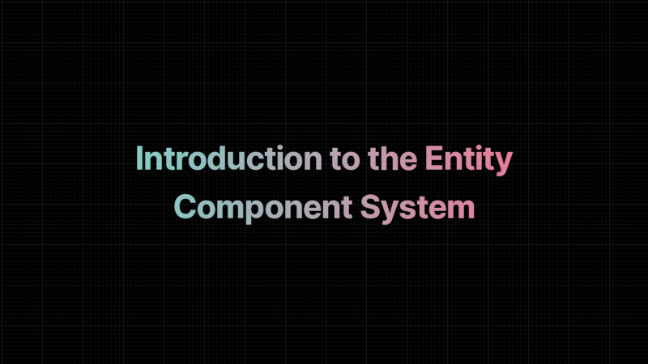
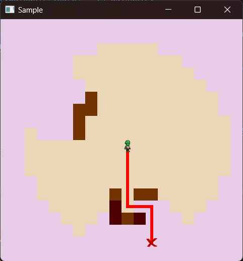

+++
title = "This Month in Rust GameDev #42 - January 2023"
transparent = true
date = 2023-02-21
draft = false
+++

<!-- no toc -->

<!-- Check the post with markdownlint-->

Welcome to the 42nd issue of the Rust GameDev Workgroup's
monthly newsletter.
[Rust] is a systems language pursuing the trifecta:
safety, concurrency, and speed.
These goals are well-aligned with game development.
We hope to build an inviting ecosystem for anyone wishing
to use Rust in their development process!
Want to get involved? [Join the Rust GameDev working group!][join]

You can follow the newsletter creation process
by watching [the coordination issues][coordination].
Want something mentioned in the next newsletter?
[Send us a pull request][pr].
Feel free to send PRs about your own projects!

[Rust]: https://rust-lang.org
[join]: https://github.com/rust-gamedev/wg#join-the-fun
[pr]: https://github.com/rust-gamedev/rust-gamedev.github.io
[coordination]: https://github.com/rust-gamedev/rust-gamedev.github.io/issues?q=label%3Acoordination

- [Announcements](#announcements)
- [Game Updates](#game-updates)
- [Engine Updates](#engine-updates)
- [Learning Material Updates](#learning-material-updates)
- [Tooling Updates](#tooling-updates)
- [Library Updates](#library-updates)
- [Other News](#other-news)
- [Requests for Contribution](#requests-for-contribution)
- [Jobs](#jobs)

<!--
Ideal section structure is:

```
### [Title]


_image caption_

A paragraph or two with a summary and [useful links].

_Discussions:
[/r/rust](https://reddit.com/r/rust/todo),
[twitter](https://twitter.com/todo/status/123456)_

[Title]: https://first.link
[useful links]: https://other.link
```

If needed, a section can be split into subsections with a "------" delimiter.
-->

## Announcements

### Rust Graphics Meetup \#3

The Rust Graphics Meetup is an online gathering where Rustaceans share technical
details of their work related to graphics and compute, not affiliated to any
particular stack. The third edition has happened on January 28th! These were the
talks:

- Hello, Blade! - [Dzmitry Malyshau]
- Implementing an Extensible Renderer - [Philip Degarmo]
- Rend3: High Performance, Cross Platform, GPU Driven Rendering in wgpu and
  WebGPU - [Connor Fitzgerald]

Learn more at the [gfx meetup repo]. The individual videos haven't been uploaded
yet, but you can watch the [full meetup here][graphics-meetup-vid]. Thanks
everyone for tuning in and helping to make this happen!

[Dzmitry Malyshau]: https://github.com/kvark
[Connor Fitzgerald]: https://github.com/cwfitzgerald
[Philip Degarmo]: https://github.com/aclysma
[graphics-meetup-vid]: https://www.youtube.com/watch?v=63dnzjw4azI
[gfx meetup repo]: https://github.com/gfx-rs/meetup

### Rust GameDev Meetup


The 23rd Rust Gamedev Meetup took place in January. You can watch the recording
of the meetup [here on Youtube][gamedev-meetup-video]. Here was the schedule
from the meetup:

- Micro Game Engine - [@AngelOnFira]
- Graphite - [@GraphiteEditor]

The meetups take place on the second Saturday every month via the [Rust Gamedev
Discord server][rust-gamedev-discord] and are also [streamed on
Twitch][rust-gamedev-twitch].

[gamedev-meetup-video]: https://youtu.be/s9kf9HVUKYE
[rust-gamedev-discord]: https://discord.gg/yNtPTb2
[rust-gamedev-twitch]: https://twitch.tv/rustgamedev
[@AngelOnFira]: https://twitter.com/AngelOnFira
[@GraphiteEditor]: https://twitter.com/GraphiteEditor

## Game Updates

### Digital Extinction


_Building Placement in Digital Extinction_

[Digital Extinction] ([GitHub][de-github], [Discord][de-discord],
[Reddit][de-reddit]) by [@Indy2222] is a 3D real-time strategy game made with
[Bevy].

This month the game had two new first time contributors, [@0HyperCube] and
[@Polostor] (Péťa Tománek).

The most notable updates are:

- several multiplayer related screens were added to the menu: sign-in /
  sign-up, game listing, and game creation,
- building draft is now semi-transparent and colored green or red based on
  obstacles,
- double clicking on a unit or building leads to the selection of all visible
  entities of the same type,
- the mouse cursor is now confined to the game window,
- the camera can be moved horizontally with arrow keys,
- pop-up in-game menu was added, it is opened with Escape key,
- work on game head-up display / panel (HUD) was initiated,
- various errors are now briefly displayed as toasts in the UI,
- support of map hashing was added and deterministic map paths are used,
- several small fixes, code quality improvements.

See [gameplay][video-game] and [menu][video-menu] screen recordings on YouTube.

A more detailed update summary is available [here][de-update-04].

[Digital Extinction]: https://de-game.org
[de-github]: https://github.com/DigitalExtinction/Game
[de-discord]: https://discord.gg/vHMFuCWGSX
[de-reddit]: https://reddit.com/r/DigitalExtinction
[@Indy2222]: https://github.com/Indy2222
[@0HyperCube]: https://github.com/0HyperCube
[@Polostor]: https://github.com/Polostor
[Bevy]: https://bevyengine.org
[video-game]: https://youtu.be/JP01dAbtoc8
[video-menu]: https://youtu.be/APTlkGnn6vA
[de-update-04]: https://mgn.cz/blog/de04/

### [Cargo Space]


_Cross-platform p2p multiplayer in Cargo Space_

[Cargo Space] ([Discord][cargospace_discord]) by
[@johanhelsing][johanhelsing_mastodon] is a co-op 2d space game where you build
a ship and fly it through space looking for new parts, fighting pirates and the
environment.

This month, sprites were added for basic character poses, as well as basic sound
effects, making the game come alive and feel more like a proper 2D platformer.

Support for [`bevy_ggrs`][bevy_ggrs]' synctest sessions was implemented. This
allows detecting de-syncs by constantly performing rollbacks and comparing world
state checksums). This caught some very rare de-sync bugs.

The game also adopted [Matchbox][cargospace_matchbox]' newly added support for
cross-platform p2p. Which means sessions between players on web and native
are now supported ([video][cargospace_cross_platform_video]).

All of this is discussed in detail the [third devlog
entry][cargospace_devlog_3].

Johan also wrote [an article][cargospace_devlog_4] on how sound effects were
implemented in a rollback-aware way, cancelling mis-predicted sounds, and
handling "late" sounds. It describes a solution that could easily be adopted for
any game made with [`bevy_ggrs`][bevy_ggrs].

[Cargo Space]: https://helsing.studio/cargospace
[cargospace_devlog_3]: https://johanhelsing.studio/posts/cargo-space-devlog-3
[cargospace_devlog_4]: https://johanhelsing.studio/posts/cargo-space-devlog-4
[cargospace_discord]: https://discord.gg/ye9UDNvqQD
[cargospace_matchbox]: https://github.com/johanhelsing/matchbox
[johanhelsing_mastodon]: https://mastodon.social/@johanhelsing
[bevy_ggrs]: https://github.com/gschup/bevy_ggrs
[cargospace_cross_platform_video]: https://mastodon.social/@johanhelsing/109681997649114818

### [Idu]


_Screenshot of a tree emerging from a cave in Idu_

[Idu] ([Discord][idu_discord])
Idu is a strategic sandbox game about growing plants that wish to reclaim
nature, developed by [Elina Shakhnovich][eli_mastodon] and
[Johann Tael][johann_mastodon] featuring a bespoke Vulkan-based engine in
Rust.

After almost a whole year of relative silence, they begun releasing new demos
in January. The new demo version 8 comes with a new renderer supporting
interactive, flowing water. Also, the simulated trees in Idu changed
a lot, as they're now able to flower, in addition to dropping leaves.
The new demo features a lot of new plant textures, branching logic, and better
rhizome and root simulation.

Player accessibility and the gameplay itself is better now as well, due to
a completely new menu and a lot of new items, such as porous gabion blocks
and ladders.

Read more and download the newest demo from [Idu's page on itch.io][itch].

[idu_discord]: https://discord.gg/MeGauteMj3
[eli_mastodon]: https://mastodon.gamedev.place/@eli
[johann_mastodon]: https://mastodon.gamedev.place/@johann
[itch]: https://epcc.itch.io/idu

### [Veloren][veloren]


_A serene river with new reflections_

[Veloren][veloren] is an open world, open-source voxel RPG inspired by Dwarf
Fortress and Cube World.

In January, Veloren released version 0.14! This update included trading with
pets, musical instrument crafting, the Sea Chapel, and many more changes. You
can read all about that update in the [release post][veloren-0.14].

Veloren's Site2 system can now be hot-reloaded. Site2 allows you to describe
procedures for how objects like houses, trees, or bridges should be generated.
Hot-reloading allows you to change the Site2 code and watch the changes take
effect in real time. The official 2023 Veloren OST was also released, and can be
[watched on YouTube][veloren-ost].

December's full weekly devlogs: "This Week In Veloren...":
[#204][veloren-204].

[veloren]: https://veloren.net
[veloren-204]: https://veloren.net/devblog-204
[veloren-ost]: https://www.youtube.com/watch?v=yNxxCwwKyes
[veloren-0.14]: https://veloren.net/release-0-14/

## Engine Updates

### [Fyrox]


[Fyrox] ([Discord][fyrox_discord], [Twitter][fyrox_twitter]) is a game engine that
aims to be easy to use and provide a large set of out-of-the-box features. In January
it hit version 0.29 and got the following features:

- Animation system rework
- Animation editor
- Animation blending state machine editor rework
- Sprite sheet editor
- Ability to change scene settings
- Improved WebAssembly support
- Customizable graph update pipeline
- Node and property selector widgets
- Message passing for scripts
- Reflection refactoring to support interrior mutability
- Deterministic particle systems
- Ability to animate material properties
- Various bug fixes

You can read more about the changes in the [feature highlights post][fyrox-0.29].

[Fyrox]: https://github.com/FyroxEngine/Fyrox
[fyrox_discord]: https://discord.com/invite/xENF5Uh
[fyrox_twitter]: https://twitter.com/DmitryNStepanov
[fyrox-0.29]: https://fyrox.rs/blog/post/feature-highlights-0-29/

## Learning Material Updates

### [Introduction to the Entity Component System][tut-ecs-intro]



[@indiedevcasts] published [a new blog post][tut-ecs-intro],
exploring object-oriented and data-oriented designs before
giving an introduction to the Entity Component System paradigm.

[tut-ecs-intro]: https://indiedevcasts.com/posts/ecs-introduction
[@indiedevcasts]: https://twitter.com/indiedevcasts

## Tooling Updates

### [Foxtrot]


[Foxtrot] was created by Jan Hohenheim ([@janhohenheim]) as an all-in-one
starting point for 3D projects made in Bevy. While he appreciated that other
Bevy templates showed nicely how to wire up systems and setup a game loop,
he was missing a showcase for commonly used features that are scattered around
various libraries. So he created Foxtrot, where he collected most basic features
 he could need for future projects or jams. The current version [v0.1.5] features:

- loading a 3D level from GLTF files
- automatically assigning physics colliders
- a custom dialog system
- saving and loading the game
- a force-based third-person character controller
- shaders
- pathfinding
- a flexible camera system with easings
- a custom ingame editor window for live tweaks such as spawning new objects.

[Foxtrot]: https://github.com/janhohenheim/foxtrot
[@janhohenheim]: https://github.com/janhohenheim
[v0.1.5]: https://github.com/janhohenheim/foxtrot/releases/tag/v0.1.5

### [Graphite][graphite-website]


Graphite ([website][graphite-website], [GitHub][graphite-repo],
[Discord][graphite-discord], [Twitter][graphite-twitter]) is a free,
in-development raster and vector 2D graphics editor based around a Rust-powered
node graph compositing engine.

New features from January's [sprint 22][graphite-sprint-22]:

- _Picture This:_ Imported images are now part of the node graph. The new
  _Image Frame_ node converts bitmap data into a vector rectangle holding the
  image. This paves the way for other vector data like shapes and text to soon
  be converted into nodes and composited alongside images.
- _Instant Iterations:_ Incremental graph compilation avoids recompiling the
  whole graph each time an edit is made or a value changes. This makes
  iteration faster and enables caching of intermediate computations for faster
  rendering.

Later this month, the Alpha Milestone 2 release will launch with new node graph
features, a revamped website, and a wider-reaching project announcement. Join
the [newsletter][graphite-newsletter] and stay tuned.

[Open Graphite][graphite-editor] in your browser and start creating! Share your
designs with #MadeWithGraphite on Twitter.

[graphite-website]: https://graphite.rs
[graphite-repo]: https://github.com/GraphiteEditor/Graphite
[graphite-discord]: https://discord.graphite.rs
[graphite-twitter]: https://twitter.com/GraphiteEditor
[graphite-sprint-22]: https://github.com/GraphiteEditor/Graphite/milestone/22
[graphite-newsletter]: https://graphite.rs/#newsletter
[graphite-editor]: https://editor.graphite.rs

## Library Updates

### [big-brain]

[big-brain] ([GitHub][big-brain-github], [Discord][big-brain-discord]) by [@zkat]
is a highly-parallel [Utility AI][big-brain-utility-ai] library
for the Bevy game engine.

[big-brain] recently tagged [v0.16.0][big-brain-v16],
bringing with it a couple of breaking changes and a few goodies.

Probably the biggest change in this release is removal of the blanket
[`ActionBuilder`][big-brain-action-builder] and [`ScorerBuilder`][big-brain-scorer-builder]
implementations for `Clone` types. This is a fairly significant breaking change,
but one that is fairly easy to resolve: simply use the new `#[derive(ActionBuilder)]`
and `#[derive(ScorerBuilder)]` macros to derive the necessary implementations
for your Action and Scorer Components and you should be good to go.

Finally, since the recent [merging of the bevy scheduler changes][big-brain-bevy-scheduler-changes],
big-brain users should expect the next version of big-brain to bring with it
some significant breaking changes to scheduling, so keep an eye out for that
and be mindful of building a lot on top of the current [`BigBrainStage`][big-brain-stage]
(which is used by the default `BigBrainPlugin`).

_Discussions: [Mastodon][zkat-mastodon-ann]_

[big-brain]: https://crates.io/crates/big-brain
[big-brain-github]: https://github.com/zkat/big-brain
[big-brain-discord]: https://discord.com/channels/691052431525675048/829441190067306596
[@zkat]: https://github.com/zkat
[big-brain-utility-ai]: https://en.wikipedia.org/wiki/Utility_system
[big-brain-v16]: https://github.com/zkat/big-brain/releases/tag/v0.16.0
[big-brain-action-builder]: https://docs.rs/big-brain/0.16.0/big_brain/actions/trait.ActionBuilder.html
[big-brain-scorer-builder]: https://docs.rs/big-brain/0.16.0/big_brain/scorers/trait.ScorerBuilder.html
[big-brain-bevy-scheduler-changes]: https://tech.lgbt/@alice_i_cecile/109815432105482093
[big-brain-stage]: https://docs.rs/big-brain/0.16.0/big_brain/enum.BigBrainStage.html
[zkat-mastodon-ann]: https://toot.cat/@zkat/109776883506682388

### [RustySynth]

[

_Video: an example of realtime MIDI synthesis with RustySynth on rust-sfml_
][rustysynth-video]

[RustySynth] is a SoundFont MIDI synthesizer written in pure Rust.
The purpose of this library is to provide MIDI music playback functionality
for any Rust application without complicated dependencies.
The code base is lightweight and can be used with any audio driver
that supports streaming audio (e.g. [rust-sfml]).

Features:

- Tuned mainly for gamedev and has low CPU usage.
- Support for standard MIDI files.
- No dependencies other than the standard library.
- Available under a permissive license (MIT).

[rustysynth-video]: https://www.youtube.com/watch?v=o9rPTJIPmVk
[RustySynth]: https://github.com/sinshu/rustysynth
[rust-sfml]: https://github.com/jeremyletang/rust-sfml

### [tween]

`tween` is a library for manipulating values in stylish and beautiful ways.
It has been almost entirely rewritten for `v2.0.0`, now featuring a
significantly improved API, fewer generics, and much, much faster performance.

Additionally, it has added support for Looping, Oscillating, and Extrapolating tweens.
With all of this, making custom tweens is much easier. An example of making a Bezier
tween is included.

[tween]: https://github.com/sanbox-irl/tween

### [scene-graph]

`scene-graph` is a library for creating graph structures similar to the
one used in engines like Unity or Unreal. It is fast, performant, and easy to
manipulate. It's especially useful for user interfaces. Although only in `v0.1.0`,
feedback would be very appreciated.

[scene-graph]: https://github.com/sanbox-irl/scene-graph

### [torchbearer]


_An exemple of torchbearer in action,
demonstrating both pathfinding and field of view_

[torchbearer] by [@redwarp] is a library that provides a set of tools
to find your path in a grid based dungeon. Specifically,
it provide a quick implementation of pathfinding and field of view algorithm.

The 0.6.x version rewrites the field of view algorithm to cast vision rays
in a bresenham circle around the point of origin.
This change from its [original implementation][torchbearer-orig] makes it faster
as it removes the needs for error correction.

[torchbearer]: https://github.com/redwarp/torchbearer
[@redwarp]: https://github.com/redwarp
[torchbearer-orig]: https://sites.google.com/site/jicenospam/visibilitydetermination

### [Matchbox]


[Matchbox] is a library for easily establishing unreliable, unordered,
peer-to-peer WebRTC data connections using rust WASM. This enables low-latency
multiplayer browser games.

Originally, it was written for web assembly, but a native implementation using
[WebRTC.rs] has been available since 0.4. However, a few minor incompatibilities
between the two implementations meant connections between native and web
were not possible.

In version 0.5, however, [Alex Rozgo] fixed the the last of these issues. And
cross-play sessions are now finally fully supported.

In addition, [johanhelsing][johanhelsing_mastodon] fixed a serious bug that used
to cause disconnections on recent versions of Firefox.

The tutorial series on [how to make a p2p web game with Bevy, GGRS and
Matchbox][extreme_bevy] was also updated to the latest versions of all three
libraries.

_Discussions: [Mastodon][cargospace_cross_platform_video]_

[extreme_bevy]: https://johanhelsing.studio/posts/extreme-bevy
[Matchbox]: https://github.com/johanhelsing/matchbox
[WebRTC.rs]: https://webrtc.rs
[Alex Rozgo]: https://github.com/rozgo

### [miniquad]


_Miniquad/macroquad examples rendered by Metal API_

[miniquad] is a safe and cross-platform rendering library
focused on portability and low-end platforms support.

This month metal backend [PR][miniquad_metal_pr] finally landed on miniquad!

It is not yet ready for any production use, but it is available on crates.io
as 0.4.0-alpha.

With this change, miniquad support webgl1, gl2, gles2/gles3, gl3+,
metal on web, macOS, iOS, Android, Windows, and Linux.

[miniquad]: https://github.com/not-fl3/miniquad
[miniquad_metal_pr]: https://github.com/not-fl3/miniquad/pull/344

## Other News

- Other game updates:
  - [Hydrofoil] is getting closer to their February release date.
  - Tiny Glade now [has terrain modification][tiny-glade-terrain].
  - Thetawave now [has a functional boss enemy][thetawave-boss].
  - 8bit Duels is just released their [fifth devlog][8bit-duels].
  - Combine And Conquer just released [version 0.4.0][combine-and-conquer].
  - Your Only Move is Hustle is now available on Steam.
  - TheGrimsey write a devblog ["Magic Missiles & the
    Registries"][thegrimsey-devlog].
  - Flesh has a [new redrawn background in the first area][flesh-1], and has
    [been tested to run on the Steam Deck][flesh-2].
  - [DGS] is a multiplayer game of Go, with shperical fields and VR support.
  - Triverse has a [set of devlogs out][triverse-blogs], with the most recent
    covering [scenarios and playability][triverse-scenarios].
  - Fish Folk: Punchy has [released version 0.3][fishfolk-punchy].
  - Life Code has [a new video][life-code-video] explaining how the diet
    selection tool works.
  - Digg is a new game being made with Bevy, and has [a devlog][digg-devlog]
    that walks through the first two weeks of development.
  - [Revolver Time] is a game made in 1 week with Godot and Rust, and has
    [a video][revolver-time-video] explaining how it was made.
  - [Canal Mania] is a game created for the Historically Accurate Game Jam.

[Hydrofoil]: https://twitter.com/HydrofoilG
[tiny-glade-terrain]: https://twitter.com/anastasiaopara/status/1617925842163863554
[thetawave-boss]: https://twitter.com/carlosupina/status/1611808954455146498
[8bit-duels]: https://reddit.com/r/rust_gamedev/comments/102kwgf/8bit_duels_devlog_part_5
[combine-and-conquer]: https://buckmartin.de/combine-and-conquer/2023-01-14-v0.4.0.html
[thegrimsey-devlog]: https://twitter.com/TheGrimsey/status/1615788141314510848
[flesh-1]: https://twitter.com/Im_Oab/status/1616542479951724546
[flesh-2]: https://twitter.com/Im_Oab/status/1619230923970736128
[DGS]: https://reddit.com/r/rust_gamedev/comments/10ifm62/dgs_the_multiplayer_game_of_go
[triverse-blogs]: https://cragwind.itch.io/triverse/devlog
[triverse-scenarios]: https://cragwind.itch.io/triverse/devlog/485898/scenarios-and-playability
[fishfolk-punchy]: https://reddit.com/r/rust_gamedev/comments/10qwgcn/fish_folk_punchy_v03
[life-code-video]: https://twitter.com/LifeCodeGame/status/1611856359003426816
[digg-devlog]: https://reddit.com/r/rust_gamedev/comments/10of2sz/creating_a_new_game_with_bevy
[Revolver Time]: https://allocatedartist.itch.io/revolver-time
[revolver-time-video]: https://youtube.com/watch?v=LNcGzn7ZsNI
[Canal Mania]: https://lee-orr.itch.io/canal-mania

- Other learning material updates:
  - [Native iOS Touch Events w/ Rust] is a tutorial on how to use Rust to
    create native iOS touch events.
  - [Bevy Basics video series] is a series of videos that covers the basics of
    Bevy.
  - [Platformer in Bevy video series] is a series of videos that covers how to
    make a platformer in Bevy.

[Native iOS Touch Events w/ Rust]: https://itnext.io/rust-native-ios-touch-events-8b01418e0f3b
[Bevy Basics video series]: https://youtube.com/playlist?list=PL6uRoaCCw7GN_lJxpKS3j-KXuThRiSXc6
[Platformer in Bevy video series]: https://youtube.com/playlist?list=PL6uRoaCCw7GN_lJxpKS3j-KXuThRiSXc6

- Other engine updates:
  - [alkahest-rs] released put about a video about [implementing texture batching][alkahest-texture-batching].
  - [godot-rust] saw large improvements to the Godot 3 bindings.
  - [petrichor64] is a retro-inspired small 3D fantasy engine.

[alkahest-rs]: https://twitter.com/alkimia_studios/status/1610802953828405248
[alkahest-texture-batching]: https://www.youtube.com/watch?v=quoHV9HHHJA
[godot-rust]: https://twitter.com/GodotRust/status/1615606253052362752
[petrichor64]: https://makeavoy.itch.io/petrichor64

- Other tooling updates:
  - [Ten Minute Physics] is a reimplementation of Matthias Müller's "Ten Minute
    Physics" demos in Rust with WASM + WebGL.
  - [rgis] is a geospatial data viewer written in Rust.

[Ten Minute Physics]: https://reddit.com/r/rust/comments/10l4ae5/ten_minute_physics_demos_in_rust_with_wasm_webgl
[rgis]: https://github.com/frewsxcv/rgis

- Other tooling updates:
  - [wgpu v0.15, naga v0.11] were released.
  - [raster_fonts], a library for deserializing the resulting metadata, was
    announced.
  - [nvtt] has been updated to use Nvidia Texture Tools 3.
  - [oxidized_navigation] is a nav-mesh generation & pathfinding crate to use
    with Bevy.
  - [VPlugin] is a Rust framework to develop and use plugins within your
    project, without worrying about the low-level details. 
  - [egui_glium] is looking for a new maintainer.
  - [direct-storage] provides Rust bindings for DirectStorage.
  - [bones] is a work-in-progess, opinionated game framework built on Bevy.
  - [airsim-client] is a Rust client library for interacting with Microsoft
    Airsim.
  - [Rapier] wrote a year in review for 2022, and took a look ahead to 2023.
  - [bevy-magic-light-2d] is an experimental dynamic 2D global illumination
    system for Bevy, based on SDF ray-marching and screen space irradiance cache
    probes.
  - [notan v0.9] was released.

[wgpu v0.15, naga v0.11]: https://reddit.com/r/rust/comments/10lf10i/wgpu_015_and_naga_011
[raster_fonts]: https://reddit.com/r/rust_gamedev/comments/100vmqq/announcing_font2img_and_raster_fonts
[nvtt]: https://reddit.com/r/rust_gamedev/comments/10eq1uh/nvtt_rs_has_been_updated_to_use_nvidia_texture
[oxidized_navigation]: https://twitter.com/TheGrimsey/status/1615063433367494656
[VPlugin]: https://github.com/VPlugin/VPlugin
[egui_glium]: https://twitter.com/ernerfeldt/status/1621811309284130816
[direct-storage]: https://github.com/Tsukisoft/direct-storage-rs
[bones]: https://reddit.com/r/rust_gamedev/comments/10j74lt/bones
[airsim-client]: https://reddit.com/r/rust_gamedev/comments/10ij9lv/airsimclient
[Rapier]: https://dimforge.com/blog/2023/01/22/the-year-2022-in-dimforge
[bevy-magic-light-2d]: https://github.com/zaycev/bevy-magic-light-2d
[notan v0.9]: https://reddit.com/r/rust/comments/10pwgka/released_a_new_version_of_notan_a_sdllike_lib


## Requests for Contribution

<!-- Links to "good first issue"-labels or direct links to specific tasks -->

- ['Are We Game Yet?' wants to know about projects/games/resources that
  aren't listed yet][awgy].
- [Graphite is looking for contributors][graphite-contribute] to help build the
  new node graph and 2D rendering systems.
- [winit's "difficulty: easy" issues][winit-issues].
- [Backroll-rs, a new networking library][backroll-rs].
- [Embark's open issues][embark-open-issues] ([embark.rs]).
- [wgpu's "help wanted" issues][wgpu-issues].
- [luminance's "low hanging fruit" issues][luminance-fruits].
- [ggez's "good first issue" issues][ggez-issues].
- [Veloren's "beginner" issues][veloren-beginner].
- [A/B Street's "good first issue" issues][abstreet-issues].
- [Mun's "good first issue" issues][mun-issues].
- [SIMple Mechanic's good first issues][simm-issues].
- [Bevy's "good first issue" issues][bevy-issues].

[awgy]: https://github.com/rust-gamedev/arewegameyet#contribute
[graphite-contribute]: https://graphite.rs/contribute
[winit-issues]: https://github.com/rust-windowing/winit/issues?q=is%3Aopen+is%3Aissue+label%3A%22difficulty%3A+easy%22
[backroll-rs]: https://github.com/HouraiTeahouse/backroll-rs/issues
[embark.rs]: https://embark.rs
[embark-open-issues]: https://github.com/search?q=user:EmbarkStudios+state:open
[wgpu-issues]: https://github.com/gfx-rs/wgpu/issues?q=is%3Aissue+is%3Aopen+label%3A%22help+wanted%22
[luminance-fruits]: https://github.com/phaazon/luminance-rs/issues?q=is%3Aissue+is%3Aopen+label%3A%22low+hanging+fruit%22
[ggez-issues]: https://github.com/ggez/ggez/labels/%2AGOOD%20FIRST%20ISSUE%2A
[veloren-beginner]: https://gitlab.com/veloren/veloren/issues?label_name=beginner
[abstreet-issues]: https://github.com/a-b-street/abstreet/issues?q=is%3Aissue+is%3Aopen+label%3A%22good+first+issue%22
[mun-issues]: https://github.com/mun-lang/mun/labels/good%20first%20issue
[simm-issues]: https://github.com/mkhan45/SIMple-Mechanics/labels/good%20first%20issue
[bevy-issues]: https://github.com/bevyengine/bevy/labels/D-Good-First-Issue

## Jobs

- [Ambient](https://www.ambient.run/career)
  (Remote)
  - Engine Programmer
  - Rendering Engineer
  - Open Source Community Engineer
- [Embark Studios](https://careers.embark-studios.com/jobs)
  (Stockholm/Hybrid Remote)
  - Various roles

------

That's all news for today, thanks for reading!

Want something mentioned in the next newsletter?
[Send us a pull request][pr].

Also, subscribe to [@rust_gamedev on Twitter][@rust_gamedev]
or [/r/rust_gamedev subreddit][/r/rust_gamedev] if you want to receive fresh news!

<!--
TODO: Add real links and un-comment once this post is published
**Discuss this post on**:
[/r/rust_gamedev](TODO),
[Twitter](TODO),
[Mastodon](TODO),
[Discord](https://discord.gg/yNtPTb2).
-->

[/r/rust_gamedev]: https://reddit.com/r/rust_gamedev
[@rust_gamedev]: https://twitter.com/rust_gamedev
