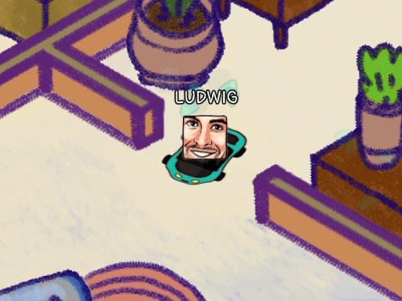
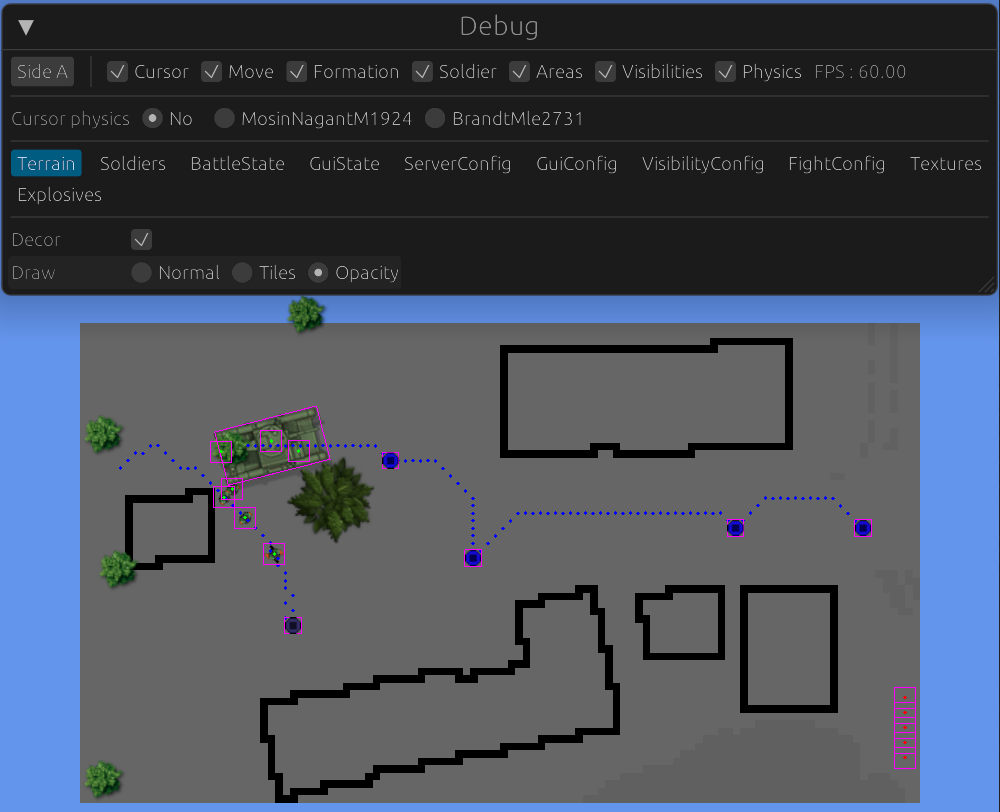
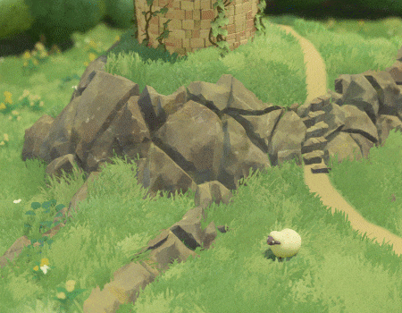
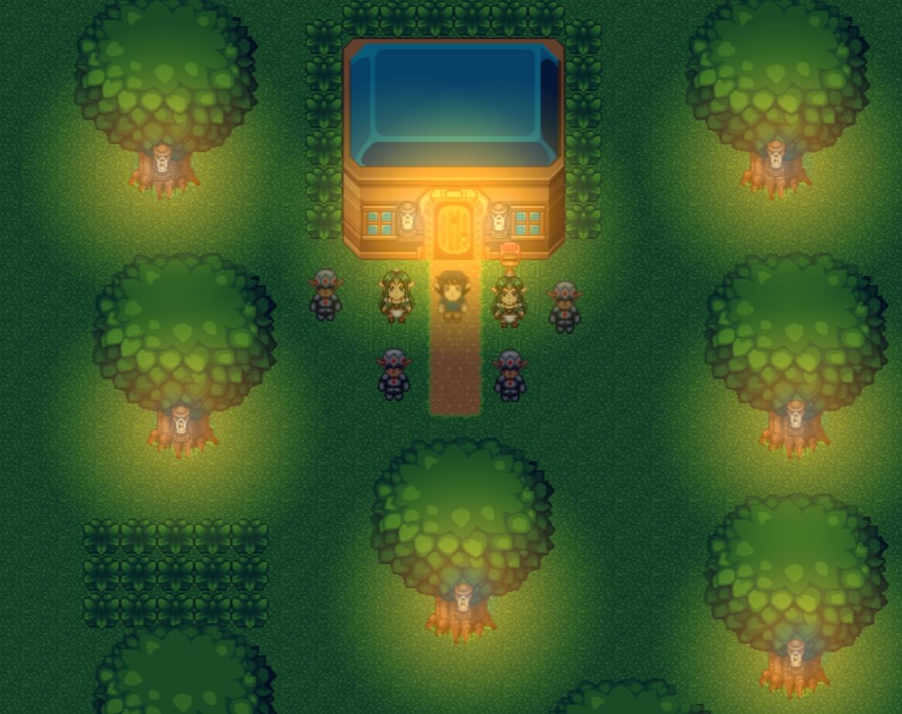
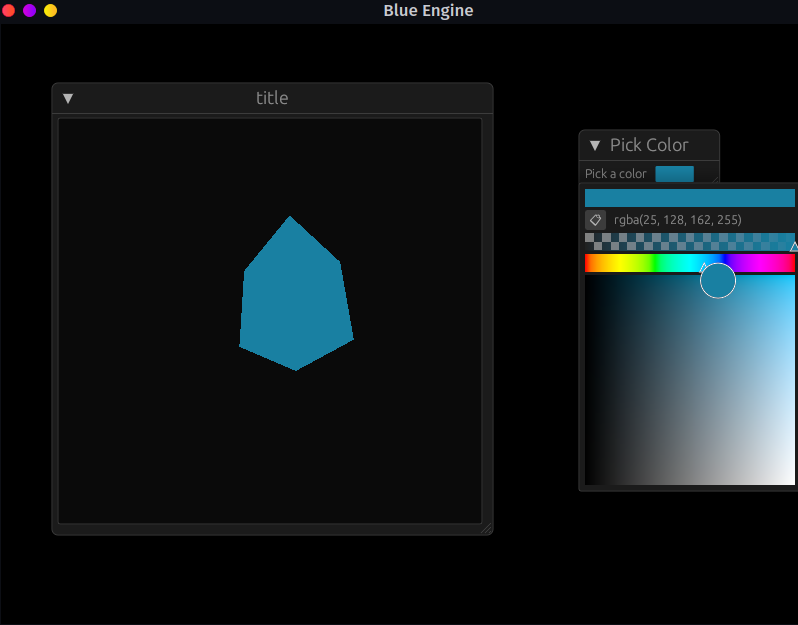
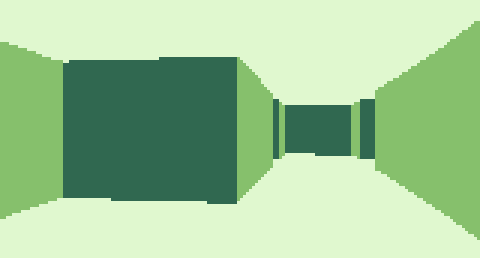
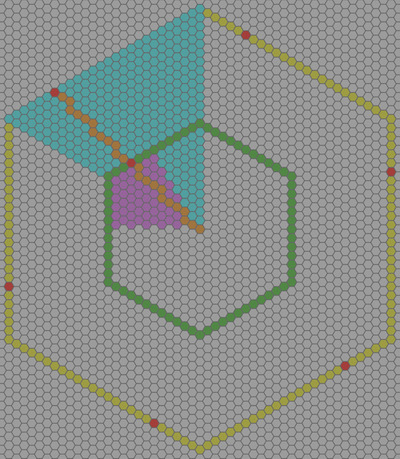
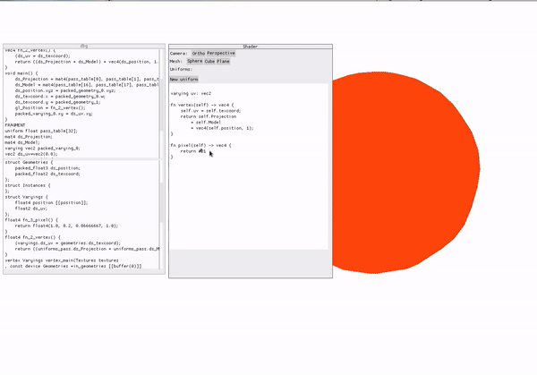

+++
title = "This Month in Rust GameDev #43 - February 2023"
transparent = true
date = 2023-03-05
draft = true
+++

<!-- no toc -->

<!-- Check the post with markdownlint-->

Welcome to the 43rd issue of the Rust GameDev Workgroup's
monthly newsletter.
[Rust] is a systems language pursuing the trifecta:
safety, concurrency, and speed.
These goals are well-aligned with game development.
We hope to build an inviting ecosystem for anyone wishing
to use Rust in their development process!
Want to get involved? [Join the Rust GameDev working group!][join]

You can follow the newsletter creation process
by watching [the coordination issues][coordination].
Want something mentioned in the next newsletter?
[Send us a pull request][pr].
Feel free to send PRs about your own projects!

[Rust]: https://rust-lang.org
[join]: https://github.com/rust-gamedev/wg#join-the-fun
[pr]: https://github.com/rust-gamedev/rust-gamedev.github.io
[coordination]: https://github.com/rust-gamedev/rust-gamedev.github.io/issues?q=label%3Acoordination

- [Announcements](#announcements)
- [Game Updates](#game-updates)
- [Engine Updates](#engine-updates)
- [Learning Material Updates](#learning-material-updates)
- [Tooling Updates](#tooling-updates)
- [Library Updates](#library-updates)
- [Other News](#other-news)
- [Popular Workgroup Issues in Github](#popular-workgroup-issues-in-github)
- [Discussions](#discussions)
- [Requests for Contribution](#requests-for-contribution)
- [Jobs](#jobs)

<!--
Ideal section structure is:

```
### [Title]


_image caption_

A paragraph or two with a summary and [useful links].

_Discussions:
[/r/rust](https://reddit.com/r/rust/todo),
[twitter](https://twitter.com/todo/status/123456)_

[Title]: https://first.link
[useful links]: https://other.link
```

If needed, a section can be split into subsections with a "------" delimiter.
-->

## Announcements

## Game Updates

### Cootsmania



[Cootsmania] ([GitHub][coots-github])
is a multiplayer racing game made for [Ludwig Jam 2023][ludwig-jam] in 10 days
by [@kuviman] (programming), [@rincs] (art), and [@Brainoid] (music & sfx).

The game is about racing other players around Ludwig's house
towards the next Coots (Ludwig's cat) location.
Every round half of the players get eliminated and eventually winner is decided.

[See trailer on YouTube][coots-trailer].

The game is written using a custom engine: [Geng][geng].

[Cootsmania]: https://kuviman.itch.io/cootsmania
[ludwig-jam]: https://itch.io/jam/ludwig-2023
[coots-github]: https://github.com/kuviman/cootsmania
[coots-trailer]: https://youtu.be/N0bQDZTDr2Y
[geng]: https://github.com/kuviman/geng
[@kuviman]: https://github.com/kuviman
[@rincs]: https://rincsart.com
[@Brainoid]: https://twitter.com/brainoidgames

### [Tunnet][tunnet-itch]


_Tunnels and computer networks_

Tunnet ([Steam][tunnet-steam], [Itch.io][tunnet-itch]) by
[@puzzled\_squid][puzzled_squid] is a small puzzle/exploration game where you
play as a robot technician who has been tasked with building a computer network
in an underground complex.

The project is implemented using the Bevy engine. It is currently under
development and is expected to be released later this year.
This month, the announcement trailer and the first few pages of the manual have
been published on the [project page][tunnet-itch].

[tunnet-itch]: https://puzzled-squid.itch.io/tunnet
[tunnet-steam]: https://store.steampowered.com/app/2286390/Tunnet
[puzzled_squid]: https://puzzledsquid.xyz

### [Open Combat][OpenCombat_website]


_Game now includes live debug window_

Open Combat ([Website][OpenCombat_website], [GitHub][OpenCombat_github],
[Discord][OpenCombat_discord]) is a real time tactical game
which takes place during the 2nd World War.

Some major changes this month :

- A live debug window has been introduced (using [egui][egui_github]
  and its [ggegui][ggegui_github] integration). It allows to live-modify and
  adjust the gameplay of the running game.
- A big source code split has been done (see [the merge request][OpenCombat_split_mr])
  which separated the game logic and GUI.
  It allows running the game logic as a standalone server
  and working on different game parts more easily.
- Integration of [puffin][puffin_github] to inspect performances

The developers are also working on high-definition infantry sprites integration
and on a high-definition map (and are searching for graphic
designer help!).

[OpenCombat_website]: https://opencombat.bux.fr/
[OpenCombat_github]: https://github.com/buxx/OpenCombat
[OpenCombat_discord]: https://discord.gg/6P2vtFh2Px
[OpenCombat_split_mr]: https://github.com/buxx/OpenCombat/pull/104
[egui_github]: https://github.com/emilk/egui
[ggegui_github]: https://github.com/NemuiSen/ggegui
[puffin_github]: https://github.com/EmbarkStudios/puffin

### [Tiny Glade]



[@anopara] and [@h3r2tic] recently added [terrain editing] to [Tiny Glade].
They then faced an important game design question: how would sheep handle
it? Well, these cuddly little floofs are not mountain goats,
so the developers gave them tiny umbrellas.

Read more in their latest [Steam blogpost].

[@anopara]: https://twitter.com/anastasiaopara
[@h3r2tic]: https://twitter.com/h3r2tic
[Tiny Glade]: https://store.steampowered.com/app/2198150/Tiny_Glade/
[terrain editing]: https://store.steampowered.com/news/app/2198150/view/3651890488940565185
[Steam blogpost]: https://store.steampowered.com/news/app/2198150/view/3669907614196390626

### [Legend of Worlds][low-website]



[Legend of Worlds][low-website] ([Discord][low-discord], [Twitter][low-twitter])
is a cross-platform, cross-play, 2D online sandbox multiplayer
experience where you can join, play, create and share player-created worlds.

[The latest dev log][low-devlog] from [Rou][low-twitter] covers an update
to the open-source game engine created for this game.

Legend of Worlds uses Toxoid Engine. Toxoid is a cross-platform, polyglot,
open-source WebAssembly game engine written in Rust.
The architecture has been updated so that Toxoid games can now share memory
directly between WASM components, and map access to the data values rather than
deserializing a set of values every time, resulting in "massive performance gains".

[low-website]: http://legendofworlds.com
[low-twitter]: https://twitter.com/DreamsectGames
[low-discord]: https://discord.gg/aqD7H3F7nz
[low-devlog]: http://legendofworlds.com/dev-log-2

## Engine Updates

### [godot-rust][gd-github]


The [release of Godot version 4.0][gd-godot4] marks a significant milestone in
the game development ecosystem. godot-rust aims to bring the open-source
game engine to the Rust community.

For the [Godot 4 (GDExtension) binding][gd-gdextension], February was a very
productive month, with a handful of new contributors and [16 merged pull
requests][gd-pulse]. An up-to-date feature overview is available
[in issue #24][gd-24]. Last month's changes include:

- Support for arrays, packed arrays and dictionaries
- Support for some geometric types (vectors, quaternions, colors)
- Bugfixes regarding ref-counts, use-after-free, memory leaks

On the [Godot 3 (GDNative) side][gd-gdnative], lots of quality-of-life
improvements have found their way into the library:

- Class self-registration based on `inventory` crate
- Flexible self types: `fn instance(#[self] this: Instance<Self>)`
- Trait entry point: `#[callbacks] impl GDNativeCallbacks for MyLibrary {...}`

Both bullet lists are examples for how the GDNative and GDExtension bindings
mutually benefit each other, reusing proven designs for user-friendly Rust APIs.

[gd-github]: https://github.com/godot-rust
[gd-gdextension]: https://github.com/godot-rust/gdextension
[gd-gdnative]: https://github.com/godot-rust/gdnative
[gd-godot4]: https://godotengine.org/article/godot-4-0-sets-sail/
[gd-pulse]: https://github.com/godot-rust/gdextension/pulse/monthly
[gd-24]: https://github.com/godot-rust/gdextension/issues/24

### [Blue Engine][be-github]



[Blue Engine][be-github] by [@ElhamAryanpur] is an easy to use, extendable, and
portable graphics engine built to make it easier to render 2D or 3D graphics.

Although the month of Febuary was slow for the development of the engine, there
have been significant efforts towards addition of [documentation][be-docs] and the
eventual release of the next version. In the meantime, the plugins have favored significant
updates and development in the month, notably the [egui][be-egui] plugin.

Now the [egui plugin][be-egui] allow you to render objects of the engine direction
inside an egui window. This feature was built in collaboration with [@Noswad].

This also introduced a new option in Objects: `is_visible: bool`
which hides an object
from getting rendered if set to false (set to `true` as default). This allows
you to hide an object from getting rendered on the background of egui, and can then
add it to be rendered inside an egui window instead. So far the system on the second
design, suggestions are welcome to cement a better design. Refer to [example][be-egui-example].

[be-github]: https://github.com/AryanpurTech/BlueEngine
[be-egui]: https://github.com/AryanpurTech/BlueEngineEGUI
[be-egui-example]: https://github.com/AryanpurTech/BlueEngineEGUI/blob/master/examples/custom_3d.rs
[be-docs]: https://docs.rs/blue_engine
[@ElhamAryanpur]: https://github.com/ElhamAryanpur
[@Noswad]: https://github.com/TheNoswad

## Learning Material Updates

### [Write a First Person Game in 2KB with Rust][firstperson-wasm4]



[@grantshandy] published an [article][firstperson-wasm4] about creating a simple
first-person game in Rust with [WASM-4]. It covers the basics of a ray casting
algorithm and minifying Rust with WebAssembly. You can play the finished game
[here][firstperson-wasm4-game].

_Discussion: [/r/rust](https://reddit.com/r/rust/comments/11bdsys/fps_game_2kb_rust)_

[@grantshandy]: https://github.com/grantshandy/
[firstperson-wasm4]: https://grantshandy.github.io/posts/raycasting
[firstperson-wasm4-game]: https://grantshandy.github.io/wasm4-raycaster/
[WASM-4]: https://wasm4.org

## Tooling Updates

### Sprite and Pixel Art Editor


_Screenshot of the editor_

A sprite and pixel art editor made with egui and macroquad is being
developed by @yds12 ([github][yds-github], [mastodon][yds-mastodon]).
The project is already usable, but has not been made public yet. Current
features are

- Drawing w/ brush, eraser, lines, rectangles, bucket (fill w/ color)
- Color selector, editable palette and eyedropper (pick color from canvas)
- Resize or completely erase the canvas
- Move camera, zoom in and out
- Selection (rectangular only for now), deleted, copied and pasted; flip
  selection (horizontal or vertical)
- Layers: create, remove, moved up/down, control visibility and opacity
- Spritesheet: specify how many columns and rows your image has, and an
  animated preview will be displayed in a window w/ configurable scale
- Save/load projects (with all its settings), export and import PNG/JPG
- Status bar w/ info about canvas size, canvas position, color under mouse, etc

The source is planned to be released in the next few weeks

[yds-github]: https://github.com/yds12
[yds-mastodon]: https://fosstodon.org/@yds/

## Library Updates

### [hexx]



[hexx] is a hexagonal tools library made by [@ManevilleF]:

- Manipulate hexagonal coordinates, draw rings, lines, wedges, etc.
- Generate hexagonal grids, with conversion between your world
  and the hexagonal coordinates system.
- Compute 3d meshes for your hexagons.

It's engine-agnostic, but was made with [bevy] integration in mind
and provides 2D and 3D [examples][hexx-examples].

_Discussions: [Twitter](https://twitter.com/ManevilleF/status/1625159292490854400)_

[hexx]: https://github.com/ManevilleF/hexx
[bevy]: https://github.com/bevyengine/bevy
[@ManevilleF]: https://linktr.ee/ManevilleF
[hexx-examples]: https://github.com/ManevilleF/hexx/tree/main/examples

### [nanoshredder]


_macroquad's shadertoy example with metal/glsl preview_

[Nanoshredder] is an experimental fork of
[makepad's shader-compiler][makepad-shader-compiler].

It compiles rust-like DSL into GLSL, Metal and HLSL.

This month it got a little [web demo]:
[macroquad's shadertoy][macroquad-shadertoy], a live editor with
generated Metal/GLSL preview.

[nanoshredder]: https://github.com/not-fl3/nanoshredder
[makepad-shader-compiler]: https://github.com/makepad/makepad/tree/master/platform/shader_compiler
[web demo]: https://not-fl3.github.io/miniquad-samples/shadertoy_cross.html
[macroquad-shadertoy]: https://github.com/not-fl3/macroquad/blob/master/examples/shadertoy.rs

## Popular Workgroup Issues in Github

<!-- Up to 10 links to interesting issues -->

## Other News

<!-- One-liners for plan items that haven't got their own sections. -->

## Discussions

<!-- Links to handpicked reddit/twitter/urlo/etc threads that provide
useful information -->

## Requests for Contribution

<!-- Links to "good first issue"-labels or direct links to specific tasks -->

## Jobs

<!-- An optional section for new jobs related to Rust gamedev -->

------

That's all news for today, thanks for reading!

Want something mentioned in the next newsletter?
[Send us a pull request][pr].

Also, subscribe to @rust_gamedev on [Twitter][rust_gamedev_twi],
[Mastodon][rust_gamedev_mas], or [/r/rust_gamedev subreddit][/r/rust_gamedev]
if you want to receive fresh news!

<!--
TODO: Add real links and un-comment once this post is published
**Discuss this post on**:
[/r/rust_gamedev](TODO),
[Twitter](TODO),
[Mastodon](TODO),
[Discord](https://discord.gg/yNtPTb2).
-->

[/r/rust_gamedev]: https://reddit.com/r/rust_gamedev
[rust_gamedev_twi]: https://twitter.com/rust_gamedev
[rust_gamedev_mas]: https://mastodon.gamedev.place/@rust_gamedev
