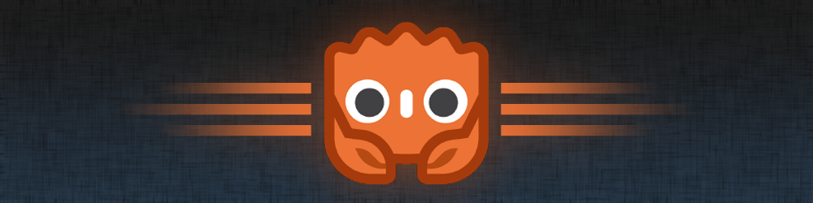
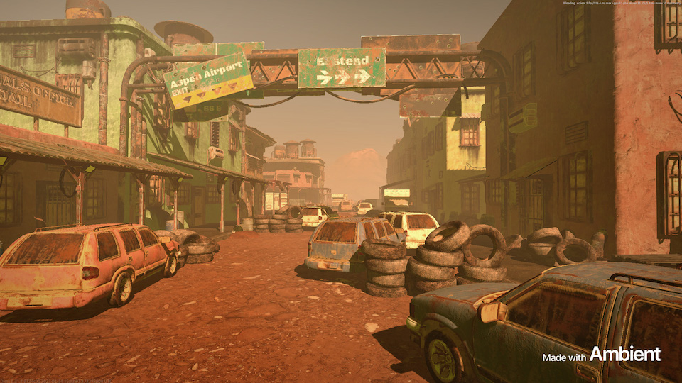
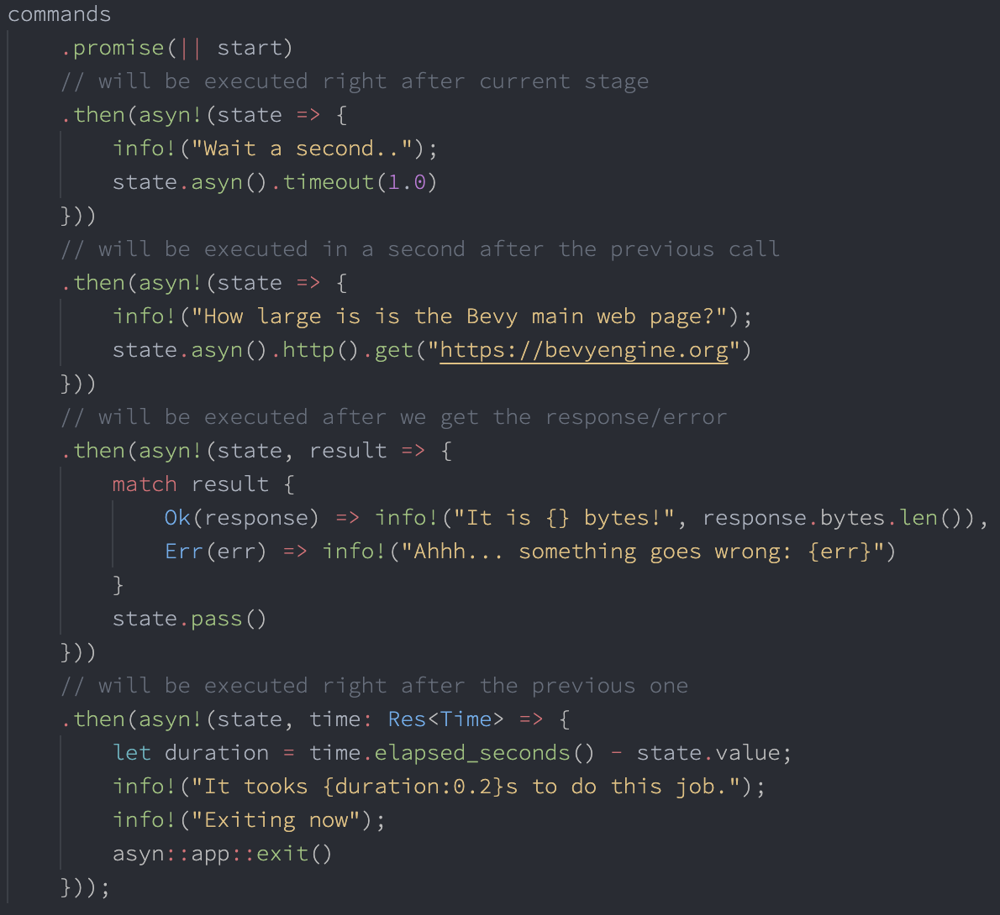

+++
title = "This Month in Rust GameDev #43 - February 2023"
transparent = true
date = 2023-03-08
draft = false
+++

<!-- no toc -->

Welcome to the 43rd issue of the Rust GameDev Workgroup's
monthly newsletter.
[Rust] is a systems language pursuing the trifecta:
safety, concurrency, and speed.
These goals are well-aligned with game development.
We hope to build an inviting ecosystem for anyone wishing
to use Rust in their development process!
Want to get involved? [Join the Rust GameDev working group!][join]

You can follow the newsletter creation process
by watching [the coordination issues][coordination].
Want something mentioned in the next newsletter?
[Send us a pull request][pr].
Feel free to send PRs about your own projects!

[Rust]: https://rust-lang.org
[join]: https://github.com/rust-gamedev/wg#join-the-fun
[pr]: https://github.com/rust-gamedev/rust-gamedev.github.io
[coordination]: https://github.com/rust-gamedev/rust-gamedev.github.io/issues?q=label%3Acoordination

- [Announcements](#announcements)
- [Game Updates](#game-updates)
- [Engine Updates](#engine-updates)
- [Learning Material Updates](#learning-material-updates)
- [Tooling Updates](#tooling-updates)
- [Library Updates](#library-updates)
- [Other News](#other-news)
- [Discussions](#discussions)
- [Requests for Contribution](#requests-for-contribution)

<!--
Ideal section structure is:

```
### [Title]


_image caption_

A paragraph or two with a summary and [useful links].

_Discussions:
[/r/rust](https://reddit.com/r/rust/todo),
[twitter](https://twitter.com/todo/status/123456)_

[Title]: https://first.link
[useful links]: https://other.link
```

If needed, a section can be split into subsections with a "------" delimiter.
-->

## Announcements

### Rust GameDev Meetup


The 24th Rust Gamedev Meetup took place in February. You can watch the recording
of the meetup [here on Youtube][gamedev-meetup-video]. Here was the schedule
from the meetup:

- Micro Game Engine - [@AngelOnFira]
- Graphite - [@GraphiteEditor]

The meetups take place on the second Saturday of every month via the [Rust
Gamedev Discord server][rust-gamedev-discord] and are also [streamed on
Twitch][rust-gamedev-twitch].

[gamedev-meetup-video]: https://youtu.be/HTxX-Wm-3R8
[rust-gamedev-discord]: https://discord.gg/yNtPTb2
[rust-gamedev-twitch]: https://twitch.tv/rustgamedev
[@AngelOnFira]: https://twitter.com/AngelOnFira
[@GraphiteEditor]: https://twitter.com/GraphiteEditor

## Game Updates

### Cootsmania


[Cootsmania] ([GitHub][coots-github])
is a multiplayer racing game made for [Ludwig Jam 2023][ludwig-jam] in 10 days
by [@kuviman] (programming), [@rincs] (art), and [@Brainoid] (music & sfx).

The game is about racing other players around Ludwig's house
towards the next Coots (Ludwig's cat) location.
Every round half of the players get eliminated and eventually a winner is decided.

[See the trailer on YouTube][coots-trailer].

The game is written using a custom engine: [Geng][geng].

[Cootsmania]: https://kuviman.itch.io/cootsmania
[ludwig-jam]: https://itch.io/jam/ludwig-2023
[coots-github]: https://github.com/kuviman/cootsmania
[coots-trailer]: https://youtu.be/N0bQDZTDr2Y
[geng]: https://github.com/kuviman/geng
[@kuviman]: https://github.com/kuviman
[@rincs]: https://rincsart.com
[@Brainoid]: https://twitter.com/brainoidgames

### [Tunnet][tunnet-itch]


_Tunnels and computer networks_

Tunnet ([Steam][tunnet-steam], [Itch.io][tunnet-itch]) by
[@puzzled\_squid][puzzled_squid] is a small puzzle/exploration game where you
play as a robot technician who has been tasked with building a computer network
in an underground complex.

The project is implemented using the Bevy engine. It is currently under
development and is expected to be released later this year.
This month, the announcement trailer and the first few pages of the manual have
been published on the [project page][tunnet-itch].

[tunnet-itch]: https://puzzled-squid.itch.io/tunnet
[tunnet-steam]: https://store.steampowered.com/app/2286390/Tunnet
[puzzled_squid]: https://puzzledsquid.xyz

### [Open Combat][OpenCombat_website]


_Game now includes live debug window_

Open Combat ([Website][OpenCombat_website], [GitHub][OpenCombat_github],
[Discord][OpenCombat_discord]) is a real time tactical game
which takes place during the 2nd World War.

Some major changes this month :

- A live debug window has been introduced (using [egui][egui_github]
  and its [ggegui][ggegui_github] integration). It allows to live-modify and
  adjust the gameplay of the running game.
- A big source code split has been done (see [the merge request][OpenCombat_split_mr])
  which separated the game logic and GUI.
  It allows running the game logic as a standalone server
  and working on different game parts more easily.
- Integration of [puffin][puffin_github] to inspect performances

The developers are also working on high-definition infantry sprites integration
and on a high-definition map (and are searching for graphic
designer help!).

[OpenCombat_website]: https://opencombat.bux.fr/
[OpenCombat_github]: https://github.com/buxx/OpenCombat
[OpenCombat_discord]: https://discord.gg/6P2vtFh2Px
[OpenCombat_split_mr]: https://github.com/buxx/OpenCombat/pull/104
[egui_github]: https://github.com/emilk/egui
[ggegui_github]: https://github.com/NemuiSen/ggegui
[puffin_github]: https://github.com/EmbarkStudios/puffin

### [Tiny Glade]


[Tiny Glade] is a small relaxing game about doodling
castles.

[@anopara] and [@h3r2tic] recently added [terrain editing].
They then faced an important game design question: how would sheep handle
it? Well, these cuddly little floofs are not mountain goats,
so the developers gave them tiny umbrellas.

Read more in their latest [Steam blogpost].

[@anopara]: https://twitter.com/anastasiaopara
[@h3r2tic]: https://twitter.com/h3r2tic
[Tiny Glade]: https://store.steampowered.com/app/2198150/Tiny_Glade/
[terrain editing]: https://store.steampowered.com/news/app/2198150/view/3651890488940565185
[Steam blogpost]: https://store.steampowered.com/news/app/2198150/view/3669907614196390626

### [Cargo Space]


[Cargo Space] ([Discord][cargospace_discord]) by
[@johanhelsing][johanhelsing_mastodon] is a co-op 2d space game where you build
a ship and fly it through space looking for new parts, fighting pirates and the
environment.

The game uses its own homemade XPBD-based physics engine implemented directly
using [Bevy] systems and types. This month the implementation was fleshed out
adding important features such as collision layers, composite colliders, one-way
platforms, and an efficient collision broadphase.

In other words, this means ship-to-ship collisions are finally happening. This
was previously tricky, since ships are a combination of box colliders when
colliding with each other and bevy_ecs_tilemap colliders (when colliding with
the player).

One part of the broadphase implementation was split out into a new crate,
[bevy_sparse_grid_2d]. It provides a simple and convenient way to query for
entities that share one or more grid cells based on their axis-aligned bounding
box (AABB).

Read more about Cargo Space's physics in [the long and detailed blog
post][cargospace_devlog_5].

[Cargo Space]: https://helsing.studio/cargospace
[cargospace_devlog_5]: https://johanhelsing.studio/posts/cargo-space-devlog-5
[cargospace_discord]: https://discord.gg/ye9UDNvqQD
[johanhelsing_mastodon]: https://mastodon.social/@johanhelsing
[bevy_sparse_grid_2d]: https://github.com/johanhelsing/bevy_sparse_grid_2d

### [CyberGate][cybergate-yt]


_Many creatures flying and casting shadows_

CyberGate ([YouTube][cybergate-yt], [Discord][cybergate-dis]) is an
ambitious multiplayer project from CyberSoul, currently in development.
With cutting-edge procedural generation and artificial intelligence,
it promises to immerse players in a mysterious and enigmatic universe
filled with strange creatures and hidden secrets.

The latest updates to CyberGate include:

- A rebuilt renderer, providing improved graphics and performance.
- Shadow map cascades with seamless transitions for smooth shadow rendering.
- Soft shadows for more realistic shadow effects.
- A fog effect to create atmospheric depth and immersion.
- A sky box to add visual interest and realism to the game world.
- Support for importing GLTF models, expanding the range of assets available.

Join the journey into the unknown and help shape the future of CyberGate!
[Join the Discord server][cybergate-dis] to participate in upcoming Phase 7.0!

[cybergate-yt]: https://youtube.com/channel/UClrsOso3Xk2vBWqcsHC3Z4Q
[cybergate-dis]: https://discord.gg/R7DkHqw7zJ

### [Legend of Worlds][low-website]


[Legend of Worlds][low-website] ([Discord][low-discord], [Twitter][low-twitter])
is a cross-platform, cross-play, 2D online sandbox multiplayer
experience where you can join, play, create, and share player-created worlds.

[The latest dev log][low-devlog] from [Rou][low-twitter] covers an update
to the open-source game engine created for this game.

Legend of Worlds uses Toxoid Engine. Toxoid is a cross-platform, polyglot,
open-source WebAssembly game engine written in Rust.
The architecture has been updated so that Toxoid games can now share memory
directly between WASM components, and map access to the data values rather than
deserializing a set of values every time, resulting in "massive performance gains".

[low-website]: http://legendofworlds.com
[low-twitter]: https://twitter.com/DreamsectGames
[low-discord]: https://discord.gg/aqD7H3F7nz
[low-devlog]: http://legendofworlds.com/dev-log-2

### [Hydrofoil Generation]


[Hydrofoil Generation]
([Steam][hgs_steam], [Facebook][hgs_facebook], [Discord][hgs_discord])
is a realistic sailing/foiling inshore simulator in development for PC/Steam
that puts you in the driving seat of modern competitive sailing.

Hydrofoil Generation released on February 16th 2023 on Steam Early Access after
almost 3 years of development.

The game is written completely in Rust, using a custom engine based on
DirectX 11, physics powered by Rapier-3D.

Stefano Casillo, programmer commented: "Rust delivered on every single
promise. I never experienced such an uneventful launch and QA as the one
we had for Hydrofoil Generation. The software stability has been impressive
since the beginning of the project and confirmed the trend at release with
very few problems all very easy to address".

Hydrofoil Generation currently sits at a very positive review rate of 96%
on the Steam page and is praised for its challenging gameplay, performance
and realistic physics.

[Hydrofoil Generation]: https://hydrofoil-generation.com/
[hgs_facebook]: https://facebook.com/HydrofoilGenerationSailing/
[hgs_discord]: https://discord.gg/DtKgt2duAy/
[hgs_steam]: https://store.steampowered.com/app/1448820/Hydrofoil_Generation/

### [Veloren][veloren]


_A cyclops attack_

[Veloren][veloren] is an open world, open-source voxel RPG inspired by Dwarf
Fortress and Cube World.

In February, swing SFX were added to the new sword abilities. Blocks were added
to spots that can spawn NPCs. Moderation badges were added, and fixes to the chat
command were made. A student contributed to Veloren on their two-week internship
about game design, you can [read about that here][veloren-internship]. Work is
being done to add more functionality to sites, which are small models placed around the world.

February's full weekly devlogs: "This Week In Veloren...": [#205][veloren-205], [#206][veloren-206].

[veloren]: https://veloren.net
[veloren-205]: https://veloren.net/devblog-205
[veloren-206]: https://veloren.net/devblog-206
[veloren-internship]: https://veloren.net/devblog-205#potion-shops-were-created-during-a-two-week-internship-by-nixda

### [triverse]


[triverse] by [@cragwind] is a WIP smart-pause RTS with custom unit creation
on a triangle grid canvas.
[This month's update][triverse-devlog] includes:

- Training and challenge scenarios.
- Grid lines when building.
- Edge panning in fullscreen mode.
- Radar proximity markers to indicate objects that are off
  the visible portion of the map.

[@cragwind]: https://cragwind.com
[triverse]: https://cragwind.itch.io/triverse
[triverse-devlog]: https://cragwind.com/posts/scenarios-and-playability

### [Idu][idu-itch]


[Idu][idu-itch] ([Discord][idu_discord]) is a strategic sandbox game about growing
plants that wish to reclaim nature, developed by [Elina Shakhnovich][eli_mastodon]
and [Johann Tael][johann_mastodon] featuring a bespoke Vulkan-based engine in Rust.

This month [a new demo was released][idu-new-demo]:

- A new world generation with new buildings, stairs, caves, paths, and beaches.
- Simpler inventory management for materials.
- New help text that explains the game mechanics better.
- A configurable FOV and fullscreen toggle settings.
- Wind now affects not only leaves but tree branches as well.
- Significant GI performance improvements.

[idu_discord]: https://discord.gg/MeGauteMj3
[eli_mastodon]: https://mastodon.gamedev.place/@eli
[johann_mastodon]: https://mastodon.gamedev.place/@johann
[idu-itch]: https://epcc.itch.io/idu
[idu-new-demo]: https://epcc.itch.io/idu/devlog/492261/demo-version-9-available-new-worlds

### [Necking][necking-post]


Necking is a WIP competitive/cooperative 1-on-1 online game where players
are giraffes and fight for male dominance in the giraffe way.

This month the devs have released [the first devlog][necking-post]
that tells about:

- The concept of the game and what inspired it.
- Custom joint system and migration to Rapier physics lib.
- Bevy controls design, including tongue controls.
- The [cuicui] UI framework.

[necking-post]: https://devildahu.ch/devlog/necking-1
[cuicui]: https://github.com/devildahu/bevy_mod_cuicui

## Engine Updates

### [godot-rust][gd-github]



The [release of Godot version 4.0][gd-godot4] marks a significant milestone in
the game development ecosystem. godot-rust aims to bring the open-source
game engine to the Rust community.

For the [Godot 4 (GDExtension) binding][gd-gdextension], February was a very
productive month, with a handful of new contributors and [16 merged pull
requests][gd-pulse]. An up-to-date feature overview is available
[in issue #24][gd-24]. Last month's changes include:

- Support for arrays, packed arrays, and dictionaries
- Support for some geometric types (vectors, quaternions, colors)
- Bugfixes regarding ref-counts, use-after-free, memory leaks

On the [Godot 3 (GDNative) side][gd-gdnative], lots of quality-of-life
improvements have found their way into the library:

- Class self-registration based on `inventory` crate
- Flexible self types: `fn instance(#[self] this: Instance<Self>)`
- Trait entry point: `#[callbacks] impl GDNativeCallbacks for MyLibrary {...}`

Both bullet lists are examples for how the GDNative and GDExtension bindings
mutually benefit each other, reusing proven designs for user-friendly Rust APIs.

[gd-github]: https://github.com/godot-rust
[gd-gdextension]: https://github.com/godot-rust/gdextension
[gd-gdnative]: https://github.com/godot-rust/gdnative
[gd-godot4]: https://godotengine.org/article/godot-4-0-sets-sail/
[gd-pulse]: https://github.com/godot-rust/gdextension/pulse/monthly
[gd-24]: https://github.com/godot-rust/gdextension/issues/24

### [Blue Engine][be-github]


[Blue Engine][be-github] by [@ElhamAryanpur] is an easy to use, extendable, and
portable graphics engine built to make it easier to render 2D or 3D graphics.

Although the month of Febuary was slow for the development of the engine, there
have been significant efforts towards the addition of [documentation][be-docs] and the
eventual release of the next version. In the meantime, the plugins have favored significant
updates and development in the month, notably the [egui][be-egui] plugin.

Now the [egui plugin][be-egui] allow you to render objects of the engine direction
inside an egui window. This feature was built in collaboration with [@Noswad].

This also introduced a new option in Objects: `is_visible: bool`
which hides an object
from getting rendered if set to false (set to `true` as default). This allows
you to hide an object from getting rendered on the background of egui, and can then
add it to be rendered inside an egui window instead. So far the system on the second
design, suggestions are welcome to cement a better design. Refer to [example][be-egui-example].

[be-github]: https://github.com/AryanpurTech/BlueEngine
[be-egui]: https://github.com/AryanpurTech/BlueEngineEGUI
[be-egui-example]: https://github.com/AryanpurTech/BlueEngineEGUI/blob/master/examples/custom_3d.rs
[be-docs]: https://docs.rs/blue_engine
[@ElhamAryanpur]: https://github.com/ElhamAryanpur
[@Noswad]: https://github.com/TheNoswad

### [Ambient][ambient-github]



After over a year in development, [version 0.1 of Ambient][ambient-blog]
(formerly known as Dims) was unveiled to the public. It is an open-source
multiplayer 3D game runtime, compatible with any language that compiles
to/runs on WebAssembly, and is designed to make it easy to build and deploy
rich multiplayer worlds and experiences.

It is guided by several core principles, including seamless networking,
data-oriented design, interoperability, and more.
The core runtime is written in Rust and uses WGPU for graphics, Quinn
for networking, and WebAssembly for user logic. This allows it to run on
all major desktop platforms, with active work underway for the Web and
other targets.

Check out [the GitHub][ambient-github] (2600 stars!) to get started with
building for/or on Ambient yourself, or chat with the developers and other
explorers on [the Discord][ambient-discord].

_Discussion: [/r/rust][ambient-reddit], [Hacker News][ambient-hn]_

[ambient-github]: https://github.com/AmbientRun/Ambient
[ambient-blog]: https://ambient.run/post/introducing-ambient
[ambient-reddit]: https://reddit.com/r/rust/comments/118wlda/introducing_ambient_01
[ambient-hn]: https://news.ycombinator.com/item?id=34906166
[ambient-discord]: https://discord.gg/ambient

### [Geng][geng]

[Geng][geng] by [@kuviman] is a game engine that is used by him & friends
for mostly making small games for game jams.

The focus is to work on the web first (using WebGL1),
but can also work easily on native platforms.

Font rendering is done using sdf textures,
which are being created on GPU based on [this article][sdf-on-gpu].
Some font improvements from February:

- Better curve approximation (still can be done better like in the article).
- Use euclidean distance instead of manhattan.
- Added a method to create sdf texture for text.
  (previously font only had sdf texture atlas with every glyph).

Support was added for OpenGL blend equations - e.g. minmax blending,
which is now used instead of depth buffer for sdf textures

Also, some improvements related to sound:
API to query `Sound` duration,
starting sound playback from specific position,
and changing the speed of `SoundEffect`.

[sdf-on-gpu]: https://astiopin.github.io/2019/01/06/sdf-on-gpu.html

### [Fyrox][fyrox]


_Blend space demo_

[Fyrox][fyrox] ([GitHub][fyrox-src], [Discord][fyrox-dis], [Twitter][fyrox-twi])
is a game engine that aims to be easy to use and provide a large set
of out-of-the-box features. This month's updates include:

- [Audio system's refactoring][fyrox-audio] to make it much more flexible.
- [Root motion][fyrox-root-motion] animation technique helps
  prevent "floating" or "sliding" effects.
- [Blend space][fyrox-blend-space] allows blending many animations based on
  two numeric input parameters
  (mostly useful for blending locomotion animations based on speed and direction).
- [Editor restyling][fyrox-editor-restyling] brings cleaner and modern UI.

February's full weekly devlogs: [#13][fyrox-13], [#14][fyrox-14],
[#15][fyrox-15], and [#16][fyrox-16].

[fyrox]: https://fyrox.rs
[fyrox-src]: https://github.com/FyroxEngine/Fyrox
[fyrox-dis]: https://discord.com/invite/xENF5Uh
[fyrox-twi]: https://twitter.com/DmitryNStepanov
[fyrox-audio]: https://fyrox.rs/blog/post/twif13#audio-system-refactoring
[fyrox-root-motion]: https://fyrox.rs/blog/post/twif14#root-motion
[fyrox-blend-space]: https://fyrox.rs/blog/post/twif15#blend-space
[fyrox-editor-restyling]: https://fyrox.rs/blog/post/twif16/#editor-restyling
[fyrox-13]: https://fyrox.rs/blog/post/twif13
[fyrox-14]: https://fyrox.rs/blog/post/twif14
[fyrox-15]: https://fyrox.rs/blog/post/twif15
[fyrox-16]: https://fyrox.rs/blog/post/twif16

## Learning Material Updates

### [Write a First Person Game in 2KB with Rust][firstperson-wasm4]


[@grantshandy] published an [article][firstperson-wasm4] about creating a simple
first-person game in Rust with [WASM-4]. It covers the basics of a ray casting
algorithm and minifying Rust with WebAssembly. You can play the finished game
[here][firstperson-wasm4-game].

_Discussion: [/r/rust](https://reddit.com/r/rust/comments/11bdsys/fps_game_2kb_rust)_

[@grantshandy]: https://github.com/grantshandy/
[firstperson-wasm4]: https://grantshandy.github.io/posts/raycasting
[firstperson-wasm4-game]: https://grantshandy.github.io/wasm4-raycaster/
[WASM-4]: https://wasm4.org

### Voxel Meshing


Authors of [Space Farer][spacefarer] - a WIP voxel-based survival/building
game - published a couple of articles about voxel meshing:

- ["Voxel Meshing for the Rest of us"][voxel-meshing-1] is an
  introduction to voxel meshing techniques.
- ["How (Not) to Improve Voxel Meshing Performance"][voxel-meshing-2]
  tells about some zero-copy optimizations.

[voxel-meshing-1]: https://playspacefarer.com/voxel-meshing
[voxel-meshing-2]: https://playspacefarer.com/voxel-meshing-performance
[spacefarer]: https://playspacefarer.com

### [Making Galaga in Rust with Bevy][tut-bevy-galaga-1]


[@whoisryosuke] released [the first part in a series][tut-bevy-galaga-1]
on how to build a Galaga clone using Bevy.
It covers 2D sprites and meshes basics, setting up custom shaders for animated background,
and adding sound.

[@whoisryosuke]: https://mastodon.gamedev.place/@whoisryosuke
[tut-bevy-galaga-1]: https://whoisryosuke.com/blog/2023/making-galaga-in-rust-with-bevy-part-1

## Tooling Updates

### Sprite and Pixel Art Editor


A sprite and pixel art editor made with egui and macroquad is being
developed by @yds12 ([Github][yds-github], [Mastodon][yds-mastodon]).
The project is already usable, but has not been made public yet. Current
features are:

- Drawing w/ brush, eraser, lines, rectangles, bucket (fill w/ color).
- Color selector, editable palette, and eyedropper (pick a color from the canvas).
- Resize or completely erase the canvas.
- Move the camera, zoom in and out.
- Selection (rectangular only for now), deleted, copied, and pasted; flip
  selection (horizontal or vertical).
- Layers: create, remove, moved up/down, and control visibility and opacity.
- Spritesheet: specify how many columns and rows your image has, and an
  animated preview will be displayed in a window w/ configurable scale.
- Save/load projects (with all its settings), export and import PNG/JPG.
- Status bar w/ info about canvas size, canvas position, color under mouse,
  etc.

The source is planned to be released in the next few weeks.

[yds-github]: https://github.com/yds12
[yds-mastodon]: https://fosstodon.org/@yds/

### [Graphite][graphite-website]


Graphite ([website][graphite-website], [GitHub][graphite-repo],
[Discord][graphite-discord], [Twitter][graphite-twitter]) is a free,
in-development raster and vector 2D graphics editor based around a Rust-powered
node graph compositing engine.

New features from February's [sprint 23][graphite-sprint-23]:

- Shaping up: Editing shapes is now easier thanks to point selection and
  manipulation improvements.
- Deep dive: The user experience of nested layer selection is improved by
  introducing "Deepest" and "Shallowest" modes.
- Scroll settings: Scroll up-and-down, or zoom in-and-out, at your preference
  using the new configuration for scroll wheel behavior.
- Graph growth: Additional node graph engineering introduces graceful type
  checking and brings GPU-accelerated compositing closer to realization.

As always, new contributors are kindly invited to
[get involved][graphite-contribute] and take on
[approachable issues][graphite-approachable-issues] with help from the
project's friendly and supportive developer community on Discord.

[Open Graphite][graphite-editor] in your browser and start creating! Share your
designs with #MadeWithGraphite on Twitter.

[graphite-website]: https://graphite.rs
[graphite-repo]: https://github.com/GraphiteEditor/Graphite
[graphite-discord]: https://discord.graphite.rs
[graphite-twitter]: https://twitter.com/GraphiteEditor
[graphite-sprint-23]: https://github.com/GraphiteEditor/Graphite/milestone/23
[graphite-approachable-issues]: https://github.com/GraphiteEditor/Graphite/labels/Good%20First%20Issue
[graphite-editor]: https://editor.graphite.rs

### [rerun.io][rerun]

[][rerun-video]
_[Click to see Rerun's latest demo video][rerun-video]_

[Rerun] ([Discord][rerun-discord]) lets you log images, point clouds
and other visual data as easy as you would log text.
The data is streamed in real-time to the Rerun Viewer
which you can run natively or in a browser.

> The Rerun Viewer builds configurable visualizations based on the data
> you log and the relationships between it.
> It uses transform hierarchies to lay out scenes and connect related data.
> It lets you scroll back and forth in time, and toggle between showing
> your data along different timelines, e.g. log time and sensor time.
> It's built to be fast so you can explore without waiting.

All built in Rust on top of [egui] library,
with an API for both Rust and Python.

This month, after a year of work, [Rerun was open-sourced under MIT & Apache 2][rerun-src]!

_Discussions: [/r/rust](https://reddit.com/r/rust/comments/112unsd/opensourcing_rerun)_

[Rerun]: https://rerun.io
[rerun-src]: https://github.com/rerun-io/rerun
[rerun-video]: https://youtube.com/watch?v=8ZpvOagRt-o
[egui]: https://github.com/emilk/egui
[rerun-discord]: https://discord.gg/PXtCgFBSmH

## Library Updates

### [hexx]


[hexx] is a hexagonal tools library made by [@ManevilleF]:

- Manipulate hexagonal coordinates, draw rings, lines, wedges, etc.
- Generate hexagonal grids, with conversion between your world
  and the hexagonal coordinates system.
- Compute 3d meshes for your hexagons.

It's engine-agnostic, but was made with [bevy] integration in mind
and provides 2D and 3D [examples][hexx-examples].

_Discussions: [Twitter](https://twitter.com/ManevilleF/status/1625159292490854400)_

[hexx]: https://github.com/ManevilleF/hexx
[bevy]: https://github.com/bevyengine/bevy
[@ManevilleF]: https://linktr.ee/ManevilleF
[hexx-examples]: https://github.com/ManevilleF/hexx/tree/main/examples

### [nanoshredder]


_macroquad's shadertoy example with metal/glsl preview_

[Nanoshredder] is an experimental fork of
[makepad's shader-compiler][makepad-shader-compiler].
It compiles rust-like DSL into GLSL, Metal and HLSL.

This month it got a little [web demo]:
[macroquad's shadertoy][macroquad-shadertoy], a live editor with
generated Metal/GLSL preview.

[nanoshredder]: https://github.com/not-fl3/nanoshredder
[makepad-shader-compiler]: https://github.com/makepad/makepad/tree/master/platform/shader_compiler
[web demo]: https://not-fl3.github.io/miniquad-samples/shadertoy_cross.html
[macroquad-shadertoy]: https://github.com/not-fl3/macroquad/blob/master/examples/shadertoy.rs

### [blink-alloc]

[blink-alloc] is a brand new arena-allocator with bunch of improvements
over existing solutions that is
tested with [Miri] and follows ["Strict Provenance Rules"][strict-provenance].

> Arena-allocators offer extremely fast allocations and deallocations.
> Allocation is just a few pointer arithmetic operations.
> And deallocation is nearly no-op.
> In exchange arena-allocator requires a point in time when all
> previous allocations are unused to reset state.\
> Rust's borrow-checker ensures the requirement for reset making
> it 100% safe to use.
>
> TL;DR great for games, servers, cli tools, and more.

blink-alloc provides thread-local and multi-threaded allocators -
`BlinkAlloc` and `SyncBlinkAlloc`.
Single-threaded version [performs many times faster than `bumpalo`][blink-bench].
The author couldn't find another implementation to compare
the multi-threaded version's performance.

It also provided out-of-the-box to fetch `BlinkAlloc` in task/thread
and return it back when done, keeping multiple `BlinkAlloc` instances warmed.

On top of raw allocations blink-alloc provides `Blink` type
that works as safe allocator adaptor.
`Blink` can allocate memory and initialize it with values provided by user.
Users may provide values as-is, as closures, or as iterators.
`Blink`'s API is safe with few exceptions for niche use cases.

Those familiar with `bumpalo` may think of `Blink` as of `bumpalo::Bump`.
Though `Blink`

- drops all placed values on reset,
  which makes it usable with any kind of types without resource leaks.
- Accepts any iterator type, not just `ExactSizeIterator` implementations.
- Is configurable to use any `BlinkAllocator` implementation, thus not
  tied to `Global`.

Currently, Rust's standard collection types may use custom allocators
only one nightly and with `allocator_api` feature enabled.
blink-alloc uses `allocator-api2` crate to work on both stable and nightly.
Integration with other crates is simple and doesn't require depending on
blink-alloc, only on `allocator-api2`.

[blink-alloc]: https://github.com/zakarumych/blink-alloc
[blink-bench]: https://github.com/zakarumych/blink-alloc/blob/main/BENCHMARKS.md
[Miri]: https://github.com/rust-lang/miri
[strict-provenance]: https://github.com/rust-lang/rust/issues/95228

### [pecs]


_Promise chaining example_

In the ECS environment, you can't use the standard async/await
approach, which can make implementing asynchronous logic painful.

[pecs] is a plugin for the [Bevy][bevy] engine that solves this problem.
It allows you to execute the code asynchronously by chaining multiple
promises as part of [Bevy's `ecs`][ecs] environment.

Each promise takes the state and result of the previous promise as arguments,
as well as any Bevy ECS system parameter, and passes the modified
state and new promise/result to the next promise. It's easy to register custom
promises that wait for user input, events, asset loading, and so on. You can
also use [pecs] to wait for any or all of multiple promises to complete
before continuing with the rest of the code, as well as to loop asynchronously
until a condition is met.

[pecs]: https://github.com/jkb0o/pecs
[ecs]: https://bevyengine.org/learn/book/getting-started/ecs

### [seldom_state]

[seldom_state] is a Bevy plugin that adds a `StateMachine` component that you
can add to your entities. The state machine will change the entity's components
based on states, triggers, and transitions that you define. It's useful
for player controllers, animations, simple AI, etc.

This month [seldom_state] 0.4 has been released:

- Transition builders (`StateMachine::trans_builder`) which let you pass data
  from triggers to states.
- The `AnyState` state, which you can use wherever `StateMachine` accepts state
  type parameters, which lets you create transitions from any state, etc
- A `leafwing_input` feature for `leafwing-input-manager` integration,
  which enables 9 built-in triggers related to input. `JustPressedTrigger`,
  for example.
- `OptionTrigger` and `BoolTrigger` traits, which are simpler to implement
  than `Trigger`.

[seldom_state]: https://github.com/Seldom-SE/seldom_state

### [warbler_grass]


_A bevy crate for grass rendering_

[warbler_grass] is a new experimental [Bevy] plugin.
The goal is to provide an ergonomic, but performant way
to easily render huge amounts of grass.

Some of the currently integrated features are dynamic directional wind
and chunk loading.

The project is now also published on [crates.io][warbler_cratesio].

[warbler_grass]: https://github.com/EmiOnGit/warbler_grass
[warbler_cratesio]: https://crates.io/crates/warbler_grass

### [taffy]

[taffy], the pure Rust UI layout crate, now supports CSS grid!
Build your inventory menus with ease,
or make that sudoku game you've always dreamed of.

Taffy v0.3 also comes with more than a few performance improvements and bug fixes;
for more details, check out our [release notes].

[taffy]: https://github.com/dioxuslabs/taffy
[release notes]: https://github.com/DioxusLabs/taffy/blob/main/RELEASES.md#030

### [Cvars]


_Cvars and the Fyrox in-game console as used in RustCycles_

[Cvars] ([GitHub][cvars-github], [Discord][cvars-discord]) by [@martin-t]
are a simple way to store settings you want to change at runtime
without restarting your game.

They offer a way to change struct fields based on their name.
This means games can store their config in a plain old struct
and use its statically typed fields with no overhead.
[Cvars] provide a derive macro to also allow changing each field
dynamically at runtime from a TUI.

The cvars project includes in-game consoles [for macroquad][cvars-macroquad]
and [for Fyrox][cvars-fyrox].

In addition to reading and setting cvars,
they support history and offer a help message for new users.
More advanced features such as autocomplete are planned for the next release.

_Discussions: [/r/rust_gamedev](https://reddit.com/r/rust_gamedev/comments/10wfe9p/announcing_cvars)_

[Cvars]: https://crates.io/crates/cvars
[cvars-github]: https://github.com/martin-t/cvars
[cvars-discord]: https://discord.gg/aA7hCFvYh9
[@martin-t]: https://github.com/martin-t
[cvars-macroquad]: https://github.com/martin-t/cvars#macroquad-console
[cvars-fyrox]: https://github.com/martin-t/cvars#fyrox-console

## Other News

<!-- One-liners for plan items that haven't got their own sections. -->

- Other game updates:
  - [@Tantan shared a vlog][tantan-vid] about the space colonization procedual
    tree generation technique [he's using for his voxel game][shrubbery].
  - Denis Lavrentev shared a couple of Primitive Engineering's vlogs:
    about [chunk management][pe-vid-1] and [the crafting system][pe-vid-2].
  - [Hoive] is multiplayer Rust version of the Hive boardgame.
  - [Tigris and Euphrates][tne] is a Rust version of the same-titled boardgame
    written using macroquad.
  - [Scalp Invaders][scalp-invaders] is game where you play as a colony of lice,
    launching themselves with great abandon through the scalp of a disgusted victim.
- Other engine updates:
  - [alkahest-rs] released a couple of vlogs about
    [UI rendering in general][alkahest-ui-rendering] and
    [rendering children widgets inside panels][alkahest-ui-children].
- Other learning material updates:
  - [Faith Ekstrand published the first article][rust-vk] in a series
    about using Rust for Vulkan drivers.
  - ["Learn WGPU" was updated to wgpu v0.15][learn-wgpu].
  - [PhaestusFox posted more episodes][PhaestusFox] of their "Platformer in Bevy"
    YouTube series.
  - The Unofficial Bevy Cheatbook by got two new chapters about
    ["Cameras"][bevy-book-cameras] and
    ["HDR, Tonemapping, Bloom"][bevy-book-hdr-tonemap].
  - [Jan Metzger published an article][dps-lim-dx] about
    dynamically limiting FPS in DirectX games from an external DLL.
- Other tooling updates:
  - [denog] is a gamedev-oriented fork of Deno with built-in window system
    integration.
  - [cargo-nds] and [libnds-rs] allow [writing Rust games for Nintendo DS][nds-ann],
    though both are WIP.
- Other library updates:
  - [dlss_wgpu] provides Deep Learning Super Sampling for wgpu.
  - [oxidized_navigation v0.2][oxi-nav] brings full support for walkable radius,
    areas, and area cost multipliers.

[tantan-vid]: https://youtube.com/watch?v=xQLVYnD43vI
[shrubbery]: https://github.com/TanTanDev/shrubbery
[pe-vid-1]: https://youtube.com/watch?v=_ZDagizAllY
[pe-vid-2]: https://youtube.com/watch?v=ILslZgEBlAo
[Hoive]: https://github.com/cooscoos/Hoive
[tne]: https://reddit.com/r/rust_gamedev/comments/111xlv7/tigris_n_euphrates
[scalp-invaders]: https://metalmancy.itch.io/scalp-invaders
[learn-wgpu]: https://sotrh.github.io/learn-wgpu/news/0.15
[PhaestusFox]: https://youtube.com/@PhaestusFox/videos
[bevy-book-cameras]: https://bevy-cheatbook.github.io/features/camera.html
[bevy-book-hdr-tonemap]: https://bevy-cheatbook.github.io/features/hdr-tonemap.html
[dps-lim-dx]: https://zazama.de/blog/creating-an-fps-limiter-in-rust-by-hooking-directx
[rust-vk]: https://collabora.com/news-and-blog/blog/2023/02/02/exploring-rust-for-vulkan-drivers-part-1
[alkahest-rs]: https://github.com/AlkimiaStudios/alkahest-rs
[alkahest-ui-rendering]: https://youtube.com/watch?v=cvVDSin0jpA
[alkahest-ui-children]: https://youtube.com/watch?v=aaXflcuqQqw
[denog]: https://reddit.com/r/rust/comments/10tsfry/denog
[cargo-nds]: https://github.com/SeleDreams/cargo-nds
[libnds-rs]: https://github.com/SeleDreams/libnds-rs
[dlss_wgpu]: https://github.com/JMS55/dlss_wgpu
[nds-ann]: https://reddit.com/r/rust/comments/10yk0kg/porting_rust_to_the_nntendo_ds

[oxi-nav]: https://github.com/TheGrimsey/oxidized_navigation/blob/master/CHANGELOG.md#020-2023-02-13

## Discussions

<!-- Links to handpicked reddit/twitter/urlo/etc threads that provide
useful information -->

- /r/rust_gamedev:
  - ["We’re not really game yet"][reddit-not-there-yet]
- /r/rust:
  - ["Does anyone here work in gamedev with Rust?”][reddit-anyone-works]

[reddit-not-there-yet]: https://reddit.com/r/rust_gamedev/comments/11b0brr/were_not_really_game_yet
[reddit-anyone-works]: https://reddit.com/r/rust/comments/11bn8f1/does_anyone_here_work_in_gamedev_with_rust

## Requests for Contribution

<!-- Links to "good first issue"-labels or direct links to specific tasks -->

- ['Are We Game Yet?' wants to know about projects/games/resources that
  aren't listed yet][awgy].
- [Graphite is looking for contributors][graphite-contribute] to help build the
  new node graph and 2D rendering systems.
- [winit's "difficulty: easy" issues][winit-issues].
- [Backroll-rs, a new networking library][backroll-rs].
- [Embark's open issues][embark-open-issues] ([embark.rs]).
- [wgpu's "help wanted" issues][wgpu-issues].
- [luminance's "low hanging fruit" issues][luminance-fruits].
- [ggez's "good first issue" issues][ggez-issues].
- [Veloren's "beginner" issues][veloren-beginner].
- [A/B Street's "good first issue" issues][abstreet-issues].
- [Mun's "good first issue" issues][mun-issues].
- [SIMple Mechanic's good first issues][simm-issues].
- [Bevy's "good first issue" issues][bevy-issues].

[awgy]: https://github.com/rust-gamedev/arewegameyet#contribute
[graphite-contribute]: https://graphite.rs/contribute
[winit-issues]: https://github.com/rust-windowing/winit/issues?q=is%3Aopen+is%3Aissue+label%3A%22difficulty%3A+easy%22
[backroll-rs]: https://github.com/HouraiTeahouse/backroll-rs/issues
[embark.rs]: https://embark.rs
[embark-open-issues]: https://github.com/search?q=user:EmbarkStudios+state:open
[wgpu-issues]: https://github.com/gfx-rs/wgpu/issues?q=is%3Aissue+is%3Aopen+label%3A%22help+wanted%22
[luminance-fruits]: https://github.com/phaazon/luminance-rs/issues?q=is%3Aissue+is%3Aopen+label%3A%22low+hanging+fruit%22
[ggez-issues]: https://github.com/ggez/ggez/labels/%2AGOOD%20FIRST%20ISSUE%2A
[veloren-beginner]: https://gitlab.com/veloren/veloren/issues?label_name=beginner
[abstreet-issues]: https://github.com/a-b-street/abstreet/issues?q=is%3Aissue+is%3Aopen+label%3A%22good+first+issue%22
[mun-issues]: https://github.com/mun-lang/mun/labels/good%20first%20issue
[simm-issues]: https://github.com/mkhan45/SIMple-Mechanics/labels/good%20first%20issue
[bevy-issues]: https://github.com/bevyengine/bevy/labels/D-Good-First-Issue

------

That's all news for today, thanks for reading!

Want something mentioned in the next newsletter?
[Send us a pull request][pr].

Also, subscribe to @rust_gamedev on [Twitter][rust_gamedev_twi],
[Mastodon][rust_gamedev_mas], or [/r/rust_gamedev subreddit][/r/rust_gamedev]
if you want to receive fresh news!

<!--
TODO: Add real links and un-comment once this post is published
**Discuss this post on**:
[/r/rust_gamedev](TODO),
[Twitter](TODO),
[Mastodon](TODO),
[Discord](https://discord.gg/yNtPTb2).
-->

[/r/rust_gamedev]: https://reddit.com/r/rust_gamedev
[rust_gamedev_twi]: https://twitter.com/rust_gamedev
[rust_gamedev_mas]: https://mastodon.gamedev.place/@rust_gamedev
