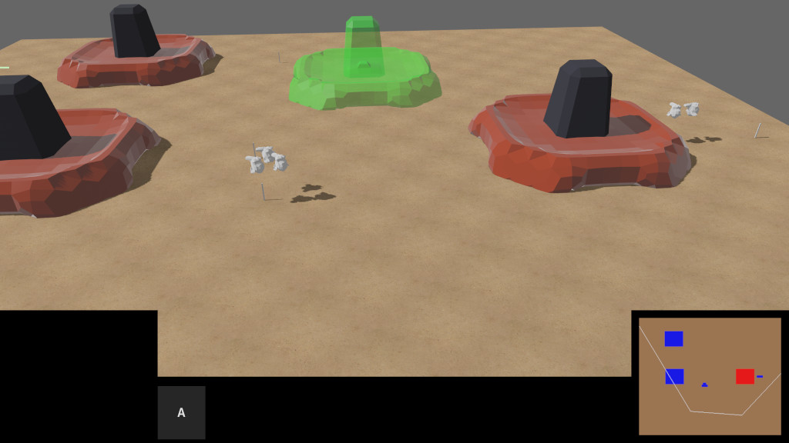
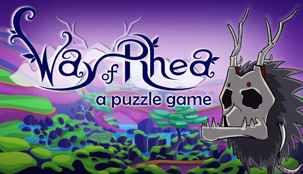
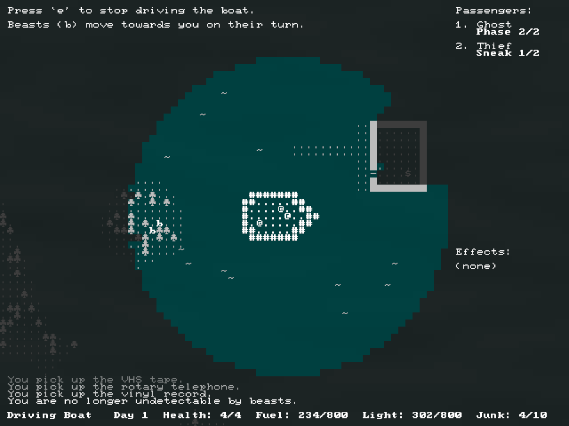
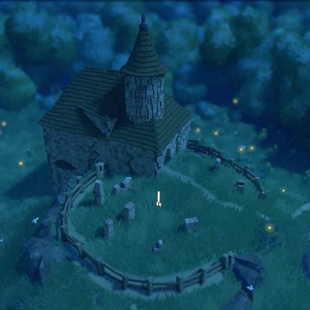
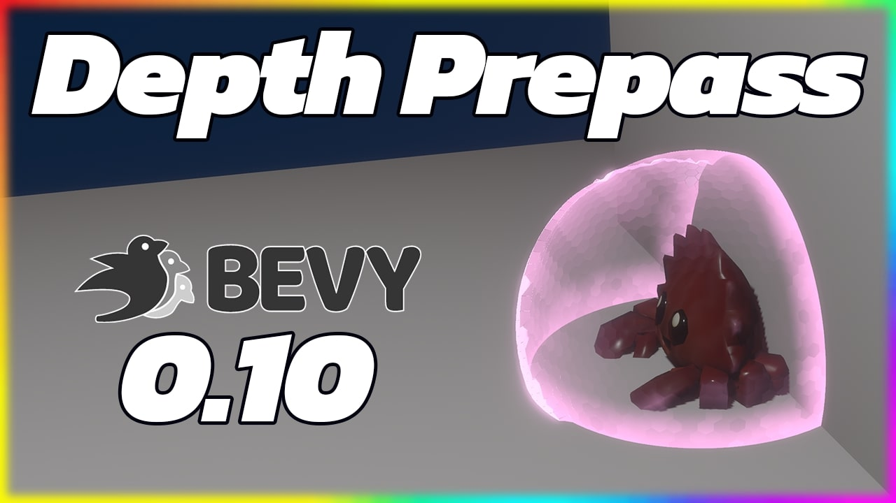
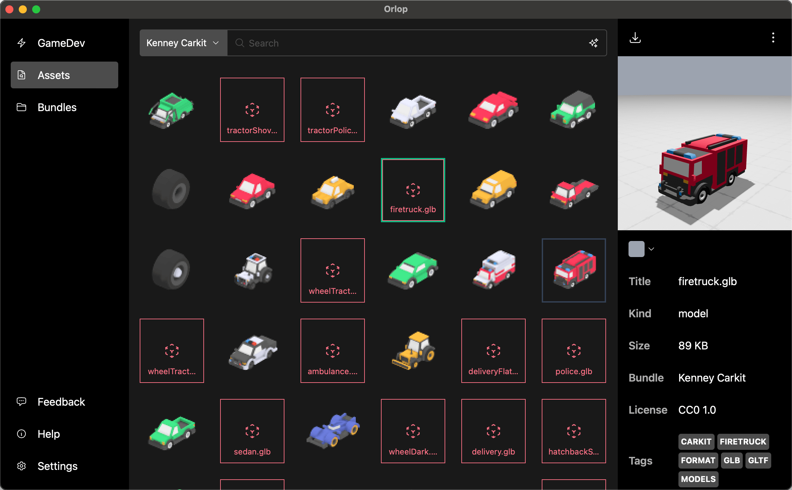

+++
title = "This Month in Rust GameDev #44 - March 2023"
transparent = true
date = 2023-04-30
draft = false
+++

<!-- no toc -->

<!-- Check the post with markdownlint-->

Welcome to the 44th issue of the Rust GameDev Workgroup's
monthly newsletter.
[Rust] is a systems language pursuing the trifecta:
safety, concurrency, and speed.
These goals are well-aligned with game development.
We hope to build an inviting ecosystem for anyone wishing
to use Rust in their development process!
Want to get involved? [Join the Rust GameDev working group!][join]

You can follow the newsletter creation process
by watching [the coordination issues][coordination].
Want something mentioned in the next newsletter?
[Send us a pull request][pr].
Feel free to send PRs about your own projects!

[Rust]: https://rust-lang.org
[join]: https://github.com/rust-gamedev/wg#join-the-fun
[pr]: https://github.com/rust-gamedev/rust-gamedev.github.io
[coordination]: https://github.com/rust-gamedev/rust-gamedev.github.io/issues?q=label%3Acoordination

- [Announcements](#announcements)
- [Game Updates](#game-updates)
- [Engine Updates](#engine-updates)
- [Learning Material Updates](#learning-material-updates)
- [Tooling Updates](#tooling-updates)
- [Library Updates](#library-updates)
- [Other News](#other-news)
- [Discussions](#discussions)
- [Requests for Contribution](#requests-for-contribution)

<!--
Ideal section structure is:

```
### [Title]


_image caption_

A paragraph or two with a summary and [useful links].

_Discussions:
[/r/rust](https://reddit.com/r/rust/todo),
[twitter](https://twitter.com/todo/status/123456)_

[Title]: https://first.link
[useful links]: https://other.link
```

If needed, a section can be split into subsections with a "------" delimiter.
-->

## Announcements

### Rust GameDev Meetup


The 25th Rust Gamedev Meetup took place in March. You can watch the recording
of the meetup [here on Youtube][gamedev-meetup-video]. Here was the schedule
from the meetup:

- Blue Engine - [@aryanpur_elham]
- Blade - [@kvark]
- 8bit Duels - [@ThousandthStar]
- Veloren - [@velorenproject]
- Graphite - [@GraphiteEditor]

The meetups take place on the second Saturday of every month via the [Rust
Gamedev Discord server][rust-gamedev-discord] and are also [streamed on
Twitch][rust-gamedev-twitch].

[gamedev-meetup-video]: https://youtube.com/watch?v=EVxjxP6sZtA
[rust-gamedev-discord]: https://discord.gg/yNtPTb2
[rust-gamedev-twitch]: https://twitch.tv/rustgamedev
[@kvark]: https://kvark.github.io/
[@aryanpur_elham]: https://twitter.com/aryanpur_elham
[@ThousandthStar]: https://github.com/ThousandthStar
[@GraphiteEditor]: https://twitter.com/GraphiteEditor
[@velorenproject]: https://twitter.com/velorenproject

## Game Updates

### [8bit Duels]


_An 8bit Duels match_

[@ThousandthStar] is creating a simple multiplayer turn-based strategy using the
[Bevy Engine]. The [latest devlog] brings features like ownership indicators,
movement and attack animations, and a chat system.

The game is under development. The [8-bit Discord] is the best place to talk
about the game.

8bit Duels will be getting UI updates next, and the first version should release
soon after that. Other troops are coming as well.

_Discussions: [8-bit Discord]_

[8bit Duels]: https://thousandthstar.github.io
[Bevy Engine]: https://bevyengine.org/
[latest devlog]: https://thousandthstar.github.io/posts/8bd/8bd-part6
[8-bit Discord]: https://discord.com/invite/NbBcF4bGU5

### [CyberGate][cybergate-yt]


_Particles emit from bullet hits and blackholes_

CyberGate ([YouTube][cybergate-yt], [Discord][cybergate-dis]),
an ambitious multiplayer project in development by CyberSoul,
aims to invite players into a constantly evolving universe.
Harnessing the power of procedural generation and artificial intelligence,
this work-in-progress aspires to provide an engaging experience
that emphasizes exploration and discovery across its diverse worlds.

The latest updates to CyberGate include:

- Skybox Animation and Transitions
- Dynamic Point Lights
- Particle System
- Post-processing Screen Shake for Hit Feedback
- Hit Particle Effects
- Blackhole

They released the 7th major update in March,
They are now working on universe generation alghoritms for the 8th.
Participate [by joining the Discord server][cybergate-dis].

[cybergate-yt]: https://youtube.com/channel/UClrsOso3Xk2vBWqcsHC3Z4Q
[cybergate-dis]: https://discord.gg/R7DkHqw7zJ

### [ZOMBIE DEMO GAME]


[ZOMBIE DEMO GAME] is a small third-person zombie shooter by [@LPGhatguy] and
[@evaera] that was released this month.

It features an astonishing 10 minutes of gameplay, a built-in level editor, and
zombies! It was produced in order to practice shipping a game and uses a custom
engine using wgpu, hecs, and lots of other great crates from the ecosystem.

ZOMBIE DEMO GAME is available for Windows and Linux
[on itch.io][ZOMBIE DEMO GAME] today.

_Discussion: [Twitter](https://twitter.com/LPGhatguy/status/1632596982928687104)_

[@LPGhatguy]: https://twitter.com/LPGhatguy
[@evaera]: https://twitter.com/evaeraevaera
[ZOMBIE DEMO GAME]: https://lpghatguy.itch.io/zombie-demo-game

### Shifting Chamber


Shifting Chamber ([itch.io][shifting-chamber-itch],
[GitHub][shifting-chamber-github]) is a simple tactics game where
the player, instead of moving the character, manipulates the map around it.
The goal is to defeat the enemies by forcing them into hazardous
positions - since they cannot be attacked directly.

The game is in an early prototype / proof of concept phase.
It is written with the help of the Bevy engine.
There is currently only a WASM build (freely available on the itch.io)

[shifting-chamber-itch]: https://maciekglowka.itch.io/shifting-chamber
[shifting-chamber-github]: https://github.com/maciekglowka/shifting_chamber

### [Jumpy]


_Live Map Editing!_

[Jumpy] ([GitHub][Jumpy], [Discord][jumpy_discord], [Twitter][jumpy_twitter]) by
[Spicy Lobster][spicy_lobster] is a pixel-style, tactical 2D shooter with a fishy
theme.

In the last month, the first [MVP release][jumpy_v0.6.0] of Jumpy was made. The
release adds some major new features including a live map editor, critters,
extended player animations, and basic AI. Soon afterward [an update][jumpy_v0.6.1]
was made with revised maps and some important bug fixes.

Along with the release is a new blog post, sharing thoughts on some of the lessons
learned during development:
[Jumpy v0.6 Retrospective][jumpy_retrospective].

The efforts are now focused on getting network play implemented, with a two
player LAN proof-of-concept already working. The hope is to get the remaining
network issues fixed and the online matchmaker connected before making another
release as soon as it's ready.

[Jumpy]: https://github.com/fishfolks/jumpy
[jumpy_v0.6.0]: https://github.com/fishfolk/jumpy/releases/tag/v0.6.0
[jumpy_v0.6.1]: https://github.com/fishfolk/jumpy/releases/tag/v0.6.1
[jumpy_twitter]: https://twitter.com/spicylobsterfam
[jumpy_discord]: https://discord.gg/4smxjcheE5
[spicy_lobster]: https://spicylobster.itch.io
[jumpy_retrospective]: https://fishfolk.org/blog/jumpy-0-6-retrospective/

### [Tunnet][tunnet-itch]


_Example of a puzzle in Tunnet_

Tunnet ([Steam][tunnet-steam], [Itch.io][tunnet-itch]) by
[@puzzled\_squid][puzzled_squid] is a short puzzle/exploration game where you
build a computer network in an underground complex.

This project is still WIP and the first [devlog][tunnet-post] has been
posted this month. The post describes the main gameplay loop as well as some
of the new environments recently added.

The game is developed using Bevy and is expected to be released late 2023.

[tunnet-itch]: https://puzzled-squid.itch.io/tunnet
[tunnet-steam]: https://store.steampowered.com/app/2286390/Tunnet
[tunnet-post]: https://puzzled-squid.itch.io/tunnet/devlog/507508/devlog-0-gameplay-loop-and-subnetworks
[puzzled_squid]: https://puzzledsquid.xyz

### Digital Extinction


_Building Placement in Digital Extinction_

[Digital Extinction] ([GitHub][de-github], [Discord][de-discord],
[Reddit][de-reddit]) by [@Indy2222] is a 3D real-time strategy game made with
[Bevy].

The most notable updates are:

- simple unit manufacturing was added,
- game minimap was added,
- game end detection was implemented,
- shadows were enabled,
- the health of all units & buildings was decreased,
- the “Quit Game” button in the game menu leads to the main menu instead of the
  termination of the application,
- close button was added to all menu screens,
- maximum number of players was made configurable by each map,
- screen edge size for camera movement was decreased,
- malformed configuration does not lead to a crash but a toast with an error
  message is displayed.
- [Bevy] was upgraded to v0.10.

See [gameplay][de-video] screen recordings on YouTube.

More detailed monthly updates are available [here (March)][de-update-05] and
[here (April)][de-update-06].

[Digital Extinction]: https://de-game.org
[de-github]: https://github.com/DigitalExtinction/Game
[de-discord]: https://discord.gg/vHMFuCWGSX
[de-reddit]: https://reddit.com/r/DigitalExtinction
[Bevy]: https://bevyengine.org
[de-video]: https://youtu.be/_ibNMDgIQDE
[de-update-05]: https://mgn.cz/blog/de05/
[de-update-06]: https://mgn.cz/blog/de06/
[@Indy2222]: https://github.com/Indy2222

### [Way of Rhea][wor]

[][wor]

[Way of Rhea][wor] is a puzzle game with hard puzzles and forgiving
mechanics being produced by [@masonremaley][wor-mason-remaley] in a custom Rust
engine. You can support development by
[checking out the free demo and wishlisting on Steam][wor]!

Recent updates:

- Undo/redo is better tutorialized.
- Existing onboarding hints were improved both functionally and visually.
- New onboarding hints were added to ensure new players understand that
  teleporters are interactive.
- Various performance improvements were made.
- End-game puzzles were completed.
- Work has begun on laying out the end-game art.
- A release plan has been drafted.
- Way of Rhea was shown at PAX West.
- Way of Rhea will be part of the upcoming [Steam Puzzle Fest][wor-puzzle-fest]!

[wor]: https://store.steampowered.com/app/1110620/Way_of_Rhea/?utm_campaign=tmirgd&utm_source=n44
[wor-mason-remaley]: https://twitter.com/masonremaley
[wor-puzzle-fest]: https://partner.steamgames.com/doc/marketing/upcoming_events/themed_sales/puzzle_2023

### [Boat Journey][boat-journey-itch]

[
_Carry your passengers safely to the ocean in Boat Journey._][boat-journey-itch]

[Boat Journey][boat-journey-itch] ([GitHub][boat-journey-github])
is a turn-based game where you drive a boat through a
procedurally-generated landscape on a voyage along a river destined for the
ocean. Accept passengers to have them help you on your journey. Fight monsters,
collect junk, trade the junk for fuel, use the fuel to travel to the ocean.

Features:

- Large procedurally-generated world
- Turn the boat at 45-degree increments
- Text-only graphics. You can play it in a terminal if you like!
- Hand-drawn ansi-art character portraits
- You can take on a ghost as a passenger and then become a ghost yourself.

Boat Journey was made for the [7 Day Roguelike 2023][7drl-itch] game jam.
The devlog is [here][boat-journey-devlog].

[boat-journey-itch]: https://gridbugs.itch.io/boat-journey
[boat-journey-github]: https://github.com/gridbugs/boat-journey
[7drl-itch]: https://itch.io/jam/7drl-challenge-2023
[boat-journey-devlog]: https://www.gridbugs.org/7drl2023-day1/

### [Screen Ball]


[Screen Ball] ([GitHub][Screen Ball], [YouTube][screen-ball-yt]) by [@lewiszlw]
is a game that lets you play ball on screen for a rest when you're tired from work.
Inspired by the video published by Bevy community member PaulH#7052.

[Screen Ball]: https://github.com/NightsWatchGames/screen-ball
[screen-ball-yt]: https://youtube.com/watch?v=pKV6fTmJfmE
[@lewiszlw]: https://github.com/lewiszlw

### [Battle City]


[Battle City] ([GitHub][Battle City], [YouTube][battle-city-yt]) by [@lewiszlw]
is a Bevy clone of the classical Battle City game
\- which brought a lot of happiness to the author's childhood.

You can play it [here][play-battle-city].

[Battle City]: https://github.com/NightsWatchGames/battle-city
[battle-city-yt]: https://youtube.com/watch?v=54Z2WBFZfzA
[play-battle-city]: https://nightswatchgames.github.io/games/battle-city/

### [BattleBots Simulator]


_Lightweight "annoyance" robot variant_

[BattleBots Simulator] ([Twitter]) by [@nilaysavant]
is a "BattleBots" themed robot wars simulator developed using [Bevy].

The game is planned to have multiple combat arenas.
Each player can compete using their selected robot.
Players will be able to score and win by damaging and destroying opponent robots.
Or by knocking opponents out of the arena.

There are 3 variants of the robots planned as follows:

- Light Weight "Annoyance": Low mass/HP, but will be unpredictable and fast.
  It will slowly kill by consistently annoying and damaging opponents.
- Medium Weight "Sniper": Medium weight robot that will be equipped with a high boost.
  This will allow it to knockout opponents or push them out of the arena.
- Heavy Weight "TANK": Highest mass/HP and momentum.
  Slow moving but hard to kill.
  Equipped with magnetic wedges that will help pin/push opponents out of the arena.

The game is currently a work in progress. For updates follow [Nilay Savant] on Twitter.

_Discussions: [Twitter]_

[BattleBots Simulator]: https://twitter.com/nilay_savant/status/1632419019914645504
[Twitter]: https://twitter.com/nilay_savant/status/1632419019914645504
[@nilaysavant]: https://github.com/nilaysavant
[Nilay Savant]: https://twitter.com/nilay_savant

### Cargo Space


[Cargo Space] ([Discord][cargospace_discord]) by
[@johanhelsing][johanhelsing_mastodon] is a co-op 2d space game where you build
a ship and fly it through space looking for new parts, fighting pirates and the
environment.

This month's development was all about lobbies, chat and integrating with Steam.
This spawned a couple of new micro-crates.

[bevy_crossbeam_event] lets you spawn Bevy events by
sending to a crossbeam channel, which is convenient with callbacks that require
move semantics, such as those in bevy-steamworks.

[steam_dev_launcher] is a cross-platform binary crate all
about dev-friendly ways to launch your game through Steam. That is: without
losing logs, panic traces, and optionally using a custom binary or setting extra
environment variables (launch from `/target/debug/your_game`).

Read more about all this in [this month's devlog entry][cargospace_devlog_6].

[Cargo Space]: https://helsing.studio/cargospace
[cargospace_devlog_6]: https://johanhelsing.studio/posts/cargo-space-devlog-5
[cargospace_discord]: https://discord.gg/ye9UDNvqQD
[johanhelsing_mastodon]: https://mastodon.social/@johanhelsing
[bevy_crossbeam_event]: https://github.com/johanhelsing/bevy_crossbeam_event
[steam_dev_launcher]: https://github.com/johanhelsing/steam_dev_launcher

### [Open Combat][OpenCombat_website]


_Game now includes a HUD_

Open Combat ([Website][OpenCombat_website], [GitHub][OpenCombat_github],
[Discord][OpenCombat_discord]) is a real-time tactical game
which takes place during the 2nd World War.

Some major changes this month :

- Add basic HUD logic for troops and game management
- Add high definition assets management for zoom display

High-definition infantry sprites integration if planned for next month
and we are searching for graphic designer help.

[OpenCombat_website]: https://opencombat.bux.fr/
[OpenCombat_github]: https://github.com/buxx/OpenCombat
[OpenCombat_discord]: https://discord.gg/6P2vtFh2Px

### [Veloren][veloren]


_Campfire by the lights_

[Veloren][veloren] is an open world, open-source voxel RPG inspired by Dwarf
Fortress and Cube World.

In March, culling of underground terrain was added, improving rendering
speeds. There has been a large influx of player growth, which has been rallying
the focus on server optimizations. Optimizations for buffs and auras were added,
specifically around how much network bandwidth is being used. A visual guide of
Veloren was created, which should help onboard new players to the game. It
covers items such as basic controls, what to do when you start the game, basic
crafting, and much more. More work has gone into the real-time simulation system
improvements. It includes behaviour of where birds should fly to, and how
species repopulation works.

March's full weekly devlogs: "This Week In Veloren...": [#207][veloren-207].

[veloren]: https://veloren.net
[veloren-207]: https://veloren.net/devblog-207

### [Maginet]


[Maginet] by [Evrim] is a fast-paced turn-based strategy game
with local/versus-ai/online play on PC/mobile
where two guilds of mages battle each other.

This month's updates include:

- [Mobile multiplayer][maginet-log-1];
- [local AI-guilds][maginet-log-2].

[Evrim]: https://twitter.com/evrimzone
[Maginet]: https://evrimzone.itch.io/maginet
[maginet-log-1]: https://evrimzone.itch.io/maginet/devlog/504797/mobile-multiplayer-and-minor-fixes
[maginet-log-2]: https://evrimzone.itch.io/maginet/devlog/503725/ai-guild-joins-the-battle

### [Tiny Glade]



[Tiny Glade] ([Twitter][tglade-twi], [Youtube][tglade-yt]) is a small relaxing game
about doodling castles. This month's updates include:

- New shapes, including dedicated circle and rectangle shapes.
- Alignment and snapping helpers for the freeform walls.
- Improved robustness of "wall mess" handling algorithm.

Read more in their latest [Steam blogpost][tglade-post].

Anastasia also posted [a cool thread][tgalde-hype] about their approach
to marketing and promotion of the project.

[Tiny Glade]: https://store.steampowered.com/app/2198150/Tiny_Glade
[tglade-post]: https://store.steampowered.com/news/app/2198150/view/3681169040455721390
[tgalde-hype]: https://twitter.com/anastasiaopara/status/1634633463247560704
[tglade-twi]: https://twitter.com/PounceLight
[tglade-yt]: https://youtube.com/@pouncelight

### [Infinilands]


[Infinilands] by [@FluffyCreature] is a WIP pixel art sandbox survival game:

> Infinilands is a pixel art sandbox survival game that lets you explore
> and modify a procedurally generated world full of unique plants,
> creatures and ruins. You can build houses and fight monsters with your friends
> in online/split-screen co-op. This game also supports dedicated server.

This month's updates include:

- [Water logic](https://twitter.com/FluffyGameDev/status/1636004535117180928).
- Auto-tiling for both [normal][infi-2] and [block][infi-3] placement modes.

[Infinilands]: https://store.steampowered.com/app/1882900/Infinilands
[@FluffyCreature]: https://twitter.com/FluffyGameDev
[infi-2]: https://twitter.com/FluffyGameDev/status/1633856225598160898
[infi-3]: https://twitter.com/FluffyGameDev/status/1637166713249624066

## Engine Updates

### [hotline][hotline-gh]


 _hotline live coding client_

[hotline][hotline-gh] ([Blog][hotline-blog], [Twitter][hotline-twi])
is a modern, high-performance, hot-reload
graphics engine written in Rust. It aims to provide low-level access to modern
graphics API features, while at the same time providing high-level ergonomic
optimizations.  

It uses Bevy's ECS so the focus can remain primarily on the graphics
architecture. Direct3D12 is the only supported platform, but the graphics API is
abstracted to account for future ports to Vulkan and Metal. The project is in
its early stages but already has a decent amount of features showcasing
different render strategies, async command buffer generation, plugin based
architecture, and hot-reload support for Rust code, HLSL shaders, and render
configs. It supports ImGui with docking and multiple windows, video decoding,
complex image loading (cubemaps, arrays, volumes), and more.

[@polymonster] has been live streaming development on [Twitch][hotline-twitch]
with archives available on [YouTube][hotline-yt].
Recently they have been designing a bindless material system.

[@polymonster]: https://github.com/polymonster
[hotline-gh]: https://github.com/polymonster/hotline
[hotline-blog]: https://polymonster.co.uk
[hotline-twi]: https://twitter.com/polymonster
[hotline-twitch]: https://twitch.tv/polymonstr
[hotline-yt]: https://youtube.com/channel/UCQRmui5w4Urz-h4P9CL7rmA

### [Bevy v0.10][bevy_news]


[Bevy][bevy_engine] is a refreshingly simple data-driven game engine built in Rust.
It is [free and open-source][bevy_repo] forever!

Bevy 0.10 brought many incredible new features.
You can check out the [full release blog post here][bevy_news],
but here are some highlights:

- [ECS Schedule v3](https://bevyengine.org/news/bevy-0-10/#ecs-schedule-v3)
- [Cascaded Shadow Maps](https://bevyengine.org/news/bevy-0-10/#cascaded-shadow-maps)
- [Environment Map Lighting](https://bevyengine.org/news/bevy-0-10/#environment-map-lighting)
- [Depth and Normal Prepass](https://bevyengine.org/news/bevy-0-10/#depth-and-normal-prepass)
- [Smooth Skeletal Animation Transitions](https://bevyengine.org/news/bevy-0-10/#smooth-skeletal-animation-transitions)
- [Improved Android Support](https://bevyengine.org/news/bevy-0-10/#improved-android-support)
- [Revamped Bloom](https://bevyengine.org/news/bevy-0-10/#revamped-bloom)
- [Distance and Atmospheric Fog](https://bevyengine.org/news/bevy-0-10/#distance-and-atmospheric-fog)
- [StandardMaterial Blend Modes](https://bevyengine.org/news/bevy-0-10/#standardmaterial-blend-modes)
- [More Tonemapping Choices](https://bevyengine.org/news/bevy-0-10/#more-tonemapping-choices)
- [Color Grading](https://bevyengine.org/news/bevy-0-10/#color-grading-control)
- [Parallel Pipelined Rendering](https://bevyengine.org/news/bevy-0-10/#parallel-pipelined-rendering)
- [Windows as Entities](https://bevyengine.org/news/bevy-0-10/#windows-as-entities)
- [Renderer Optimizations](https://bevyengine.org/news/bevy-0-10/#renderer-optimizations)
- [ECS Optimizations](https://bevyengine.org/news/bevy-0-10/#ecs-optimizations)

_Discussions:
[/r/rust](https://reddit.com/r/rust/comments/11k8kxd/bevy_010),
[Hacker News](https://news.ycombinator.com/item?id=35045224),
[Twitter](https://twitter.com/BevyEngine/status/1632808288864862209)_

[bevy_engine]: https://bevyengine.org
[bevy_news]: https://bevyengine.org/news/bevy-0-10
[bevy_repo]: https://github.com/bevyengine/bevy

### [Fyrox][fyrox]

[][fyrox-blend-shapes-yt]

[Fyrox][fyrox] ([GitHub][fyrox-src], [Discord][fyrox-dis], [Twitter][fyrox-twi])
is a game engine that aims to be easy to use and provide a large set
of out-of-the-box features. This month's highlights include:

- [Basic Android support][fyrox-android] for GLES3.0+ devices - usable
  but the renderer lacks mobile-specific optimizations.
- [Lightmapper fixes][fyrox-lightmapper].
- [Blend shapes][fyrox-blend-shapes] allows to dynamically change 3D meshes
  (useful for facial animation, etc).
- Fyrox now uses [tinyaudio] as [its sound output backend][fyrox-audio-improvements].

Full devlogs: [#17][fyrox-17], [#18][fyrox-18].

_Discussions: [/r/rust_gamedev](https://reddit.com/r/rust_gamedev/comments/11vojtk/fyrox_blend)_

[fyrox]: https://fyrox.rs
[fyrox-src]: https://github.com/FyroxEngine/Fyrox
[fyrox-dis]: https://discord.com/invite/xENF5Uh
[fyrox-twi]: https://twitter.com/DmitryNStepanov
[fyrox-17]: https://fyrox.rs/blog/post/twif17
[fyrox-18]: https://fyrox.rs/blog/post/twif18
[fyrox-blend-shapes-yt]: https://youtube.com/watch?v=2VtYk2vDoTY
[fyrox-android]: https://fyrox.rs/blog/post/twif17#basic-android-support
[fyrox-lightmapper]: https://fyrox.rs/blog/post/twif17#lightmapper-fixes
[fyrox-blend-shapes]: https://fyrox.rs/blog/post/twif18#blend-shapes
[fyrox-audio-improvements]: https://fyrox.rs/blog/post/twif18#audio-improvements
[tinyaudio]: https://github.com/mrDIMAS/tinyaudio

## Learning Material Updates

### Developing an editor with egui


[@TheGrimsey] published a three-part series of articles about developing a Spell
Editor with egui.

- ["Databases & Editors (1/3)"] covers displaying egui windows & tables of
  entries.
- ["Editors (2/3): Editing entries"] elaborates on handling editing of entries &
  properties such as enums.
- Finally, ["Editors (3/3): Selection dialog & new entries"] talks about
  developing a selection dialog and creating new entries.

[@TheGrimsey]: https://mastodon.social/@TheGrimsey
["Databases & Editors (1/3)"]: https://thegrimsey.net/2023/03/07/Bevy-Four-Editor.html
["Editors (2/3): Editing entries"]: https://thegrimsey.net/2023/03/12/Bevy-Five-Editor-Two.html
["Editors (3/3): Selection dialog & new entries"]: https://thegrimsey.net/2023/03/21/Bevy-Six-Editor-Three.html

### [Writing NES assembly programs in a Rust DSL][writing-nes-programs-in-rust-video]

[
_Video: Talk about writing NES assembly programs in Rust_][writing-nes-programs-in-rust-video]

This is a talk about writing a program for the Nintendo Entertainment System
that exposes all of its audio processor registers through an interface that lets
the user flip bits using the controller and hear the result in real-time. The
program is written in Rust using an Embedded Domain-Specific Language. The talk
demonstrates the features of the language and how they can be used to help
express NES assembly programs in Rust.

Some features of the EDSL:

- defining and calling assembly functions by string labels
- using Rust as a powerful macro language (e.g. generate code inside a for-loop)
- using Rust's type system to catch invalid combinations of instruction and
  addressing mode

The source code for the NES program described in the talk is
[here][nes-audio-playground-github] and there is a [demo of the tool on
youtube][nes-audio-tool-demo-video]. The PDF of the slides from the talk are
[here][writing-nes-programs-in-rust-pdf].

[writing-nes-programs-in-rust-video]: https://youtube.com/watch?v=hs-MrEoOX5Y
[nes-audio-playground-github]: https://github.com/gridbugs/nes-audio-playground
[writing-nes-programs-in-rust-pdf]: https://raw.githubusercontent.com/gridbugs/nes-programming-in-rust-sydney-rust-meetup-2023-03-01/main/slides.pdf
[nes-audio-tool-demo-video]: https://youtube.com/watch?v=QHoISiWdPXo

### [Using the Depth Prepass in Bevy 0.10]


_depth prepass powered intersections between a shield and wall/floor_

[@chrisbiscardi] published a [video][Using the Depth Prepass in Bevy 0.10] about
using the Depth Prepass texture in Bevy 0.10. The depth prepass, along with the
normal prepass, are new passes in Bevy 0.10 that allow you to access distance
from the camera and normal direction for a particular pixel on the screen. The
textures created by these passes can then be used to power effects in your own
custom shaders.

_Discussions: [YouTube](https://youtube.com/watch?v=3OHaEVHahIg),
[Mastodon](https://hachyderm.io/@chrisbiscardi/110101000132502075)_

[Using the Depth Prepass in Bevy 0.10]: https://youtube.com/watch?v=3OHaEVHahIg
[@chrisbiscardi]: https://hachyderm.io/@chrisbiscardi

### [Applying 5 million pixel updates per second with Rust & wgpu](https://maxisom.me/posts/applying-5-million-pixel-updates-per-second)


[@codetheweb] published an [article][code_the_web_article] that explores the
basics of wgpu by optimizing a program that replays [/r/place]. By the end,
CPU usage is around 18-25% while applying an average of 5m pixel updates per
second at 10,000x playback speed.

_Discussions:
[/r/rust](https://reddit.com/r/rust/comments/11o9he6/rendering_5_million_pixel_updates_per_sec),
[/r/rust_gamedev](https://reddit.com/r/rust_gamedev/comments/11odm3k/rendering_5_million_pixel_updates_per_sec)_

[@codetheweb]: https://github.com/codetheweb
[code_the_web_article]: https://maxisom.me/posts/applying-5-million-pixel-updates-per-second
[/r/place]: https://reddit.com/r/place/

### [NPCs and Dialog in Bevy][logic-devlog-video]

[][logic-devlog-video]

[Matthew Bryant][matthew-bryant] released [a video][logic-devlog-video]
focused on the design and implementation of a dialog system for NPCs
in his [RPG game][logic-rpg].  This is the 4th in a weekly series about
the high level ECS design of a full game using Bevy.

[logic-devlog-video]: https://youtu.be/luyDgccpHgE
[matthew-bryant]: https://youtube.com/@logicprojects
[logic-rpg]: https://github.com/mwbryant/logic-turn-based-rpg

## Tooling Updates

### [Tiger][tiger-github]


Tiger ([GitHub][tiger-github],
[itch.io][tiger-itch.io] by
[@agersant] is a visual tool to
author game spritesheets and their metadata.

Version 1.0 launched this month, which means Tiger is ready for production.
It currently has the following features:

- Easy-to-use timeline to author animation.
- Supports perspectives for any 2D game (top-down, sidescroller, isometric,
  etc.).
- Automatically hot-reloads source images when they are changed.
- Packs animation frames into texture atlases.
- Can add and tag hitboxes.
- Flexible template system exports metadata in any text-based format.
- Free and open-source with a permissive license.

[tiger-github]: https://github.com/agersant/tiger
[tiger-itch.io]: https://agersant.itch.io/tiger
[@agersant]: https://mastodon.gamedev.place/@agersant

### [Tarsila]


_Editor's UI_

Tarsila is a pixel art and spritesheet editor written in Rust using
egui and [macroquad], inspired by [Aseprite].
The first public release (0.1.0) has been published on March 18th,
with [basic features][tarsila-feats].

Since the publication not many new features have been added, mostly
bugfixes and an overhaul of the input system, in preparation for
configurable shortcuts (via a text file and later GUI).

In the [roadmap][tarsila-roadmap] for 0.2.0 are things like color
effects (change hue, saturation, etc.), ovals and circles, and more.

We welcome [contributions][tarsila-contrib]! Big thanks to contributors
@quiet-bear and @crumblingstatue.

[Tarsila]: https://github.com/yds12/tarsila
[tarsila-feats]: https://github.com/yds12/tarsila/blob/master/docs/user_guide.md
[tarsila-roadmap]: https://github.com/yds12/tarsila/blob/master/ROADMAP.md
[tarsila-contrib]: https://github.com/yds12/tarsila/blob/master/CONTRIBUTING.md
[Aseprite]: https://www.aseprite.org/

### [Rerun](https://rerun.io)


Rerun ([Discord](https://discord.gg/npTFxYR9),
[GitHub](https://github.com/rerun-io/rerun), [Website](https://rerun.io))
is an open-source SDK for logging complex visual data paired with a visualizer
for exploring that data over time. While its primary focus is on robotics and
computer vision, it can be useful for all kinds of
rapid prototyping & algorithm development.

Three new versions got released since the last newsletter!
[0.5.0](https://github.com/rerun-io/rerun/releases/tag/v0.5.0)
is now latest. A few of the biggest highlights:

- The web-viewer is, while still experimental & unpolished, now stable.
  [Try it out here!](https://app.rerun.io)
- Rerun can now be embedded in Jupyter notebooks
- Depth textures can now directly be visualized with point clouds and
  have a variety of color map settings.
- Selection/hover highlights use now outlines for better visibility and
  in order to avoid changing the visualization itself.
- Picking is now done on the GPU, fixing many issues of the previous system
- All color-mapping is now done on-the-fly on the GPU, faster & less memory use
- Support for mesh vertex colors.
- [New example](https://github.com/rerun-io/rerun/blob/main/examples/python/opencv_canny/main.py)
  of forever-streaming a web-camera image to Rerun.
- Major improvements to the data store for better performance and memory usage

There's a growing community on [Discord][rerun-discord]
waiting for you to join in case you have any questions,
comments or just want to follow the latest development.
The [GitHub project][rerun-github] is MIT/Apache
licensed and open to contribute for everyone,
be it with suggestions, bugs or PRs.

[rerun-discord]: https://discord.gg/npTFxYR9
[rerun-github]: https://github.com/rerun-io/rerun

### [Graphite][graphite-website]

![Vector artwork made in Graphite: Valley of Spires][graphite-artwork]  
_Valley of Spires - Vector art made in Graphite_

Graphite ([website][graphite-website], [GitHub][graphite-repo],
[Discord][graphite-discord], [Twitter][graphite-twitter]) is a free,
in-development raster and vector 2D graphics editor based around a Rust-powered
node graph compositing engine.

March's [sprint 24][graphite-sprint-24] brings forth:

- Vector nodes: A major refactor moves vector shape layers into the node graph.
  Now the _shape_, _transform_, _fill_, and _stroke_ are all set via nodes in
  the graph. Text is the final remaining holdout and will be node-ified next,
  letting the node graph act as the universal layer type.

As always, new contributors are kindly invited to
[get involved][graphite-contribute] and take on
[approachable issues][graphite-approachable-issues] with help from the
project's friendly and supportive developer community on Discord.

[Open Graphite][graphite-editor] in your browser and start creating! Share your
designs with #MadeWithGraphite on Twitter.

[graphite-artwork]: graphite-artwork-valley-of-spires.png
[graphite-website]: https://graphite.rs
[graphite-repo]: https://github.com/GraphiteEditor/Graphite
[graphite-discord]: https://discord.graphite.rs
[graphite-twitter]: https://twitter.com/GraphiteEditor
[graphite-sprint-24]: https://github.com/GraphiteEditor/Graphite/milestone/24
[graphite-approachable-issues]: https://github.com/GraphiteEditor/Graphite/labels/Good%20First%20Issue
[graphite-editor]: https://editor.graphite.rs

## [ruffle][ruffle-post]


_Demo of the new text input boxes on a mobile device_

[Ruffle] is an open-source Flash Player emulator, written in Rust. It aims to run
natively on all modern operating systems and web browsers, leveraging Rust's
memory safety guarantees to avoid the security pitfalls that Flash became
notorious for in its later years.

[This month's updates][ruffle-post] include:

- Significant improvements to AVM1 engine accuracy
  fix dozens upon dozens of ActionScript 2 games.
- Work on the AVM2 (ActionScript 3) backend [is also speeding up][ruffle-avm2],
  a bunch of AS3 games are now playable.
- Better mobile devices support:
  text input boxes and iOS a context menu.

[Check out the blog post][ruffle-post] for more details.

[ruffle-post]: https://ruffle.rs/blog/2023/03/12/progress-report.html
[ruffle-avm2]: https://ruffle.rs/avm2.html
[ruffle]: https://ruffle.rs

## [Orlop][orlop]



Orlop by [Tim Rach][timrach] is a media management tool for anyone who works
with a large asset library on a daily basis.

> Organise and browse your asset collection with built-in tagging, search
> and preview functionality. Automatic tagging requires no effort - just import
> your asset folder and go!

The beta version is available [on itch.io][orlop-itch]
or [through Testflight][orlop-beta].

[orlop]: https://orlop.dev
[orlop-itch]: https://tirch.itch.io/orlop
[orlop-beta]: https://orlop.dev#beta
[timrach]: https://timrach.de

### [Foxtrot][fox-ann]


Jan Hohenheim's ([@janhohenheim]) [Foxtrot], the all-in-one for the Bevy engine,
has reached its [0.2 milestone][fox-0-2].
Thanks to feedback, contributions and crates from the community, it has now
reached a fairly stable state. While there used to be a major change every week
before, the project will limit itself to updating only minor things during a
Bevy version lifecycle and do major reworks only in time for new versions.

So, if anyone was eyeing it but was turned off by the frequent big changes or
the lack of some features, now is the time! Version 0.2.0 includes
the following cool new features compared to 0.1.0:

- Wasm support, with [a live demo here](https://janhohenheim.github.io/foxtrot).
  If the mouse lock doesn't work, spam "Esc" a bunch of times 😉
- Beautiful grass through [warbler\_grass](https://crates.io/crates/warbler_grass)
- Buttery smooth cameras through [bevy\_dolly](https://github.com/BlackPhlox/bevy_dolly)
- Dynamic pathfinding through [oxidized\_navigation](https://crates.io/crates/oxidized_navigation)
- Simplified error handling through [bevy\_mod\_sysfail](https://crates.io/crates/bevy_mod_sysfail)
- Easy to write plugins through [seldom\_fn\_plugin](https://crates.io/crates/seldom_fn_plugin)
- Sprinting particles through [bevy\_hanabi](https://github.com/djeedai/bevy_hanabi)
- A demo scene with houses (CC0 if you want to reuse them)
- A dialog that gets draws letter-by-letter and is nicer to look at
- Better documentation

Thanks also to [bevy\_game\_template](https://github.com/NiklasEi/bevy_game_template),
without which Foxtrot would not be possible in the first place! And thanks
to PhaestusFox, who [made a video about the template](https://youtube.com/watch?v=MsYX4he_z_8)

[@janhohenheim]: https://github.com/janhohenheim
[fox-ann]: https://reddit.com/r/rust_gamedev/comments/11wpptk/foxtrot_reaches_020
[Foxtrot]: https://github.com/janhohenheim/foxtrot
[fox-0-2]: https://github.com/janhohenheim/foxtrot/milestone/2

## Library Updates

### [bevy_text_mode]


[bevy_text_mode] ([GitHub][bevy_text_mode-src]) by [yopox] is a Bevy plugin that
makes it possible to set the background and the foreground color of a texture atlas
sprite (built-in Bevy sprites only have a tint property).
This plugin is convenient when using 1-bit tilesets such as [MRMOTEXT].

The 0.1 release adds a `TextModeTextureAtlasSprite` component with
configurable background, foreground, x/y flip and opacity.

_Discussion: [Mastodon](https://mstdn.social/@yopox/110010264001721310)_

[bevy_text_mode]: https://crates.io/crates/bevy_text_mode
[bevy_text_mode-src]: https://github.com/yopox/bevy_text_mode
[yopox]: https://github.com/yopox
[MRMOTEXT]: https://mrmotarius.itch.io/mrmotext

### Matchbox


[Matchbox] is a library for easily establishing unreliable, unordered,
peer-to-peer WebRTC data connections using rust WASM (and native). This enables
cross-platform low-latency multiplayer games.

Previously, the socket opened a single udp-like data channel. In version 0.6,
however, support for adding extra channels with configurable ordering and
package retransmits was added. This enables direct p2p tcp-like connections as
well.

Two new crates were added in this release. matchbox_signaling, lets you
set up a custom signaling server, also supporting client-server topologies,
enabling scenarios where one player acts as the host for the other players.

bevy_matchbox provides ergonomic usage with Bevy. Severely cutting down on the
boiler-plate needed.

The tutorial series on [how to make a p2p web game with Bevy, GGRS and
Matchbox][extreme_bevy] was also updated to the latest versions of all three
libraries.

Read more about all the new features in the [0.6 release post][matchbox-0.6].

_Discussions:
[/r/rust](https://reddit.com/r/rust/comments/127ssuv/announcing_matchbox_06_painless_peertopeer_webrtc),
[/r/rust_gamedev](https://reddit.com/r/rust_gamedev/comments/127suhc/matchbox_06_released_painless_peertopeer_webrtc),
[/r/bevy](https://reddit.com/r/bevy/comments/127sn3o/announcing_matchbox_06_and_a_new_bevy_matchbox),
[Mastodon](https://mastodon.social/@johanhelsing/110119122081173196)_

[extreme_bevy]: https://johanhelsing.studio/posts/extreme-bevy
[Matchbox]: https://github.com/johanhelsing/matchbox
[matchbox-0.6]: https://johanhelsing.studio/posts/matchbox-0-6

### [Bevy Rust-GPU]


_Hot-rebuilding a rust-gpu shader from a bevy app_

[Bevy Rust-GPU] by [@Shfty]
is a suite of crates encoding a practical [rust-gpu] workflow for [bevy].

The latest release brings new GPU interop traits, shader macro robustness,
and compatibility with [bevy] 0.10 and [rust-gpu] 0.6.
Further development continues apace, with major improvements to the SPIR-V
interchange pipeline, shader compilation machinery, and support code already merged.

The project is still in development, and presently relies on custom forks
of the associated crates. However, various PRs have been filed upstream
to build out a robust interchange between them, with the hope of mainline compatibility
\- and a corresponding crates.io release - sometime in the future.

In particular, [@eddyb] deserves special thanks for his work on the [rust-gpu] side,
which has enabled and informed many of the improvements tabled for the next release,
and greatly accelerated the process of making Rust a viable shading language
for users of Bevy and WGPU.

_Discussion: [/r/bevy](https://reddit.com/r/bevy/comments/11hrnmz/bevy_rustgpu_joins_the_fray)_

[Bevy Rust-GPU]: https://github.com/bevy-rust-gpu
[rust-gpu]: https://github.com/EmbarkStudios/rust-gpu
[@Shfty]: https://github.com/Shfty
[@eddyb]: https://github.com/eddyb

### [rust-gpu-sdf]


_An implicit surface defined compositionally, raymarched, and shaded entirely
in Rust_

Announcing [rust-gpu-sdf], by [@Shfty]; a no-std signed distance field library
designed for use on both CPU and GPU.

[Signed distance fields][sdf-wiki] are a powerful computational tool
that allows a surface to be represented by a function from position to distance.
This has [intuitive applications][raymarchingdf] in various domains such as rendering,
collision, meshing, and volume modeling, providing the means to represent analytically
smooth geometry, dynamic morphing (as pictured), and various other effects
that would traditionally require specialized tools to model.

[rust-gpu-sdf] aims to enumerate this domain to the fullest extent allowed
by Rust's type system, lifting its traditionally monolithic implementation style
into a set of intuitive composable operators, and leveraging a natural synergy
with functional programming to provide powerful compositional tools.

Contrary to its working title, [rust-gpu-sdf] is actually [rust-gpu]-agnostic,
so can be used anywhere Rust can;
it's presently named as such due to being built as the primary consumer of [bevy-rust-gpu],
with a view to providing a performant and compositional way to compile SDFs
into SPIR-V for rendering on the GPU.

It's presently in a heavy-development prerelease state, so watch this space!

[rust-gpu-sdf]: https://github.com/bevy-rust-gpu/rust-gpu-sdf
[bevy-rust-gpu]: https://github.com/bevy-rust-gpu
[sdf-wiki]: https://en.wikipedia.org/wiki/Signed_distance_function
[raymarchingdf]: https://iquilezles.org/articles/raymarchingdf

### [Pixelate Mesh][pixelate-mesh-ann]


Jan Hohenheim ([@janhohenheim]) recently published a new crate called [pixelate_mesh].
It is a Bevy plugin that provides a Pixelate component that one can add to any
entity holding a mesh or a scene, which it will then pixelate without any post-processing.
The idea is to recreate the effect seen in [Prodeus].

[pixelate_mesh]: https://github.com/janhohenheim/pixelate_mesh
[pixelate-mesh-ann]: https://reddit.com/r/bevy/comments/11qenq3/pixelate_mesh
[Prodeus]: https://youtube.com/watch?v=Vb-hPYOIwMw

## Other News

<!-- One-liners for plan items that haven't got their own sections. -->

- Other game updates:
  - [Combine&Conquer v0.5][cnc-05] brings multi cursor support,
    the ability to turn structures on/off,
    and a view that shows your factory’s production stats.
  - [bevy-rust-wasm-experiments] is a small video game with Bevy that compiles
    both to desktop and WASM and showcases how you can get input
    from your smartphone's accelerometer.
  - [vustnexus] is a side-scroller about surviving and defeating the infect
    of the Vust Swarm!
  - [The Beat Of Space][beat-space] is a space-themed rhythm game
    built with [macroquad].
  - [Pirate Annihilation posted the second YouTube devlog][prite-ann]
    about the switch from 2D to 3D, hexagonal map, and new camera.
- Other learning material updates:
  - [PhaestusFox posted more YouTube videos][PhaestusFox] about Bevy.
  - [s0lly shared a video on creating transparent windows using Bevy][tut-transp-window].
  - [An article about creating a Snake game][tut-wasm-snake]
    for the browser with WASM and Rust.
  - [@whoisryosuke released a tutorial][whoisryosuke-tut-egui]
    on getting started with egui in Rust.
- Other engine updates:
  - [Tetra v0.8][tetra-v0-8] brings a bunch of small API improvements
    and bugfixes. The engine is still in maintainence-only mode though.
- Other tooling updates:
  - [@Setzer22 shared a demo][blackjack-vid] of how smooth subdivision works
    in the Blackjack editor.
  - [Epic Asset Manager][epic-am] is an unofficial client to install Unreal Engine,
    download and manage purchased assets, projects, plugins and games
    from the Epic Games Store.
  - Asahi Linux (Linux distro for Apple Silicon Macs)
    [uses Rust in their Vulkan drivers][asahi-vulkan].
  - [forerunner] is a WIP storytelling platform for composing Souls-like Action-RPGs
    using the cloud infrastructure and Pixar's USD as the core parts.
- Other library updates:
  - [winit-block-on] is an adaptor that allows one to easily block on futures
    using winit as a reactor.
  - [tinyaudio][tinyaudio-ann] is a cross-platform, easy-to-use,
    low-level audio output library from the creator of the Fyrox engine.
  - [faer v0.5][faer-v05] brings a new SVD module, which implements the singular
    value decomposition for real matrices
  - [Bevy Hanabi v0.6][hanabi-v06] brings a new property-based architecture for
    more control at runtime and also an optimized GPU buffer
    with Attribute-based particle layout.

[cnc-05]: https://buckmartin.de/combine-and-conquer/2023-03-08-v0.5.0.html
[bevy-rust-wasm-experiments]: https://reddit.com/r/bevy/comments/11o5pve/bevy_wasm_and_accelerometer
[vustnexus]: https://twitter.com/SethMadDev/status/1631357764495630336
[beat-space]: https://reddit.com/r/rust_gamedev/comments/11kcgcj/beat_of_space
[macroquad]: https://github.com/not-fl3/macroquad
[prite-ann]: https://youtube.com/watch?v=udR3kzrDnAc
[PhaestusFox]: https://youtube.com/@PhaestusFox/videos
[tut-transp-window]: https://youtube.com/watch?v=gymEcIAi_J8
[tut-wasm-snake]: https://medium.com/comsystoreply/creating-a-small-game-with-webassembly-and-rust-20c6945efa1d
[whoisryosuke-tut-egui]: https://whoisryosuke.com/blog/2023/getting-started-with-egui-in-rust
[tetra-v0-8]: https://twitter.com/17cupsofcoffee/status/1636706157568962563
[blackjack-vid]: https://mastodon.gamedev.place/@Setzer22/110011331330540420
[epic-am]: https://github.com/AchetaGames/Epic-Asset-Manager
[asahi-vulkan]: https://reddit.com/r/rust/comments/11wosur/vulkan_on_asahi_linux
[forerunner]: https://dev.to/heavyrain266/forerunner-a-storytelling-platform-for-composing-souls-like-action-rpgs-4p9k
[winit-block-on]: https://github.com/notgull/winit-block-on
[tinyaudio-ann]: https://reddit.com/r/rust/comments/11rei24/ann_tinyaudio
[faer-v05]: https://reddit.com/r/rust/comments/122823y/faer_v05
[hanabi-v06]: https://twitter.com/djeedai/status/1634129348746772481

## Discussions

<!-- Links to handpicked reddit/twitter/urlo/etc threads that provide
useful information -->

- /r/rust_gamedev:
  - ["My unsorted and unsolicited thoughts on Rust for game development"][red-unsolicited]
  - ["Is WGPU actually a good idea yet?"][red-is-wgpu]

[red-unsolicited]: https://reddit.com/r/rust_gamedev/comments/125myuf/my_thoughts_on_rust_for_gamedev
[red-is-wgpu]: https://reddit.com/r/rust_gamedev/comments/11f3rjq/is_wgpu_actually_a_good_idea

## Requests for Contribution

<!-- Links to "good first issue"-labels or direct links to specific tasks -->

- ['Are We Game Yet?' wants to know about projects/games/resources that
  aren't listed yet][awgy].
- [Graphite is looking for contributors][graphite-contribute] to help build the
  new node graph and 2D rendering systems.
- [winit's "difficulty: easy" issues][winit-issues].
- [Backroll-rs, a new networking library][backroll-rs].
- [Embark's open issues][embark-open-issues] ([embark.rs]).
- [wgpu's "help wanted" issues][wgpu-issues].
- [luminance's "low hanging fruit" issues][luminance-fruits].
- [ggez's "good first issue" issues][ggez-issues].
- [Veloren's "beginner" issues][veloren-beginner].
- [A/B Street's "good first issue" issues][abstreet-issues].
- [Mun's "good first issue" issues][mun-issues].
- [SIMple Mechanic's good first issues][simm-issues].
- [Bevy's "good first issue" issues][bevy-issues].
- [Ambient's "good first issue" issues][ambient-issues].

[awgy]: https://github.com/rust-gamedev/arewegameyet#contribute
[graphite-contribute]: https://graphite.rs/contribute
[winit-issues]: https://github.com/rust-windowing/winit/issues?q=is%3Aopen+is%3Aissue+label%3A%22difficulty%3A+easy%22
[backroll-rs]: https://github.com/HouraiTeahouse/backroll-rs/issues
[embark.rs]: https://embark.rs
[embark-open-issues]: https://github.com/search?q=user:EmbarkStudios+state:open
[wgpu-issues]: https://github.com/gfx-rs/wgpu/issues?q=is%3Aissue+is%3Aopen+label%3A%22help+wanted%22
[luminance-fruits]: https://github.com/phaazon/luminance-rs/issues?q=is%3Aissue+is%3Aopen+label%3A%22low+hanging+fruit%22
[ggez-issues]: https://github.com/ggez/ggez/labels/%2AGOOD%20FIRST%20ISSUE%2A
[veloren-beginner]: https://gitlab.com/veloren/veloren/issues?label_name=beginner
[abstreet-issues]: https://github.com/a-b-street/abstreet/issues?q=is%3Aissue+is%3Aopen+label%3A%22good+first+issue%22
[mun-issues]: https://github.com/mun-lang/mun/labels/good%20first%20issue
[simm-issues]: https://github.com/mkhan45/SIMple-Mechanics/labels/good%20first%20issue
[bevy-issues]: https://github.com/bevyengine/bevy/labels/D-Good-First-Issue
[ambient-issues]: https://github.com/AmbientRun/Ambient/issues?q=is%3Aopen+is%3Aissue+label%3A%22good+first+issue%22

------

That's all news for today, thanks for reading!

Want something mentioned in the next newsletter?
[Send us a pull request][pr].

Also, subscribe to [@rust_gamedev on Twitter][@rust_gamedev]
or [/r/rust_gamedev subreddit][/r/rust_gamedev] if you want to receive fresh news!

**Discuss this post on**:
[/r/rust_gamedev](https://reddit.com/r/rust_gamedev/comments/134ge7q/rust_gamedev_44_march_2023),
[Mastodon](https://mastodon.gamedev.place/@rust_gamedev/110292471915457618),
[Twitter](https://twitter.com/rust_gamedev/status/1652952371851345920),
[Discord](https://discord.gg/yNtPTb2).

[/r/rust_gamedev]: https://reddit.com/r/rust_gamedev
[@rust_gamedev]: https://twitter.com/rust_gamedev
