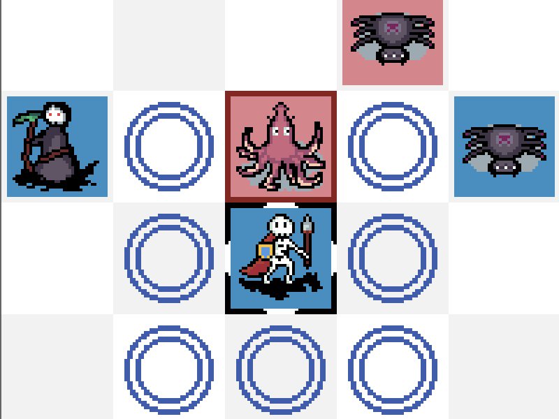

+++
title = "This Month in Rust GameDev #44 - March 2023"
transparent = true
date = 2023-04-05
draft = true
+++

<!-- no toc -->

<!-- Check the post with markdownlint-->

Welcome to the 44th issue of the Rust GameDev Workgroup's
monthly newsletter.
[Rust] is a systems language pursuing the trifecta:
safety, concurrency, and speed.
These goals are well-aligned with game development.
We hope to build an inviting ecosystem for anyone wishing
to use Rust in their development process!
Want to get involved? [Join the Rust GameDev working group!][join]

You can follow the newsletter creation process
by watching [the coordination issues][coordination].
Want something mentioned in the next newsletter?
[Send us a pull request][pr].
Feel free to send PRs about your own projects!

[Rust]: https://rust-lang.org
[join]: https://github.com/rust-gamedev/wg#join-the-fun
[pr]: https://github.com/rust-gamedev/rust-gamedev.github.io
[coordination]: https://github.com/rust-gamedev/rust-gamedev.github.io/issues?q=label%3Acoordination

- [Announcements](#announcements)
- [Game Updates](#game-updates)
- [Engine Updates](#engine-updates)
- [Learning Material Updates](#learning-material-updates)
- [Tooling Updates](#tooling-updates)
- [Library Updates](#library-updates)
- [Popular Workgroup Issues in Github](#popular-workgroup-issues-in-github)
- [Other News](#other-news)
- [Discussions](#discussions)
- [Requests for Contribution](#requests-for-contribution)
- [Jobs](#jobs)
- [Bonus](#bonus)

<!--
Ideal section structure is:

```
### [Title]


_image caption_

A paragraph or two with a summary and [useful links].

_Discussions:
[/r/rust](https://reddit.com/r/rust/todo),
[twitter](https://twitter.com/todo/status/123456)_

[Title]: https://first.link
[useful links]: https://other.link
```

If needed, a section can be split into subsections with a "------" delimiter.
-->

## Announcements

## Game Updates

### [8bit Duels]


_An 8bit Duels match_

[@ThousandthStar] is creating a simple multiplayer turn-based strategy using the
[Bevy Engine]. The [latest devlog] brings features like ownership indicators,
movement and attack animations, and a chat system.

The game is under development. The [8-bit Discord] is the best place to talk
about the game.

8bit Duels will be getting UI updates next, and the first version should release
soon after that. Other troops are coming as well.

_Discussions: [8-bit Discord]_

[8bit Duels]: https://thousandthstar.github.io/
[@ThousandthStar]: https://github.com/ThousandthStar
[Bevy Engine]: https://bevyengine.org/
[latest devlog]: https://thousandthstar.github.io/posts/8bd/8bd-part6/
[8-bit Discord]: https://discord.com/invite/NbBcF4bGU5

### [CyberGate][cybergate-yt]


_Particles emit from bullet hits and blackholes_

CyberGate ([YouTube][cybergate-yt], [Discord][cybergate-dis]),
an ambitious multiplayer project in development by CyberSoul,
aims to invite players into a constantly evolving universe.
Harnessing the power of procedural generation and artificial intelligence,
this work-in-progress aspires to provide an engaging experience
that emphasizes exploration and discovery across its diverse worlds.

The latest updates to CyberGate include:

- Skybox Animation and Transitions
- Dynamic Point Lights
- Particle System
- Post-processing Screen Shake for Hit Feedback
- Hit Particle Effects
- Blackhole

They released the 7th major update in March,
They are now working on universe generation alghoritms for the 8th.
Participate [by joining the Discord server][cybergate-dis].

[cybergate-yt]: https://youtube.com/channel/UClrsOso3Xk2vBWqcsHC3Z4Q
[cybergate-dis]: https://discord.gg/R7DkHqw7zJ

### [ZOMBIE DEMO GAME]


[ZOMBIE DEMO GAME] is a small third person zombie shooter by [@LPGhatguy] and
[@evaera] that released this month.

It features an astonishing 10 minutes of gameplay, a built-in level editor, and
zombies! It was produced in order to practice shipping a game and uses a custom
engine using wgpu, hecs, and lots of other great crates from the ecosystem.

ZOMBIE DEMO GAME is available for Windows and Linux
[on itch.io][ZOMBIE DEMO GAME] today.

_Discussion: [Twitter](https://twitter.com/LPGhatguy/status/1632596982928687104)_

[@LPGhatguy]: https://twitter.com/LPGhatguy
[@evaera]: https://twitter.com/evaeraevaera
[ZOMBIE DEMO GAME]: https://lpghatguy.itch.io/zombie-demo-game

### Shifting Chamber


Shifting Chamber ([itch.io][shifting-chamber-itch],
[Github][shifting-chamber-github]) is a simple tactics game where
player, instead of moving the character, manipulates the map around it.
The goal is to defeat the enemies by forcing them into hazardous
positions - since they cannot be attacked directly.

The game is in an early prototype / proof of concept phase.
It is written with a help of the Bevy engine.
There is currently only a WASM build (freely available on the itch.io)

[shifting-chamber-itch]: https://maciekglowka.itch.io/shifting-chamber
[shifting-chamber-github]: https://github.com/maciekglowka/shifting_chamber

## Engine Updates

### hotline


 _hotline live coding client_

hotline ([GitHub], [Blog], [Twitter]) is a modern, high-performance, hot-reload
graphics engine written in Rust. It aims to provide low-level access to modern
graphics API features, while at the same time providing high-level ergonomic
optimizations.  

It uses Bevy's ECS so the focus can remain primarily on the graphics
architecture. Direct3D12 is the only supported platform, but the graphics API is
abstracted to account for future ports to Vulkan and Metal. The project is in
its early stages but already has a decent amount of features showcasing
different render strategies, async command buffer generation, plugin based
architecture, and hot-reload support for Rust code, HLSL shaders, and render
configs. It supports ImGui with docking and multiple windows, video decoding,
complex image loading (cubemaps, arrays, volumes), and more.

[@polymonster] has been live streaming development on [Twitch] with archives
available on [YouTube]. Recently they have been designing a bindless material
system.

[@polymonster]: https://github.com/polymonster
[GitHub]: https://github.com/polymonster/hotline
[Blog]: https://www.polymonster.co.uk
[Twitter]: https://twitter.com/polymonster
[Twitch]: https://www.twitch.tv/polymonstr
[YouTube]: https://www.youtube.com/channel/UCQRmui5w4Urz-h4P9CL7rmA

## Learning Material Updates

### Developing an editor with egui


[@TheGrimsey] published a three-part series of articles about developing a Spell
Editor with egui.

- ["Databases & Editors (1/3)"] covers displaying egui windows & tables of
  entries.
- ["Editors (2/3): Editing entries"] elaborates on handling editing of entries &
  properties such as enums.
- Finally, ["Editors (3/3): Selection dialog & new entries"] talks about
  developing a selection dialog and creating new entries.

[@TheGrimsey]: https://mastodon.social/@TheGrimsey
["Databases & Editors (1/3)"]: https://thegrimsey.net/2023/03/07/Bevy-Four-Editor.html
["Editors (2/3): Editing entries"]: https://thegrimsey.net/2023/03/12/Bevy-Five-Editor-Two.html
["Editors (3/3): Selection dialog & new entries"]: https://thegrimsey.net/2023/03/21/Bevy-Six-Editor-Three.html

## Tooling Updates

### Tiger


Tiger ([Github][tiger-github],
[itch.io][tiger-itch.io] by
[@agersant] is a visual tool to
author game spritesheets and their metadata.

Version 1.0 launched this month, which means Tiger is ready for production.
It currently has the following features:

- Easy-to-use timeline to author animation.
- Supports perspectives for any 2D game (top-down, sidescroller, isometric,
  etc.).
- Automatically hot-reloads source images when they are changed.
- Packs animation frames into texture atlases.
- Can add and tag hitboxes.
- Flexible template system exports metadata in any text-based format.
- Free and open-source with a permissive license.

[tiger-github]: https://github.com/agersant/tiger
[tiger-itch.io]: https://agersant.itch.io/tiger
[@agersant]: https://mastodon.gamedev.place/@agersant

## Library Updates

### [`bevy_text_mode`]


[`bevy_text_mode`] ([GitHub][bevy_text_mode-src]) by [yopox] is a Bevy plugin which
makes it possible to set the background and the foreground color of a texture atlas
sprite (built-in Bevy sprites only have a tint property).
This plugin is convenient when using 1-bit tilesets such as [MRMOTEXT].

The 0.1 release adds a `TextModeTextureAtlasSprite` component with
configurable background, foreground, x/y flip and opacity.

_Discussion: [Mastodon](https://mstdn.social/@yopox/110010264001721310)_

[`bevy_text_mode`]: https://crates.io/crates/bevy_text_mode
[bevy_text_mode-src]: https://github.com/yopox/bevy_text_mode
[yopox]: https://github.com/yopox
[MRMOTEXT]: https://mrmotarius.itch.io/mrmotext

## Popular Workgroup Issues in Github

<!-- Up to 10 links to interesting issues -->

## Other News

<!-- One-liners for plan items that haven't got their own sections. -->

## Discussions

<!-- Links to handpicked reddit/twitter/urlo/etc threads that provide
useful information -->

## Requests for Contribution

<!-- Links to "good first issue"-labels or direct links to specific tasks -->

## Jobs

<!-- An optional section for new jobs related to Rust gamedev -->

## Bonus

<!-- Bonus section to make the newsletter more interesting
and highlight events from the past. -->

------

That's all news for today, thanks for reading!

Want something mentioned in the next newsletter?
[Send us a pull request][pr].

Also, subscribe to [@rust_gamedev on Twitter][@rust_gamedev]
or [/r/rust_gamedev subreddit][/r/rust_gamedev] if you want to receive fresh news!

<!--
TODO: Add real links and un-comment once this post is published
**Discuss this post on**:
[/r/rust_gamedev](TODO),
[Twitter](TODO),
[Discord](https://discord.gg/yNtPTb2).
-->

[/r/rust_gamedev]: https://reddit.com/r/rust_gamedev
[@rust_gamedev]: https://twitter.com/rust_gamedev
