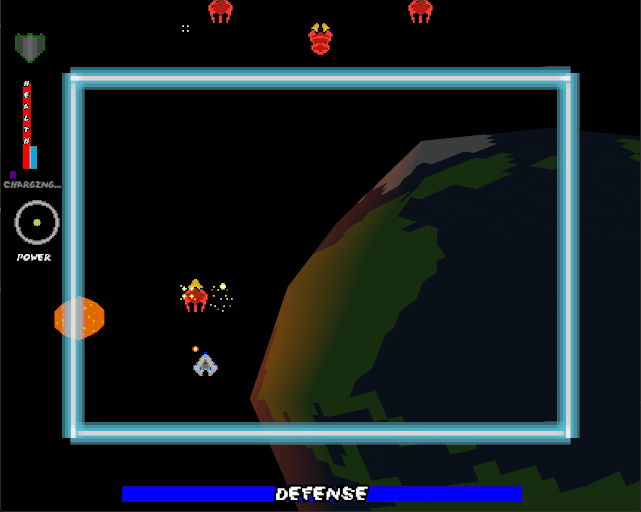
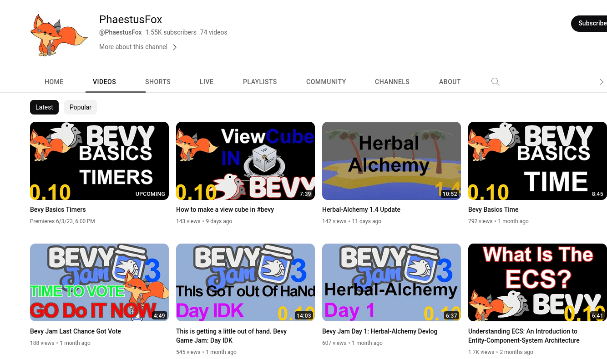
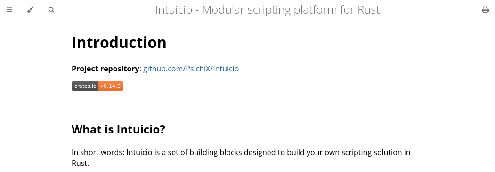
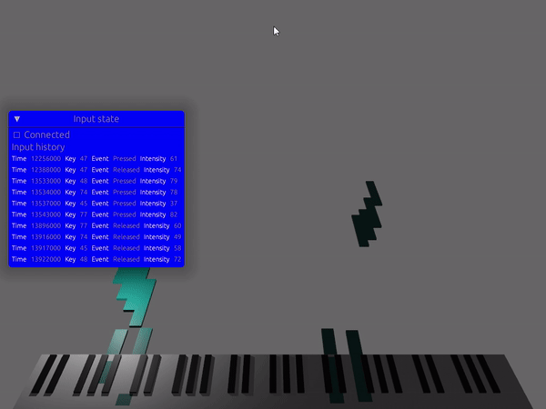
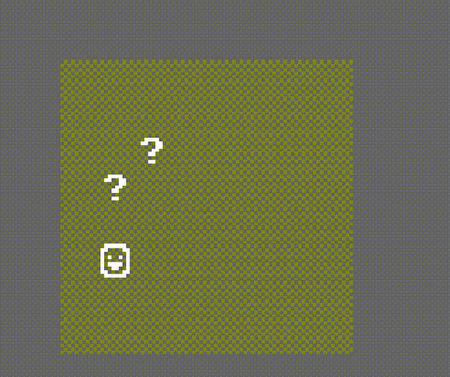
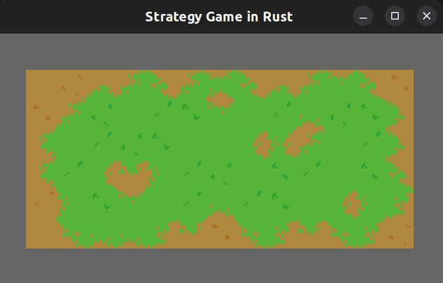

+++
title = "This Month in Rust GameDev #45 - April 2023"
transparent = true
date = 2023-05-08
draft = true
+++

<!-- no toc -->

<!-- Check the post with markdownlint-->

Welcome to the 45th issue of the Rust GameDev Workgroup's
monthly newsletter.
[Rust] is a systems language pursuing the trifecta:
safety, concurrency, and speed.
These goals are well-aligned with game development.
We hope to build an inviting ecosystem for anyone wishing
to use Rust in their development process!
Want to get involved? [Join the Rust GameDev working group!][join]

You can follow the newsletter creation process
by watching [the coordination issues][coordination].
Want something mentioned in the next newsletter?
[Send us a pull request][pr].
Feel free to send PRs about your own projects!

[Rust]: https://rust-lang.org
[join]: https://github.com/rust-gamedev/wg#join-the-fun
[pr]: https://github.com/rust-gamedev/rust-gamedev.github.io
[coordination]: https://github.com/rust-gamedev/rust-gamedev.github.io/issues?q=label%3Acoordination

- [Announcements](#announcements)
- [Game Updates](#game-updates)
- [Engine Updates](#engine-updates)
- [Learning Material Updates](#learning-material-updates)
- [Tooling Updates](#tooling-updates)
- [Library Updates](#library-updates)
- [Popular Workgroup Issues in Github](#popular-workgroup-issues-in-github)
- [Other News](#other-news)
- [Discussions](#discussions)
- [Requests for Contribution](#requests-for-contribution)
- [Jobs](#jobs)

<!--
Ideal section structure is:

```
### [Title]


_image caption_

A paragraph or two with a summary and [useful links].

_Discussions:
[/r/rust](https://reddit.com/r/rust/todo),
[twitter](https://twitter.com/todo/status/123456)_

[Title]: https://first.link
[useful links]: https://other.link
```

If needed, a section can be split into subsections with a "------" delimiter.
-->

## Announcements

## Game Updates

### [CyberGate][cybergate-yt]


_hundreds of npcs smoothly interpolating_

CyberGate ([YouTube][cybergate-yt], [Discord][cybergate-dis]),
an ambitious multiplayer project in development by CyberSoul,
aims to invite players into a constantly evolving universe.
Harnessing the power of procedural generation and artificial intelligence,
this work-in-progress aspires to provide an engaging experience
that emphasizes exploration and discovery across its diverse worlds.

The latest updates to CyberGate include:

- Networking Interpolation version 2:
  increased reliability over frame rate changes,
  improved accuracy of object motion and detail by ~20%,
  and objects update 12-45 milliseconds faster.
- Server compilation was drastically simplified (100x faster).
- Improved browser server process, to have more consistent behavior.
- Improved mouse lock on browsers.
- Simplified code related to state synchronization.
- Significant gameplay changes and bug fixes.

They are currecntly working on universe generation alghoritms for version 8.0.
Participate [by joining the Discord server][cybergate-dis].

[cybergate-yt]: https://youtube.com/channel/UClrsOso3Xk2vBWqcsHC3Z4Q
[cybergate-dis]: https://discord.gg/R7DkHqw7zJ

### [Jumpy]


_Online Matchmaking_

[Jumpy] ([GitHub][Jumpy], [Discord][jumpy_discord], [Twitter][jumpy_twitter]) by
[Spicy Lobster][spicy_lobster] is a pixel-style, tactical 2D shooter with a fishy
theme.

In the last month, Jumpy released [v0.7.0][jumpy_v0.7.0] with support for online
and LAN network games! Networking has been a long time comming, with many
architecture decisions being made specifically with networking in mind. While
network performance may still need to be tweaked, and there are still some bugs
to fix, the proof-of-concept was a success. You can start matches on your local
network, or online, with no configuration necessary!

The Fish Folk game series has a [pre-launch page up on Kickstarter][jumpy_ks],
expected to go public in mid-May.

[Jumpy]: https://github.com/fishfolks/jumpy
[jumpy_v0.7.0]: https://github.com/fishfolk/jumpy/releases/tag/v0.7.0
[jumpy_twitter]: https://twitter.com/spicylobsterfam
[jumpy_discord]: https://discord.gg/4smxjcheE5
[spicy_lobster]: https://spicylobster.itch.io
[jumpy_ks]: https://www.kickstarter.com/projects/erlendsh/fish-folk

### [Thetawave][thetawave-itch]



Thetawave is an open-source, physics based, space shooter game.
This month, Thetawave 0.1.0 was [released][thetawave-release].
The main features of this update were:

- local multiplayer,
- a second character,
- many sprite adjustments,
- and many gameplay tweaks from in-person playtesting with
  the [thetawave arcade cabinet][thetawave-arcade].

The easist way to play the most up to date version of Thetawave
on your machine is to download it through the
[Spicy Launcher][spicy-launcher]. Otherwise, you can play the game in your
browser on the [itch.io page][thetawave-itch].

Feel free to reach out in the #thetawave channel in
the [Spicy Lobster discord server][spicy-discord] if you are
interested in contributing.

[thetawave-itch]: https://metalmancy.itch.io/thetawave
[thetawave-release]: https://github.com/thetawavegame/thetawave/releases/tag/v0.1.0
[thetawave-arcade]: https://twitter.com/carlosupina/status/1650200385485774850
[spicy-launcher]: https://github.com/spicylobstergames/SpicyLauncher/releases/tag/v0.3.0
[spicy-discord]: https://discord.gg/52WCcgJkcE

### [Way of Rhea][wor]

[][wor]

[Way of Rhea][wor] is a puzzle game with hard puzzles and forgiving
mechanics being produced by [@masonremaley] in a custom Rust engine.
You can support development by [checking out the free demo and wishlisting on Steam][wor]
or [signing up for the mailing list][wor-mail]!

Recent updates:

- Time controls (pause, play, fastforward)
- Staves switch in place so that crabs don't inadvertantly move them when cycling
- Increased drag on various physics objects to prevent bouncing over targets
- Increased staff throw velocity to make it easier to throw staves off ledges
- Improved interactive hover visuals on staves
- Fixed bug where you could take objects from the crab while he's riding the elevator
- Fixed edge cases around saving on load screens
- Fixed edge cases with sleep system and pausing
- More flexible save points in crab puzzles (save points can now conditionally
  trigger only when a crab is present)
- More work on end game

Also, Way of Rhea was part of the [Steam Puzzle Fest][wor-puzzle-fest]!

[@masonremaley]: https://twitter.com/masonremaley
[wor]: https://store.steampowered.com/app/1110620/Way_of_Rhea/?utm_campaign=tmirgd&utm_source=n45
[wor-mail]: https://anthropicstudios.com/newsletter/signup/tech
[wor-puzzle-fest]: https://store.steampowered.com/category/puzzle_matching

### [l1t]


[l1t] by [@alex-laycalvert] is a WIP terminal game about
shooting lasers and lighting statues to solve puzzles.

In each level, you have to configure mirrors, lasers, and other items
to light up all the statues while avoiding any mishaps like shooting
yourself with a laser beam.

There's only 4 core levels right now but in addition to adding more
the developer is working on a repository system where web servers
can host level files and users can subscribe to them.

_Discussions: [/r/rust](https://reddit.com/r/rust/comments/12yzet7/l1t)_

[l1t]: https://github.com/alex-laycalvert/l1t
[@alex-laycalvert]: https://aldevelop.com

### [Maginet]


[Maginet] by [Evrim] is a fast-paced turn-based strategy game
with local/versus-ai/online play on PC/mobile
where two guilds of mages battle each other.

[This month's updates][maginet-log] include:

- New mage and board sprites from [@MrmoTarius].
- New main menu that brings the ability to switch between loadout modes.
- Better AI heuristics for evaluating the board.
- Better health UI.

The developers are looking for feedback from testers.

[Evrim]: https://twitter.com/evrimzone
[Maginet]: https://evrimzone.itch.io/maginet
[@MrmoTarius]: https://twitter.com/MrmoTarius
[maginet-log]: https://evrimzone.itch.io/maginet/devlog/519667/grand-ceremony-for-the-beta

### [Idu][idu-itch]


[Idu][idu-itch] ([Discord][idu_discord]) is a strategic sandbox game about growing
plants that wish to reclaim nature, developed by [Elina Shakhnovich][eli_mastodon]
and [Johann Tael][johann_mastodon] featuring a bespoke Vulkan-based engine in Rust.

This month [a new demo was released][idu-new-demo]:

- New inventory and interaction system.
- Office file cabinets for keeping things tidy.
- Converters convert signals from nearby flowers into colorful blocks.

[idu_discord]: https://discord.gg/MeGauteMj3
[eli_mastodon]: https://mastodon.gamedev.place/@eli
[johann_mastodon]: https://mastodon.gamedev.place/@johann
[idu-itch]: https://epcc.itch.io/idu
[idu-new-demo]: https://epcc.itch.io/idu/devlog/513652/demo-version-10-flower-tuned-antennas

### [Tiny Glade]


_Demo of the gothic windows system_

[Tiny Glade] ([Twitter][tglade-twi], [Youtube][tglade-yt]) is a small relaxing game
about doodling castles.

[This month's updates][tglade-post] include:

- More brick colors.
- New gothic windows style.
- Ability to merge windows together into a bigger one.
- New arch algorithm that works better for rough terrain.
- The project's beta testing should start this summer
  and the release should happen somewhere in 2024.

[Tiny Glade]: https://store.steampowered.com/app/2198150/Tiny_Glade
[tglade-twi]: https://twitter.com/PounceLight
[tglade-yt]: https://youtube.com/@pouncelight
[tglade-post]: https://store.steampowered.com/news/app/2198150?emclan=103582791472800070&emgid=3682298662732600151

### [Hydrofoil Generation][hgs]


[Hydrofoil Generation][hgs]
([Steam][hgs_steam], [Facebook][hgs_facebook], [Discord][hgs_discord])
is a realistic sailing/foiling inshore simulator in development for PC/Steam
that puts you in the driving seat of modern competitive sailing
that is available in Early Access on Steam.

[This month's updates][hgs_allnews] include:

- A brand new location to test your hydrofoil skills: [Bermuda][hgs_video].
- An improved protocol for line crossing detection is now implemented,
  which means that Hydrofoil Generation is now even more fair and accurate.
- Also, [the game won][hgs_award] two Silver awards for the PC Game:
  Racing and Simulation category.

[hgs]: https://hydrofoil-generation.com
[hgs_facebook]: https://facebook.com/HydrofoilGenerationSailing/
[hgs_discord]: https://discord.gg/DtKgt2duAy/
[hgs_steam]: https://store.steampowered.com/app/1448820/Hydrofoil_Generation
[hgs_award]: https://store.steampowered.com/news/app/1448820/view/3723957592121893508
[hgs_allnews]: https://steamcommunity.com/app/1448820/allnews
[hgs_video]: https://youtube.com/watch?v=qUggXlUfflY

## Engine Updates

### [Ambient][ambient-github]


_A 10-second preview of what's possible with Ambient 0.2_

[Ambient 0.2](ambient-blog) is now out after two months of development.
Ambient is an open-source runtime for building high-performance multiplayer
games and 3D applications powered by WebAssembly, Rust and WebGPU. Projects
consist of assets and logic built around the currently Rust-only Ambient API,
and these projects can be loaded by any compatible runtime running on any
platform.

This release brings a few major features, including basic support for playing
sounds, being able to run WASM on the client (in addition to the server), and
automatic proxying of servers by the Ambient Proxy. This allows anyone with
the URL to connect to a server, without having to worry about port forwarding.

Finally, Ambient UI can now be used from guest code. Combined with networking
and ECS, this unlocks an exciting new capability: multiplayer UI! The blog post
walks through the creation of a basic multiplayer beat sequencer using these
features.

Check out [the GitHub][ambient-github] to get started with building for/or
on Ambient yourself, or chat with the developers and other explorers on
[the Discord][ambient-discord].

_Discussion: [/r/rust][ambient-reddit], [Hacker News][ambient-hn]_

[ambient-github]: https://github.com/AmbientRun/Ambient
[ambient-blog]: https://www.ambient.run/post/ambient-0-2
[ambient-reddit]: https://www.reddit.com/r/rust/comments/138ii11/ambient_02_multiplayer_ui_sound_clientside_wasm/
[ambient-hn]: https://news.ycombinator.com/item?id=35828165
[ambient-discord]: https://discord.gg/ambient

### [godot-rust][gd-github]


The Godot 4 binding for Rust, also known as [gdext][gd-gdext], now features
[a reworked website][gd-website]. The site acts as a hub to all the relevant
resources and community platforms. It also hosts auto-generated API docs
from `cargo doc`, for latest snapshots and active pull requests.

On the library side, April has brought [lots of improvements][gd-pulse]
regarding engine interaction, notably:

- FFI bugfixes ([#234][gd-234], [#249][gd-249], [#250][gd-250])
- Class constants and notifications ([#219][gd-219], [#223][gd-223])
- `Callable` support ([#231][gd-231])
- Initial threading experiments ([#212][gd-212])

For the near future, the plan is to iron out the new website and CI, as well
as some QoL improvements such as better compile times.

[gd-github]: https://github.com/godot-rust
[gd-gdext]: https://github.com/godot-rust/gdext
[gd-website]: https://godot-rust.github.io/
[gd-godot4]: https://godotengine.org/article/godot-4-0-sets-sail/
[gd-pulse]: https://github.com/godot-rust/gdextension/pulse/monthly
[gd-212]: https://github.com/godot-rust/gdextension/issues/212
[gd-219]: https://github.com/godot-rust/gdextension/issues/219
[gd-223]: https://github.com/godot-rust/gdextension/issues/223
[gd-231]: https://github.com/godot-rust/gdextension/issues/231
[gd-234]: https://github.com/godot-rust/gdextension/issues/234
[gd-250]: https://github.com/godot-rust/gdextension/issues/250
[gd-249]: https://github.com/godot-rust/gdextension/issues/249

## Learning Material Updates

### [Bevy <3 Github Actions][bevy-github-actions-blog]


[Piotr Siuszko][piotr-siuszko] wrote [a blog post][bevy-github-actions-blog]
explaining how to automate building and publishing game written with Bevy
to GitHub Pages using GitHub Actions.

[piotr-siuszko]: https://mastodon.gamedev.place/@MevLyshkin
[bevy-github-actions-blog]: https://mevlyshkin.com/blog/bevy-github-actions

### [PhaestusFox's Bevy Videos][phaestusfox-youtube-channel]



[PhaestusFox][phaestusfox] makes [tutorials][phaestusfox-youtube-channel]
on Youtube about all things Bevy.
Level up your game dev skills with PhaestusFox's tutorials and learn more from
very basic how-to's to more complex full tutorials like how to make a platformer
in Bevy.

[phaestusfox]: https://github.com/PhaestusFox
[phaestusfox-youtube-channel]: https://www.youtube.com/@PhaestusFox

### [Katamari for the BevyJam3][katamari-gamejam-blog]


[Ryosuke][whoisryosuke] recently participated in a Bevy game jam.
Ryosuke's goal was to create a game inspired by Katamari Damacy, an old
PlayStation 2 game. In the game, a prince rollsup objects to make planet
sized balls.
Ryosuke shares their [learning process][katamari-gamejam-blog] of the almost-finished
Katamari clone running on Windows. They cover topics like the physics library and
how they created the user interface using a tool egui.
It is also suggested to have some basic knowledge of Bevy game engine
before you dive into the article.

[whoisryosuke]: https://mastodon.gamedev.place/@whoisryosuke
[katamari-gamejam-blog]: https://whoisryosuke.com/blog/2023/making-katamari-for-bevy-game-jam/

### [Building scripting solution w. Intuicio][intuicio-blog]



[Patryk Budzyński][PsichiX] recently shared their project [Intuicio][intuicio-blog],
Intuicio is a set of building blocks in Rust that allows you to create your own
scripting solution. It consists of scripts, frontends, backends, and hosts.
You can also follow a [tutorial-blog] to build the entire scripting pipeline 
step by step.

[PsichiX]: https://github.com/PsichiX
[intuicio-blog]: https://psichix.github.io/Intuicio/index.html
[tutorial-blog]: https://psichix.github.io/Intuicio/tutorial/index.html

### [3D MIDI Piano Using Bevy][3dpiano-blog]



[Ryosuke][whoisryosuke] recently published a [blog post][3dpiano-blog],
which is a tutorial to create a 3D MIDI piano visualizer app using the
Bevry game engine in Rust. They shared their learning experience, including
reading MIDI input with Rust and integrating it with the game engine.

[whoisryosuke]: https://mastodon.gamedev.place/@whoisryosuke
[3dpiano-blog]: https://whoisryosuke.com/blog/2023/3d-midi-piano-using-rust-and-bevy/

### [DOOM maps to SVG to laser cutter][svg-cutter-blog]


[Theor][theor-author] became interested in the data format of the classic game Doom
and decided to write Rust code to extract its maps and convert them into vector
graphics for laser cutting.
Theor's [blog post][svg-cutter-blog] explores Doom specifics, geometry, writing SVG,
rendering and triangulation.

_Discussions: [/r/rust](https://www.reddit.com/r/rust/comments/12mlsfj/wrote_a_blog_post_on_my_attempt_to_lasercut_doom/)_

[svg-cutter-blog]: https://theor.xyz/doom-maps-laser-cut/
[theor-author]: https://github.com/theor

### [Exploring Bevy's Game Of Life Example][exploring-gol-blog]


_Game of Life Simulation_

[Yendor][yendor] published [a mini-tutorial series][exploring-gol-blog]
exploring compute shaders in Bevy using their [Game of Life example][bevy-gol]
and adding some new featues to it: camera controller, wrapping simulation, and
drawing on the simulation.

[yendor]: https://github.com/lecoqjacob
[exploring-gol-blog]: https://lecoqjacob.github.io/bevy_shader_playground/bevy_gol_example/index.html
[bevy-gol]: https://github.com/bevyengine/bevy/blob/main/examples/shader/compute_shader_game_of_life.rs

### [Test-Driven Development in Rust Game Development with Bevy][bevy-tdd]


[Edgardo Carreras writes about his experience][bevy-tdd] with Test-Driven Development
while developing a game engine in Rust using Bevy. TDD is an iterative software
development approach that involves writing automated tests before writing the code.
In the article, Edgardo explains the benefits of TDD and how it can help in game
development. He also shares his testing process, including how he used Bevy's ECS
architecture to write tests for his game engine.

_Discussions: [/r/rust_gamedev](https://reddit.com/r/rust_gamedev/comments/12bnzin/bevy_tdd)_

[bevy-tdd]: https://edgardocarreras.com/blog/tdd-in-rust-game-engine-bevy

### [Bevy Roguelike Tutorial][bevy-roguelike-blog]



[@maciekglowka][bevy-roguelike-mastodon] started a blog series on creating a
roguelike game using Bevy Engine.
There are currently seven parts, focusing mostly on setting up a basic
game architecture. The topics discussed so far include: separating logic from
graphics in the ECS; designing a turn-based game loop; command pattern
for the unit actions.

The first part of the series can be found [here][bevy-roguelike-blog].

_Discussions: [/r/roguelikedev](https://www.reddit.com/r/roguelikedev/comments/12rvj30/creating_a_roguelike_in_bevy_engine/)_

[bevy-roguelike-mastodon]: https://mastodon.gamedev.place/@maciekglowka
[bevy-roguelike-blog]: https://maciejglowka.com/blog/bevy-roguelike-tutorial-devlog-part-1

### [Making A Strategy Game][strategy-game-blog]



[Sergio Rodrigo Royo][sergiorodrigo] started a [series of blogs][blogs] for Rust
game development. In their [tutorial][strategy-game-blog]
Sergio created a 2D turn-based strategy game. In the tutorial series, one will learn
how to's such as: adding differents units, sound effects, providing multiplayer support
and designing a simple UI.

[sergiorodrigo]: https://srodrigoroyo.com/about/
[strategy-game-blog]: https://srodrigoroyo.com/game-development-in-rust-strategy-game-1/#game-development-in-rust-making-a-strategy-game-part-1--the-battlefield
[blogs]: https://srodrigoroyo.com/blog/

### [Rendering Football Data in 3D][3d-football-rs]


[UnravelSports][unravelsports] recently presented their [latest project][3d-football-rs].
The project is a proof-of-concept to show football data in 3D and the ultimate goal
is to utilize this feature to animate body-pose data and potentially connect it
to a VR in the future.
In addition, check out the [powerpoint presentation][ppt-link] for more in-depth
explanations.

[3d-football-rs]: https://github.com/UnravelSports/rs-football-3d
[unravelsports]: https://unravelsports.github.io/
[ppt-link]: https://github.com/UnravelSports/rs-football-3d/blob/master/assets/ppt.pdf

### [AI learns to play flappy bird][flappy-bird-ai]


[bones-ai][bones-ai-github] recently shared [their project][flappy-bird-ai],
which is a neuro-evolution simulation of an AI playing popular game Flappy Bird.
In the [youtube video][flappybird-youtube-link] 1000 AI agents are released into
the game environment of Flappy Bird with the goal of learning how to survive and
stay alive for as long as possible.

[bones-ai-github]:https://github.com/bones-ai
[flappy-bird-ai]: https://github.com/bones-ai/rust-flappy-bird-ai
[flappybird-youtube-link]: https://www.youtube.com/watch?v=Ea_N1CJwMR8

## Tooling Updates

### [Rustracer][rustracer]

[][rustracer-0.2.0 demo]

Rustracer, a PBR [glTF 2.0][glrf-2-0] renderer based on Vulkan ray-tracing.
It can render (almost) any glTF 2.0 scene by pure path tracing at an interacive speed.
Compared with rasterization-based glTF renderers, Rustracer needs some
(scene-dependent) time for sample accumulation in exchange for global illumination.

On top of that, the control panel provides a rich set of viewing options
and debugging utilities.

It also can serve as a glTF viewer or a reference renderer.

The code base itself is a learning resource for [Ash] (Vulkan bindings in Rust),
hardware ray tracing and glTF processing in Rust.

[rustracer]: https://github.com/KaminariOS/rustracer
[rustracer-0.2.0 demo]: https://youtube.com/playlist?list=PLD1H28onwV_kdxp1ajUL6riK_dNzMAXGj
[Ash]: https://github.com/ash-rs/ash
[glrf-2-0]: https://www.khronos.org/gltf

### [Luminol][luminol]


[Luminol][luminol] by [@speak2erase] and [@somedevfox] is a remake
of the RPG Maker editor, based mostly off of [RPG Maker XP][RMXP]
(aka RMXP), with the intent of creating a more modern, feature rich,
and open source version of RMXP.

RGSS, RMXP's runtime, has already been open sourcecd thanks to [mkxp].
However despite the several attempts, no one has fully remade the editor.
There are [some tools][r48] out there which cover some of its functionality,
but none are user friendly, nor feature complete.

RGSS is actually quite enjoyable to use. The actual editor though - not so much:
dated and often unintuitive UI, extensibility issues,
binary format that is allergic to source control,
and arbitrary limits that never existed in previous versions.
Luminol was born out of sheer frustration from dealing with these issues -
and hopes to fix them!

Luminol's key differences:

- Completely GPU accelerated (RMXP is software rendered).
- Edit multiple maps at the same time.
- Multiple data formats.
- Edit encrypted archives (rgssad).
- Open-source.
- Better user experience overall.

Luminol is currently looking for contributors:
[there is a lot to be done][luminol-issues].
If you'd like to help contribute, please reach out to [@speak2erase]!

[luminol]: https://github.com/Astrabit-ST/Luminol
[luminol-issues]: https://github.com/Astrabit-ST/Luminol/issues
[@speak2erase]: https://github.com/Speak2Erase
[@somedevfox]: https://github.com/somedevfox
[RMXP]: https://store.steampowered.com/app/235900/RPG_Maker_XP
[mkxp]: https://github.com/Ancurio/mkxp
[r48]: https://github.com/20kdc/gabien-app-r48

### [Graphite][graphite-website]


Graphite ([website][graphite-website], [GitHub][graphite-repo],
[Discord][graphite-discord], [Twitter][graphite-twitter]) is a free,
in-development raster and vector 2D graphics editor based around a Rust-powered
node graph compositing engine.

April's [sprint 25][graphite-sprint-25] developments:

- Brushing up: The new Brush tool makes it possible to paint raster-based art.
- Writing down: A refactor of the Text tool integrates typographic content in
  the node graph. Finally, all artwork types are node-based.
- Showing true colors: Node graph compositing now uses linear, not gamma,
  color. Key new color adjustment nodes are added.
- Laying the groundwork: Further engineering work prepares the node graph
  language for GPU execution. And development continues toward in-graph layer
  stack compositing.

As always, new contributors are cordially invited to
[get involved][graphite-contribute] and take on
[approachable issues][graphite-approachable-issues] with help from the
project's friendly and supportive developer community on Discord.

[Open Graphite][graphite-editor] in your browser and start creating!

[graphite-website]: https://graphite.rs
[graphite-repo]: https://github.com/GraphiteEditor/Graphite
[graphite-discord]: https://discord.graphite.rs
[graphite-twitter]: https://twitter.com/GraphiteEditor
[graphite-sprint-25]: https://github.com/GraphiteEditor/Graphite/milestone/25
[graphite-contribute]: https://graphite.rs/contribute/
[graphite-approachable-issues]: https://github.com/GraphiteEditor/Graphite/labels/Good%20First%20Issue
[graphite-editor]: https://editor.graphite.rs

### [Image Maniac][im]


[Image Maniac][im] is a cross-platform image viewer designed for game developers
and other creative professionals. The project's features include:

- Infinite canvas for for drag-n-droping many images onto the main window,
  and view them all in a single, unified workspace.
- Quick RGBA channel switching using number keys is usefil for
  game developers who work with textures and materials.
- Broad format support including PNG, JPG, BMP, DDS, TGA, KTX2, and HDR.
- Focus on performance even with large files and multiple image at once.

_Discussions: [/r/rust](https://reddit.com/r/rust/comments/133ruqi/image_maniac)_

[im]: https://github.com/AllenDang/img_maniac

## Library Updates

### [Backpack]


_Minimalist schema for sharing items in different games_

[Backpack] is an inventory system to share items between different games,
for example:

- Raise a crab in Crab Simulator,
- Make it fight in Crab Shooter,
- Cook it in Crab Cook...
- Gain a crab skin in your favorite game!

[Backpack] is in a pre-MVP state: a tech prototype is working.

The project is not affiliated or related to Blockchain/NFTs:
it uses a PostgreSQL DB to store users, games and items.
Authentication is done via email/password,
third party authentication via OAuth will be a future goal.
An Authenticated user can create apps and add item definitions to these.
Other users can get an independant instance of that item and modify its data.

The next project milestone is
2 minimalist interconnected games released by the end of 2023.

[Backpack]: https://github.com/Vrixyz/backpack

## Popular Workgroup Issues in Github

<!-- Up to 10 links to interesting issues -->

## Other News

<!-- One-liners for plan items that haven't got their own sections. -->

- Other game updates:
  - [Combine&Conquer v0.5.2][cnc-052] brings
    significant graphical improvements.
  - exocave - an FPS about exploring a subterranean world -
    [got a grappling hook][exocave] to ease the movement through caverns and chasms.
  - [Railroad Scheduler] is a game about planning routes and schedule
    for a set of trains.
  - [Stellar Cortex's first devlog is out][s-cortex-log]:
    it talks about foundational systems that should allow space based commerce.
  - [Logic RPG][lrpg] got two vlogs: [about CI and docs][lrpg-1] and
    [post processing, 3D conversions, and physics][lrpg-2].
  - [Elttob released a couple vlogs][stockholm] about their voxel game Stockholm.
  - [Digital Extinction's recent updates][de] include unit manufacturing,
    shadows, and multiplayer.
- Other engine updates:
  - [ggez is looking for new maintainers][ggez-maintain].
- Other tooling updates:
  - [ironboy] by @nicolas-siplis is a high accuracy GameBoy emulator
    written in Rust and available in the browser via WASM.
- Other library updates:
  - [Strolle][strolle] is an experimental real-time renderer that supports
    global illumination.
  - [blend v0.8][blend] brings better support for Blender primitives
    and API improvements.
  - [lox] is a library for creating, generating, processing,
    and analyzing polygon meshes.
  - [bitcode] is a games-oriented bitwise encoder/decoder which attempts
    to shrink the serialized size without sacrificing speed.
  - [virtual_joystick] provides a virtual joystick UI widgets for Bevy projects.
  - [faer v0.7][faer-07] and [v0.8 releases][faer-08] bring
    better SIMD operations support for non native types
    and overall performance improvements.
  - [egui_graphs] provides an interactive graph visualization widget powered
    by egui and petgraph.
  - [Alkahest][alkahest] is a schema-based serialization library
    that features infallible serialization, zero-overhead serialization of sequences,
    lazy deserialization and supports wide variety of formulas.
  - [wgpu v0.16][wgpu-v016] brings a bunch of changes to sync with latest spec,
    improved APIs, and lots of bugfixes.
  - [the png create][png] got an ultrafast compression mode \-
    up to 4x faster decompression.

[cnc-052]: https://buckmartin.de/combine-and-conquer/2023-04-05-v0.5.2.html
[exocave]: https://cragwind.itch.io/exocave/devlog/516142/grappling-hook
[Railroad Scheduler]: https://coffejunkstudio.itch.io/railroad-scheduler
[s-cortex-log]: https://bentley.codes/stellar-cortex/foundations-of-a-space-based-economy
[lrpg]: https://logicprojects.itch.io/logic-rpg
[lrpg-1]: https://youtube.com/watch?v=a9LZYozNChg
[lrpg-2]: https://youtube.com/watch?v=SmqQ_Is9QX8
[stockholm]: https://youtube.com/playlist?list=PLsFMLV-H_GYt8KzbJnzrapNkUNtRcBB2n
[de]: https://mgn.cz/blog
[strolle]: https://reddit.com/r/rust/comments/12u4ovi/strolle
[ggez-maintain]: https://github.com/ggez/ggez/issues/1188
[ironboy]: https://reddit.com/r/rust/comments/12qj2ty/ironboy
[blend]: https://github.com/lukebitts/blend/blob/master/CHANGELOG.md#blend-08
[lox]: https://reddit.com/r/rust/comments/12teoxi/lox_a_fast_polygon_mesh_library
[bitcode]: https://reddit.com/r/rust/comments/12nw1pc/bitcode_format
[virtual_joystick]: https://github.com/SergioRibera/virtual_joystick
[faer-07]: https://reddit.com/r/rust/comments/12estz9/faer_07
[faer-08]: https://reddit.com/r/rust/comments/12tw26r/faer_08
[egui_graphs]: https://github.com/blitzarx1/egui_graphs
[alkahest]: https://reddit.com/r/rust_gamedev/comments/12auz7o/alkahest_02
[wgpu-v016]:https://github.com/gfx-rs/wgpu/releases/tag/v0.16.0
[png]: https://reddit.com/r/rust/comments/12ks0ka/png_crate_gets_an_ultrafast_compression_mode

## Discussions

<!-- Links to handpicked reddit/twitter/urlo/etc threads that provide
useful information -->

## Requests for Contribution

<!-- Links to "good first issue"-labels or direct links to specific tasks -->

## Jobs

<!-- An optional section for new jobs related to Rust gamedev -->

------

That's all news for today, thanks for reading!

Want something mentioned in the next newsletter?
[Send us a pull request][pr].

Also, subscribe to [@rust_gamedev on Twitter][@rust_gamedev]
or [/r/rust_gamedev subreddit][/r/rust_gamedev] if you want to receive fresh news!

<!--
TODO: Add real links and un-comment once this post is published
**Discuss this post on**:
[/r/rust_gamedev](TODO),
[Mastodon](TODO),
[Twitter](TODO),
[Discord](https://discord.gg/yNtPTb2).
-->

[/r/rust_gamedev]: https://reddit.com/r/rust_gamedev
[@rust_gamedev]: https://twitter.com/rust_gamedev
