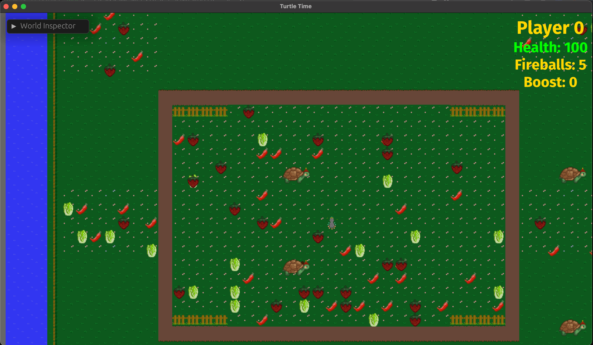

+++
title = "This Month in Rust GameDev #46 - May 2023"
transparent = true
date = 2023-06-30
draft = false
+++

<!-- no toc -->

<!-- Check the post with markdownlint-->

Welcome to the 46th issue of the Rust GameDev Workgroup's
monthly newsletter.
[Rust] is a systems language pursuing the trifecta:
safety, concurrency, and speed.
These goals are well-aligned with game development.
We hope to build an inviting ecosystem for anyone wishing
to use Rust in their development process!
Want to get involved? [Join the Rust GameDev working group!][join]

You can follow the newsletter creation process
by watching [the coordination issues][coordination].
Want something mentioned in the next newsletter?
[Send us a pull request][pr].
Feel free to send PRs about your own projects!

[Rust]: https://rust-lang.org
[join]: https://github.com/rust-gamedev/wg#join-the-fun
[pr]: https://github.com/rust-gamedev/rust-gamedev.github.io
[coordination]: https://github.com/rust-gamedev/rust-gamedev.github.io/issues?q=label%3Acoordination

- [Announcements](#announcements)
- [Game Updates](#game-updates)
- [Engine Updates](#engine-updates)
- [Learning Material Updates](#learning-material-updates)
- [Tooling Updates](#tooling-updates)
- [Library Updates](#library-updates)
- [Other News](#other-news)
- [Discussions](#discussions)
- [Requests for Contribution](#requests-for-contribution)

<!--
Ideal section structure is:

```
### [Title]


_image caption_

A paragraph or two with a summary and [useful links].

_Discussions:
[/r/rust](https://reddit.com/r/rust/todo),
[twitter](https://twitter.com/todo/status/123456)_

[Title]: https://first.link
[useful links]: https://other.link
```

If needed, a section can be split into subsections with a "------" delimiter.
-->

## Announcements

### [Rusty Jam \#3][rj3]


_Find Ferris_

[Rusty Jam \#3][rj3] ran from May 21st 2023 to May 29th 2023 and the theme was
"Hidden in plain sight".
The jam had a few but high-quality and awesome games.

Here're the winners:

- 🥇 [Find Ferris](https://kuviman.itch.io/find-ferris) by kuviman.
- 🥈 [Tug of Orb](https://anders429.itch.io/tug-of-orb) by anders429.
- 🥉 [The Veiled Path](https://jebik.itch.io/the-veiled-path) by Jebik.

We wish all the participants good luck in their future endeavors!
The RustyJam will be back, so stay tuned on
[the Rusty Jam Discord][rj-dis] for future updates!

[rj3]: https://itch.io/jam/rusty-jam-3
[rj-dis]: https://discord.gg/jZtz6y9gCJ

### [Rust GameDev Meetup \#27][meetup-video]

[][meetup-video]

The 27th Rust Gamedev Meetup took place in March. You can watch the recording
of the meetup [here on Youtube][meetup-video].

The schedule:

- Rusty Jam 3 by [@ElhamAryanpur]
- Blue Engine by [@ElhamAryanpur]
- Rerun by [@wumpf]
- Graphite by [@Keavon]

The meetups take place on the second Saturday of every month via the [Rust
Gamedev Discord server][rust-gamedev-discord] and are also [streamed on
Twitch][rust-gamedev-twitch].

[meetup-video]: https://youtube.com/watch?v=WQ3ncBe9srM
[rust-gamedev-discord]: https://discord.gg/yNtPTb2
[rust-gamedev-twitch]: https://twitch.tv/rustgamedev
[@ElhamAryanpur]: https://github.com/ElhamAryanpur
[@wumpf]: https://github.com/wumpf
[@Keavon]: https://github.com/Keavon

## Game Updates

### Digital Extinction


_Building Placement in Digital Extinction_

[Digital Extinction] ([GitHub][de-github], [Discord][de-discord],
[Reddit][de-reddit]) by [@Indy2222] is a 3D real-time strategy game made with
[Bevy].

The most notable updates are:

- poles at unit manufacturing delivery locations for selected factories,
- pausing unit manufacturing when the spawn location is occupied,
- [IME][ime] support for text boxes,
- a lot of progress on multiplayer networking,
- [logging][de-logging] to file and other logging improvements.

Support for multiplayer is a technologically complex problem to solve and it is
the last major missing feature before the [proof-of-concept][de-poc] version
can be released. Therefore, a lot of effort currently goes in this direction.

The game is slowly gaining traction in the development community.
Check out our new [contributors here][de-contributors].

See [gameplay][de-video] screen recordings on YouTube.

More detailed monthly updates are available [here (May)][de-update-07] and
[here (June)][de-update-08].

[Digital Extinction]: https://de-game.org
[de-github]: https://github.com/DigitalExtinction/Game
[de-discord]: https://discord.gg/vHMFuCWGSX
[de-reddit]: https://reddit.com/r/DigitalExtinction
[Bevy]: https://bevyengine.org
[ime]: https://en.wikipedia.org/wiki/Input_method
[de-logging]: https://docs.de-game.org/logging/
[de-poc]: https://github.com/DigitalExtinction/Game/milestone/1
[de-video]: https://youtu.be/_ibNMDgIQDE
[de-contributors]: https://github.com/DigitalExtinction/Game/graphs/contributors
[de-update-07]: https://mgn.cz/blog/de07/
[de-update-08]: https://mgn.cz/blog/de08/
[@Indy2222]: https://github.com/Indy2222

### [Tunnet][tunnet-itch]


_Connecting the DJ set to the network_

Tunnet ([Steam][tunnet-steam], [Itch.io][tunnet-itch]) is a short
puzzle/exploration game where the player digs tunnels and connects computers
together.

As a network engineer, the player will also have to respond to security
incidents.
In May, this game mechanic has been illustrated in a [devlog][tunnet-post] and
a preview of the new [basic water simulation][tunnet-water] has been posted.

[tunnet-itch]: https://puzzled-squid.itch.io/tunnet
[tunnet-steam]: https://store.steampowered.com/app/2286390/Tunnet
[tunnet-post]: https://puzzled-squid.itch.io/tunnet/devlog/532388/devlog-1-ghost-in-the-tunnels
[tunnet-water]: https://mastodon.gamedev.place/@puzzled_squid/110322440469696044

### [Fish Folk's Kickstarter][fish-ks]


This month [Fish Folk][fish-folk] ([itch.io][fish-itch], [Discord][fish-dis])
has launched their [Kickstarter campaign][fish-ks]
that has [already reached its funding goal][fish-15k]!

Even though the basic sum is collected, the campaign still continues
to get more funds for the stretch goals:

> The plan for how to allocate funds that exceed our €15k goal is very simple:
> For every additional €1,000 pledged to our campaign,
> we will prototype another fishy game archetype for our evergrowing bundle.
> Once our funding run concludes we will poll our backers on which game(s)
> you would like us to prioritize.

_Discussions: [/r/rust](https://reddit.com/r/rust/comments/13qkcv9/fish_ks)_

[fish-ks]: https://kickstarter.com/projects/erlendsh/fish-folk
[fish-15k]: https://kickstarter.com/projects/erlendsh/fish-folk/posts/3821869
[fish-folk]: https://fishfolk.org/games/jumpy
[fish-dis]: https://discord.gg/4smxjcheE5
[fish-itch]: https://spicylobster.itch.io

### [Escape Room AI][escape-ai]


_AI trying to escape a room_

[escape-ai] by [@bones-ai] is a Rust-based implementation of a genetic algorithm
and reinforcement learning simulation.
Its purpose is to train an AI named Zoe to escape a room it's enclosed in.
The simulation is built using the Macroquad library.

The [YouTube video][escape-video] demonstrates 1000 AI bots learning
how to escape five rooms of increasing difficulty.

_Discussions: [/r/rust_gamedev](https://reddit.com/r/rust_gamedev/comments/13dstir/ai_escape)_

[escape-ai]: https://github.com/bones-ai/rust-escape-ai
[@bones-ai]: https://twitter.com/BonesaiDev
[escape-video]: https://youtube.com/watch?v=OeojCLDKaJU

### [MEANWHILE IN SECTOR 80][ms80]

[][ms80-vlog]

[MEANWHILE IN SECTOR 80][ms80] ([Discord][shg-dis], [mailing list][shg-news])
by [Second Half Games][shg-site] is an upcoming third person
action-engineering space game.

Second Half Games released the [first update video][ms80-vlog] for the game.
It includes an introduction to the studio, an overview of the game, and some of
the recent progress towards the first public demo.

[shg-site]: https://secondhalf.games
[shg-news]: https://dashboard.mailerlite.com/forms/402073/85466601232532545/share
[shg-dis]: https://discord.gg/A9GHQGNhJX
[ms80]: https://ms80.space
[ms80-vlog]: https://youtube.com/watch?v=bgmySx_tv1s

### [Tiny Glade]


[Tiny Glade] ([Twitter][tglade-twi])
is a small relaxing game about doodling castles.

[This month][tglade-post] was all about turning previous experiments
into reality.
The coloring and window prototypes are now proper features,
have dedicated UI, and play well with other building tools.

The devs have also been [toying with][tglade-gi] real-time global illumination
that could run on potato graphics cards.

[Tiny Glade]: https://store.steampowered.com/app/2198150/Tiny_Glade
[tglade-twi]: https://twitter.com/PounceLight
[tglade-post]: https://store.steampowered.com/news/app/2198150/view/3714952295473339216?l=english
[tglade-gi]: https://twitter.com/h3r2tic/status/1663264361144565765

### [Turtle Time][tt-devlog]



Turtle Time by [@mikeder] is a WIP p2p multiplayer turtle game
being made using Bevy, [ggrs], and [matchbox].

This month [the first devlog][tt-devlog] was released:

- Quickly starting a project using [bevy_game_template].
- Converting single player systems to multiplayer ones.
- Determinism, random spawns, and timers.

[tt-devlog]: https://mikeder.net/blog/turtletime-devlog-1
[@mikeder]: https://mikeder.net
[bevy_game_template]: https://github.com/NiklasEi/bevy_game_template
[ggrs]: https://github.com/gschup/ggrs
[matchbox]: https://github.com/johanhelsing/matchbox

### [DAshmoRE][dashmore]


[DAshmoRE][dashmore] is a fast-paced arcade mobile game written using Bevy.

> Get ready for a fast-paced and challenging arcade game
> where the only way to move is by skillfully dashing past enemies.
> With a single tap, you must navigate through a maze of enemies
> that move at different speeds and patterns.
> Can you master the art of dashing and achieve the highest score?
> Test your skills and reflexes in this thrilling arcade game.

The game's features include:

- Single-tap controls and WASM build suited for playing on mobile phones.
- Power-ups like player repellent forcefields and slow-motion abilities.
- Integrated highscore system.

_Discussions: [/r/rust_gamedev](https://reddit.com/r/rust_gamedev/comments/13al7qu/dashmore)_

[dashmore]: https://hopfenherrscher.itch.io/dashmore

### [NANOVOID][nv-steam]


_Missiles targeting individual parts on enemy ships_

[NANOVOID][nv-steam] by [LogLogGames] is a WIP 2D tactical space shooter
that puts you in command of your own modular spaceship:
engage in intense, physics-driven battles, strategize with ship customization,
and outsmart your enemies.

This month [the first devlog][nv:log1] was released
and it mostly was dedicated to experiments with Lua scripting.

Other updates include:

- [A simple PID controller][nv-twi1] for rotating the ship.
- [The SFX for thrusters is now filtered][nv-twi2] based on the desired force.
- On-hit SFX and explosions [are starting to feel satisfying][nv-twi3].
- Parts of the ship [can now be individually inspected][nv-twi4] with pinnable UI.
- Missiles targeting individual parts on enemy ships [with some more UI tweaks][nv-twi5].

_Discussions: [/r/rust_gamedev](https://reddit.com/r/rust_gamedev/comments/13rgj9t/nanovoid_1)_

[LogLogGames]: https://loglog.games
[nv-steam]: https://store.steampowered.com/app/2326430/NANOVOID
[nv:log1]: https://loglog.games/blog/nanovoid-devlog-1
[nv-twi1]: https://twitter.com/LogLogGames/status/1659202148616523778
[nv-twi2]: https://twitter.com/LogLogGames/status/1660062551651041281
[nv-twi3]: https://twitter.com/LogLogGames/status/1660683311755165697
[nv-twi4]: https://twitter.com/LogLogGames/status/1663134570634461190
[nv-twi5]: https://twitter.com/LogLogGames/status/1663667145018953729

### [Bevy Garage][garage-gh]

[][garage-vid1]

[Bevy Garage][garage-gh] by [@alexichepura] is
a game-like car simulation playground
built with Bevy, rapier, and dfdx neural network.

Alexi released two introductory videos about the project:

- [The main video][garage-vid1] that walks through the project.
- Deep Q-Learning car training [for 1 hour][garage-vid2].

You can also try out the WASM version of the simulation
[here][garage-web].

[garage-gh]: https://github.com/alexichepura/bevy_garage
[garage-web]: https://alexi.chepura.space/bevy-garage
[garage-vid1]: https://youtu.be/f6PcaTX58J4
[garage-vid2]: https://youtu.be/A2JMPIWGXBsf
[@alexichepura]: https://mastodon.social/@alexichepura

## Engine Updates

### [stereokit-rs][sk-rs]


[stereokit-rs][sk-rs] ([Discord][sk-dis]) are bindings to [StereoKit][sk] - an easy-to-use
Mixed Realty engine, designed for creating VR, AR, and XR experiences.
While StereoKit is primarily intended to be used from C#,
all core functionality is implemented in native code,
and a C compatible header file is also available and
was used to create Rust bindings.

StereoKit's features include:

- Wide platform support: HoloLens 2, Oculus Quest, Windows Mixed Reality,
  Oculus Desktop, SteamVR, Varjo, Monado (Linux),
  and eventually everywhere OpenXR is.
- Mixed Reality inputs like hands and eyes are trivial to access.
- Easy and powerful UI and interactions.
- Lots of model and texture formats are supported out of the box.
- Flexible shader/material system with built-in PBR.
- Performance-by-default instanced render pipeline.
- Flat screen MR simulator with input emulation for easy development.
- Runtime asset loading and cross-platform file picking.
- Physics.

You can use [a cargo-generate template][sk-template] for a quick start
and the devs invite to join [their Discord server][sk-dis]
if you have any questions.

_Discussions: [/r/rust](https://reddit.com/r/rust/comments/138ywxv/intro_stereokit)_

[sk]: https://stereokit.net
[sk-rs]: https://github.com/MalekiRe/stereokit-rs
[sk-template]: https://github.com/MalekiRe/stereokit-template
[sk-dis]: https://discord.com/invite/jtZpfS7nyK

### [hotline][hotline-gh]


[hotline][hotline-gh] ([Blog][hotline-blog], [Twitter][hotline-twi], [Twitch][hotline-twitch])
is a modern, high-performance, hot-reload graphics engine that
aims to provide low-level access to modern
graphics API features, while at the same time providing high-level ergonomic
optimizations.  

[The recent updates][hotline-devlog] include:

- Tests of graphics functionality and lots of new examples,
- GPU Resources cleanup improvements,
- explicit API fore resource heaps,
- better bindless and bindful rendering models,
- GPU-driven ECS experiments.

[hotline-gh]: https://github.com/polymonster/hotline
[hotline-blog]: https://www.polymonster.co.uk
[hotline-twi]: https://twitter.com/polymonster
[hotline-twitch]: https://twitch.tv/polymonstr
[hotline-devlog]: https://www.polymonster.co.uk/blog/building-new-engine-4

## Learning Material Updates

### [Building a Platformer with Bevy \#1][bevy-platformer-tut]


[@affanshahid] published [the first part of a new tutorial series][bevy-platformer-tut]
on building a simple 2D platformer using Bevy.
The series is aimed at newcomers to the world of
game development and explores common game development concepts.

_Discussions: [/r/rust](https://reddit.com/r/rust/comments/134d2i0/learning_gamedev_w_rust)_

[bevy-platformer-tut]: https://affanshahid.dev/posts/learning-game-dev-bevy-1
[@affanshahid]: https://github.com/affanshahid

### [Game Development In Rust: Making A Strategy Game][rust-strategy-game-tut-1]


_Game Development In Rust: Making A Strategy Game_

[@srodrigo] published the first three parts of a
[strategy game in Bevy series][rust-strategy-game-tut-1]. The series is aimed at
developers with some experience in Rust who want to dive into game development.

- [The first part][rust-strategy-game-tut-1] focuses on the basic concepts to
  create a battlefield for the battles to come.
- [The second part][rust-strategy-game-tut-2] adds the first unit type.
- [The third part][rust-strategy-game-tut-3] adds more unit types to create more
  compelling teams.

[rust-strategy-game-tut-1]: https://srodrigoroyo.com/game-development-in-rust-strategy-game-1/
[rust-strategy-game-tut-2]: https://srodrigoroyo.com/game-development-in-rust-strategy-game-2/
[rust-strategy-game-tut-3]: https://srodrigoroyo.com/game-development-in-rust-strategy-game-3/
[@srodrigo]: https://github.com/srodrigo

### [How to Migrate Your Bevy Projects with (Semi-)Automation][bevy-migrate]


[@HerringtonDarkholme] published an [article][bevy-migrate]
about how to make Bevy migration easier by using git, cargo and [ast-grep].
The article uses the utility AI library [big-brain] as an example
to illustrate bumping the Bevy version from 0.9 to 0.10
and covers four big steps: making a clean git branch,
updating the dependencies, running fix commands, and fixing failing tests.
By using semi-automation tools, you can migrate your Bevy projects
with less hassle and more confidence.

_Discussions:
[/r/rust](https://reddit.com/r/rust/comments/13m4crf/semi_automated_migration_bevy)_

[bevy-migrate]: https://betterprogramming.pub/migrating-bevy-can-be-easier-with-semi-automation-here-is-how-1f6e21858e79
[@HerringtonDarkholme]: https://github.com/HerringtonDarkholme
[ast-grep]: https://github.com/ast-grep/ast-grep
[big-brain]: https://github.com/zkat/big-brain

## Tooling Updates

### [Spicy Launcher]


[Spicy Launcher] by [@orhun] is a cross-platform launcher
for playing [Spicy Lobster] games.
Supports both command-line and [Tauri]-based graphical interface.

Currently supported games: [Fish Folk: Jumpy], [Fish Folk: Punchy],
and recently added [Thetawave].

Planned features include auto updating games and mods management.

[Spicy Launcher]: https://github.com/spicylobstergames/SpicyLauncher
[Spicy Lobster]: https://github.com/spicylobstergames
[Fish Folk: Jumpy]: https://github.com/fishfolks/jumpy
[Fish Folk: Punchy]: https://github.com/fishfolks/punchy
[Thetawave]: https://github.com/thetawavegame/thetawave
[@orhun]: https://github.com/orhun
[Tauri]: https://tauri.app

### [Rerun][rerun]


[Rerun][rerun] ([Discord][rerun-dis], [Github][rerun-gh])
is an open-source SDK for logging complex visual data paired with a visualizer
for exploring that data over time. While its primary focus is on robotics and
computer vision, it can be useful for all kinds of
rapid prototyping & algorithm development.

Rerun was shown at the Rust GameDev meetup,
watch the recording [here][rerun-meetup-vid].

[v0.6.0][rerun-v0-6-0] is out now! A few of the biggest highlights:

- You can now show 3D objects in 2D views connected by Pinhole transforms.
- You can quickly view images and meshes with `rerun mesh.obj image.png`.
- The correct to install the rerun binary is now `cargo install rerun-cli`.
- native_viewer is now an opt-in feature of the rerun library,
  leading to faster compilation times.
- SDK log calls are now batched on the wire, saving CPU time and bandwidth.
- [Experimental WebGPU support][rerun-wgpu].

There's a growing community on [Discord][rerun-dis]
waiting for you to join in case you have any questions,
comments or just want to follow the latest development.
The [Github project][rerun-gh] is MIT/Apache
licensed and open to contribute for everyone,
be it with suggestions, bugs or PRs.

[rerun]: https://rerun.io
[rerun-dis]: https://discord.gg/npTFxYR9
[rerun-gh]: https://github.com/rerun-io/rerun
[rerun-meetup-vid]: https://youtube.com/watch?v=dVk_kZ9VSDA
[rerun-v0-6-0]: https://github.com/rerun-io/rerun/releases/tag/v0.6.0
[rerun-wgpu]: https://app.rerun.io/webgpu/index.html

### [Smashline][smashline]

[Smashline][smashline] is plugin and a Rust crate aimed at enhancing Smash modding,
more specifically focusing on script mods. Its main purpose is to enable
the replacement of different types of scripts found in Super Smash Bros. Ultimate,
while also offering additional utilities for creating what is known as "code mods"
within the modding community.

The [Smashline wiki][wiki] provides comprehensive explanations of its core features.

[smashline]: https://github.com/blu-dev/smashline
[wiki]: https://github.com/blu-dev/smashline/wiki

### [Ruffle][ruffle]


[Ruffle] is an open-source Flash Player emulator written in Rust.
It brings Flash Player back to life, running smoothly on all modern systems
and web browsers.

[This month's updates][ruffle-post] include:

- Bunch of new fan-favorite AS3 (ActionScript 3)games are now playable.
- Many graphics drawing methods have been fixed and implemented.
- XML support has progressed.
- AS2 (ActionScript 2) has seen progress as well:
  Additional XML methods have been implemented.
- The Ruffle desktop app now has an interface.
- Built-in save manager has been added.
- FLV support in progress, Flash content with external video files will be
  supported soon.

[ruffle]: https://ruffle.rs/
[ruffle-post]: https://ruffle.rs/blog/2023/05/29/progress-report.html

## Library Updates

### [blit]


[blit] is a GPL licensed library for quickly blitting 2D images on a pixel buffer.
After a long stale period development has resumed quite a bit
in the last couple of months.

The previous big release, [v0.7.0][blit-0-7], saw a big improvement in performance
and API ergonomics. It also introduced interactive WebAssembly examples
[which can be seen here][blit-web-show].

The latest big release, [v0.8.0][blit-0-8], is a complete rewrite of the quite old
and admittendly outdated API. A focus has been put on both ergonomics and performance.
There's now many ways of drawing a subsection, tiling, masking and creating
repeating slices of an image on a pixel buffer.

[blit]: https://github.com/tversteeg/blit
[blit-0-7]: https://github.com/tversteeg/blit/releases/tag/v0.7.0
[blit-0-8]: https://github.com/tversteeg/blit/releases/tag/v0.8.0
[blit-web-show]: https://tversteeg.nl/blit/showcase

### [seldom_state]

[seldom_state] is a Bevy plugin that adds a `StateMachine` component that you
can add to your entities. The state machine will change the entity's components
based on states, triggers, and transitions that you define. It's useful
for player controllers, animations, simple AI, etc.

This month, [seldom_state] 0.6 was released:

- Triggers don't need to be registered!
- MachineState and Trigger no longer require Reflect.
- StateMachine's trans_builder accepts the current state in the closure, so
  you have dataflow between states!
- You may add and remove state components manually.
- More versatile on_enter and on_exit events.
- Trigger combinators `not`, `and`, and `or`.
- Transitions have priority in the order they are added.
- You can use EventReader, Local, etc in your triggers!
- Added an `EventTrigger<E>` that triggers on an event.
- StateMachine's set_trans_logging sets whether to log state transitions
- [And more][changelog]!

Thanks to [Sera] for coauthoring this update!

[seldom_state]: https://github.com/Seldom-SE/seldom_state
[Sera]: https://github.com/deifactor
[changelog]: https://github.com/Seldom-SE/seldom_state/blob/main/CHANGELOG.md#06-2023-05-07

### [Kira]

[Kira] ([GitHub]) by [@tesselode] is a backend-agnostic library to create
expressive audio for games.

Kira v0.8 adds support for spatial audio, global modulation sources for
easier and more powerful parameter tweening, compressor and EQ effects,
and more powerful playback and loop region settings.

_Discussions:
[/r/rust](https://reddit.com/r/rust/comments/13p7x9o/kira_v08)_

[Kira]: https://crates.io/crates/kira
[@tesselode]: https://twitter.com/tesselode
[GitHub]: https://github.com/tesselode/kira

## Other News

<!-- One-liners for plan items that haven't got their own sections. -->

- Other game updates:
  - [Maginet will soon get a level editor][maginet] with in-editor play support.
  - [@NullableEngineer released a vlog][nullable-mmo] about implementing
    the first iteration of the network server for their WIP MMO.
  - [Idu got a new water system][idu] that is a lot faster to and easier to render.
- Other engine updates:
  - [godot-rust got a new website][godot-rust] with latest API docs
    and direct links to learning resources and community platforms.
  - [Bevy will get WebGPU support][bevy-wgpu] in the next - v0.11 - release.
- Other learning material updates:
  - [@PhaestusFox] has posted Bevy-related tutorial videos:
    [Herbal-Alchemy 1.4 Update](https://youtube.com/watch?v=MSsuR_6MqwE)
    and ["How to make a view cube in Bevy"](https://youtube.com/watch?v=HpAu1LpYNpM).
- Other library updates:
  - [grid] is a simple library that provides an easy to use and fast
    2D grid data structure.
  - [hexx] v0.6 brings a bunch of new algorithms for hexagonal maps
    and overall API improvements.
  - [faer] 0.9 brings the non hermitian eigenvalue decomposition
    for real and complex matrices and also comes with the release of [qd],
    a library for extended precision floating point arithmetic
    with faer compatibility.
  - [quinn] v0.10 introduces MTU discovery, updates to the latest version
    of rustls, improves platform support, and introduces a variety
    of new features, performance improvements, and bugfixes
  - [funutd] is a 3D procedural texture library running on the CPU that features
    different tiling modes, an endless supply of proc-generated self-describing
    volumetric textures, Palette generation with Okhsv and Okhsl color spaces,
    and an interactive texture explorer.
  - [bevy_diagnostics_explorer] is a plugin allowing to visualize diagnostics
    (tracing spans) in VSCode.
  - [pxo] is a library for working with [Pixelorama] files.
  - [frug] is a simple graphics library that was announced this month
    along with [some docs][frug_book].
  - [egui] v0.22 brings support for application icons on Windows and Mac,
    better dark/light mode detection, and error reporting on the web.
  - [egui_tiles] is a tiling layout engine for egui with drag-and-drop and resizing.

[maginet]: https://twitter.com/evrimzone/status/1658908555582341120
[nullable-mmo]: https://youtube.com/watch?v=rHM-4vj3uyY
[idu]: https://mastodon.gamedev.place/@johann/110440559190280054
[godot-rust]: https://mastodon.gamedev.place/@GodotRust/110367270830037001
[bevy-wgpu]: https://reddit.com/r/rust/comments/13lb0h8/bevy_webgpu
[@PhaestusFox]: https://youtube.com/@PhaestusFox
[grid]: https://reddit.com/r/rust/comments/134l6mk/grid_v0_10
[hexx]: https://github.com/ManevilleF/hexx/releases/tag/0.6.0
[faer]: https://reddit.com/r/rust/comments/13ggs7k/faer_09
[qd]: https://lib.rs/qd
[quinn]: https://github.com/quinn-rs/quinn/releases/tag/0.10.0
[funutd]: https://github.com/SamiPerttu/funutd
[bevy_diagnostics_explorer]: https://github.com/zaycev/bevy-diagnostics-explorer
[pxo]: https://github.com/appybara13/pxo
[Pixelorama]: https://github.com/Orama-Interactive/Pixelorama
[frug]: https://reddit.com/r/rust/comments/13im07r/introducing_frug
[frug_book]: https://santyarellano.github.io/frug_book
[egui]: https://reddit.com/r/rust/comments/13px5zb/egui_022
[egui_tiles]: https://github.com/rerun-io/egui_tiles

## Discussions

<!-- Links to handpicked reddit/twitter/urlo/etc threads that provide
useful information -->

- /r/rust:
  - ["How does Bevy manage to be so loose with signatures?"][red-bevy-loose]
- /r/rust_gamedev:
  - ["Is bevy the best option for a Rust based game engine?"][red-bevy-best]
  - ["We're not quite game yet"][red-not-game]

[red-bevy-loose]: https://reddit.com/r/rust/comments/13rcz4v/how_bevy_so_loose
[red-bevy-best]: https://reddit.com/r/rust_gamedev/comments/13wteyb/is_bevy_best
[red-not-game]: https://reddit.com/r/rust_gamedev/comments/13qt6rq/were_not_quite_game_yet

## Requests for Contribution

<!-- Links to "good first issue"-labels or direct links to specific tasks -->

- [bevy_mod_scripting is looking for maintainers][bevy_mod_scripting-help].
- ['Are We Game Yet?' wants to know about projects/games/resources that
  aren't listed yet][awgy].
- [Graphite is looking for contributors][graphite-contribute] to help build the
  new node graph and 2D rendering systems.
- [winit's "difficulty: easy" issues][winit-issues].
- [Backroll-rs, a new networking library][backroll-rs].
- [Embark's open issues][embark-open-issues] ([embark.rs]).
- [wgpu's "help wanted" issues][wgpu-issues].
- [luminance's "low hanging fruit" issues][luminance-fruits].
- [ggez's "good first issue" issues][ggez-issues].
- [Veloren's "beginner" issues][veloren-beginner].
- [A/B Street's "good first issue" issues][abstreet-issues].
- [Mun's "good first issue" issues][mun-issues].
- [SIMple Mechanic's good first issues][simm-issues].
- [Bevy's "good first issue" issues][bevy-issues].
- [Ambient's "good first issue" issues][ambient-issues].

[bevy_mod_scripting-help]: https://github.com/makspll/bevy_mod_scripting/issues/48
[awgy]: https://github.com/rust-gamedev/arewegameyet#contribute
[graphite-contribute]: https://graphite.rs/contribute
[winit-issues]: https://github.com/rust-windowing/winit/issues?q=is%3Aopen+is%3Aissue+label%3A%22difficulty%3A+easy%22
[backroll-rs]: https://github.com/HouraiTeahouse/backroll-rs/issues
[embark.rs]: https://embark.rs
[embark-open-issues]: https://github.com/search?q=user:EmbarkStudios+state:open
[wgpu-issues]: https://github.com/gfx-rs/wgpu/issues?q=is%3Aissue+is%3Aopen+label%3A%22help+wanted%22
[luminance-fruits]: https://github.com/phaazon/luminance-rs/issues?q=is%3Aissue+is%3Aopen+label%3A%22low+hanging+fruit%22
[ggez-issues]: https://github.com/ggez/ggez/labels/%2AGOOD%20FIRST%20ISSUE%2A
[veloren-beginner]: https://gitlab.com/veloren/veloren/issues?label_name=beginner
[abstreet-issues]: https://github.com/a-b-street/abstreet/issues?q=is%3Aissue+is%3Aopen+label%3A%22good+first+issue%22
[mun-issues]: https://github.com/mun-lang/mun/labels/good%20first%20issue
[simm-issues]: https://github.com/mkhan45/SIMple-Mechanics/labels/good%20first%20issue
[bevy-issues]: https://github.com/bevyengine/bevy/labels/D-Good-First-Issue
[ambient-issues]: https://github.com/AmbientRun/Ambient/issues?q=is%3Aopen+is%3Aissue+label%3A%22good+first+issue%22

------

That's all news for today, thanks for reading!

Want something mentioned in the next newsletter?
[Send us a pull request][pr].

Also, subscribe to [@rust_gamedev on Twitter][@rust_gamedev]
or [/r/rust_gamedev subreddit][/r/rust_gamedev] if you want to receive fresh news!

<!--
TODO: Add real links and un-comment once this post is published
**Discuss this post on**:
[/r/rust_gamedev](TODO),
[Mastodon](TODO),
[Twitter](TODO),
[Discord](https://discord.gg/yNtPTb2).
-->

[/r/rust_gamedev]: https://reddit.com/r/rust_gamedev
[@rust_gamedev]: https://twitter.com/rust_gamedev
