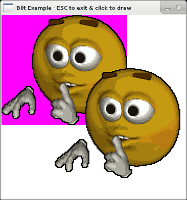

+++
title = "This Month in Rust GameDev #46 - May 2023"
transparent = true
date = 2023-06-11
draft = true
+++

<!-- no toc -->

<!-- Check the post with markdownlint-->

Welcome to the 46th issue of the Rust GameDev Workgroup's
monthly newsletter.
[Rust] is a systems language pursuing the trifecta:
safety, concurrency, and speed.
These goals are well-aligned with game development.
We hope to build an inviting ecosystem for anyone wishing
to use Rust in their development process!
Want to get involved? [Join the Rust GameDev working group!][join]

You can follow the newsletter creation process
by watching [the coordination issues][coordination].
Want something mentioned in the next newsletter?
[Send us a pull request][pr].
Feel free to send PRs about your own projects!

[Rust]: https://rust-lang.org
[join]: https://github.com/rust-gamedev/wg#join-the-fun
[pr]: https://github.com/rust-gamedev/rust-gamedev.github.io
[coordination]: https://github.com/rust-gamedev/rust-gamedev.github.io/issues?q=label%3Acoordination

- [Announcements](#announcements)
- [Game Updates](#game-updates)
- [Engine Updates](#engine-updates)
- [Learning Material Updates](#learning-material-updates)
- [Tooling Updates](#tooling-updates)
- [Library Updates](#library-updates)
- [Other News](#other-news)
- [Popular Workgroup Issues in Github](#popular-workgroup-issues-in-github)
- [Discussions](#discussions)
- [Requests for Contribution](#requests-for-contribution)
- [Jobs](#jobs)

<!--
Ideal section structure is:

```
### [Title]


_image caption_

A paragraph or two with a summary and [useful links].

_Discussions:
[/r/rust](https://reddit.com/r/rust/todo),
[twitter](https://twitter.com/todo/status/123456)_

[Title]: https://first.link
[useful links]: https://other.link
```

If needed, a section can be split into subsections with a "------" delimiter.
-->

## Announcements

## Game Updates

### Digital Extinction


_Building Placement in Digital Extinction_

[Digital Extinction] ([GitHub][de-github], [Discord][de-discord],
[Reddit][de-reddit]) by [@Indy2222] is a 3D real-time strategy game made with
[Bevy].

The most notable updates are:

- poles at unit manufacturing delivery locations for selected factories,
- pausing unit manufacturing when spawn location is occupied,
- [IME][ime] support for text boxes,
- a lot of progress on multiplayer networking,
- [logging][de-logging] to file and other logging improvements.

Support for multiplayer is a technologically complex problem to solve and it is
the last major missing feature before the [proof-of-concept][de-poc] version
can be released. Therefore, a lot of effort currently goes in this direction.

The game is slowly gaining traction in the development community.
Check out our new [contributors here][de-contributors].

See [gameplay][de-video] screen recordings on YouTube.

More detailed monthly updates are available [here (May)][de-update-07] and
[here (June)][de-update-08].

[Digital Extinction]: https://de-game.org
[de-github]: https://github.com/DigitalExtinction/Game
[de-discord]: https://discord.gg/vHMFuCWGSX
[de-reddit]: https://reddit.com/r/DigitalExtinction
[Bevy]: https://bevyengine.org
[ime]: https://en.wikipedia.org/wiki/Input_method
[de-logging]: https://docs.de-game.org/logging/
[de-poc]: https://github.com/DigitalExtinction/Game/milestone/1
[de-video]: https://youtu.be/_ibNMDgIQDE
[de-contributors]: https://github.com/DigitalExtinction/Game/graphs/contributors
[de-update-07]: https://mgn.cz/blog/de07/
[de-update-08]: https://mgn.cz/blog/de08/
[@Indy2222]: https://github.com/Indy2222

## Engine Updates

## Learning Material Updates

## Tooling Updates

## Library Updates

### [blit]



[blit] is a GPL licensed library for quickly blitting 2D images on a pixel buffer.
After a long stale period development has resumed quite a bit
in the last couple of months.

The previous big release, [v0.7.0][blit-0-7], saw a big improvement in performance
and API ergonomics. It also introduced interactive WebAssembly examples
[which can be seen here][blit-web-show].

The latest big release, [v0.8.0][blit-0-8], is a complete rewrite of the quite old
and admittendly outdated API. A focus has been put on both ergonomics and performance.
There's now many ways of drawing a subsection, tiling, masking and creating
repeating slices of an image on a pixel buffer.

[blit]: https://github.com/tversteeg/blit
[blit-0-7]: https://github.com/tversteeg/blit/releases/tag/v0.7.0
[blit-0-8]: https://github.com/tversteeg/blit/releases/tag/v0.8.0
[blit-web-show]: https://tversteeg.nl/blit/showcase

## Popular Workgroup Issues in Github

<!-- Up to 10 links to interesting issues -->

## Other News

<!-- One-liners for plan items that haven't got their own sections. -->

## Discussions

<!-- Links to handpicked reddit/twitter/urlo/etc threads that provide
useful information -->

## Requests for Contribution

<!-- Links to "good first issue"-labels or direct links to specific tasks -->

## Jobs

<!-- An optional section for new jobs related to Rust gamedev -->

------

That's all news for today, thanks for reading!

Want something mentioned in the next newsletter?
[Send us a pull request][pr].

Also, subscribe to [@rust_gamedev on Twitter][@rust_gamedev]
or [/r/rust_gamedev subreddit][/r/rust_gamedev] if you want to receive fresh news!

<!--
TODO: Add real links and un-comment once this post is published
**Discuss this post on**:
[/r/rust_gamedev](TODO),
[Mastodon](TODO),
[Twitter](TODO),
[Discord](https://discord.gg/yNtPTb2).
-->

[/r/rust_gamedev]: https://reddit.com/r/rust_gamedev
[@rust_gamedev]: https://twitter.com/rust_gamedev
