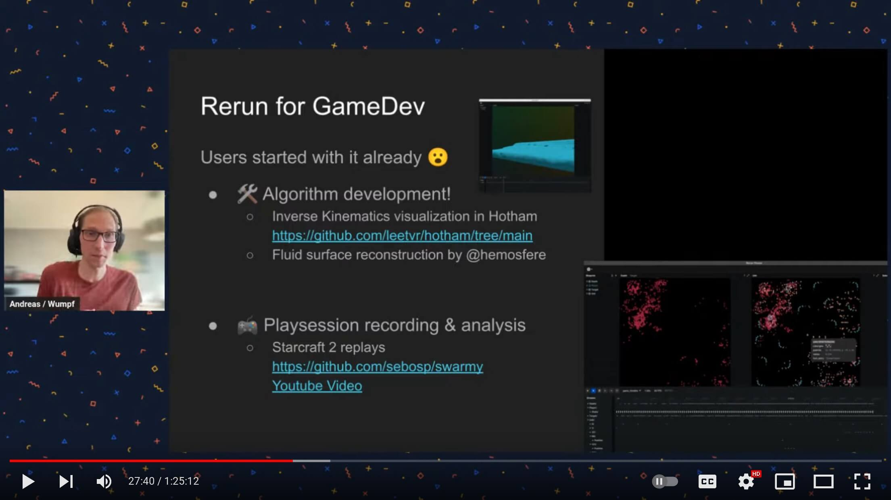
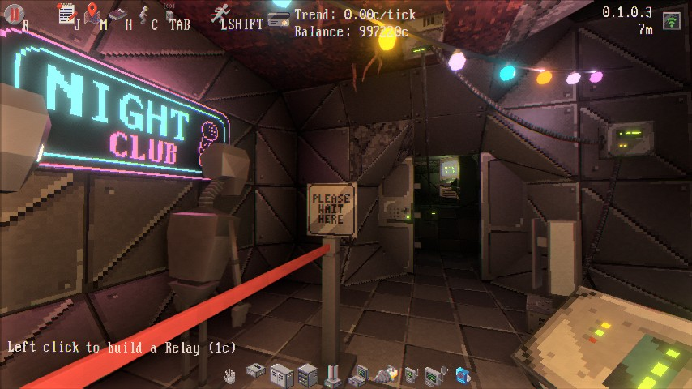

+++
title = "This Month in Rust GameDev #46 - May 2023"
transparent = true
date = 2023-06-11
draft = true
+++

<!-- no toc -->

<!-- Check the post with markdownlint-->

Welcome to the 46th issue of the Rust GameDev Workgroup's
monthly newsletter.
[Rust] is a systems language pursuing the trifecta:
safety, concurrency, and speed.
These goals are well-aligned with game development.
We hope to build an inviting ecosystem for anyone wishing
to use Rust in their development process!
Want to get involved? [Join the Rust GameDev working group!][join]

You can follow the newsletter creation process
by watching [the coordination issues][coordination].
Want something mentioned in the next newsletter?
[Send us a pull request][pr].
Feel free to send PRs about your own projects!

[Rust]: https://rust-lang.org
[join]: https://github.com/rust-gamedev/wg#join-the-fun
[pr]: https://github.com/rust-gamedev/rust-gamedev.github.io
[coordination]: https://github.com/rust-gamedev/rust-gamedev.github.io/issues?q=label%3Acoordination

- [Announcements](#announcements)
- [Game Updates](#game-updates)
- [Engine Updates](#engine-updates)
- [Learning Material Updates](#learning-material-updates)
- [Tooling Updates](#tooling-updates)
- [Library Updates](#library-updates)
- [Other News](#other-news)
- [Popular Workgroup Issues in Github](#popular-workgroup-issues-in-github)
- [Discussions](#discussions)
- [Requests for Contribution](#requests-for-contribution)
- [Jobs](#jobs)

<!--
Ideal section structure is:

```
### [Title]


_image caption_

A paragraph or two with a summary and [useful links].

_Discussions:
[/r/rust](https://reddit.com/r/rust/todo),
[twitter](https://twitter.com/todo/status/123456)_

[Title]: https://first.link
[useful links]: https://other.link
```

If needed, a section can be split into subsections with a "------" delimiter.
-->

## Announcements

### [Rusty Jam \#3][rj3]


_Find Ferris_

[Rusty Jam \#3][rj3] ran from May 21st 2023 to May 29th 2023 and the theme was
"Hidden in plain sight".
The jam had a few but high-quality and awesome games.

Here're the winners:

- 🥇 [Find Ferris](https://kuviman.itch.io/find-ferris) by kuviman.
- 🥈 [Tug of Orb](https://anders429.itch.io/tug-of-orb) by anders429.
- 🥉 [The Veiled Path](https://jebik.itch.io/the-veiled-path) by Jebik.

We wish all the participants good luck in their future endeavors!
The RustyJam will be back, so stay tuned on
[the Rusty Jam Discord][rj-dis] for future updates!

[rj3]: https://itch.io/jam/rusty-jam-3
[rj-dis]: https://discord.gg/jZtz6y9gCJ

### [Rust GameDev Meetup \#27][meetup-video]

[][meetup-video]

The 27th Rust Gamedev Meetup took place in March. You can watch the recording
of the meetup [here on Youtube][meetup-video].

The schedule:

- Rusty Jam 3 by [@ElhamAryanpur]
- Blue Engine by [@ElhamAryanpur]
- Rerun by [@wumpf]
- Graphite by [@Keavon]

The meetups take place on the second Saturday of every month via the [Rust
Gamedev Discord server][rust-gamedev-discord] and are also [streamed on
Twitch][rust-gamedev-twitch].

[meetup-video]: https://youtube.com/watch?v=WQ3ncBe9srM
[rust-gamedev-discord]: https://discord.gg/yNtPTb2
[rust-gamedev-twitch]: https://twitch.tv/rustgamedev
[@ElhamAryanpur]: https://github.com/ElhamAryanpur
[@wumpf]: https://github.com/wumpf
[@Keavon]: https://github.com/Keavon

## Game Updates

### Digital Extinction


_Building Placement in Digital Extinction_

[Digital Extinction] ([GitHub][de-github], [Discord][de-discord],
[Reddit][de-reddit]) by [@Indy2222] is a 3D real-time strategy game made with
[Bevy].

The most notable updates are:

- poles at unit manufacturing delivery locations for selected factories,
- pausing unit manufacturing when spawn location is occupied,
- [IME][ime] support for text boxes,
- a lot of progress on multiplayer networking,
- [logging][de-logging] to file and other logging improvements.

Support for multiplayer is a technologically complex problem to solve and it is
the last major missing feature before the [proof-of-concept][de-poc] version
can be released. Therefore, a lot of effort currently goes in this direction.

The game is slowly gaining traction in the development community.
Check out our new [contributors here][de-contributors].

See [gameplay][de-video] screen recordings on YouTube.

More detailed monthly updates are available [here (May)][de-update-07] and
[here (June)][de-update-08].

[Digital Extinction]: https://de-game.org
[de-github]: https://github.com/DigitalExtinction/Game
[de-discord]: https://discord.gg/vHMFuCWGSX
[de-reddit]: https://reddit.com/r/DigitalExtinction
[Bevy]: https://bevyengine.org
[ime]: https://en.wikipedia.org/wiki/Input_method
[de-logging]: https://docs.de-game.org/logging/
[de-poc]: https://github.com/DigitalExtinction/Game/milestone/1
[de-video]: https://youtu.be/_ibNMDgIQDE
[de-contributors]: https://github.com/DigitalExtinction/Game/graphs/contributors
[de-update-07]: https://mgn.cz/blog/de07/
[de-update-08]: https://mgn.cz/blog/de08/
[@Indy2222]: https://github.com/Indy2222

### [Tunnet][tunnet-itch]


_Connecting the DJ set to the network_

Tunnet ([Steam][tunnet-steam], [Itch.io][tunnet-itch]) is a short
puzzle/exploration game where the player digs tunnels and connects computers
together.

As a network engineer, the player will also have to respond to security
incidents.
In May, this game mechanic has been illustrated in a [devlog][tunnet-post] and
a preview of the new [basic water simulation][tunnet-water] has been posted.

[tunnet-itch]: https://puzzled-squid.itch.io/tunnet
[tunnet-steam]: https://store.steampowered.com/app/2286390/Tunnet
[tunnet-post]: https://puzzled-squid.itch.io/tunnet/devlog/532388/devlog-1-ghost-in-the-tunnels
[tunnet-water]: https://mastodon.gamedev.place/@puzzled_squid/110322440469696044

### [Fish Folk's Kickstarter][fish-ks]


This month [Fish Folk][fish-jumpy] ([itch.io][fish-itch], [Discord][fish-dis])
has launched their [Kickstarter campaign][fish-ks]
that has [already reached its funding goal][fish-15k]!

Even though the basic sum is collected, the campaign continues till June 23
and you may still participate in it because of the stretch goals:

> The plan for how to allocate funds that exceed our €15k goal is very simple:
> For every additional €1,000 pledged to our campaign,
> we will prototype another fishy game archetype for our evergrowing bundle.
> Once our funding run concludes we will poll our backers on which game(s)
> you would like us to prioritize.

_Discussions: [/r/rust](https://reddit.com/r/rust/comments/13qkcv9/fish_ks)_

[fish-ks]: https://kickstarter.com/projects/erlendsh/fish-folk
[fish-15k]: https://kickstarter.com/projects/erlendsh/fish-folk/posts/3821869
[fish-jumpy]: https://github.com/fishfolk/jumpy
[fish-dis]: https://discord.gg/4smxjcheE5
[fish-itch]: https://spicylobster.itch.io

### [Escape Room AI][escape-ai]


_AI trying to escape a room_

[escape-ai] by [@bones-ai] is a Rust-based implementation of a genetic algorithm
and reinforcement learning simulation.
Its purpose is to train an AI named Zoe to escape a room it's enclosed in.
The simulation is built using the Macroquad library.

The [YouTube video][escape-video] demonstrates 1000 AI bots learning
how to escape five rooms of increasing difficulty.

_Discussions: [/r/rust_gamedev](https://reddit.com/r/rust_gamedev/comments/13dstir/ai_escape)_

[escape-ai]: https://github.com/bones-ai/rust-escape-ai
[@bones-ai]: https://twitter.com/BonesaiDev
[escape-video]: https://youtube.com/watch?v=OeojCLDKaJU

### [MEANWHILE IN SECTOR 80][ms80]

[][ms80-vlog]

[MEANWHILE IN SECTOR 80][ms80] ([Discord][shg-dis], [mailing list][shg-news])
by [Second Half Games][shg-site] is an upcoming third person
action-engineering space game.

Second Half Games released the [first update video][ms80-vlog] for the game.
It includes an introduction to the studio, an overview of the game, and some of
the recent progress towards the first public demo.

[shg-site]: https://secondhalf.games
[shg-news]: https://dashboard.mailerlite.com/forms/402073/85466601232532545/share
[shg-dis]: https://discord.gg/A9GHQGNhJX
[ms80]: https://ms80.space
[ms80-vlog]: https://youtube.com/watch?v=bgmySx_tv1s

## Engine Updates

## Learning Material Updates

### [Building a platformer with Bevy \#1][bevy-platformer-tut]


[@affanshahid] published [the first part of a new tutorial series][bevy-platformer-tut]
on building a simple 2D platfromer using Bevy.
The series is aimed at newcomers to the world of
game development and explores common game development concepts.

_Discussions: [/r/rust](https://reddit.com/r/rust/comments/134d2i0/learning_gamedev_w_rust)_

[bevy-platformer-tut]: https://affanshahid.dev/posts/learning-game-dev-bevy-1
[@affanshahid]: https://github.com/affanshahid

### [Game Development In Rust: Making A Strategy Game][rust-strategy-game-tut-1]


_Game Development In Rust: Making A Strategy Game_

[@srodrigo] published the first three parts of a
[strategy game in Bevy series][rust-strategy-game-tut-1]. The series is aimed at
developers with some experience in Rust who want to dive into game development.

- [The first part][rust-strategy-game-tut-1] focuses on the basic concepts to
  create a battlefield for the battles to come.
- [The second part][rust-strategy-game-tut-2] adds the first unit type.
- [The third part][rust-strategy-game-tut-3] adds more unit types to create more
  compelling teams.

[rust-strategy-game-tut-1]: https://srodrigoroyo.com/game-development-in-rust-strategy-game-1/
[rust-strategy-game-tut-2]: https://srodrigoroyo.com/game-development-in-rust-strategy-game-2/
[rust-strategy-game-tut-3]: https://srodrigoroyo.com/game-development-in-rust-strategy-game-3/
[@srodrigo]: https://github.com/srodrigo

### [How to Migrate Your Bevy Projects with (Semi-)Automation][bevy-migrate]


[@HerringtonDarkholme] published an [article][bevy-migrate]
about how to make Bevy migration easier by using git, cargo and [ast-grep].
The article uses the utility AI library [big-brain] as an example
to illustrate bumping the Bevy version from 0.9 to 0.10
and covers four big steps: making a clean git branch,
updating the dependencies, running fix commands, and fixing failing tests.
By using semi-automation tools, you can migrate your Bevy projects
with less hassle and more confidence.

_Discussions:
[/r/rust](https://www.reddit.com/r/rust/comments/13m4crf/semi_automated_migration_bevy)_

[bevy-migrate]: https://betterprogramming.pub/migrating-bevy-can-be-easier-with-semi-automation-here-is-how-1f6e21858e79
[@HerringtonDarkholme]: https://github.com/HerringtonDarkholme
[ast-grep]: https://github.com/ast-grep/ast-grep
[big-brain]: https://github.com/zkat/big-brain

## Tooling Updates

### [Spicy Launcher]


[Spicy Launcher] by [@orhun] is a cross-platform launcher
for playing [Spicy Lobster] games.
Supports both command-line and [Tauri]-based graphical interface.

Currently supported games: [Fish Folk: Jumpy], [Fish Folk: Punchy],
and recently added [Thetawave].

Planned features include auto updating games and mods management.

[Spicy Launcher]: https://github.com/spicylobstergames/SpicyLauncher
[Spicy Lobster]: https://github.com/spicylobstergames
[Fish Folk: Jumpy]: https://github.com/fishfolks/jumpy
[Fish Folk: Punchy]: https://github.com/fishfolks/punchy
[Thetawave]: https://github.com/thetawavegame/thetawave
[@orhun]: https://github.com/orhun
[Tauri]: https://tauri.app

### [Rerun][rerun]


[Rerun][rerun] ([Discord][rerun-dis], [Github][rerun-gh])
is an open-source SDK for logging complex visual data paired with a visualizer
for exploring that data over time. While its primary focus is on robotics and
computer vision, it can be useful for all kinds of
rapid prototyping & algorithm development.

Rerun was shown at the Rust GameDev meetup,
watch the recording [here][rerun-meetup-vid].

[v0.6.0][rerun-v0-6-0] is out now! A few of the biggest highlights:

- You can now show 3D objects in 2D views connected by Pinhole transforms.
- You can quickly view images and meshes with `rerun mesh.obj image.png`.
- The correct to install the rerun binary is now `cargo install rerun-cli`.
- native_viewer is now an opt-in feature of the rerun library,
  leading to faster compilation times.
- SDK log calls are now batched on the wire, saving CPU time and bandwidth.
- [Experimental WebGPU support][rerun-wgpu].

There's a growing community on [Discord][rerun-dis]
waiting for you to join in case you have any questions,
comments or just want to follow the latest development.
The [Github project][rerun-gh] is MIT/Apache
licensed and open to contribute for everyone,
be it with suggestions, bugs or PRs.

[rerun]: https://rerun.io
[rerun-dis]: https://discord.gg/npTFxYR9
[rerun-gh]: https://github.com/rerun-io/rerun
[rerun-meetup-vid]: https://youtube.com/watch?v=dVk_kZ9VSDA
[rerun-v0-6-0]: https://github.com/rerun-io/rerun/releases/tag/v0.6.0
[rerun-wgpu]: https://app.rerun.io/webgpu/index.html

## Library Updates

### [blit]


[blit] is a GPL licensed library for quickly blitting 2D images on a pixel buffer.
After a long stale period development has resumed quite a bit
in the last couple of months.

The previous big release, [v0.7.0][blit-0-7], saw a big improvement in performance
and API ergonomics. It also introduced interactive WebAssembly examples
[which can be seen here][blit-web-show].

The latest big release, [v0.8.0][blit-0-8], is a complete rewrite of the quite old
and admittendly outdated API. A focus has been put on both ergonomics and performance.
There's now many ways of drawing a subsection, tiling, masking and creating
repeating slices of an image on a pixel buffer.

[blit]: https://github.com/tversteeg/blit
[blit-0-7]: https://github.com/tversteeg/blit/releases/tag/v0.7.0
[blit-0-8]: https://github.com/tversteeg/blit/releases/tag/v0.8.0
[blit-web-show]: https://tversteeg.nl/blit/showcase

### [seldom_state]

[seldom_state] is a Bevy plugin that adds a `StateMachine` component that you
can add to your entities. The state machine will change the entity's components
based on states, triggers, and transitions that you define. It's useful
for player controllers, animations, simple AI, etc.

This month, [seldom_state] 0.6 was released:

- Triggers don't need to be registered!
- `MachineState` and `Trigger` no longer require `Reflect`
- `StateMachine`'s `trans_builder` accepts the current state in the closure, so
  you have dataflow between states!
- You may add and remove state components manually
- More versatile `on_enter` and `on_exit` events
- `Trigger` combinators `not`, `and`, and `or`
- Transitions have priority in the order they are added
- You can use `EventReader`, `Local`, etc in your triggers!
- Added an `EventTrigger<E>` that triggers on an event
- `StateMachine`'s `set_trans_logging` sets whether to log state transitions
- [And more][changelog]!

Thanks to [Sera] for coauthoring this update!

[seldom_state]: https://github.com/Seldom-SE/seldom_state
[Sera]: https://github.com/deifactor
[changelog]: https://github.com/Seldom-SE/seldom_state/blob/main/CHANGELOG.md#06-2023-05-07

### [Kira]

[Kira] ([GitHub]) by [@tesselode] is a backend-agnostic library to create
expressive audio for games.

Kira v0.8 adds support for spatial audio, global modulation sources for
easier and more powerful parameter tweening, compressor and EQ effects,
and more powerful playback and loop region settings.

_Discussions:
[/r/rust](https://reddit.com/r/rust/comments/13p7x9o/kira_v08),
[Twitter](https://twitter.com/tesselode/status/1660799031314874370)_

[Kira]: https://crates.io/crates/kira
[@tesselode]: https://twitter.com/tesselode
[GitHub]: https://github.com/tesselode/kira

## Popular Workgroup Issues in Github

<!-- Up to 10 links to interesting issues -->

## Other News

<!-- One-liners for plan items that haven't got their own sections. -->

## Discussions

<!-- Links to handpicked reddit/twitter/urlo/etc threads that provide
useful information -->

## Requests for Contribution

<!-- Links to "good first issue"-labels or direct links to specific tasks -->

## Jobs

<!-- An optional section for new jobs related to Rust gamedev -->

------

That's all news for today, thanks for reading!

Want something mentioned in the next newsletter?
[Send us a pull request][pr].

Also, subscribe to [@rust_gamedev on Twitter][@rust_gamedev]
or [/r/rust_gamedev subreddit][/r/rust_gamedev] if you want to receive fresh news!

<!--
TODO: Add real links and un-comment once this post is published
**Discuss this post on**:
[/r/rust_gamedev](TODO),
[Mastodon](TODO),
[Twitter](TODO),
[Discord](https://discord.gg/yNtPTb2).
-->

[/r/rust_gamedev]: https://reddit.com/r/rust_gamedev
[@rust_gamedev]: https://twitter.com/rust_gamedev
