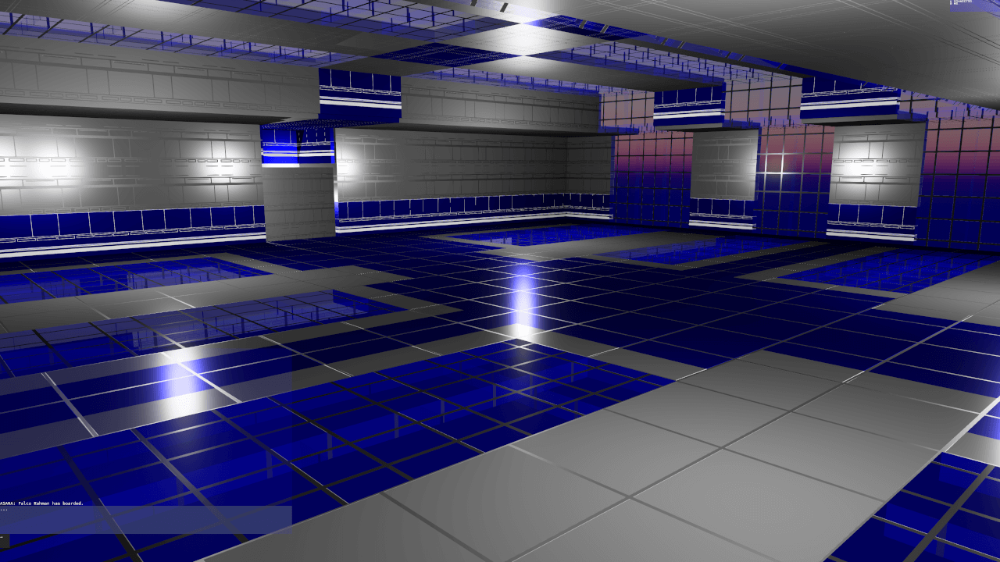
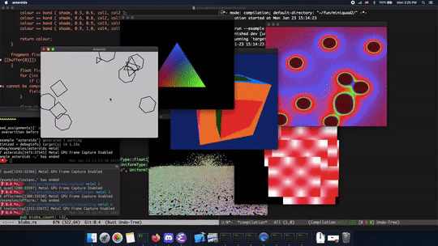
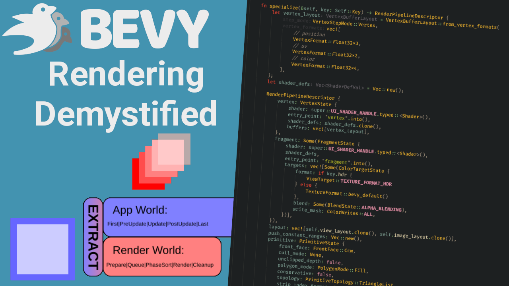

+++
title = "This Month in Rust GameDev #47 - June 2023"
transparent = true
date = 2023-07-07
draft = true
+++

<!-- no toc -->

<!-- Check the post with markdownlint-->

Welcome to the 47th issue of the Rust GameDev Workgroup's
monthly newsletter.
[Rust] is a systems language pursuing the trifecta:
safety, concurrency, and speed.
These goals are well-aligned with game development.
We hope to build an inviting ecosystem for anyone wishing
to use Rust in their development process!
Want to get involved? [Join the Rust GameDev working group!][join]

You can follow the newsletter creation process
by watching [the coordination issues][coordination].
Want something mentioned in the next newsletter?
[Send us a pull request][pr].
Feel free to send PRs about your own projects!

[Rust]: https://rust-lang.org
[join]: https://github.com/rust-gamedev/wg#join-the-fun
[pr]: https://github.com/rust-gamedev/rust-gamedev.github.io
[coordination]: https://github.com/rust-gamedev/rust-gamedev.github.io/issues?q=label%3Acoordination

- [Announcements](#announcements)
- [Game Updates](#game-updates)
- [Engine Updates](#engine-updates)
- [Learning Material Updates](#learning-material-updates)
- [Tooling Updates](#tooling-updates)
- [Library Updates](#library-updates)
- [Popular Workgroup Issues in Github](#popular-workgroup-issues-in-github)
- [Other News](#other-news)
- [Discussions](#discussions)
- [Requests for Contribution](#requests-for-contribution)
- [Jobs](#jobs)

<!--
Ideal section structure is:

```
### [Title]


_image caption_

A paragraph or two with a summary and [useful links].

_Discussions:
[/r/rust](https://reddit.com/r/rust/todo),
[twitter](https://twitter.com/todo/status/123456)_

[Title]: https://first.link
[useful links]: https://other.link
```

If needed, a section can be split into subsections with a "------" delimiter.
-->

## Announcements

## Game Updates

### [Flesh]


_Intro_

[Flesh] by [@im_oab] is a 2D-horizontal shmup game with hand-drawn animation,
an organic/fleshy theme and a unique story. It is implemented using [Tetra].
The game's development has finished and will be released soon. The last update
before release includes:

- Intro/Ending/End credits animation.
- Add a variant version of Conway's Game of Life as background.
- Improve effect in the gameplay with distortion shaders.
- Update the demo build with improved graphics and performance.

[Flesh]: https://store.steampowered.com/app/1660850/Flesh/
[@im_oab]: https://twitter.com/im_oab
[Tetra]: https://github.com/17cupsofcoffee/tetra

### [Space Frontiers]


_Render achieved with dynamic point lights._

[Space Frontiers] ([GitHub], [Discord], [Twitter], [Reddit], [Steam Group])
by [Starwolves] is an online moddable sci-fi action RPG community game
simulating space (and spaceships) in 3D.

By the end of last year the client was made with Godot. Shortly after that the
decision was made to replace the Godot project with a [Bevy Engine] client.

Rust and Bevy are now used for both server and client.
There are a lot of advantages such as sharing libraries and neat code replication,
reducing code overhead.
In-fact both the server and client are now developed in [the same virtual workspace].

The client includes a new camera perspective from top-down isometric to 1st person.
A new 3D dynamic gridmap framework has been successfully implemented in ECS.
The prototype includes an in-game map editing tool with the ability to export to
file.
Inspired by the videogame "System Shock".
There is a recently uploaded [showcase video].

The project is commercial, [open-source] and has a proprietary license.
There is a milestone for a license change to free open-source.

[Starwolves.io Bulletin Board] was launched half a year ago.
There are 25~ registrants left that can receive a permanent unique forum group/title.

_Discussions: [StarWolves.io Bulletin Board]_

[Starwolves.io Bulletin Board]: https://starwolves.io
[Starwolves]: https://starwolves.io
[Bevy Engine]: https://bevyengine.org/
[Space Frontiers]: https://github.com/starwolves/space
[GitHub]: https://github.com/starwolves/space
[open-source]: https://github.com/starwolves/space
[the same virtual workspace]: https://github.com/starwolves/space
[Steam Group]: https://steamcommunity.com/groups/starwolvescommunity
[Discord]: https://discord.gg/yYpMun9CTT
[Twitter]: https://twitter.com/starwolvesstar
[Reddit]: https://reddit.com/u/StarwolvesStar
[showcase video]: https://youtu.be/Qr_in7tUxAM

### Digital Extinction


_Building Placement in Digital Extinction_

[Digital Extinction] ([GitHub][de-github], [Discord][de-discord],
[Reddit][de-reddit]) by [@Indy2222] is a 3D real-time strategy game made with
[Bevy].

The most notable updates are:

- nightly versions are automatically built and published on
  [de-game.org][de-web] and elsewhere,
- significant progress has been made on multiplayer and networking,
- animated arrows on terrain are displayed for selected factories, indicating
  the path from the units' spawn points to their delivery locations,
- semi-transparent square markers are drawn on the terrain around selected
  buildings,
- health bars are briefly displayed above units and buildings when they take
  damage or their health changes,
- the implementation and design of the “Energy” have started to take shape,
- the head-up display (HUD) shows the total battery charge and the number of
  selected units and buildings,
- the main theme song plays in a loop, volume of the music can be configured,
- the aspect ratio of the minimap matches that of the game map,
- the option to invert camera zooming has been added to the configuration,
- the [documentation][de-docs] has been converted to mdBook.

See [gameplay][de-video] screen recordings on YouTube.

More detailed July update is available [here][de-update-09].

[Digital Extinction]: https://de-game.org
[de-github]: https://github.com/DigitalExtinction/Game
[de-discord]: https://discord.gg/vHMFuCWGSX
[de-reddit]: https://reddit.com/r/DigitalExtinction
[@Indy2222]: https://github.com/Indy2222
[Bevy]: https://bevyengine.org
[de-web]: https://de-game.org/
[de-docs]: https://docs.de-game.org/
[de-video]: https://youtu.be/aRk65kyIEes
[de-update-09]: https://mgn.cz/blog/de09/

## Engine Updates

### [macroquad]


_Macroquad examples rendered by Metal API_

Macroquad got ported to miniquad-0.4, supporting Metal on Mac and IOS.

On the surface all the macroquad API stayed exactly the same, but with
`use macroquad::miniquad::*` being such a breaking change - major version
number was bumped. Major version bump made possible to fix a few
long-lasting issues, check the [full changelog][macroquad_changelog]
for all the changes.

[macroquad_changelog]: https://macroquad.rs/articles/macroquad-0-4/

## Learning Material Updates

### Bevy Rendering Demystified



[@logicprojects] published a [video][Bevy Rendering Demystified] covering the
details of Bevy's rendering systems.  Specifically, he covered the engine's
internal implementation of UI Rendering to show how data flows from the ECS
world down to the final wgpu draw calls.

[@logicprojects]: https://www.youtube.com/@logicprojects

[Bevy Rendering Demystified]: https://youtu.be/5oKEPZ6LbNE

## Tooling Updates

### [Rerun][rerun]

[Rerun][rerun] ([Discord][rerun-dis], [Github][rerun-gh]) is an open-source SDK
for logging complex visual data paired with a visualizer for exploring that data
over time. While its primary focus is on robotics and computer vision, it can be
useful for all kinds of rapid prototyping & algorithm development.

[v0.7.0][rerun-v0-7-0] is out now, but it turned out a little bit smaller:

A few of the biggest highlights:

- Much more powerful transformation logging
  - any affine transforms works now!
  - supports many more formats and shows them in the viewer as-is
- Better color mapping range detection for images and tensors
- Add support for motion JPEG via the new jpeg_quality parameter to log_image
- Many small improvements to samples & documentation

There's a growing community on [Discord][rerun-dis] waiting for you to join in
case you have any questions, comments or just want to follow the latest
development. The [Github project][rerun-gh] is MIT/Apache licensed and open to
contribute for everyone, be it with suggestions, bugs or PRs.

[rerun]: https://rerun.io
[rerun-dis]: https://discord.gg/npTFxYR9
[rerun-gh]: https://github.com/rerun-io/rerun
[rerun-v0-7-0]: https://github.com/rerun-io/rerun/releases/tag/v0.7.0

## Library Updates

### [Boytacean](https://github.com/joamag/boytacean/)


Boytacean by @joamag is a Web-based Game Boy Color emulator (and library) that is written in Rust.

Major features include:

- Full Game Boy and Game Boy Color emulation.
- Web (using WebAssembly) and SDL frontends.
- Ultra-fast performance.
- Accurate PPU emulation.
- Game Boy Printer emulation.
- and many others...

[Website]: https://github.com/leod/posh
[joamag/boytacean]: https://github.com/joamag/boytacean/
[@joamag]: https://github.com/joamag

### [posh]


[`posh`][posh] is a crate that seamlessly integrates a graphics library with an
embedded functional shading language. It is a proof of concept that aims to
demonstrate that graphics programming can be both type-safe and ergonomic.

With `posh`, shaders are written in plain Rust (with some caveats). Procedural
macros are only required for defining custom vertex and uniform types.

The core component of `posh` is the `Program<U, V, F>` type, which acts as a
bridge between the shading language and the graphics library. This type
represents a compiled shader and serves as the entry point for draw calls. By
explicitly carrying the types `U` (uniform interface), `V` (vertex shader
interface), and `F` (fragment shader interface), `posh` enables static
verification, ensuring that the data provided in draw calls matches the shader's
signature.

For simplicity, `posh` currently targets OpenGL ES 3.0. Although it is an
experimental project, its authors hope to inspire the community to further
explore how static typing can elegantly bridge the gap between host code and
shader code.

For more details, check out the [examples][posh-examples] or the authors' [blog
post][posh-blog].

[posh]: https://github.com/leod/posh
[posh-examples]: https://github.com/leod/posh/tree/main/examples
[posh-blog]: https://leod.github.io/rust/gamedev/posh/2023/06/04/posh.html

## Popular Workgroup Issues in Github

<!-- Up to 10 links to interesting issues -->

## Other News

<!-- One-liners for plan items that haven't got their own sections. -->

## Discussions

<!-- Links to handpicked reddit/twitter/urlo/etc threads that provide
useful information -->

## Requests for Contribution

<!-- Links to "good first issue"-labels or direct links to specific tasks -->

## Jobs

<!-- An optional section for new jobs related to Rust gamedev -->

------

That's all news for today, thanks for reading!

Want something mentioned in the next newsletter?
[Send us a pull request][pr].

Also, subscribe to [@rust_gamedev on Twitter][@rust_gamedev]
or [/r/rust_gamedev subreddit][/r/rust_gamedev] if you want to receive fresh news!

<!--
TODO: Add real links and un-comment once this post is published
**Discuss this post on**:
[/r/rust_gamedev](TODO),
[Mastodon](TODO),
[Twitter](TODO),
[Discord](https://discord.gg/yNtPTb2).
-->

[/r/rust_gamedev]: https://reddit.com/r/rust_gamedev
[@rust_gamedev]: https://twitter.com/rust_gamedev
