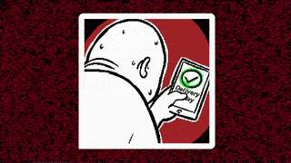

+++
title = "This Month in Rust GameDev #47 - June 2023"
transparent = true
date = 2023-07-07
draft = true
+++

<!-- no toc -->

<!-- Check the post with markdownlint-->

Welcome to the 47th issue of the Rust GameDev Workgroup's
monthly newsletter.
[Rust] is a systems language pursuing the trifecta:
safety, concurrency, and speed.
These goals are well-aligned with game development.
We hope to build an inviting ecosystem for anyone wishing
to use Rust in their development process!
Want to get involved? [Join the Rust GameDev working group!][join]

You can follow the newsletter creation process
by watching [the coordination issues][coordination].
Want something mentioned in the next newsletter?
[Send us a pull request][pr].
Feel free to send PRs about your own projects!

[Rust]: https://rust-lang.org
[join]: https://github.com/rust-gamedev/wg#join-the-fun
[pr]: https://github.com/rust-gamedev/rust-gamedev.github.io
[coordination]: https://github.com/rust-gamedev/rust-gamedev.github.io/issues?q=label%3Acoordination

- [Announcements](#announcements)
- [Game Updates](#game-updates)
- [Engine Updates](#engine-updates)
- [Learning Material Updates](#learning-material-updates)
- [Tooling Updates](#tooling-updates)
- [Library Updates](#library-updates)
- [Popular Workgroup Issues in Github](#popular-workgroup-issues-in-github)
- [Other News](#other-news)
- [Discussions](#discussions)
- [Requests for Contribution](#requests-for-contribution)
- [Jobs](#jobs)

<!--
Ideal section structure is:

```
### [Title]


_image caption_

A paragraph or two with a summary and [useful links].

_Discussions:
[/r/rust](https://reddit.com/r/rust/todo),
[twitter](https://twitter.com/todo/status/123456)_

[Title]: https://first.link
[useful links]: https://other.link
```

If needed, a section can be split into subsections with a "------" delimiter.
-->

## Announcements

## Game Updates

### [Flesh]


_Intro_

[Flesh] by [@im_oab] is a 2D-horizontal shmup game with hand-drawn animation,
an organic/fleshy theme and a unique story. It is implemented using [Tetra].
The game's development has finished and will be released soon. The last update
before release includes:

- Intro/Ending/End credits animation.
- Add a variant version of Conway's Game of Life as background.
- Improve effect in the gameplay with distortion shaders.
- Update the demo build with improved graphics and performance.

[Flesh]: https://store.steampowered.com/app/1660850/Flesh/
[@im_oab]: https://twitter.com/im_oab
[Tetra]: https://github.com/17cupsofcoffee/tetra

## Engine Updates

### [macroquad]


_Macroquad examples rendered by Metal API_

Macroquad got ported to miniquad-0.4, supporting Metal on Mac and IOS.

On the surface all the macroquad API stayed exactly the same, but with
`use macroquad::miniquad::*` being such a breaking change - major version
number was bumped. Major version bump made possible to fix a few
long-lasting issues, check the [full changelog][macroquad_changelog]
for all the changes.

[macroquad_changelog]: https://macroquad.rs/articles/macroquad-0-4/

## Learning Material Updates

### Bevy Rendering Demystified


[@logicprojects] published a [video][Bevy Rendering Demystified] covering the
details of Bevy's rendering systems.  Specifically, he covered the engine's
internal implementation of UI Rendering to show how data flows from the ECS
world down to the final wgpu draw calls.

[@logicprojects]: https://www.youtube.com/@logicprojects

[Bevy Rendering Demystified]: https://youtu.be/5oKEPZ6LbNE

## Tooling Updates

### [Rerun][rerun]

[Rerun][rerun] ([Discord][rerun-dis], [Github][rerun-gh]) is an open-source SDK
for logging complex visual data paired with a visualizer for exploring that data
over time. While its primary focus is on robotics and computer vision, it can be
useful for all kinds of rapid prototyping & algorithm development.

[v0.7.0][rerun-v0-7-0] is out now, but it turned out a little bit smaller:

A few of the biggest highlights:

- Much more powerful transformation logging
  - any affine transforms works now!
  - supports many more formats and shows them in the viewer as-is
- Better color mapping range detection for images and tensors
- Add support for motion JPEG via the new jpeg_quality parameter to log_image
- Many small improvements to samples & documentation

There's a growing community on [Discord][rerun-dis] waiting for you to join in
case you have any questions, comments or just want to follow the latest
development. The [Github project][rerun-gh] is MIT/Apache licensed and open to
contribute for everyone, be it with suggestions, bugs or PRs.

[rerun]: https://rerun.io
[rerun-dis]: https://discord.gg/npTFxYR9
[rerun-gh]: https://github.com/rerun-io/rerun
[rerun-v0-7-0]: https://github.com/rerun-io/rerun/releases/tag/v0.7.0

## Library Updates

## Popular Workgroup Issues in Github

<!-- Up to 10 links to interesting issues -->

## Other News

<!-- One-liners for plan items that haven't got their own sections. -->

## Discussions

<!-- Links to handpicked reddit/twitter/urlo/etc threads that provide
useful information -->

## Requests for Contribution

<!-- Links to "good first issue"-labels or direct links to specific tasks -->

## Jobs

<!-- An optional section for new jobs related to Rust gamedev -->

------

That's all news for today, thanks for reading!

Want something mentioned in the next newsletter?
[Send us a pull request][pr].

Also, subscribe to [@rust_gamedev on Twitter][@rust_gamedev]
or [/r/rust_gamedev subreddit][/r/rust_gamedev] if you want to receive fresh news!

<!--
TODO: Add real links and un-comment once this post is published
**Discuss this post on**:
[/r/rust_gamedev](TODO),
[Mastodon](TODO),
[Twitter](TODO),
[Discord](https://discord.gg/yNtPTb2).
-->

[/r/rust_gamedev]: https://reddit.com/r/rust_gamedev
[@rust_gamedev]: https://twitter.com/rust_gamedev
