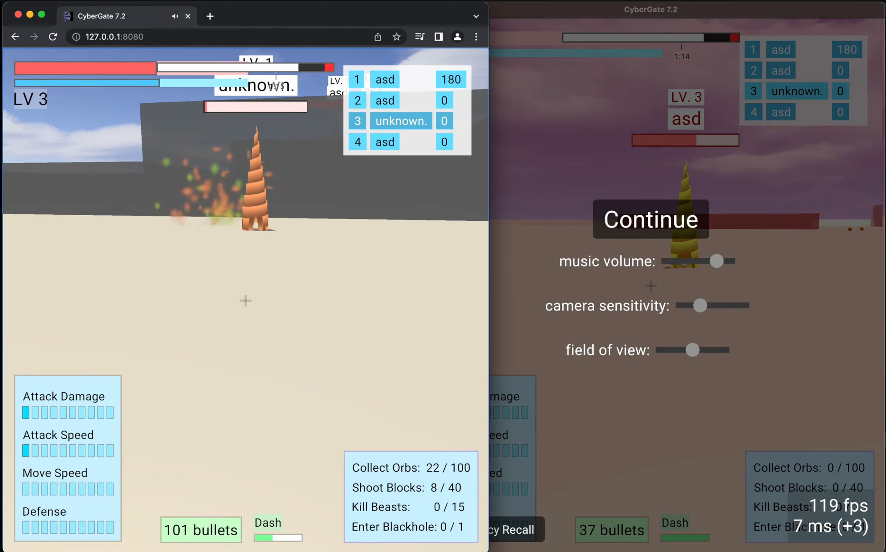
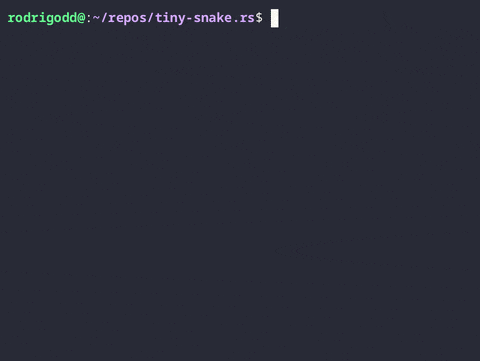
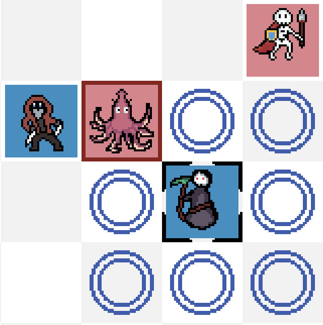
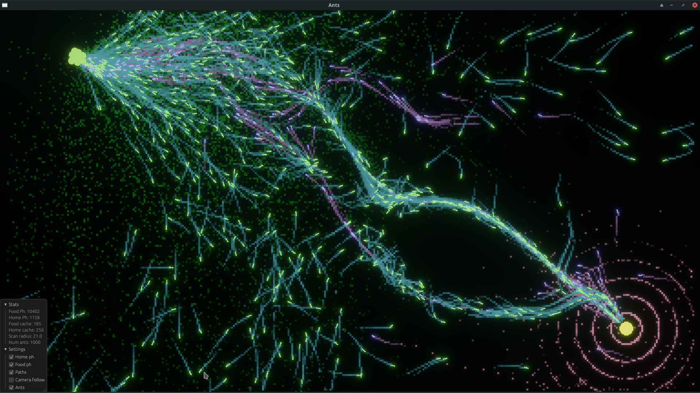
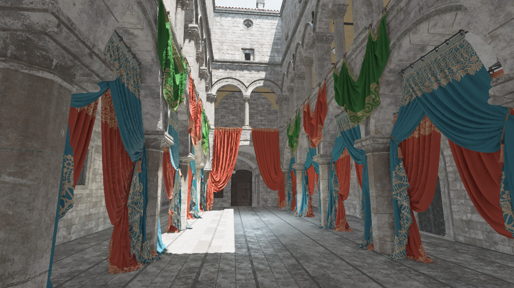
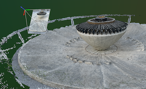
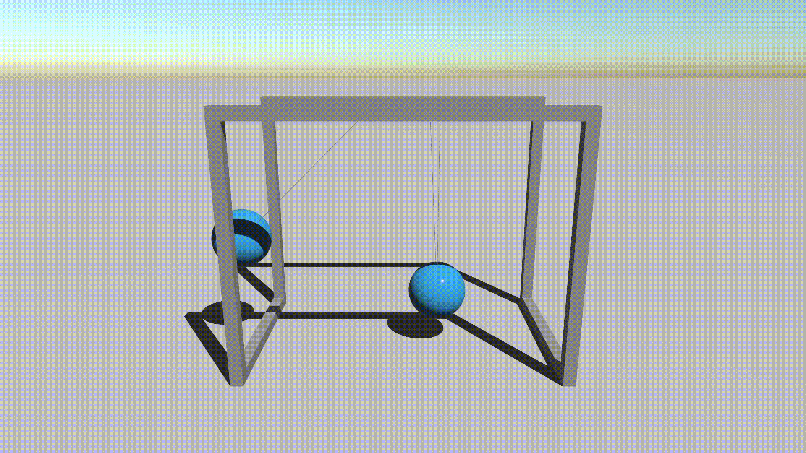

+++
title = "This Month in Rust GameDev #48 - July 2023"
transparent = true
date = 2023-08-25
draft = true
+++

<!-- no toc -->

<!-- Check the post with markdownlint-->

Welcome to the 48th issue of the Rust GameDev Workgroup's
monthly newsletter.
[Rust] is a systems language pursuing the trifecta:
safety, concurrency, and speed.
These goals are well-aligned with game development.
We hope to build an inviting ecosystem for anyone wishing
to use Rust in their development process!
Want to get involved? [Join the Rust GameDev working group!][join]

You can follow the newsletter creation process
by watching [the coordination issues][coordination].
Want something mentioned in the next newsletter?
[Send us a pull request][pr].
Feel free to send PRs about your own projects!

[Rust]: https://rust-lang.org
[join]: https://github.com/rust-gamedev/wg#join-the-fun
[pr]: https://github.com/rust-gamedev/rust-gamedev.github.io
[coordination]: https://github.com/rust-gamedev/rust-gamedev.github.io/issues?q=label%3Acoordination

- [Announcements](#announcements)
- [Game Updates](#game-updates)
- [Engine Updates](#engine-updates)
- [Learning Material Updates](#learning-material-updates)
- [Tooling Updates](#tooling-updates)
- [Library Updates](#library-updates)
- [Other News](#other-news)
- [Popular Workgroup Issues in Github](#popular-workgroup-issues-in-github)
- [Discussions](#discussions)
- [Requests for Contribution](#requests-for-contribution)
- [Jobs](#jobs)

<!--
Ideal section structure is:

```
### [Title]


_image caption_

A paragraph or two with a summary and [useful links].

_Discussions:
[/r/rust](https://reddit.com/r/rust/todo),
[twitter](https://twitter.com/todo/status/123456)_

[Title]: https://first.link
[useful links]: https://other.link
```

If needed, a section can be split into subsections with a "------" delimiter.
-->

## Announcements

## Game Updates

### [Colony]


[Colony] by [@ryankopf] is a colony simulator game built with Bevy that
is open source and is in a pre-alpha stage. Similar to other colony simulator games
like Dwarf Fortress or Rimworld, there are units that have their own traits and
can be instructed to perform tasks like farming and chopping trees.

You can have your units build things, farm stuff, and explore, and the game is soon
to be moving onto adding more content and UI, as core features are being completed.

_Discussions: [/r/rust](https://reddit.com/r/rust/comments/14p1fiw/colony_sim)_

[Colony]: https://github.com/ryankopf/colony
[@ryankopf]: https://github.com/ryankopf

### [Open Combat][OpenCombat_website]


_Game HUD is now more complete_

Open Combat ([Website][OpenCombat_website], [GitHub][OpenCombat_github],
[Discord][OpenCombat_discord]) is a real-time tactical game
which takes place during the 2nd World War.

Some major changes this month:

- HUD has been filled with a minimap and squad informations.
- Multiple issues about zoom and move on map has been fixed.
- A high definition map has been created.

Some fixes and improvements have to be done, but the devs are near
to publishing the official demo of the game!

[OpenCombat_website]: https://opencombat.bux.fr
[OpenCombat_github]: https://github.com/buxx/OpenCombat
[OpenCombat_discord]: https://discord.gg/6P2vtFh2Px

### [CyberGate][cybergate-yt]


_The browser uses webtransport (Left), the native uses quinn (Right)_

CyberGate ([YouTube][cybergate-yt], [Discord][cybergate-dis]),
CyberSoul is developing an ambitious multiplayer project,
utilizing procedural generation and AI to offer a dynamic universe.

The latest updates to CyberGate include:

- Implemented a Webtransport Client and an universal quic server.
- Custom game launcher that is reliable and efficient.
- Universal mechanism to save, load and upgrade the game world from disk.
- Optimized multithreaded evolution algorithms for generating universes.
- Created an accessible editor for fine-tuning component values.

Participate in Testing and Engage with CyberSoul: [on Discord][cybergate-dis].

[cybergate-yt]: https://youtube.com/channel/UClrsOso3Xk2vBWqcsHC3Z4Q
[cybergate-dis]: https://discord.gg/R7DkHqw7zJ

### [Way of Rhea][wor]

[][wor]

[Way of Rhea][wor] is a puzzle game with hard puzzles but forgiving
mechanics being produced by [@masonremaley] in a custom Rust engine.
You can support development by [checking out the free demo and wishlisting on Steam][wor]
or [signing up for the mailing list][wor-mail]!

Recent updates:

- Way of Rhea now natively supports Linux, and Steam Deck! Mason released a
  [writeup on the port here][wor-linux].
- Way of Rhea was part of the [Cerebral Puzzle Showcase][wor-showcase].
- Crash handling was improved, and the build process was simplified (necessary
  for post-release support).
  A fix was landed to [backtrace-rs][wor-backtrace-rs] as part of the
  improved crash handling
- Time controls were released as part of the updated demo.

[@masonremaley]: https://twitter.com/masonremaley
[wor]: https://store.steampowered.com/app/1110620/Way_of_Rhea/?utm_campaign=tmirgd&utm_source=n48
[wor-mail]: https://anthropicstudios.com/newsletter/signup/tech
[wor-showcase]: https://www.cerebralpuzzleshowcase.com
[wor-linux]: https://www.anthropicstudios.com/2023/08/21/way-of-rhea-linux
[wor-backtrace-rs]: https://github.com/rust-lang/backtrace-rs/pull/553

### [tiny-snake.rs]



[tiny-snake.rs] by [@Rodrigodd] is a terminal snake game, with a minimal binary
size.

The entire game is implemented in a single file of pure Rust code, with zero
dependencies. All interactions with the system are done through raw syscalls
(so it only runs on Linux, sorry) and the program is completely panic-free
(panic handling increases the binary size by almost 4KiB).

The game can be compiled using a single `rustc` command, and the resulting
binary is only 2760 bytes.

_Discussions: [/r/rust](https://reddit.com/r/rust/comments/15d89s5/tinysnakers)_

[tiny-snake.rs]: https://github.com/Rodrigodd/tiny-snake.rs
[@Rodrigodd]: https://github.com/Rodrigodd

### [8bit Duels][8bit-gh]



[8bit Duels][8bit-gh] ([Discord][8bit-dis]) is a turn-based strategy game made
by [@ThousandthStar]. It has been in development for the past year,
and the release is right around the corner!
A new blog post along with a release Youtube video is coming soon
on [this channel][8bit-yt].

This month's update includes a completely remade user interface.
The [devlog][8bit-devlog] covers the change from the [bevy_ui] crate
to [belly], which provides a nice HTML-like syntax for building the UI.
The last devlog post will address the re-implemented UI and the new troop: the Crow!

The Crow, as seen in the screenshot above, is a hooded bird assassin with two daggers.
It can attack twice per turn, dealing 2 damage each time. The Crow is the last of
the five 8bit Duels characters.

[@ThousandthStar]: https://github.com/ThousandthStar
[8bit-gh]: https://github.com/ThousandthStar/8bit-duels
[8bit-dis]: https://discord.com/invite/NbBcF4bGU5
[8bit-yt]: https://youtube.com/channel/UCllwuaF9ac8sNni8v03GomQ
[8bit-devlog]: https://thousandthstar.github.io/posts/8bd/8bd-part7
[bevy_ui]: https://lib.rs/bevy_ui
[belly]: https://github.com/jkb0o/belly

### [Ant Colony Simulation][antsim]



[Ant Colony Simulation][antsim] depicts an ant colony where the ants
have a simple task: to find food and bring it back to the colony.
To achieve this goal, they use signals called pheromones.
These pheromone signals guide the ants to the food source and back to their colony.

[@BonesaiDev][bonesai-yt] released a couple of videos about the project:

- [An overall explanation][antsim-vid-expl] of how it works.
- [A timelapse][antsim-vid-timelapse] of ant colony at 5x speed.
- [2D Bloom showcase timelapse][antsim-vid-timelapse-bloom] with 1k ants.

The project is written using Bevy.
You can find the source code [on GitHub][antsim].

Follow [@BonesaiDev on Twitter][bonesai-twi] or on [YouTube][bonesai-yt]
to receive future updates about this and their other AI simulation projects.

[antsim]: https://github.com/bones-ai/rust-ants-colony-simulation
[antsim-vid-expl]: https://youtu.be/98pUSZAM_7M
[antsim-vid-timelapse]: https://youtu.be/5xdfTJBMnwI
[antsim-vid-timelapse-bloom]: https://youtu.be/Z4IRY_LKtt8
[bonesai-twi]: https://twitter.com/BonesaiDev
[bonesai-yt]: https://youtube.com/@bonesai-dev

## Engine Updates

### [Bevy v0.11][bevy_news]



[Bevy][bevy_engine] is a refreshingly simple data-driven game engine built in Rust.
It is [free and open-source][bevy_repo] forever!

Bevy 0.11 brought many incredible new features.
You can check out the [full release blog post here][bevy_news],
but here are some highlights:

- [Screen Space Ambient Occlusion (SSAO)](https://bevyengine.org/news/bevy-0-11/#screen-space-ambient-occlusion)
- [Temporal Anti-Aliasing (TAA)](https://bevyengine.org/news/bevy-0-11/#temporal-anti-aliasing)
- [Morph Targets](https://bevyengine.org/news/bevy-0-11/#morph-targets)
- [Robust Contrast Adaptive Sharpening (RCAS)](https://bevyengine.org/news/bevy-0-11/#robust-contrast-adaptive-sharpening)
- [WebGPU Support](https://bevyengine.org/news/bevy-0-11/#webgpu-support)
- [Improved Shader Imports](https://bevyengine.org/news/bevy-0-11/#improved-shader-imports)
- [Parallax Mapping](https://bevyengine.org/news/bevy-0-11/#parallax-mapping)
- [Skyboxes](https://bevyengine.org/news/bevy-0-11/#skyboxes)
- [Schedule-First ECS APIs](https://bevyengine.org/news/bevy-0-11/#schedule-first-ecs-apis)
- [Gizmos](https://bevyengine.org/news/bevy-0-11/#gizmos)
- [ECS Audio APIs](https://bevyengine.org/news/bevy-0-11/#ecs-audio-apis)
- [UI Borders](https://bevyengine.org/news/bevy-0-11/#ui-node-borders)
- [Grid UI Layout](https://bevyengine.org/news/bevy-0-11/#grid-ui-layout)
- [UI Performance Improvements](https://bevyengine.org/news/bevy-0-11/#faster-ui-render-batching)

_Discussions:
[/r/rust](https://www.reddit.com/r/rust/comments/14v77m5/bevy_011/),
[Hacker News](https://news.ycombinator.com/item?id=36657970),
[Twitter](https://twitter.com/BevyEngine/status/1678122584976797697),
[Mastodon](https://mastodon.social/@bevy/110685755721601977)_

[bevy_engine]: https://bevyengine.org
[bevy_news]: https://bevyengine.org/news/bevy-0-11
[bevy_repo]: https://github.com/bevyengine/bevy

## Learning Material Updates

## Tooling Updates

### [Rerun][rerun]



[Rerun][rerun] ([Discord][rerun-dis], [Github][rerun-gh]) is an open-source SDK
for logging complex visual data paired with a visualizer for exploring that data
over time. While its primary focus is on robotics and computer vision, it can be
useful for all kinds of rapid prototyping & algorithm development.

[v0.8.0][rerun-v0-8-0] and subsequently [v0.8.1][rerun-v0-8-1] are out now!

A few of the biggest highlights:

- Pinhole logging is now easier to use in many cases.
- The visualizer can now show coordinate arrows for all affine transforms
  within the view.
- Users that build their own Viewer applications can now add fully custom Space Views.
- New optional flush_timeout specifies how long Rerun will wait if a TCP stream
  is disconnected during a flush.
- The `RecordingStream` now offers a stateful time API, similar to the Python APIs
- Defaults to 8ms long microbatches instead of 50ms. This makes the default behavior
  more suitable for use-cases like real-time video feeds.
- The web viewer now incremental loads .rrd files when streaming over HTTP. #2412

There's a growing community on [Discord][rerun-dis] waiting for you to join in
case you have any questions, comments or just want to follow the latest
development. The [Github project][rerun-gh] is MIT/Apache licensed and open to
contribute for everyone, be it with suggestions, bugs or PRs.

[rerun]: https://rerun.io
[rerun-dis]: https://discord.gg/npTFxYR9
[rerun-gh]: https://github.com/rerun-io/rerun
[rerun-v0-8-0]: https://github.com/rerun-io/rerun/releases/tag/0.8.0
[rerun-v0-8-1]: https://github.com/rerun-io/rerun/releases/tag/0.8.1

## Library Updates

### [bevy_xpbd]


_Newton's cradle simulated using bevy_xpbd_

[bevy_xpbd] by [@Jondolf] is a 2D and 3D physics engine based on
Extended Position Based Dynamics for the Bevy game engine.
It uses Bevy's Entity Component System (ECS) directly for the simulation data
and logic, which makes the design and API feel better integrated into Bevy while
avoiding the overhead associated with copying lots of data to a separate data
structure like in many other physics engines such as bevy_rapier.

In mid-July, bevy_xpbd 0.2 was released, featuring:

- Spatial queries (ray casting, shape casting, point projection, intersection tests);
- Bevy 0.11 support;
- Improved scheduling;
- Velocity damping;
- Gravity scale;
- Locking translational and rotational axes;

and much more. You can find more details in the
[release post][bevy-xpbd-post] and [changelog][bevy-xpbd-changelog].

A lot of work was also done during the rest of July. The physics debug renderer
was improved, collision stability issues were significantly reduced, external
impulses were added, and Bevy's own `Transform`s can now be used directly
for moving bodies. The narrow phase part of collision detection was also
refactored into a separate plugin, which makes multithreading and several
upcoming features much easier to implement while also improving modularity.

_Discussions: [/r/rust_gamedev](https://reddit.com/r/rust_gamedev/comments/14zr5i5/bevy_xpbd_02)_

[bevy_xpbd]: https://github.com/Jondolf/bevy_xpbd
[@Jondolf]: https://github.com/Jondolf
[bevy-xpbd-post]: https://joonaa.dev/blog/03/bevy-xpbd-0-2-0
[bevy-xpbd-changelog]: https://github.com/Jondolf/bevy_xpbd/releases/tag/v0.2.0

### [Sparsey]

[Sparsey] by [@LechintanTudor] is a fast and flexible Entity Component System
based on sparse sets.

The latest release, v0.11.0, improves the performance of adding and removing
components from entities and adds new functions for running systems that only
borrow data from one of `World`, `Resources` or `SyncResources`.

[Sparsey]: https://github.com/LechintanTudor/sparsey
[@LechintanTudor]: https://github.com/LechintanTudor

## Popular Workgroup Issues in Github

<!-- Up to 10 links to interesting issues -->

## Other News

<!-- One-liners for plan items that haven't got their own sections. -->

## Discussions

<!-- Links to handpicked reddit/twitter/urlo/etc threads that provide
useful information -->

## Requests for Contribution

<!-- Links to "good first issue"-labels or direct links to specific tasks -->

## Jobs

<!-- An optional section for new jobs related to Rust gamedev -->

------

That's all news for today, thanks for reading!

Want something mentioned in the next newsletter?
[Send us a pull request][pr].

Also, subscribe to [@rust_gamedev on Twitter][@rust_gamedev]
or [/r/rust_gamedev subreddit][/r/rust_gamedev] if you want to receive fresh news!

<!--
TODO: Add real links and un-comment once this post is published
**Discuss this post on**:
[/r/rust_gamedev](TODO),
[Mastodon](TODO),
[Twitter](TODO),
[Discord](https://discord.gg/yNtPTb2).
-->

[/r/rust_gamedev]: https://reddit.com/r/rust_gamedev
[@rust_gamedev]: https://twitter.com/rust_gamedev
