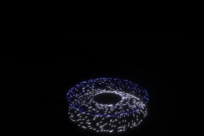

+++
title = "This Month in Rust GameDev #48 - July 2023"
transparent = true
date = 2023-08-25
draft = true
+++

<!-- no toc -->

<!-- Check the post with markdownlint-->

Welcome to the 48th issue of the Rust GameDev Workgroup's
monthly newsletter.
[Rust] is a systems language pursuing the trifecta:
safety, concurrency, and speed.
These goals are well-aligned with game development.
We hope to build an inviting ecosystem for anyone wishing
to use Rust in their development process!
Want to get involved? [Join the Rust GameDev working group!][join]

You can follow the newsletter creation process
by watching [the coordination issues][coordination].
Want something mentioned in the next newsletter?
[Send us a pull request][pr].
Feel free to send PRs about your own projects!

[Rust]: https://rust-lang.org
[join]: https://github.com/rust-gamedev/wg#join-the-fun
[pr]: https://github.com/rust-gamedev/rust-gamedev.github.io
[coordination]: https://github.com/rust-gamedev/rust-gamedev.github.io/issues?q=label%3Acoordination

- [Announcements](#announcements)
- [Game Updates](#game-updates)
- [Engine Updates](#engine-updates)
- [Learning Material Updates](#learning-material-updates)
- [Tooling Updates](#tooling-updates)
- [Library Updates](#library-updates)
- [Other News](#other-news)
- [Popular Workgroup Issues in Github](#popular-workgroup-issues-in-github)
- [Discussions](#discussions)
- [Requests for Contribution](#requests-for-contribution)
- [Jobs](#jobs)

<!--
Ideal section structure is:

```
### [Title]


_image caption_

A paragraph or two with a summary and [useful links].

_Discussions:
[/r/rust](https://reddit.com/r/rust/todo),
[twitter](https://twitter.com/todo/status/123456)_

[Title]: https://first.link
[useful links]: https://other.link
```

If needed, a section can be split into subsections with a "------" delimiter.
-->

## Announcements

## Game Updates

## Engine Updates

## Learning Material Updates

## Tooling Updates

## Library Updates

### [Hanabi]


_Hanabi effect entirely simulated on GPU thanks to the new Expression API of v0.7_

The [Hanabi] library ([GitHub][hanabi-github], [docs.rs][hanabi-docs]) is a
modern VFX library for the [Bevy game engine][bevy]. It focuses on scale to produce
stunning visual effects (VFX) in real time, offloading most of the work to
the GPU (compute shaders), with minimal CPU intervention. The design is inspired
by modern particle systems found in other industry-leading game engines.

This month, [Hanabi] saw its biggest release so far.
Version 0.7 of Hanabi not only brings support for Bevy 0.11,
but also adds a whole new Expression API
to provide a new level of customizing for VFX authors.
With expressions, developers can combine simple building blocks
like simulation parameters (`time`, `delta_time`),
effect properties (user-defined variables controlled from CPU),
and math operators (`add`, `mul`, `cos`, ...),
to directly modify each attribute of a particle (position, velocity, ...)
and form complex behaviors with complete control.
The expression API complements and extends the existing `Modifier`-based workflow
to achieve even more complex effects.

This release also marks a major stepping stone
toward the ability to build a visual editor (node graph)
to build and tweak visual effects in real time.

Other changes include the ability to set a screen-space size for particles,
and a new `KillSphereModifier` to confine particles
to the inside or the outside of a sphere.
See the [CHANGELOG][hanabi-changelog] for all details.

[Hanabi]: https://crates.io/crates/bevy_hanabi
[hanabi-github]: https://github.com/djeedai/bevy_hanabi
[hanabi-docs]: https://github.com/djeedai/bevy_hanabi
[bevy]: https://bevyengine.org
[hanabi-changelog]: https://github.com/djeedai/bevy_hanabi/blob/v0.7.0/CHANGELOG.md

## Popular Workgroup Issues in Github

<!-- Up to 10 links to interesting issues -->

## Other News

<!-- One-liners for plan items that haven't got their own sections. -->

## Discussions

<!-- Links to handpicked reddit/twitter/urlo/etc threads that provide
useful information -->

## Requests for Contribution

<!-- Links to "good first issue"-labels or direct links to specific tasks -->

## Jobs

<!-- An optional section for new jobs related to Rust gamedev -->

------

That's all news for today, thanks for reading!

Want something mentioned in the next newsletter?
[Send us a pull request][pr].

Also, subscribe to [@rust_gamedev on Twitter][@rust_gamedev]
or [/r/rust_gamedev subreddit][/r/rust_gamedev] if you want to receive fresh news!

<!--
TODO: Add real links and un-comment once this post is published
**Discuss this post on**:
[/r/rust_gamedev](TODO),
[Mastodon](TODO),
[Twitter](TODO),
[Discord](https://discord.gg/yNtPTb2).
-->

[/r/rust_gamedev]: https://reddit.com/r/rust_gamedev
[@rust_gamedev]: https://twitter.com/rust_gamedev
