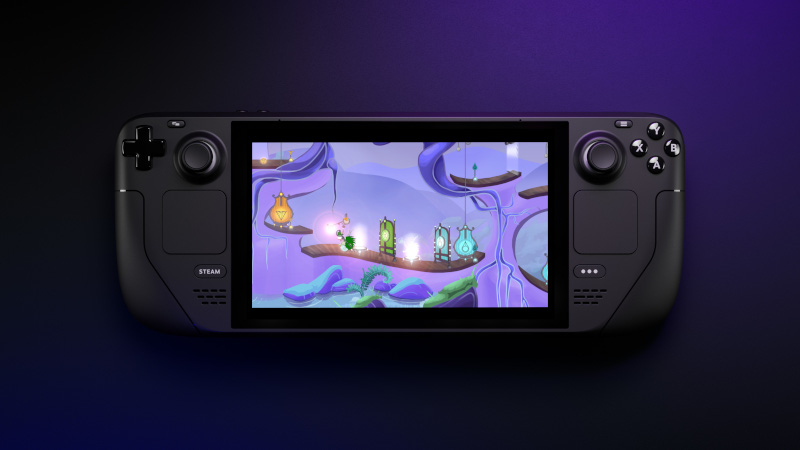
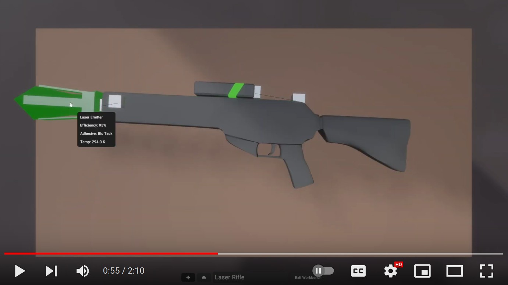

+++
title = "This Month in Rust GameDev #48 - July 2023"
transparent = true
date = 2023-08-31
draft = false
+++

<!-- no toc -->

<!-- Check the post with markdownlint-->

Welcome to the 48th issue of the Rust GameDev Workgroup's
monthly newsletter.
[Rust] is a systems language pursuing the trifecta:
safety, concurrency, and speed.
These goals are well-aligned with game development.
We hope to build an inviting ecosystem for anyone wishing
to use Rust in their development process!
Want to get involved? [Join the Rust GameDev working group!][join]

You can follow the newsletter creation process
by watching [the coordination issues][coordination].
Want something mentioned in the next newsletter?
[Send us a pull request][pr].
Feel free to send PRs about your own projects!

[Rust]: https://rust-lang.org
[join]: https://github.com/rust-gamedev/wg#join-the-fun
[pr]: https://github.com/rust-gamedev/rust-gamedev.github.io
[coordination]: https://github.com/rust-gamedev/rust-gamedev.github.io/issues?q=label%3Acoordination

- [Announcements](#announcements)
- [Game Updates](#game-updates)
- [Engine Updates](#engine-updates)
- [Learning Material Updates](#learning-material-updates)
- [Tooling Updates](#tooling-updates)
- [Library Updates](#library-updates)
- [Other News](#other-news)
- [Discussions](#discussions)
- [Requests for Contribution](#requests-for-contribution)

<!--
Ideal section structure is:

```
### [Title]


_image caption_

A paragraph or two with a summary and [useful links].

_Discussions:
[/r/rust](https://reddit.com/r/rust/todo),
[twitter](https://twitter.com/todo/status/123456)_

[Title]: https://first.link
[useful links]: https://other.link
```

If needed, a section can be split into subsections with a "------" delimiter.
-->

## Announcements

### [Rust GameDev Meetup \#29][meetup-video]

[][meetup-video]

The 29th Rust Gamedev Meetup took place in July.
You can watch the recording of the meetup [here on YouTube][meetup-video].
The schedule:

- [Blade](https://youtu.be/47wamZL5IFw?t=10m15s) by [@kvark]
- [Graphite](https://youtu.be/47wamZL5IFw?t=32m48s) by [@Keavon]
- [Veloren](https://youtu.be/47wamZL5IFw?t=41m27s) by [@AngelOnFira]

The meetups take place on the second Saturday of every month
via the [Rust Gamedev Discord server][rust-gamedev-discord]
and are also [streamed on Twitch][rust-gamedev-twitch].

[rust-gamedev-discord]: https://discord.gg/yNtPTb2
[rust-gamedev-twitch]: https://twitch.tv/rustgamedev
[meetup-video]: https://youtu.be/47wamZL5IFw
[@kvark]: https://github.com/kvark
[@Keavon]: https://github.com/Keavon
[@AngelOnFira]: https://github.com/AngelOnFira

## Game Updates

### [Colony]


[Colony] by [@ryankopf] is a colony simulator game built with Bevy that
is open source and is in a pre-alpha stage. Similar to other colony simulator games
like Dwarf Fortress or Rimworld, there are units that have their own traits and
can be instructed to perform tasks like farming and chopping trees.

You can have your units build things, farm stuff, and explore, and the game is soon
to be moving onto adding more content and UI, as core features are being completed.

_Discussions: [/r/rust](https://reddit.com/r/rust/comments/14p1fiw/colony_sim)_

[Colony]: https://github.com/ryankopf/colony
[@ryankopf]: https://github.com/ryankopf

### [Open Combat][OpenCombat_website]


_Game HUD is now more complete_

Open Combat ([Website][OpenCombat_website], [GitHub][OpenCombat_github],
[Discord][OpenCombat_discord]) is a real-time tactical game
which takes place during the 2nd World War.

Some major changes this month:

- HUD has been filled with a minimap and squad information.
- Multiple issues about zoom and move on map have been fixed.
- A high-definition map has been created.

Some fixes and improvements have to be done, but the devs are near
to publishing the official demo of the game!

[OpenCombat_website]: https://opencombat.bux.fr
[OpenCombat_github]: https://github.com/buxx/OpenCombat
[OpenCombat_discord]: https://discord.gg/6P2vtFh2Px

### [CyberGate][cybergate-yt]


_The browser uses webtransport (Left), the native uses quinn (Right)_

CyberGate ([YouTube][cybergate-yt], [Discord][cybergate-dis]),
CyberSoul is developing an ambitious multiplayer project,
utilizing procedural generation and AI to offer a dynamic universe.

The latest updates to CyberGate include:

- Implemented a Webtransport Client and a universal quic server.
- A custom game launcher that is reliable and efficient.
- Universal mechanism to save, load, and upgrade the game world from disk.
- Optimized multithreaded evolution algorithms for generating universes.
- Created an accessible editor for fine-tuning component values.

Participate in Testing and Engage with CyberSoul: [on Discord][cybergate-dis].

[cybergate-yt]: https://youtube.com/channel/UClrsOso3Xk2vBWqcsHC3Z4Q
[cybergate-dis]: https://discord.gg/R7DkHqw7zJ

### [Way of Rhea][wor]

[][wor]

[Way of Rhea][wor] is a puzzle game with hard puzzles but forgiving
mechanics being produced by [@masonremaley] in a custom Rust engine.
You can support development by [checking out the free demo and wishlisting on Steam][wor]
or [signing up for the mailing list][wor-mail]!

Recent updates:

- Way of Rhea now natively supports Linux, and Steam Deck! Mason released a
  [writeup on the port here][wor-linux].
- Way of Rhea was part of the [Cerebral Puzzle Showcase][wor-showcase].
- Crash handling was improved, and the build process was simplified (necessary
  for post-release support).
  A fix was landed to [backtrace-rs][wor-backtrace-rs] as part of the
  improved crash handling.
- Time controls were released as part of the updated demo.

[@masonremaley]: https://twitter.com/masonremaley
[wor]: https://store.steampowered.com/app/1110620/Way_of_Rhea/?utm_campaign=tmirgd&utm_source=n48
[wor-mail]: https://anthropicstudios.com/newsletter/signup/tech
[wor-showcase]: https://cerebralpuzzleshowcase.com
[wor-linux]: https://anthropicstudios.com/2023/08/21/way-of-rhea-linux
[wor-backtrace-rs]: https://github.com/rust-lang/backtrace-rs/pull/553

### [tiny-snake.rs]


[tiny-snake.rs] by [@Rodrigodd] is a terminal snake game, with a minimal binary
size.

The entire game is implemented in a single file of pure Rust code, with zero
dependencies. All interactions with the system are done through raw syscalls
(so it only runs on Linux, sorry) and the program is completely panic-free
(panic handling increases the binary size by almost 4KiB).

The game can be compiled using a single `rustc` command, and the resulting
binary is only 2760 bytes.

_Discussions: [/r/rust](https://reddit.com/r/rust/comments/15d89s5/tinysnakers)_

[tiny-snake.rs]: https://github.com/Rodrigodd/tiny-snake.rs
[@Rodrigodd]: https://github.com/Rodrigodd

### [8bit Duels][8bit-gh]


[8bit Duels][8bit-gh] ([Discord][8bit-dis]) is a turn-based strategy game made
by [@ThousandthStar]. It has been in development for the past year,
and the release is right around the corner!
A new blog post along with a release Youtube video is coming soon
on [this channel][8bit-yt].

This month's update includes a completely remade user interface.
The [devlog][8bit-devlog] covers the change from the [bevy_ui] crate
to [belly], which provides a nice HTML-like syntax for building the UI.
The last devlog post will address the re-implemented UI and the new troop: the Crow!

The Crow, as seen in the screenshot above, is a hooded bird assassin with two daggers.
It can attack twice per turn, dealing 2 damage each time. The Crow is the last of
the five 8bit Duels characters.

[@ThousandthStar]: https://github.com/ThousandthStar
[8bit-gh]: https://github.com/ThousandthStar/8bit-duels
[8bit-dis]: https://discord.com/invite/NbBcF4bGU5
[8bit-yt]: https://youtube.com/channel/UCllwuaF9ac8sNni8v03GomQ
[8bit-devlog]: https://thousandthstar.github.io/posts/8bd/8bd-part7
[bevy_ui]: https://lib.rs/bevy_ui
[belly]: https://github.com/jkb0o/belly

### [Ant Colony Simulation][antsim]


[Ant Colony Simulation][antsim] depicts an ant colony where the ants
have a simple task: to find food and bring it back to the colony.
To achieve this goal, they use signals called pheromones.
These pheromone signals guide the ants to the food source and back to their colony.

[@BonesaiDev][bonesai-yt] released a couple of videos about the project:

- [An overall explanation][antsim-vid-expl] of how it works.
- [A timelapse][antsim-vid-timelapse] of ant colony at 5x speed.
- [2D Bloom showcase timelapse][antsim-vid-timelapse-bloom] with 1k ants.

The project is written using Bevy.
You can find the source code [on GitHub][antsim].

Follow [@BonesaiDev on Twitter][bonesai-twi] or on [YouTube][bonesai-yt]
to receive future updates about this and their other AI simulation projects.

[antsim]: https://github.com/bones-ai/rust-ants-colony-simulation
[antsim-vid-expl]: https://youtu.be/98pUSZAM_7M
[antsim-vid-timelapse]: https://youtu.be/5xdfTJBMnwI
[antsim-vid-timelapse-bloom]: https://youtu.be/Z4IRY_LKtt8
[bonesai-twi]: https://twitter.com/BonesaiDev
[bonesai-yt]: https://youtube.com/@bonesai-dev

### [Cargo Space]


[Cargo Space] ([Discord][cargospace_discord]) by
[@johanhelsing][johanhelsing_mastodon] is a co-op 2d space game where you build
a ship and fly it through space looking for new parts, fighting pirates and the
environment.

This months development was all about making endless procedurally generated
parallaxing space backgrounds, choosing an appropriate rng crate, and making the
implementation seedable and cross-platform deterministic.

Johan's [devlog entry][cargospace_devlog_7] explains all this in detail, as well
as how distant parallax can be an immersive replacement for ui and minimaps.

[Cargo Space]: https://helsing.studio/cargospace
[johanhelsing_mastodon]: https://mastodon.social/@johanhelsing
[cargospace_discord]: https://discord.gg/ye9UDNvqQD
[cargospace_devlog_7]: https://johanhelsing.studio/posts/cargo-space-devlog-7

### [Veloren][veloren]


_The 0.15 release party map_

[Veloren][veloren] is an open world, open-source voxel RPG inspired by Dwarf
Fortress and Cube World.

In July, Veloren released version 0.15! You can read about the release in the
[0.15 blog post][veloren-0-15], and watch the [release party
trailer][veloren-0-15-trailer]. Here are some of the changes in this release:

- The first world boss, the 'frost giga': seek him out if you dare!
- A new dungeon: Adlet caves.
- Airships can now be used by players.
- Enemy loot is now shared between players.
- A reputation system: if you commit crimes, NPCs will remember it!
- Improved AI: NPCs will talk to players and each other about events in the
  world.
- Much richer world simulation: NPCs will migrate and pass on rumours.
- You can now choose your character's starting town.
- A durability and repair system.
- Improved accessibility, performance, bug fixes, and much, much more!

Work over July includes TCP receive buffer increase, spawn tab completion, loot
changes, translation updates, dwarven quarry ⛏️ (still inactive in game),
coastal town, desert city fixes, CI optimization, and shorter item count texts.
Work is going on to add a web-based translation tool for Veloren.

July's full weekly devlogs: "This Week In Veloren...": [#213][veloren-213], [#214][veloren-214].

[veloren]: https://veloren.net
[veloren-0-15]: https://veloren.net/release-0-15
[veloren-213]: https://veloren.net/devblog-213
[veloren-214]: https://veloren.net/devblog-214
[veloren-0-15-trailer]: https://youtube.com/watch?v=weIK41W3tX0

### [Idu][idu-itch]


[Idu][idu-itch] ([Discord][idu_discord]) is a strategic sandbox game about growing
plants that wish to reclaim nature, developed by [Elina Shakhnovich][eli_mastodon]
and [Johann Tael][johann_mastodon] featuring a bespoke Vulkan-based engine in Rust.

This month [a new demo was released][idu-new-demo]:

- New water mechanics: instantly fill large pools
  and build channels to transport water.
- A climbing plant.
- A new particle system for special effects.
- Swimming and improved climbing out of water.
- Configurable keybindings.

[idu-itch]: https://epcc.itch.io/idu
[idu_discord]: https://discord.gg/MeGauteMj3
[eli_mastodon]: https://mastodon.gamedev.place/@eli
[johann_mastodon]: https://mastodon.gamedev.place/@johann
[idu-new-demo]: https://epcc.itch.io/idu/devlog/565550/demo-version-11-vines-swimming-and-magic

### [MEANWHILE IN SECTOR 80][ms80]

[][ms80-vid]

[MEANWHILE IN SECTOR 80][ms80] ([Discord][shg-dis], [mailing list][shg-news])
by [Second Half Games][shg-site] is an upcoming third-person
action-engineering space game.

This month the third update was released, you can [watch][ms80-vid]
or [read it][ms80-text]. Highlights:

- New engineering system allows inspecting objects around the player,
  modifying your equipment using workbenches,
  and adding wires between sockets located on different pieces of equipment.
- Improved physics simulation that now features heat radiation and incandescence.

[shg-site]: https://secondhalf.games
[shg-news]: https://dashboard.mailerlite.com/forms/402073/85466601232532545/share
[shg-dis]: https://discord.gg/A9GHQGNhJX
[ms80]: https://ms80.space
[ms80-text]: https://secondhalf.games/news/2023-07-05-ms80-update-3
[ms80-vid]: https://youtube.com/watch?v=0wRXX-dRFr

### [Space Kitty][kitty]


[Space Kitty][kitty] by [@ghashy] is a platformer
about a Kitty floating in space in search of crackers.

> Somewhere in the distant space there are lots of tasty crackers floating around.
> In search of this highly valuable resource there are
> two competing parties - the DOGS and the KITTY.
> One can never say when the contest had begun, but it's clear that to this day
> there is a game for the title of the Great Cracker Collector.
> Every time the cracker is taken the lucky one emits a signal to the base
> about his achievement.
> The KITTY - highly responsible and intelligent creature - always
> sends the exact amount of collected treasures,
> while the DOGS rely on their feelings.
> Some of them truly believe that they got multiple crackers at a time,
> some just can't count, and about honesty of the others one can only guess...

The source code of the game can be found [on GitHub][kitty-gh].

_Discussions: [/r/rust_gamedev](https://reddit.com/r/rust_gamedev/comments/14vormz/spacekitty)_

[kitty]: https://ghashy.itch.io/space-kitty
[kitty-gh]: https://github.com/ghashy/Space-Kitty
[@ghashy]: https://ghashy.itch.io

### [Flesh][flesh]


[Flesh] by [@im_oab] is a 2D-horizontal shmup game with hand-drawn animation,
an organic/fleshy theme and a unique story. It is implemented using [Tetra].

After almost three years of development, it's finally [out on Steam][flesh]!

> Dive into a surreal journey as you devour a ship and battle peculiar creatures
> in this 2D side-scrolling bullet hell shmup.
> Unleash your skills, dodge relentless barrages, and uncover hidden mysteries
> in a hand-drawn world of flesh and gore.

The demo version was also updated, so consider trying the project out yourself.

_Discussions: [/r/rust_gamedev](https://reddit.com/r/rust_gamedev/comments/15g1aw1/flesh_steam)_

[flesh]: https://store.steampowered.com/app/1660850/Flesh
[Tetra]: https://github.com/17cupsofcoffee/tetra
[@im_oab]: https://twitter.com/im_oab

### [HackeRPG]


[HackeRPG] is a WIP action game where you play as a developer
who needs to fight viruses and bugs with coding in real-time.
The game's features include controlling your character using coding
and expanding your toolset by programming your own functions, variables and daemons.

[Recent updates][hackerpg-post] include:

- The first playable prototype is now avalable on itch.io.
- Sound effects.
- Input autocomplete.
- New enemies.

[Here's a YouTube video][hackerpg-vid] that showcases the current gameplay.

[HackeRPG]: https://fellow-pablo.itch.io/hackerpg
[hackerpg-vid]: https://youtube.com/watch?v=ZIwcFl0wyx8
[hackerpg-post]: https://fellow-pablo.itch.io/hackerpg/devlog/563473/002-build

## Engine Updates

### [Bevy v0.11][bevy_news]


[Bevy][bevy_engine] is a refreshingly simple data-driven game engine built in Rust.
It is [free and open-source][bevy_repo] forever!

Bevy 0.11 brought many incredible new features.
You can check out the [full release blog post here][bevy_news],
but here are some highlights:

- [Screen Space Ambient Occlusion (SSAO)](https://bevyengine.org/news/bevy-0-11/#screen-space-ambient-occlusion)
- [Temporal Anti-Aliasing (TAA)](https://bevyengine.org/news/bevy-0-11/#temporal-anti-aliasing)
- [Morph Targets](https://bevyengine.org/news/bevy-0-11/#morph-targets)
- [Robust Contrast Adaptive Sharpening (RCAS)](https://bevyengine.org/news/bevy-0-11/#robust-contrast-adaptive-sharpening)
- [WebGPU Support](https://bevyengine.org/news/bevy-0-11/#webgpu-support)
- [Improved Shader Imports](https://bevyengine.org/news/bevy-0-11/#improved-shader-imports)
- [Parallax Mapping](https://bevyengine.org/news/bevy-0-11/#parallax-mapping)
- [Skyboxes](https://bevyengine.org/news/bevy-0-11/#skyboxes)
- [Schedule-First ECS APIs](https://bevyengine.org/news/bevy-0-11/#schedule-first-ecs-apis)
- [Gizmos](https://bevyengine.org/news/bevy-0-11/#gizmos)
- [ECS Audio APIs](https://bevyengine.org/news/bevy-0-11/#ecs-audio-apis)
- [UI Borders](https://bevyengine.org/news/bevy-0-11/#ui-node-borders)
- [Grid UI Layout](https://bevyengine.org/news/bevy-0-11/#grid-ui-layout)
- [UI Performance Improvements](https://bevyengine.org/news/bevy-0-11/#faster-ui-render-batching)

_Discussions:
[/r/rust](https://reddit.com/r/rust/comments/14v77m5/bevy_011),
[Hacker News](https://news.ycombinator.com/item?id=36657970),
[Twitter](https://twitter.com/BevyEngine/status/1678122584976797697),
[Mastodon](https://mastodon.social/@bevy/110685755721601977)_

[bevy_engine]: https://bevyengine.org
[bevy_news]: https://bevyengine.org/news/bevy-0-11
[bevy_repo]: https://github.com/bevyengine/bevy

### [Fyrox][fyrox]


[Fyrox][fyrox] ([GitHub][fyrox-src], [Discord][fyrox-dis], [Twitter][fyrox-twi])
is a game engine that aims to be easy to use and provide a large set
of out-of-the-box features.

This month [Fyrox v0.31 was released][fyrox-v0-31]. Highlights include:

- A huge bunch of editor improvements like
  the ability to create custom editor plugins,
  ability to open multiple scenes,
  saving/loading docking manager layout,
  and a separate panel for camera preview.
- Inverter node for AI behaviour trees.
- 9-slice image widget.
- Lots of [API docs][fyrox-docs] and [the book][fyrox-book] improvements,
  mostly related to UI stuff.

_Discussions: [/r/rust](https://reddit.com/r/rust/comments/156pq0g/fyrox_0_31)_

[fyrox]: https://fyrox.rs
[fyrox-src]: https://github.com/FyroxEngine/Fyrox
[fyrox-dis]: https://discord.com/invite/xENF5Uh
[fyrox-twi]: https://twitter.com/DmitryNStepanov
[fyrox-v0-31]: https://fyrox.rs/blog/post/fyrox-game-engine-0-31
[fyrox-book]: https://fyrox-book.github.io
[fyrox-docs]: https://docs.rs/fyrox

## Learning Material Updates

### Mobile Development with Bevy

[@Nikl][nikl] spent some time developing a mobile game using Bevy and
documented findings on his [blog][nikls-blog]. [The first post][android-bevy-post]
contains notes on general project setup and some Android specific solutions.

GitHub workflows were created for automatic builds.
[A guide on how to set up an iOS workflow][ios-workflow] was released at
the end of July.

[nikl]: https://mastodon.online/@nikl_me
[nikls-blog]: https://nikl.me
[android-bevy-post]: https://nikl.me/blog/2023/notes_on_android_development_using_bevy
[ios-workflow]: https://nikl.me/blog/2023/github_workflow_to_publish_ios_app

### [Gentle Intro to GPUs for Backend Devs Pt1][backend-gpu]


[Vladimir Zaytsev][@xyzw_io] released [the first part][backend-gpu]
of a series about introducing backend engineers to GPU programming:

> In this series of articles, I would like to offer a gentle and popular
> introduction to GPU programming specifically tailored for engineers.
> Whether you’re new to GPU programming or simply want to expand your knowledge,
> we’ve got you covered.
> I’ll explain the fundamentals of GPU programming in a way
> that’s easy to grasp if you’re more accustomed to working with backend services.

The first part gives a high-level introduction into GPU compute landscape
and walks a reader through a toy GPU program written with wgpu.

[backend-gpu]: https://xyzw.io/posts/backend-gpu-p1
[@xyzw_io]: https://twitter.com/xyzw_io

## Tooling Updates

### [Rerun][rerun]


[Rerun][rerun] ([Discord][rerun-dis], [Github][rerun-gh]) is an open-source SDK
for logging complex visual data paired with a visualizer for exploring that data
over time. While its primary focus is on robotics and computer vision, it can be
useful for all kinds of rapid prototyping & algorithm development.

[v0.8.0][rerun-v0-8-0] and subsequently [v0.8.1][rerun-v0-8-1] are out now!

A few of the biggest highlights:

- Pinhole logging is now easier to use in many cases.
- The visualizer can now show coordinate arrows for all affine transforms
  within the view.
- Users that build their own Viewer applications can now add fully custom Space Views.
- New optional flush_timeout specifies how long Rerun will wait if a TCP stream
  is disconnected during a flush.
- The `RecordingStream` now offers a stateful time API, similar to the Python APIs
- Defaults to 8ms long microbatches instead of 50ms. This makes the default behavior
  more suitable for use-cases like real-time video feeds.
- The web viewer now incremental loads .rrd files when streaming over HTTP. #2412

There's a growing community on [Discord][rerun-dis] waiting for you to join in
case you have any questions, comments or just want to follow the latest
development. The [Github project][rerun-gh] is MIT/Apache licensed and open to
contribute for everyone, be it with suggestions, bugs or PRs.

[rerun]: https://rerun.io
[rerun-dis]: https://discord.gg/npTFxYR9
[rerun-gh]: https://github.com/rerun-io/rerun
[rerun-v0-8-0]: https://github.com/rerun-io/rerun/releases/tag/0.8.0
[rerun-v0-8-1]: https://github.com/rerun-io/rerun/releases/tag/0.8.1

### [glTF IBL Sampler UI][gltf-ibl-sampler-egui]


[glTF IBL Sampler UI][gltf-ibl-sampler-egui] by [@pcwalton] is
an artist-friendly egui frontend that wraps [glTF IBL Sampler][gltf-ibl-sampler]
to generate cubemap skyboxes from panoramas.

It provides an easy way to generate skyboxes for use in Bevy and other new game engines
that use the modern KTX2 format as their native texture format.
By default, the panorama is split up into base color, diffuse, and specular parts,
with the mipmap levels corresponding to different roughness values of the material.

[@pcwalton]: https://twitter.com/pcwalton
[gltf-ibl-sampler-egui]: https://github.com/pcwalton/gltf-ibl-sampler-egui
[gltf-ibl-sampler]: https://github.com/KhronosGroup/glTF-IBL-Sampler

## Library Updates

### [bevy_xpbd]


_Newton's cradle simulated using bevy_xpbd_

[bevy_xpbd] by [@Jondolf] is a 2D and 3D physics engine based on
Extended Position Based Dynamics for the Bevy game engine.
It uses Bevy's Entity Component System (ECS) directly for the simulation data
and logic, which makes the design and API feel better integrated into Bevy while
avoiding the overhead associated with copying lots of data to a separate data
structure like in many other physics engines such as bevy_rapier.

In mid-July, bevy_xpbd 0.2 was released, featuring:

- Spatial queries (ray casting, shape casting, point projection, intersection tests);
- Bevy 0.11 support;
- Improved scheduling;
- Velocity damping;
- Gravity scale;
- Locking translational and rotational axes;

and much more. You can find more details in the
[release post][bevy-xpbd-post] and [changelog][bevy-xpbd-changelog].

A lot of work was also done during the rest of July. The physics debug renderer
was improved, collision stability issues were significantly reduced, external
impulses were added, and Bevy's own `Transform`s can now be used directly
for moving bodies. The narrow phase part of collision detection was also
refactored into a separate plugin, which makes multithreading and several
upcoming features much easier to implement while also improving modularity.

_Discussions: [/r/rust_gamedev](https://reddit.com/r/rust_gamedev/comments/14zr5i5/bevy_xpbd_02)_

[bevy_xpbd]: https://github.com/Jondolf/bevy_xpbd
[@Jondolf]: https://github.com/Jondolf
[bevy-xpbd-post]: https://joonaa.dev/blog/03/bevy-xpbd-0-2-0
[bevy-xpbd-changelog]: https://github.com/Jondolf/bevy_xpbd/releases/tag/v0.2.0

### [Sparsey]

[Sparsey] by [@LechintanTudor] is a fast and flexible Entity Component System
based on sparse sets.

The latest release, v0.11.0, improves the performance of adding and removing
components from entities and adds new functions for running systems that only
borrow data from one of World, Resources or SyncResources.

[Sparsey]: https://github.com/LechintanTudor/sparsey
[@LechintanTudor]: https://github.com/LechintanTudor

### [Hanabi]


_Hanabi effect entirely simulated on GPU thanks to the new Expression API of v0.7_

The [Hanabi] library ([GitHub][hanabi-github], [docs.rs][hanabi-docs]) is a
modern VFX library for the [Bevy game engine][bevy]. It focuses on scale to produce
stunning visual effects (VFX) in real time, offloading most of the work to
the GPU (compute shaders), with minimal CPU intervention. The design is inspired
by modern particle systems found in other industry-leading game engines.

This month, [Hanabi] saw its biggest release so far.
Version 0.7 of Hanabi not only brings support for Bevy 0.11,
but also adds a whole new Expression API
to provide a new level of customizing for VFX authors.
With expressions, developers can combine simple building blocks
like simulation parameters (`time`, `delta_time`),
effect properties (user-defined variables controlled from CPU),
and math operators (`add`, `mul`, `cos`, ...),
to directly modify each attribute of a particle (position, velocity, ...)
and form complex behaviors with complete control.
The expression API complements and extends the existing `Modifier`-based workflow
to achieve even more complex effects.

This release also marks a major stepping stone
toward the ability to build a visual editor (node graph)
to build and tweak visual effects in real time.

Other changes include the ability to set a screen-space size for particles,
and a new `KillSphereModifier` to confine particles
to the inside or the outside of a sphere.
See the [CHANGELOG][hanabi-changelog] for all details.

[Hanabi]: https://crates.io/crates/bevy_hanabi
[hanabi-github]: https://github.com/djeedai/bevy_hanabi
[hanabi-docs]: https://github.com/djeedai/bevy_hanabi
[bevy]: https://bevyengine.org
[hanabi-changelog]: https://github.com/djeedai/bevy_hanabi/blob/v0.7.0/CHANGELOG.md

### [Iced][iced]


_Visualisation of damaged regions during the incremental rendering_

[Iced][iced] is a Rust GUI library focused on simplicity and type safety.

[Iced v0.10][iced-v0-10] is a huge release that brings a lot of updates.
Some highlights:

- Huge improvements to the text handling strategy
  thanks to the adoption of [cosmic-text].
- A new CPU-only software renderer based on [tiny-skia].
- Runtime renderer fallback.
- Configurable LineHeight support for text widgets.
- Nested overlays.
- Backend-specific primitives.
- Offscreen rendering & screenshots.
- Gradients for backgrounds.
- ComboBox widget.

_Discussions: [/r/rust](https://reddit.com/r/rust/comments/15e82lr/iced_0_10)_

[iced]: https://iced.rs
[iced-v0-10]: https://github.com/iced-rs/iced/releases/tag/0.10.0
[cosmic-text]: https://github.com/pop-os/cosmic-text
[tiny-skia]: https://github.com/RazrFalcon/tiny-skia

## Other News

<!-- One-liners for plan items that haven't got their own sections. -->

- Other game updates:
  - [Robo Instructus][robo-steam] was released 4 year ago \-
    [Alex Butler shared an article][robo-post] about game's updates, stats,
    and user feedback from the last year.
  - [snaked] by [@kuviman] is a reversed snake game where you play as food.
  - [@Syn9Dev] shared a couple of updates about their retro JRPG:
    [battle inventory](https://twitter.com/Syn9Dev/status/1676082920182755332)
    and [cave bugs enemies](https://twitter.com/Syn9Dev/status/1676969827980935172).
  - [Sulis] v1.0 [was released this month][sulis-1].
  - [@martin-t resumed developemnt of RecWars][recwars].
  - [Vladimir Zaytsev posted a video][colonysim] of his WIP colony sim
    showcasing the early progress on construction mechanics.
  - [mochia.net] is a virtual pet site inspired by Neopets,
    with a backend written in Rust.
  - [@dobkeratops shared an update on their WIP shooter game][rusty-shooter]
    featuring lighting tweaks and vehicle turrets.
  - [Maginet][maginet] added an undo button and preparing for Steam release.
  - [PatchGames started working on a new city building game][patchgames-vid].
- Other engine updates:
  - [godot-rs now supports Godot 4.1][godot-rs-4-1].
  - [ggez v0.9][ggez-v0-9] mostly brings slight API tweaks and bugfixes.
    The devs also shared their plans for ggez v10: 3d support, async asset loading,
    and coroutines.
- Other learning material updates:
  - [GitGhillie shared an article][blender-bevy-ed] about using Blender
    as a level editor for Bevy.
  - [PhaestusFox released more Bevy tutorials on YouTube][@PhaestusFox]:
    mostly about Bevy v0.11, Bevy's UI plugins, and Rapier integration.
- Other tooling updates:
  - [Internet Archive expands its Flash support using Ruffle.][ruffle]
- Other library updates:
  - [bevy_vello] is a Bevy plugin that provides rendering support for [lottie]
    animations and SVGs on Bevy using [Vello] and [Velato].
  - [hexx v0.8][hexx-0-8] release adds a hexmod representation and resolution system.
  - [cuicui_layout] is a dumb layout algorithm you can rely on,
    built for and with Bevy.
  - [renet v0.0.13][renet] slightly improves the API and brings a couple of bugfixes.

[robo-steam]: https://store.steampowered.com/app/1032170/Robo_Instructus
[robo-post]: https://blog.roboinstruct.us/2023/07/16/4-years-old.html
[snaked]: https://kuviman.itch.io/snaked
[@kuviman ]: https://github.com/kuviman
[@Syn9Dev]: https://twitter.com/Syn9Dev
[sulis]: https://sulisgame.com
[sulis-1]: https://github.com/Grokmoo/sulis/releases/tag/1.0.0
[colonysim]: https://reddit.com/r/rust_gamedev/comments/14t8xgw/colonysim
[recwars]: https://reddit.com/r/rust_gamedev/comments/1548teg/resumed_recwars
[mochia.net]: https://reddit.com/r/rust/comments/15c0j97/a_virtual_pet_site
[rusty-shooter]: https://reddit.com/r/rust_gamedev/comments/14wsnhx/rust_shooter_update
[maginet]: https://twitter.com/evrimzone/status/1681302065069559812
[patchgames-vid]: https://twitter.com/PatchGamesStdio/status/1677369018225680397

[godot-rs-4-1]: https://mastodon.gamedev.place/@GodotRust/110669301088668526
[ggez-v0-9]: https://reddit.com/r/rust_gamedev/comments/14v6x3z/ggez_news_0_9

[blender-bevy-ed]: https://itch.io/blog/564971/blender-to-bevy-workflow-physics-props
[@PhaestusFox]: https://youtube.com/@PhaestusFox

[ruffle]: https://reddit.com/r/rust/comments/14zvk2l/internet_archive_expands_flash_support

[bevy_vello]: https://github.com/vectorgameexperts/bevy_vello
[lottie]: https://lottiefiles.com/what-is-lottie
[Vello]: https://github.com/linebender/vello
[Velato]: https://github.com/linebender/velato
[cuicui_layout]: https://github.com/nicopap/cuicui_layout
[renet]: https://github.com/lucaspoffo/renet/releases/tag/0.0.13
[hexx-0-8]: https://github.com/ManevilleF/hexx/releases/tag/0.8.0

## Discussions

<!-- Links to handpicked reddit/twitter/urlo/etc threads that provide
useful information -->

- /r/rust_gamedev:
  - ["Data Oriented architectures other than ECS?"][red-dod-no-ecs]

[red-dod-no-ecs]: https://reddit.com/r/rust_gamedev/comments/159zfye/data_oriented_architectures_other_than_ecs

## Requests for Contribution

<!-- Links to "good first issue"-labels or direct links to specific tasks -->

- [bevy_mod_scripting is looking for maintainers][bevy_mod_scripting-help].
- ['Are We Game Yet?' wants to know about projects/games/resources that
  aren't listed yet][awgy].
- [Graphite is looking for contributors][graphite-contribute] to help build the
  new node graph and 2D rendering systems.
- [winit's "difficulty: easy" issues][winit-issues].
- [Backroll-rs, a new networking library][backroll-rs].
- [Embark's open issues][embark-open-issues] ([embark.rs]).
- [wgpu's "help wanted" issues][wgpu-issues].
- [luminance's "low hanging fruit" issues][luminance-fruits].
- [ggez's "good first issue" issues][ggez-issues].
- [Veloren's "beginner" issues][veloren-beginner].
- [A/B Street's "good first issue" issues][abstreet-issues].
- [Mun's "good first issue" issues][mun-issues].
- [SIMple Mechanic's good first issues][simm-issues].
- [Bevy's "good first issue" issues][bevy-issues].
- [Ambient's "good first issue" issues][ambient-issues].

[bevy_mod_scripting-help]: https://github.com/makspll/bevy_mod_scripting/issues/48
[awgy]: https://github.com/rust-gamedev/arewegameyet#contribute
[graphite-contribute]: https://graphite.rs/contribute
[winit-issues]: https://github.com/rust-windowing/winit/issues?q=is%3Aopen+is%3Aissue+label%3A%22difficulty%3A+easy%22
[backroll-rs]: https://github.com/HouraiTeahouse/backroll-rs/issues
[embark.rs]: https://embark.rs
[embark-open-issues]: https://github.com/search?q=user:EmbarkStudios+state:open
[wgpu-issues]: https://github.com/gfx-rs/wgpu/issues?q=is%3Aissue+is%3Aopen+label%3A%22help+wanted%22
[luminance-fruits]: https://github.com/phaazon/luminance-rs/issues?q=is%3Aissue+is%3Aopen+label%3A%22low+hanging+fruit%22
[ggez-issues]: https://github.com/ggez/ggez/labels/%2AGOOD%20FIRST%20ISSUE%2A
[veloren-beginner]: https://gitlab.com/veloren/veloren/issues?label_name=beginner
[abstreet-issues]: https://github.com/a-b-street/abstreet/issues?q=is%3Aissue+is%3Aopen+label%3A%22good+first+issue%22
[mun-issues]: https://github.com/mun-lang/mun/labels/good%20first%20issue
[simm-issues]: https://github.com/mkhan45/SIMple-Mechanics/labels/good%20first%20issue
[bevy-issues]: https://github.com/bevyengine/bevy/labels/D-Good-First-Issue
[ambient-issues]: https://github.com/AmbientRun/Ambient/issues?q=is%3Aopen+is%3Aissue+label%3A%22good+first+issue%22

------

That's all news for today, thanks for reading!

Want something mentioned in the next newsletter?
[Send us a pull request][pr].

Also, subscribe to [@rust_gamedev on Twitter][@rust_gamedev]
or [/r/rust_gamedev subreddit][/r/rust_gamedev] if you want to receive fresh news!

<!--
TODO: Add real links and un-comment once this post is published
**Discuss this post on**:
[/r/rust_gamedev](TODO),
[Mastodon](TODO),
[Twitter](TODO),
[Discord](https://discord.gg/yNtPTb2).
-->

[/r/rust_gamedev]: https://reddit.com/r/rust_gamedev
[@rust_gamedev]: https://twitter.com/rust_gamedev
