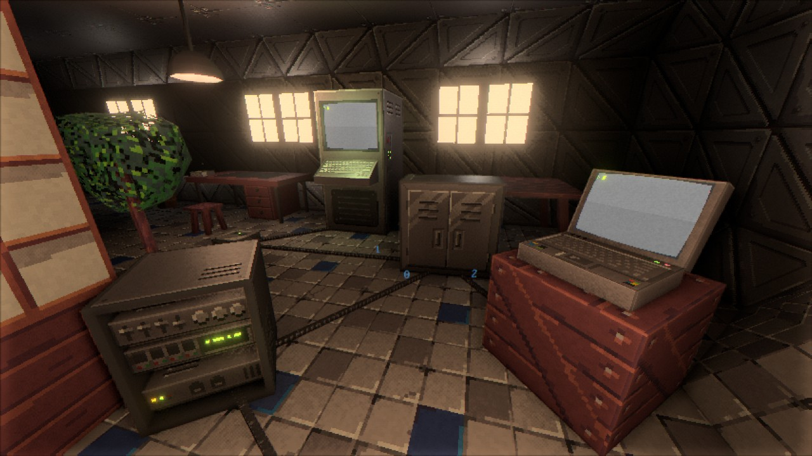

+++
title = "This Month in Rust GameDev #49 - August 2023"
transparent = true
date = 2023-09-16
draft = true
+++

<!-- no toc -->

<!-- Check the post with markdownlint-->

Welcome to the 49th issue of the Rust GameDev Workgroup's
monthly newsletter.
[Rust] is a systems language pursuing the trifecta:
safety, concurrency, and speed.
These goals are well-aligned with game development.
We hope to build an inviting ecosystem for anyone wishing
to use Rust in their development process!
Want to get involved? [Join the Rust GameDev working group!][join]

You can follow the newsletter creation process
by watching [the coordination issues][coordination].
Want something mentioned in the next newsletter?
[Send us a pull request][pr].
Feel free to send PRs about your own projects!

[Rust]: https://rust-lang.org
[join]: https://github.com/rust-gamedev/wg#join-the-fun
[pr]: https://github.com/rust-gamedev/rust-gamedev.github.io
[coordination]: https://github.com/rust-gamedev/rust-gamedev.github.io/issues?q=label%3Acoordination

- [Announcements](#announcements)
- [Game Updates](#game-updates)
- [Engine Updates](#engine-updates)
- [Learning Material Updates](#learning-material-updates)
- [Tooling Updates](#tooling-updates)
- [Library Updates](#library-updates)
- [Other News](#other-news)
- [Popular Workgroup Issues in Github](#popular-workgroup-issues-in-github)
- [Discussions](#discussions)
- [Requests for Contribution](#requests-for-contribution)
- [Jobs](#jobs)

<!--
Ideal section structure is:

```
### [Title]


_image caption_

A paragraph or two with a summary and [useful links].

_Discussions:
[/r/rust](https://reddit.com/r/rust/todo),
[twitter](https://twitter.com/todo/status/123456)_

[Title]: https://first.link
[useful links]: https://other.link
```

If needed, a section can be split into subsections with a "------" delimiter.
-->

## Announcements

## Game Updates

### [Tunnet][tunnet-itch]



Tunnet ([Steam][tunnet-steam], [itch.io][tunnet-itch]) is an upcoming short
puzzle/exploration game about digging tunnels and building computer networks.

In August, [a new version of the demo build has been released][tunnet-post].
Here are the most notable updates:

- The game is now better optimized to run smoothly on the Steam Deck.
- Some of the textures have been revamped and are now slightly more detailed.
- The animations of the character portraits have been improved.
- Several minor quality of life improvements like the ability to sprint have
  been made.
- A basic egui-based crash reporter will now be displayed when the game process
  ends unexpectedly.

[tunnet-itch]: https://puzzled-squid.itch.io/tunnet
[tunnet-steam]: https://store.steampowered.com/app/2286390/Tunnet
[tunnet-post]: https://puzzled-squid.itch.io/tunnet/devlog/580255/devlog-2-optimizations

### [Oort]


_A fleet of ships_

[Oort] ([GitHub][oort-gh], [Discord][oort-dis]) by [@rlane] is a programming
game where you write Rust code to control space ships in combat against other
players. Your code needs to manage the thrusters, guns, missiles, comms, and
radar of each ship in your fleet. There's a series of tutorials where you can
solve key problems one by one, such as leading moving targets or missile
guidance. The game runs in your browser via WebAssembly.

Oort has started running weekly tournaments and the AIs have gotten more and more
sophisticated each time. Check out this recent [tournament writeup][oort-tournament]
where the top players discuss their strategies.

_Discussions: [r/rust](https://reddit.com/r/rust/comments/167qyn0/oort)_

[Oort]: https://oort.rs
[oort-gh]: https://github.com/rlane/oort3
[oort-dis]: https://discord.gg/vYyu9EhkKH
[@rlane]: https://github.com/rlane
[oort-tournament]: https://github.com/rlane/oort3/wiki/Tournament-Writeup-2023%E2%80%9009%E2%80%9011

## Engine Updates

### [goku]

[goku] ([Discord][goku-dis]) by [@ladroid] is a new 2D Rust game engine
backed by SDL2. It's currently compatible with Windows and WASM
and features [multi-language (Spa, Fra, Ger, Jpn) docs][goku-docs].

Quick Peek:

- Sprite sheets loading and animation support.
- Basic particle effects.
- Point, spot, and ambient lights.
- UI layer with ready widgets like buttons, checkboxes, and sliders.
- Audio support backed by SDL2 Mixer.
- Gamepad input support.
- Tile system and JSON format for describing scenes.
- Built-in support for parallax backgrounds.
- Simple timing and frame management utils.
- Behavior tree AIs.

_Discussions: [/r/rust](https://reddit.com/r/rust/comments/165luwu/intro_goku)_

[goku]: https://github.com/ladroid/goku
[@ladroid]: https://github.com/ladroid
[goku-docs]: https://lados-organization.gitbook.io/goku
[goku-dis]: https://discord.gg/9TAMqdRyED

## Learning Material Updates

### [Failing to build P2P Multiplayer Pong with Bevy][chrisbiscardi-vid1]

[][chrisbiscardi-vid1]

[@chrisbiscardi] published a [video][chrisbiscardi-vid1] covering
P2P multiplayer games with rollback networking and physics.
This video dives into what makes it difficult and what parts
work out of the box before identifying better potential paths to take in the future.

_Discussions: [Mastodon](https://hachyderm.io/@chrisbiscardi/110934091254135119)_

[chrisbiscardi-vid1]: https://youtube.com/watch?v=wpx9qhKEuP8
[@chrisbiscardi]: https://twitter.com/chrisbiscardi

## Tooling Updates

## Library Updates

### [Dexterous Developer][dexterous_developer]

[Dexterous Developer][dexterous_developer] by [@lee-orr]
is an experimental hot-reload system for the [Bevy] game engine.
Features:

- Define the reloadable areas of your game explicitly \- which can include
  systems, components, and resources (with some limitations).
- Reset resources to a default or pre-determined value upon reload.
- Serialize/deserialize your reloadable resources & components, allowing you to
  evolve their schemas so long as they are compatible with the de-serializer.
- Mark entities to get removed on hot reload.
- Run systems after hot-reload.
- Create functions to set-up & tear down upon either entering/exiting a state
  or on hot reload.
- Only includes any hot reload capacity in your build
  when you explicitly enable it - such as by using the CLI launcher.
- Cross-platform/cross-device hot reload - run a "hot reload server"
  on a dev environment, and execute the application elsewhere.

The library is quite new and currently known issues include:
mobile/WASM support and the need to pre-define events&states.

[dexterous_developer]: https://github.com/lee-orr/dexterous_developer
[@lee-orr]: https://github.com/lee-orr
[Bevy]: bevyengine.org

## Popular Workgroup Issues in Github

<!-- Up to 10 links to interesting issues -->

## Other News

<!-- One-liners for plan items that haven't got their own sections. -->

## Discussions

<!-- Links to handpicked reddit/twitter/urlo/etc threads that provide
useful information -->

## Requests for Contribution

<!-- Links to "good first issue"-labels or direct links to specific tasks -->

## Jobs

<!-- An optional section for new jobs related to Rust gamedev -->

------

That's all news for today, thanks for reading!

Want something mentioned in the next newsletter?
[Send us a pull request][pr].

Also, subscribe to [@rust_gamedev on Twitter][@rust_gamedev]
or [/r/rust_gamedev subreddit][/r/rust_gamedev] if you want to receive fresh news!

<!--
TODO: Add real links and un-comment once this post is published
**Discuss this post on**:
[/r/rust_gamedev](TODO),
[Mastodon](TODO),
[Twitter](TODO),
[Discord](https://discord.gg/yNtPTb2).
-->

[/r/rust_gamedev]: https://reddit.com/r/rust_gamedev
[@rust_gamedev]: https://twitter.com/rust_gamedev
