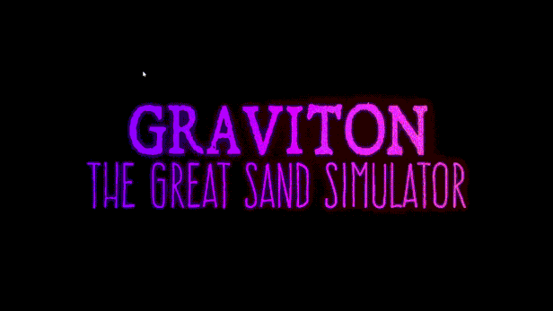

+++
title = "This Month in Rust GameDev #49 - August 2023"
transparent = true
date = 2023-10-20
draft = true
+++

<!-- no toc -->

<!-- Check the post with markdownlint-->

<!-- TODO: title card img? -->

Welcome to the 49th issue of the Rust GameDev Workgroup's
monthly newsletter.
[Rust] is a systems language pursuing the trifecta:
safety, concurrency, and speed.
These goals are well-aligned with game development.
We hope to build an inviting ecosystem for anyone wishing
to use Rust in their development process!
Want to get involved? [Join the Rust GameDev working group!][join]

You can follow the newsletter creation process
by watching [the coordination issues][coordination].
Want something mentioned in the next newsletter?
[Send us a pull request][pr].
Feel free to send PRs about your own projects!

[Rust]: https://rust-lang.org
[join]: https://github.com/rust-gamedev/wg#join-the-fun
[pr]: https://github.com/rust-gamedev/rust-gamedev.github.io
[coordination]: https://github.com/rust-gamedev/rust-gamedev.github.io/issues?q=label%3Acoordination

- [Announcements](#announcements)
- [Game Updates](#game-updates)
- [Engine Updates](#engine-updates)
- [Learning Material Updates](#learning-material-updates)
- [Tooling Updates](#tooling-updates)
- [Library Updates](#library-updates)
- [Other News](#other-news)
- [Discussions](#discussions)
- [Requests for Contribution](#requests-for-contribution)

<!--
Ideal section structure is:

```
### [Title]


_image caption_

A paragraph or two with a summary and [useful links].

_Discussions:
[/r/rust](https://reddit.com/r/rust/todo),
[twitter](https://twitter.com/todo/status/123456)_

[Title]: https://first.link
[useful links]: https://other.link
```

If needed, a section can be split into subsections with a "------" delimiter.
-->

## Announcements

### TODO Meetup TODO

TODO: img

TODO links, etc

## Game Updates

### [Graviton - The Great Sand Simulator][graviton-steam]



[Graviton - The Great Sand Simulator][graviton-website]
([Discord][graviton-discord], [Youtube][graviton-youtube])
by [@hakolao] is a falling sand simulator in which you can define
your own interactive sand rules.

Continuing the developer's exploration into GPU sand simulation
the app has been recently taken to another level with a complete rewrite.
Now, with some [training][graviton-docs],
you can program your own rules for the sand.
Many example sands are provided from acid and blood to the classic
Game of Life.

Recent updates include:

- Customizable sand with programmable rules.
- [Shape & Mirror Draw Modes][graviton-youtube-mirror].
- New UI, graphics and render modes.
- Gif and Image export.
- Image import.

You can support the development by purchasing or wishlisting on
[Steam][graviton-steam].

[@hakolao]: https://github.com/hakolao
[graviton-discord]: https://discord.gg/3MyPaDagsd
[graviton-youtube]: https://youtube.com/watch?v=X_O90KyEt8o
[graviton-steam]: http://s.team/a/2137280
[graviton-website]: https://www.gravitongame.art/
[graviton-docs]: https://docs.gravitongame.art/Tutorial
[graviton-youtube-mirror]: https://youtube.com/watch?v=cOPy4Shqn8U

### [Tunnet][tunnet-itch]


Tunnet ([Steam][tunnet-steam], [itch.io][tunnet-itch]) is an upcoming short
puzzle/exploration game about digging tunnels and building computer networks.

In August, [a new version of the demo build has been released][tunnet-post].
Here are the most notable updates:

- The game is now better optimized to run smoothly on the Steam Deck.
- Some of the textures have been revamped and are now slightly more detailed.
- The animations of the character portraits have been improved.
- Several minor quality of life improvements like the ability to sprint have
  been made.
- A basic egui-based crash reporter will now be displayed when the game process
  ends unexpectedly.

[tunnet-itch]: https://puzzled-squid.itch.io/tunnet
[tunnet-steam]: https://store.steampowered.com/app/2286390/Tunnet
[tunnet-post]: https://puzzled-squid.itch.io/tunnet/devlog/580255/devlog-2-optimizations

### [Oort]


_A fleet of ships_

[Oort] ([GitHub][oort-gh], [Discord][oort-dis]) by [@rlane] is a programming
game where you write Rust code to control space ships in combat against other
players. Your code needs to manage the thrusters, guns, missiles, comms, and
radar of each ship in your fleet. There's a series of tutorials where you can
solve key problems one by one, such as leading moving targets or missile
guidance. The game runs in your browser via WebAssembly.

Oort has started running weekly tournaments and the AIs have gotten more and more
sophisticated each time. Check out this recent [tournament writeup][oort-tournament]
where the top players discuss their strategies.

_Discussions: [r/rust](https://reddit.com/r/rust/comments/167qyn0/oort)_

[Oort]: https://oort.rs
[oort-gh]: https://github.com/rlane/oort3
[oort-dis]: https://discord.gg/vYyu9EhkKH
[@rlane]: https://github.com/rlane
[oort-tournament]: https://github.com/rlane/oort3/wiki/Tournament-Writeup-2023%E2%80%9009%E2%80%9011

### [Ars Militaris][arsm]


[Ars Militaris][arsm] ([GitHub][arsm-gh], [Discord][arsm-dis],
[Twitter][arsm-twi], [Reddit][arsm-red])
is a turn-based tactics game set in the ancient Rome era,
being developed with Bevy.

August saw some nice developments that occurred in both the
digital and board game version of Ars Militaris. You can
read about them in issues VI through IX of This Week in Ars Militaris
([VI](https://arsmilitaris.com#this-week-in-ars-militaris-vi),
[VII](https://arsmilitaris.com#this-week-in-ars-militaris-vii),
[VIII](https://arsmilitaris.com#this-week-in-ars-militaris-viii),
[IX](https://arsmilitaris.com#this-week-in-ars-militaris-ix)).

The most noticeable improvements in the digital version were
the updating of the multiplayer aspect to be on par with the
single-player aspect, and then also the development of the
[Ars Militaris Lobby][arsm-lobby].

In the board game version, development started on a new
scenario that will serve as our main product for the Ars
Militaris board game version, and much playtesting with
very positive results occurred
[(Ars Militaris Event III)][arsm-event-iii]
and [(Ars Militaris Event IV)][arsm-event-iv].

But then, the result of a somewhat intensive 3-month
sprint left the Lead Developer exhausted which brought
the project to a temporary pause.

[arsm]: https://arsmilitaris.com
[arsm-gh]: https://github.com/arsmilitaris
[arsm-twi]: https://twitter.com/ArsMilitarisDev
[arsm-dis]: https://discord.gg/cdNDQsstgq
[arsm-red]: https://reddit.com/r/arsmilitaris
[arsm-lobby]: https://arsmilitaris.com#ars-militaris-lobby
[arsm-event-iii]: https://arsmilitaris.com#ars-militaris-event-iii
[arsm-event-iv]: https://arsmilitaris.com#ars-militaris-event-iv

### [Tiny Glade]


[Tiny Glade] ([Twitter][tglade-twi])
is a small relaxing game about doodling castles.

This month, Tiny Glade was featured in the
[Future Games Show August Showcase][tglade-fgs] with an exclusive new trailer.

The [trailer and a number of accompanying screenshots][tglade-post] demonstrate
recent changes in the game, and especially show off the new global illumination
and [dynamic time passage][tglade-tod].

[Tiny Glade]: https://store.steampowered.com/app/2198150/Tiny_Glade
[tglade-twi]: https://twitter.com/PounceLight
[tglade-post]: https://store.steampowered.com/news/app/2198150/view/3673302243803533512
[tglade-fgs]: https://www.gamesradar.com/tiny-glade-fgs-gamescom-2023/
[tglade-tod]: https://twitter.com/h3r2tic/status/1694442717252661448

### [Veloren][veloren]


_A group of friends_

[Veloren][veloren] is an open world, open-source voxel RPG inspired by Dwarf
Fortress and Cube World.

In August, Veloren saw a network library update, new locations in the character
selection screen, the implementation of a new portal graphic, and numerous
translation updates. Moreover, improvements were made to the airship fixes, loot
balancing, and group chat issues. There also been upgrades to the dependency, a
README update, and tweaks to the buff death message.

Ongoing projects currently in the works include the addition of Phoenix
abilities, NPC arenas, frost Giga attacks, compasses, and a banking storage
system. Other upcoming updates include an enhancement to the windmills, CI
scripts, saving window size, the selection of a single-player world, addition of
lava material, and improvements to the weather network protocol. Work is also
ongoing on ship movement, pet commands, Terracotta ruins, dwarven quarry,
coastal towns, clifftown rework, and axe skills. They are also planning to
implement physics interactions that increase your height when gliding, including
the introduction of thermal and ridgelines.

August's full weekly devlogs: "This Week In Veloren...": [#216][veloren-216].

[veloren]: https://veloren.net
[veloren-216]: https://veloren.net/devblog-216

### [CyberGate][cybergate-yt]


_Two client windows controlling the same pawn simultaneously._

CyberGate ([YouTube][cybergate-yt], [Discord][cybergate-dis]),
CyberSoul is developing an ambitious multiplayer project,
utilizing procedural generation and AI to offer a dynamic universe.

Tech Progress:

- Complete game framework overhaul.
- Addressed engine limitations.
- Upgraded game tools and utilities.
- Introduced Cosmos APIs for universe management.
- Redesigned privacy mechanisms.
- New character authentication system.
- Persistent player data.
- Player Accounts: Login, Register, Verify, Guests.

Also, this month's gameplay changes include
characters remaining active despite a client's closure
and saved player inventory, achievements, and settings.

[cybergate-yt]: https://youtube.com/channel/UClrsOso3Xk2vBWqcsHC3Z4Q
[cybergate-dis]: https://discord.gg/R7DkHqw7zJ

### [Combine&Conquer][cnc-steam]


_3D perspectives of structures for UI._

[Combine&Conquer][cnc-steam] ([itch.io][cnc-itch], [devlog][cnc-logs],
[Discord][cnc-discord]) by [Martin Buck][@I3ck]
is a WIP relaxing multi-planetary 2D factory automation game.

This month [v0.6][cnc-v06] and [v0.6.2][cnc-v062] were released. Highlights:

- Simulation performance improvements up to 5-10x.
- Charts for production/placement counts and all the energy values.
- Item stacking for improving the throughput of your factory.
- A new "Counter" structure for rejecting more then X items.
- Modules now have randomly picked, individual background colors to make
  it more easy to tell them apart.
- "3D" images for all structures in UI.
- Multiple cameras and F* hotkeys for switching between them
  to make it easier easier to manage multiple planets or very large factories.

[@I3ck]: https://github.com/I3ck
[cnc-itch]: https://martinbucksoftware.itch.io
[cnc-steam]: https://store.steampowered.com/app/2220850/Combine_And_Conquer
[cnc-logs]: https://buckmartin.de/combine-and-conquer.html
[cnc-discord]: https://discord.gg/peBD6Z5PvN
[cnc-v06]: https://buckmartin.de/combine-and-conquer/2023-08-18-v0.6.0.html
[cnc-v062]: https://buckmartin.de/combine-and-conquer/2023-08-31-v0.6.2.html

### [8bit Duels][8bit-gh]

[][8bit-vid]

[8bit Duels][8bit-gh] ([Discord][8bit-dis]) is a turn-based strategy game made
by [@ThousandthStar].

This months the game was "released"? and the author released the summary video
where they talk about ... TODO?

- gameplay
- ?
- ?

link to the release video [8bit-vid]

_Discussions: [/r/rust_gamedev](https://reddit.com/r/rust_gamedev/comments/165z8a1/fin_8bit)_

[@ThousandthStar]: https://github.com/ThousandthStar
[8bit-gh]: https://github.com/ThousandthStar/8bit-duels
[8bit-dis]: https://discord.com/invite/NbBcF4bGU5
[8bit-vid]: https://youtube.com/watch?v=maKARl89Qos

<!-- TODO


It has been in development for the past year,
and the release is right around the corner!

A new blog post along with a release Youtube video is coming soon
on [this channel][8bit-yt].

This month's update includes a completely remade user interface.

The [devlog][8bit-devlog] covers the change from the [bevy_ui] crate
to [belly], which provides a nice HTML-like syntax for building the UI.

The last devlog post will address the re-implemented UI and the new troop: the Crow!

The Crow, as seen in the screenshot above, is a hooded bird assassin with two daggers.
It can attack twice per turn, dealing 2 damage each time. The Crow is the last of
the five 8bit Duels characters.

[8bit-devlog]: https://thousandthstar.github.io/posts/8bd/8bd-part7
-->

### [Mage Rush][magerush-itch]


[Mage Rush][magerush-itch] ([GitHub][magerush-src]) by [@schweller]
is a micro vampire-survivors-based game made with Macroquad for LOWREZJAM.

> The session runs for 4 minutes and your goal is to survive.
> You have an unlimited dash (no cooldown) and a very unbalanced
> "difficulty management" system.
> There are three different types of enemies:
>
> - A little slime that chases the Mage;
> - A flying Bat, that spawns from left or right of the Mage;
> - An evil plant-turret that shoots projectiles at the Mage.
>
> After killing enemies, you earn XP and can level up, eventually.
> Leveling grants you a passive upgrade. There are 6 distinct in total.

You can [play the web build on itch.io][magerush-itch].

_Discussions: [/r/rust_gamedev](https://reddit.com/r/rust_gamedev/comments/15s1i28/magerush)_

[magerush-itch]: https://iinacho.itch.io/mage-rush
[magerush-src]: https://github.com/schweller/vs-demake-lowrezjam2023
[@schweller]: https://inacio.dev/about

### [HackeRPG][hackerpg-itch]


[HackeRPG][hackerpg-itch] is a WIP action game where you play as a developer
who needs to fight viruses and bugs with coding in real-time.

August's updates include:

- In-game IDE improvements: scrolling, autocomplete.
- More in-game language feature: variables, daemons, ifs.
- New commands: raytrace, sleep.
- New enemies: duck method, trojan horse, and 5G tower.
- Reworked upgrade system: all upgrades are hardware ones now.
- The hacking system: it's now possible to control enemies with using viruses.

Full devlogs: [#2][hackerpg-log-2], [#3][hackerpg-log-3],
[#4][hackerpg-log-4], [#5][hackerpg-log-5].

[hackerpg-itch]: https://fellow-pablo.itch.io/hackerpg
[hackerpg-log-2]: https://reddit.com/r/hackerpg/comments/15gxjqu/hackerpg_devlog_2
[hackerpg-log-3]: https://reddit.com/r/rust_gamedev/comments/15tjrub/hackerpg_devlog_3
[hackerpg-log-4]: https://reddit.com/r/rust_gamedev/comments/165bmcc/hackerpg_devlog_4
[hackerpg-log-5]: https://reddit.com/r/rust_gamedev/comments/167y0qh/hackerpg_devlog_5

## Engine Updates

### [goku]

[goku] ([Discord][goku-dis]) by [@ladroid] is a new 2D Rust game engine
backed by SDL2. It's currently compatible with Windows and WASM
and features [multi-language (Spa, Fra, Ger, Jpn) docs][goku-docs].

Quick Peek:

- Sprite sheets loading and animation support.
- Basic particle effects.
- Point, spot, and ambient lights.
- UI layer with ready widgets like buttons, checkboxes, and sliders.
- Audio support backed by SDL2 Mixer.
- Gamepad input support.
- Tile system and JSON format for describing scenes.
- Built-in support for parallax backgrounds.
- Simple timing and frame management utils.
- Behavior tree AIs.

_Discussions: [/r/rust](https://reddit.com/r/rust/comments/165luwu/intro_goku)_

[goku]: https://github.com/ladroid/goku
[@ladroid]: https://github.com/ladroid
[goku-docs]: https://lados-organization.gitbook.io/goku
[goku-dis]: https://discord.gg/9TAMqdRyED

### [Rezcraft][rezcraft]


[Rezcraft][rezcraft] is a voxel engine written in Rust using wgpu
that supports both native and wasm targets.

Features:

- Parallelized world and mesh generation.
- Efficient meshes using [greedy meshing][greedy-meshing].
- Easily add custom textures and blocks, modify block types at runtime.
- Colored lighting system, sunlight.
- Configurable through in-app settings.
- Native only: transparency and save game system.

Check out the demo without installation [in the browser][rezcraft-web].

[rezcraft]: https://github.com/Shapur1234/Rezcraft
[rezcraft-web]: https://shapur1234.github.io/Rezcraft-Demo
[greedy-meshing]: https://0fps.net/2012/06/30/meshing-in-a-minecraft-game

### Bevy


[@cart] released [a blog post][bevy-3y] about the third birthday of the engine with
a reflection on the reached milestones and notable achievements, various metrics,
areas of improvement, future plans, and a call for similar reflection posts
from the Bevy community members.

_Discussions: [/r/rust](https://reddit.com/r/rust/comments/15nnsba/bevy_third_bd)_

[bevy-3y]: https://bevyengine.org/news/bevys-third-birthday
[@cart]: https://mastodon.social/@cart

## Learning Material Updates

### [Failing to build P2P Multiplayer Pong with Bevy][chrisbiscardi-vid1]

[][chrisbiscardi-vid1]

[@chrisbiscardi] published a [video][chrisbiscardi-vid1] covering
P2P multiplayer games with rollback networking and physics.
This video dives into what makes it difficult and what parts
work out of the box before identifying better potential paths to take in the future.

_Discussions: [Mastodon](https://hachyderm.io/@chrisbiscardi/110934091254135119)_

[chrisbiscardi-vid1]: https://youtube.com/watch?v=wpx9qhKEuP8
[@chrisbiscardi]: https://twitter.com/chrisbiscardi

### Mobile Development with Bevy

[@Nikl][nikl] published two blog posts on the topic of mobile development
using Bevy. [The first post][mobile-bevy-post] concentrates on getting
builds ready for the Apple and Google App stores. It outlines how to
use the tool [x-build][x-build] to create Android App bundles and some
required changes to get iOS builds accepted by the App store.

[A second post][android-workflow] documents how to set up and configure
a GitHub workflow to automate releases of a Bevy application to the
Google Play Store.

[nikl]: https://mastodon.online/@nikl_me
[x-build]: https://github.com/rust-mobile/xbuild/
[mobile-bevy-post]: https://nikl.me/blog/2023/notes_on_mobile_development_with_bevy_2
[android-workflow]: https://nikl.me/blog/2023/github_workflow_to_publish_android_app

### [Faux Pixel Art][faux-pixel-art]


[@cosbdev] wrote [a blog post on his approach to faking pixel art][faux-pixel-art].

> A long-time dream of mine has been to make a game that uses shaders
> to display 3-dimensional worlds in a classy pixel-art style,
> much like what [@t3ssel8r] has been doing for a while now.
> The appeal was to introduce more advanced techniques
> from the world of 3D graphics into the pixel-art style
> (think lights and shadows, global illumination, refractive materials, etc.)

The post guides you through setting up Blender scene with pixel filter,
mapping colors to a [palette],
improving the picked colors with the [Oklab][oklab] color space,
and adding dithering for colors and the alpha channel.

[faux-pixel-art]: https://davjcosby.github.io/all-published/miscellaneous-tech/faux-pixel-art-with-blender,-rust,-fancy-color-spaces-and-'borrowed'-algorithms
[@cosbdev]: https://twitter.com/cosbdev
[palette]: https://lib.rs/palette
[@t3ssel8r]: https://youtube.com/@t3ssel8r
[oklab]: https://bottosson.github.io/posts/oklab

### [Bare Metal Space Invaders][bare-invaders]

[][bare-invaders-vid]
_[A video][bare-invaders-vid] of the game running on RPi 3B+
and connected to a monitor with an HDMI cable._

[@FedericoPonzi] has [published an article][bare-invaders] on writing
a Space Invaders clone in Rust on Raspberry PI without an OS.

The article covers setting up a Cargo project,
decoupling the OS code from the game logic code,
implementing a Space Invaders clone in Rust,
basic units that were implemented in order to support the game on a bare metal,
strategies used to improve the code speed and reach a good frame rate.

The author has also attached some links to resources that they've collected
while putting this project together, as well as some additional resources
that could help you get started on undertaking similar projects.

The final source code [can be found on GitHub][bare-invaders-src].

[@FedericoPonzi]: https://fponzi.me
[bare-invaders]: https://blog.fponzi.me/2023-08-13-bare-metal-space-invaders.html
[bare-invaders-src]: https://github.com/FedericoPonzi/bare-metal-space-invaders
[bare-invaders-vid]: https://youtube.com/watch?v=s18WNg2zbgw

## Tooling Updates

### [Space editor](space_editor)


[Space editor](space_editor) is an editor designed for Bevy engine
that simplifies level and object template creation. Here are its key features:

- Intuitive UI is built on top of bevy-inspector-egui and egui-gizmo
  to easy objects manipulate.
- It supports the bevy_xpbd physics library,
  making customizing collider positions faster than ever.
- Run your levels directly from the editor.
  This enables quick and efficient development iteration.
- Save your levels and object templates in the standard Bevy scene format
  and spawn in game with just one line of code.
- Many custom structures that allow to customize saved scenes
  equally conveniently, both via gui and directly editing the saved text file.

The [Github project][space_editor] is free for use
and open to contribute for everyone, be it with suggestions, bugs or PRs.

[space_editor]: https://github.com/rewin123/space_editor

### [mimiron]


[mimiron] by [@asibahi] is an cli tool to look up Hearthstone cards that
feeds up on the official Blizzard API (you need to have your Blizzard API
credentials as environment variables or as an ".env" file)
and therefore, in theory, always works and always has the official
\- and updated - data for all cards.
Features:

- Look up constructed cards by name and/or text.
- Look up BG cards by name and/or text.
- Get a card list from a deck code.
- Compare two decks using their codes.

_Discussions: [/r/rust](https://reddit.com/r/rust/comments/15jqgmf/cli_hearthstone_cards)_

[mimiron]: https://github.com/asibahi/mimiron
[@asibahi]: https://github.com/asibahi

## Library Updates

### [Dexterous Developer][dexterous_developer]

[Dexterous Developer][dexterous_developer] by [@lee-orr]
is an experimental hot-reload system for the [Bevy] game engine.
Features:

- Define the reloadable areas of your game explicitly \- which can include
  systems, components, and resources (with some limitations).
- Reset resources to a default or pre-determined value upon reload.
- Serialize/deserialize your reloadable resources & components, allowing you to
  evolve their schemas so long as they are compatible with the de-serializer.
- Mark entities to get removed on hot reload.
- Run systems after hot-reload.
- Create functions to set-up & tear down upon either entering/exiting a state
  or on hot reload.
- Only includes any hot reload capacity in your build
  when you explicitly enable it - such as by using the CLI launcher.
- Cross-platform/cross-device hot reload - run a "hot reload server"
  on a dev environment, and execute the application elsewhere.

The library is quite new and currently known issues include:
mobile/WASM support and the need to pre-define events&states.

[dexterous_developer]: https://github.com/lee-orr/dexterous_developer
[@lee-orr]: https://github.com/lee-orr
[Bevy]: bevyengine.org

### [nanogltf]


_nanogltf+miniquad glTF viewer_

[nanogltf] by [@not-fl3] is a minimalist [nanoserde]-based [glTF][gltf]
parser library that can load most of the glTF's [sample models][gltf-models]
and fairly complex Blender exported scenes.

> Macroquad used to be notoriously bad at 3d. nanogltf is a part of a big
> macroquad overhaul with a goal to make it suitable for, at least,
> simple low-poly 3d games.

nanogltf comes with a a GL2+/Metal glTF miniquad-based
[viewer example][nanogltf-view].

[nanogltf]: https://github.com/not-fl3/nanogltf
[nanogltf-view]: https://github.com/not-fl3/nanogltf/tree/master/examples/viewer
[nanoserde]: https://reddit.com/r/rust/comments/hfru5a/nanoserde_cut_50s_of_build_time
[@not-fl3]: https://github.com/not-fl3
[gltf-models]: https://github.com/KhronosGroup/glTF-Sample-Models
[glTF]: https://khronos.org/gltf

### [unrust]

[
][unrust-yt]

[unrust] by [@gamedolphin] is an experimental Unity package that lets you
create Rust+Bevy games while using Unity as an editor and graphics frontend.

> You write your game in bevy, define authoring components,
> and use the full power of the Unity editor to design your scene
> in an almost completely behind the scenes workflow!
> Only works on linux right now, but more coming soon!

Also, [@gamedolphin released a video][unrust-yt] that takes you through
the basics of using unrust and talks about some of the things
they've encountered while working on it.

_Discussions: [/r/rust_gamedev](https://reddit.com/r/rust_gamedev/comments/164e5ka/unrust)_

[unrust]: https://github.com/gamedolphin/unrust
[unrust-yt]: https://youtube.com/watch?v=-KE3HRgdETs
[@gamedolphin]: https://github.com/gamedolphin

### [rivet]


[Rivet][rivet] ([GitHub][rivet-gh], [Discord][rivet-dis], [Twitter][rivet-twi])
is an open-source multiplayer game server management solution
made with Rust and Nomad.
Features:

- Everything is accessible from an easy to use GUI, CLI, or API.
- Serverless Lobbies for auto-scaling game lobbies.
- Flexible matchmaker for placing players in lobbies with no wait times.
- CDN for hosting assets and webpages with a custom domain
  or provided rivet.game subdomain.
- Game Guard for DDoS mitigation and managed WebSocket SSL, TCP+TLS, and UDP.
- Streamlined DevOps for teams.
- Unified logging & monitoring & analytics.
- No downtime deploys with easy rollbacks.

[Here's a quick video guide][rivet-vid] on how to deploy a multiplayer game
in 1 minute. [And here][rivet-docs] you can find an extensive documentation
on building games with Rivet.

Rivet has just recently went open-source and [@NathanFlurry] shared
[a handful of notes][rivet-r-rust-ann] about tools they've been
attempting to use while building Rivet.

[rivet]: https://rivet.gg/
[rivet-gh]: https://github.com/rivet-gg/rivet
[rivet-vid]: https://youtube.com/watch?v=qtzSrmmflHI
[rivet-dis]: https://discord.gg/aXYfyNxYVn
[rivet-twi]: https://twitter.com/rivet_gg
[rivet-docs]: https://rivet.gg/docs/general
[rivet-r-rust-ann]: https://reddit.com/r/rust/comments/15vgx1u/rivet
[@NathanFlurry]: https://github.com/NathanFlurry

## Other News

<!-- One-liners for plan items that haven't got their own sections. -->

- Other game updates:
  - [Tribes][tribes-devlog] got multiplayer support, new art and economics rework.
  - exocave - an FPS about exploring a subterranean world -
    [got initial support for water voxels dynamics][exocave].
  - Digital Extinction's recent updates include
    [new sound effects, god mode][de-10], and
    [further progress has been made on multiplayer and networking][de-11].
  - [@TerryBrash is working on a cool looking minimalistic twin-stick shooter][@terrybrash]
    with rogue-like elements and "crazy enemy density".
- Other learning material updates:
  - [PhaestusFox released more Bevy tutorials on YouTube][@PhaestusFox]:
    mostly about integration with Rapier.
  - [@squid] wrote [about running a Bevy game in SvelteKit][bevy-svelte-kit].
- Other tooling updates:
  - [bevy_overture_maps] is an example of integration between
    [Overture Maps][overture-maps] and Bevy ([video][bevy-overture-video]).
- Other library updates:
  - [@tech0tron shared an article][oceanman] about their experience
    of building a toy wgpu-based renderer.
  - [bevy_mod_raycast] is a small Bevy plugin for mesh ray casting.

[tribes-devlog]: https://uvizhe.im/posts/tribes-p2
[exocave]: https://twitter.com/bencarru/status/1692948311383138492
[de-10]: https://mgn.cz/blog/de10
[de-11]: https://mgn.cz/blog/de11
[@terrybrash]: https://twitter.com/terrybrash/status/1691532596994314240

[@PhaestusFox]: https://youtube.com/@PhaestusFox
[bevy-svelte-kit]: https://sneakycrow.dev/blog/2023-07-30-bevy-game-in-svelte-kit
[@squid]: https://cybre.gg/@squid

[bevy_overture_maps]: https://github.com/alexichepura/bevy_overture_maps
[bevy-overture-video]: https://youtube.com/watch?v=nnRdNHLJxXs
[overture-maps]: https://overturemaps.org

[oceanman]: https://tech0tron.net/oceanman-v0.4
[bevy_mod_raycast]: https://github.com/aevyrie/bevy_mod_raycast

<!-- TODO merge all link blocks when done-->

## Discussions

<!-- Links to handpicked reddit/twitter/urlo/etc threads that provide
useful information -->

TODO

- "Someday, maybe, we will be game" ([1](https://reddit.com/r/rust_gamedev/comments/15w2ir8/someday_maybe_we_will_be_game_i_hope))
- "Do you write performance tests" ([1](https://reddit.com/r/rust_gamedev/comments/161eaoc/do_you_wirte_performance_tests_for_your_game))

## Requests for Contribution

<!-- Links to "good first issue"-labels or direct links to specific tasks -->

TODO

------

That's all news for today, thanks for reading!

Want something mentioned in the next newsletter?
[Send us a pull request][pr].

Also, subscribe to [@rust_gamedev on Twitter][@rust_gamedev]
or [/r/rust_gamedev subreddit][/r/rust_gamedev] if you want to receive fresh news!

<!--
TODO: Add real links and un-comment once this post is published
**Discuss this post on**:
[/r/rust_gamedev](TODO),
[Mastodon](TODO),
[Twitter](TODO),
[Discord](https://discord.gg/yNtPTb2).
-->

[/r/rust_gamedev]: https://reddit.com/r/rust_gamedev
[@rust_gamedev]: https://twitter.com/rust_gamedev
