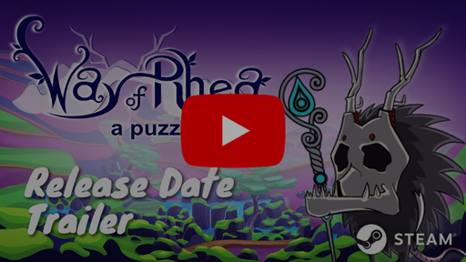
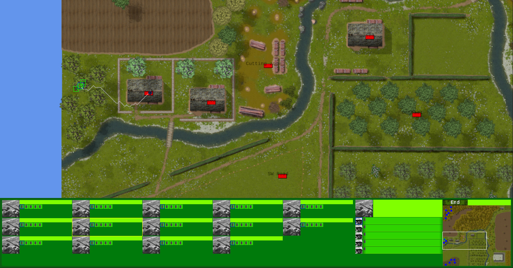
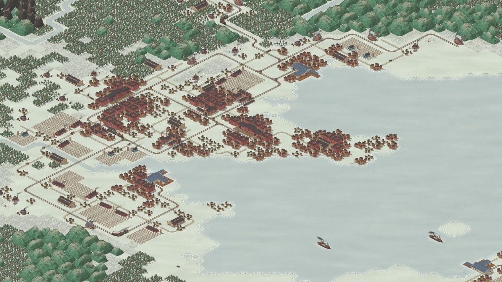
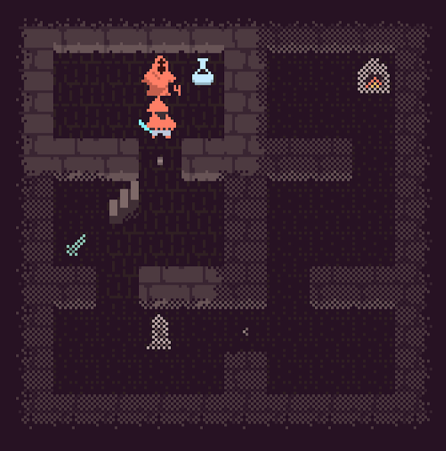
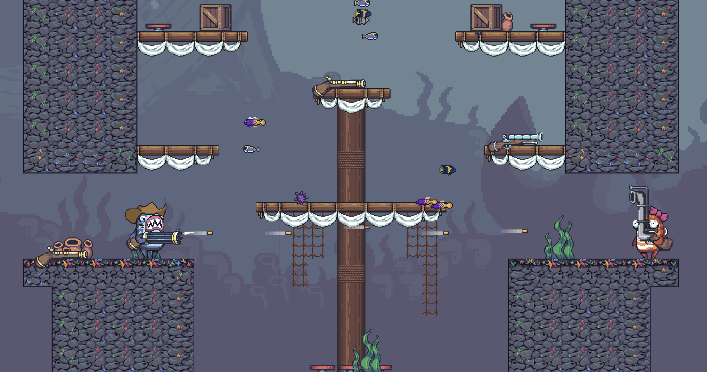

+++
title = "This Month in Rust GameDev #50 - April 2024"
transparent = true
date = 2024-05-03
draft = false
+++

<!-- no toc -->

<!-- Check the post with markdownlint-->

Welcome to the 50th issue of the Rust GameDev Workgroup's
monthly newsletter.
[Rust] is a systems language pursuing the trifecta:
safety, concurrency, and speed.
These goals are well-aligned with game development.
We hope to build an inviting ecosystem for anyone wishing
to use Rust in their development process!
Want to get involved? [Join the Rust GameDev working group!][join]

You can follow the newsletter creation process
by watching [the coordination issues][coordination].
Want something mentioned in the next newsletter?
[Send us a pull request][pr].
Feel free to send PRs about your own projects!

[Rust]: https://rust-lang.org
[join]: https://github.com/rust-gamedev/wg#join-the-fun
[pr]: https://github.com/rust-gamedev/rust-gamedev.github.io
[coordination]: https://github.com/rust-gamedev/rust-gamedev.github.io/issues?q=label%3Acoordination

- [Announcements](#announcements)
- [Game Updates](#game-updates)
- [Engine Updates](#engine-updates)
- [Learning Material Updates](#learning-material-updates)
- [Library Updates](#library-updates)
- [Other News](#other-news)
- [Discussions](#discussions)

## Announcements 

*Please fill out [this survey][survey] before skipping this section! More info below!*

Hey everyone, it's been a while! As you've certainly noticed, the newsletter has
been on hiatus for a while. The reason was mostly maintainer burnout, which is also
why the newsletter of August 2023 was not published [until a few days
ago][august-news].

We're back now though! A couple of community members, Jan Hohenheim
([@janhohenheim]) and Thierry Berger ([@Vrixyz]), have led the revival of the
newsletter. This includes making changes requested by the community, and
improving sustainability for the long term.

You can read more about the changes being made in [this blog
post][newsletter-changes-blog].

### Community Survey

This restructuring is also a good time to improve the content of the newsletter.
We've got some community feedback on the [Rust GameDev Discord][Discord] already
and would like to hear more from you. It would be great if you could fill out
[this survey][survey] to let us know how we can improve the newsletter going
forward. The survey closes on the **28th of May**. We will be evaluating the
[survey] results in an upcoming blog post, so stay tuned for that.

That's all for now. Have fun reading!

[august-news]: https://gamedev.rs/news/049/
[newsletter-changes-blog]: https://gamedev.rs/blog/newsletter-changes/
[@janhohenheim]: https://github.com/janhohenheim
[@Vrixyz]: https://github.com/Vrixyz
[survey]: https://forms.gle/oeSb46twWsxRKYJe7
[Discord]: https://discord.gg/game-development-in-rust-676678179678715904

## Game Updates

### [Way of Rhea][wor]

[][wor-trailer]

[Way of Rhea][wor] just got a release date: it will be coming to Steam on
**May 20th, 2024**!

Way of Rhea ([Steam](https://store.steampowered.com/app/1110620/Way_of_Rhea/)) is a color-based puzzle game with difficult puzzles, but forgiving
mechanics being developed by [@masonremaley] in a custom Rust engine.

You can support development by [wishlisting Way of Rhea on Steam][wor], or
[signing up for the mailing list][wor-mail].

Recently, a [closed beta][wor-closed-beta] began. All characters now have voices, and various [speedrunning features][wor-speedrun] were added. 
Older CPUs are [now supported][wor-avx]. 
Secrets were made harder, and an [in-game achievement UI][wor-achievements] was created.

For the full changelog, see the [release notes][wor-release-notes].

[@masonremaley]: https://twitter.com/masonremaley
[wor]: https://store.steampowered.com/app/1110620/Way_of_Rhea/?utm_campaign=tmirgd&utm_source=n50
[wor-trailer]: https://youtu.be/vFsO436r2Pw
[wor-closed-beta]: https://store.steampowered.com/news/app/1110620/view/7665759271877780609
[wor-speedrun]: https://clan.cloudflare.steamstatic.com/images//35599024/6ee82d4e0105f073082c83626e37933e682b5936.png
[wor-mail]: https://anthropicstudios.com/newsletter/signup/tech
[wor-release-notes]: https://store.steampowered.com/news/app/1110620
[wor-avx]: https://store.steampowered.com/news/app/1110620/view/4118050466869150657
[wor-achievements]: https://clan.cloudflare.steamstatic.com/images//35599024/573f81c1ebce54d9efedcd693fcbe684a5629c7f.png

### [SM64JSARCHIVE][sm64jsarchive]

[SM64JSARCHIVE][sm64jsarchive] is an actively maintained fork of [sm64js]: a decompilation project of Super Mario 64 to JavaScript.
The code is open-sourced on [GitHub][sm64jsarchive-github].

The [backend server][sm64jsarchive-server], which is written in Rust,
has finally been able to start after 10 long months
and is now live at <https://mmo.sm64jsarchive.com>

A successful stress test for the MMO feature was run on April 10th.

[sm64jsarchive]: https://mmo.sm64jsarchive.com
[sm64jsarchive-github]: https://github.com/uuphoria2/sm64jsarchive
[sm64js]: https://github.com/sm64js/sm64js
[sm64jsarchive-server]: https://github.com/sm64jsarchived/sm64jsarchive-mmo-server

### [Open Combat][OpenCombat_website]

_Official demo available soon_

Open Combat ([GitHub][OpenCombat_github], [Discord][OpenCombat_discord]) is a real-time tactical game
which takes place during World War II.

The basic game logic and HUD are now complete, 
and the high-definition map for the demo is finished.

Some things are missing, like high-definition assets for soldiers or minimal AI for opponents.
But the [demo is playable][OpenCombat_release] and the team would love to hear your feedback!

[OpenCombat_website]: https://opencombat.bux.fr/
[OpenCombat_github]: https://github.com/buxx/OpenCombat
[OpenCombat_discord]: https://discord.gg/6P2vtFh2Px
[OpenCombat_release]: https://github.com/buxx/OpenCombat/releases

### [Times of Progress][times-of-progress-steam]

Times of Progress ([Steam][times-of-progress-steam], [Twitter/X][times-of-progress-twitter], [Mastodon][times-of-progress-mastodon]) 
is an upcoming city builder game set during the industrial revolution.

In April, they added lots of UI widgets and improved performance by refactoring the orders system.

The demo is not available yet but interested players can sign up for the upcoming closed beta by joining the [newsletter][times-of-progress-newsletter].

[times-of-progress-steam]: https://store.steampowered.com/app/2628450/Times_of_Progress/
[times-of-progress-newsletter]: https://subscribepage.io/pressingthumbs
[times-of-progress-twitter]: https://twitter.com/ElmoSampedro
[times-of-progress-mastodon]: https://mastodon.online/@elmowilk

### Monk Tower

Monk Tower ([itch.io][monk-tower-itch], [Google Play][monk-tower-play], [Github][monk-tower-github])
is a tiny coffee-break roguelike game, intended for short runs (ca. 15mins).

The gameplay is quite distilled and revolves mostly around resource management.
The player has limited inventory capacity and the weapons get damaged
after each use. There are 20 randomly generated levels to beat.

It is available on desktop (Windows / Linux), Android, and Web (mobile friendly).
The game's source code also comes with a custom WGPU-based 2D framework.

_Discussions: ([/r/roguelikes][monk-tower-reddit])_

[monk-tower-itch]: https://maciekglowka.itch.io/monk-tower
[monk-tower-play]: https://play.google.com/store/apps/details?id=com.maciejglowka.monk_tower
[monk-tower-github]: https://github.com/maciekglowka/tower-rl
[monk-tower-reddit]: https://www.reddit.com/r/roguelikes/comments/1butvew/monk_tower_a_coffeebreak_roguelike_google_play/

### You are Merlin

You are Merlin ([Web Game][you-are-merlin-web], [GitHub - Rust/CLI][you-are-merlin-github], [GitHub - WASM][you-are-merlin-www-github]) by [@hseager](https://github.com/hseager)
is a text adventure game that compiles to both CLI and WebAssembly.

This initial version features a main quest, side quests, items, and a boss fight.
Players can choose their favourite visual theme such as Zelda, Warcraft, and Fallout. The web version also supports mobile devices.

Although fairly simple, this first version provides a good foundation for building more features in later updates.

_Discussions: ([/r/rust_gamedev][you-are-merlin-reddit-post])_

[you-are-merlin-web]: https://hseager.github.io/you-are-merlin-www/
[you-are-merlin-github]: https://github.com/hseager/you-are-merlin
[you-are-merlin-www-github]: https://github.com/hseager/you-are-merlin-www
[you-are-merlin-reddit-post]: https://www.reddit.com/r/rust_gamedev/comments/1c9k1kb/you_are_merlin_a_text_adventure_game/

### [Jumpy]

_Jumpy: Machine gun and Periscope_

[Jumpy] ([GitHub][Jumpy], [Discord][jumpy_discord], [Twitter][jumpy_twitter]) by
[Spicy Lobster][spicy_lobster] is a pixel-style, tactical 2D shooter with a fishy
theme.

This month the base functionalities of round scoring and map transitions have been implemented.
New weapons such as the Blunderbuss, Periscope, and Machine Gun are ready for fish-on-fish combat.

Jumpy is now featuring corpse physics and a "ragdoll" button to send your Fish [flopping about][jumpy_ragdoll].

On the treasure map for the near future is improving UX and new player experience,
polish and improvements on match scoring / round transitions, and more awesome weapons.

_Discussions: [GitHub][jumpy_discussions], [Twitter][jumpy_twitter]_

[Jumpy]: https://github.com/fishfolks/jumpy
[jumpy_ragdoll]: https://github.com/fishfolk/jumpy/pull/932
[jumpy_discussions]: https://github.com/fishfolks/jumpy/discussions
[jumpy_twitter]: https://twitter.com/spicylobsterfam
[jumpy_discord]: https://discord.gg/4smxjcheE5
[spicy_lobster]: https://spicylobster.itch.io/

## Engine Updates

### Bottomless-Pit 0.3

Bottomless-Pit is a 2d game engine written with WGPU that has been around for a year, which can be found on [crates.io][Bottomless-Pit_cratesio] and [GitHub][Bottomless-Pit_github].
Very recently a 2d camera was added as well as WASM and web support.
Current development is being focused on stability and QoL changes like texture sampling options and improved input.
You can check out several [engine examples on the web][Bottomless-Pit_Website].
Since the engine is in its infancy, its developer calls for developers to use it and give the engine some feedback.

Current features are:

- Custom Shader Support
- Basic rendering
- Text rendering
- Input and window event handling

[Bottomless-Pit_Website]: https://eggshark.dev/bp-examples
[Bottomless-Pit_cratesio]: https://crates.io/crates/bottomless-pit
[Bottomless-Pit_github]: https://github.com/EggShark/bottomless-pit

## Learning Material Updates

### Building games for Android with Rust

[@maciekglowka] has recently shared some thoughts [on their blog][android-games-blog] about building Rust games
for Android. Rather than a step-by-step guide, it is a collection
of issues one can possibly encounter when targeting Android.

Topics mentioned:

- 'Window' creation (via winit)
- Android app's lifecycle vs. the WGPU surface creation
- User data storage
- System UI hiding via jni and Android API
- Building AAB files to meet Google Play requirements

[android-games-blog]: https://maciejglowka.com/blog/building-games-for-android-with-rust/
[@maciekglowka]: https://github.com/maciekglowka

### Bevy: A case study in ergonomic Rust

[Chris Biscardi][chris-yt] was at RustNation UK recently and gave talk on Bevy's 
Rusty ergonomics titled [Bevy: A case study in ergonomic Rust][case-study-video]. 
In their own words:

> There are at least two, if not three, talks worth of material around how Bevy
> progressively discloses complexity across multiple "stacks" of APIs; and the
> work done so far is very impressive in terms of how it all fits together,
> especially as a large-and-growing OSS project.

[chris-yt]: https://www.youtube.com/c/chrisbiscardi
[case-study-video]: https://www.youtube.com/watch?v=CnoDOc6ML0Y

### Reactivity in Bevy: From the Bottom Up

[Talin][talin] wrote a three-part series on ["Reactivity in Bevy: From the Bottom Up"][reactivity-blog], 
which describes the workings of `bevy_reactor`, an experimental, work-in-progress framework for doing reactive programming within Bevy.

[reactivity-blog]: https://machinewords.hashnode.dev/reactivity-in-bevy-from-the-bottom-up-part-1
[talin]: https://dreamertalin.medium.com/

## Library Updates

### Jolt Bindings

[Lucian Greathouse][lucien] has published their [Jolt][jolt] bindings for Rust. Jolt is a C++ physics engine you might know from its use in Horizon: Forbidden West.
Lucian has previously worked on [JoltC][joltc], a C API for Jolt, which this project uses in the background.

The bindings work can be found on the [just-rust GitHub repo][jolt-rust] GitHub repository and come in two flavors:
- `joltc-sys`: Unsafe bindings to the C API 
- `rolt`: Ergonomic and safe Rust API

[lucien]: https://lpg.space/
[jolt]: https://github.com/jrouwe/JoltPhysics
[jolt-rust]: https://github.com/SecondHalfGames/jolt-rust
[joltc]: https://github.com/SecondHalfGames/JoltC

### Hexx 0.17

Hexx, the popular crate for hexagonal tools, [has released version 0.17](https://github.com/ManevilleF/hexx/releases/tag/0.17.0). 
This release has a strong focus on performance:
- Large performance improvement on various computations like rings and wedges
- Add support for optimized storage for hexagonal and rhombus-shaped maps
- Added support for rectiline path

And utility:
- Added a 13th example showcasing all natively supported shapes
- Removed confusing items

### [Lightyear 0.13][lightyear_website]

[lightyear_website] is a comprehensive networking library for bevy to make multiplayer games.
It comes with multiple types of transports (WebTransport, WebSocket, UDP, etc.) 
and supports replication techniques like client-side prediction, server interpolation, interest management, and more!
Check out the [examples][lightyear_examples]!

The latest release, [0.13][lightyear_release], brings two big new features:
- **Steam support**: you can now use the Steamworks SDK as your transport layer, which lets you use the Valve network!
Note that lightyear supports running multiple transports in parallel, so it's possible to have cross-play between Steam and non-Steam users.
- **Listen-server mode**: it is now possible to run a server and a client in the same process/bevy app.
This can be useful to avoid the costs of a dedicated server, or to have a similar codebase between singleplayer and multiplayer.

[Example (with 300ms of latency)](https://github.com/cBournhonesque/lightyear/assets/8112632/ee547c32-1f14-4bdc-9e6d-67f900af84d0)

[lightyear_website]: https://github.com/cBournhonesque/lightyear
[lightyear_release]: https://github.com/cBournhonesque/lightyear/releases/tag/0.13.0
[lightyear_examples]: https://github.com/cBournhonesque/lightyear/tree/main/examples

## Other News

- Alice I. Cecile of the Bevy Foundation would like to collect community feedback
on game development in Rust. Please fill out [her survey](https://forms.gle/kLzv5Ww3U8dLGUHU8)!

## Discussions

LogLog games has published a [very well-written blog post](https://loglog.games/blog/leaving-rust-gamedev/) about their reasons to leave Rust gamedev.
It talks about shortcomings in Rust as a language in general and as a game development tool in particular. 
Some insights into the limitations of ECS are also provided. Some interesting community discussions have been sparked by this post:

- [Hacker News](https://news.ycombinator.com/item?id=40172033)
- [/r/gamedev](https://www.reddit.com/r/gamedev/comments/1ceipzc/leaving_rust_gamedev_after_3_years_blog_post_by/)
- [/r/rust](https://www.reddit.com/r/rust/comments/1cdqdsi/lessons_learned_after_3_years_of_fulltime_rust/)

------

That's all news for today, thanks for reading!

Want something mentioned in the next newsletter?
[Send us a pull request][pr].

Also, subscribe to [@rust_gamedev on Twitter][@rust_gamedev]
or [/r/rust_gamedev subreddit][/r/rust_gamedev] if you want to receive fresh news!

<!--
TODO: Add real links and un-comment once this post is published
**Discuss this post on**:
[/r/rust_gamedev](TODO),
[Mastodon](TODO),
[Twitter](TODO),
[Discord](https://discord.gg/yNtPTb2).
-->

[/r/rust_gamedev]: https://reddit.com/r/rust_gamedev
[@rust_gamedev]: https://twitter.com/rust_gamedev
