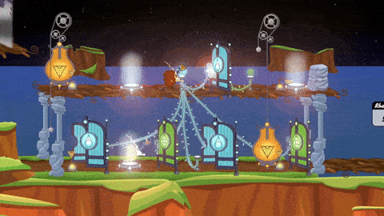
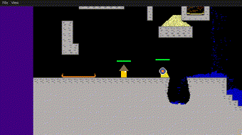
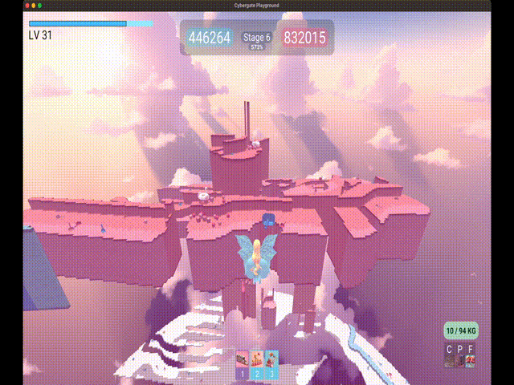
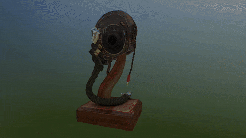
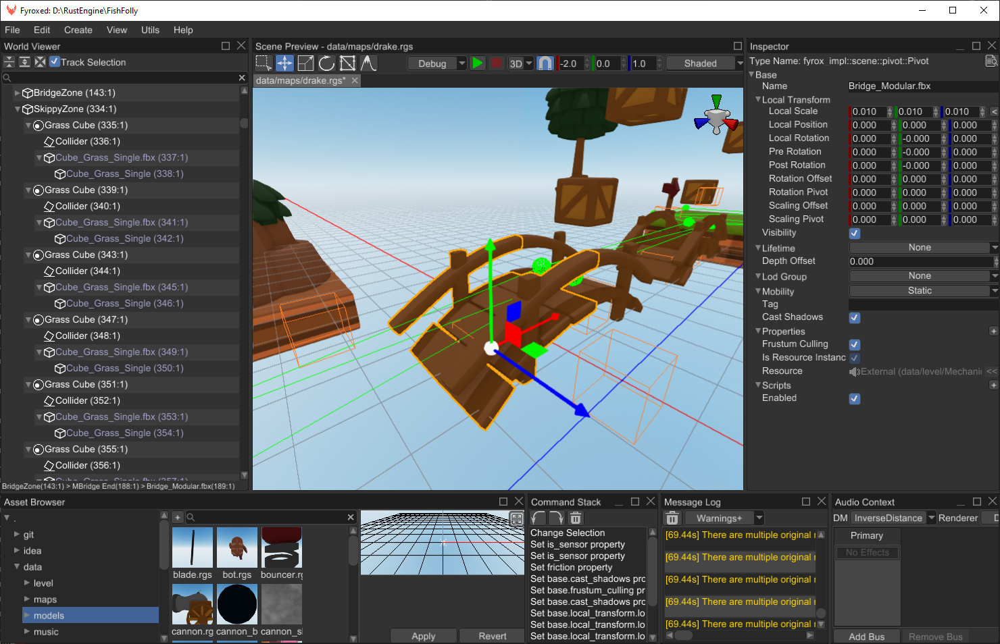
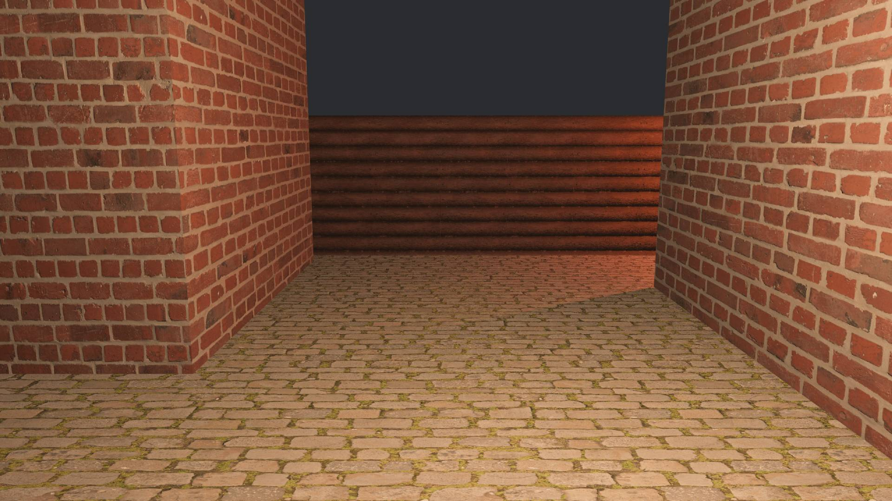
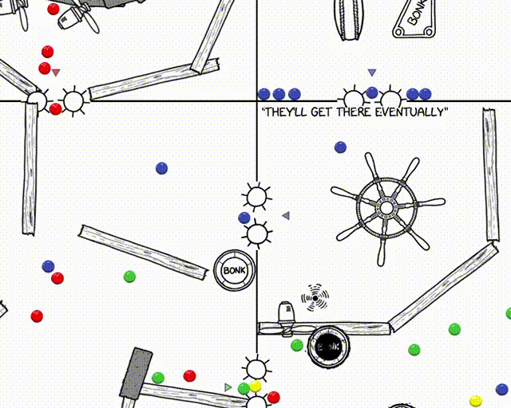
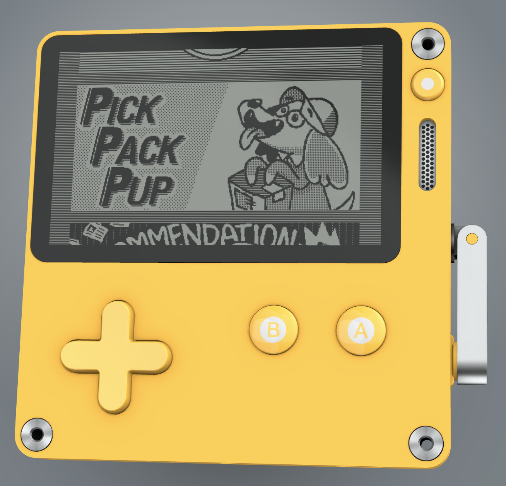

+++
title = "This Month in Rust GameDev #51 - May 2024"
transparent = true
date = 2024-06-03
draft = false
+++

<!-- no toc -->

<!-- Check the post with markdownlint-->

Welcome to the 51st issue of the Rust GameDev Workgroup's
monthly newsletter.
[Rust] is a systems language pursuing the trifecta:
safety, concurrency, and speed.
These goals are well-aligned with game development.
We hope to build an inviting ecosystem for anyone wishing
to use Rust in their development process!
Want to get involved? [Join the Rust GameDev working group!][join]

You can follow the newsletter creation process
by watching [the coordination issues][coordination].
Want something mentioned in the next newsletter?
[Send us a pull request][pr].
Feel free to send PRs about your own projects!

[Rust]: https://rust-lang.org
[join]: https://github.com/rust-gamedev/wg#join-the-fun
[pr]: https://github.com/rust-gamedev/rust-gamedev.github.io
[coordination]: https://github.com/rust-gamedev/rust-gamedev.github.io/issues?q=label%3Acoordination

- [Announcements](#announcements)
- [Game Updates](#game-updates)
- [Engine Updates](#engine-updates)
- [Learning Material Updates](#learning-material-updates)
- [Tooling Updates](#tooling-updates)
- [Other News](#other-news)
- [Misc. Links](#misc-links)

<!--
Ideal section structure is:

```
### [Title]


_image caption_

A paragraph or two with a summary and [useful links].

_Discussions:
[/r/rust](https://reddit.com/r/rust/todo),
[twitter](https://twitter.com/todo/status/123456)_

[Title]: https://first.link
[useful links]: https://other.link
```

If needed, a section can be split into subsections with a "------" delimiter.
-->

## Announcements

### Survey Results

Last month, we asked you to fill out a survey to help us improve the rebooted newsletter. Thanks to 52 of you, we've got [some data][survey-data] now! 
We analyzed the results in [this blog post][survey_results]. The biggest takeaways are:
- People are generally excited about the newsletter
- The current frequency of the newsletter is good
- Readers do not want anything in the newsletter generated by AI
- Contributing to the newsletter could be easier. If you've got ideas on how to make this happen, please [let us know](https://github.com/rust-gamedev/rust-gamedev.github.io/issues/1519)!

You can visit the [blog post][survey_results] to see the full results and some nice plots. 
We will discuss how to act on this feedback next month and keep you updated on the changes we make. 

Thanks to everyone who participated!

[survey-data]: https://github.com/janhohenheim/rust-gamedev-statistics/tree/main/jan-hohenheim-2024
[survey_results]: <https://gamedev.rs/blog/survey-2>

### Email Subscription

Last month, we announced that we would add an email subscription option to the newsletter. 
Unfortunately, we did not manage to implement this in time for this issue.
He will [work on this feature](https://github.com/rust-gamedev/rust-gamedev.github.io/issues/24) for the next month, and we hope to have it ready for you then.

## Game Updates

### [Way of Rhea][wor]

[][wor]
*Way of Rhea: a puzzle game. Available on Steam.*

[Way of Rhea][wor] released on May 20th as part of the
[Cerebral Puzzle Showcase][wor-cps]!

[][wor]

Way of Rhea is a color-based puzzle game with difficult puzzles, but
forgiving mechanics developed by [Mason Remaley] in a custom Rust engine.

You can support development by [purchasing Way of Rhea on Steam][wor], or
[signing up for the mailing list][wor-mail] to hear about future games.

[Mason Remaley]: https://masonremaley.com/
[wor]: https://store.steampowered.com/app/1110620/Way_of_Rhea/?utm_campaign=tmirgd&utm_source=n51
[wor-mail]: https://anthropicstudios.com/newsletter/signup/tech
[wor-cps]: https://www.cerebralpuzzleshowcase.com/

### [Untitled Pixel Wizard Game][pixel-wizards]

[][pixel-wizards]  
_A deadly foe meets its end._

[Untitled Pixel Wizard Game][pixel-wizards] is a local-multiplayer [Noita]-like platformer about
killing baddies using spells powered by pixel physics.

Over the last few months, the falling sand simulation learned to play (somewhat) nicely with Rapier
rigid bodies; see [Bridging Physics Worlds][pixel-wizards-bridging-physics-worlds] and subsequent updates.

This month:

- [Tilemapping via LDTK][pixel-wizards-tilemapping]: levels got just a tiny bit prettier.
- [Level Progression][pixel-wizards-levels]: players learn to die, and levels link together.
- [Target Practice][pixel-wizards-targets]: the first "enemy" was added to the game.

[pixel-wizards]: https://slowrush.dev
[Noita]: https://store.steampowered.com/app/881100/Noita/
[pixel-wizards-bridging-physics-worlds]: https://www.slowrush.dev/news/bridging-physics-worlds/
[pixel-wizards-targets]: https://www.slowrush.dev/news/target-practice/
[pixel-wizards-arch]: https://www.slowrush.dev/news/architectural-questions/
[pixel-wizards-levels]: https://www.slowrush.dev/news/level-progression/
[pixel-wizards-tilemapping]: https://www.slowrush.dev/news/tilemapping/
[Leaving Rust game dev after 3 years]: https://loglog.games/blog/leaving-rust-gamedev/

### [mirr/orb]

  
_A typical level and its UI_

[mirr/orb] by [syn9]
is a puzzle game about bouncing lasers off mirrors to activate orbs.

The game was created in 9 days using syn9's Rust mini game framework [mgfw] and released on May 27th.

This release contains 110 levels which pull from 870 available puzzle layouts.

[mirr/orb]: https://syn9dev.itch.io/mirrorb
[syn9]: https://twitter.com/Syn9Dev
[mgfw]: https://github.com/Syn-Nine/mgfw

### [CyberGate Playground][cybergate-shorts]

  
_Shooting a Hammer against a Floating Wall and Destroying part of it_

CyberGate Playground is a multiplayer browser game where players claim territory
by painting the environment in their color, with the goal of overpowering opponents.

The past few months' updates include:
- Flying with butterfly-like mechanics
- [Fusion Upgrade:][cybergate-fuse] Combine hammers, balls, and dice to multiply their powers
- Hammer destruction made more challenging and interesting, with upgrades enabling deeper wall penetration
- Improved strength and weight system, and calculate their impact on character movement and abilities
- Added an 'Owned Upgrades' menu using `yakui` crate, giving a neat overview of all acquired upgrades
- Many other UI / gameplay improvements based on player feedback

Rust's ownership and strongly typed features played a crucial role in allowing the gameplay code to scale 
to more complex and detailed mechanics while retaining correct, clean, and bug-free code.

CyberGate Playground is a passion project.
If you're interested in the game's progress, join the [Discord server][cybergate-discord]

[cybergate-shorts]: https://youtube.com/@cyber-gate/shorts
[cybergate-discord]: https://discord.gg/P3D8weeQ7Z
[cybergate-fuse]: https://www.youtube.com/shorts/ewnZ6VVSYMM

## Engine Updates

### [Macroquad Newsletter]

  
_"Basic" 3d rendering (gltf helmet)_

[@Fedor](https://github.com/not-fl3/), creator of [*Quad], a game engine written in Rust, is starting a [This week in Quads](https://macroquad.rs/twiq) newsletter.

This month overall polish, developer experience, performance optimization, and basic 3d visualization have been worked on.

[*Quad]: https://www.patreon.com/posts/on-buses-and-101117631

### [Fyrox 0.34][fyrox-release]

  
_The improved Fyrox editor UI_

[Fyrox] got a huge update this month. For those who don't know, Fyrox is a game engine written in Rust that is especially notable for sporting a Unity-like editor.

[This release][fyrox-release] includes code hot reloading, project exporter, assets preview generation, UI prefabs, GLTF support, static and dynamic batching, 
keyboard navigation, animation support for UI, editor style and usability improvements, and many more.

[Fyrox]: https://fyrox.rs
[fyrox-release]: https://fyrox.rs/blog/post/fyrox-game-engine-0-34/

### Bevy 0.14 WIP

  
_One of the upcoming features in Bevy 0.14 is easier texture repetition for GLTF objects_

The 0.14 release of [Bevy] nears completion, but the team is still working on detailed
release notes and the migration guide. If you want to help, you can grab one of the [open documentation issues][bevy-docs-issues].

[Bevy]: https://bevyengine.org/
[bevy-docs-issues]: https://github.com/bevyengine/bevy-website/issues?q=is%3Aissue+is%3Aopen+sort%3Aupdated-desc+label%3AA-Release-Notes

## Learning Material Updates

### Xkcd Machine

  
_A small part of the XKCD Machine_

Chromakode released a detailed [blog post][xkcd_machine_blogpost] about their implementation of [xkcd "Machine"][xcd_machine_playable].

Machine is written in React/Typescript, and uses [Rapier][xkcd_rapier]: a physics engine written in Rust.

[xkcd_machine_blogpost]: https://chromakode.com/post/xkcd-machine/
[xcd_machine_playable]: https://xkcd.com/2916/
[xkcd_rapier]: https://rapier.rs/

## Tooling Updates

### [Rusty Playdate]

  
_The Playdate console_

[Rusty Playdate] ([GitHub][Rusty Playdate], [Mastodon][Rusty Playdate Masto]) by [@boozook](https://github.com/boozook)
is the large set of crates with bindings, cargo-plugin, and toolset for the full cycle of creating games for the [Playdate handheld console][playdate].
This is a fairly new console reminiscent of a GameBoy with a crank handle geared towards indie games.

The current release sports the following notable improvements:
- Partial Lua scripting support
- Support for devices connected to macOS via USB hub
- Stabilize packaging on Windows enough to add automatic tests
- Stabilization for various parts of the API

_Discussions: [GitHub][Rusty Playdate Gh-disc], [Matrix][Rusty Playdate Matrix]._

[Rusty Playdate]: https://github.com/boozook/playdate
[Rusty Playdate Gh-disc]: https://github.com/boozook/playdate/discussions
[Rusty Playdate Masto]: https://gamedev.social/@playdaters
[Rusty Playdate Matrix]: https://matrix.to/#/#playdate.rs:matrix.org
[playdate]: https://play.date/

## Other News

<!-- One-liners for plan items that haven't got their own sections. -->

### Bevy rustunit meetup #3

  
_Bevy meetup YouTube extract, showing its 3 participants._

[Rustunit][rustunit] has hosted its 3rd unofficial online [Bevy Engine][bevy] meetup on April 19th with the following topics:
- Intro / Code of Conduct
- Julian - Animating 3D Characters with Bevy
- Niklas - Learnings from a Bevy game template

Check out [the recording][rustunit_bevy_meetup_3_youtube]
and join [the meetup group][rustunit_bevy_meetup_event] to get notified of future events.

[rustunit_bevy_meetup_3_youtube]: https://www.youtube.com/watch?v=Fyr1ud1OIpU

### Bevy rustunit meetup #4

  
_Bevy meetup YouTube extract, showing its 4 participants._

[Rustunit][rustunit] has hosted its 4th unofficial online [Bevy Engine][bevy] meetup on May 24th with the following topics:
- Francois - Catching Rendering Regressions on all Platforms
- Lorenz - Hooking into the Bevy Rendering Pipeline
- Jos - Recreating Townscaper using Rust & Bevy

Check out [the recording][rustunit_bevy_meetup_4_youtube]
and join [the meetup group][rustunit_bevy_meetup_event] to get notified of future events.

[rustunit_bevy_meetup_4_youtube]: https://www.youtube.com/watch?v=rnE_nINEs2M
[rustunit]: https://rustunit.com/
[rustunit_bevy_meetup_event]: https://www.meetup.com/bevy-game-development/


### RustNL

[RustNL][rustnl_main_website] happened May 7. & 8. in Delft, Netherlands.

While the conference was not specific to game development,
organizers contacted rust game development communities
to showcase games developed in Rust between talks,
which you can [watch on YouTube][rustnl_games_youtube].

Special mention to the following talks, relevant to game development:
- [Let's Build High-Performance Rust UI][rustnl_kevin_boos_talk] by Kevin Boos  
- [A Research Project on Rust User Interface Architecture][rustnl_xilem_talk] by Ralph Levien about [Xilem][rustnl_xilem_intro]  
- [(Th)Rust for Space: Initial momentum][rustnl_michael_melchiore_talk] by Michaël Melchiore, who gave a shout-out to [Bevy Engine][rustnl_bevy_engine].

[rustnl_main_website]: https://2024.rustnl.org/
[rustnl_games_youtube]: https://www.youtube.com/watch?v=XLefuzE-ABU&t=7583s
[rustnl_xilem_talk]: https://www.youtube.com/watch?v=521NfGf7AR0&t=19308s
[rustnl_xilem_intro]: https://raphlinus.github.io/rust/gui/2022/05/07/ui-architecture.html
[rustnl_kevin_boos_talk]: https://www.youtube.com/watch?v=521NfGf7AR0&t=2928s
[rustnl_michael_melchiore_talk]: https://www.youtube.com/watch?v=XLefuzE-ABU&t=3898s
[rustnl_bevy_engine]:https://bevyengine.org/

## Misc. Links

### New libraries

- [egui_ratatui](https://github.com/gold-silver-copper/egui_ratatui): A ratatui backend that is also an egui widget. 
Deploy on the web with WASM or ship natively with Bevy, macroquad, or eframe 
- [bevy_ratatui_render](https://github.com/cxreiff/bevy_ratatui_render): A Bevy plugin for rendering your game to the terminal using ratatui
- [bevy_light_2d](https://github.com/jgayfer/bevy_light_2d):  General purpose 2D lighting for the Bevy game engine. 

### Library Updates

- [Kira 0.9](https://github.com/tesselode/kira/releases/tag/v0.9.0): Library for expressive game audio
- [Quinn 0.11.2](https://github.com/quinn-rs/quinn/releases/tag/0.11.2): Async-friendly QUIC implementation in Rust 
- [rolt and jolt-sys 0.3.1](https://github.com/SecondHalfGames/jolt-rust/blob/main/CHANGELOG.md#v030):  Rust bindings to Jolt Physics 
- [Hanabi 0.11](https://github.com/djeedai/bevy_hanabi/blob/v0.11.0/CHANGELOG.md): A GPU particle system plugin for the Bevy game engine.

### Blog Posts

- [Architectural Ruminations][pixel-wizards-arch]: reflections on using Rust for game development,
 prompted by LogLog Games's _[Leaving Rust game dev after 3 years]_.

### Videos

- [The Secret Behind Photorealistic And Stylized Graphics](https://www.youtube.com/watch?v=KkOkx0FiHDA): 
Explaining the rendering techniques behind photorealistic and stylized graphics
- [GDC: Tunes of the Kingdom](https://www.youtube.com/watch?v=N-dPDsLTrTE): Evolving physics and sounds for ‘The Legend of Zelda: Tears of the Kingdom’ 

------

That's all news for today, thanks for reading!

Want something mentioned in the next newsletter?
[Send us a pull request][pr].

Also, subscribe to our socials if you want to receive fresh news!
- X/Twitter: [@rust_gamedev][@x_rust_gamedev]
- Mastodon: [@rust_gamedev][@mastodon_rust_gamedev]
- Reddit: [/r/rust_gamedev][/r/rust_gamedev]

<!--
TODO: Add real links and un-comment once this post is published
**Discuss this post on**:
[/r/rust_gamedev](TODO),
[Mastodon](TODO),
[Twitter](TODO),
[Discord](https://discord.gg/yNtPTb2).
-->

[/r/rust_gamedev]: https://reddit.com/r/rust_gamedev
[@x_rust_gamedev]: https://twitter.com/rust_gamedev
[@mastodon_rust_gamedev]: https://mastodon.gamedev.place/@rust_gamedev
