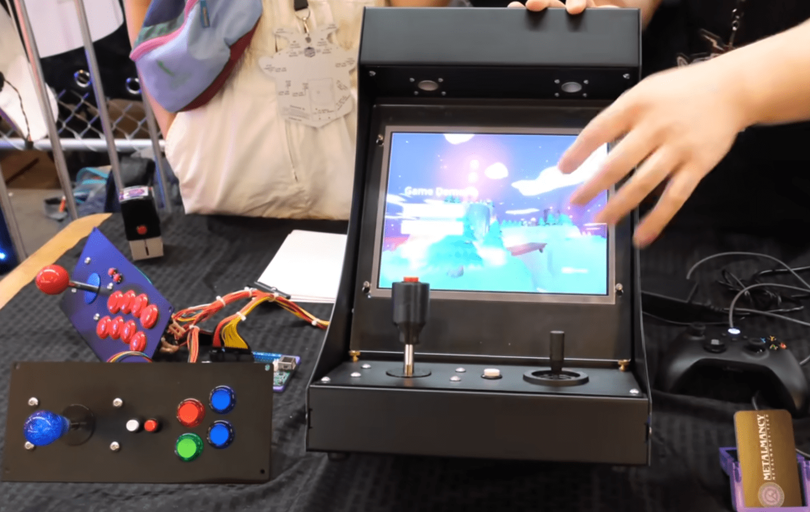

+++
title = "This Month in Rust GameDev #52 - June 2024"
transparent = true
date = 2024-07-03
draft = true
+++

<!-- no toc -->

<!-- Check the post with markdownlint-->

Welcome to the 52th issue of the Rust GameDev Workgroup's
monthly newsletter.
[Rust] is a systems language pursuing the trifecta:
safety, concurrency, and speed.
These goals are well-aligned with game development.
We hope to build an inviting ecosystem for anyone wishing
to use Rust in their development process!
Want to get involved? [Join the Rust GameDev working group!][join]

You can follow the newsletter creation process
by watching [the coordination issues][coordination].
Want something mentioned in the next newsletter?
[Send us a pull request][pr].
Feel free to send PRs about your own projects!

[Rust]: https://rust-lang.org
[join]: https://github.com/rust-gamedev/wg#join-the-fun
[pr]: https://github.com/rust-gamedev/rust-gamedev.github.io
[coordination]: https://github.com/rust-gamedev/rust-gamedev.github.io/issues?q=label%3Acoordination

- [Announcements](#announcements)
- [Game Updates](#game-updates)
- [Engine Updates](#engine-updates)
- [Learning Material Updates](#learning-material-updates)
- [Tooling Updates](#tooling-updates)
- [Library Updates](#library-updates)
- [Popular Workgroup Issues in GitHub](#popular-workgroup-issues-in-github)
- [Other News](#other-news)
  - [Metalmancy @ OpenSauce](#metalmancy--opensauce)
- [Meeting Minutes](#meeting-minutes)
- [Discussions](#discussions)
- [Requests for Contribution](#requests-for-contribution)
- [Jobs](#jobs)
- [Bonus](#bonus)
- [Future news](#future-news)

<!--
Ideal section structure is:

```
### [Title]


_image caption_

A paragraph or two with a summary and [useful links].

_Discussions:
[/r/rust](https://reddit.com/r/rust/todo),
[twitter](https://twitter.com/todo/status/123456)_

[Title]: https://first.link
[useful links]: https://other.link
```

If needed, a section can be split into subsections with a "------" delimiter.
-->

## Announcements

## Game Updates

## Engine Updates

## Learning Material Updates

## Tooling Updates

## Library Updates

## Popular Workgroup Issues in GitHub

<!-- Up to 10 links to interesting issues -->

## Other News

### [Metalmancy @ OpenSauce][metalmancy_interview]


_Arcade cabinet close up_

[Framework][framework_website] interviewed Carlo and Joanna on their games
and arcade machines at [OpenSauce][opensauce_website].

[Metalmancy][metalmancy_website]'s flagship game Thetawave is coded in Rust.

[metalmancy_interview]: https://www.youtube.com/watch?v=qUIAnZ0cvvo&t=291s
[metalmancy_website]: https://www.micronote.tech/
[framework_website]: https://frame.work
[opensauce_website]: https://opensauce.com/

<!-- One-liners for plan items that haven't got their own sections. -->

## Meeting Minutes

<!-- Up to 10 most important notes + a link to the full details -->

[See all meeting issues][label_meeting] including full text notes
or [join the next meeting][join].

[label_meeting]: https://github.com/rust-gamedev/wg/issues?q=label%3Ameeting

## Discussions

<!-- Links to handpicked reddit/twitter/urlo/etc threads that provide
useful information -->

## Requests for Contribution

<!-- Links to "good first issue"-labels or direct links to specific tasks -->

## Jobs

<!-- An optional section for new jobs related to Rust gamedev -->

## Bonus

<!-- Bonus section to make the newsletter more interesting
and highlight events from the past. -->

## Future news

<!-- Section to get more people involved in writing news. -->

Editing this newsletter wouldn't be possible without [your contributions][news_current_prs]. 
Thanks to everyone who helped us this month!

If you want something mentioned in the next newsletter, [send us a pull request][pr].

You can also get an early look at pending issues for the [next newsletter][news_future_prs].

[news_current_prs]: https://github.com/rust-gamedev/rust-gamedev.github.io/pulls?q=is%3Apr+in%3Atitle+%27N52%27
[news_future_prs]: https://github.com/rust-gamedev/rust-gamedev.github.io/pulls?q=is%3Apr+in%3Atitle+%27N53%27

------

That's all news for today, thanks for reading!

Also, subscribe to our socials if you want to receive fresh news!
- X/Twitter: [@rust_gamedev][@x_rust_gamedev]
- Mastodon: [@rust_gamedev][@mastodon_rust_gamedev]
- Reddit: [/r/rust_gamedev][/r/rust_gamedev]

<!--
TODO: Add real links and un-comment once this post is published
**Discuss this post on**:
[/r/rust_gamedev](TODO),
[Mastodon](TODO),
[Twitter](TODO),
[Discord](https://discord.gg/yNtPTb2).
-->

[/r/rust_gamedev]: https://reddit.com/r/rust_gamedev
[@x_rust_gamedev]: https://twitter.com/rust_gamedev
[@mastodon_rust_gamedev]: https://mastodon.gamedev.place/@rust_gamedev
