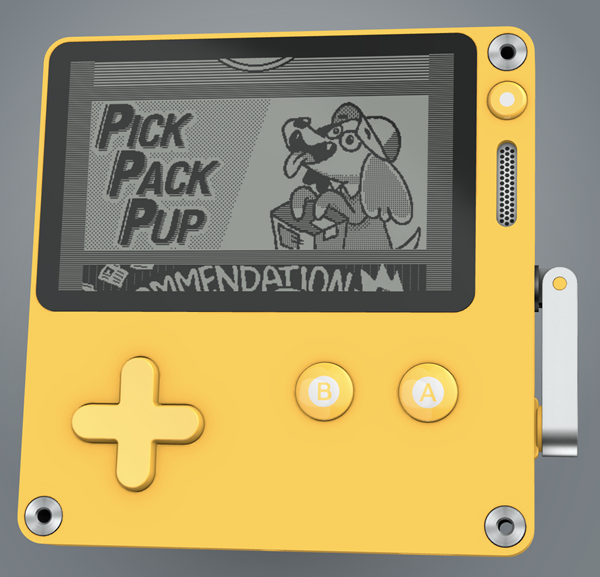
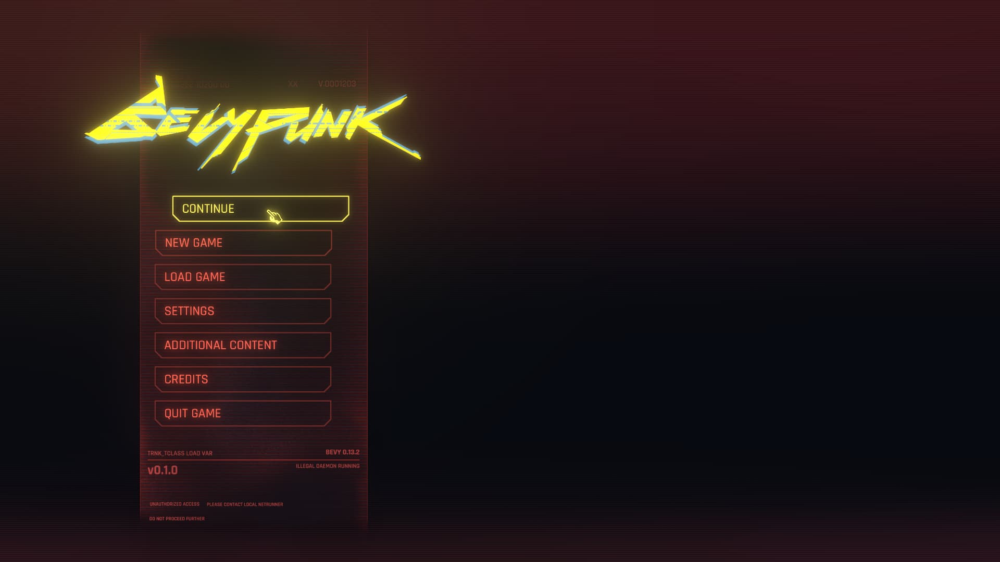
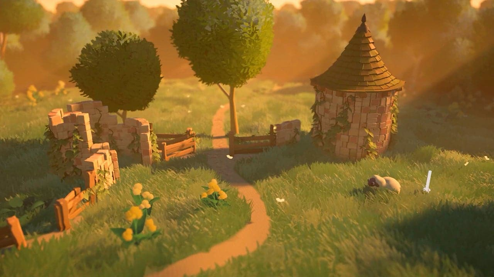

+++
title = "This Month in Rust GameDev #52 - June 2024"
transparent = true
date = 2024-07-03
draft = true
+++

<!-- no toc -->

<!-- Check the post with markdownlint-->

Welcome to the 52th issue of the Rust GameDev Workgroup's
monthly newsletter.
[Rust] is a systems language pursuing the trifecta:
safety, concurrency, and speed.
These goals are well-aligned with game development.
We hope to build an inviting ecosystem for anyone wishing
to use Rust in their development process!
Want to get involved? [Join the Rust GameDev working group!][join]

You can follow the newsletter creation process
by watching [the coordination issues][coordination].
Want something mentioned in the next newsletter?
[Send us a pull request][pr].
Feel free to send PRs about your own projects!

[Rust]: https://rust-lang.org
[join]: https://github.com/rust-gamedev/wg#join-the-fun
[pr]: https://github.com/rust-gamedev/rust-gamedev.github.io
[coordination]: https://github.com/rust-gamedev/rust-gamedev.github.io/issues?q=label%3Acoordination

- [Announcements](#announcements)
- [Game Updates](#game-updates)
- [Engine Updates](#engine-updates)
- [Learning Material Updates](#learning-material-updates)
- [Tooling Updates](#tooling-updates)
- [Library Updates](#library-updates)
- [Interviews](#interviews)
- [Blog Posts](#blog-posts)
- [Jobs](#jobs)
- [Misc. Links](#misc-links)
- [Future News](#future-news)

<!--
Ideal section structure is:

```
### [Title]


_image caption_

A paragraph or two with a summary and [useful links].

_Discussions:
[/r/rust](https://reddit.com/r/rust/todo),
[twitter](https://twitter.com/todo/status/123456)_

[Title]: https://first.link
[useful links]: https://other.link
```

If needed, a section can be split into subsections with a "------" delimiter.
-->

## Announcements

TODO: I'll be working on adding an email subscription this weekend, so I'll write about it here once that's done :) - Jan

## Game Updates

### [Untitled Pixel Wizards Game][pixel-wizards]

{{ embed_video(type="video/mp4", src="untitled-pixel-wizards-game.mp4",
caption="Enemies now perceive, pursue and attack.. and occasionally get burned to death.") }} 

[Untitled Pixel Wizards Game][pixel-wizards] is a local-multiplayer [Noita]-like platformer about
killing baddies using spells powered by pixel physics. This month was focused on juicing up said baddies:

- [Pew Pew Pew][pixel-wizards-update-1]: baddies learned to shoot at players.
- [Hot Pursuit][pixel-wizards-update-2]: baddies also learned to chase players! (They're real smart.)
- [Status Update][pixel-wizards-update-3]: physically-simulated pixels learn to burn & poison players & baddies.
- [Ragdolls][pixel-wizards-update-4]: corpses of dead baddies learn to tumble around all realistic-like.
- [Fiddling with Fire][pixel-wizards-update-5]: the fire mechanic figures out how to better burn baddies.

[pixel-wizards]: https://slowrush.dev
[Noita]: https://store.steampowered.com/app/881100/Noita/
[pixel-wizards-update-1]: https://www.slowrush.dev/news/pew-pew/
[pixel-wizards-update-2]: https://www.slowrush.dev/news/hot-pursuit/
[pixel-wizards-update-3]: https://www.slowrush.dev/news/status-update/
[pixel-wizards-update-4]: https://www.slowrush.dev/news/ragdolls/
[pixel-wizards-update-5]: https://www.slowrush.dev/news/fiddling-with-fire/

### [Gunbug][gunbug]

[][gunbug]  
_Gunbugs shooting at a bunch of eggplants_

Gunbug is a 2D online co-op horde survival shoot'em up game.

It focuses on shooting lots of enemies with lots of guns. It can be played
solo or with up to 10 players.

It is built with [Bevy] and uses [bevy_rapier] for ray casting,
[bevy_kira_audio] for audio, and [renet] for networking. 
The iOS and macOS versions are built with [xbuild].

You can wishlist the game on [Steam][gunbug]. Playtests start in the upcomingv months. 
iOS and Android builds already work, but store pages don't exist yet.

[gunbug]: https://store.steampowered.com/app/2946990?utm_source=this_month_in_rust
[xbuild]: https://github.com/rust-mobile/xbuild
[Bevy]: https://bevyengine.org
[bevy_rapier]: https://github.com/dimforge/bevy_rapier
[bevy_kira_audio]: https://github.com/NiklasEi/bevy_kira_audio
[renet]: https://github.com/lucaspoffo/renet

## Engine Updates

### [godot-rust]


godot-rust ([GitHub][gd-github], [Discord][gd-discord], [Mastodon][gd-mastodon], [Twitter][gd-twitter]) by [@Bromeon]
provides Rust bindings for the [Godot engine](https://godotengine.org/).

After quite a bit of development on GitHub, the Godot 4 bindings are now available on [crates.io](https://crates.io/crates/godot) -- 
you can immediately get started using 
`cargo add godot`. Furthermore, the GDExtension API level can now be specified with a Cargo feature, e.g. `api-4-1`.

The `ScriptInstance` API has matured a lot over the past months. This feature allows users to write Godot scripts in Rust, which can be
attached to nodes (just like GDScript). Scripts allow for quickly attaching/detaching functionality in a scene.

The overall API has seen several consistency improvements: reorganized modules, `self`/`&self` receivers on geometric types,
easier element access for `Array`/`Dictionary`/`Packed*Array`. The library has also benefited from Rust's
[`#[diagnostic::on_unimplemented]`][gd-diagnostic] to improve user-facing error messages.

_Discussions:
[/r/rust](https://www.reddit.com/r/rust/comments/1dnmjtl/godotrust_now_on_cratesio_with_the_godot_crate/),
[Mastodon](https://mastodon.gamedev.place/@GodotRust/112673330814149117),
[X](https://x.com/GodotRust/status/1805327592222081482)_

_See also the [devlog article][gd-dev-june]._

[@Bromeon]: https://github.com/Bromeon
[gd-dev-june]: https://godot-rust.github.io/dev/june-2024-update
[gd-diagnostic]: https://blog.rust-lang.org/2024/05/02/Rust-1.78.0.html#diagnostic-attributes
[gd-discord]: https://discord.gg/aKUCJ8rJsc
[gd-github]: https://github.com/godot-rust/gdext
[gd-mastodon]: https://mastodon.gamedev.place/@GodotRust
[gd-twitter]: https://twitter.com/GodotRust
[godot-rust]: https://godot-rust.github.io

### [Bevy 0.14 Release Candidate][bevy-0.14-rc]

  
_Sharp Screen-Space Reflections in Bevy 0.14_

The Bevy game engine is gearing up to release version 0.14. 
The (probably) last release candidate is out now and ready for testing.
If you want to help out, 
check out the [draft release notes][bevy-0.14-rc] and the [draft migration guide][bevy-0.14-rc-migration] and report any issues you find.

[bevy-0.14-rc]: https://bevyengine.org/news/draft-bevy-0-14/
[bevy-0.14-rc-migration]: https://bevyengine.org/learn/migration-guides/0-13-to-0-14/

## Learning Material Updates

### [Bevy Cheatbook][bevy-cheatbook]

The community-beloved unofficial [Bevy Cheatbook][bevy-cheatbook] by Ida "Iyes" is a collection of Bevy tutorials, recipes and advanced documentation.
The cheatbook is currently in the process of being updated to Bevy 0.14 and now features the following new chapters:
- [Transform Interpolation/Extrapolation](https://bevy-cheatbook.github.io/cookbook/smooth-movement.html): 
    How to get smooth-looking movement on-screen for things you simulate in FixedUpdate
- [Internal Parallelism](https://bevy-cheatbook.github.io/programming/par-iter.html): 
    Multithreading within a Bevy system
- [One-Shot Systems](https://bevy-cheatbook.github.io/programming/one-shot-systems.html): 
    Systems that you run on-demand, not in a schedule
- [Background Computation](https://bevy-cheatbook.github.io/fundamentals/async-compute.html): 
    How to do processing that may span multiple frame updates and not hold up the game's framerate with long CPU work.

[bevy-cheatbook]: https://bevy-cheatbook.github.io/

### [Game development in Rust with Macroquad][macro-learning]

Olle Wreede of [Agical][agical] published a [complete guide][macro-learning] on 
how to develop a classic 2D shoot 'em up game using the game library 
Macroquad and the Rust programming language.

It covers everything from a simple Hello World Macroquad application to adding graphics, audio, a shader, a graphical menu, 
and how to release the game on multiple platforms.

[agical]: https://www.agical.se/
[macro-learning]: <https://mq.agical.se/>

### Other learning materials

- [Using tracing to profile a Bevy project](https://rornic.com/posts/using-tracing-to-profile-a-bevy-project/)
- [Bevycation of Brackeys First Game in Godot Tutorial](https://github.com/Occuros/bevycation_brackeys_first-game-in-godot):
    A Bevy version of Brackeys' ["How to make a Video Game - Godot Beginner Tutorial"](https://www.youtube.com/watch?v=LOhfqjmasi0)

## Tooling Updates

### [Rusty Playdate]

  
_The Playdate console_

[Rusty Playdate] ([GitHub][Rusty Playdate], [Mastodon][Rusty Playdate Masto]) by [@boozook](https://github.com/boozook)
is the large set of crates with bindings, toolset for the full cycle of creating games for the [Playdate handheld console][playdate].

Big part of the Rusty Playdate project is the `cargo-playdate` tool ([Crates.io][cargo-playdate crates-io], [GitHub][cargo-playdate gh])
that helps to build games for [Playdate] hardware or a simulator. It works as a cargo-plugin as well as standalone.
The tool 
- manages the compilation of your program,
- builds assets for the crate and its dependencies,
- generates a manifest,
- and assembles it all into a bundle that runs on the device or a simulator.

In this month `cargo-playdate` v0.5 has been [released][Rusty Playdate Release] and received massive refactoring, bugfixes and new features:
- support of [cargo's auto-targets][cargo-target-auto-discovery] _(targets such as `bin` or `example` that aren't declared in the Cargo.toml)_
- [target-specific package-info][pdb-pdxinfo-override] inheritance from the main package-info
- `package.metadata.playdate.options` inheritance from the `workspace.metadata`
- incremental builds now work as expected - fixed an old problem where the tool corrupts cargo's cache, which triggered full rebuild

The register decoder in the [`pd-symbolize-crashlog`][playdate-symbolize-v0.2.0] was also updated. 
It now properly decodes all available registers such as
<abbr title="Program Status Register, combines APSR, IPSR and EPSR">PSR</abbr>,
<abbr title="Configurable Fault Status Register, combines UFSR, BFSR and MMFSR">CFSR</abbr>, and
<abbr title="HardFault Status Register">HSFR</abbr>.

_Discussions: [GitHub][Rusty Playdate Gh-discuss], [Matrix][Rusty Playdate Matrix]._

[playdate-symbolize-v0.2.0]: https://crates.io/crates/playdate-symbolize/0.2.0
[cargo-target-auto-discovery]: https://doc.rust-lang.org/cargo/reference/cargo-targets.html#target-auto-discovery
[cargo-playdate crates-io]: https://crates.io/crates/cargo-playdate
[pdb-pdxinfo-override]: https://github.com/boozook/playdate/blob/main/support/build/README.md#target-specific-package-info "More about target-specific package-info"
[cargo-playdate gh]: https://github.com/boozook/playdate/tree/main/cargo "cargo-playdate tool is a part of 'Rusty Playdate' project"
[Rusty Playdate Release]: https://github.com/boozook/playdate/releases/tag/2024.06.18 "Release from June 18, 2024"
[Rusty Playdate]: https://github.com/boozook/playdate
[Rusty Playdate Gh-discuss]: https://github.com/boozook/playdate/discussions
[Rusty Playdate Masto]: https://gamedev.social/@playdaters
[Rusty Playdate Matrix]: https://matrix.to/#/#playdate.rs:matrix.org
[playdate]: https://play.date/ "Playdate is a fairly new console reminiscent of a GameBoy with a crank handle geared towards indie games."


## Library Updates

### [egui_ratatui][egui_ratatui]


_egui_ratatui running in Bevy_

[egui_ratatui][egui_ratatui] by [gold-silver-copper][gold] is an [egui][egui] widget that is also a [ratatui][ratatui] backend. 
It allows you to create Terminal User Interfaces (TUIs) inside egui.
You can try out the [web demo][erat_web] to see it in action.

The current release is the product of months of iteration, and is now "stable".
It is Wasm compatible and engine agnostic: use it in Bevy, *Quad, eframe, pixels, etc.

`egui_ratatui` is currently being used for the development of a game and 
educational software at a startup with no issues so far.

[egui_ratatui]: https://github.com/gold-silver-copper/egui_ratatui
[gold]: https://github.com/gold-silver-copper
[ratatui]: https://github.com/ratatui-org/ratatui
[egui]: https://github.com/emilk/egui
[erat_web]: https://gold-silver-copper.github.io/

### [FMOD-oxide][fmod-oxide]

Safe rust bindings to the FMOD sound engine. This crate tries to be as rusty and low-cost as possible, without comprimising on any APIs. 
Certain APIs, such as loading banks from a pointer, are marked as unsafe, but are still available for use.

[fmod-oxide]: https://crates.io/crates/fmod-oxide

### [Bevy Lunex][bevy-lunex]

  
_Bevypunk: a recreation of Cyberpunk 2077's UI made with Lunex_


Lunex is a path based retained layout engine for Bevy entities, built around vanilla Bevy ECS. 
It gives you the ability to make your own custom UI using regular ECS like every other part of your app. 
Notably, this includes world-space 3D UI!

The above screenshot is from the [Bevypunk UI Web Demo][bevypunk], which includes a main menu and a character creation screen.

You can get started by reading the [bevy_lunex book][bevy-lunex-book].

[bevy-lunex]: https://github.com/bytestring-net/bevy_lunex
[bevy-lunex-book]: https://bytestring-net.github.io/bevy_lunex/
[bevypunk]: https://idedary.itch.io/bevypunk

### [haalka]

{{ embed_video(type="video/mp4", src="haalka.mp4", caption="A Minecraft-like UI made with haalka") }}

হালকা: _in bengali, haalka means "light" (e.g. not heavy) and can also be used to mean "easy"_

Haalka is an ergonomic reactivity library powered by the [FRP](https://en.wikipedia.org/wiki/Functional_reactive_programming) signals of [futures-signals](https://github.com/Pauan/rust-signals).
It is a port of the web UI libraries [MoonZoon](https://github.com/MoonZoon/MoonZoon) and [Dominator](https://github.com/Pauan/rust-dominator) 
and offers the same signal semantics as a thin layer on top of bevy_ui. 

While haalka is primarily targeted at UI and provides high level UI abstractions as such, 
its core abstraction can be used to manage signals-powered reactivity for any entity, not just bevy_ui nodes.

[haalka]: https://github.com/databasedav/haalka


### Other Library Updates and Releases

- [gdext-coroutines](https://github.com/Houtamelo/gdext_coroutines): Run Rust coroutines in Godot 4.2+ (through GDExtension), inspired on Unity's Coroutines design.
- [FunDSP 0.18](https://github.com/SamiPerttu/fundsp): FunDSP is an audio DSP ([digital signal processing](https://en.wikipedia.org/wiki/Digital_signal_processing))
    library for audio processing and synthesis. This release is a rewrite that adds no_std and SIMD support. 

## Interviews

### [Metalmancy @ OpenSauce][metalmancy_interview]

  
_Arcade cabinet close up_

[Metalmancy][metalmancy_website] are creating custom and configurable arcade machines. Their flagship game [Thetawave] is coded in Rust.

Hyelim of [Framework][framework_website] interviewed Carlo and Joanna on their games
and arcade machines at [OpenSauce][opensauce_website].

[metalmancy_interview]: https://www.youtube.com/watch?v=qUIAnZ0cvvo&t=291s
[metalmancy_website]: https://www.micronote.tech/
[framework_website]: https://frame.work
[opensauce_website]: https://opensauce.com/
[Thetawave]: https://store.steampowered.com/app/2427510/Thetawave

### [Tiny Glade Developers Discuss Bevy, Proceduralism, Publishers & Cozy Games][tiny-glade-interview]

  
_An idyllic scenery made in Tidy Glade_

To celebrate the release of Tiny Glade's [demo version][tiny-glade-steam], Pounce Light's Anastasia Opara and 
Tomasz Stachowiak have joined 80 Level [in an interview][tiny-glade-interview] to discuss the game's history, proceduralism, 
Bevy, Rust, self-publishing, and the "cozy games" genre.


[tiny-glade-interview]: https://80.lv/articles/exclusive-tiny-glade-developers-discuss-bevy-proceduralism-publishers-cozy-games
[tiny-glade-steam]: https://store.steampowered.com/app/2198150/Tiny_Glade/

<!-- One-liners for plan items that haven't got their own sections. -->

## Blog Posts

### [Dioxus Labs + "High-level Rust"][dioxus-post]

This post by the founder of [Dioxus Labs][dioxus-labs] is a direct response to
the recently published ["Leaving Rust gamedev after 3 years"][leaving-post] by LogLogGames. 
If you've missed the original post, it has made its rounds as a well-written critique of Rust's gamedev ecosystem and shortcomings 
inherent to the language itself.

[Dioxus Labs + "High-level Rust"][dioxus-post] is a detailed response to the original post, outlining concrete steps to improve the situation 
and signaling the author's readiness to fund the development of features they see as necessary for the ecosystem to thrive.

_Discussions: [lobste.rs](https://lobste.rs/s/dsqumn/dioxus_labs_high_level_rust), 
[/r/rust](https://www.reddit.com/r/rust/comments/1dkzzn5/dioxus_labs_highlevel_rust/), 
[Hacker News](https://news.ycombinator.com/item?id=40766805)_

[dioxus-post]: https://dioxus.notion.site/Dioxus-Labs-High-level-Rust-5fe1f1c9c8334815ad488410d948f05e
[dioxus-labs]: https://dioxuslabs.com/
[leaving-post]: https://loglog.games/blog/leaving-rust-gamedev/


## Jobs

Ubisoft Montreal is searching for an [online Rust programmer][ubisoft-job] 
for an unannounced project.

[ubisoft-job]: https://www.ubisoft.com/en-us/company/careers/search/743999993500090-programmer-online-unannounced-project

## Misc. Links

### Notable GDC talks

- [Larian Cinematics: A Top-Down Look at Our Bottom-Up Approach in 'Baldur's Gate 3'](https://www.youtube.com/watch?v=MdmY9Mt-vz8&t)
- ['Valheim': Vikings, Roadmaps & Buying a Horse During Early Access](https://www.youtube.com/watch?v=YoOCUpdYYm4)

### Engine Newsletters

- This Week In Bevy
  - [Tiny Glade, VJ performances, and 2d lighting](https://thisweekinbevy.com/issue/2024-06-03-tiny-glade-vj-performances-and-2d-lighting)
  - [Bevy 0.14-rc.2, Powerglove, and Soup!](https://thisweekinbevy.com/issue/2024-06-10-bevy-014-rc2-powerglove-and-soup)
  - [Meshlets, Stable Interpolation, and Generalized ECS Reactivity with Observers!](https://thisweekinbevy.com/issue/2024-06-17-meshlets-stable-interpolation-and-generalized-ecs-reactivity-with-observers)
  - [Water, Global Illumination, and UI toolkits](https://thisweekinbevy.com/issue/2024-06-24-water-global-illumination-and-ui-toolkits)
- This Week In Quads
  - [`blocking_event_loop` on ios opengl/metal, Docker article, and libxkbcommon on NixOS](https://macroquad.rs/twiq/week5/)

## Future news

<!-- Section to get more people involved in writing news. -->

Editing this newsletter wouldn't be possible without [your contributions][news_current_prs]. 
Thanks to everyone who helped us this month!

If you want something mentioned in the next newsletter, [send us a pull request][pr].

You can also get an early look at pending issues for the [next newsletter][news_future_prs].

[news_current_prs]: https://github.com/rust-gamedev/rust-gamedev.github.io/pulls?q=is%3Apr+in%3Atitle+%27N52%27
[news_future_prs]: https://github.com/rust-gamedev/rust-gamedev.github.io/pulls?q=is%3Apr+in%3Atitle+%27N53%27

------

That's all news for today, thanks for reading!

Also, subscribe to our socials if you want to receive fresh news!
- X/Twitter: [@rust_gamedev][@x_rust_gamedev]
- Mastodon: [@rust_gamedev][@mastodon_rust_gamedev]
- Reddit: [/r/rust_gamedev][/r/rust_gamedev]

<!--
TODO: Add real links and un-comment once this post is published
**Discuss this post on**:
[/r/rust_gamedev](TODO),
[Mastodon](TODO),
[Twitter](TODO),
[Discord](https://discord.gg/yNtPTb2).
-->

[/r/rust_gamedev]: https://reddit.com/r/rust_gamedev
[@x_rust_gamedev]: https://twitter.com/rust_gamedev
[@mastodon_rust_gamedev]: https://mastodon.gamedev.place/@rust_gamedev
