+++
title = "This Month in Rust GameDev #2 - September 2019"
date = 2019-10-05
transparent = true
aliases = ["/2019/10/05/newsletter-002", "2019/10/05/newsletter-002.html"]
+++

Welcome to the second issue of the Rust GameDev Workgroup’s
monthly newsletter.

[Rust] is a systems language pursuing the trifecta:
safety, concurrency, and speed.
These goals are well-aligned with game development.

We hope to build an inviting ecosystem for anyone wishing
to use Rust in their development process!
Want to get involved? [Join the Rust GameDev working group!][join]

[Rust]: https://rust-lang.org
[join]: https://github.com/rust-gamedev/wg#join-the-fun

## Game Updates

### [Veloren][veloren]

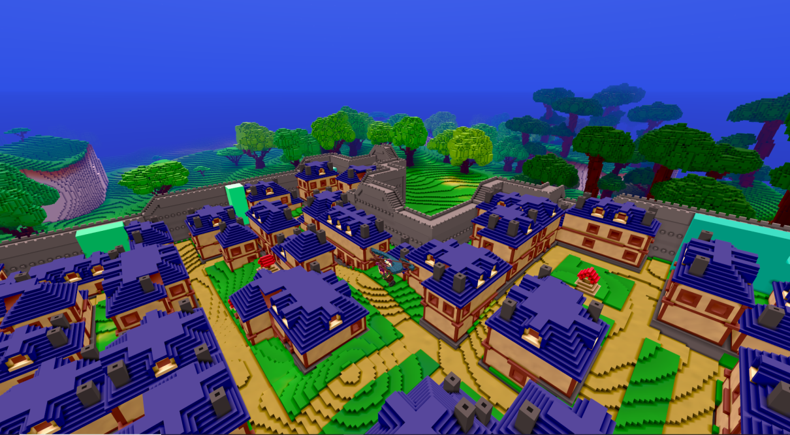

[Veloren][veloren] is an open-world, open-source multiplayer voxel RPG.
The game is in an early stage of development, but is playable.

Some of the September's improvements:

- Improved multi-staged towns generation;
- Improved inventory system and character creation;
- Massive progress on water, water physics, lakes, and rivers!
- New chunks data structure;
- Three-dimensional map and minimap;
- First-person view;
- Bows and arrows;
- Performance optimization;

New video: ["24 Minutes of Alpha Gameplay"](https://youtube.com/watch?v=YyvXXCjpbqQ).

Full weekly devlogs "This Week In Veloren...":
[#31](https://veloren.net/devblog-31),
[#32](https://veloren.net/devblog-32),
[#33](https://veloren.net/devblog-33),
[#34](https://veloren.net/devblog-34),
[#35](https://veloren.net/devblog-35).

[veloren]: https://veloren.net

### [Zemeroth v0.6][zemeroth-v0-6-text]


[Zemeroth] is a minimalistic 2D turn-based tactical game.

This month [Zemeroth v0.6] was released.
Main features of this release are:

- renown and fighter upgrades,
- possessions,
- sprite frames and flips,
- status effect icons.

Read the [full devlog post][zemeroth-v0-6-text] or watch [the video version](http://youtu.be/6tZByt4LBlU).

[Zemeroth]: https://github.com/ozkriff/zemeroth
[zemeroth-v0-6-text]: http://ozkriff.games/2019-09-21--devlog-zemeroth-v0-6
[Zemeroth v0.6]: https://github.com/ozkriff/zemeroth/releases/tag/v0.6.0

### [Twenty Asteroids][asteroids-itch]

[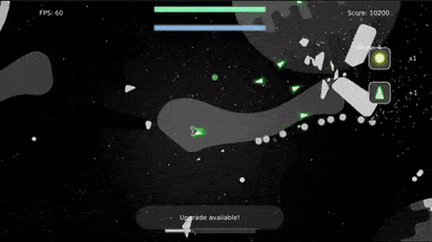][asteroids-itch]

[@VladZhukov0] published a few devlogs about their
["Twenty Asteroids"][asteroids-itch] game:

- Devlog #2: [Video](https://youtu.be/gYevCyU5gxU) and
  [Text][devlog-2-text] versions;
- Devlog #3: [Video](https://youtu.be/YSYRKzogbKg) and
  [Text][devlog-3-text] versions.

Updates include:

- New enemies: a ship with a big pinball-like bullet and a laser-mesh ship;
- New upgrades: laser range and bullets reflection;
- Explosion size now depends on asteroid's size;
- Improved main menu, upgrade and death screens;
- Better color contrast;
- New AI behaviors: follow and circle around;
- Debugging performance plots;

[@VladZhukov0]: https://twitter.com/VladZhukov0
[asteroids-itch]: https://itch.io/queue/c/449652/rustlang-games?game_id=477762
[devlog-2-text]: https://pum-purum-pum-pum.itch.io/asteroids-like-game/devlog/98842/my-asteroids-like-game-devlog-002
[devlog-3-text]: https://pum-purum-pum-pum.itch.io/asteroids-like-game/devlog/101357/new-menu-performance-and-abilities-devlog-3

### [Amethyst Games][amethyst]

- [Space Shooter v0.1.3](https://github.com/amethyst/space_shooter_rs/releases/tag/v0.1.3)
  by [@carlosupina] introduced a currency system, shop system,
  and sound effects: [watch the devlog video][space-shooter-vlog].

  [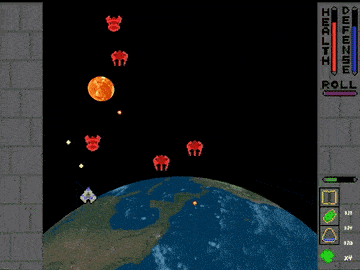][space-shooter-vlog]

- ["Stabman", by Noah2610](https://github.com/Noah2610/LD44).

  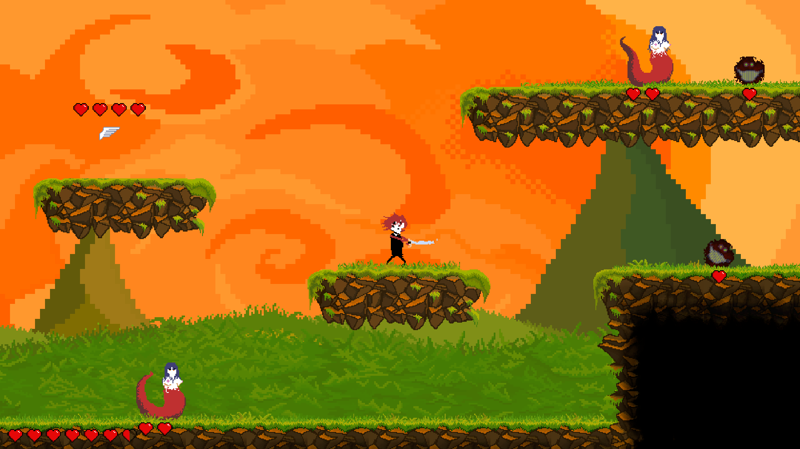

- [@mvlabat] is [working on interpolation in his multiplayer prototype (video)](https://youtu.be/xJm6cI_XmT4).

- [@a5huynh] got [3D pathing working (video)](https://youtu.be/STWQRTxnhRo).

- [Azriel Hoh] released [a major new devblog update titled "Focus!"](https://azriel.im/will/2019/09/27/focus).

  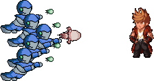

- [@webshinra](https://twitter.com/Webshinra) made progress with raycasted FOV
  in their hexagonal game.

  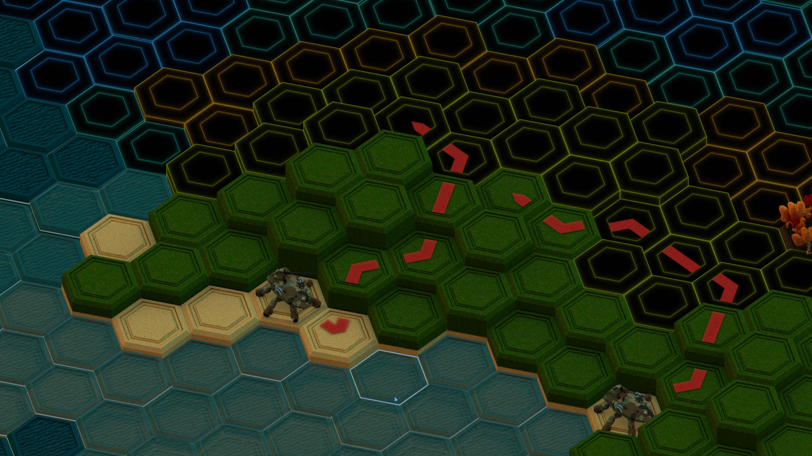

[amethyst]: https://amethyst.rs
[@carlosupina]: https://twitter.com/carlosupina
[space-shooter-vlog]: https://youtube.com/watch?v=MmdUrZzuGfw
[@mvlabat]: https://twitter.com/mvlabat
[Azriel Hoh]: https://twitter.com/im_azriel
[@a5huynh]: https://github.com/a5huynh

### Other Game News

- [@dooskington] published their 5th devlog: ["Stats And Skills"](https://dooskington.com/dev-log/5);

  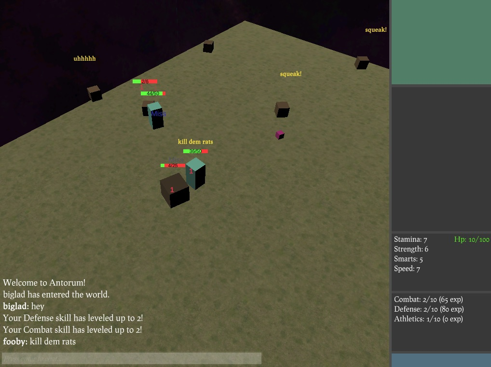

- [Alex Butler] continues to polish their "[Robo Instructus]" game;
  [1.8, 1.9, 1.10 and 1.11 versions were released][robo-news]:
  official macOS support, bugfixes, and better translations.

  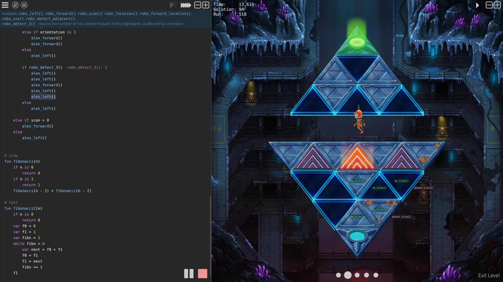

- [@Wraithan got tower placement working](https://twitter.com/Wraithan/status/1172982932341805056)
  in their "WraithDefense" tower defence game;
  the development process [is streamed on Twitch](https://twitch.tv/wraithan).

  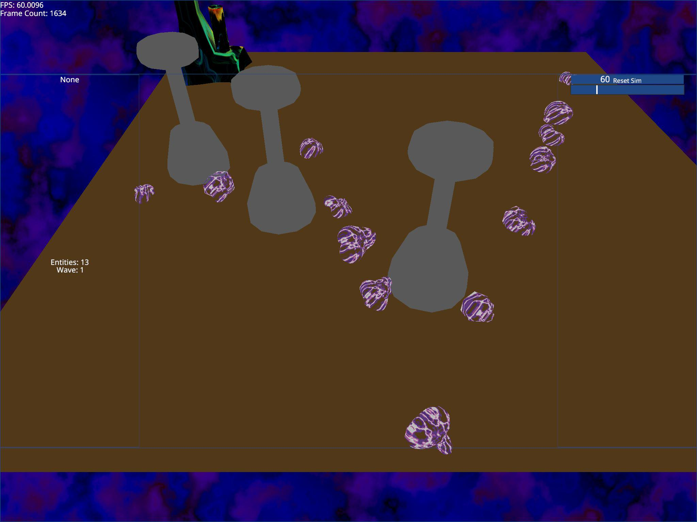

- [@oliviff] released [v0.0.1][tennis-1] and [v0.0.2][tennis-2] updates
  for [Tennis Academy][tennis]:
  simplified gameplay flow, areas, cash flow, animations,
  players' state visual cues and more.

  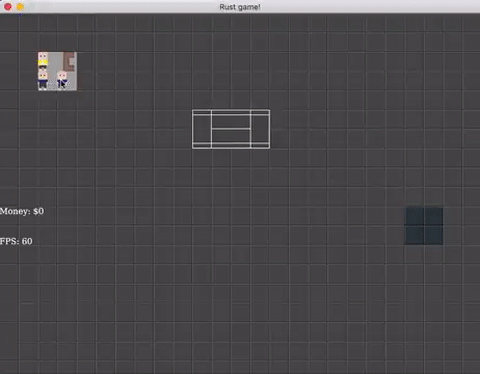

- The [Garden] game is
  [under active development again](https://twitter.com/logicsoup/status/1174259591250661379).
  Devlogs [are coming soon!](https://twitter.com/logicsoup/status/1166469607412158464)

  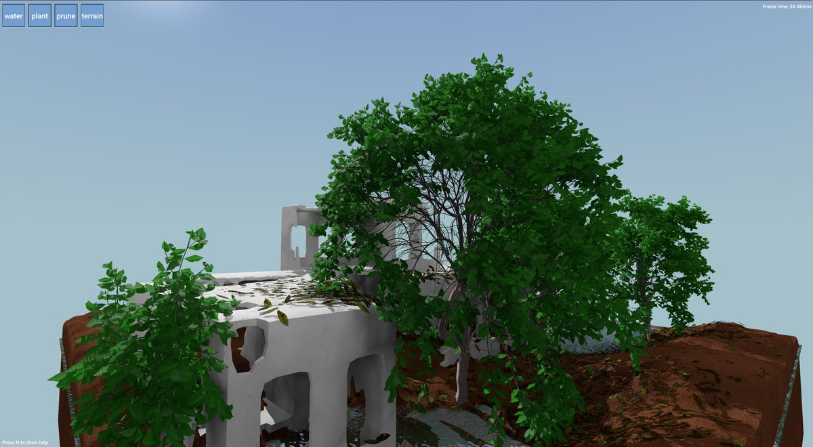

- ["Live"][live] by [@pincfloit] - a small command-line interface survival game
  \[[twitter](https://twitter.com/pincfloit/status/1173965160089837568),
  [github](https://github.com/codegram/live-rust)].

  [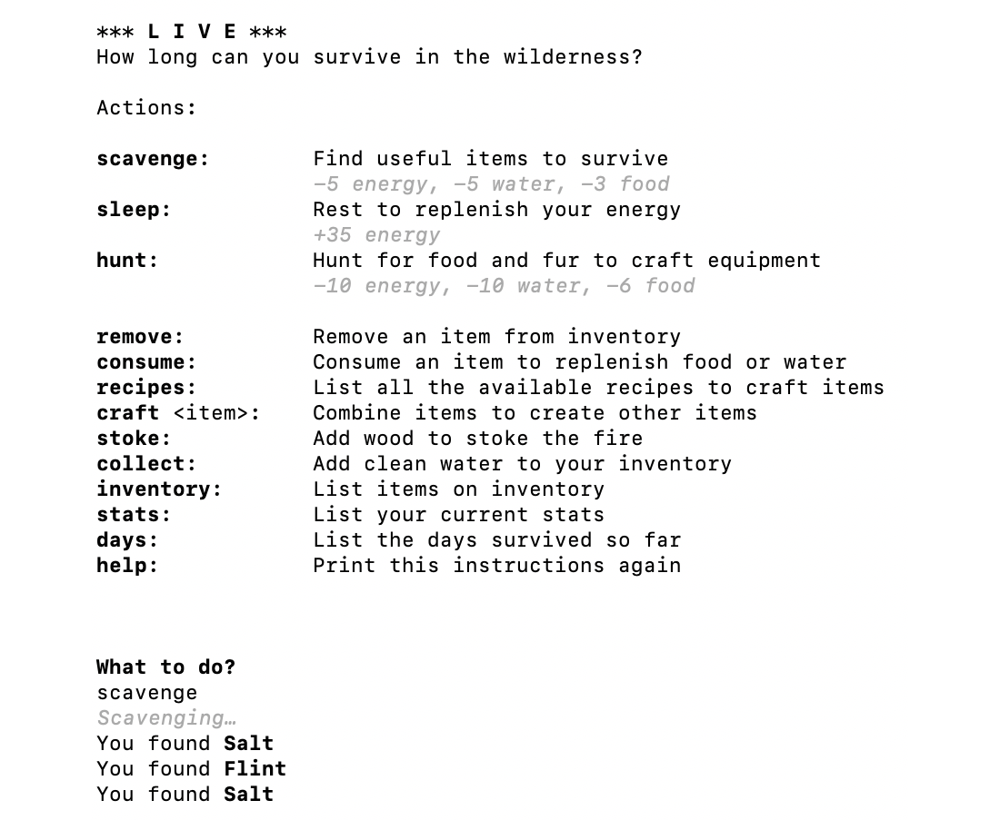][live]

- [@seratonik shared a GIF with omni-directional shadows][shadows-tweet]:

  [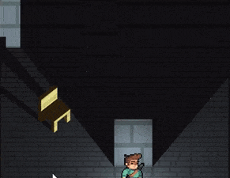][shadows-tweet]

- [@MrVallentin] tweeted a bunch of updates about their voxel engine:
  [falling cubes](https://twitter.com/MrVallentin/status/1170164060542918656),
  [text rendering](https://twitter.com/MrVallentin/status/1170515003113451520),
  [60M cubes generated in the blink of an eye](https://twitter.com/MrVallentin/status/1171773622039515136),
  [remeshing](https://twitter.com/MrVallentin/status/1171774889335951361),
  [retrospective video](https://twitter.com/MrVallentin/status/1174493952894033920),
  [saving and loading](https://twitter.com/MrVallentin/status/1176996637681623042),
  and some more.

  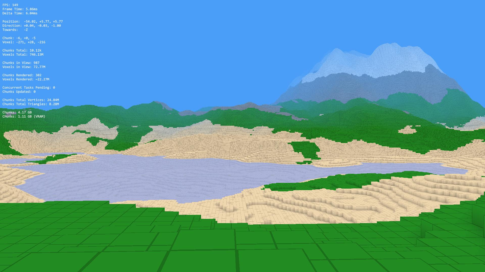

- [@Mistodon] got their entire game ["Disconnect"] to [render in the terminal][disconnect-video];

  [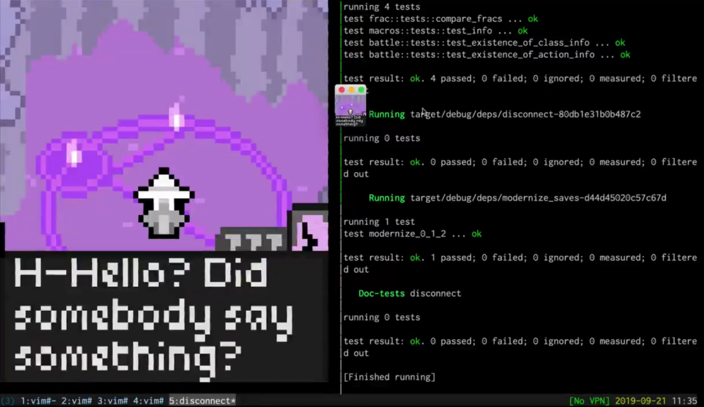][disconnect-video]

## Library & Tooling updates

### [gfx-rs & wgpu-rs: Project Update][gfx-post]

[][gfx-post]

[gfx-rs] is a Rust project aiming to make low-level GPU programming
portable with low overhead.
It’s a single Vulkan-like Rust API with multiple backends that implement it:
Direct3D 12/11, Metal, Vulkan, and even OpenGL.

[wgpu-rs] is a Rust project on top of gfx-rs that provides safety,
accessibility, and even stronger portability.

- gfx-rs was slimmed down: “magical” deps (like [failure] and [derivative])
  were removed and it sped up the fresh gfx-hal build by a factor of 8.5X;
  the “typed” layer of gfx-hal got removed.
- Backend features were removed from wgpu-rs;
- An entirely new [swapchain] model was prototyped and implemented.

_Discussions:
[/r/rust](https://reddit.com/r/rust/comments/dbzxw2/gfxrs_late_2019_project_update)_

[gfx-post]: https://gfx-rs.github.io/2019/10/01/update.html
[gfx-rs]: https://github.com/gfx-rs/gfx
[wgpu-rs]: https://github.com/gfx-rs/wgpu-rs
[failure]: https://github.com/rust-lang-nursery/failure
[derivative]: https://github.com/mcarton/rust-derivative
[swapchain]: https://vulkan-tutorial.com/Drawing_a_triangle/Presentation/Swap_chain

### [Mun][mun] and Hot Reloading Experiments

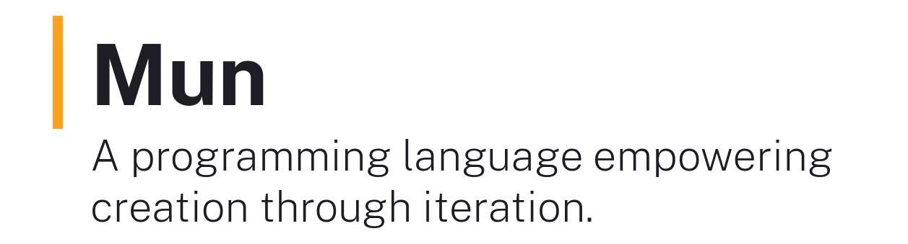

[Mun][mun] is a scripting language for gamedev
focused on quick iteration times that is written in Rust.

Mun's pillars:

- Hot Reloading.
  Mun natively supports hot reloading - the process of changing
  code and resources while an app is running -
  on all target platforms and consoles with marginal runtime overhead.
  Its runtime has useful error messages,
  and can easily be embedded into other languages.
- Static Typing.
  Mun's type system eliminates an entire class of runtime errors
  and provides powerful IDE integration with
  auto-completion and refactoring tools allowing developers
  to focus on writing code.
- Performance.
  Mun uses LLVM to compile to machine code that can be natively executed
  on any target platform, guaranteeing the best possible runtime performance.

The driving force behind the development of Mun is natively supported
hot reloading for functions and data.
As such, the language and its syntax will keep growing at the rate
in which hot reloading-supported semantics is added.
Currently, the language looks like this:

```rust
fn main() {
    let sum = add(a, b);

    // Comments: Mun natively supports bool, float, and int
    let is_true = true;
    let var: float = 0.5;
}

// The order of function definitions doesn't matter
fn add(a: int, b: int): int {
    a + b
}
```

The source code of the project
[is available on GitHub](https://github.com/mun-lang/mun)
under the MIT or Apache licenses.

Mun's runtime is implemented in Rust.
Check out [a GIF demo of the Rust hot reloading functionality][hot-reload-demo]
that shows:

- Catching and logging of errors (e.g. type mismatch),
- hot reloading of a shared library's symbols (used for reflection) and method logic,
- runtime invocable methods and type/method reflection.

_Discussions:
[/r/rust](https://reddit.com/r/rust/comments/d4wngp/released_source_of_hot_reloading_experimentation)_

[mun]: https://mun-lang.org
[hot-reload-demo]: https://reddit.com/r/rust/comments/cywwtv/progress_on_hot_reloading_experimentation_in_rust

### Rust [Roguelike Toolkit][rl-toolkit] and [Roguelike Tutorial][rl-book]

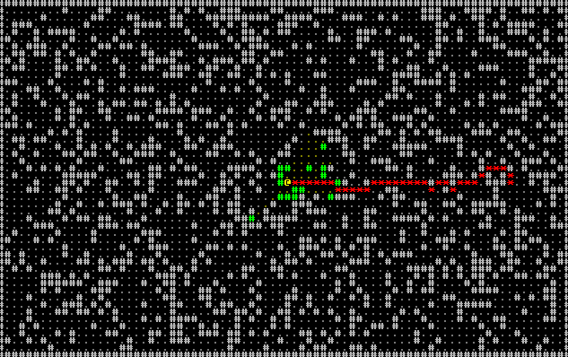

[rltk_rs] by [@herberticus] is a Rust implementation of
[C++ Roguelike Toolkit][RLTK] ([what is a "roguelike?"][rl]).

It provides all the basic functionality one needs to write a roguelike game,
as well as mouse support, an embedded resource system, Web Assembly support,
and more.

All [examples][rltk-examples] are linked to browser WASM to try.

The back-end uses [glow] to abstract OpenGL between versions.
API for embedding assets directly into your binary.

If you'd like to see a functional roguelike that uses rltk_rs,
check out [Rusty Roguelike][rusty-rl].

------

[The Roguelike Tutorial][rl-book] includes more than 20 chapters now
and continues to grow.

It covers topics from "hello rust" and "what is an ECS?" to adding monsters,
equipment, nice menus, save/load, multiple levels, bloodstains, particle effects,
magic mapping scrolls, and more.

The tutorial has Web Assembly links to all examples
so you can run them in your browser.

[rltk_rs]: https://github.com/thebracket/rltk_rs
[rl-toolkit]: https://github.com/thebracket/rltk_rs
[rl-book]: https://bfnightly.bracketproductions.com/rustbook
[rltk-examples]: https://github.com/thebracket/rltk_rs#examples
[@herberticus]: https://patreon.com/blackfuture
[rl]: https://en.wikipedia.org/wiki/Roguelike
[RLTK]: https://github.com/thebracket/rltk
[rusty-rl]: https://github.com/thebracket/rustyroguelike
[glow]: https://github.com/grovesNL/glow

### [EmbarkStudios/texture-synthesis][texture-synthesis]

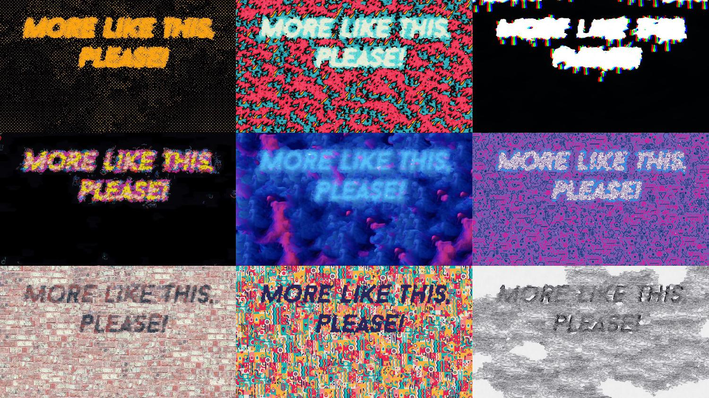

[Embark] has open-sourced their texture synthesis crate **[texture-synthesis]**.
It's an example-based non-parametric image generation algorithm
written in Rust.

[The repo][texture-synthesis] also includes multiple
code examples along with test images,
and a compiled binary with a command-line interface
can be found under the release tab.

Also, see a great long recorded talk
["More Like This, Please! Texture Synthesis and Remixing from a Single Example"](https://youtu.be/fMbK7PYQux4)
which explains this technique and the background more in-depth.

Full list of stuff that [Embark] has released so far:
[embark.rs](http://embark.rs).

_Discussions:
[twitter](https://twitter.com/anastasiaopara/status/1169594058530066432)_

------

Also,

- [Embark will be sponsoring RustFest in Barcelona this year.](https://twitter.com/AriVanider/status/1171359194336903169)
- [Embark started hiring new grads](https://embark.games/position/software-engineer-new-grad)
  \[[twitter](https://twitter.com/AriVanider/status/1173903615498567680)].

[Embark]: https://embark.games
[texture-synthesis]: https://github.com/EmbarkStudios/texture-synthesis

### [Iced - a Renderer-Agnostic GUI Library][Iced]

[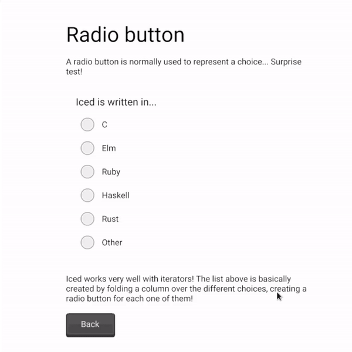][tour]

Iced is a renderer-agnostic GUI library focused on simplicity and type-safety.
It was originally born as an attempt at bringing the simplicity of [Elm][elm]
and The Elm Architecture into [Coffee 2D game engine][coffee].

Features:

- Simple, easy-to-use, renderer-agnostic API;
- Responsive, flexbox-based layouting;
- Type-safe, reactive programming model;
- Lots of built-in widgets and custom widget support.

Check out [the design overview in the repo's README][overview].

_Discussions:
[/r/rust](https://reddit.com/r/rust/comments/czzjnv/iced_a_rendereragnostic_gui_library)_

[Iced]: https://github.com/hecrj/iced
[tour]: https://github.com/hecrj/iced/tree/e82e96e6/examples#tour
[elm]: https://elm-lang.org
[coffee]: https://github.com/hecrj/coffee
[overview]: https://github.com/hecrj/iced#overview

### [Amethyst][amethyst]


[Amethyst][amethyst] is a game engine and tool-set
for ambitious game developers.
It enables game developers to make complex games without getting
into too much trouble, by means of data-driven design
and the ECS architecture.

Tooling:

- [Amethyst Engine v0.13 was released](https://github.com/amethyst/amethyst/releases/tag/v0.13.0).
  A new `amethyst_tiles` crate was added and
  [the Pong tutorial](https://book.amethyst.rs/stable/pong-tutorial/pong-tutorial-06.html)
  is now complete with the addition of an audio section.

- [Laminar v0.3.1 was released](https://github.com/amethyst/laminar/releases/tag/0.3.1).

- [@_AndreaCatania](https://twitter.com/_AndreaCatania) published
  an ["Initialize physics world - Amethyst physics tutorial #1"](https://youtube.com/watch?v=XzSKuY9nv7A)
  video.

- [amethyst-imgui v0.5 is out](https://twitter.com/AmethystEngine/status/1177720011013709824),
  supporting a beta-version of the new imgui docking feature.

  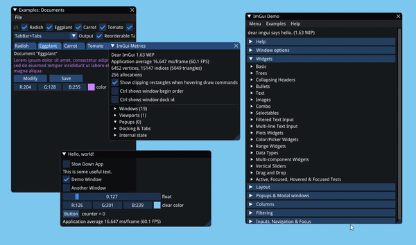

- ["How to do a turn-based game with the ECS pattern"](https://community.amethyst.rs/t/classic-turn-based-workflow-how-to/1082/20)
  post, by [@webshinra](https://twitter.com/webshinra).

- [@valkum](https://github.com/valkum) is
  [implementing area lights using linearly transformed cosines](https://youtube.com/watch?v=KVpLPInWRWg).

### [Godot][godot] and Rust

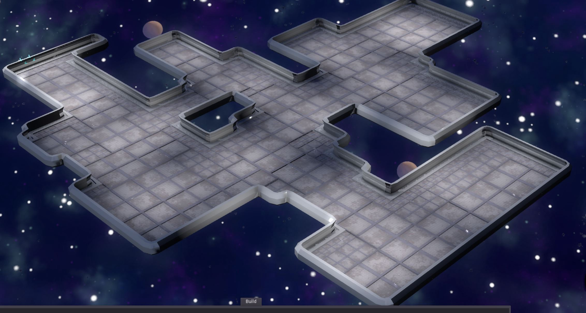

[Tom Leys] is working on a "The Recall Singularity" game
about designing autonomous factory ships and stations
and this month they published a few posts
about using [the Godot engine][godot] with Rust:

- ["How I use Rust and Godot to Explore Space"](https://blog.usejournal.com/how-i-use-rust-and-godot-to-explore-space-806bb810e950)
  \[[/r/godot](https://reddit.com/r/godot/comments/d5qdoy/inspiration_how_i_use_rust_and_godot_to_explore)];
- ["Gorgeous Godot games in Rust"](https://medium.com/@recallsingularity/gorgeous-godot-games-in-rust-1867c56045e6)
  \[[/r/rust](https://reddit.com/r/rust_gamedev/comments/d75qfz/gorgeous_godot_games_in_rust)];
- ["A Basic Godot-Rust Structure"](https://medium.com/@recallsingularity/a-basic-godot-rust-structure-eb855ba07223);

[godot]: https://godotengine.org
[Tom Leys]: https://twitter.com/RecallSingular1

### [Use Prebuilt Rooms with Rust Macros for More Interesting Procedural Dungeons][proc_rooms]

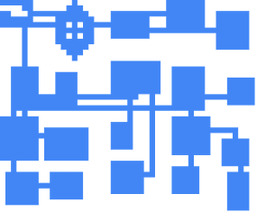

[@whostolemyhat](https://twitter.com/whostolemyhat) published the fourth part
of their tutorial series on procedural generation with Rust.
In this tutorial, the room generation is updated so it can pick from a selection
of pre-built room patterns as well as create the standard empty room.

_Discussions:
[/r/rust](https://reddit.com/r/rust/comments/d85i8x/make_more_interesting_procedural_dungeons_using)_

[proc_rooms]: https://jamesbaum.co.uk/blether/procedural-generation-prebuilt-rooms-rust-macros

### Other Library & Tooling News

- [**uset**](https://crates.io/crates/uset) - an implementation of sets and maps
  designed for small and medium number of stored elements
  which change quickly - i.e. in a dynamically evolving scene in a video game.

- **[blend]** - a parser and runtime for [Blender][blender]'s .blend files
  that can be used to read (almost) everything inside the file:
  from mesh data, materials, cameras and animations to user preferences,
  window locations and render settings
  \[[/r/rust](https://reddit.com/r/rust/comments/d70lu6/blend_a_parser_and_runtime_for_blenders_blend)].

- **[cubism-rs]** (Rust bindings for [Live2D Cubism]) got renderer support for [Piston2D].

  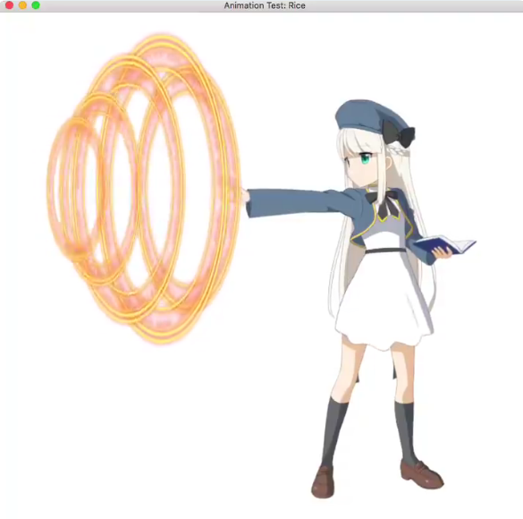

- ["Github Actions CI with Rust and SDL2"] -
  [Alexandru Ene] wrote a post about CI with [github actions]
  for [their hobby game project][after-hours] that uses Rust and SDL2.

  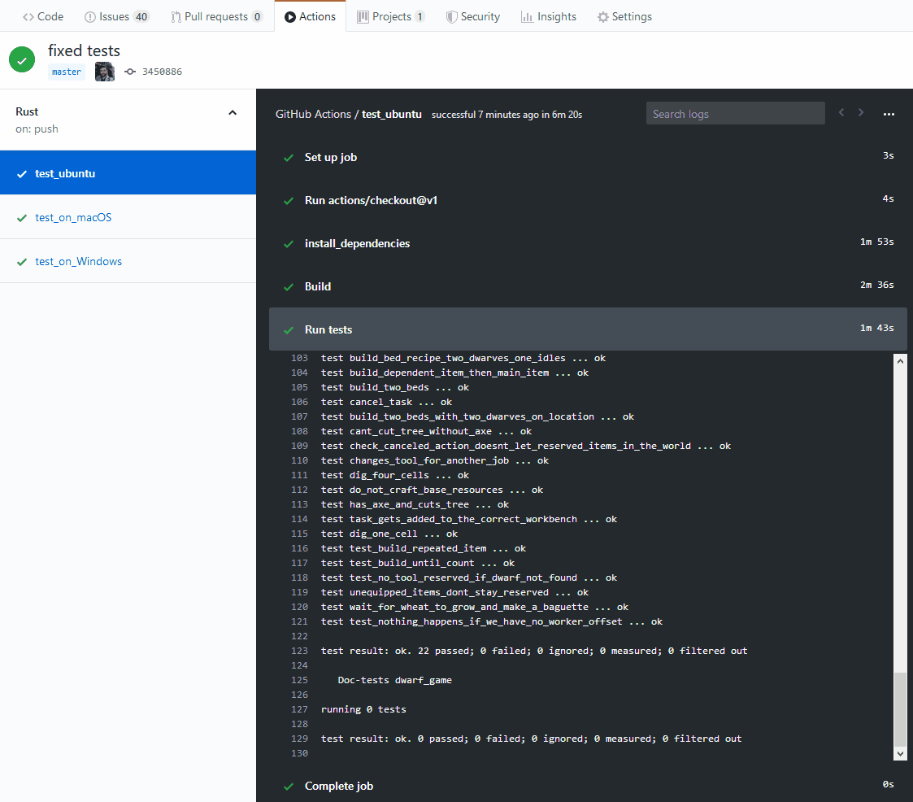

- [@phaazon] released [luminance] 0.33 that
  [brings geometry instancing support](https://reddit.com/r/rust/comments/d0us73/announcement_luminance033);
  also, the third wiki chapter ["Wavefront .obj loader"][luminance-chapter]
  was released.

  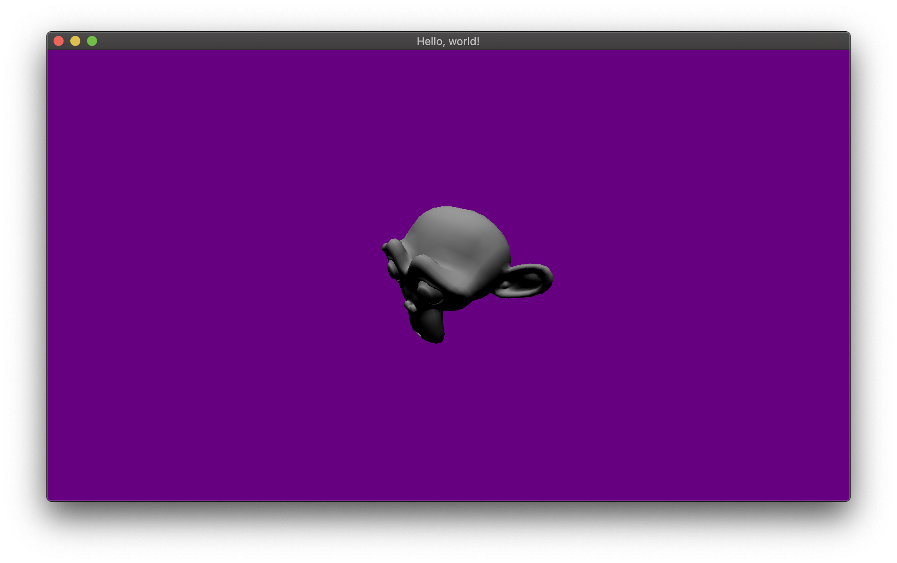

- [phaazon/spline-editor] - a simple spline editor
  for the [splines crate][splines] written using [luminance].

  

- [@magistratic] gave a talk on the Doom's [BSP] rendering engine using their
  Rust implementation as a demonstration at RevolverConf:
  recording (in Norwegian) and a WASM demo available
  [here](https://magnushoff.com/blog/doom-revolverconf)
  ([source code](https://github.com/maghoff/wad-render/tree/revolverconf-2019.2)).

  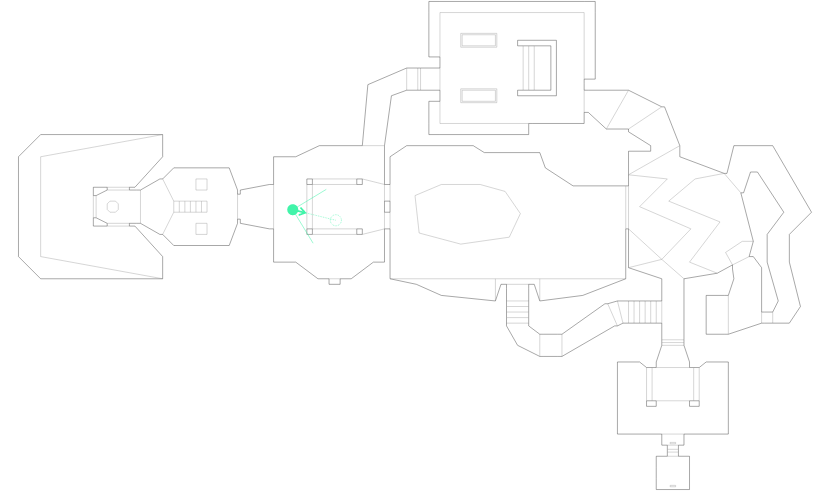

- [**rx**][rx] by [@cloudhead] is a modern pixel editor and animator;
  this month, v0.2.0 was released, with new brush modes -
  pixel perfect drawing, symmetry and multi-frame drawing -
  a new GLFW backend and `.gif` output.
  \[[/r/rust](https://reddit.com/r/rust/comments/dauizc/rx_v020_released_a_modern_pixel_editor),
  [github](https://github.com/cloudhead/rx)].

  [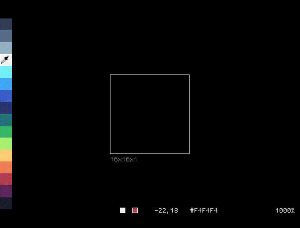][rx]

- Pixel art editor **[Xprite]** is now [open source under GNU GPL][xprite-repo]
  \[[/r/rust](https://reddit.com/r/rust/comments/d4r0o3/pixel_art_editor_xprite_is_now_open_source),
  [/r/rust_gamedev](https://reddit.com/r/rust_gamedev/comments/d3vl65/xprite_is_now_open_source)].

  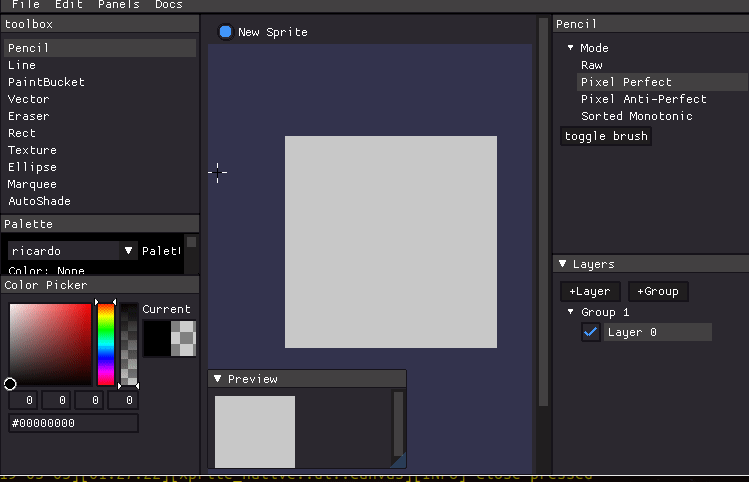

- **[minimum]** by ([@aclysma]) is a game development framework that provides
  basic tooling and a content authoring workflow;
  this month, rendering of draggable shapes in the editor
  and rotation/scaling were added
  \[[YouTube demo](https://youtube.com/watch?v=BON_RvVFiWY)].

  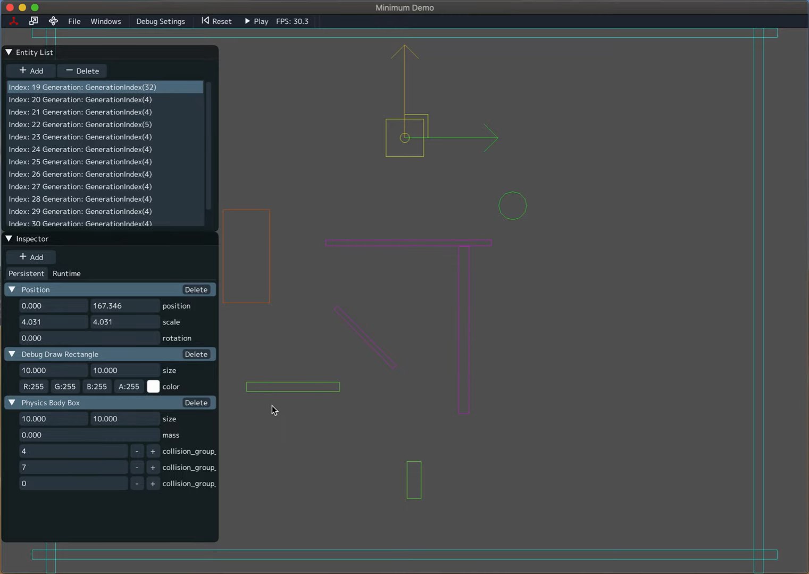

- The **[imgui-inspect]** macro-based property editor by [@aclysma]
  is a by-product of the above-mentioned "minimum" project.

  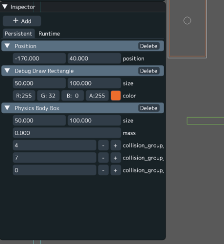

- [Project Deios][deios] decided to implement their core in Rust
  and has been looking for a Rust graphics programmer:
  [/r/rust announcement][deios-reddit].

  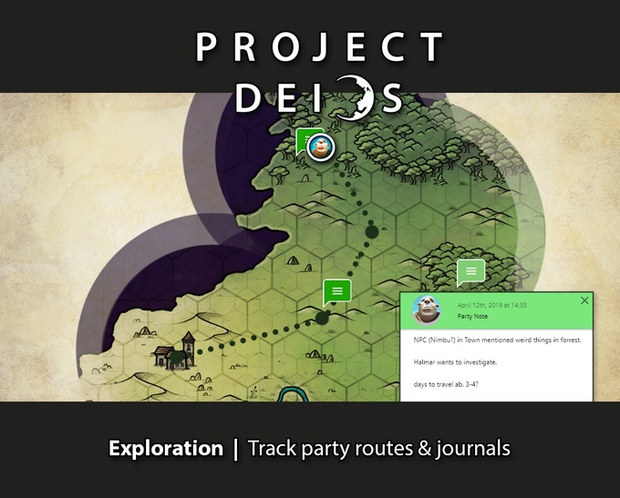

<!--
The following links block should be split into games and tools blocks,
but I'm too tired to this atm and it will be rendered correctly anyway.
-->

[Alexandru Ene]: https://twitter.com/_AlexEne_
["Github Actions CI with Rust and SDL2"]: https://alexene.dev/2019/09/04/Github-actions-CI-rust-SDL2.html
[github actions]: https://github.com/features/actions
[after-hours]: https://alexene.dev/2019/01/15/After-hours-game-development.html
[Xprite]: https://pickitup247.com/xprite.html
[xprite-repo]: https://github.com/rickyhan/xprite-editor
[cubism-rs]: https://github.com/Veykril/cubism-rs
[Live2D Cubism]: https://www.live2d.com/en/download/cubism-sdk
[Piston2D]: https://www.piston.rs
[@dooskington]: https://twitter.com/dooskington
[@magistratic]: https://twitter.com/magistratic
[BSP]: https://en.wikipedia.org/wiki/Binary_space_partitioning
[@Mistodon]: https://twitter.com/Mistodon
["Disconnect"]: https://mistodon.itch.io/disconnect
[disconnect-video]: https://twitter.com/Mistodon/status/1175361784246603776
[@pincfloit]: https://twitter.com/pincfloit
[luminance]: https://crates.io/crates/luminance
[luminance-chapter]: https://github.com/phaazon/luminance-rs/wiki/Wavefront-.obj-loader
[splines]: https://crates.io/crates/splines
[phaazon/spline-editor]: https://github.com/phaazon/spline-editor
[@aclysma]: https://twitter.com/aclysma
[@phaazon]: https://github.com/phaazon
[blend]: https://github.com/lukebitts/blend
[blender]: https://blender.org
[Garden]: https://epcc.itch.io/garden
[shadows-tweet]: https://twitter.com/seratonik/status/1169106102710988801
[live]: https://nuria.itch.io/live-rust
[@oliviff]: https://twitter.com/oliviff
[tennis]: https://iolivia.me/posts/6-months-of-rust-game-dev
[tennis-1]: https://twitter.com/oliviff/status/1168556346431692800
[tennis-2]: https://twitter.com/oliviff/status/1172912164488843265
[Alex Butler]: https://twitter.com/bigabgames
[Robo Instructus]: https://steamcommunity.com/games/1032170/announcements/detail/1604892840079306082
[robo-news]: https://steamcommunity.com/app/1032170/allnews
[@MrVallentin]: https://twitter.com/MrVallentin
[rx]: https://cloudhead.io/rx
[@cloudhead]: https://cloudhead.io
[deios]: https://kickstarter.com/projects/dungeonfog/project-deios-dungeonfog-mapmaker-suite-for-worldbuilders
[deios-reddit]: https://reddit.com/r/rust/comments/d487dr/were_looking_for_a_rust_graphics_programmer
[imgui-inspect]: https://github.com/aclysma/imgui-inspect
[minimum]: https://github.com/aclysma/minimum

## Popular Workgroup Issues in Github

<!-- Up to 10 links to interesting issues -->

- [#36 "Adoption of Rust over time in existing game codebases"](https://github.com/rust-gamedev/wg/issues/36)
- [#48 "Placement New"](https://github.com/rust-gamedev/wg/issues/48)
- [#49 "Branch prediction hints (i.e. Likely/Unlikely)"](https://github.com/rust-gamedev/wg/issues/49)
- [#51 "Using wasm-bindgen for games"](https://github.com/rust-gamedev/wg/issues/51)

## Meeting Minutes

<!-- Up to 10 most important notes + a link to the full details -->

[See all meeting issues][label_meeting] including full text notes
or [join the next meeting][join].

[label_meeting]: https://github.com/rust-gamedev/wg/issues?q=label%3Ameeting

## Requests for Contribution

<!-- Links to "good first issue"-labels or direct links to specific tasks -->

- [winit](https://github.com/rust-windowing/winit):
  - [Issues tagged as "Good first issue" and “help wanted”][winit help wanted];
  - [Issues tagged as "Blocking a release"][winit blocking];
- [gfx-rs's "contributor-friendly" issues][gfx issues];
- [wgpu's "help wanted" issues][wgpu-help-wanted];
- [luminance's "low hanging fruit" issues][luminance-fruits];
- Request from Amethyst:
  ["The renderer-agnostic GUI library “Iced” by @hecrj looks *so* good.
  If someone wants to make this work with Amethyst please get in touch with us!
  (or just do it...)"][amethyst-iced-help].

[winit help wanted]: https://github.com/rust-windowing/winit/issues?utf8=✓&q=is%3Aissue+is%3Aopen+label%3A%22status%3A+help+wanted%22+label%3A%22Good+first+issue%22
[winit blocking]: https://github.com/rust-windowing/winit/issues?utf8=✓&q=is%3Aissue+is%3Aopen+label%3A%22Blocking+a+release%22
[gfx issues]: https://github.com/gfx-rs/gfx/issues?q=is%3Aissue+is%3Aopen+label%3Acontributor-friendly
[wgpu-help-wanted]: https://github.com/gfx-rs/wgpu-rs/issues?q=is%3Aissue+is%3Aopen+label%3A%22help+wanted%22
[luminance-fruits]: https://github.com/phaazon/luminance-rs/issues?q=is%3Aissue+is%3Aopen+label%3A%22low+hanging+fruit%22
[amethyst-iced-help]: https://twitter.com/AmethystEngine/status/1169922826033336320
[@hecrj]: https://twitter.com/hecrj

## Bonus

<!-- Bonus section to make the newsletter more interesting
and highlight events from the past. -->

Just an interesting Rust gamedev link from the past. :)

[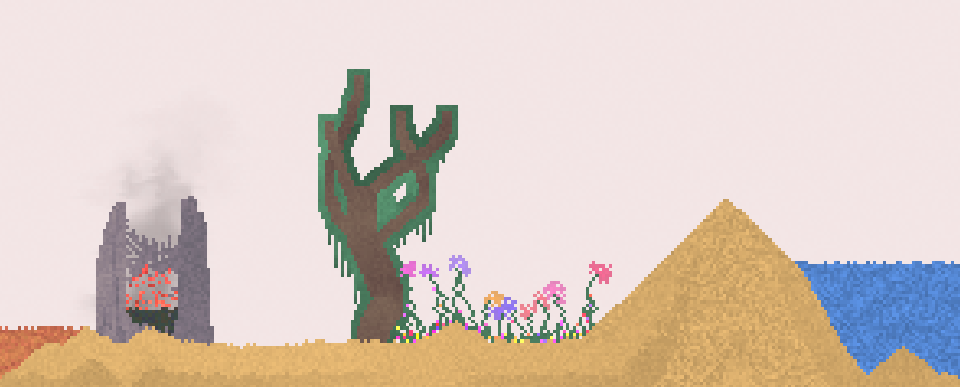][Sandspiel]

**[Sandspiel]** is a falling sand game by [@MaxBittker]
built in late 2018 using Rust (via WASM), WebGL,
and some JS glueing things together.

> Sandspiel is a pixel physics simulation sandbox where
> you can paint with elements, conduct experiments and build your own world!
>
> Elements include Ice, Water, Sand, Lava, Fire, Oil, Plant, Fungus,
> and many more!
>
> The goal was to produce an cellular automata environment that's
> interesting to play with and supports the sharing and forking
> of fun creations with other players.
> Ultimately, I want the platform to support editing and uploading
> of your own elements via a programmable cellular automata API.

The history of the game and the development process are documented in a great
**["Making Sandspiel"](https://maxbittker.com/making-sandspiel)** blog post.

[The source code is available on GitHub](https://github.com/MaxBittker/sandspiel).

The game's community is still active: check
[@sandspiel_feed feed of uploads](https://twitter.com/sandspiel_feed).

_Discussions:
[/r/rust](https://reddit.com/r/rust/comments/a6v0p1/sandspiel_a_falling_sand_game_built_in_rustwebgl),
[/r/programming](https://reddit.com/r/programming/comments/a6zxou/sandspiel_a_falling_sand_game_built_in_rust),
[hacker news](https://news.ycombinator.com/item?id=18696291)_

[Sandspiel]: https://sandspiel.club
[@MaxBittker]: https://maxbittker.com

------

That's all news for today, thanks for reading!

Want something mentioned in the next newsletter?
[Send us a pull request][pr].

Also, subscribe to [@rust_gamedev on Twitter][@rust_gamedev]
or [/r/rust_gamedev subreddit][/r/rust_gamedev] if you want to receive fresh news!

**Discussions of this post**:
[/r/rust](https://reddit.com/r/rust/comments/ddtbpm/this_month_in_rust_gamedev_2_september_2019),
[twitter](https://twitter.com/rust_gamedev/status/1180590459913035776).

[/r/rust_gamedev]: https://reddit.com/r/rust_gamedev
[@rust_gamedev]: https://twitter.com/rust_gamedev
[pr]: https://github.com/rust-gamedev/rust-gamedev.github.io
