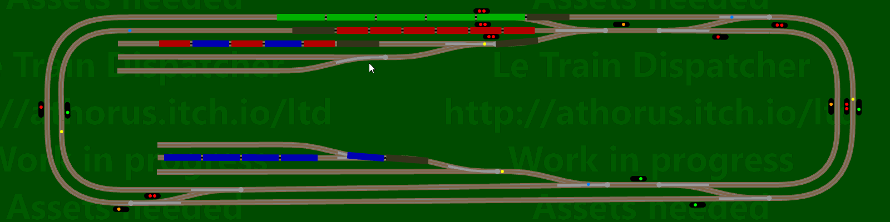
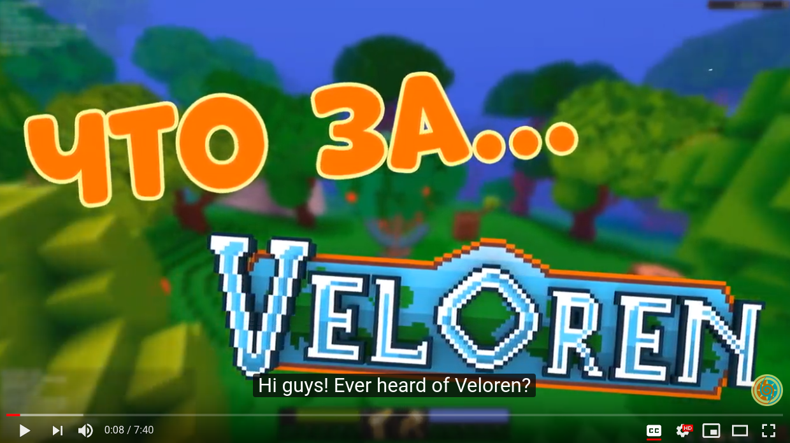
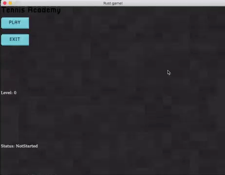
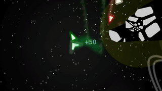
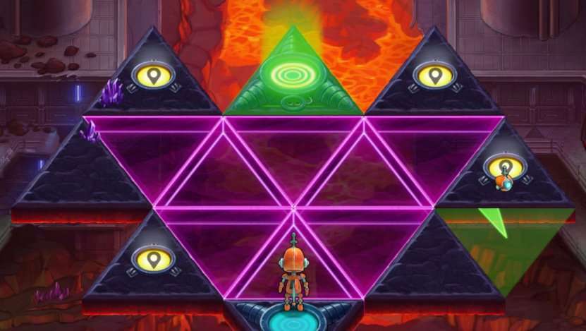
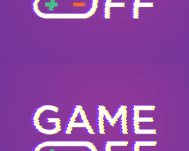

+++
title = "This Month in Rust GameDev #4 - November 2019"
draft = true
+++

<!-- markdownlint-disable no-trailing-punctuation -->

Welcome to the fourth issue of the Rust GameDev Workgroup’s
monthly newsletter.

[Rust] is a systems language pursuing the trifecta:
safety, concurrency, and speed.
These goals are well-aligned with game development.

We hope to build an inviting ecosystem for anyone wishing
to use Rust in their development process!
Want to get involved? [Join the Rust GameDev working group!][join]

Want something mentioned in the next newsletter?
[Send us a pull request][pr].
Feel free to send PRs about your own projects!

[Rust]: https://rust-lang.org
[join]: https://github.com/rust-gamedev/wg#join-the-fun
[pr]: https://github.com/rust-gamedev/rust-gamedev.github.io

<!--
Ideal section structure is:

```
### [Title]


A paragraph or two with a summary and [useful links].

_Discussions:
[/r/rust](https://reddit.com/r/rust/todo),
[twitter](https://twitter.com/todo/status/123456)_

[Title]: https://first.link
[useful links]: https://other.link
```

Discussion links are added only if they contain
some actual interesting discussions.

If needed, a section can be split into subsections with a "------" delimiter.
-->

## Game Updates

### [Le Train Dispatcher][ltd] - Route Trains in Simulated Rail Network



Le Train Dispatcher ([itch.io][ltd], [Patreon][ltd-patreon])
allows you to route trains in a fully simulated rail network.
Particular care has been taken on the realistic management of light signals
(block systems, switch protection), train physics and curve tracing.

The game is programmed in Rust and the main crates used are: ggez, imgui and serde.

This first version is fully playable, but if you want to comment,
bring your ideas or contribute to the development of the game,
in any way, do not hesitate to post a [message][ltd-community].

Unique characteristics:

- Realistic light signals simulation:
  Huge engineering work has been done to have realistic
  management of railway signaling.
- No collision:
  Yes it's fun to watch many trains running automatically without getting in.
  All your actions are checked: you cannot put the trains in danger.
- True physics
  - Each locomotive or wagon has its own weight,
    its driving or braking force, its coefficient of adhesion.
  - The curves are not simple circles, they are calculated with
    the same equations as those used in real road or rail networks.

[ltd]: http://athorus.itch.io/ltd
[ltd-community]: https://athorus.itch.io/ltd/community
[ltd-patreon]: https://patreon.com/athorus

### [Veloren][veloren]


[Veloren][veloren] is an open-world, open-source multiplayer voxel RPG.
The game is in an early stage of development, but is playable.

Some of November's updates:

- The main repository reached 50,000 lines of code (according to [Tokei]);
- [Airshipper launcher][airshipper] was significantly improved;
- game design working group was started;
- improved auth, player creation screen, asset compression, lore, and soundtrack;
- CI upgrades, lots of bugfixes and content upgrades.

The full weekly devlogs "This Week In Veloren...":
[#40](https://veloren.net/devblog-40),
[#41](https://veloren.net/devblog-41),
[#42](https://veloren.net/devblog-42),
[#43](https://veloren.net/devblog-43).

------

Check out a new video ["What is Veloren?"][veloren-what-is]
by @DoNeo and @RonVal4 (it's in Russian but has English subtitles):

[][veloren-what-is]

Also, they've written [an article in Russian about Veloren for dtf.ru][veloren-dtf].

[veloren]: https://veloren.net
[Tokei]: https://github.com/XAMPPRocky/tokei
[airshipper]: https://gitlab.com/veloren/airshipper
[veloren-what-is]: https://youtube.com/watch?v=IIl271iDulY
[veloren-dtf]: https://dtf.ru/indie/83725-veloren-igra-mechty

### [Math Defense][math-defense]


[Math Defense][math-defense] by [@512Avx] is a math game for kids.

> Progress through addition, subtraction, multiplication, and division
> by solving the math problems to shoot down enemy space ships.
> Multiple difficulty levels and fully customizable by editing the levels.json file.
> Create your own levels, change the difficulty, whatever you like.

[The source code is available here][math-defense-src].

[math-defense]: https://jackmott.itch.io/math-defense
[math-defense-src]: https://github.com/jackmott/mathblaster
[@512Avx]: https://twitter.com/512Avx

### [Sulis: Basic Resource Management][sulis-resources]


[Sulis][sulis] is a Role-Playing Game (RPG) with turn-based, tactical combat,
deep character customization, and an engaging storyline.

This month, an article ["Basic Resource Management"][sulis-resources]
was published:

> In developing Sulis, one of the primary goals
> is easy and powerful modding capabilities.
> To that end, virtually all resources are defined via simple YAML files.
> The idea is that anyone with a text editor can create new resources
> or edit existing ones easily.
> However, this immediately brings up the question of how to manage
> all these resources within the game's state.
> In Sulis, this is handled via a central resource manager.

While Sulis is used as the primary example,
the article should apply to pretty much any game.

Also, the project (the game itself and its source code)
[was reviewed by gamefromscratch.com][sulis-video]
\[[/r/rust_gamedev](https://reddit.com/r/rust_gamedev/comments/du48iw/sulis_an_rpg_created_using_rust_gamesfromscratch)].

[sulis]: https://sulisgame.com/dev-modding/9-dev/15-managing-resources
[sulis-resources]: https://sulisgame.com/dev-modding/9-dev/15-managing-resources
[sulis-video]: https://youtube.com/watch?v=gvibvDiVzn8

### [Paddlers: Fun with Rust and distributed systems][paddlers-devlog-3]

[][paddlers-devlog-3]

[Paddlers][paddlers-src] is a multi-player real-time strategy browser game
about making all Paddland's ducks happy.

Check out a live demo at [demo.paddlers.ch](http://demo.paddlers.ch)
(a test user's username is "Tester", password is "1").

This month the third devlog was published:
["#3: Fun with Rust and distributed systems"][paddlers-devlog-3].
It overviews the architecture and implementation of the project.

[paddlers-src]: https://github.com/jakmeier/paddlers-browser-game
[paddlers-devlog-3]: https://www.jakobmeier.ch/blogging/Paddlers_3.html

### [Antorum: Drop Tables][antorum-drop-tables]


[Antorum][antorum] is a multiplayer RPG where players build their characters
and fight against the growing threats on the isle.
The game server is authoritative and written in Rust,
while the client is written in Unity/C#.

This month, @dooskington published
the [11th devlog "Drop Tables"][antorum-drop-tables]
about the implementation of a drop table system to handle monster loot.

[antorum]: https://dooskington.com
[antorum-drop-tables]: https://dooskington.com/dev-log/11

### [Recall Singularity: November Progress][recall-s-nov-text]

[][recall-s-nov-video]

^ _Demo of the basic ship collision._

[Tom Leys] is working on a "The Recall Singularity" game
about designing autonomous factory ships and stations
and this month they published a devlog post:
["Recalling Nov 2019"][recall-s-nov-text].

You can also [watch a video version here][recall-s-nov-video].

Summary:

- basic networked inputs to move ships or players;
- physics for ships, including collisions;
- [Twich streaming the development](https://twitch.tv/recallsingularity);
- a more generic approach to syncronising from Rust (Specs) to Godot.

[Tom Leys]: https://twitter.com/RecallSingular1
[recall-s-nov-text]: https://medium.com/@recallsingularity/recalling-nov-2019-236cdf9c0a8a
[recall-s-nov-video]: https://youtube.com/watch?v=AoPSAoqmTCk

### [Slavic Castles][slavic-castles]


[Slavic Castles][slavic-castles] is a card game inspired by [Arcomage]
written in Rust using [ggez]/[good-web-game].

You can play online [here][slavic-castles-demo]
or on [itch.io][slavic-castles].

[The source code is available here][slavic-castles-src].

_Discussions:
[/r/rust_gamedev](https://reddit.com/r/rust_gamedev/comments/dsm2dh/card_game_inspired_by_arcomage)_

[slavic-castles-src]: https://github.com/Leinnan/slavic_castles
[slavic-castles]: <https://leinnan.itch.io/slavic-castles>
[slavic-castles-demo]: http://leinnan.ayz.pl/ukw/slavic_castles/index.html
[Arcomage]: https://en.wikipedia.org/wiki/Arcomage
[ggez]: https://github.com/ggez/ggez
[good-web-game]: https://github.com/not-fl3/good-web-game

### [Tennis Academy]



[@oliviff] released [v0.0.5][tennis-academy-v0-0-5]..[v0.1.0][tennis-academy-v0-1-0]
versions of [Tennis Academy]:

- ⏰ players have patience levels and leave when they get bored;
- ✨ score multipliers with text effects;
- 🥇 winning and losing states;
- 🤖 no more people, the robots have taken over!
- 🎨 new colour palette and graphics, new buttons and UI (using [Iced][iced]).

[@oliviff]: https://twitter.com/oliviff
[Tennis Academy]: https://iolivia.me/posts/6-months-of-rust-game-dev
[tennis-academy-v0-0-5]: https://twitter.com/oliviff/status/1192178573488070659
[tennis-academy-v0-1-0]: https://twitter.com/oliviff/status/1199073510443945985

### [Twenty Asteroids][asteroids-itch]

[][asteroids-video]

The game is now officially named "Twenty Asteroids".

[@VladZhukov0] published
[a short video of the updated/tweaked gameplay][asteroids-video].

[@VladZhukov0]: https://twitter.com/VladZhukov0
[asteroids-itch]: https://pum-purum-pum-pum.itch.io/twenty-asteroids
[asteroids-video]: https://twitter.com/VladZhukov0/status/1197855075269521409

### [Erasterra][erasterra]


[Erasterra][erasterra] is a geography racing game.
It uses Rust to implement the matchmaking server.

> It made sense to implement the matchmaker in Rust because
> it's designed to be a long-running service and as such it may not crash.
> Rust simply makes it easier to implement non-crashing software 🙌

[erasterra]: https://coffejunkstudio.itch.io/erasterra

### [Garden][garden-itch]


[@logicsoup] tweeted a bunch of updates, including:

- [ruin generation through "fake bombing" the buildings](https://twitter.com/logicsoup/status/1192825303338536960),
- [improved soil physics](https://twitter.com/logicsoup/status/1196195909119496199),
- [craters](https://twitter.com/logicsoup/status/1195461536275415040).

[garden-itch]: https://epcc.itch.io/garden
[@logicsoup]: https://twitter.com/logicsoup

### [Robo Instructus]



[Alex Butler] continues to polish their "[Robo Instructus]" game;
[1.15, 1.16, and 1.17 versions were released][robo-news]:
Rust 1.39, bugfixes, and better translations.

[You can contribute to translations here][robo-transaltion].

[Alex Butler]: https://twitter.com/bigabgames
[Robo Instructus]: https://store.steampowered.com/app/1032170/Robo_Instructus/
[robo-news]: https://steamcommunity.com/app/1032170/allnews
[robo-transaltion]: https://github.com/big-ab-games/robo-instructus-translation#about

### GitHub Game Off 2019



[GitHub's Game Off](https://itch.io/jam/game-off-2019)
is an annual month-long game jam (hackathon for building games).
This year’s theme is ["leaps and bounds"][gameoff-theme].

- ["TopDown"][topdown] by [@fedor_games] made with
  [their own unannounced game engine][perfect engine]
  ([source code][topdown-src]).

  

- ["Compact Space"][compact-space] by [@fischspiele]
  made with specs and Tetra ([source code][compact-space-src]).

  > How long can you stay alive?

  

- "evo" by [@ZappedCow]  made with Tetra ([source code][evo-src]).

  > A life/environment simulator with a bit of rogue-like tossed in.

  

[gameoff-theme]: https://github.blog/2019-11-01-game-off-2019-theme-announcement
[@fedor_games]: https://twitter.com/fedor_games
[perfect engine]: https://twitter.com/fedor_games/status/1192989017840730112
[topdown]: https://fedorgames.itch.io/ggoff2019
[topdown-src]: https://github.com/not-fl3/gameoff-2019
[compact-space]: https://puppetmaster.itch.io/compact-space
[compact-space-src]: https://github.com/puppetmaster-/compact-space
[@fischspiele]: https://twitter.com/fischspiele
[@ZappedCow]: https://twitter.com/
[evo-src]: https://github.com/jlauener/evo

### Amethyst Games

- [Azriel] published a ["That Looks Good On UI"][will-devlog] devlog.

  > What’s new:
  >
  > - Animated menus and backgrounds can be defined.
  > - Player names can be specified in controller configuration.
  > - Winner is displayed when a game ends.
  >
  > Behind the scenes, the following code maintenance has been made:
  >
  > - Moved all tests into a separate crate – 1.9x speedup,
  >   65% less disk usage.
  > - Assets are loaded into separate asset components – easier
  >   to share logic between different types of objects.
  > - Asset loading is done in stages, in preparation
  >   for the ability to disable certain stages.

  

- [@takeryo_eeic] named their hexagonal game "Conquest",
  [added a main menu](https://twitter.com/takeryo_eeic/status/1195263050896429057),
  and [showed a video of new map generator and map scrolling](https://twitter.com/takeryo_eeic/status/1192407134245228546).

  

[Azriel]: https://azriel.im
[will-devlog]: https://azriel.im/will/2019/11/08/that-looks-good-on-ui
[@takeryo_eeic]: https://twitter.com/takeryo_eeic

## Library & Tooling updates

### [Memory Arena][mem-arena]


[@kooparse] published [a post about implementing a quick memory arena][mem-arena].

> For my game, I decided to store almost every entity in a big chunk of memory
> allocated only once when the program boot.
> I am using this technique for three reasons.
> First, I want full and precise control over how memory is managed
> in the game,
> second I want better data locality in order to increase cache hits
> from the cpu,
> and finally, at runtime asking the operating system
> in order to allocate more memory is slow.

[mem-arena]: https://kooparse.com/blog/memory-arena
[@kooparse]:    https://twitter.com/kooparse

### [wgpu v0.4][wgpu-v0-4]


[wgpu] is a library in Rust that is meant to be the go-to solution
for most graphics and compute needs.

wgpu-rs version 0.4 was released on crates.
wgpu is based on [gfx-hal-0.4] and includes
changes from the [previous blog post][old-gfx-post];

A few notable additions are:

- proper Windows 7 support;
- support for multiple clients on the same GPU server;
- slimmed-down Rendy dependencies (memory and descriptor);
- new skybox example.

Lyon has [updated examples](https://github.com/nical/lyon/pull/496) for this version, showing how to draw vector graphics on `wgpu`.

Also, `wgpu` is now a part of Gecko code base for powering the emerging WebGPU implementation.

[wgpu-v0-4]: https://reddit.com/r/rust_gamedev/comments/drcje5/wgpu04_is_out
[wgpu]: https://github.com/gfx-rs/wgpu
[gfx-hal-0.4]: https://reddit.com/r/rust/comments/dm89t2/gfxhal_version_04_release
[old-gfx-post]: https://gfx-rs.github.io/2019/10/01/update.html

### Book: [Learn Luminance][luminance-book]

[luminance] is a type-safe, type-level and stateless Rust graphics framework.

This month, [@phaazon] released a ["Learn Luminance"][luminance-book] book.
Luminance's wiki was deprecated and the book is now the central reference
to onboard newcomers to use luminance as well as people
who would like to give luminance a try and who knows nothing about rendering.

_Discussions:
[/r/rust](https://reddit.com/r/rust/comments/e3662k/learn_luminance_the_book)_

[luminance]: https://github.com/phaazon/luminance-rs
[luminance-book]: https://rust-tutorials.github.io/learn-luminance
[@phaazon]: https://github.com/phaazon

------

Btw, [@resinten shared a video is working on a game using luminance][resinten-gif]:

[][resinten-gif]

[@resinten]: https://twitter.com/resinten
[resinten-gif]: https://twitter.com/resinten/status/1194825522418765826

### [Pixels][pixels]


[Pixels][pixels] by [@kodewerx] is a tiny hardware-accelerated
pixel frame buffer based on wgpu.
It's supposed to be used for emulators, software rendering,
2D animations and games prototyping.

Check out [the URLO announcement post][pixels-urlo-ann].

_Discussions:
[/r/rust_gamedev](https://reddit.com/r/rust_gamedev/comments/drunej/announcing_pixels_hardwareaccelerated_pixel_frame)_

[pixels]: https://github.com/parasyte/pixels
[pixels-urlo-ann]: https://users.rust-lang.org/t/announcing-pixels-hardware-accelerated-pixel-frame-buffer/34326/1
[@kodewerx]: https://twitter.com/kodewerx

### [Metropolis][metropolis]

[metropolis] by [@GuyL99]
is a high-level graphics renderer, with easy functions to use.

> This crate should make graphics programming easy with functions
> like rect, ellipse, line, text, and such,
> and it's fast with 60-120 FPS on a bad computer.

_Discussions:
[/r/rust_gamedev](https://reddit.com/r/rust_gamedev/comments/e3lfr7/new_graphics_renderer_metropolis)_

[metropolis]: https://github.com/GuyL99/metropolis
[@GuyL99]: https://github.com/GuyL99

### [skulpin]

[][skulpin-video]

^ Click to see [a demo video][skulpin-video].

[skulpin] by [@aclysma] provides an easy option for drawing hardware-accelerated 2D
by combining Vulkan and [Skia].

[skulpin]: https://github.com/aclysma/skulpin
[skulpin-video]: https://www.youtube.com/watch?v=El99FgGSzfg
[@aclysma]: https://twitter.com/aclysma
[Skia]: https://skia.org

### [ultraviolet] v0.2

[ultraviolet] v0.2 were released by [@fu5ha].
This release introduces [Bivectors] and [Rotors] and improved usability.

_Discussions:
[/r/rust](https://reddit.com/r/rust/comments/dt9zhz/ultraviolet_02_released)_

[ultraviolet]: https://github.com/termhn/ultraviolet
[@fu5ha]: https://twitter.com/fu5ha
[SIMD]: https://en.wikipedia.org/wiki/SIMD
[Bivectors]: https://en.wikipedia.org/wiki/Bivector
[Rotors]: https://en.wikipedia.org/wiki/Rotor_(mathematics)

------


Also, [Rayn v0.3 was released recently][rayn-v0-3] - it's a CPU-based
path tracing renderer focused on rendering SDFs (specifically fractals)
that is based on [ultraviolet].

[rayn]: https://github.com/termhn/rayn
[rayn-v0-3]: https://reddit.com/r/rust/comments/dxjn64/rayn_03_a_major_update_with_deeply_integrated/

### [Mun v0.1][mun-v0-1]


[Mun][mun] is a scripting language for gamedev focused
on quick iteration times that is written in Rust.

> As a language, Mun is still far from production-ready,
> but this release gives you a glimpse of what
> natively supported hot reloading will look like in the future.
> The purpose of this release is to showcase our progress and gather feedback
> from those brave souls willing to try out Mun at this early stage.

To get started, read [the Mun Book][mun-book]
and have a look at [Rust examples][mun-examples].

For the full roadmap of Mun, have a look at their [Trello board][mun-trello].

_Discussions:
[/r/rust](https://reddit.com/r/rust/comments/duw3ls/mun_v010_released)_

[mun]: https://mun-lang.org
[mun-v0-1]: https://mun-lang.org/blog/2019/11/11/release-mun-v0-1-0
[mun-book]: https://docs.mun-lang.org
[mun-examples]: https://github.com/mun-lang/mun/tree/master/crates/mun_runtime/examples
[mun-trello]: https://trello.com/b/ZcMiREnC/mun-roadmap

### [glsl v3.0][glsl-v3-0]

[glsl] is a crate to parse GLSL formatted sources into a typed AST.
The crate exposes several methods, types and modules
to perform transformations on that AST, among outputting GLSL,
SPIR-V generation and visiting the AST with possible in-place mutations.

[glsl v3.0][glsl-v3-0] was released by [@phaazon]:

- the CPP directives (e.g. `#line`, `#pragma`, `#ifdef`, etc.) are now all implemented;
- improved parsing of deeply nested expressions;
- multiline annotations (\) is now supported as a best-effort;
- other bugfixes.

[glsl]: https://crates.io/crates/glsl
[glsl-v3-0]: https://reddit.com/r/rust/comments/dw87um/glsl30_official_release_announcement

### [SPIR-Q][spir-q]


[SPIR-Q][spir-q] is a lightweight [SPIR-V] query library.

> SPIR-Q <...> can be very useful for dynamic graphics/compute pipeline construction,
> shader debugging and so on.
> SPIR-Q is currently compatible with a subset of SPIR-V 1.5,
> with most of graphics capabilities but no OpenCL kernel capabilities covered.
> Btw, SPIR-Q currently only depends on the Rust standard library.

_Discussions:
[/r/rust](https://reddit.com/r/rust_gamedev/comments/e1ft1k/spirq_spirv_metadata_extraction_library)_

[spir-q]: https://github.com/PENGUINLIONG/spirq-rs
[SPIR-V]: https://en.wikipedia.org/wiki/Standard_Portable_Intermediate_Representation

### [Iced: Beta Version][iced-beta]


[Iced][iced] is a renderer-agnostic GUI library focused on simplicity
and type-safety.

This month, a [beta version of Iced was released][iced-beta].
The most important new features are:

- A [basic renderer](https://github.com/hecrj/iced/pull/22)
  built on top of [wgpu];
- A windowing shell powered by [winit];
- A [web runtime](https://github.com/hecrj/iced/pull/17)
  based on [dodrio] (try the tour on [iced.rs]);
- First-class [async actions](https://github.com/hecrj/iced/pull/62),
  leveraging futures;
- New widgets, like [text inputs](https://github.com/hecrj/iced/pull/37)
  and [scrollables](https://github.com/hecrj/iced/pull/35).

Also, [Cryptowatch is now sponsoring the development of Iced!][iced-crypto]

[iced]: https://github.com/hecrj/iced
[iced.rs]: https://iced.rs
[iced-beta]: https://reddit.com/r/rust/comments/e1jckj/iced_a_crossplatform_gui_library_new_release
[winit]: https://github.com/rust-windowing/winit
[iced-crypto]: https://blog.cryptowat.ch/2019/11/25/sponsoring-rust-gui-library-iced
[dodrio]: https://github.com/fitzgen/dodrio

### Embark's Stockholm Rust Meetup and Newsletter


Videos from [Embark]'s Stockholm Rust Meetup arrived:

- ["An Unholy Fusion of Rust and C++ in physx-rs"][embark-video-1] -
  [Tomasz Stachowiak][@h3r2tic], senior software engineer at Embark,
  details their experiences combining Rust and C++ code
  during the creation of the physx-rs open source project
  \[[/r/rust](https://reddit.com/r/rust/comments/du91t1/an_unholy_fusion_of_rust_and_c_in_physxrs)];

- ["Rust, Open Source, Game Dev"][embark-video-2] -
  [Jake Shadle][@Ca1ne] explains how Rust, open source,
  and game development fit together
  \[[/r/rust](https://reddit.com/r/rust/comments/du9g5d/rust_open_source_game_dev_stockholm_rust_meetup)];

Also, [Embark started a newsletter][embark-news].
Check out the first issue
["11/08/2019 - Rust, Blender, Hacktoberfest, and more: Newsletter 001 from Embark"][embark-news-1].

[Embark]: https://embark.rs
[embark-video-1]: https://youtube.com/watch?v=RxtXGeDHu0w
[embark-video-2]: https://youtube.com/watch?v=lpOg2nl3kr0
[embark-news]: https://embark.dev/#newsletter
[embark-news-1]: http://eepurl.com/gI3v89
[@h3r2tic]: https://twitter.com/h3r2tic
[@Ca1ne]: https://twitter.com/Ca1ne

### [Creative Coding in Rust with Nannou][nannou-creative]


A beginner-level tutorial article teaching how to build a small demo
with the [nannou] creative coding framework.

[nannou-creative]: https://dev.to/deciduously/creative-coding-in-rust-with-nannou-1lbl
[nannou]: https://nannou.cc

### [RLTK][rltk-rs] & [Rust Roguelike Tutorial][roguelike-book]


[The Roguelike Tutorial][roguelike-book] by [@blackfuture]
includes almost 60 chapters now and continues to grow!

Some of the November's updates:

- backtracking/persistent maps,
- dynamic colored lighting,
- town portals, and teleportation in general (including optionally affecting NPCs),
- cheat mode (for testing later maps).

[roguelike-book]: http://bfnightly.bracketproductions.com/rustbook
[rltk-rs]: https://github.com/thebracket/rltk_rs
[@blackfuture]: https://patreon.com/blackfuture

### [nes-rust][rust-nes-src] - WASM [NES] Emulator

[][rust-nes-demo]

[nes-rust][rust-nes-src] by [@superhoge] -
[NES]\(Famicom) emulator in Rust on the Web, compiled to WASM.

Check out the [online Demo][rust-nes-demo].

[NES]: https://en.wikipedia.org/wiki/Nintendo_Entertainment_System
[rust-nes-demo]: https://raw.githack.com/takahirox/nes-rust/master/index.html
[rust-nes-src]: https://github.com/takahirox/nes-rust
[@superhoge]: https://twitter.com/superhoge

### Amethyst


- [Blaine Price] is working on a “The Ten Top” game and shared a
  ["Rustlang Up Some Grub at The Ten Top"](https://blaineprice.me/posts/rustlang-up-some-grub)
  devlog about dependency graphs;

  

- ["[RFC Discussion] Legion ECS Evolution"](https://github.com/amethyst/rfcs/issues/22)
  \[[/r/rust](https://reddit.com/r/rust/comments/duki8d/amethyst_legion_ecs_rfc),
  [forum](https://community.amethyst.rs/t/legion-ecs-discussion/965)];

- [@mvlabat] posted
  ["How can we improve custom shaders user experience?"](https://community.amethyst.rs/t/how-can-we-improve-custom-shaders-user-experience/1230);

- ["Future of nalgebra and math in Amethyst"](https://community.amethyst.rs/t/future-of-nalgebra-and-math-in-amethyst/1228)
  discussion;

- ["Skepticism about Rendy"](https://community.amethyst.rs/t/skepticism-about-rendy/1221) discussion;

- [A thread by @obiwanus about long link time](https://community.amethyst.rs/t/obiwanuss-long-link-time-feedback/1207);

[Blaine Price]: https://blaineprice.me
[@mvlabat]: https://github.com/mvlabat

## Popular Workgroup Issues in Github

<!-- Up to 10 links to interesting issues -->

- [#50 "Linking Time"](https://github.com/rust-gamedev/wg/issues/50);
- [#51 "Using wasm-bindgen for games"](https://github.com/rust-gamedev/wg/issues/51);
- [#68 "Modding"](https://github.com/rust-gamedev/wg/issues/68);
- [#69 "Input Handling"](https://github.com/rust-gamedev/wg/issues/69);
- [#71 "Proof Of Concept Crate: Simplistic Bump Allocator"](https://github.com/rust-gamedev/wg/issues/71);
- [#73 "Membership Listing"](https://github.com/rust-gamedev/wg/issues/73);

## Meeting Minutes

<!-- Up to 10 most important notes + a link to the full details -->

[See all meeting issues][label_meeting] including full text notes
or [join the next meeting][join].

[label_meeting]: https://github.com/rust-gamedev/wg/issues?q=label%3Ameeting

## Requests for Contribution

<!-- Links to "good first issue"-labels or direct links to specific tasks -->

- [@kyren is looking for a new maintainer for "rlua"][rlua-maintainer];
- [Add assets (graphics, levels, sounds) to Le Train Dispatcher][ltd-contributing];
- [/r/rust: "Need help porting steam libraries to rust"][help-steam-libs];
- [Embark's open issues][embark-open-issues] ([embark.rs]);
- [winit's "Good first issue" and “help wanted” issues][winit-issues];
- [gfx-rs's "contributor-friendly" issues][gfx-issues];
- [wgpu's "help wanted" issues][wgpu-help-wanted];
- [luminance's "low hanging fruit" issues][luminance-fruits];
- [ggez's "good first issue" issues][ggez-issues];
- [Veloren's "beginner" issues][veloren-beginner];
- [Amethyst's "good first issue" issues][amethyst-issues];

[help-steam-libs]: https://reddit.com/r/rust/comments/diuqg7/need_help_porting_steam_libraries_to_rust
[embark.rs]: https://embark.rs
[embark-open-issues]: https://github.com/search?q=user:EmbarkStudios+state:open
[winit-issues]: https://github.com/rust-windowing/winit/issues?utf8=✓&q=is%3Aissue+is%3Aopen+label%3A%22status%3A+help+wanted%22+label%3A%22Good+first+issue%22
[gfx-issues]: https://github.com/gfx-rs/gfx/issues?q=is%3Aissue+is%3Aopen+label%3Acontributor-friendly
[wgpu-help-wanted]: https://github.com/gfx-rs/wgpu-rs/issues?q=is%3Aissue+is%3Aopen+label%3A%22help+wanted%22
[luminance-fruits]: https://github.com/phaazon/luminance-rs/issues?q=is%3Aissue+is%3Aopen+label%3A%22low+hanging+fruit%22
[ggez-issues]: https://github.com/ggez/ggez/labels/%2AGOOD%20FIRST%20ISSUE%2A
[veloren-beginner]: https://gitlab.com/veloren/veloren/issues?label_name=beginner
[amethyst-issues]: https://github.com/amethyst/amethyst/issues?q=is%3Aissue+is%3Aopen+label%3A%22good+first+issue%22
[ltd-contributing]: https://itch.io/t/616119/contributing
[rlua-maintainer]: https://reddit.com/r/rust/comments/dyhylu/luster_lua_vm_in_rust_this_project_is_currently

## Bonus

<!-- Bonus section to make the newsletter more interesting
and highlight events from the past. -->

Just an interesting Rust gamedev link from the past. :)

[][penguin-video]

^ _click to see the [release trailer][penguin-video]_

["Adventures of Pascal Penguin"][penguin-about]
by [Matthew Michelotti](http://luduminis.com)
is a 2D grid-based puzzle game with levels designed around slippery ice.

> Push blocks and bounce off bumpers as you try
> to reach the crystal at the end of each level.
> Grab invisibility orbs to walk through solid objects.
> Build a safe path over boiling lava and ice-cold water.
> There are 40 levels spread out across 5 zones.
> Can you complete them all?

Written using the [Gate][gate] game engine.

[penguin-video]: https://youtube.com/watch?v=EgFr73AUwps
[penguin-about]: http://luduminis.com/pascal/about/
[penguin-play]: http://luduminis.com/pascal/
[gate]: <https://github.com/SergiusIW/gate>

------

That's all news for today, thanks for reading!

Subscribe to [@rust_gamedev on Twitter][@rust_gamedev]
or [/r/rust_gamedev subreddit][/r/rust_gamedev] if you want to receive fresh news!

<!--
TODO: Add real links and un-comment once this post is published
**Discussions of this post**:
[/r/rust](TODO),
[twitter](TODO).
-->

[/r/rust_gamedev]: https://reddit.com/r/rust_gamedev
[@rust_gamedev]: https://twitter.com/rust_gamedev
