+++
title = "This Month in Rust GameDev #6 - January 2020"
date = 2020-02-16
transparent = true
+++

Welcome to the sixth issue of the Rust GameDev Workgroup’s
monthly newsletter.

[Rust] is a systems language pursuing the trifecta:
safety, concurrency, and speed.
These goals are well-aligned with game development.

We hope to build an inviting ecosystem for anyone wishing
to use Rust in their development process!
Want to get involved? [Join the Rust GameDev working group!][join]

Want something mentioned in the next newsletter?
[Send us a pull request][pr].
Feel free to send PRs about your own projects!

[Rust]: https://rust-lang.org
[join]: https://github.com/rust-gamedev/wg#join-the-fun
[pr]: https://github.com/rust-gamedev/rust-gamedev.github.io

<!--
Ideal section structure is:

```
### [Title]


A paragraph or two with a summary and [useful links].

_Discussions:
[/r/rust](https://reddit.com/r/rust/todo),
[twitter](https://twitter.com/todo/status/123456)_

[Title]: https://first.link
[useful links]: https://other.link
```

Discussion links are added only if they contain
some actual interesting discussions.

If needed, a section can be split into subsections with a "------" delimiter.
-->

## [Ready at Dawn Studios] is Hiring

[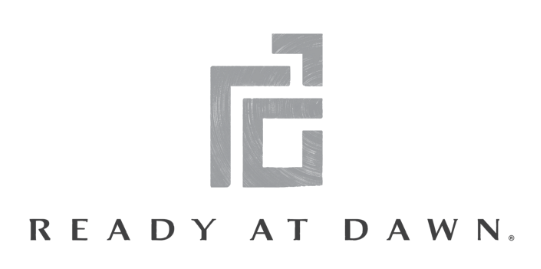][Ready at Dawn Studios]

[@AndreaPessino] have announced that [Ready At Dawn Studios] is hiring:

- [contractors with preferred experience in Rust (remote)][rad_job_1]
- [and simulation/physics coder (on-site)][rad_job_2].

See the linked Twitter threads for details.

[Ready at Dawn Studios]: https://readyatdawn.com
[@AndreaPessino]: https://twitter.com/AndreaPessino

[rad_job_1]: https://twitter.com/AndreaPessino/status/1219341435238895616
[rad_job_2]: https://twitter.com/AndreaPessino/status/1223023108929409024

## [Rustacean Station: Rust for AAA Game Dev][Rustacean Station]

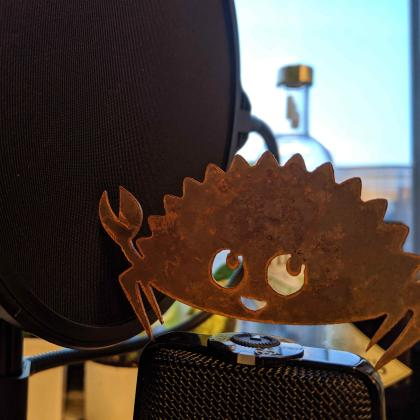

[Jake Shadle], a veteran of DICE/Frostbite,
was interviewed at [RustFest 2019] by the [Rustacean Station] podcast
on using Rust for game development at Embark Studios.
Topics/timestamps:

- \[01:25] What is yours (and Embark’s) background in game development?
- \[02:14] What is the relevance of the Frostbite engine
  and what is your experience with it?
- \[04:15] What makes you think that Rust as a language is suitable
  for game development?
- \[06:13] How is parallelism employed in a game engine
  on the scale of Frostbite?
- \[07:07] Where is the Rust library ecosystem lacking for your use case,
  and what crates are you making use of?
- \[11:13] Why is Embark interested in WebAssembly?
- \[14:20] How can someone get in touch or learn more about Embark?

[Listen the eposide here][Rustacean Station].

[Rustacean Station]: https://rustacean-station.org/episode/011-jake-yoshua-stjepan
[RustFest 2019]: https://barcelona.rustfest.eu
[Jake Shadle]: https://twitter.com/Ca1ne

## Game Updates

### [Veloren][veloren]


> ^ Morning landscape

[Veloren][veloren] is an open world, open-source voxel RPG
inspired by Dwarf Fortress and Cube World.

At the end of January, Veloren 0.5 was released!
Most of January was spent on preparing for this.
It was also the first anniversary of This Week in Veloren!
There has been a devblog each week since the end of January last year.
Here are some of the big changes in this release:

```text
- Added initial region system implementation
- Added moon and clouds
- Added proper SFX system
- Added changelog
- Added Scrolling Combat Text (SCT) & Settings for it
- Added options to disable clouds and to use cheaper water rendering
- Added client-side character saving
- Added a localization system to provide multi-language support to voxygen
- Added fullscreen and window size to settings so that they can be persisted
- Added coverage based scaling for pixel art 28 new mobs
- Added waypoints
- Added pathfinding to NPCs
- Overhauled NPC AI
- Pets now attack enemies and defend their owners
- Added collars to tame wild animals
```

You can read more about some specific topics:

- [How to Effectively Write a Proposal for the Game Design Team](https://veloren.net/devblog-49#how-to-effectively-write-a-proposal-for-the-game-design-team-by-silentium)
- [Iterator Problems](https://veloren.net/devblog-50#iterator-problems-with-angelonfira-and-sharp)
- [Erosion Worldgen Updates](https://veloren.net/devblog-50#erosion-worldgen-updates-by-sharp)
- [Airshipper Progress](https://veloren.net/devblog-52#airshipper-progress-by-songtronix)
- [Veloren For All Of Us: Localization System](https://veloren.net/devblog-52#veloren-for-all-of-us-localization-system-by-ender)
- [1 Year of This Week in Veloren](https://veloren.net/devblog-52#1-year-of-this-week-in-veloren-by-angelonfira)


In February, the developers hope to push forward to 0.6
with a strong intro meeting.
Authentication is slated to be released, as well as the Airshipper GUI beta.
Hopefully, we also see controller support and improvements
to the sound system as well.

January's full weekly devlogs: "This Week In Veloren...":
[#49](https://veloren.net/devblog-49),
[#50](https://veloren.net/devblog-50),
[#51](https://veloren.net/devblog-51),
[#52](https://veloren.net/devblog-52).

[veloren]: https://veloren.net

### [Physically Based Temperature Simulation For Games][temperature-simulation]

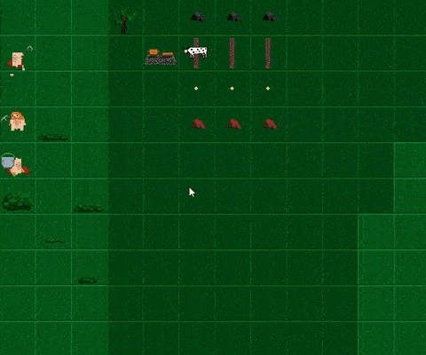

[Alexandru Ene] is working on a dwarf colony management game.
This month, a
["Physically Based Temperature Simulation For Games"][temperature-simulation]
devlog was released:
how to adapt real-world thermodynamics formulas to a game
and why you may want to do it?

[Alexandru Ene]: https://alexene.dev
[temperature-simulation]: https://alexene.dev/2020/01/10/Physically-based-temperature-simulation-for-games.html

### [Micro Entertainment Pack][micro-pack]

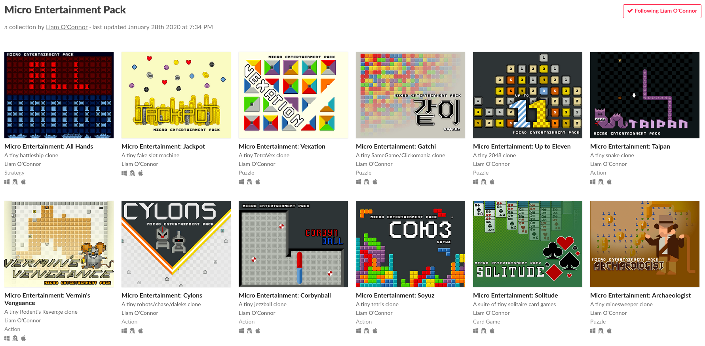

[Micro Entertainment Pack][micro-pack] is a collection of 12 tiny desktop games
by [Liam O'Connor].

> I like to watch terrible TV shows on my computer,
> but often they tend to drag so I like to have something else to do
> at the same time.
> Thus, I developed the Micro Entertainment Pack --- fun casual games
> that fit in a fraction of your screen real estate.
> These games are inspired mostly by the Microsoft Plus! Entertainment packs
> for Windows, but I am also throwing in some other
> enjoyable titles from my days as a classic mac user.

All games in the pack are made using Liam's [tesserae] library for graphics composed
out of 8x8 2 colour tiles.
All graphics were drawn using the tesseraed editor that comes with the library.
All games use a common tileset to do all of their graphical drawing.

[The source code for all games is available here.][micro-pack-src]

[Liam O'Connor]: https://twitter.com/kamatsu8
[micro-pack]: https://itch.io/c/707330/micro-entertainment-pack
[micro-pack-src]: https://github.com/liamoc/desktop_games
[tesserae]: https://crates.io/crates/tesserae

### [Scale][scale]

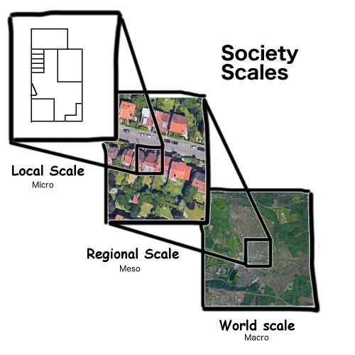

[Scale][scale] is a new open-source project about modern day society simulation
from the bottom-up.

> Each individual has its own thought model, meaning every action
> has its importance and influences the environment.
> Scale is not a video game, but rather a live artwork.
> The world itself won't be generated or created by the user
> but is part of the project.
> That way, the focus is on the world itself and not on the tools to build it.

Also, check out
[the first devlog about the author's motivation and vision][scale-devlog].

_Discussions:
[/r/rust_gamedev](https://reddit.com/r/rust_gamedev/comments/em8zon/introducing_scale)_

[scale]: https://github.com/Uriopass/Scale
[scale-devlog]: http://douady.paris/blog/scale_1.html

### Colony Genesis - ASCII Ant Colony Sandbox

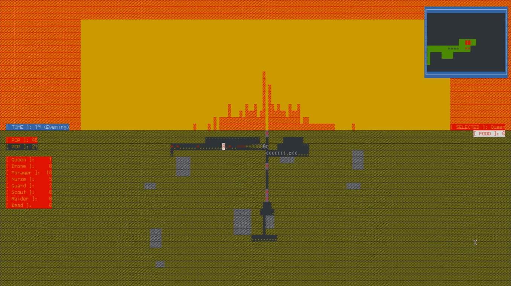

[Native Systems] is working on a "Colony Genesis" ant colony sandbox game.

Current features:

- Procedurally generated world
- Day/night cycle and weather
- Temperature, humidity, and fluid simulation
- Food sources including aphid and fungus harvesting
- 6 castes governing ant behavior and attributes

[Watch 5 minutes of initial gameplay here](https://streamable.com/wv5ee).

_Discussions:
[/r/rust_gamedev](https://reddit.com/r/rust_gamedev/comments/eow23i/ascii_ant_colony_sandbox)_

[Native Systems]: https://nativesystems.rs

### [Snake Game With Rust, JavaScript, and WebAssembly][snake-course]


[@jeremylikness] started publishing a course
["Snake Game With Rust, JavaScript, and WebAssembly"][snake-course].

> We will learn how to export API implemented with Rust to JavaScript app.
> We will get to know canvas rendering, applications of vectors,
> and basics of game development.

At the moment, the series consists of six articles (of eight planned):

1) [Game Architecture](https://medium.com/@geekrodion/snake-game-with-rust-javascript-and-webassembly-929f79efc78f)
2) [Creating Game Instance](https://medium.com/@geekrodion/snake-game-with-rust-javascript-and-webassembly-part-2-9d729b87c186)
3) [Rendering the Game](https://medium.com/@geekrodion/snake-game-with-rust-javascript-and-webassembly-part-3-94b618db74a3)
4) [Placing the Food](https://medium.com/@geekrodion/snake-game-with-rust-javascript-and-webassembly-part-4-1f20ab2638c4)
5) [Game Loop](https://medium.com/@geekrodion/snake-game-with-rust-javascript-and-webassembly-part-5-7c114ce4583a)
6) [Moving the Snake](https://medium.com/@geekrodion/snake-game-with-rust-javascript-and-webassembly-part-6-274a0f9bbbfe)

The source code can be found [in this repo][snake-course-src]
and you can [check out the game itself here][snake-course-play].

[@jeremylikness]: https://twitter.com/jeremylikness
[snake-course]: https://medium.com/@geekrodion/snake-game-with-rust-javascript-and-webassembly-5e22b357ec7b
[snake-course-src]: https://github.com/RodionChachura/rust-js-snake-game
[snake-course-play]: https://rodionchachura.github.io/rust-js-snake-game/

### [12 Seconds Awake][12sec]

[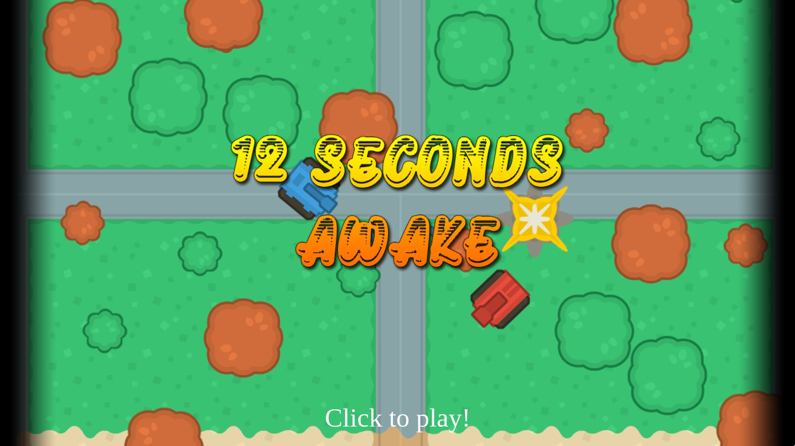][12sec]

["12 Seconds Awake"][12sec] by [@PsichiX] is a small 2D top-down
physics-based tank war game with worms-like turn mechanics
written using [Oxygengine] (see "Oxygengine" section below).

[The source code is available here.][12sec-src]

_Discussions:
[/r/rust_gamedev](https://reddit.com/r/rust_gamedev/comments/eljrq2/12_seconds_awake_web_game_made_in_rust)_

[12sec]: http://12-seconds-awake.psichix.io
[12sec-src]: https://github.com/PsichiX/Oxygengine/tree/master/demos/demo-web-game
[@PsichiX]: https://twitter.com/PsichiX
[Oxygengine]: https://github.com/PsichiX/Oxygengine

### Tennis Academy: Dash

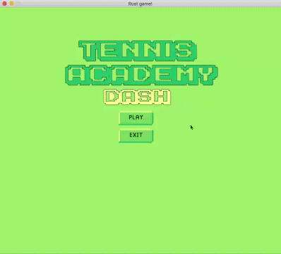

[@oliviff] released [v0.1.5 version][tennis-v0-1-5]
of "Tennis Academy: Dash":

- 🍜 the puppy has a bowl
- 🛁 code refactoring and using clippy
- 💯 UI displaying score and other info

[@oliviff]: https://twitter.com/oliviff
[tennis-v0-1-5]: https://twitter.com/oliviff/status/1218632638136754182

### [COWs][cows-itch]

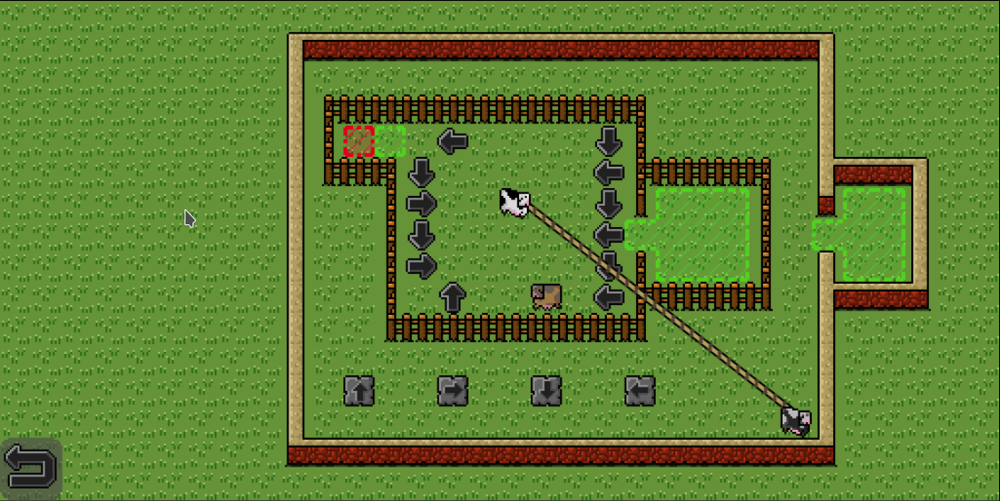

Another Game Off submission: [COWs][cows-itch] is a WIP puzzle game
about turning complete cows.

> Welcome to the Logically Executed Automatic Paddock, or LEAP for short,
> where we keep our cows. Whoops, did I say cow? I meant to say COW.
> That stands for "Carry On Walking".
>
> I suppose all of our COWs happen to be cows too. What a coincidence!
>
> Our COWs are bound together to solve puzzles. Some of our COWs
> are advanced enough that we call them COmputational Workers (COW for short).
> It's a logical LEAP, but you're BOUND to get it.

[The source code is available here.][cows-src]

[cows-itch]: https://pilotinpyjamas.itch.io/cows
[cows-src]: https://github.com/andymac-2/leaps-bounds

### Noodle Cat

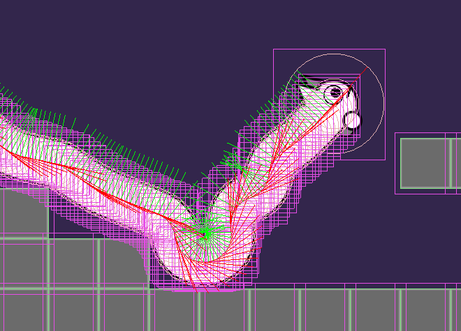

[@Fryer00] tweeted a bunch of updates about their WIP Box2D physics game prototype:

- [snake kinematics](https://twitter.com/Fryer00/status/1212597726606692353) and
  ["air swimming" force](https://twitter.com/Fryer00/status/1217924172346728449);
- 🐾 [paws grabbing](https://twitter.com/Fryer00/status/1216229512238829568) and
  [animation](https://twitter.com/Fryer00/status/1218167388165885952);
- [Harfbuzz-based text renderer](https://twitter.com/Fryer00/status/1219320622544838659);
- [debug rendering](https://twitter.com/Fryer00/status/1213770289999437825) and
  [interactive debugging settings](https://twitter.com/Fryer00/status/1220850604647555078);
- [extending](https://twitter.com/Fryer00/status/1222794916646006784).

[@Fryer00]: https://twitter.com/Fryer00

### Urban Myth

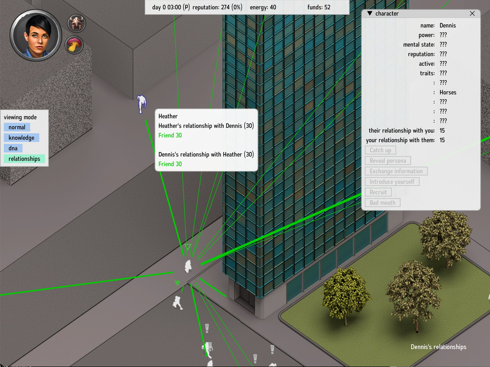

[@cmd_tea] tweeted about the progress
of their [Allegro][RustAllegro]-based superhero-themed game
"Urban Myth" (working title):

- [Different viewing modes: normal, dna, knowledge, relationships](https://twitter.com/cmd_tea/status/1218584171863519234);
- [Updated UI](https://twitter.com/cmd_tea/status/1216809496066121740).

[@cmd_tea]: https://twitter.com/cmd_tea
[RustAllegro]: https://github.com/SiegeLord/RustAllegro

### [Akigi][akigi]

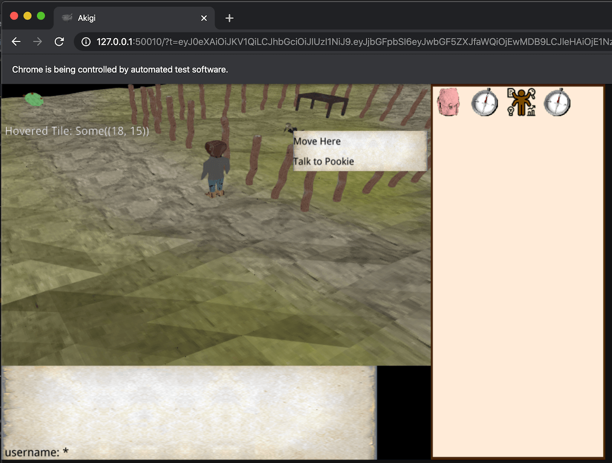

> [Akigi][akigi] is a multiplayer online world where most believe that
> humans are inferior.

Some of January's updates:

- Autonomous NPC architecture & movement;
- New capuchin rigged mesh and animation;
- Chasing and basic combat system;

Full January's devlogs:
[#049](http://devjournal.akigi.com/january-2020/2020-01-05.html),
[#050](https://devjournal.akigi.com/january-2020/2020-01-12.html),
[#051](https://devjournal.akigi.com/january-2020/2020-01-19.html),
[#052](https://devjournal.akigi.com/january-2020/2020-01-26.html).

[akigi]: https://akigi.com

### [Split][split-itch]

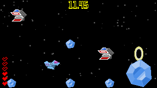

[Another entry for the Games Made Quick jam from @Mistodon][split-twitter].

[Split][split-itch] is a game about outrunning a supernova
and using time travel to improve your chances.

> In the middle of using time travel to research a dying star,
> you find yourself fleeing from a supernova.
> I know, who would have guessed.
>
> On the route to safety are three When Points - time traveling stations.
> This means you can retry your journey between them as many times as you like.
> The faster you move between them, the further from danger you are.

Features:

- 3 extremely high speed stages
- Multiple variants of stages, depending on how quickly you reach them
- 5 different ending epilogues, based on your completion time

[Check out a gameplay video here][split-video].

[split-itch]: https://mistodon.itch.io/split
[split-twitter]: https://twitter.com/Mistodon/status/1216525697398853632
[split-video]: https://youtube.com/watch?v=8E0PKetLEdo

### [Antorum]

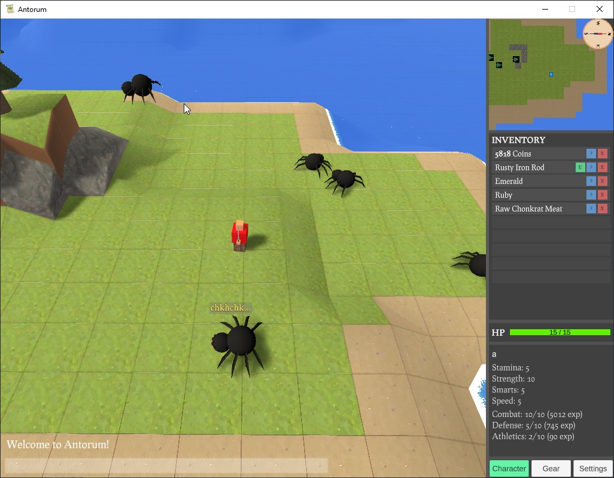

[Antorum] is a multiplayer RPG where players build their characters
and fight against the growing threats on the isle.
The game server is authoritative and written in Rust,
while the client is written in Unity/C#.

This month, [@dooskington] published a bunch of devlogs:

- [#14 "Equipment"](https://dooskington.com/dev-log/14);
- [#15 "Trees"](https://dooskington.com/dev-log/15);
- [#16 "Terrain + Minimap Update"](https://dooskington.com/dev-log/16);
- [#17 "Data Driven Entity Updates"](https://dooskington.com/dev-log/17);

[Antorum]: https://dooskington.com
[@dooskington]: https://twitter.com/dooskington

### [Amethyst] Games

[][Amethyst]

- [Realm.One][realm.one] is a new open-source tile-based game
  written using the Amethyst game engine.
  It is the first game that will be integrated
  into [the distributed MMO platform Worlds][worlds].

  Meet the first devlog:
  ["Adventures with Rust - Game Development"][realm.one-article]
  \[[/r/rust_gamedev](https://reddit.com/r/rust_gamedev/comments/eljx1s/adventures_with_rust_game_development)];

  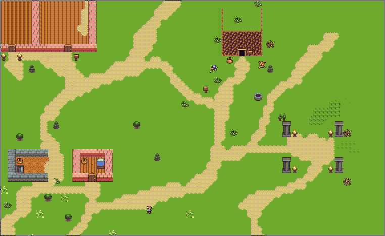

- [Azriel] published an ["I Choose UI"][will-devlog] devlog:

  - Character selection UI lists all available characters,
    with player selections highlighted.
  - Map selection UI lists all available maps, with a selection highlight.

  [Demo video](https://youtube.com/watch?v=z2KG_prMJ1c).

  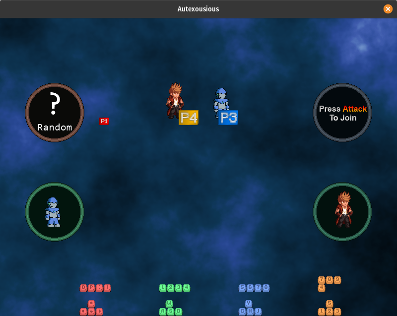

- [@mvlabat shared a video][grumpy-video] about the evolution
  of a fragment shader for a magic missile in [Grumpy Visitors][grumpy];

  [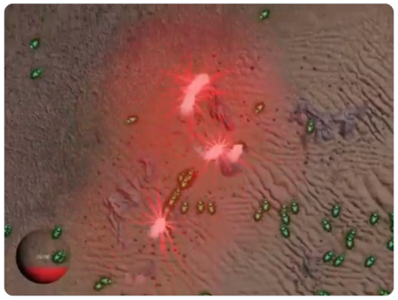][grumpy-video]

- ["Wall Jump"][wall] by [@legendiguess] is a simple game for WeeklyGameJam.

  > Nothing special, just a two minutes adventure of a Wall.
  > Collect wall putty and return back to the house.

  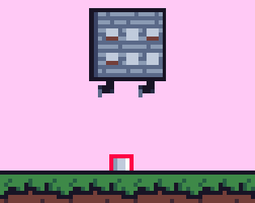

[Amethyst]: https://amethyst.rs
[realm.one]: https://github.com/Machine-Hum/realm.one
[realm.one-article]: https://medium.com/@ryan.cjw/adventures-with-rust-game-development-1d998c45381c
[worlds]: https://github.com/Machine-Hum/Worlds
[Azriel]: https://azriel.im
[will-devlog]: https://azriel.im/will/2020/01/31/i-choose-ui
[@mvlabat]: https://github.com/mvlabat
[grumpy]: https://github.com/amethyst/grumpy_visitors
[grumpy-video]: https://twitter.com/mvlabat/status/1219341273573863425
[wall]: https://legendiguess.itch.io/wall-jump
[@legendiguess]: https://twitter.com/legendiguess

## Library & Tooling Updates

### Rust 1.41: [Profile Overrides][overrides] are Stable Now!


Though it wasn't mentioned in [the official announcement post][rust-1-41],
Rust 1.41 brings a cargo feature
that many gamedevs have been waiting a long time for:
[profile overrides][overrides].

This feature allows you to:

- Use optimized deps in debug build to reduce incremental build time
  and get a sane FPS.

  > To override the settings for all dependencies
  > (but not any workspace member), use the "*" package name:
  >
  > ```toml
  > [profile.dev.package."*"]
  > opt-level = 2
  > ```

- Do not optimize build-dependencies (like `syn`) to increase
  full release build time:

  ```toml
  [profile.release.build-override]
  opt-level = 0
  ```

_Discussions:
[/r/rust_gamedev](https://reddit.com/r/rust_gamedev/comments/ew9pis/profile_overrides_are_stable_now),
[/r/rust](https://reddit.com/r/rust/comments/ew8htz/announcing_rust_1410_rust_blog)_

[overrides]: https://doc.rust-lang.org/cargo/reference/profiles.html#overrides
[rust-1-41]: https://blog.rust-lang.org/2020/01/30/Rust-1.41.0.html

### [Adventuring into the World of Games in Rust][gamedev-rust]

[@MontyPatrick] shared their initial experience of diving into Rust GameDev
in the ["Adventuring into the World of Games in Rust"][gamedev-rust] blog post.

> Overall, while things are still relatively new in developing games in Rust
> I believe that Rust can serve as a great alternative
> to languages such as C++ in the field of game development.

[gamedev-rust]: https://phoward.me/introduction/rust/game-development/2020/01/27/gamedev-rust.html
[@MontyPatrick]: https://twitter.com/MontyPatrick

### [Translating Quake 3 into Rust][q3-rust]

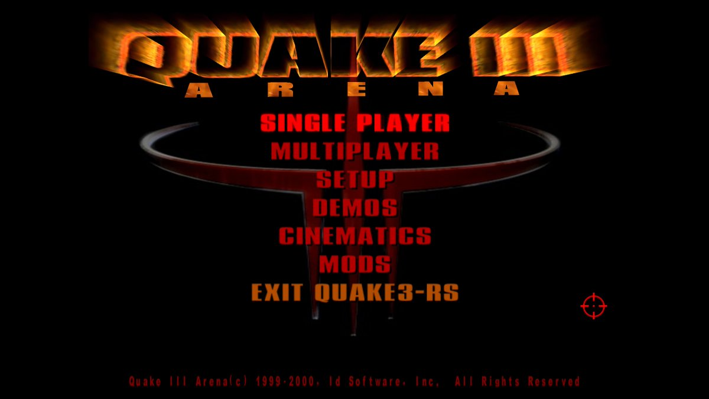

[Immunant] published an article ["Translating Quake 3 into Rust"][q3-rust]:

> The Rust-loving team at [Immunant] has been hard at work on [C2Rust][c2rust],
> a migration framework that takes the drudgery out of migrating to Rust.
> Our goal is to make safety improvements to the translated Rust automatically
> where we can, and help the programmer do the same where we cannot.
> First, however, we have to build a rock-solid translator that gets
> people up and running in Rust.
> Testing on small CLI programs gets old eventually, so we decided
> to try translating Quake 3 into Rust.
> After a couple of days, we were likely the first people to ever play
> Quake3 in Rust!

Check out a
[video of transpiling Q3, loading the game and playing it][q3-rust-video].

_Discussions:
[/r/rust](https://reddit.com/r/rust/comments/el2z0k/translating_quake_3_into_rust),
[/r/programming](https://reddit.com/r/programming/comments/elc0f9/translating_quake_3_into_rust),
[Hacker News](https://news.ycombinator.com/item?id=21979555)_

[q3-rust]: https://immunant.com/blog/2020/01/quake3
[Immunant]: https://immunant.com
[c2rust]: https://c2rust.com
[q3-rust-video]: https://youtube.com/watch?v=lQjvSJLDXW4

### [Rust Code in Unreal Engine][rust-unreal]

[A short blog post][rust-unreal] by @ejmahler about getting Rust code
integrated into Unreal Engine.

> I’ve written a full writeup [here][rust-unreal-src], which includes
> a full demo project and all the necessary engine changes.
> You’ll need to be logged into GitHub with an account that has access
> to the Unreal Engine source code.
> If not, the link will look like a 404 – but it’s easy
> to [request access][epic-access].
>
> As a quick summary of features I’ve found to work:
>
> - Compiling a Rust crate as an Unreal Engine Module
> - C++ Unreal modules linking to our Rust crate
> - Automatic rebuilding C++ and binaries that depend on Rust code
>   when that Rust code changes

_Discussions:
[/r/rust](https://reddit.com/r/rust/comments/emp0su/proof_of_concept_rust_code_in_unreal_engine)_

[rust-unreal]: https://ejmahler.github.io/rust_in_unreal
[rust-unreal-src]: https://github.com/ejmahler/UnrealEngine/blob/rust-modules/RustPost/RustInUnreal.md
[epic-access]: https://github.com/EpicGames/Signup

### [Writing a 4K Intro in Rust][4k-intro]

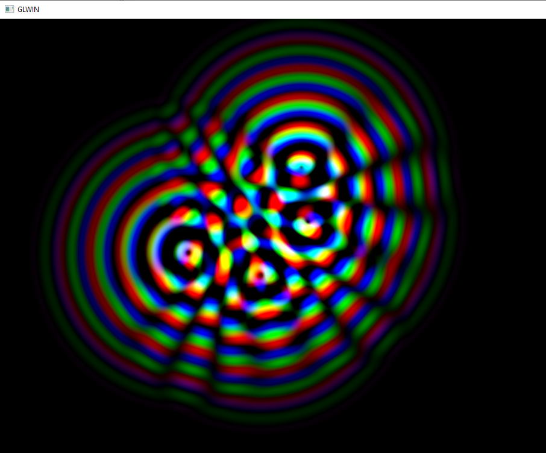

Jani Peltonen has published an article ["Writing a 4K intro in Rust"][4k-intro]:

> For now I have a simple intro that initializes a modern OpenGL context
> in Win32 and puts up a relatively simple shader.
> The compressed size is <2Kbytes which, I think,
> validates Rust as viable language for writing 4K intros.

[The source code is available here.][4k-src]

_Discussions:
[/r/rust](https://reddit.com/r/rust/comments/enbbxu/writing_a_4k_intro_in_rust)_

[4k-intro]: https://codeslow.com/2020/01/writing-4k-intro-in-rust.html
[4k-src]: https://github.com/janiorca/tinywin/tree/master/miniwinGL

### 3D Graphics in Your Browser with Rust and WASM

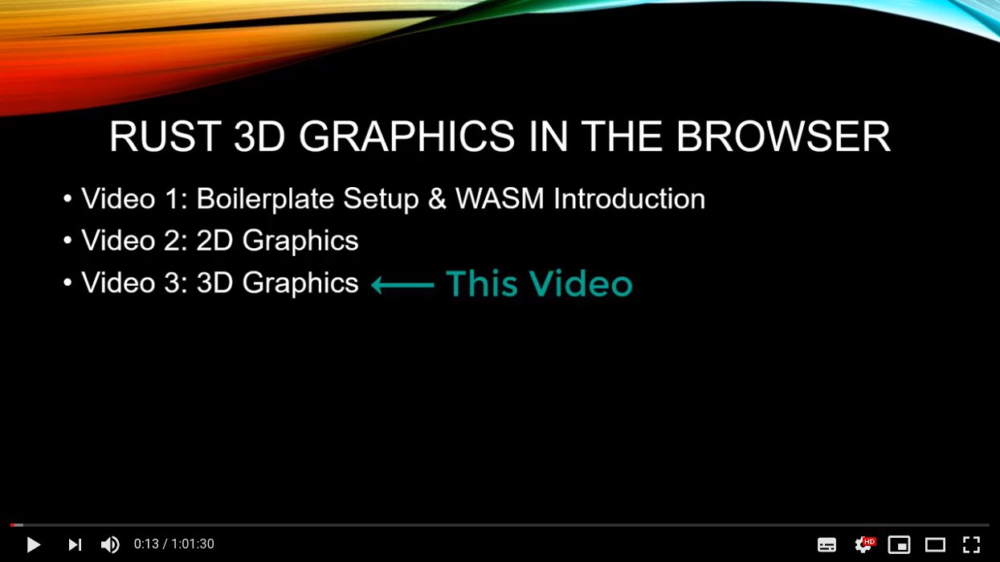

Doug Milford released three tutorial videos:

- ["Boilerplate Setup and WASM Introduction"](https://youtube.com/watch?v=p7DtoeuDT5Y)
- ["2D Graphics"](https://youtube.com/watch?v=kjYCSySObDo)
- ["3D Graphics"](https://youtube.com/watch?v=K63uBfs1K7Y)

[The source code can be found here.][rust-wasm-3d-src]

[rust-wasm-3d]: https://youtu.be/p7DtoeuDT5Y
[rust-wasm-3d-src]: https://github.com/dmilford/rust-3d-demo

### [discord_game_sdk]

[discord_game_sdk] in an _unofficial_ safe interface to the [Discord Game SDK].

The [Discord Game SDK] provides features such as, but not limited to:

- Activities (Rich Presence)
- Users, Avatars and Relationships
- Lobbies, Matchmaking and Voice communication
- Faux-P2P Networking on Discord's Infrastructure
- Cloud Synchronized Storage
- Store Transactions
- Achievements

[discord_game_sdk]: https://github.com/ldesgoui/discord_game_sdk
[Discord Game SDK]: https://discordapp.com/developers/docs/game-sdk/sdk-starter-guide

### [Optimath]

[Optimath] by [@djugei]
is an experimental const generics based linear algebra library
that works without any allocations in no_std and utilizes SIMD.
_Requires nightly toolchain._

Project goals:

> Besides being hopefully useful as a library it is also
> an exploration of rusts newer advanced type system features.
> It is therefore an explicit goal to provide feedback
> to the developers of those features.
> [The `insights` module][optimath-insights] contains some of that.
>
> It is also meant to explore the design space
> of Linear Algebra libraries that utilize those features.
> As such it may serve as inspiration for how bigger linalg libraries
> might adopt them.

[Check out a detailed v0.3 announcement post][optimath-0-3-0].

_Discussion:
[/r/rust](https://reddit.com/r/rust/comments/eo4ury/show_rrust_optimath_linear_algebra_with_const)_

[Optimath]: https://github.com/djugei/optimath
[optimath-0-3-0]: https://djugei.github.io/optimath-0-3-0
[optimath-insights]: https://docs.rs/optimath/0.3.0/optimath/insights/index.html
[@djugei]: https://djugei.github.io

### [keyframe] - Animation Library for Rust

[keyframe] is a simple library for animation.

Features:

- Several [easing functions][easings], including user-defined Bézier curves
  and keyframable curves;
- Animation sequences;
- [mint] integration for 2D/3D/4D support (points, rectangles, colors, etc)

Animation sequences example:

```rust
use keyframe::{keyframes, Keyframe, AnimationSequence};

fn example() {
    // (value, time) or (value, time, function)
    let mut sequence = keyframes![
         (0.5, 0.0), // <-- EaseInOut used from 0.0 to 0.3
         (1.5, 0.3, Linear), // <-- Linear used from 0.3 to 1.0
         (2.5, 1.0) // <-- Easing function here is never used, since we're at the end
    ];

    sequence.advance_by(0.65);

    assert_eq!(sequence.now(), 2.0);
    assert_eq!(sequence.duration(), 1.0);
}
```

[mint]: https://github.com/kvark/mint
[easings]: https://easings.net/en
[keyframe]: https://github.com/HannesMann/keyframe

### [rltk_rs v0.6][rltk-v0-6] & [Roguelike Tutorial][rl-book]

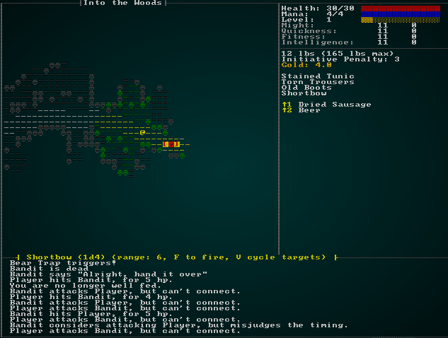

[The Roguelike Tutorial][rl-book] continues to grow:
chapter [#70 "Missiles and Ranged Attacks"][rl-book-70] was added to the book.
It adds targeting, ranged weaponry, AI that shoots back,
and projectile particles to the mix.

[Check out an online demo here.][rl-book-70-demo]

[rl-book-70]: http://bfnightly.bracketproductions.com/rustbook/chapter_70.html
[rl-book-70-demo]: http://bfnightly.bracketproductions.com/rustbook/wasm/chapter-70-missiles
[rl-book]: http://bfnightly.bracketproductions.com/rustbook
[@blackfuture]: https://patreon.com/blackfuture

------

[rltk_rs] by [@blackfuture] is a Rust implementation of
[C++ Roguelike Toolkit][rltk-cpp].

This month [rltk_rs v0.6][rltk-v0-6] was released. Some of the updates:

- Breaking changes: usize for indexing, cargo features rename,
  TryInto in generic functions, and a few more;
- "sticky" ctrl/alt/shift modifiers;
- more auto-derived traits;
- performance optimizations & bugfixes;
- updated examples.

[rltk_rs]: https://github.com/thebracket/rltk_rs
[rltk-cpp]: https://github.com/thebracket/rltk
[rltk-v0-6]: https://reddit.com/r/roguelikedev/comments/etiywv/sharing_saturday_295/ffi13dw/

### [Implementing a Turn-Based Game in an ECS with SPECS-Task][tbs-ecs]

[@bonsairobo] published an article
["Implementing a Turn-Based Game in an ECS with SPECS-Task"][tbs-ecs]:

> I’ve heard from a few people who are just getting started with
> entity component systems (ECS) that implementing logic for a turn-based game
> seems more complicated than it should be.
> I thought that seemed odd, but I just recently ran into this problem myself.
> While certainly not insurmountable, implementing turn-based logic
> in an ECS just doesn’t feel great.
> I think the reason is that no one likes to implement a loop
> via distributed state machines.

[tbs-ecs]: https://medium.com/@bonsairobo/implementing-a-turn-based-game-in-an-entity-component-system-with-specs-task-d7f3358198b4
[@bonsairobo]: https://medium.com/@bonsairobo

### [flukejones/ecs_bench]

[@flukejones] forked an old Rust ECS benchmark set
and updated it to show some of the more recent ECS around:
[tiny_ecs], [hecs], and [legion]: [flukejones/ecs_bench].

[@flukejones]: https://twitter.com/flukejones
[flukejones/ecs_bench]: https://github.com/flukejones/ecs_bench
[tiny_ecs]: https://gitlab.com/flukejones/tiny_ecs
[hecs]: https://github.com/Ralith/hecs
[legion]: https://github.com/jaynus/legion

### [awesome-wgpu]

[awesome-wgpu] is a new curated list of [wgpu]-related links:
learning resources, games, app, articles, etc.

[awesome-wgpu]: https://github.com/rofrol/awesome-wgpu
[wgpu]: https://github.com/gfx-rs/wgpu-rs

------

Also, check out a new `wgpu-rs`-based ios app:


> [Mao Brush] realistically simulated the writing effect of
> Chinese brush + rice paper, the focus is on bringing
> the traditional Chinese calligraphy art to the digital age.
>
> The WebGPU-based (wgpu-rs) brush engine uses the LBM fluid simulation
> to achieve the unique expression of the brush.
> You can use it to experience the splash of Chinese calligraphy anytime,
> anywhere, and create brush calligraphy works.

[Mao Brush]: https://apps.apple.com/us/app/id1492608770

### [crow] v0.1

[crow] is a simple and efficient pixel based 2D graphics library.
It's designed to be easy to use and should allow users
to do nearly everything they want
without requiring custom renderers or unsafe code.

[crow]: https://crates.io/crates/crow

### [luminance v0.38][luminance]

[luminance] by [@phaazon] is a type-safe, type-level and stateless
graphics framework.

This month [luminance v0.38][luminance] got released.
Among the changes:

- The `Mode::Patch` tessellation primitive.
- The pipelines can now be customized in deeper ways
  (besides clear color, one can enable or disable clearing color buffer,
  depth buffer, sRGB framebuffers, dynamic viewport, etc.).
- sRGB textures.
- Framebuffers now accept a Sampler to control how their associated textures
  will be sampled.
- [A cool displacement mapping example][luminance-displacement].

A complete changes list can be found [in the CHANGELOG][luminance-changelog].

Also, the luminance book got updated: [check it out here][learn-luminance].

_Discussions:
[/r/rust](https://reddit.com/r/rust/comments/ejys2l/official_announcement_release_of_luminance038)_

[@phaazon]: https://twitter.com/phaazon_
[luminance]: https://github.com/phaazon/luminance-rs
[luminance-changelog]: https://github.com/phaazon/luminance-rs/blob/master/luminance/CHANGELOG.md#038
[luminance-displacement]: https://github.com/phaazon/luminance-rs/blob/master/docs/imgs/displacement_map.gif
[learn-luminance]: https://rust-tutorials.github.io/learn-luminance

------

[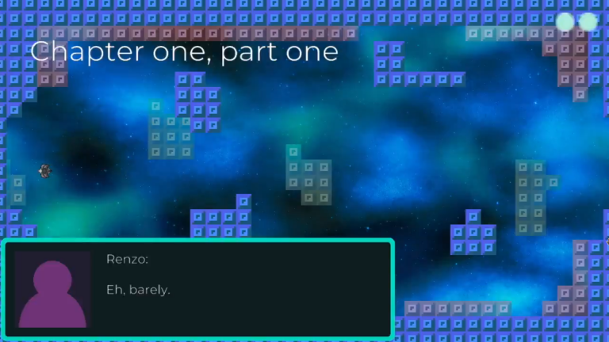][resinten-video]

Btw, [@resinten] continues working on a luminance-based game:

- extra parallax layers,
- a basic UI with placeholder art,
- dialog system,
- updated player movement,
- music.

[Check out a WIP gameplay video here][resinten-video].

[@resinten]: https://twitter.com/resinten
[resinten-video]: https://twitter.com/resinten/status/1213569285496410116

### [SPIR-Q][spir-q] v0.4.1

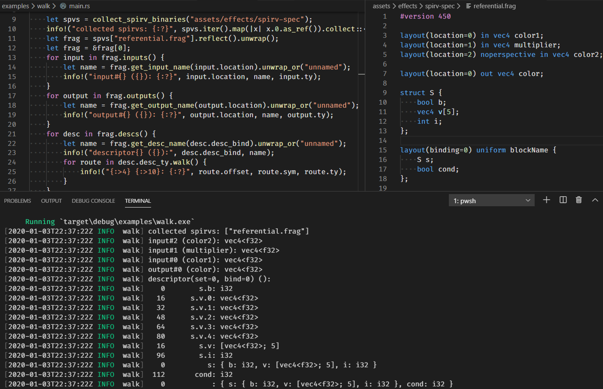
_Example walking an entry point of a SPIR-V file_

[SPIR-Q][spir-q] is a lightweight [SPIR-V] query library.
This month v0.2..v0.4.1 versions were released:

- SPIR-Q is now more handy with better and easier reflection information accessors;
- component number for shared-location interface variables;
- separable sampler types;
- descriptor access type query & multibinding for all descriptors;
- new examples, bugfixes, and significant performance improvements.

[spir-q]: https://github.com/PENGUINLIONG/spirq-rs
[SPIR-V]: https://en.wikipedia.org/wiki/Standard_Portable_Intermediate_Representation

### [glsl v4.0][glsl-ann]

[glsl] is a crate to parse GLSL formatted sources into a typed AST.

[glsl-4.0 and glsl-quasiquote got released this month][glsl-ann].
Some of the updates:

- support for two backward-compatible keywords: attribute and varying
  (allows parsing GLSL450);
- binary operands are now parsed as left-associative.

_Discussions:
[/r/rust](https://reddit.com/r/rust/comments/eklo6l/official_announcement_glsl40)_

[glsl-wiki]: https://en.wikipedia.org/wiki/OpenGL_Shading_Language
[glsl-ann]: https://reddit.com/r/rust/comments/eklo6l/official_announcement_glsl40
[glsl]: https://crates.io/crates/glsl

### [Oxygengine][oxygengine]


This month [Oxygengine][oxygengine] got
[JavaScript scripting interface][oxygengine-js-ann]
to allow faster prototyping of games.

> This prebuilt WASM version would let game devs with JS background
> to quickly prototype game ideas and then slowly move their logic
> into Rust implementation, while learning Rust meantime.

Example source code: [oxygengine-js/js/index.js].

Also, you can now [instantiate entities from prefab assets][oxygengine-inst].

[oxygengine]: https://github.com/PsichiX/Oxygengine
[oxygengine-js-ann]: https://reddit.com/r/rust_gamedev/comments/epupkb/oxygengine_pure_js_scripting_backend_for_quick
[oxygengine-js/js/index.js]: https://github.com/PsichiX/Oxygengine/blob/master/oxygengine-js/js/index.js
[oxygengine-inst]: https://reddit.com/r/rust/comments/eunppk/oxygengine_instantiate_entities_from_prefab_assets

### [miniquad]

[miniquad] by [@fedor_games] is a safe cross-platform rendering library
focused on portability and low-end platforms support.

Some of this month's updates:

- [first crates.io version][miniquad-crates-io];
- native macOS support;

[miniquad]: https://github.com/not-fl3/miniquad
[miniquad-crates-io]: http://crates.io/crates/miniquad
[@fedor_games]: https://twitter.com/fedor_games

### [MuOxi] - Modern [MUD] Engine


[MuOxi] is a modern library for creating [online multiplayer text games][MUD]
(MU* family) using the powerful features offered by Rust;
backed by Tokio and Diesel.

Current Status:

> There is a working TCP server that allows for multiple connections
> and handles them accordingly.
> Effort is focused at the moment in designing the database architecture
> utilizing Diesel with PostgreSQL backend.

_Discussions:
[/r/rust](https://reddit.com/r/rust/comments/ekwvay/muoxi_a_modern_mud_engine_in_rust)_

[MuOxi]: https://github.com/duysqubix/MuOxi
[MUD]: https://en.wikipedia.org/wiki/MUD

### [This Month in Mun - January 2020][mun-january]

[][Mun]

[Mun] is a scripting language for gamedev focused
on quick iteration times that is written in Rust.

[January updates][mun-january] include:

- [vscode plugin](https://marketplace.visualstudio.com/items?itemName=0x9ef.vscode-mun);
- use extern functions in dispatch table;
- add marshalling of structs;
- add struct as marshallable field type;
- bugfixes and improved test coverage.

[Mun]: https://mun-lang.org
[mun-january]: https://mun-lang.org/blog/2020/01/31/this-month-january

### [nestur] NES Emulator

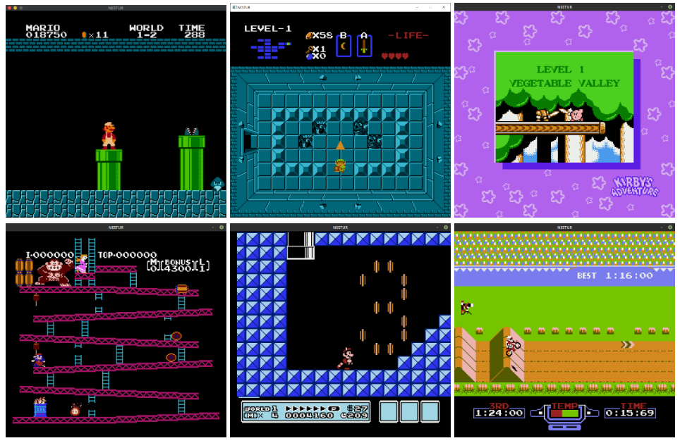

[nestur] is yet another NES emulator.
It's mostly an educational project but it's usable.

- SDL2 is the only dependency
- no use of unsafe
- NTSC timing
- supports mappers 0-4 which cover ~85% of games

_Discussions:
[/r/rust](https://reddit.com/r/rust/comments/ewqiuh/nestur_nes_emulator_in_rust)_

[nestur]: https://github.com/spieglt/nestur

## Popular Workgroup Issues in Github

<!-- Up to 10 links to interesting issues -->

- [rust-gamedev/wg](https://github.com/rust-gamedev/wg):
  - [#71 "Proof Of Concept Crate: Simplistic Bump Allocator"](https://github.com/rust-gamedev/wg/issues/71);
  - [#81 "Meetings On Discord?"](https://github.com/rust-gamedev/wg/issues/81);
  - [#82 "Tracking: Rust All-Hands 2020"](https://github.com/rust-gamedev/wg/issues/82);
  - [#84 "New Charter Proposal Discussion"](https://github.com/rust-gamedev/wg/issues/84);
- [rust-gamedev/arewegameyet](https://github.com/rust-gamedev/arewegameyet):
  - [#210 "Transfer ownership to Rust Gamedev Working Group"](https://github.com/rust-gamedev/arewegameyet/issues/210);
  - [#252 "Split games and resources into categories"](https://github.com/rust-gamedev/arewegameyet/issues/252);

## Meeting Minutes

<!-- Up to 10 most important notes + a link to the full details -->

[See all meeting issues][label_meeting] including full text notes
or [join the next meeting][join].

[label_meeting]: https://github.com/rust-gamedev/wg/issues?q=label%3Ameeting

## Requests for Contribution

<!-- Links to "good first issue"-labels or direct links to specific tasks -->

- [Embark's open issues][embark-open-issues] ([embark.rs]);
- [winit's "Good first issue" and “help wanted” issues][winit-issues];
- [gfx-rs's "contributor-friendly" issues][gfx-issues];
- [wgpu's "help wanted" issues][wgpu-help-wanted];
- [luminance's "low hanging fruit" issues][luminance-fruits];
- [ggez's "good first issue" issues][ggez-issues];
- [Veloren's "beginner" issues][veloren-beginner];
- [Amethyst's "good first issue" issues][amethyst-issues];
- [A/B Street's "good first issue" issues][abstreet-issues];
- [Mun's "good first issue" issues][mun-issues];

[embark.rs]: https://embark.rs
[embark-open-issues]: https://github.com/search?q=user:EmbarkStudios+state:open
[winit-issues]: https://github.com/rust-windowing/winit/issues?utf8=✓&q=is%3Aissue+is%3Aopen+label%3A%22status%3A+help+wanted%22+label%3A%22Good+first+issue%22
[gfx-issues]: https://github.com/gfx-rs/gfx/issues?q=is%3Aissue+is%3Aopen+label%3Acontributor-friendly
[wgpu-help-wanted]: https://github.com/gfx-rs/wgpu-rs/issues?q=is%3Aissue+is%3Aopen+label%3A%22help+wanted%22
[luminance-fruits]: https://github.com/phaazon/luminance-rs/issues?q=is%3Aissue+is%3Aopen+label%3A%22low+hanging+fruit%22
[ggez-issues]: https://github.com/ggez/ggez/labels/%2AGOOD%20FIRST%20ISSUE%2A
[veloren-beginner]: https://gitlab.com/veloren/veloren/issues?label_name=beginner
[amethyst-issues]: https://github.com/amethyst/amethyst/issues?q=is%3Aissue+is%3Aopen+label%3A%22good+first+issue%22
[abstreet-issues]: https://github.com/dabreegster/abstreet/issues?q=is%3Aissue+is%3Aopen+label%3A%22good+first+issue%22
[mun-issues]: https://github.com/mun-lang/mun/labels/good%20first%20issue

## Bonus

<!-- Bonus section to make the newsletter more interesting
and highlight events from the past. -->

Just an interesting Rust gamedev link from the past. :)

[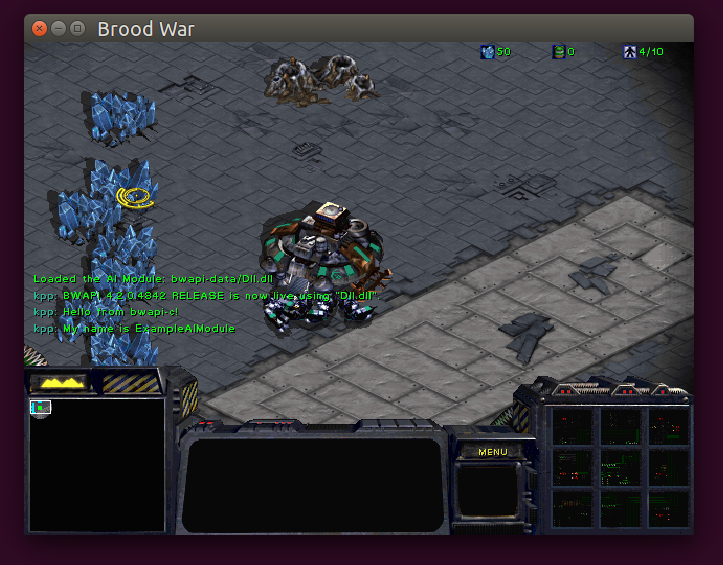][bonus]

["A bot for Starcraft in Rust, C or any other language"][bonus]
is an article by Roman @humbug Proskuryakov
about writing a dynamic library for Windows that could be loaded
into [StarCraft][brood-war]'s address space to manage units.

_Discussions:
[/r/rust](https://www.reddit.com/r/rust/comments/agvho5/a_bot_for_starcraft_in_rust_c_or_any_other),
[Hacker News](https://news.ycombinator.com/item?id=18931961)_

[bonus]: https://habr.com/post/436254
[brood-war]: https://en.wikipedia.org/wiki/StarCraft:_Brood_War

------

That's all news for today, thanks for reading!

Subscribe to [@rust_gamedev on Twitter][@rust_gamedev]
or [/r/rust_gamedev subreddit][/r/rust_gamedev] if you want to receive fresh news!

**Discussions of this post**:
[/r/rust](https://reddit.com/r/rust/comments/f4r368/this_month_in_rust_gamedev_6_january_2020),
[twitter](https://twitter.com/rust_gamedev/status/1229047231916969987).

[/r/rust_gamedev]: https://reddit.com/r/rust_gamedev
[@rust_gamedev]: https://twitter.com/rust_gamedev
