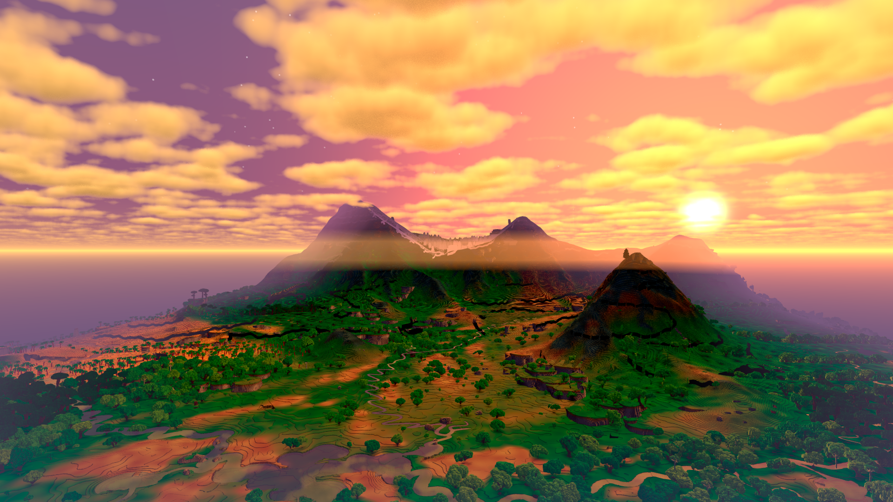
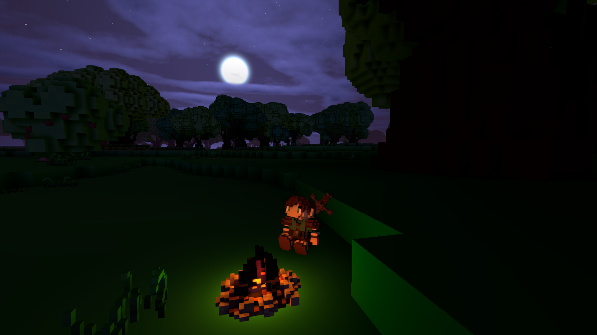

+++
title = "This Month in Rust GameDev #6 - January 2020"
draft = true
+++

Welcome to the sixth issue of the Rust GameDev Workgroup’s
monthly newsletter.

[Rust] is a systems language pursuing the trifecta:
safety, concurrency, and speed.
These goals are well-aligned with game development.

We hope to build an inviting ecosystem for anyone wishing
to use Rust in their development process!
Want to get involved? [Join the Rust GameDev working group!][join]

Want something mentioned in the next newsletter?
[Send us a pull request][pr].
Feel free to send PRs about your own projects!

[Rust]: https://rust-lang.org
[join]: https://github.com/rust-gamedev/wg#join-the-fun
[pr]: https://github.com/rust-gamedev/rust-gamedev.github.io

<!--
Ideal section structure is:

```
### [Title]


A paragraph or two with a summary and [useful links].

_Discussions:
[/r/rust](https://reddit.com/r/rust/todo),
[twitter](https://twitter.com/todo/status/123456)_

[Title]: https://first.link
[useful links]: https://other.link
```

Discussion links are added only if they contain
some actual interesting discussions.

If needed, a section can be split into subsections with a "------" delimiter.
-->

## Game Updates

### [Veloren][veloren]



> Morning landscape

[Veloren][veloren] is an open world, open-source voxel RPG inspired by Dwarf Fortress and Cube World.

At the end of January, Veloren 0.5 was released! Most of January was spent on preparing for this. It was also the first anniversary of This Week in Veloren! There has been a devblog each week since the end of January last year. Here are some of the big changes in this release:

```
- Added initial region system implementation
- Added moon and clouds
- Added proper SFX system
- Added changelog
- Added Scrolling Combat Text (SCT) & Settings for it
- Added options to disable clouds and to use cheaper water rendering
- Added client-side character saving
- Added a localization system to provide multi-language support to voxygen
- Added fullscreen and window size to settings so that they can be persisted
- Added coverage based scaling for pixel art 28 new mobs
- Added waypoints
- Added pathfinding to NPCs
- Overhauled NPC AI
- Pets now attack enemies and defend their owners
- Added collars to tame wild animals
```

You can read more about some specific topics:

- [How to Effectively Write a Proposal for the Game Design Team](https://veloren.net/devblog-49#how-to-effectively-write-a-proposal-for-the-game-design-team-by-silentium)
- [Iterator Problems](https://veloren.net/devblog-50#iterator-problems-with-angelonfira-and-sharp)
- [Erosion Worldgen Updates](https://veloren.net/devblog-50#erosion-worldgen-updates-by-sharp)
- [Airshipper Progress](https://veloren.net/devblog-52#airshipper-progress-by-songtronix)
- [Veloren For All Of Us: Localization System](https://veloren.net/devblog-52#veloren-for-all-of-us-localization-system-by-ender)
- [1 Year of This Week in Veloren](https://veloren.net/devblog-52#1-year-of-this-week-in-veloren-by-angelonfira)



In February, we hope to push forward to 0.6 with a strong intro meeting. Authentication is slated to be released, as well as the Airshipper GUI beta. Hopefully, we also see controller support and improvements to the sound system as well. See you next month!

January's full weekly devlogs: "This Week In Veloren...":
[#49](https://veloren.net/devblog-49),
[#50](https://veloren.net/devblog-50),
[#51](https://veloren.net/devblog-51),
[#52](https://veloren.net/devblog-52),

[veloren]: https://veloren.net

## Library & Tooling updates

### wgpu

[A curated list of wgpu-rs code and resources](https://github.com/rofrol/awesome-wgpu-rs) (**TODO**: add description)

## Popular Workgroup Issues in Github

<!-- Up to 10 links to interesting issues -->

## Meeting Minutes

<!-- Up to 10 most important notes + a link to the full details -->

[See all meeting issues][label_meeting] including full text notes
or [join the next meeting][join].

[label_meeting]: https://github.com/rust-gamedev/wg/issues?q=label%3Ameeting

## Requests for Contribution

<!-- Links to "good first issue"-labels or direct links to specific tasks -->

- [Embark's open issues][embark-open-issues] ([embark.rs]);
- [winit's "Good first issue" and “help wanted” issues][winit-issues];
- [gfx-rs's "contributor-friendly" issues][gfx-issues];
- [wgpu's "help wanted" issues][wgpu-help-wanted];
- [luminance's "low hanging fruit" issues][luminance-fruits];
- [ggez's "good first issue" issues][ggez-issues];
- [Veloren's "beginner" issues][veloren-beginner];
- [Amethyst's "good first issue" issues][amethyst-issues];
- [A/B Street's "good first issue" issues][abstreet-issues];

[embark.rs]: https://embark.rs
[embark-open-issues]: https://github.com/search?q=user:EmbarkStudios+state:open
[winit-issues]: https://github.com/rust-windowing/winit/issues?utf8=✓&q=is%3Aissue+is%3Aopen+label%3A%22status%3A+help+wanted%22+label%3A%22Good+first+issue%22
[gfx-issues]: https://github.com/gfx-rs/gfx/issues?q=is%3Aissue+is%3Aopen+label%3Acontributor-friendly
[wgpu-help-wanted]: https://github.com/gfx-rs/wgpu-rs/issues?q=is%3Aissue+is%3Aopen+label%3A%22help+wanted%22
[luminance-fruits]: https://github.com/phaazon/luminance-rs/issues?q=is%3Aissue+is%3Aopen+label%3A%22low+hanging+fruit%22
[ggez-issues]: https://github.com/ggez/ggez/labels/%2AGOOD%20FIRST%20ISSUE%2A
[veloren-beginner]: https://gitlab.com/veloren/veloren/issues?label_name=beginner
[amethyst-issues]: https://github.com/amethyst/amethyst/issues?q=is%3Aissue+is%3Aopen+label%3A%22good+first+issue%22
[abstreet-issues]: https://github.com/dabreegster/abstreet/issues?q=is%3Aissue+is%3Aopen+label%3A%22good+first+issue%22

## Bonus

<!-- Bonus section to make the newsletter more interesting
and highlight events from the past. -->

Just an interesting Rust gamedev link from the past. :)

------

That's all news for today, thanks for reading!

Subscribe to [@rust_gamedev on Twitter][@rust_gamedev]
or [/r/rust_gamedev subreddit][/r/rust_gamedev] if you want to receive fresh news!

<!--
TODO: Add real links and un-comment once this post is published
**Discussions of this post**:
[/r/rust](TODO),
[twitter](TODO).
-->

[/r/rust_gamedev]: https://reddit.com/r/rust_gamedev
[@rust_gamedev]: https://twitter.com/rust_gamedev
