+++
title = "This Month in Rust GameDev #7 - February 2020"
draft = true
+++

<!-- markdownlint-disable no-trailing-punctuation -->

Welcome to the seventh issue of the Rust GameDev Workgroup’s
monthly newsletter.

[Rust] is a systems language pursuing the trifecta:
safety, concurrency, and speed.
These goals are well-aligned with game development.

We hope to build an inviting ecosystem for anyone wishing
to use Rust in their development process!
Want to get involved? [Join the Rust GameDev working group!][join]

Want something mentioned in the next newsletter?
[Send us a pull request][pr].
Feel free to send PRs about your own projects!

[Rust]: https://rust-lang.org
[join]: https://github.com/rust-gamedev/wg#join-the-fun
[pr]: https://github.com/rust-gamedev/rust-gamedev.github.io

<!--
Ideal section structure is:

```
### [Title]


A paragraph or two with a summary and [useful links].

_Discussions:
[/r/rust](https://reddit.com/r/rust/todo),
[twitter](https://twitter.com/todo/status/123456)_

[Title]: https://first.link
[useful links]: https://other.link
```

Discussion links are added only if they contain
some actual interesting discussions.

If needed, a section can be split into subsections with a "------" delimiter.
-->

## [Ecosystem Survey Results][survey]

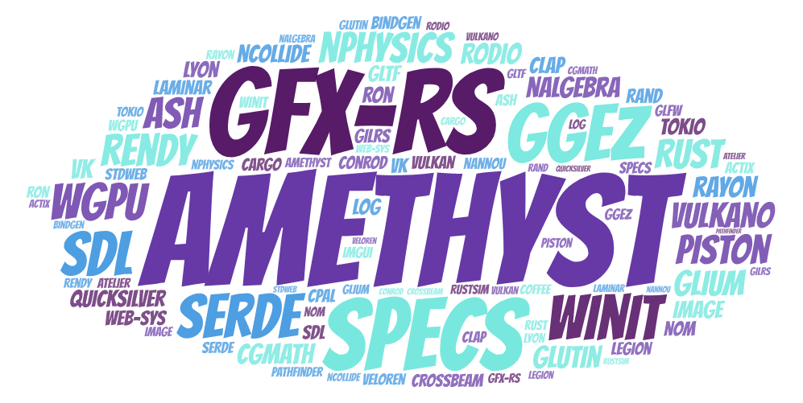

The [results][survey-results] of the Rust GameDev [ecosystem survey][survey]
were published.

> After an unfortunate delay, we can finally present the results.
> We received a whopping 403 responses!
> This trove of valuable feedback will inform the WG's roadmap for 2020.

_Discussions:
[/r/rust](https://reddit.com/r/rust/comments/ezrk0y/rust_game_development_ecosystem_survey),
[/r/rust_gamedev](https://reddit.com/r/rust_gamedev/comments/ezrk5o/rust_game_development_ecosystem_survey)_

[survey-results]: https://rust-gamedev.github.io/posts/survey-01
[survey]: https://rust-gamedev.github.io/posts/newsletter-001/#survey-from-the-rust-gamedev-working-group-clipboard

## [Are We Game Yet?][awgy] Updates

[Are We Game Yet?][awgy] is a website cataloguing the Rust gamedev ecosystem, with hundreds of links to crates, games and helpful resources.

[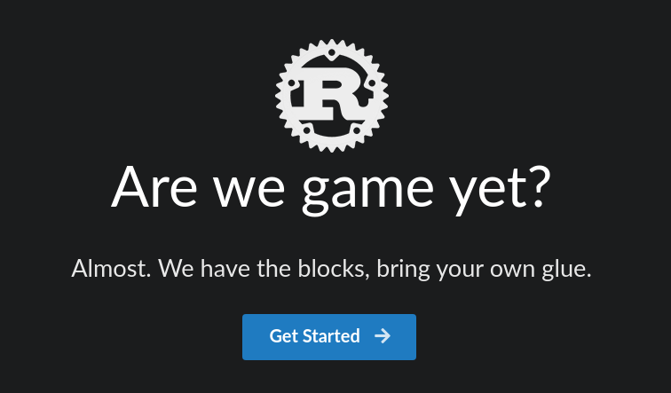][awgy]

This month, it received some major updates:

* All of the site's data files have been unified into a consistent TOML schema, making it easier to add new links.
* Categories have been added for games and resources, and you can now add an item to multiple categories without duplicating the data.
* Page load times have been reduced (especially on the homepage).
* The styling has been improved to make the site look better on mobile, and to resolve some accessibility issues.

[Ownership was also recently transferred across to the gamedev working group][awgy-wg], to allow for more people to help with maintainance.

There's never been a better time to add your projects to the site, so [please come and contribute][awgy-contribute]!

[awgy]: https://arewegameyet.com/
[awgy-wg]: https://github.com/rust-gamedev/arewegameyet/issues/210
[awgy-contribute]: https://github.com/rust-gamedev/arewegameyet#contribute

## [New Rust GameDev Discord Server][discord-new-invitation]

[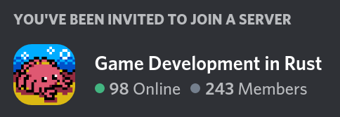][discord-new-invitation]

A new Discord server dedicated to Rust GameDev was started
by [@dasifefe] this month:
[**invitation link**][discord-new-invitation].

Besides talking about Rust, it's a place that could be used to show your
work-in-progress, art (visual or audio), discuss game design, etc.

------

Also, in case you didn't know, there is a quite active "games-and-graphics"
channel on the [community-run Discord server][discord-community-invitation].

[@dasifefe]: https://github.com/dasifefe
[discord-new-invitation]: https://discord.gg/yNtPTb2
[discord-community-invitation]: https://discord.gg/6Zvghp

## [RustTallinn][@RustTallinn]


[@logicsoup] - one of the developers behind [Garden][garden] -
[is planning to organize][tallinn-ann] the first (and hopefully one of many)
Rust Hack'n'Learn meetup in Tallinn in March.

If you're interested, follow [@RustTallinn] - more details will be announced soon.

[tallinn-ann]: https://twitter.com/logicsoup/status/1224404367723454478
[@RustTallinn]: https://twitter.com/RustTallinn
[@logicsoup]: https://twitter.com/logicsoup

## Game Updates

### [Rusty Shooter][rusty-shooter]

[Rusty Shooter][rusty-shooter] is a Quake3-like first person shooter written in Rust using [rg3d engine][rg3d-engine].


Small gameplay video (work-in-progress):
[][rusty-shooter-video]

Features:

- Common FPS elements: bots, items, weapons.
- Single game mode - deathmatch.
- More or less modern graphics (shadows, deferred shading, particle systems etc.)
- Fully animated bots using animation blending state machines.
- Single map - something like legendary Q3DM6.
- Path finding using navmesh
- Save/load functionality
- GUI: main menu, options, HUD, leader board (using [rg3d-ui library][rg3d-ui])
- Binaural sound (using [rg3d-sound library][rg3d-sound])

[rg3d-engine]: https://github.com/mrDIMAS/rg3d
[rg3d-ui]: https://github.com/mrDIMAS/rg3d-ui
[rg3d-sound]: https://github.com/mrDIMAS/rg3d-sound
[rusty-shooter]: https://github.com/mrDIMAS/rusty-shooter
[rusty-shooter-video]: https://www.youtube.com/watch?v=UDn8ymyXPcI

### [Antorum]

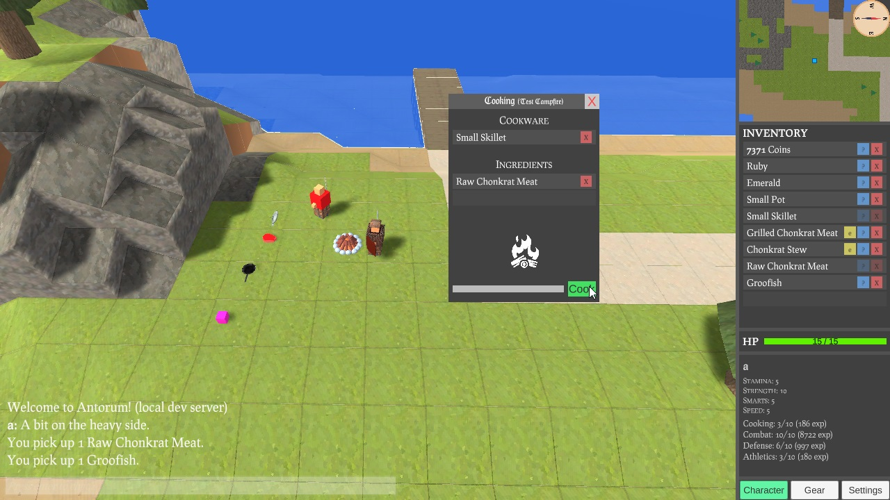

[Antorum] is a multiplayer RPG where players build their characters and fight against the growing threats on the isle. The game server is authoritative and written in Rust, while the client is written in Unity/C#.

This month, the focus was on the cooking skill. This includes recipies and cookware. Players will need a cooking appliance, such as a stove or campfire to cook some Chonkrat Stew inside a pot. A heavy refactor to the interaction system had to be made, as well as changes to networking. Check out [@dooskington]'s devlog here:

- [#18 "Cooking"](https://dooskington.com/dev-log/18)

[antorum]: https://dooskington.com
[@dooskington]: https://twitter.com/dooskington

### [Everpuzzle]

[Everpuzzle] is a Tetris Attack like action-puzzle game written in Rust.


Everpuzzle aims to become a similar game like Tetris Attack and expand on its concepts.
The project was recently rewritten with minimal dependencies to achieve small compile times and gain more control over the
underlying engine architecture.
In the past Everpuzzle was using Amethyst with ECS, however there were some issues that made development difficult.
Everpuzzle's big goals are AI, Multiplayer and different Game modes.

Big changes coming in version 0.2, full list [here](https://github.com/Skytrias/everpuzzle/blob/master/CHANGELOG.md):
* Gamepad support (singleplayer)
* Multiple grids
* AI Bot
* Better Randomization of blocks
* Combos / Chains - with Highlighting
* Better animations

[Latest releases](https://github.com/Skytrias/everpuzzle/releases)

[Everpuzzle rewrite - Code Walkthrough (code outdated)](https://www.youtube.com/watch?v=qA2zcaUVRKY)

[Everpuzzle]: https://github.com/Skytrias/everpuzzle

### [Scale]

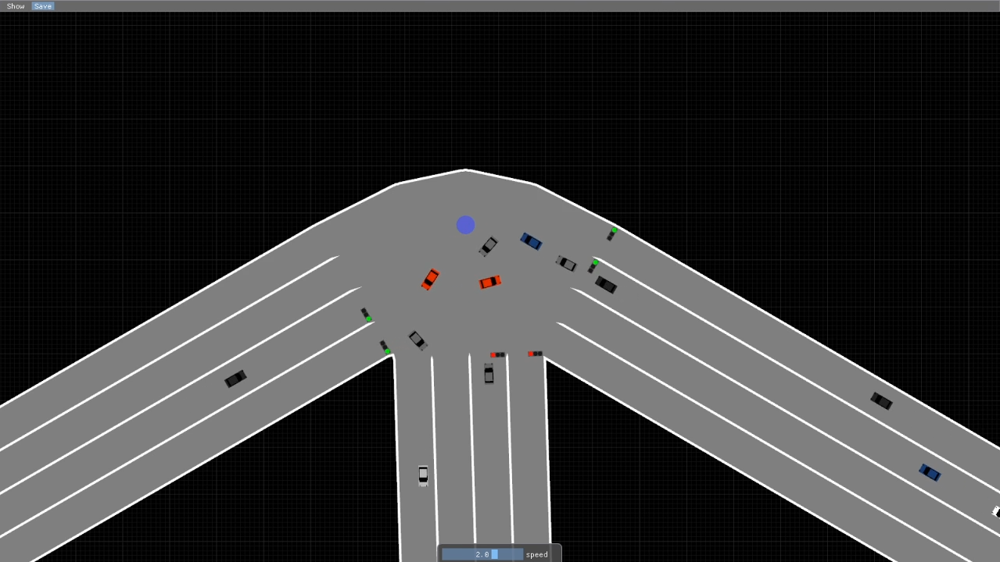

[Scale] is a recent project about modern day society simulation from the
bottom-up by [Uriopass].

In february, the Inspector for specs entities was mostly finished and the
traffic simulation made great progress.
A second [blog post][scale-blog-post] was released about it.

[A recent video][scale-traffic-video] also shows different traffic features such
as traffic lights, stop signs and car AI working together.

_Discussions:
[/r/rust_gamedev](https://reddit.com/r/rust_gamedev/comments/f1egnd/scale_devblog_2)_

[Uriopass]: http://douady.paris/aboutme.html
[Scale]: https://github.com/Uriopass/Scale
[scale-blog-post]: http://douady.paris/blog/scale_2.html
[scale-traffic-video]: https://youtu.be/nk6F42BQllU

### [Ultimate Scale][ultimate-scale]

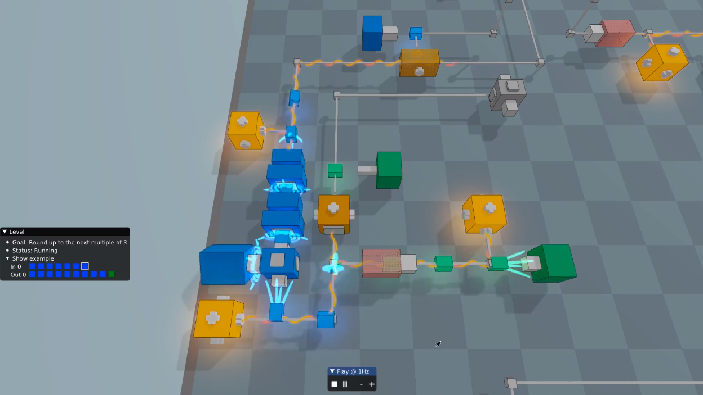

[Ultimate Scale][ultimate-scale] is a puzzle game in which you build
increasingly large machines to solve increasingly difficult problems.
The game consists of wind and blips.
Wind propagates along pipes and causes blips to move.
Blips, in turn, activate blocks.

[Leod] is currently working on the core design: How to make the game fun and
what blocks to add. He posted about their thoughts and progress on a
[reddit comment][ultimate-scale-post].
Regularly, videos are posted on their
[youtube channel][ultimate-scale-youtube-channel] showing different machines
made in game such as an [extensible counter modulo 10][ultimate-scale-video-1]
and a [buffer][ultimate-scale-video-2].

A custom 3D rendering pipeline based on glium called [Rendology] was developed
for this project. A [blog post][rendology-blog-post] talks about its design and
relation to Ultimate Scale.

_Discussions:
[/r/rust_gamedev](https://reddit.com/r/rust_gamedev/comments/f3cll6/ultimate_scale_counting_modulo_three)_

[Leod]: https://leod.github.io/
[Rendology]: https://github.com/leod/rendology
[rendology-blog-post]: https://leod.github.io/rust/gamedev/rendology/2019/12/13/introduction-to-rendology.html
[ultimate-scale]: https://github.com/leod/ultimate-scale
[ultimate-scale-video-1]: https://youtu.be/zmKRJAF4xcI
[ultimate-scale-video-2]: https://youtu.be/IM3BRM_MZrE
[ultimate-scale-post]: https://www.reddit.com/r/rust_gamedev/comments/f3cll6/ultimate_scale_counting_modulo_three/fhhu5ol/
[ultimate-scale-youtube-channel]: https://www.youtube.com/channel/UChSw7WP2i0GIw61FIeTeGsA

### [Tennis Academy Dash][tennis-academy-dash]


Tennis academy dash is a time management game where you are the manager of a tennis academy and you need to coordinate various players to play on your courts.

The game is still a work in progress, but the demo version has been uploaded to itch.io this month, so you can go ahead and check it out! Give it a go (the build is only for mac at the moment but other platforms coming soon) and drop a comment with any feedback on [tennis-academy-dash].

[tennis-academy-dash]: https://iolivia.itch.io/tennis-academy-dash

### [Lonely Star][lonely-star]

> *Space is a lonely place, but at least you've got the music to keep you company.*

[Lonely Star][lonely-star] is a side-scrolling infinite runner, with simple generative music. You collect orbs and fly through rings in order to play notes and stay alive.

It was developed by [17cupsofcoffee][17cupsofcoffee], using the [Tetra][tetra] 2D game framework, for [Weekly Game Jam #135](weekly-game-jam-135).

[][lonely-star]

Tetra itself also received two small updates recently:

* [Version 0.3.2 was released][tetra-0.3.2], with bugfixes and some tools for simple AABB collision detection.
* [The Pong tutorial was updated with a new chapter][tetra-pong], showing how to use Tetra's graphics and input APIs.

[lonely-star]: https://17cupsofcoffee.itch.io/lonely-star
[17cupsofcoffee]: https://twitter.com/17cupsofcoffee
[tetra]: https://github.com/17cupsofcoffee/tetra
[weekly-game-jam-135]: https://itch.io/jam/weekly-game-jam-135
[tetra-0.3.2]: https://twitter.com/17cupsofcoffee/status/1217524602513055749
[tetra-pong]: https://twitter.com/17cupsofcoffee/status/1219758851416895489

### [Akigi][akigi]


> Sampling a heightmap in the vertex shader and also computing the normal, tangent and bitangent vectors in the vertex shader.

[Akigi][akigi] is a multiplayer online world where most believe that humans are inferior.

This month saw a heavy focus on the web client. An alpha release is slated for April 9th, 2020. Lots of client refactoring was done, and experiments were run in the browser.

Some of February's updates:

- [Input Event Processor System](https://devjournal.akigi.com/february-2020/2020-02-09.html#input-event-processor-system);
- [Terrain Loading and Rendering](https://devjournal.akigi.com/february-2020/2020-02-16.html#terrain-loading-and-rendering);
- [User Interface Elements](https://devjournal.akigi.com/february-2020/2020-02-16.html#user-interface-elements);
- [The WebGL Renderer](https://devjournal.akigi.com/february-2020/2020-02-16.html#the-webgl-renderer);
- [Rendering Meshes](https://devjournal.akigi.com/february-2020/055-2020-02-23.html#rendering-meshes);
- [Rendering Terrain](https://devjournal.akigi.com/february-2020/055-2020-02-23.html#rendering-terrain);

February's full devlogs:
[#053](https://devjournal.akigi.com/february-2020/2020-02-09.html),
[#054](https://devjournal.akigi.com/february-2020/2020-02-16.html),
[#055](https://devjournal.akigi.com/february-2020/055-2020-02-23.html),

[akigi]: https://akigi.com

### [Will][will]

![Will Network Play Screenshot][will_network_play]

[Will][will] is a 2.5D moddable action / adventure game.

This month Azriel wrote a post about how decisions were made when [designing
network play][designing_network_play].

[will]: https://azriel.im/will/
[designing_network_play]: https://azriel.im/will/2020/02/29/designing-network-play/
[will_network_play]: will_network_play.png

### [Oxidator][oxidator]

[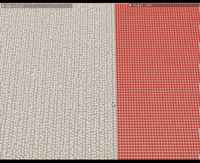][oxidator-video-play]

^ _gameplay demo (35000 units)_

[Oxidator][oxidator] by [@Ruddle] is a real-time strategy game/engine
written with Rust and WebGPU.
It's inspired by Total Annihilation, Supreme Commander, Spring Engine,
and Zero-k.

The project's goal is to provide a modern, carefully crafted,
minimal and highly constrained set of tools for players/designers
to create mods without programming knowledge.

Some of the current features:

- Simulation:
  working draft of flock behavior and collision detection,
  basic health and damage computation,
  construction and repair;
- Rendering: basic display of a heightmap & 3D models (with instancing),
  fxaa, screen space reflections;
- UI: select units (picking and rectangle selection),
  move & build orders;
- Multiplayer: working PoC localhost tcp client/server;
- Map editor: raise, lower, flatten, blur, noise pencil;
- Unit editor: basic editor with joint & mesh selection and parameter editing
  (speed, turn rate, health, etc);

[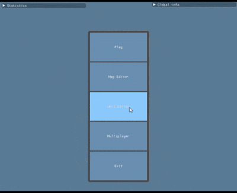][oxidator-video-unit-editor]

^ _Demo of the unit editor_

[][oxidator-video-map-editor]

^ _Demo of the map editor_

[oxidator]: https://github.com/Ruddle/oxidator
[@Ruddle]: https://github.com/Ruddle
[oxidator-video-play]: https://streamable.com/499j0
[oxidator-video-unit-editor]: https://streamable.com/ywr44
[oxidator-video-map-editor]: https://github.com/Ruddle/oxidator/blob/be4863e74/etc/map_editor.gif

### [Univer City v1.0 and Open Source Release][univer-1-0-opensource]

[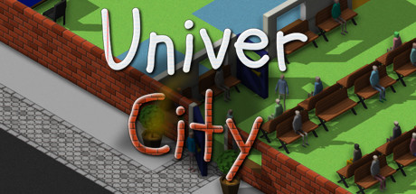][univer-steam]

[UniverCity][univer-steam] is an isometric university management game:

> Manage your staff, professors and students and try
> and build the best UniverCity around!
> Build up your UniverCity solo or against friends and build many different
> types of classes whilst trying to ensure students get good grades,
> or maybe just try and build the best looking UniverCity.

This month, [v1.0 was released on Steam][univer-1-0-opensource]
along with [releasing the game's sources under GPL-3][univer-source].

> This update _marks the end of development for now_
> and adds in some basic workshop support.


> The license is GPL-3 and the code is the same
> as the version released on Steam
> (the Steam version is built with the 'steam' feature enabled).
> Due to the GPL licensing the steamworks support is disabled
> by default which breaks things like the 'modding' menu and multiplayer.
>
> The assets _are not included_ with the release
> and will have to be copied from the game on Steam.

_Discussions:
[/r/rust](https://reddit.com/r/rust/comments/f5fiii/univercity_open_source_release_university)_

[univer-1-0-opensource]: https://steamcommunity.com/gid/103582791461907043/announcements/detail/1694978169192631655
[univer-steam]: https://store.steampowered.com/app/808160/UniverCity
[univer-source]: https://github.com/Thinkofname/UniverCity

### [Dwarf World][dwarf-world]

[][dwarf-world]

[Alexandru Ene] is working on a dwarf colony management game "Dwarf World".

This month, the project got an official site: [dwarf.world][dwarf-world].

Also, check out development streams:
every Sunday at 19:30 PM GMT [on Twitch][dwarf-twitch].

[Alexandru Ene]: https://alexene.dev
[dwarf-world]: https://dwarf.world
[dwarf-twitch]: https://twitch.tv/nomad_pixel

### [Way of Rhea's New Trailer][rhea-steam]

[][rhea-steam]

[Way of Rhea][rhea-steam] is an upcoming puzzle platformer that takes place in a world
where you can only interact with objects that match your current color.

This month, an updated trailer with new character art was released.
[Check it out on the game's Steam page][rhea-steam].

[rhea-steam]: https://store.steampowered.com/app/1110620/Way_of_Rhea

### Noodle Cat

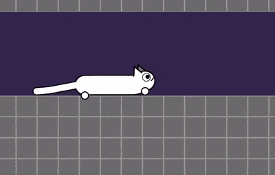

[@Fryer00] tweeted a bunch of updates about their
WIP Box2D physics game prototype:

- Day 45: [contraction mechanic](https://twitter.com/Fryer00/status/1225829271597395971);
- Day 46: [turn/flip/swap-front-and-back movement mechanics](https://twitter.com/Fryer00/status/1227327016380305415);
- Day 48: [food](https://twitter.com/Fryer00/status/1232181181690654720).

[@Fryer00]: https://twitter.com/Fryer00

### [Garden]: January and February Devlogs

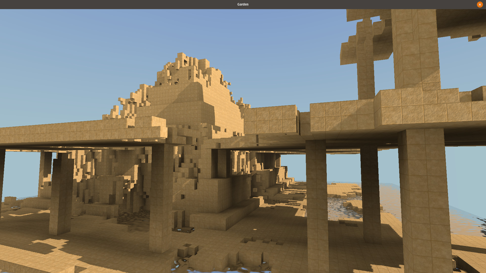

[Garden][garden] is an upcoming game centered around growing realistic plants.

[January][garden-jan] and [February][garden-feb] devlogs
were posted by [@logicsoup].
Some of the updates:

- 🌘 Physically based shading
- 🕹 3D model loading and texturing for richer environments
- 💦 Soil moisture content
- 🌠 Alpha mipmapping
- and more info regarding some game mechanics as well

[garden]: https://epcc.itch.io/garden
[garden-jan]: https://cyberplant.xyz/posts/january
[garden-feb]: https://cyberplant.xyz/posts/february

### [Colony Genesis][colony-itch]

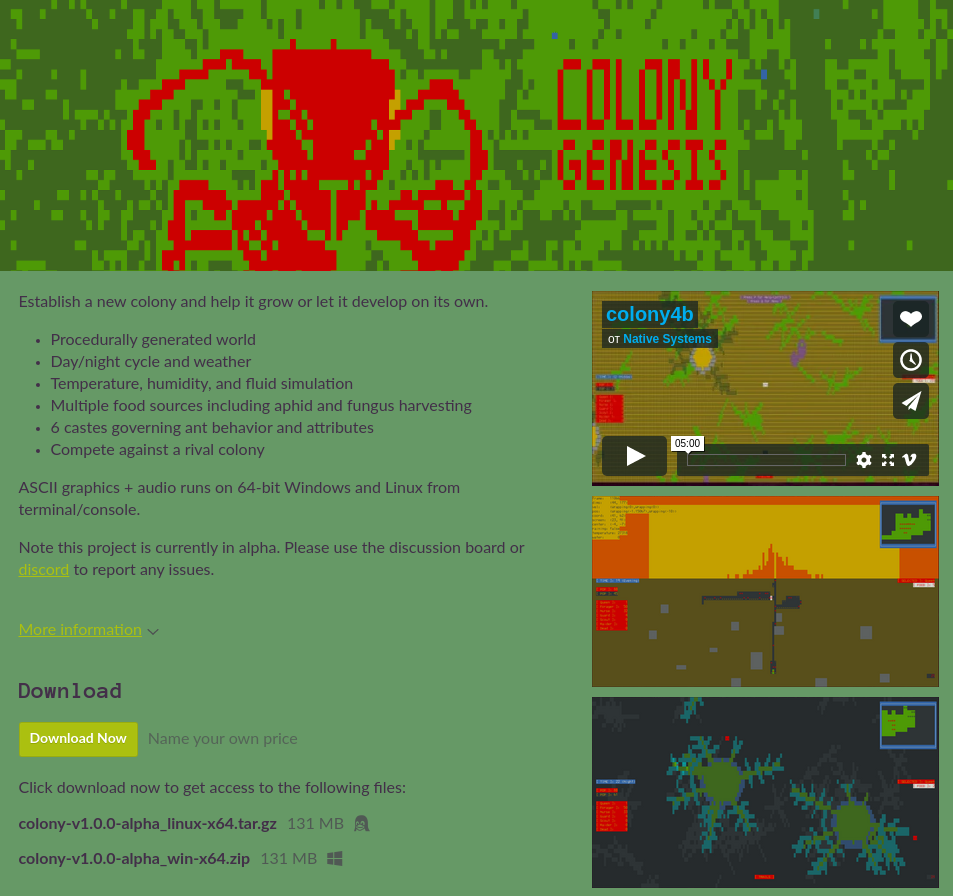

[Native Systems] is working on "Colony Genesis" -
an ant colony sandbox game with ASCII graphics.

> Establish a new colony and help it grow or let it develop on its own.

This month an alpha version was published on itch: [check it out here][colony-itch].

[colony-itch]: https://nativesystems.itch.io/colony
[Native Systems]: https://nativesystems.rs

### [Veloren][veloren]


> Rolling mountain landscape

[Veloren][veloren] is an open world, open-source voxel RPG inspired by Dwarf Fortress and Cube World.

At the beginning of the month, the team met for a 0.6 intro meeting. It was decided that 0.6 would focus on things for the player to do, and hence will be called "The Content Update".

Research has been done on multiple areas this month. One domain is level of detail, which is allowing mountains off in the distance to be rendered much faster. Another domain is server persistence. Finding a way for the server to efficiently persist player information is a large part of what is needed for The Content Update.

Here is the February changelog:

```text
- Fixed NPCs attacking the player forever after killing them
- Extend run sfx to small animals to prevent sneak attacks by geese
- Added sfx for wielding/unwielding weapons
- Added new orc hairstyles
- Added gamma setting
- Configurable fonts
- Tanslation status tracking
- Fixed /give_exp ignoring player argument
- Allow spawning individual pet species, not just generic body kinds
- Added daily Mac builds
- Removed highlighting of non-collectible sprites
- Added zoomable and rotatable minimap
- Added rotating orientation marker to main-map
- Brighter / higher contrast main-map
- Added music system
```

[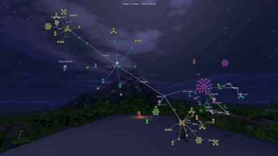](https://www.youtube.com/watch?v=1ldHQfxCT24)

> 1 year of Veloren development. Click for the full video!

You can read more about some specific topics:

- [0.5 Release](https://veloren.net/devblog-53#0-5-release)
- [0.6 Intro Meeting](https://veloren.net/devblog-54#0-6-intro-meeting)
- [Settlements](https://veloren.net/devblog-54#settlements)
- [Mac Builds](https://veloren.net/devblog-55#the-mac-build-situation-by-angelonfira)
- [Achievements](https://veloren.net/devblog-55#achievement-implementation-by-thedip)
- [Persistence](https://veloren.net/devblog-56#persistence-by-angelonfira)

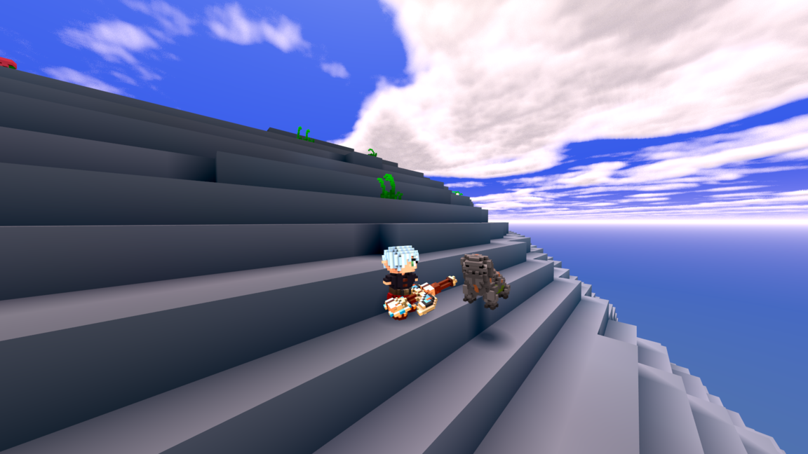

In March, there will be a heavy focus on completing level of detail work as well as persistence. Modding support will be explored further. Player achievements will be merged into the game, and we will start looking at where more content can be added.

February's full weekly devlogs: "This Week In Veloren...":
[#53](https://veloren.net/devblog-53),
[#54](https://veloren.net/devblog-54),
[#55](https://veloren.net/devblog-55),
[#56](https://veloren.net/devblog-56).

[veloren]: https://veloren.net

### [Grumpy Visitors First Update. Winter Progress][grumpy_visitors]


Grumpy Visitors is a top-down 2D co-op action/arcade game highly inspired by Evil Invasion. It runs on Amethyst game engine.

This winter Grumpy Visitors received some updates with the focus on graphics and UI:
- Repainting mage sprites with shaders
- New missiles graphics
- Monsters death animations
- Modal windows for menu UI

Check them out in the [latest winter devlog][grumpy_visitors].

[grumpy_visitors]: https://mvlabat.github.io/2020-03-02-winter-update/

### [Make China Great Again][china-great]

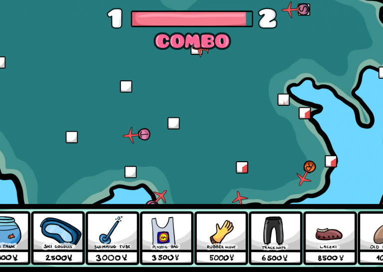

> Turn back planes to the port, by clicking right keys to the virus beat.

[Make China Great Again][china-great] ([source][china-great-src])
by [@PsichiX] is a GlobalGameJam game written using [Oxygengine].

[Try it online][china-great-play].

[@PsichiX]: https://github.com/PsichiX
[china-great]: https://globalgamejam.org/2020/games/make-china-great-again-5
[china-great-play]: http://mcga.psichix.io
[china-great-src]: https://github.com/PsichiX/global-game-jam-2020
[Oxygengine]: https://github.com/PsichiX/Oxygengine

### pGLOWrpg

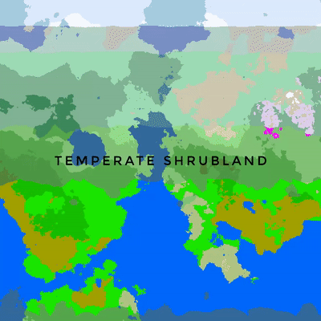

[@Roal_Yr] tweeted a bunch of updates about their "pGLOWrpg" project:

- [proper river attractors](https://twitter.com/Roal_Yr/status/1218940947070885888);
- [floodfill and distinguished regions](https://twitter.com/Roal_Yr/status/1218634118516396033);
- [extravagant dev environment](https://twitter.com/Roal_Yr/status/1229785132455878656);
- [optimized pathfinding, unique regions](https://twitter.com/Roal_Yr/status/1228659336349655042);
- [Reworked noise and erosion](https://twitter.com/Roal_Yr/status/1231139098288697345);
- [37 possible unique biomes](https://twitter.com/Roal_Yr/status/1231640620072128512);

[@Roal_Yr]: https://twitter.com/Roal_Yr

### [Robo Instructus]

[][Robo Instructus]

[Alex Butler] continues to polish their "[Robo Instructus]" puzzle game -
[1.23 and 1.24 versions were released][robo-news]:
dependency updates, bugfixes and performance optimizations.

[Alex Butler]: https://twitter.com/bigabgames
[Robo Instructus]: https://store.steampowered.com/app/1032170/Robo_Instructus
[robo-news]: https://steamcommunity.com/app/1032170/allnews

### [Recall Singularity: February Progress][recall-s-feb]

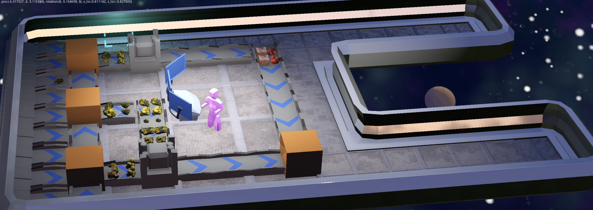

^ _Harvesting and refining some Gold._

[Tom Leys] is working on a "The Recall Singularity" game
about designing autonomous factory ships and stations.
This month, they published a devlog post:
["Space Factory Building in Feb 2020"][recall-s-feb].

Some of the updates:

- Networking improvements;
- Godot-Rust interaction improvements;
- Players can now control their ships and create new ones;
- Top-down view and flying HUD;
- Asteroids procgen.

Also, the post gives an overview of the project's history,
talks about community building, and overcoming personal challenges.

Check out stream highlights on [Tom's YouTube channel][recall-youtube].

_Discussions:
[/r/rust](https://reddit.com/r/rust/comments/f9m00v/space_factory_game_in_rust_godot_the_recall)_

[Tom Leys]: https://twitter.com/RecallSingular1
[recall-s-feb]: https://medium.com/@recallsingularity/recalling-nov-2019-236cdf9c0a8a
[recall-youtube]: https://youtube.com/channel/UCzgUlowiaKXJiNIAi0c9Qsg/videos

### For the Quest

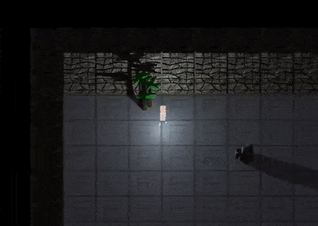

[@seratonik] tweeted a bunch of updates
about their "For the Quest" (working title) game project:

- Switched to the `specs` ECS;
- Added a few new object models and
  an 8-direction animated sprite with idle animations;
- The map renderer is now powered by a chunking system to fix clipping issues;
- Added basic collision detection.

[@seratonik]: https://twitter.com/seratonik

## Library & Tooling Updates

### [Fix Your Time Step in Rust and GGEZ][fyt-ggez]

[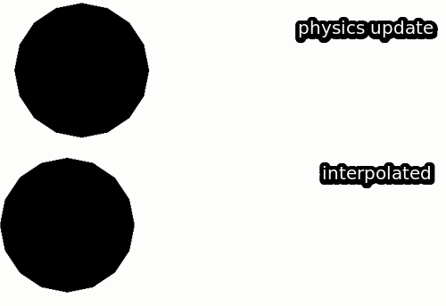][fyt-ggez]

[joetsoi] has written [a blog post][fyt-ggez], demonstrating how the concepts from the well-known '[Fix Your Timestep][fyt]' article can be applied when making games with Rust and GGEZ.

The examples are very well explained, and can easily be translated to other engines, so it's worth checking out even if you're not a GGEZ user!

[joetsoi]: https://joetsoi.github.io
[fyt-ggez]: https://joetsoi.github.io/fix-your-timestep-rust-ggez/
[fyt]: https://gafferongames.com/post/fix_your_timestep/

### savefile 0.6.1

[savefile] is a serialization crate used to effortlessly serialize rust crates
and enums into a binary format. Anything implementing the `Write` trait can
be serialized and deserialized. First class versioning support and introspection
are some other features available.

Version 0.6.1 includes a fix and should be updated to if compilation using
the savefile-derive crate produces a "`SaveFileError` not found" compiler error.

For details, see the [github page][savefile-github] or the [savefile documentation].

[savefile]: https://crates.io/crates/savefile
[savefile documentation]: https://docs.rs/savefile/0.6.1/savefile
[savefile-github]: https://github.com/avl/savefile

### specs 0.16

[specs] is an entity-component system (ECS) library, designed for high
performance. This update increases the MSRV to 1.38 and removes the `"nightly"`
feature.

In this version, the [panic message has been improved][panic_improve] to include
the name of the type that is accessed on stable Rust, as well as suggestions for
how to fix the issue. Prior to `specs 0.16`, retrieving a resource that had not
been added to the `World` panics with an obscure *"resource not found"* message,
and the `"nightly"` feature was necessary to discover what resource that is.

In addition, the [`Send` and `Sync` trait constraints are
removed][specs_constraints] from resources and `Component`s when the
`"parallel"` feature is disabled -- enabling types such as
`wasm_bindgen::JsValue` to be used with non-parallel `specs`.

For more details, please see the [`specs` changelog].

[panic_improve]: https://github.com/amethyst/shred/issues/182
[specs_constraints]: https://github.com/amethyst/specs/issues/673
[specs]: https://crates.io/crates/specs
[`specs` changelog]: https://github.com/amethyst/specs/blob/0.16.1/CHANGELOG.md#0161-2020-02-18

### [weasel]

[weasel] by [@Trisfald] is a customizable battle system for turn-based games.

- Simple way to define the combat's rules,
  taking advantage of Rust's strong type system.
- Battle events are collected into a timeline to support save and restore,
  replays, and more.
- Client/server architecture; all battle events are verified by the server.
- Minimal performance overhead.

> The idea behind this crate is to provide a structured
> and safe framework to manage the game state.
> Users can create a battle and evolve it by applying events.
> Then, weasel takes care of keeping a historical timeline.
> It also help with serializing/deserializing save files
> or sharing and verifying events between clients and server.
> The game logic is defined through traits, which is nice because
> it can benefit from Rust's type system and compile time checks.

Check out [examples][weasel-examples] to see how it works in practice.

[weasel]: https://github.com/Trisfald/weasel
[weasel-examples]: https://github.com/Trisfald/weasel/tree/master/examples
[@Trisfald]: https://github.com/Trisfald

### [Shipyard] v0.3

Take a look at [this](https://www.reddit.com/r/rust/comments/fbo8wf/shipyard_03_release/) Reddit thread for a discussion on the update.

[Shipyard] is an Entity Component System crate. ECS is a pattern mostly used in games but not only. It fits really well with Rust, allowing easy composition and lifetime management.

- [User guide] Learning to use a crate with the documentation can be hard. There's now a guide to explain what can be done with Shipyard and how.
- No need to register components anymore Components had to be registered before accessing them by using World::new or World::register.
Storages are now automatically created when they are first accessed.
- !Send and !Sync components All components had to be Send + Sync, this is a strict limitation to make sure storages can use parallel features. With 0.3 !Send and !Sync types can be stored and accessed while still following Rust's rules. These rules limit threading for these types but doesn't always prevent it.
- Unique components When we only need a single instance of a component, keeping an id around to access it can be annoying. A Unique component won't be attached to any entity but will have the storage all for itself.
- Components sorting
- no_std support

[Shipyard]: https://crates.io/crates/shipyard
[User guide]: https://leudz.github.io/shipyard/book

### [crow] v0.3

[crow] is a 2D rendering engine based on OpenGL. It is designed to be easy to use while still allowing for nearly everything one might want while using pixel art.

A showcase game is [being developed](https://github.com/lcnr/akari) with crow.

[crow]: https://crates.io/crates/crow

### [Patchwork]

[Patchwork] is a convenient crate for drawing tiles from a tilesheet using a 'SpriteBatch' with `ggez`. It is an update to the `Mosaic` crate by [Repnop](https://github.com/repnop/mosaic), which is no longer maintained.

[patchwork]: https://github.com/RedSquirrelsNut/patchwork

### [KAS] GUI v0.3

[KAS], the tool**K**it **A**bstraction **S**ystem, is a general-purpose GUI toolkit.

0.3 is a decent sized release, focussing primarily on drawing, themes and layouts. Highlights include a new FlatTheme, many small visual improvements, access to medium-level and low-level drawing APIs for custom widgets, window size limits, and switchable themes and colour schemes.

[KAS]: https://github.com/kas-gui/kas

### [image] v0.23

[image] crate provides basic imaging processing functions and methods for converting to and from image formats.

Check out [the release blog](https://blog.image-rs.org/2020/02/07/release-0.23.0.html) for 0.23! It comes with improvements to error handling, and the buffer and loading interfaces.

[image]: https://github.com/image-rs/image

### [Oxygengine][oxygengine]


This month [Oxygengine][oxygengine] got new version 0.7.0 with
[Visual Novel and Animation][oxygengine-vn-anim-ann]
modules that allows users to focus on making VN games easily, with virtually no code needed to be written - it is a groundbreaking start in developing a set of tools for the profesional game developers.

> As few might notice, Oxygengine is starting to get more complex modules, there is a reason for that - this engine is made with one big goal in mind, which is: to became a tool used by professionals, giving easy way to make complex games easily, therefore the current milestone is about bringing a basic game editor with first game maker module along with blueprints-like visual scripting and animation tool - the most important tools for visual novel game designers!


You can find sources of the project that shows how to use these modules in the [engine demo projects][oxygengine-vn-test-src].

Another thing that was shipped in last milestone was a module that allows to make and run your game logic designed in Blueprint-like visual scripting.
Next milestone is focused on delivering a base for professional modular game editor that will allow users to easily create a complex and animated Visual Novel games using Visual Scripting - game makers for another genres are currently in planning stage.

[oxygengine]: https://github.com/PsichiX/Oxygengine
[oxygengine-vn-anim-ann]: https://www.reddit.com/r/rust_gamedev/comments/fd7kza/oxygengine_visual_novel_and_animation_modules_are/
[oxygengine-vn-test-src]: https://github.com/PsichiX/Oxygengine/tree/master/demos/visual-novel-testbed

### [Neovide][neovide]

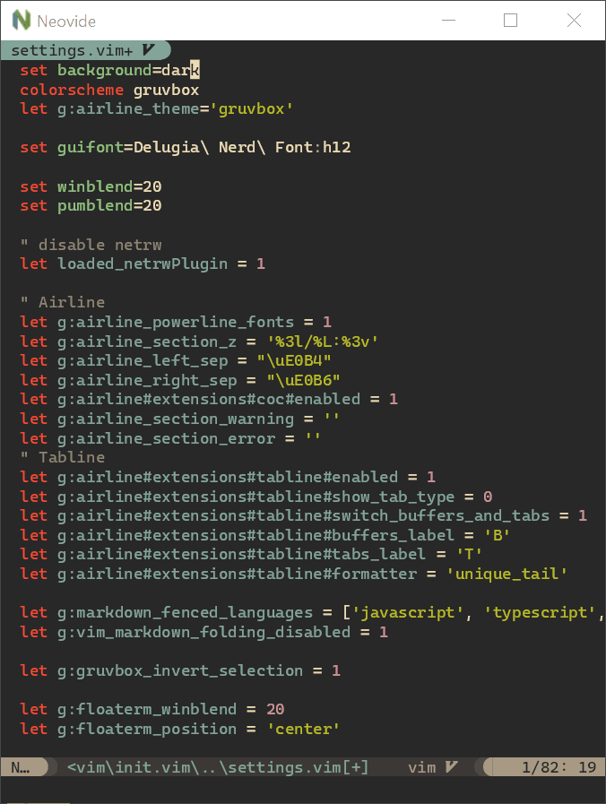

[Neovide][neovide] is a frontend for neovim that brings a lot of visual niceties.
It uses vulkan and skia for rendering.

[neovide]: https://github.com/Kethku/neovide

## Popular Workgroup Issues in Github

<!-- Up to 10 links to interesting issues -->

## Meeting Minutes

<!-- Up to 10 most important notes + a link to the full details -->

[See all meeting issues][label_meeting] including full text notes
or [join the next meeting][join].

[label_meeting]: https://github.com/rust-gamedev/wg/issues?q=label%3Ameeting

## Requests for Contribution

<!-- Links to "good first issue"-labels or direct links to specific tasks -->

- [Embark's open issues][embark-open-issues] ([embark.rs]);
- [winit's "Good first issue" and “help wanted” issues][winit-issues];
- [gfx-rs's "contributor-friendly" issues][gfx-issues];
- [wgpu's "help wanted" issues][wgpu-help-wanted];
- [luminance's "low hanging fruit" issues][luminance-fruits];
- [ggez's "good first issue" issues][ggez-issues];
- [Veloren's "beginner" issues][veloren-beginner];
- [Amethyst's "good first issue" issues][amethyst-issues];
- [A/B Street's "good first issue" issues][abstreet-issues];
- [Mun's "good first issue" issues][mun-issues];

[embark.rs]: https://embark.rs
[embark-open-issues]: https://github.com/search?q=user:EmbarkStudios+state:open
[winit-issues]: https://github.com/rust-windowing/winit/issues?utf8=✓&q=is%3Aissue+is%3Aopen+label%3A%22status%3A+help+wanted%22+label%3A%22Good+first+issue%22
[gfx-issues]: https://github.com/gfx-rs/gfx/issues?q=is%3Aissue+is%3Aopen+label%3Acontributor-friendly
[wgpu-help-wanted]: https://github.com/gfx-rs/wgpu-rs/issues?q=is%3Aissue+is%3Aopen+label%3A%22help+wanted%22
[luminance-fruits]: https://github.com/phaazon/luminance-rs/issues?q=is%3Aissue+is%3Aopen+label%3A%22low+hanging+fruit%22
[ggez-issues]: https://github.com/ggez/ggez/labels/%2AGOOD%20FIRST%20ISSUE%2A
[veloren-beginner]: https://gitlab.com/veloren/veloren/issues?label_name=beginner
[amethyst-issues]: https://github.com/amethyst/amethyst/issues?q=is%3Aissue+is%3Aopen+label%3A%22good+first+issue%22
[abstreet-issues]: https://github.com/dabreegster/abstreet/issues?q=is%3Aissue+is%3Aopen+label%3A%22good+first+issue%22
[mun-issues]: https://github.com/mun-lang/mun/labels/good%20first%20issue

## Bonus

<!-- Bonus section to make the newsletter more interesting
and highlight events from the past. -->

Just an interesting Rust gamedev link from the past. :)

------

That's all news for today, thanks for reading!

Subscribe to [@rust_gamedev on Twitter][@rust_gamedev]
or [/r/rust_gamedev subreddit][/r/rust_gamedev] if you want to receive fresh news!

<!--
TODO: Add real links and un-comment once this post is published
**Discussions of this post**:
[/r/rust](TODO),
[twitter](TODO).
-->

[/r/rust_gamedev]: https://reddit.com/r/rust_gamedev
[@rust_gamedev]: https://twitter.com/rust_gamedev
