+++
title = "This Month in Rust GameDev #8 - March 2020"
date = 2020-04-08
transparent = true
+++

Welcome to the eighth issue of the Rust GameDev Workgroup’s
monthly newsletter.

[Rust] is a systems language pursuing the trifecta:
safety, concurrency, and speed.
These goals are well-aligned with game development.

We hope to build an inviting ecosystem for anyone wishing
to use Rust in their development process!
Want to get involved? [Join the Rust GameDev working group!][join]

Want something mentioned in the next newsletter?
[Send us a pull request][pr].
Feel free to send PRs about your own projects!

[Rust]: https://rust-lang.org
[join]: https://github.com/rust-gamedev/wg#join-the-fun
[pr]: https://github.com/rust-gamedev/rust-gamedev.github.io

<!--
Ideal section structure is:

```
### [Title]


A paragraph or two with a summary and [useful links].

_Discussions:
[/r/rust](https://reddit.com/r/rust/todo),
[twitter](https://twitter.com/todo/status/123456)_

[Title]: https://first.link
[useful links]: https://other.link
```

Discussion links are added only if they contain
some actual interesting discussions.

If needed, a section can be split into subsections with a "------" delimiter.
-->

## Spreading the Word

If you're working on a project that heavily relies on some engine/framework,
consider informing its authors about your work:
as the community is growing it happens more and more that
frameworks/engines authors just don't know about users of their libs
(this note was requested by Icefox in relation to [GGEZ projects][ggez-projects]).

[ggez-projects]: https://github.com/ggez/ggez/blob/master/docs/Projects.md

## Game Updates

### [DynaMaze][dynamaze]

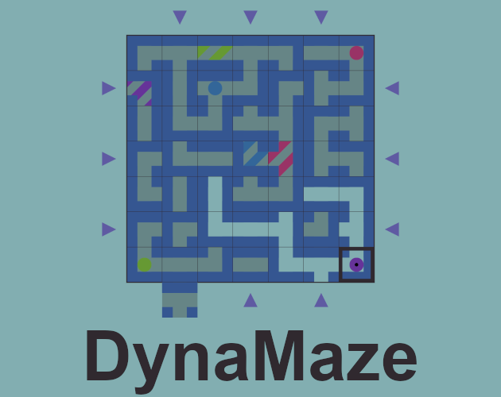

[DynaMaze][dynamaze] is an [open-source][dynamaze-source] multiplayer
puzzle/strategy game written in Rust and compiled to WebAssembly, made by
[@boringcactus][]. Adjust the maze to build a path to your target and
keep the other players from getting to theirs.

[dynamaze]: https://boringcactus.itch.io/dynamaze
[dynamaze-source]: https://github.com/boringcactus/dynamaze
[@boringcactus]: https://github.com/boringcactus

### [Slime99][slime99]


[Slime99][slime99] by [@stevebob][] is an [open-source][slime99-source]
roguelike made for the [7 Day Roguelike 2020][7drl-2020] game jam.

A traditional roguelike where the outcomes of attacking and defending are
pre-determined and visible. Gameplay revolves around fighting slimes, adding to
your sequence of combat outcomes, and using abilities to modify the order in
which combat outcomes occur. It’s set in a neon sewer!

[slime99]: https://gridbugs.itch.io/slime99
[slime99-source]: https://github.com/stevebob/slime99
[@stevebob]: https://github.com/stevebob
[7drl-2020]: https://itch.io/jam/7drl-challenge-2020

### [Will][will]

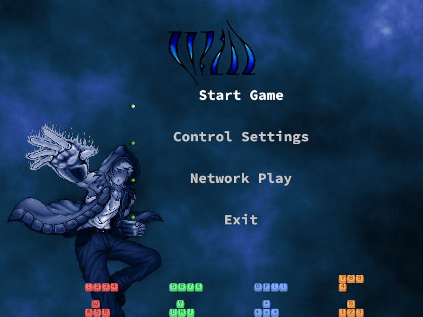

[Will][will] is a 2.5D moddable action/adventure game.

Highlights of [this month's update][will_blogpost] include:

- Going [open-source][will_source]
- Network play (early version)

[will]: https://azriel.im/will
[will_blogpost]: https://azriel.im/will/2020/03/13/join-me/
[will_source]: https://github.com/azriel91/autexousious

### [Tennis Academy: Dash][tennis-academy-dash]

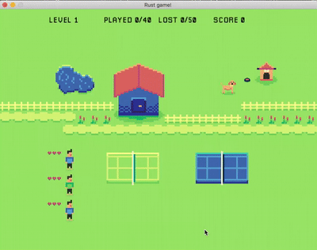

[@oliviff] released [Tennis Academy: Dash][tennis-academy-dash]
[v0.1.7][tennis-academy-v0-1-7]:

- 👟 blue players are back
- 🎆 improved particle effects
- 🖼️ a few art fixes

Also, [@oliviff continues to work on their Rust gamedev tutorial][oliviff-tut].

[@oliviff]: https://twitter.com/oliviff
[tennis-academy-dash]: https://iolivia.itch.io/tennis-academy-dash
[tennis-academy-v0-1-7]: https://twitter.com/oliviff/status/1243972292750819329
[oliviff-tut]: https://twitter.com/oliviff/status/1238978081429299201

### For The Quest


For The Quest is the working title for a game in early development by
[@seratonik][]. Written entirely in Rust and compiled to WebAssembly,
For The Quest is destined to become a MMORPG set in a post-apocalyptic
Earth where your goal is to band together into like-minded factions to
not only survive in this new world, but to unearth the cause of humanity's
downfall.

For The Quest is currently undergoing engine development with a focus on
running smoothly in modern browsers using WebGL 2.0 before moving onto
native desktop ports.

New developments in March:

- Collision and Activation-Based Triggerable Entities (Able to load new areas)
- New overworld "sky light" directional lighting shaders in addition to
  omni-directional point lighting for underground areas
- New Ice Cavern models and textures, establishing a hybrid pixel-art in 3D
  style - mapping tool has been expanded to allow for rotating "tiles" to
  build extensive environments in a simple text format for rapid prototyping
- Specular maps added to the engine and world for that extra shine
- Started refactoring the rendering pipeline to allow for screen-space effects
  such as reflections and ambient occlusion

Follow [@seratonik][] on Twitter for updates.

[@seratonik]: https://twitter.com/seratonik

### [Urban Gift][urban-gift]: Teaser Video

[Urban Gift][urban-gift] is part detective game and part superhero simulator.
This month a teaser video was released:

[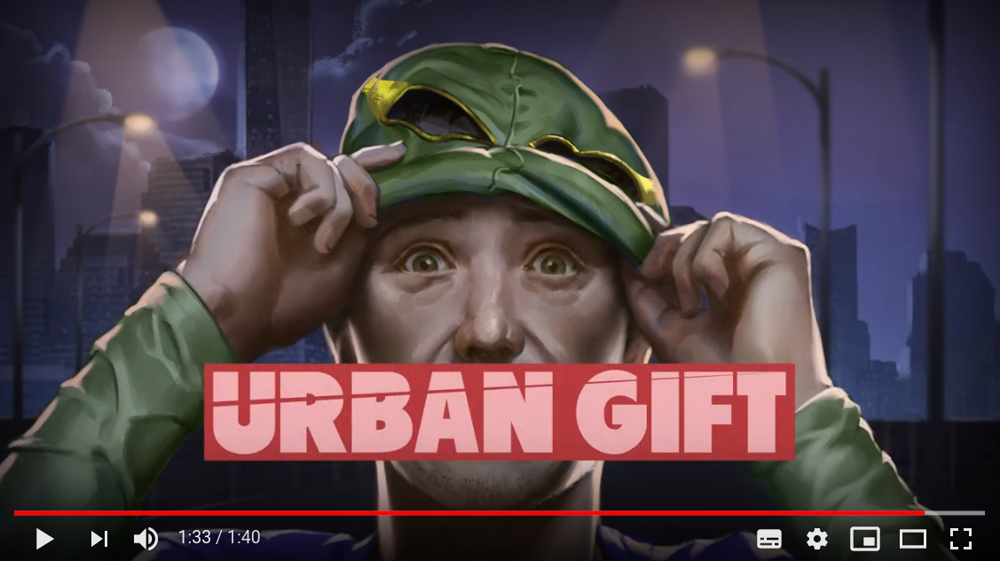][urban-gift-video]

Follow development updates on [Twitter][urban-gift].

[urban-gift]: https://twitter.com/UrbanGiftGame
[urban-gift-video]: https://youtu.be/1dMt8e9Dx3A

### [Realm.One][realm-one]

[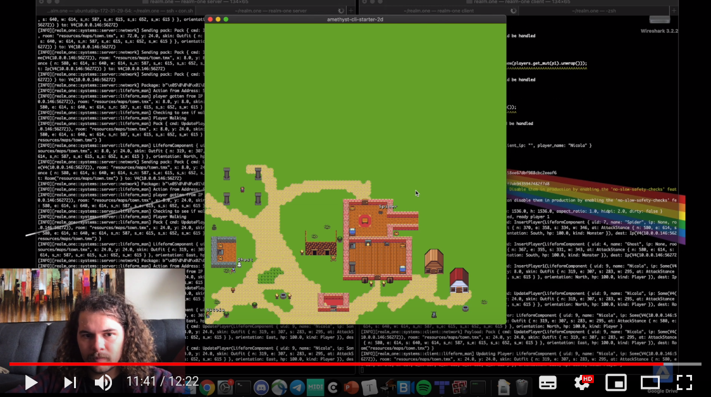][realm-one-vid-1]

[Realm.One][realm-one] is an open-source MMO game
written using the Amethyst game engine.
This month two videos were posted:

- ["GameDev in Rust (Episode 0)"][realm-one-vid-1] -
  ECS-based design with Amethyst, networking and tiled 2d based design.
- ["GameDev in Rust (Episode 1): Monsters and AI!"][realm-one-vid-2] -
  how the monsters are managed on server-side
  and integration with Tiled map editor.

[realm-one]: https://github.com/Machine-Hum/realm.one
[realm-one-vid-1]: https://youtu.be/S5SCBe_CzjQ
[realm-one-vid-2]: https://youtube.com/watch?v=JxT3r56aqcA

### [Colony Genesis][colony-itch]

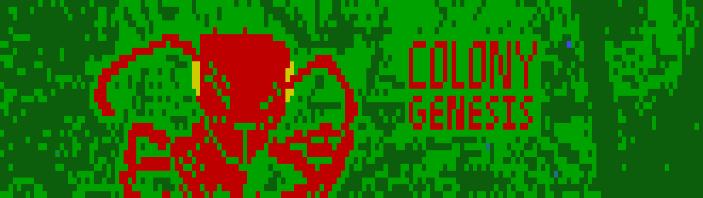

[Native Systems] is working on "Colony Genesis" -
an ant colony sandbox game with ASCII graphics.

This month v0.1.1 and v0.1.2 versions were released. Some of the updates:

- Add color palette options to Settings including a modified palette
  for red-green color blindness
- Add lifecycles to more ant castes
- Nurse ants give food to larvae
- Nurse ants on the surface will return to the colony
- Fix for foragers getting stuck in dig state at colony entrance
- Updated pathfinding

[colony-itch]: https://nativesystems.itch.io/colony
[Native Systems]: https://nativesystems.rs

### [Ascension 2][ascension]


[Ascension 2][ascension] by [@outkine] is a simple gravity-based platformer.

> Hop your way through bite-sized levels while dodging spikes and turrets.
> Then, change the direction of gravity, and do it all again!

[The source code is available here][ascension-src].

[ascension]: https://outkine.itch.io/ascension-2
[ascension-src]: https://github.com/outkine/ascension-rust
[@outkine]: https://github.com/outkine

### pGLOWrpg


[@Roal_Yr] tweeted a bunch of updates about their "pGLOWrpg" project:

- [Rivers erosion](https://twitter.com/Roal_Yr/status/1236003795265519616):
  this will ensure no rivers flow upwards and the canyons
  through the landmass are more smooth.
- [River segmentation and width increment](https://twitter.com/Roal_Yr/status/1242824451449856004).
- [Improved the temperature map generation](https://twitter.com/Roal_Yr/status/1236268367968964610).
- [Improved topography map rendering](https://twitter.com/Roal_Yr/status/1236366942094622721).

[@Roal_Yr]: https://twitter.com/Roal_Yr

### [Akigi][akigi]

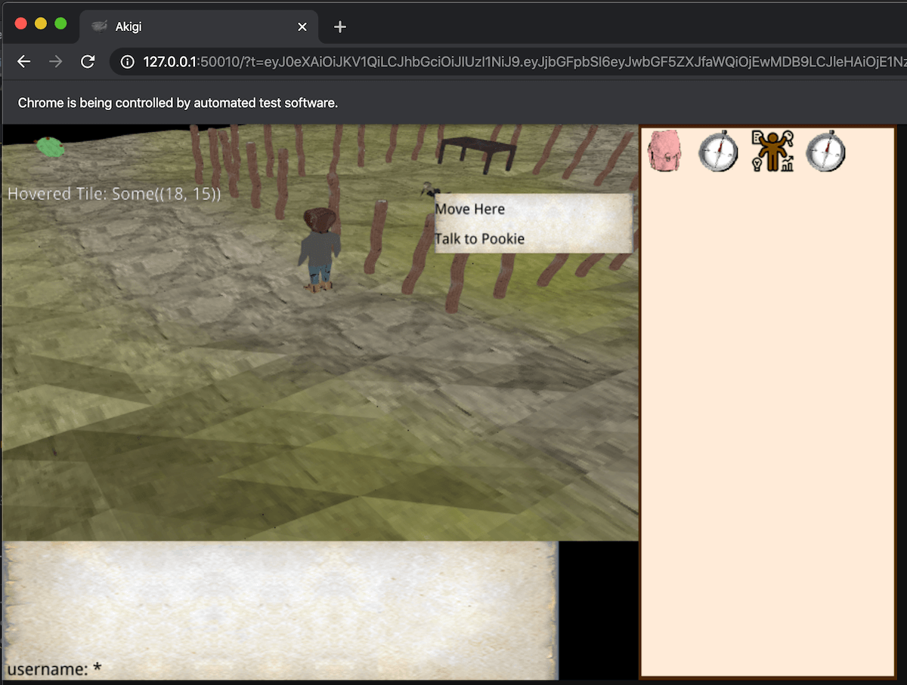

> [Akigi][akigi] is a multiplayer online world
> where most believe that humans are inferior.

Some of March's updates:

- [Migration to specs is finished](https://devjournal.akigi.com/march-2020/058-2020-03-15.html).
- [Asset compilation rewrite](https://devjournal.akigi.com/march-2020/058-2020-03-15.html#asset-compilation-rewrite).
- [Deploying process update](https://devjournal.akigi.com/march-2020/059-2020-03-22.html).
- [Preparations for the initial alpha release is being done](https://devjournal.akigi.com/march-2020/060-2020-03-29.html).

Full devlogs:
[#056](https://devjournal.akigi.com/march-2020/056-2020-03-01.html),
[#057](https://devjournal.akigi.com/march-2020/057-2020-03-08.html),
[#058](https://devjournal.akigi.com/march-2020/058-2020-03-15.html),
[#059](https://devjournal.akigi.com/march-2020/059-2020-03-22.html),
[#060](https://devjournal.akigi.com/march-2020/060-2020-03-29.html),

[akigi]: https://akigi.com

### [Sphere Game][sphere]

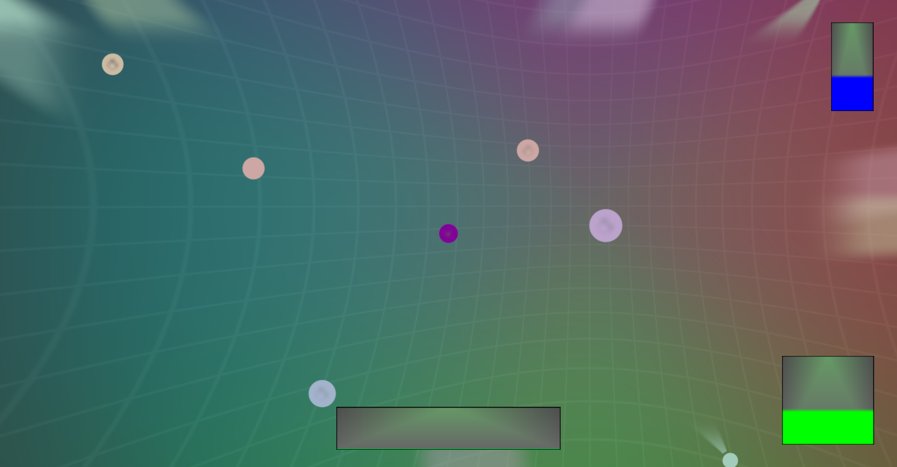

In [Sphere Game][sphere] by [Coffé Junk Studio][coffe]
you control a sphere in a bowl-shaped 2D space:

> Your goal is to hit the other spheres as hard as possible
> to shatter them into pieces!
> But take care; if you get hit too hard too often by other spheres,
> you will be smashed yourself!
> Avoiding them is challenging as the bent space keeps dragging you to the center.
> Can you destroy everything around you until you are the only one left?

The game is a test for the studio's "Sphere Engine" engine
that is being implemented using Rust and Vulkan.

[sphere]: https://coffejunkstudio.itch.io/spheregame
[coffe]: https://twitter.com/CoffeJunkStudio

### [Helix Repair][helix]


[Helix Repair][helix] is another game by [Coffé Junk Studio][coffe]
written using the same engine.
Your task is to repair a broken DNA sequence
by replacing wrong nucleobases with the right ones.
You have 20 seconds: how many nucleobases can you repair within that time?

The game was developed within one weekend during
the Global Game Jam 2020, whose theme was "repair".

[helix]: https://coffejunkstudio.itch.io/helix-repair

### [Garden]: March Devlog

[][garden-video]

[Garden][garden] is an upcoming game centered around growing realistic plants.

[March][garden-devlog] devlogs were posted.
Some of the updates:

- Splashing sweat symbol water diffusion in the new soil;
- Herb improved leaf translucency;
- Joystickcollision detection, player movement;
- Artist palette debug tool for visualizing the forces
  acting upon a game object and its other vectors.

[garden]: https://epcc.itch.io/garden
[garden-devlog]: https://cyberplant.xyz/posts/march
[garden-video]: https://twitter.com/logicsoup/status/1246774418233348096

### [Zemeroth][zemeroth]

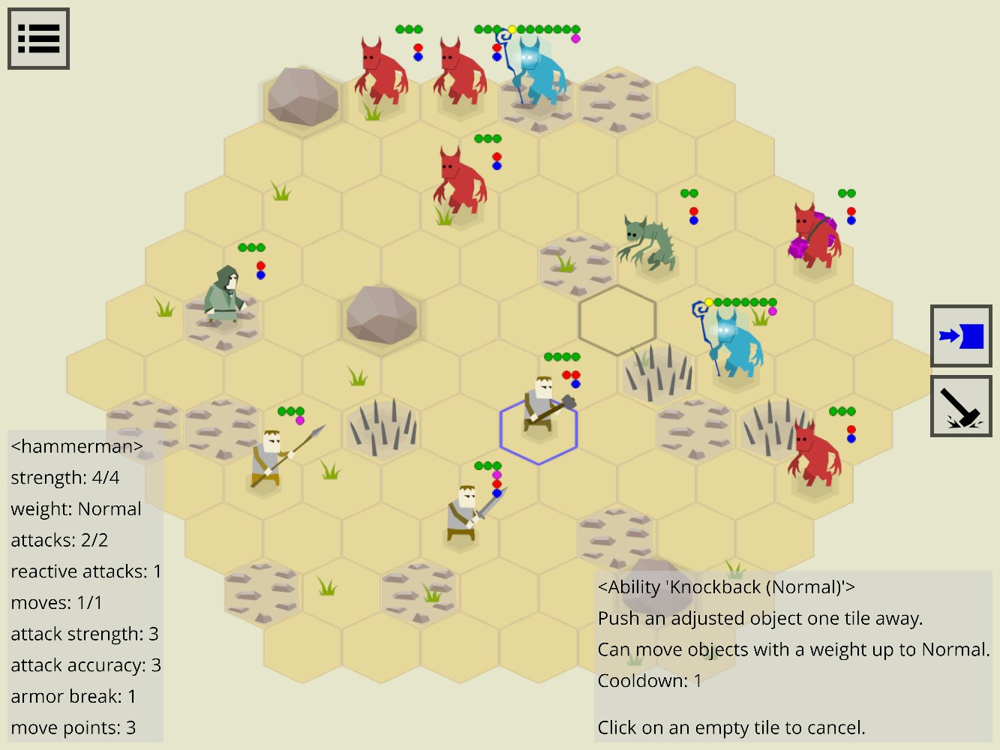

[Zemeroth][zemeroth] by [@ozkriff] is a minimalistic 2D turn-based tactical game.
Some of this month's updates:

- [Some of the text buttons were replaced by icons][zemeroth-icons].
- Ability descriptions.
- Popup screens and exit confirmation dialogs.
- New `zgui` widgets: ColoredRect, LayersLayout.
- Inactive buttons are either hidden or grayed-out now.
- The project [fully switched to `good-web-game`][zemeroth-gwg]
  as the first step of the migration to [miniquad].

[zemeroth]: https://github.com/ozkriff/zemeroth
[@ozkriff]: https://twitter.com/ozkriff
[miniquad]: https://github.com/not-fl3/miniquad
[zemeroth-icons]: https://twitter.com/ozkriff/status/1241718003470917635
[zemeroth-gwg]: https://twitter.com/ozkriff/status/1244960610296696834

### [Veloren][veloren]


_Work on Level of Detail_

[Veloren][veloren] is an open world, open-source voxel RPG
inspired by Dwarf Fortress and Cube World.

Many systems have been worked on in March. Worldsim is making progress through
simulation of civilization over time. The map has seen improvements for
lighting. Certain parts of the UI have been going through big changes. Many
small outstanding issues have been worked on by a few diligent contributors.
Networking is also being reworked from the ground up.

Here is the March changelog:

```text
- Added sfx for wielding/unwielding weapons
- Fixed NPCs attacking the player forever after killing them
- Added sfx for collecting, dropping and using inventory items
- New attack animation
- weapon control system
- Game pauses when in singleplayer and pause menu
- Added authentication system (to play on the official server register on https://account.veloren.net)
- Added gamepad/controller support
- Added player feedback when attempting to pickup an item with a full inventory
- Added free look
- Added Italian, Portuguese, and Turkish translations
```


You can read more about some specific topics:

- [New Networking Protocol](https://veloren.net/devblog-57#new-networking-protocol-by-xmac94x)
- [External Work](https://veloren.net/devblog-58#the-external-work-of-imbris)
- [Winit Issues](https://veloren.net/devblog-59#status-of-the-winit-update-branch)
- [UI Improvements](https://veloren.net/devblog-59#ui-improvements-by-pfau-and-co)
- [Map Improvements](https://veloren.net/devblog-60#map-improvements-by-sharp)
- [World Simulation Process](https://veloren.net/devblog-61#world-simulation-process-by-zesterer)

With the Content Update scheduled to come out at the end of April, many systems
will be finishing up development. Keep a lookout for the launch party!

March's full weekly devlogs: "This Week In Veloren...":
[#57](https://veloren.net/devblog-57),
[#58](https://veloren.net/devblog-58),
[#59](https://veloren.net/devblog-59),
[#60](https://veloren.net/devblog-60),
[#61](https://veloren.net/devblog-61).

[veloren]: https://veloren.net

## Library & Tooling Updates

### [bracket-lib]

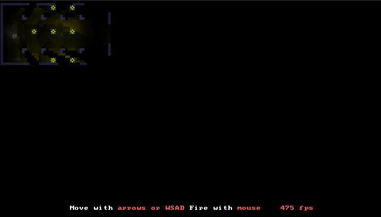

[bracket-lib] (previously `rltk_rs`) by [@blackfuture]
is a Rust implementation of [C++ Roguelike Toolkit][rltk-cpp].

Some of this month's updates:

- Input API.
- `bracket-color` now supports pallets and RGBA.
- The graphical (OpenGL, WASM, Amethyst) render targets now support alpha channel.
- Arbitrary clipping window on any layer.
- New `VirtualConsole` system.
- New functions for right-justifying printed text.
- Fonts and dimensions in terminal layers can now be switched at run-time.
- New layer type that lets you specify glyph position as a float.
- New sprite layer.
- Updated examples.

[bracket-lib]: https://github.com/thebracket/bracket-lib
[@blackfuture]: https://patreon.com/blackfuture
[rltk-cpp]: https://github.com/thebracket/rltk

### [This month in rustsim #10 (March 2020)][rustsim-10]


Main updates:

- [simba] - a crate that defines a set of traits for writing code
  that can be generic with regard to the number
  of lanes of the input numeric value.
  Those traits are implemented by f32, u32, i16, bool
  as well as SIMD types like f32x4, u32x8, i16x2, etc.
- benchmarks:
  ["SIMD Array-of-Structures-of-Arrays in nalgebra and comparison with ultraviolet"][aosoa].
- [alga] abstract algebra crate is switched to passive maintenance mode.

[rustsim-10]: https://rustsim.org/blog/2020/04/01/this-month-in-rustsim
[simba]: https://crates.io/crates/simba
[alga]: https://github.com/rustsim/alga
[aosoa]: https://rustsim.org/blog/2020/03/23/simd-aosoa-in-nalgebra

### gfx-rs and wgpu news


_[deeper] uses wgpu for rendering_

[gfx-hal-0.5](https://github.com/gfx-rs/gfx/) was released!
Improvements done in March:

- Debug markers.
  Users are now able to debug-annotate parts of the rendered frame,
  so that inspecting it in a GPU debugger is more enjoyable.
- The generic range parameters are removed in favor of simple structs.
  This is a move towards simpler low-level API.
- Physical device features for NDC Y-flip and sampler mirror clamp are added.
- Physical device performance hints are introduced.
  The first hint is for "base vertex/instance" support.
- `SmallVec` is removed from the API, it's reshaped
  to avoid any heap allocations.
  Previously, it had to touch the heap on multiple descriptor sets
  or command buffers.
- DX12 got true support for read-only storage bindings.
  This is one of the opt-in derivations from Vulkan that allow to better map
  users logic to non-Vulkan backends, also used by WebGPU.
- Last but not the least, @zicklag
  [has been fighting](https://github.com/gfx-rs/gfx/pull/3151)
  with the OpenGL backend to align its API with the rest of the crowd,
  armed with [surfman](https://github.com/pcwalton/surfman).
  The fight is reading conclusion, and we are crossing fingers
  to add OpenGL support to `wgpu-rs` as it lands.

[wgpu](https://github.com/gfx-rs/wgpu) and
[wgpu-rs](https://github.com/gfx-rs/wgpu-rs) changes in March:

- @grovesNL reached an epic milestone in the Web target
  by showing the [first triangle][wgpu-web-triangle].
  Users will soon be able to seamlessly target the web
  with their existing `wgpu-rs` applications. 🚀
- `wgpu-types` crate is created to share types between the Web target
  and the native one.
- @lachlansneff improved the _async_ story quite a bit,
  we also converted more methods to be asynchronous.
- Debug labels support.
- Id management story for browsers with a GPU process
  has been completely redesigned and now working well.
- All the objects are properly destroyed and GPU tracked if needed.
- Ability to provide a `Surface` so that the selected adapter can present to it.
- New "mailbox" present mode.

Satellite projects:

- [naga] - the new in-house shader translator has reached the milestone
  of successfully loading a WGSL [boids example]
  and generating a valid Metal source for it. 🎉
- [metal-rs](https://github.com/gfx-rs/metal-rs)
  has got a lot of contribution by @adamnemecek.
  Indirect command encoding is particularly exciting!
- [gfx-extras](https://github.com/gfx-rs/gfx-extras) is
  a new library that is forked from rendy-memory/descriptor.
- [gfx-ocean](https://github.com/gfx-rs/gfx-ocean) was moved
  to gfx-rs organization and updated to gfx-hal-0.5.
- [gfx-portability](https://github.com/gfx-rs/portability) was also updated.

[wgpu-web-triangle]: https://github.com/gfx-rs/wgpu-rs/pull/193#issuecomment-599156540
[naga]: https://github.com/gfx-rs/naga
[boids example]: https://github.com/gfx-rs/naga/blob/thda1f6a4/test-data/boids.wgsl
[deeper]: https://github.com/arnfaldur/deeper

### [miniquad]


[miniquad] by [@fedor_games] is a safe cross-platform rendering library
focused on portability and low-end platforms support.
Some of this month's updates:

- example project by @PonasKovas,
  illustrating android and web platform-dependent configuration: [mandelbrot].
- first prototype for embedded debug frame introspection: [introspection].

[mandelbrot]: https://github.com/PonasKovas/miniquad-mandelbrot
[introspection]: https://twitter.com/fedor_games/status/1241616794114232321
[miniquad]: https://github.com/not-fl3/miniquad
[@fedor_games]: https://twitter.com/fedor_games

### [Nannou v0.13][nannou-post]

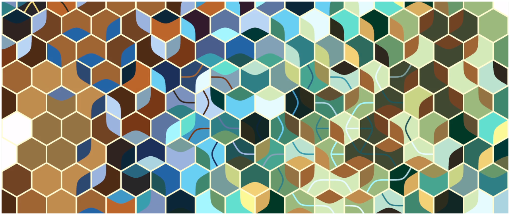
_Daily Sketch 0114 by Mactuitui_

[Nannou][nannou] is a creative coding framework that aims to make it easy
for artists to express themselves with simple, fast, reliable code.

This month [Nannou v0.13 was released][nannou-post].
Some of the updates:

- Migration to wgpu-rs.
- Nicer native macOS experience.
- Capturing Frames & Textures.

Also check out lots of cool sketches from the community:
[\#nannou][nannou-twitter] tag on Twitter.

[nannou]: https://nannou.cc
[nannou-post]: https://nannou.cc/posts/nannou_v0.13
[nannou-twitter]: https://twitter.com/search?q=%23nannou&src=typed_query

### [Quest Engine Part 2: Deploying a Rust App On Android][quest-part-2]


The [second part][quest-part-2] of Nikita Krupitskas'
[blog series][quest-part-1] on developing a game engine for the Oculus Quest
has been posted.

This part of the series describes how a simple Rust project can be built
for Android - useful even if you're not targeting the Oculus hardware!

[quest-part-1]: https://krupitskas.github.io/posts/quest-dev-part-1/
[quest-part-2]: https://krupitskas.github.io/posts/quest-dev-part-2/

### [const-tweaker]

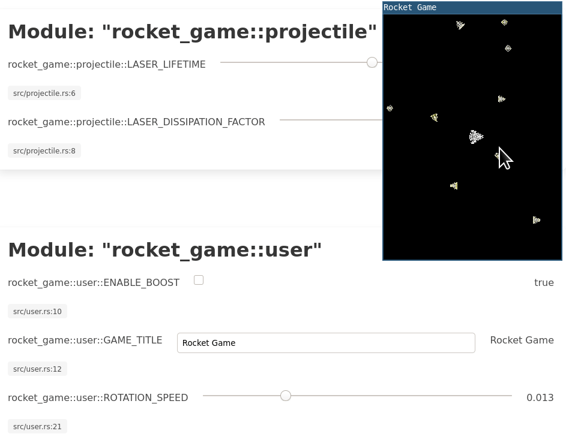

Thomas Versteeg has released a new crate called `const-tweaker`, which provides
a web UI that can be used to tweak `const` variables in a running application.
This can be used as a simpler alternative to embedded scripting languages or
hot-reloading in your games.

_Discussions: [/r/rust](https://www.reddit.com/r/rust_gamedev/comments/fl7593/announcing_consttweaker_change_your_constants/)_

[const-tweaker]: https://github.com/tversteeg/const-tweaker

### [assets_manager]

a1phyr has created a crate called `assets_manager`, which provides a convenient way
to load and cache external resources. It abstracts over the filesystem logic, and
provides a variety of built-in loaders for common Serde formats (e.g. TOML, JSON).
Hot-reloading support is also planned in the future.

_Discussions: [/r/rust](https://www.reddit.com/r/rust_gamedev/comments/foywc6/announcing_assets_manager_conveniently_load_store/)_

[assets_manager]: https://github.com/a1phyr/assets_manager

### [netstack] v0.3.0

[netstack] is a batteries included networking crate for games. Requiring an
exchange of a secret and connection tokens. At the moment, UDP transport,
connection management, packet signaling, and packet acknowledgement are
features already implemented. Examples for getting started are provided
on the [crates.io page](netstack).

Version 0.3.0 adds basic monitoring functionality
along with traits `ClientMonitor` and `ServerMonitor`.
A work-in-progress prometheus exporter has also been added in this version.

Issues and contributions can be made to [Netstack's github repository](netstack-github).
Work in progress documentation is available on [Netstack's docs.rs](netstack-docs).

[netstack]: https://crates.io/crates/netstack/0.3.0
[netstack-github]: https://github.com/Vengarioth/netstack
[netstack-docs]: https://docs.rs/netstack/0.3.0/netstack/

### [three-d] v0.1

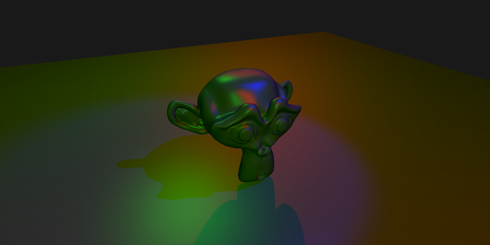

[three-d] is a renderer which targets both desktop (OpenGL) and web
(WebAssembly + WebGL2) which makes it possible to develop a 3D application on
desktop and easily deploy it on web.

This month [three-d v0.1][three-d-v0-1] was released.
Main features:

- Thin and low-level graphics abstraction layer which maps one-to-one with the
  OpenGL/WebGL2 graphics APIs.
- Medium-level modular abstractions of common graphics concepts.
- Deferred renderer with high-level components.
- Default windows for easy setup.


It is possible to build your own rendering features from low- or medium-level
components and combine with other high-level features, so you can already now
make some cool stuff. See for example these [examples][three-d-examples].

[three-d]: https://github.com/asny/three-d
[three-d-examples]: https://asny.github.io/three-d/
[three-d-v0-1]: https://crates.io/crates/three-d

### This Month in Mun

[][Mun]

[Mun] is a scripting language for gamedev focused on quick iteration times
that is written in Rust.

The Mun Team [announced][mun-february] that they have obtained a $15k grant
as part of the [MOSS Mission Partners][moss] track, to further develop hot
reloadable data structures.

Their [March updates][mun-march] include:

- marshalling of value structs;
- extern functions;
- garbage collector (defaults to mark&sweep);
- performance benchmarks;
- bugfixes and improved test coverage.

[Mun]: https://mun-lang.org
[moss]: https://www.mozilla.org/en-US/moss/mission-partners
[mun-february]: https://mun-lang.org/blog/2020/03/10/this-month-february
[mun-march]: https://mun-lang.org/blog/2020/04/02/this-month-march

### [Oxygengine][oxygengine]


This month Oxygengine creator [published plans][oxygengine_plans] for the future
of the engine, where he explains the long term goal of the project that explains
why Oxygen is definitely not a toy or a hobby project and how that will shape
its feature towards being a toolset for the professionals. Project progress
tracker [can be found here][oxygengine_progress].

Also, [@PsichiX] has started to work on the modular game editor
(extendable with user-made plugins) called **Ignite**, that will ease creating
games with the engine.

You can look at [the first editor module][oxygengine_asset_browser] - Asset
Browser:

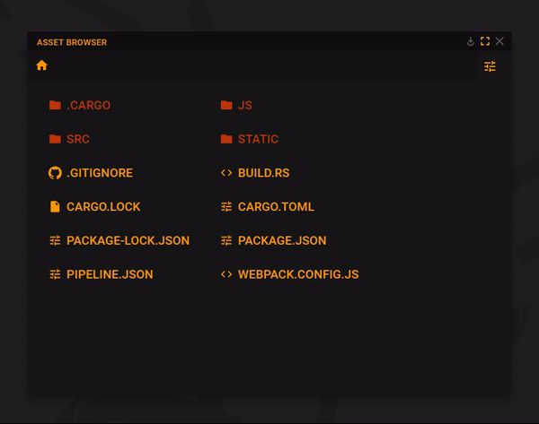

[@PsichiX]: https://github.com/PsichiX
[oxygengine]: https://github.com/PsichiX/Oxygengine
[oxygengine_plans]: https://www.reddit.com/r/rust_gamedev/comments/fe57s0/oxygengine_development_progress_tracker/
[oxygengine_progress]: https://github.com/PsichiX/Oxygengine/projects/1
[oxygengine_asset_browser]: https://twitter.com/PsichiX/status/1243380190752813064

### [Amethyst][amethyst]

[][amethyst]

- [Ametyst 0.15.0 was released][amethyst_release]:

  - Better panic messages on `stable` Rust.
  - Support for setting log levels from configuration.
  - Text field rendering corrections.
  - Target multiple overlapping UI entities with events.

- [`specs`] is the underlying ECS that powers Amethyst but there's an
[ongoing prospect][amethyst_legion_rfc] of moving to [`legion`].
  [@csherratt] wrote an [excellent post][amethyst_specs_legion] comparing both
  libraries. Also an [in-depth discussion][amethyst_ecs_discussion] about
archetypal and grouped ECS design took place on the forum.

  

- [Atelier][amethyst_atelier] is an asset management and processing
  framework for games.
  Coupled with [`legion`], [@aclysma] and [@kabergstrom] built an
  [editor prototype][amethyst_editor_prototype] demonstrating the following
capabilities:

  - Prefab loading, saving, and hot-reloading
  - Entity creation / deletion
  - Component addition / removal
  - Undo and Redo

Check out the [demo video][amethyst_editor_youtube] and
[forum discussion][amethyst_editor_forum].

- There is an [ongoing effort to bring WASM support to Amethyst][amethyst_wasm_effort].
  Check out the [contribution guide][amethyst_wasm_contribution_guide]
and [project board][amethyst_wasm_project_board] for current status.

- [@ToferC] reviewed their experience using Amethyst to build a space combat game,
  [Paladin][amethyst_review_paladin]. Check out the
  [review on youtube][amethyst_review_youtube].

[@aclysma]: https://github.com/aclysma
[@csherratt]: https://github.com/csherratt
[@kabergstrom]: https://github.com/kabergstrom
[@ToferC]: https://github.com/ToferC
[`legion`]: https://github.com/TomGillen/legion
[`specs`]: https://github.com/amethyst/specs
[amethyst]: https://amethyst.rs
[amethyst_atelier]: https://github.com/amethyst/atelier-assets
[amethyst_ecs_discussion]: https://community.amethyst.rs/t/archetypal-vs-grouped-ecs-architectures-my-take/1344
[amethyst_editor_forum]: https://community.amethyst.rs/t/atelier-legion-integration-demo/1352
[amethyst_editor_prototype]: https://github.com/aclysma/atelier-legion-demo
[amethyst_editor_youtube]: https://youtube.com/watch?v=9Vwi29RuQBE
[amethyst_legion_rfc]: https://github.com/amethyst/rfcs/issues/22
[amethyst_release]: https://amethyst.rs/posts/release-0-15-0
[amethyst_review_paladin]: https://github.com/ToferC/paladin
[amethyst_review_youtube]: https://youtube.com/watch?v=avW2Nr6ak-o
[amethyst_specs_legion]: https://csherratt.github.io/blog/posts/specs-and-legion/
[amethyst_wasm_contribution_guide]: https://github.com/amethyst/amethyst/tree/wasm/docs/CONTRIBUTING_WASM.md
[amethyst_wasm_effort]: https://community.amethyst.rs/t/wasm-effort/1336
[amethyst_wasm_project_board]: https://github.com/amethyst/amethyst/projects/20

### [ash] v0.30

`ash` is lightweight wrapper around Vulkan.

The latest version comes with support for Vulkan 1.2 and following extensions:

- VK_KHR_timeline_semaphore
- VK_KHR_ray_tracing
- VK_KHR_external_memory_fd

[ash]: https://github.com/MaikKlein/ash

### [Rectangle Pack][rectangle-pack-homepage] v0.1.5

`Rectangle Pack` is a Rust crate focused on rectangle packing: Laying out any smaller
number of rectangles inside any number of larger rectangles. The developer's use
for the library is in packing textures from texture atlases on the GPU, although
the library does not have any concept of texture, and can be used in any
context where rectangle packing may be needed.

Version 0.1.5 adds implementation for error handling for RectanglePackError.

A getting started guide is available on the [project's homepage][rectangle-pack-homepage].
Full documentation is available at the [rectangle-pack docs.rs section][rectangle-pack-docs].

[rectangle-pack-homepage]: https://github.com/chinedufn/rectangle-pack
[rectangle-pack-docs]: https://crates.io/crates/rectangle-pack/0.1.5

## Popular Workgroup Issues in Github

<!-- Up to 10 links to interesting issues -->

- [rust-gamedev/wg](https://github.com/rust-gamedev/wg):
  - [#50 "Linking Time"](https://github.com/rust-gamedev/wg/issues/50);
  - [#75 "Standardised API for sharing thread pools"](https://github.com/rust-gamedev/wg/issues/75);
  - [#91 "Should the wg volunteer to maintain winapi?"](https://github.com/rust-gamedev/wg/issues/91);
- [rust-gamedev/arewegameyet](https://github.com/rust-gamedev/arewegameyet):
  - [#289 "Netlify previews for PRs?"](https://github.com/rust-gamedev/arewegameyet/issues/289);

## Meeting Minutes

<!-- Up to 10 most important notes + a link to the full details -->

[See all meeting issues][label_meeting] including full text notes
or [join the next meeting][join].

[label_meeting]: https://github.com/rust-gamedev/wg/issues?q=label%3Ameeting

## Requests for Contribution

<!-- Links to "good first issue"-labels or direct links to specific tasks -->

- [Embark's open issues][embark-open-issues] ([embark.rs]);
- [winit's "Good first issue" and “help wanted” issues][winit-issues];
- [gfx-rs's "contributor-friendly" issues][gfx-issues];
- [wgpu's "help wanted" issues][wgpu-help-wanted];
- [luminance's "low hanging fruit" issues][luminance-fruits];
- [ggez's "good first issue" issues][ggez-issues];
- [Veloren's "beginner" issues][veloren-beginner];
- [Amethyst's "good first issue" issues][amethyst-issues];
- [A/B Street's "good first issue" issues][abstreet-issues];
- [Mun's "good first issue" issues][mun-issues];
- @kvark: Anybody wants to work on the [GLSL front-end][naga-issue] in Naga?
  One day, we'll be able to finally replace glsl-to-spirv,
  which is used by a lot of graphics applications and is prone to issues.

[embark.rs]: https://embark.rs
[embark-open-issues]: https://github.com/search?q=user:EmbarkStudios+state:open
[winit-issues]: https://github.com/rust-windowing/winit/issues?utf8=✓&q=is%3Aissue+is%3Aopen+label%3A%22status%3A+help+wanted%22+label%3A%22Good+first+issue%22
[gfx-issues]: https://github.com/gfx-rs/gfx/issues?q=is%3Aissue+is%3Aopen+label%3Acontributor-friendly
[wgpu-help-wanted]: https://github.com/gfx-rs/wgpu-rs/issues?q=is%3Aissue+is%3Aopen+label%3A%22help+wanted%22
[luminance-fruits]: https://github.com/phaazon/luminance-rs/issues?q=is%3Aissue+is%3Aopen+label%3A%22low+hanging+fruit%22
[ggez-issues]: https://github.com/ggez/ggez/labels/%2AGOOD%20FIRST%20ISSUE%2A
[veloren-beginner]: https://gitlab.com/veloren/veloren/issues?label_name=beginner
[amethyst-issues]: https://github.com/amethyst/amethyst/issues?q=is%3Aissue+is%3Aopen+label%3A%22good+first+issue%22
[abstreet-issues]: https://github.com/dabreegster/abstreet/issues?q=is%3Aissue+is%3Aopen+label%3A%22good+first+issue%22
[mun-issues]: https://github.com/mun-lang/mun/labels/good%20first%20issue
[naga-issue]: https://github.com/gfx-rs/naga/issues/23

## Bonus

<!-- Bonus section to make the newsletter more interesting
and highlight events from the past. -->

Just an interesting Rust gamedev link from the past. :)


On 2019.07.16 a puzzle game ["Robo Instructus"][robo-site] by [Alex Butler][bigabgames]
was released after two years of development:
[Steam][robo-steam]/[itch.io][robo-itch] (demo is available).

> Salvage Engineer, you have a new assignment on a distant world...
>
> Robo Instructus is a puzzle game in which players manoeuvre a robot
> by issuing instructions via a simple programming language.
> As players progress through the game they unlock new functions
> to overcome new puzzles, each of which can be solved in multiple ways.
> The more you master the robot, the more elegant and powerful
> your solutions will be.
>
> Take the role of a Salvage Engineer sent across space.
> Use wits and tenacity to uncover the secrets of this isolated, frozen world.

[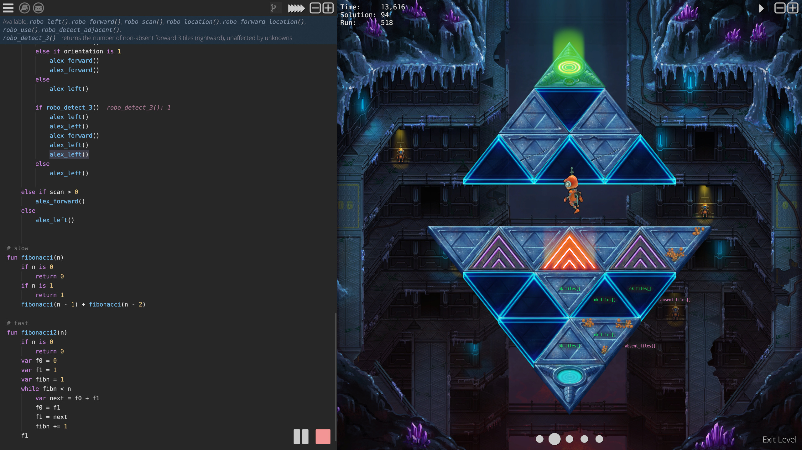][robo-video]

Check out the [release trailer][robo-video].

The game is written using gfx-rs (pre-ll), winit, and opengl.
You can read more about its development in the [**awesome devlog**][robo-log]
that has lots of cool posts like
["Robo Instructus: Behind The Scenes"][robo-behind].

_Discussions:
[/r/rust](https://reddit.com/r/rust/comments/cdw1ct/robo_instructus_is_out_now_programming_puzzle)_

[bigabgames]: https://twitter.com/bigabgames
[robo-steam]: https://store.steampowered.com/app/1032170/Robo_Instructus
[robo-video]: https://youtube.com/watch?v=sIjaIxPp2_w
[robo-itch]: https://bigabgames.itch.io/robo-instructus
[robo-site]: https://www.roboinstruct.us
[robo-log]: https://blog.roboinstruct.us
[robo-behind]: https://blog.roboinstruct.us/2019/06/26/behind-the-scenes.html

------

That's all news for today, thanks for reading!

Subscribe to [@rust_gamedev on Twitter][@rust_gamedev]
or [/r/rust_gamedev subreddit][/r/rust_gamedev] if you want to receive fresh news!

**Discussions of this post**:
[/r/rust](https://reddit.com/r/rust/comments/fx83ki/this_month_in_rust_gamedev_8_march_2020),
[twitter](https://twitter.com/rust_gamedev/status/1247906830212366336).

[/r/rust_gamedev]: https://reddit.com/r/rust_gamedev
[@rust_gamedev]: https://twitter.com/rust_gamedev
