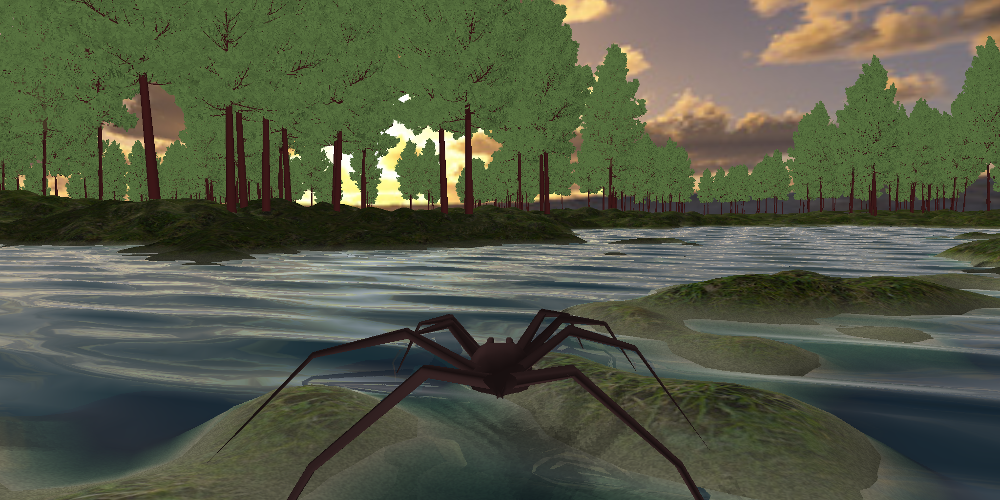

+++
title = "This Month in Rust GameDev #8 - March 2020"
date = 2020-04-01
draft = true
+++

<!-- markdownlint-disable no-trailing-punctuation -->

Welcome to the eighth issue of the Rust GameDev Workgroup’s
monthly newsletter.

[Rust] is a systems language pursuing the trifecta:
safety, concurrency, and speed.
These goals are well-aligned with game development.

We hope to build an inviting ecosystem for anyone wishing
to use Rust in their development process!
Want to get involved? [Join the Rust GameDev working group!][join]

Want something mentioned in the next newsletter?
[Send us a pull request][pr].
Feel free to send PRs about your own projects!

[Rust]: https://rust-lang.org
[join]: https://github.com/rust-gamedev/wg#join-the-fun
[pr]: https://github.com/rust-gamedev/rust-gamedev.github.io

<!--
Ideal section structure is:

```
### [Title]


A paragraph or two with a summary and [useful links].

_Discussions:
[/r/rust](https://reddit.com/r/rust/todo),
[twitter](https://twitter.com/todo/status/123456)_

[Title]: https://first.link
[useful links]: https://other.link
```

Discussion links are added only if they contain
some actual interesting discussions.

If needed, a section can be split into subsections with a "------" delimiter.
-->

## Game Updates

### [DynaMaze][dynamaze]


[DynaMaze][dynamaze] is an [open source][dynamaze-source] multiplayer
puzzle/strategy game written in Rust and compiled to WebAssembly, made by
[@boringcactus][]. Adjust the maze to build a path to your target and
keep the other players from getting to theirs.

[dynamaze]: https://boringcactus.itch.io/dynamaze
[dynamaze-source]: https://github.com/boringcactus/dynamaze
[@boringcactus]: https://github.com/boringcactus

### [Will][will]


[Will][will] is a 2.5D moddable action / adventure game.

Highlights of [this month's update][will_blogpost] include:

* Going [open source][will_source]
* Network play (early version)

[will]: https://azriel.im/will
[will_blogpost]: https://azriel.im/will/2020/03/13/join-me/
[will_source]: https://github.com/azriel91/autexousious

## Library & Tooling Updates

### gfx-rs and wgpu news

[gfx-hal-0.5](https://github.com/gfx-rs/gfx/) was released :tada: 
Improvements done in March:
  - Debug markers. Users are now able to debug-annotate parts of the rendered frame, so that inspecting it in a GPU debugger is more enjoyable.
  - The generic range parameters are removed in favor of simple structs. This is a move towards simpler low-level API.
  - Physical device features for NDC Y-flip and sampler mirror clamp are added
  - Physical device performance hints are introduced. The first hint is for "base vertex/instance" support.
  - `SmallVec` is removed from the API, it's reshaped to avoid any heap allocations. Previously, it had to touch the heap on multiple descriptor sets or command buffers.
  - DX12 got true support for read-only storage bindings. This is one of the opt-in derivations from Vulkan that allow to better map users logic to non-Vulkan backends, also used by WebGPU.
  - Last but not the least, @zicklag [has been fighting](https://github.com/gfx-rs/gfx/pull/3151) with the OpenGL backend to align its API with the rest of the crowd, armed with [surfman](https://github.com/pcwalton/surfman). The fight is reading conclusion, and we are crossing fingers to add OpenGL support to `wgpu-rs` as it lands.

[wgpu](https://github.com/gfx-rs/wgpu) and [wgpu-rs](https://github.com/gfx-rs/wgpu-rs) changes in March:
  - @grovesNL reached an epic milestone in the Web target by showing the [first triangle](https://github.com/gfx-rs/wgpu-rs/pull/193#issuecomment-599156540). Users will soon be able to seamlessly target the web with their existing `wgpu-rs` applications :rocket:
  - `wgpu-types` crate is created to share types between the Web target and the native one.
  - @lachlansneff improved the _async_ story quite a bit, we also converted more methods to be asynchronous.
  - Debug labels support.
  - Id management story for browsers with a GPU process has been completely redesigned and now working well.
  - All the objects are properly destroyed and GPU tracked if needed.
  - Ability to provide a `Surface` so that the selected adapter can present to it.
  - New "mailbox" present mode.

Satellite projects:
  - [naga](https://github.com/gfx-rs/naga) - the new in-house shader translator has reached the milestone of successfully loading a WGSL [boids example](https://github.com/gfx-rs/naga/blob/thda1f6a47b06c89abb1dff70326c076f1088964a3/test-data/boids.wgsl) and generating a valid Metal source for it :tada:
  - [metal-rs](https://github.com/gfx-rs/metal-rs/) has got a lot of contribution by @adamnemecek. Indirect command encoding is particularly exciting!
  - [gfx-extras](https://github.com/gfx-rs/gfx-extras) is a new library that is forked from rendy-memory/descriptor.
  - [gfx-ocean](https://github.com/gfx-rs/gfx-ocean) was moved to gfx-rs organization and updated to gfx-hal-0.5.
  - [gfx-portability](https://github.com/gfx-rs/portability) was also updated.

### [Quest Engine Part 2: Deploying a Rust App On Android][quest-part-2]


The [second part][quest-part-2] of Nikita Krupitskas'
[blog series][quest-part-1] on developing a game engine for the Oculus Quest
has been posted.

This part of the series describes how a simple Rust project can be built
for Android - useful even if you're not targeting the Oculus hardware!

[quest-part-1]: https://krupitskas.github.io/posts/quest-dev-part-1/
[quest-part-2]: https://krupitskas.github.io/posts/quest-dev-part-2/

### [const-tweaker]


Thomas Versteeg has released a new crate called `const-tweaker`, which provides
a web UI that can be used to tweak `const` variables in a running application.
This can be used as a simpler alternative to embedded scripting languages or
hot-reloading in your games.

_Discussions: [/r/rust](https://www.reddit.com/r/rust_gamedev/comments/fl7593/announcing_consttweaker_change_your_constants/)_

[const-tweaker]: https://github.com/tversteeg/const-tweaker

### [assets_manager]

a1phyr has created a crate called `assets_manager`, which provides a convienient way
to load and cache external resources. It abstracts over the filesystem logic, and
provides a variety of built-in loaders for common Serde formats (e.g. TOML, JSON).
Hot-reloading support is also planned in the future.

_Discussions: [/r/rust](https://www.reddit.com/r/rust_gamedev/comments/foywc6/announcing_assets_manager_conveniently_load_store/)_

[assets_manager]: https://github.com/a1phyr/assets_manager

### [three-d] v0.1

[three-d] is a renderer which targets both desktop (OpenGL) and web
(WebAssembly + WebGL2) which makes it possible to develop a 3D application on 
desktop and easily deploy it on web.

This month [three-d v0.1][three-d-v0-1] was released. 
Main features:
- Thin and low-level graphics abstraction layer which maps one-to-one with the
OpenGL/WebGL2 graphics APIs.
- Medium-level modular abstractions of common graphics concepts.
- Deferred renderer with high-level components.
- Default windows for easy setup.

It is possible to build your own rendering features from low- or medium-level 
components and combine with other high-level features, so you can already now 
make some cool stuff. See for example these [examples][three-d-examples].




[three-d]: https://github.com/asny/three-d
[three-d-examples]: https://asny.github.io/three-d/
[three-d-v0-1]: https://crates.io/crates/three-d

### This Month in Mun

[][Mun]

[Mun] is a scripting language for gamedev focused on quick iteration times
that is written in Rust.

The Mun Team [announced][mun-february] that they have obtained a $15k grant
as part of the [MOSS Mission Partners][moss] track, to further develop hot
reloadable data structures.

Their [March updates][mun-march] include:

- marshalling of value structs;
- extern functions;
- garbage collector (defaults to mark&sweep);
- performance benchmarks;
- bugfixes and improved test coverage.

[Mun]: https://mun-lang.org
[moss]: https://www.mozilla.org/en-US/moss/mission-partners
[mun-february]: (https://mun-lang.org/blog/2020/03/10/this-month-february
[mun-march]: https://mun-lang.org/blog/2020/04/02/this-month-march

### [Amethyst]

Amethyst is a data-driven game engine written in Rust.

#### [0.15.0 Release][amethyst_release]

This release brings the following improvements:

* Better panic messages on `stable` Rust.
* Support for setting log levels from configuration.
* Text field rendering corrections.
* Target multiple overlapping UI entities with events.

#### ECS

[`specs`] is the underlying ECS that powers Amethyst; there is an
[ongoing prospect][amethyst_legion_rfc] of moving to [`legion`].

[`@csherratt`] wrote an [excellent post][amethyst_specs_legion] comparing both
libraries, and an [in-depth discussion][amethyst_ecs_discussion] about
archetypal and grouped ECS design took place on the forum.

#### [Editor Prototype][amethyst_editor_prototype]

[Atelier][amethyst_atelier] is an asset management and processing framework for
games.

Coupled with [`legion`], [`@aclysma`] and [`@kabergstrom`] built an
editor prototype demonstrating the following
capabilities:

* Prefab loading and saving
* Prefab hot-reloading
* Entity creation / deletion
* Component addition / removal
* Undo and Redo

Check out the [demo video][amethyst_editor_youtube] and
[forum discussion][amethyst_editor_forum].

#### [WASM Effort][amethyst_wasm_effort]

There is ongoing effort to bring WASM support to
Amethyst. Check out the [contribution guide][amethyst_wasm_contribution_guide]
and [project board][amethyst_wasm_project_board] for current status.

#### User Review

[`@ToferC`] reviewed his experience using Amethyst to build a space combat game,
[Paladin][amethyst_review_paladin]. Check out his
[review on youtube][amethyst_review_youtube] and
[respond on twitter][amethyst_review_twitter].

[`@aclysma`]: https://github.com/aclysma
[`@csherratt`]: https://github.com/csherratt
[`@kabergstrom`]: https://github.com/kabergstrom
[`@ToferC`]: https://github.com/ToferC
[`legion`]: https://github.com/TomGillen/legion
[`specs`]: https://github.com/amethyst/specs
[Amethyst]: https://amethyst.rs
[amethyst_atelier]: https://github.com/amethyst/atelier-assets
[amethyst_ecs_discussion]: https://community.amethyst.rs/t/archetypal-vs-grouped-ecs-architectures-my-take/1344
[amethyst_editor_forum]: https://community.amethyst.rs/t/atelier-legion-integration-demo/1352
[amethyst_editor_prototype]: https://github.com/aclysma/atelier-legion-demo
[amethyst_editor_youtube]: https://www.youtube.com/watch?v=9Vwi29RuQBE
[amethyst_legion_rfc]: https://github.com/amethyst/rfcs/issues/22
[amethyst_release]: https://amethyst.rs/posts/release-0-15-0
[amethyst_review_paladin]: https://github.com/ToferC/paladin
[amethyst_review_twitter]: https://twitter.com/ToferC/status/1243361926786080768
[amethyst_review_youtube]: https://www.youtube.com/watch?v=avW2Nr6ak-o
[amethyst_specs_legion]: https://csherratt.github.io/blog/posts/specs-and-legion/
[amethyst_wasm_contribution_guide]: https://github.com/amethyst/amethyst/tree/wasm/docs/CONTRIBUTING_WASM.md
[amethyst_wasm_effort]: https://community.amethyst.rs/t/wasm-effort/1336
[amethyst_wasm_project_board]: https://github.com/amethyst/amethyst/projects/20

## Popular Workgroup Issues in Github

<!-- Up to 10 links to interesting issues -->

## Meeting Minutes

<!-- Up to 10 most important notes + a link to the full details -->

[See all meeting issues][label_meeting] including full text notes
or [join the next meeting][join].

[label_meeting]: https://github.com/rust-gamedev/wg/issues?q=label%3Ameeting

## Requests for Contribution

<!-- Links to "good first issue"-labels or direct links to specific tasks -->

- [Embark's open issues][embark-open-issues] ([embark.rs]);
- [winit's "Good first issue" and “help wanted” issues][winit-issues];
- [gfx-rs's "contributor-friendly" issues][gfx-issues];
- [wgpu's "help wanted" issues][wgpu-help-wanted];
- [luminance's "low hanging fruit" issues][luminance-fruits];
- [ggez's "good first issue" issues][ggez-issues];
- [Veloren's "beginner" issues][veloren-beginner];
- [Amethyst's "good first issue" issues][amethyst-issues];
- [A/B Street's "good first issue" issues][abstreet-issues];
- [Mun's "good first issue" issues][mun-issues];
- Anybody wants to work on the [GLSL front-end](https://github.com/gfx-rs/naga/issues/23) in Naga? One day, we'll be able to finally replace glsl-to-spirv, which is used by a lot of graphics applications and is prone to issues.

[embark.rs]: https://embark.rs
[embark-open-issues]: https://github.com/search?q=user:EmbarkStudios+state:open
[winit-issues]: https://github.com/rust-windowing/winit/issues?utf8=✓&q=is%3Aissue+is%3Aopen+label%3A%22status%3A+help+wanted%22+label%3A%22Good+first+issue%22
[gfx-issues]: https://github.com/gfx-rs/gfx/issues?q=is%3Aissue+is%3Aopen+label%3Acontributor-friendly
[wgpu-help-wanted]: https://github.com/gfx-rs/wgpu-rs/issues?q=is%3Aissue+is%3Aopen+label%3A%22help+wanted%22
[luminance-fruits]: https://github.com/phaazon/luminance-rs/issues?q=is%3Aissue+is%3Aopen+label%3A%22low+hanging+fruit%22
[ggez-issues]: https://github.com/ggez/ggez/labels/%2AGOOD%20FIRST%20ISSUE%2A
[veloren-beginner]: https://gitlab.com/veloren/veloren/issues?label_name=beginner
[amethyst-issues]: https://github.com/amethyst/amethyst/issues?q=is%3Aissue+is%3Aopen+label%3A%22good+first+issue%22
[abstreet-issues]: https://github.com/dabreegster/abstreet/issues?q=is%3Aissue+is%3Aopen+label%3A%22good+first+issue%22
[mun-issues]: https://github.com/mun-lang/mun/labels/good%20first%20issue

## Bonus

<!-- Bonus section to make the newsletter more interesting
and highlight events from the past. -->

Just an interesting Rust gamedev link from the past. :)

------

That's all news for today, thanks for reading!

Subscribe to [@rust_gamedev on Twitter][@rust_gamedev]
or [/r/rust_gamedev subreddit][/r/rust_gamedev] if you want to receive fresh news!

<!--
TODO: Add real links and un-comment once this post is published
**Discussions of this post**:
[/r/rust](TODO),
[twitter](TODO).
-->

[/r/rust_gamedev]: https://reddit.com/r/rust_gamedev
[@rust_gamedev]: https://twitter.com/rust_gamedev
