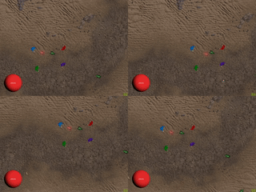
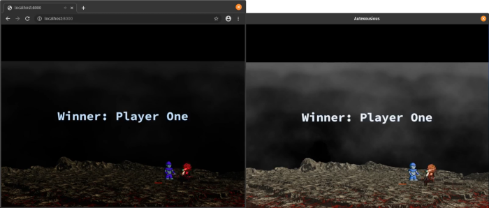
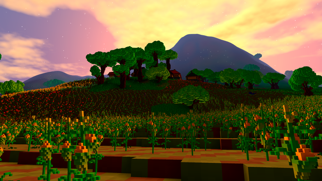
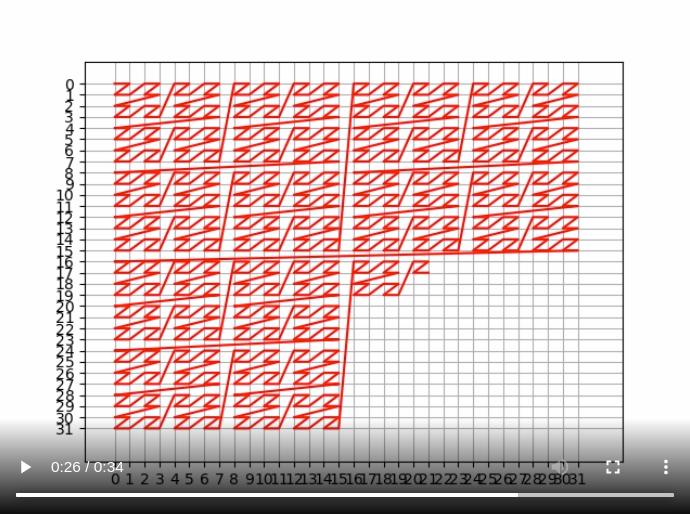
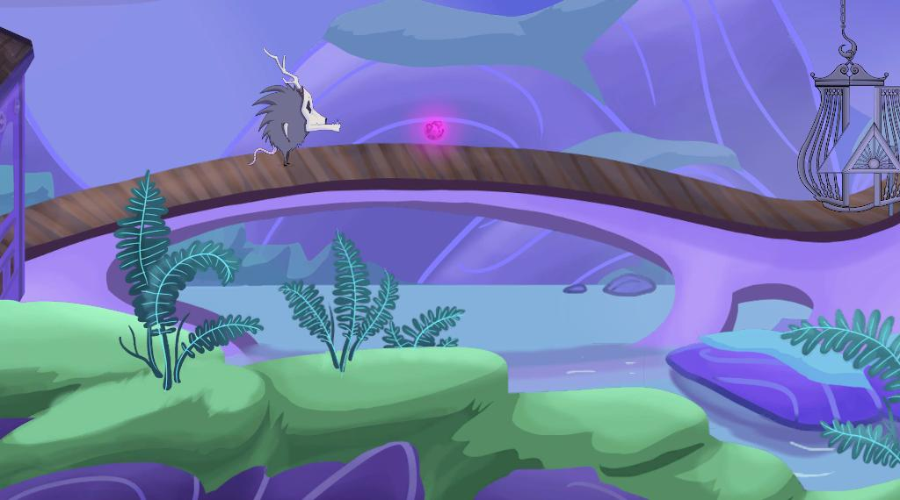
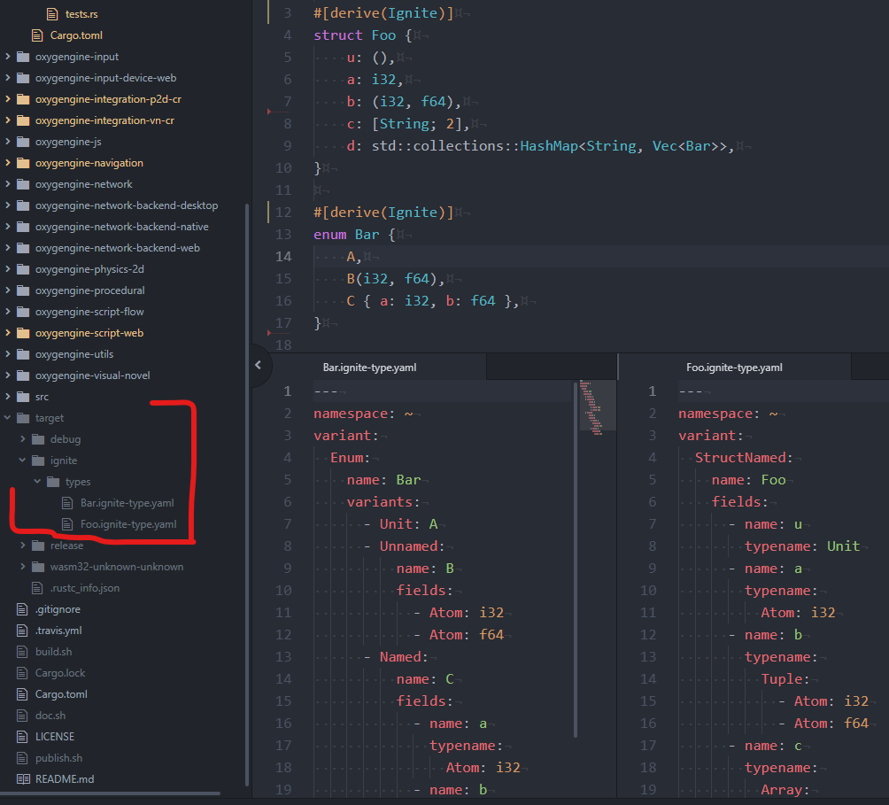
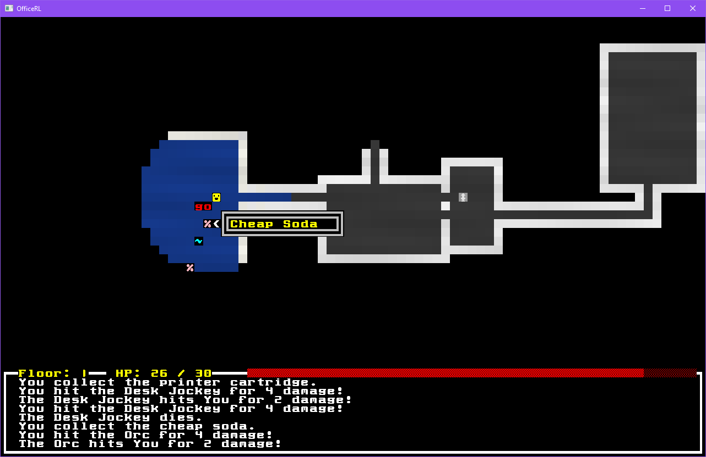

+++
title = "This Month in Rust GameDev #9 - April 2020"
date = 2020-05-04
transparent = true
draft = true
+++

<!-- markdownlint-disable no-trailing-punctuation -->
<!-- markdownlint-enable line-length -->

Welcome to the ninth issue of the Rust GameDev Workgroup’s
monthly newsletter.

[Rust] is a systems language pursuing the trifecta:
safety, concurrency, and speed.
These goals are well-aligned with game development.

We hope to build an inviting ecosystem for anyone wishing
to use Rust in their development process!
Want to get involved? [Join the Rust GameDev working group!][join]

Want something mentioned in the next newsletter?
[Send us a pull request][pr].
Feel free to send PRs about your own projects!

[Rust]: https://rust-lang.org
[join]: https://github.com/rust-gamedev/wg#join-the-fun
[pr]: https://github.com/rust-gamedev/rust-gamedev.github.io

<!--
Ideal section structure is:

```
### [Title]


A paragraph or two with a summary and [useful links].

_Discussions:
[/r/rust](https://reddit.com/r/rust/todo),
[twitter](https://twitter.com/todo/status/123456)_

[Title]: https://first.link
[useful links]: https://other.link
```

Discussion links are added only if they contain
some actual interesting discussions.

If needed, a section can be split into subsections with a "------" delimiter.
-->

## [DUNGEONFOG] is Hiring


[DUNGEONFOG] are developing editor tools for drawing and visualizing
RPG tabletop maps.
They're looking for a wgpu-rs developer for 2D graphics drawing.

You can find all of the details on their [job offer page][dungeonfog-jobs].

[DUNGEONFOG]: https://dungeonfog.com/
[dungeonfog-jobs]: https://dungeonfog.com/about/job-offers/

## [London Virtual Talks (GameDev Special)][ldn-video]

[][ldn-video]

[This month's London Rust meetup][ldn] features three gamedev talks:

- "Rust GameDev WG" by [@\_AlexEne\_][@_AlexEne_] ([slides][ldn-slides-1])
- "Levelling up in Rust" by [@oliviff] ([slides][ldn-slides-2])
- "Scala to Rust: one game at a time" by [@plippe] ([slides][ldn-slides-3])

Here's a [direct link to the recorded stream][ldn-video].

[ldn]: https://meetup.com/Rust-London-User-Group/events/269357779
[ldn-video]: https://youtube.com/watch?v=o9QeKfKLXXM
[ldn-slides-1]: https://docs.google.com/presentation/d/1-uPn_a03oePVxJrw6l0u-DYlbJC_1i8i4DMs5J2grGw
[ldn-slides-2]: https://docs.google.com/presentation/d/1R49kKosTRoQU6UPk9xAc8fXd3_GEnzzrrEfKwS97XHM
[ldn-slides-3]: https://docs.google.com/presentation/d/1YP9ksYnk0Mzycywd0w_4X4QWAPQEqZtm8zTTvVEtedM
[@_AlexEne_]: https://twitter.com/_AlexEne_
[@plippe]: https://github.com/plippe

## Game Updates

### [Crate Before Attack][cratebeforeattack-site]

[][cratebeforeattack-site]

["Crate Before Attack"][cratebeforeattack-site] by @koalefant
is a multiplayer game where frogs combat their friends
while navigating a landscape with their sticky tongue.
It is a hybrid of a realtime and turn-based game.

The game [can be played right in the browser (PC-only)][cratebeforeattack-play].

It is built for Web using [miniquad] and [tokio] crates and features:

- Swift roping (aka grappling hook);
- Diverse weapons;
- Local and online multiplayer;
- Procedural animation;
- Fun physics.

Check the [devlog][cratebeforeattack-devlog]. It has three posts atm:

- ["Inflation"](https://cratebeforeattack.com/posts/20200420-inflation)
- ["Hare Animation"](https://cratebeforeattack.com/posts/20200428-hare-animation)
- ["Rust Experiment"](https://cratebeforeattack.com/posts/20200502-rust)

Also, there're a lot of dev videos on the game's
[YouTube channel][cratebeforeattack-youtube].

[cratebeforeattack-devlog]: https://cratebeforeattack.com/posts
[cratebeforeattack-play]: https://cratebeforeattack.com/play
[cratebeforeattack-site]: https://cratebeforeattack.com
[cratebeforeattack-youtube]: https://youtube.com/channel/UC_xMilPTLuuE5iLs1Ml9zow
[tokio]: https://tokio.rs

### [Realm.One][realm-one]

[][realm-one-vid-3]

[Realm.One][realm-one] is an open-source MMO game
written using the Amethyst game engine.
Recently there has been some simple AI
integrated into the game. This will cause
monsters to chase and attack you!

Next up will be items and experience!

- ["GameDev in Rust (Ep.2): Monsters and AI! (Part B)"][realm-one-vid-3] -
  ECS-based design with Amethyst, networking and tiled 2d based design.

[realm-one]: https://github.com/Machine-Hum/realm.one
[realm-one-vid-3]: https://youtu.be/8hvnjKf4M5M

### [A/B Street][abstreet]

[A/B Street][abstreet] is a game by [dabreegster] exploring how small changes to
road space and traffic signals affect the movement of drivers, cyclists,
transit users, and pedestrians. The game models Seattle as accurately as
possible using [OpenStreetMap] and other public datasets, lets the player adjust
existing infrastructure, and then does a detailed comparison to see who the
changes help and hurt.

First of all, [a standalone 2D GUI crate][abstreet-gui-release] was published
extracted from A/BStreet's GUI code.
It features fully vectorized text using [lyon] and supports lots of
widgets such as "buttons (with keybindings), checkboxes, sliders, pop-up menus,
text entry, and some data viz things".
Thanks to its simplicity (everything is a colored polygon), this crate runs on
many different architectures and even on the web via [glow].

Here's an example of what it can do:


Dabreegster also uploaded a recorded version of their
[rust meetup talk][abstreet-meetup-talk] about the inner working of abstreet.

> In case anybody here is interested in more city simulation in Rust,
> the talk is about half project overview and half deep dive into code.

ABstreet had some great contributor work coming in, notably from omalaspinas who
implemented an optional SEIR pandemic model into the game.

And for anyone interested in more frequent updates, the
[abstreet subreddit][abstreet-subreddit] has had weekly update posts since
September 2019.

_Discussions:
[/r/rust][abstreet-gui-release]_

[dabreegster]: https://github.com/dabreegster/
[abstreet]: https://github.com/dabreegster/abstreet#ab-street
[abstreet-gui-release]: https://www.reddit.com/r/rust/comments/fejx5a/demo_of_a_new_gui_2d_drawing_crate/
[abstreet-meetup-talk]: https://www.reddit.com/r/Citybound/comments/g1k6du/rust_meetup_talk_on_ab_street/
[OpenStreetMap]: https://openstreetmap.org
[abstreet-subreddit]: https://www.reddit.com/r/abstreet
[glow]: https://github.com/grovesNL/glow
[lyon]: https://github.com/nical/lyon

### [Citybound]


> Citybound is a city building game that uses microscopic models to vividly
> simulate the organism of a city arising from the interactions of millions
> of individuals.

It is developed by [aeplay][aeplay] and uses a homemade actor system for
everything called [kay], you can see its power on
[this impressive tech demo][kay-tech-demo].

In April, aeplay made two livestreams about conceptualizing pedestrians and
pandemic models using feedback from the chat.
You can watch the replay for the two livestreams on youtube: [here][cb-live-1]
and [here][cb-live-2].

[Citybound]: https://aeplay.org/citybound
[kay]: https://crates.io/crates/kay
[kay-tech-demo]: https://youtu.be/qr9GTTST_Dk
[aeplay]: https://github.com/aeplay
[cb-live-1]: https://youtu.be/fQMxVV57wzg
[cb-live-2]: https://youtu.be/8DevxAYw47A

### [Scale]


[Scale] is a granular society simulation by [Uriopass], with the objective
of having fully autonomous agents interacting with their world in real time.

A [devlog][scale-blog-post] was published, explaining how pedestrians were added
to the simulation, and that a new renderer based on [wgpu-rs][wgpu-rs] is in
development.
[A short video][scale-pedestrian-video] was also posted together with the post
for a more concise update.

_Discussions:
[/r/rust_gamedev](https://reddit.com/r/rust_gamedev/comments/g7s9bk/scale_devblog_3)_

[Uriopass]: http://douady.paris/aboutme.html
[Scale]: https://github.com/Uriopass/Scale
[scale-blog-post]: http://douady.paris/blog/scale_3.html
[scale-pedestrian-video]: https://youtu.be/QXF1-1BNddM
[wgpu-rs]: https://github.com/gfx-rs/wgpu-rs

### For The Quest


For The Quest is the working title for a game in early development by
[@seratonik]. Written entirely in Rust and compiled to WebAssembly,
For The Quest is destined to become a MMORPG set in a post-apocalyptic
Earth where your goal is to band together into like-minded factions to
not only survive in this new world, but to unearth the cause of humanity's
downfall.

For The Quest is currently undergoing engine development with a focus on
running smoothly in modern browsers using WebGL 2.0 before moving onto
native desktop ports.

New developments in April:

- Finished re-working and optimizing the rendering pipeline to allow for
  post-processing and other screen-space effects
- Planar reflections implemented, and work with an upgraded form of the
  specular maps to determine how reflective a surface is
- Add a flagging system so surfaces can identify their type to the
  shading system so effects can be selectively applied per pixel
- Used the new flagging system to identify water surfaces and make them
  "ripple" their reflections
- Updated the mapping/tile system to support "sunken" floor tiles, which
  allows for ponds, lakes, cliff edges, etc.
- Started work on plans for a streaming asset manager
- New desert/sand tileset models & textures (Thanks [Mishayla][mishayla]!)

Follow [@seratonik] on Twitter for updates.

[@seratonik]: https://twitter.com/seratonik
[mishayla]: https://www.artstation.com/mpaulson

### [Akigi][akigi]


^ _new shadows_

> [Akigi][akigi] is a multiplayer online world where humans
> aren't the only intelligent animals.

Some of this months's updates:

- [Better NPC decision making](https://devjournal.akigi.com/april-2020/061-2020-04-05.html#npc-decision-making).
- [Health bars, water](https://devjournal.akigi.com/april-2020/062-2020-04-12.html)
  and [shadows](https://devjournal.akigi.com/april-2020/063-2020-04-19.html).
- [Displaying damage received](https://devjournal.akigi.com/april-2020/064-2020-04-26.html#displaying-damage-received).

Full devlogs:
[#061](https://devjournal.akigi.com/april-2020/061-2020-04-05.html),
[#062](https://devjournal.akigi.com/april-2020/062-2020-04-12.html),
[#063](https://devjournal.akigi.com/april-2020/063-2020-04-19.html),
[#064](https://devjournal.akigi.com/april-2020/064-2020-04-26.html).

[akigi]: https://akigi.com

### Blobs'n'Bullets


[@rhmoller started working][blobs-tweet] on
a retro twin-stick shooter "Blobs'n'Bullets".
It uses WASM, web-sys, canvas and the gamepad-api
and features a local 2-player coop.

[blobs-tweet]: https://twitter.com/rhmoller/status/1254179448586481669

### [Colony Genesis][colony-itch]


[Native Systems] is working on "Colony Genesis" - an ant colony sandbox game
with ASCII graphics.
This month v0.1.3 and v0.1.4 versions were released. Some of the updates:

- Add controls to highlight all ants by behavior (SHIFT+select)
- Fix frame loop timer to prevent fast forwards
- Adds temperature diffusion and adjusts rates
  It should now be easier to maintain high enough temperatures over night
  and in lower soil layers for eggs to develop normally.

[colony-itch]: https://nativesystems.itch.io/colony
[Native Systems]: https://nativesystems.rs

### [ssshmup]


[ssshmup] by [@mkhan45]
is a small small shoot 'em up made with [ggez] and [specs].

_Discussions:
[/r/rust_gamedev](https://reddit.com/r/rust_gamedev/comments/g6uwah/super_small_shootem_up)_

[ssshmup]: https://github.com/mkhan45/ssshmup
[@mkhan45]: https://github.com/mkhan45
[ggez]: https://ggez.rs
[specs]: https://github.com/amethyst/specs

### [Robo Instructus]

[][robo-news]

[Alex Butler] continues to polish their "[Robo Instructus]" puzzle game -
[1.25, 1.26, and 1.27 versions were released][robo-news]:
automatically follow execution when paused,
bugfixes, dependency updates, and performance optimizations.

[Alex Butler]: https://twitter.com/bigabgames
[Robo Instructus]: https://store.steampowered.com/app/1032170/Robo_Instructus
[robo-news]: https://steamcommunity.com/app/1032170/allnews

------

Also, Alex published a new crate supporting the rasterization
of .otf lines and quad/cubic Bézier curves: [ab_glyph_rasterizer].
It's around 2-5x faster than the current rusttype .ttf rasterizer.

[ab_glyph_rasterizer]: https://crates.io/crates/ab_glyph_rasterizer

### Amethyst Games

- "Conquest" by [@takeryo_eeic] is a hexagonal tactic game.
  This month [its model were updated][conquest-models]
  and the UX was reworked to feel like moving chess pieces.
  Check out a [new gameplay video][conquest-video]:

  [][conquest-video]
  
- [Grumpy Visitors](grumpy_visitors) by [@mvlabat] is a top-down
  2D co-op action/arcade game highly inspired by Evil Invasion.
  Two weeks ago the game received a few updates of UI and multiplayer.
  
  Also, [a short video](grumpy_visitors-video) was posted to twitter,
  showing the latest state of Grumpy Visitors:
  [][grumpy_visitors-video]

- [Boulder Dash] remake by [dpc] - a new remake of an old classic.

  

- [Jérémy Thulliez] shared their experience making 3 little games:

  - A [gameboy proof-of-concept] ([repository][gameboy_repo])
  - [Tetris][tetris_twitter] ([repository][tetris_repo])
  - Pong ([blog post][pong_blogpost], [repository][pong_repo])

- [Will] by [Azriel] is a moddable 2.5D action / adventure game.
  [This month's update][will_update] includes preliminary support for WASM,
  with most effort directed in the underlying Amethyst library.

  Check out the [video][will_video] to see online play between native and web clients.

  [][will_video]

[@takeryo_eeic]: https://twitter.com/takeryo_eeic
[Boulder Dash]: https://github.com/dpc/boulder-dash.rs
[conquest-models]: https://twitter.com/takeryo_eeic/status/1246189179467214850
[conquest-video]: https://twitter.com/takeryo_eeic/status/1249850460678193152
[@mvlabat]: https://github.com/mvlabat
[grumpy_visitors]: https://github.com/amethyst/grumpy_visitors
[grumpy_visitors-video]: https://twitter.com/mvlabat/status/1257362218078867460
[dpc]: https://github.com/dpc
[gameboy proof-of-concept]: https://twitter.com/JeremyThulliez/status/1255042737579134977
[gameboy_repo]: https://github.com/grzi/rust-gameboy-game-poc
[Jérémy Thulliez]: https://twitter.com/JeremyThulliez
[pong_blogpost]: https://www.wootlab.io/blog/pong-in-rust-with-amethyst
[pong_repo]: https://github.com/grzi/rust-pong
[tetris_repo]: https://github.com/grzi/rust-tetris
[tetris_twitter]: https://twitter.com/JeremyThulliez/status/1251903725276454913
[Will]: https://github.com/azriel91/autexousious
[Azriel]: https://twitter.com/im_azriel
[will_update]: https://azriel.im/will/2020/04/24/browsers-assemble/
[will_video]: https://youtu.be/Hc8EtqrlJsE

### Ludum Dare 46 Games

[Ludum Dare 46](https://ldjam.com/) was this month!
The theme was "Keep it alive", and there was a bunch of cool games made in Rust!
Here's a roundup of some of them:

- ["The Hum"](https://ldjam.com/events/ludum-dare/46/the-hum)
  by [Hoichael](https://ldjam.com/users/hoichael),
  [williwiderstand](https://ldjam.com/users/williwiderstand),
  and [NoahRo](https://ldjam.com/users/noahro)
  ([source code](https://github.com/Noah2610/LD46-TheHum),
  [itch.io](https://noahro.itch.io/the-hum)):

  > Feed the bonfire. Keep it alive.

  

- ["The Last Ship"](https://ldjam.com/events/ludum-dare/46/the-last-ship)
  by [FedorL](https://ldjam.com/users/fedorl)
  ([source code](https://github.com/not-fl3/ld46),
  [itch.io](https://fedorgames.itch.io/ld46),
  [Twitter thread](https://twitter.com/fedor_games/status/1251900504369778690)):

  > Carry humanity from dying planet into the bright future!

  

- ["Frog Rations"](https://ldjam.com/events/ludum-dare/46/frog-rations)
  by [healthire](https://ldjam.com/users/healthire)
  ([source code](https://github.com/Healthire/ld46),
  [Twitter thread](https://twitter.com/healthire_/status/1251412661016895488)):

  > Keep the frog alive by eating flies, but beware of the snake!

  

- ["WOODS"](https://ldjam.com/events/ludum-dare/46/woods)
  by [Feilkin](https://ldjam.com/users/feilkin)
  ([source code](https://github.com/Feilkin/mela/tree/master/examples/ld46),
  [itch.io](https://feilkin.itch.io/woods)):

  > Keep the flame alive in the darkness!

  

- ["Wonder"](https://ldjam.com/events/ludum-dare/46/wonder)
  by [Ian Kettlewell](https://ldjam.com/users/ian-kettlewell)
  ([source code](https://github.com/kettle11/LD46),
  [itch.io](https://kettlecorn.itch.io/wonder)):

  > Keep alive a sense of wonder.

  

- ["Lighthouse Keeper"](https://ldjam.com/events/ludum-dare/46/lighthouse-keeper)
  by [dooskington](https://ldjam.com/users/dooskington)
  ([source code](https://github.com/Dooskington/ld46),
  [itch.io](https://dooskington.itch.io/ld46-lighthouse-keeper)):

  > Alone on a rock in the sea, your job is an important one. Keep the lighthouse
  > safe and operational, and don’t lose your mind. The goal is to survive for 30
  > days. Unfinished.

  

- ["Fermi Paradox"](https://ldjam.com/events/ludum-dare/46/fermi-paradox)
  by [tversteeg](https://ldjam.com/users/tversteeg)
  ([source code](https://github.com/tversteeg/ld46)):

  > How come we don’t see any life from other planets? What does an intergalactic
  > society need to do to survive? Fermi Paradox is a combination of the arcade
  > games of yesteryear with some modern twists.

  

### [Veloren][veloren]


^ _Early procedural building generation_

[Veloren][veloren] is an open world, open-source voxel RPG
inspired by Dwarf Fortress and Cube World.

Lots of systems have been finished up in April to prepare for the launch of 0.6.
Many improvements have been made to the combat systems. Basic world and
civilization simulations have been implemented. Lots of new soundtracks have
been added. The UI is being reworked. Experimental work is being done with
migrating to wgpu, and the level of detail system is a lot closer to being
merged. Villagers have been getting a lot of love as well, making the world feel
more alive.

Here is the April changelog:

```text
- Complete rewrite of the combat system into a state machine
- Abilities like Dash and Triplestrike
- Fireball explosions
- Many new armors and weapons to find in chests
- Fleshed out "attack" animation into alpha, beta and spin type attacks
- Fleshed out range attack into charging and shooting anims for staff/bow
- Added a silhouette for players when they are occluded
- Added transparency to the player when zooming in
- Added dragging and right-click to use functionality to inventory, armor & hotbar slots
- Added basic world and civilisation simulation
- Added fields, crops and scarecrows, paths, bridges, procedural house generation
- Added lampposts, NPCs that spawn in towns, and simple dungeons
- Added sub-voxel noise effect
- Added waypoints next to dungeons
- Added non-uniform block heights
- Added a Level of Detail (LoD) system for terrain sprites and entities
- Villagers tools and clothing, cultists clothing
- You can start the game by pressing "enter" from the character selection menu
```



^ _Early procedural building generation_

You can read more about some specific topics from April:

- [Player Transparency](https://veloren.net/devblog-62#capucho)
- [Towns and Dungeons](https://veloren.net/devblog-64#towns-and-dungeons)
- [wgpu](https://veloren.net/devblog-64#wgpu-with-capucho)
- [Tarpaulin and Toolchains](https://veloren.net/devblog-65#tarpaulin-and-toolchains-by-angelonfira)
- [LoD Progress](https://veloren.net/devblog-65#lod-and-lighting-progress-from-sharp)
- [Sprite LoD](https://veloren.net/devblog-65#sprite-lod-from-zesterer)

The final touches of 0.6 are wrapping up. The team will meet once 0.6 is
released to disucss what 0.7 will look like. See you next month!

April's full weekly devlogs: "This Week In Veloren...":
[#62](https://veloren.net/devblog-62),
[#63](https://veloren.net/devblog-63),
[#64](https://veloren.net/devblog-64),
[#65](https://veloren.net/devblog-65),

[veloren]: https://veloren.net

## Library & Tooling Updates

### Rust Sokoban Tutorial


Rust Sokoban tutorial is an online book aimed at Rust gamedev beginners
which walks through making a simple Sokoban game using ECS, ggez and specs.
It tries to teach the basics of architecting in ECS and basic Rust concepts
through a hands-on approach.
[@oliviff] is currently looking for a few people
to beta test the tutorial before it goes live,
if you've got a spare couple of hours and you'd like to contribute,
send her a [DM][oliviff-dm].

[@oliviff]: https://twitter.com/oliviff
[oliviff-dm]: https://twitter.com/messages/compose?recipient_id=118804845

### [μsfx - 0.1.3][usfx-cratesio]
μsfx is a small library built for generating sound effects in code during
runtime. μsfx can be integrated with the `cpal` and `music` crates as well as
`SDL2` crate bindings.

Samples are available on [μsfx's github readme][usfx-github] and further
documentation is avialable on the [docs.rs page][usfx-docsrs].

This latest version (0.1.3) provides fixes for saw, triangle,
and square waves.

[usfx-github]: https://github.com/tversteeg/usfx
[usfx-cratesio]: https://crates.io/crates/usfx
[usfx-docsrs]: https://docs.rs/usfx/0.1.3/usfx/

### [iced - v0.1][iced-releasenotes]
[Iced][iced-cratesio] is experimental, cross-platform GUI crate focusedd on simplicity and
type safety. Iced can be used natively, in a web browser, or can use wgpu,

The new release includes:
  * Styling based on trait implementations.
  * Event subscriptions that take place asynchronously by using streams.
  * `Canvas` widgets, for drawing 2D graphics
  * `PaneGrid` widgets, which can dynamically organize layout by splitting
  panes that can be resized.
  * `Svg` widgets, which can render vector graphics.
  * `ProgressBar` widgets
  * Integration into exisiting `wgpu` projects.
  * Options for integrating futures executors into a project.
  * TextInput selection
  * Texture Atlas support for `iced-wgpu`

Full docuementation for Iced is available on the [docs.rs page][iced-docsrs]
as well as examples and how to contribute are available on [iced github repo][iced-github]

[iced-releasenotes]: https://github.com/hecrj/iced/pull/253
[iced-cratesio]: https://crates.io/crates/iced
[iced-github]: https://github.com/hecrj/iced
[iced-docsrs]: https://docs.rs/iced/0.1.1/iced/

### [assets_manager - v0.2.2][assets-manager-reddit-release-post]
[assets_manager][assets-manager-cratesio] is a crate that provides convenient loading,
caching, and reloading of external resources. The crate is pay-for-what-you-take,
provides a high level API, and is concurrent.

This newest version provides for hot-reloading, directory-loading (being able
to load from a single directory all at once, for extensible games), meta
loaders, and various other improvements.

Examples and documentation are available on [assets_manager's docs.rs][assets-manager-docsrs]
and additional information about contributing are available on the [github repository][assets-manager-github]

[assets-manager-reddit-release-post]: https://www.reddit.com/r/rust_gamedev/comments/gadq3i/asset_manager_022_hotreloading_and_directory/
[assets-manager-cratesio]: https://crates.io/crates/assets_manager
[assets-manager-github]: https://github.com/a1phyr/assets_manager
[assets-manager-docsrs]: https://docs.rs/assets_manager/0.2.2/assets_manager/

## [Multiple ECS in My Personal Game Project][ecs-post]

[@dasifefe shared their thoughs][ecs-post]
about using multiple ECSes in a project.

[ecs-post]: https://dasifefe.com/post-2020-04-05-01.html

## [Measuring Build Timings with mathbench][mathbench-time]

[@bitshifternz] (author of [glam]) has written [a blog post][mathbench-time]
about comparing build times of some popular Rust gamedev math crates
(including glam, cgmath, nalgebra, euclid, vek, pathfinder_geometry)
using a [mathbench-rs] unit tests suit.

[mathbench-time]: https://bitshifter.github.io/2020/04/12/mathbench-build-timings
[@bitshifternz]: https://twitter.com/bitshifternz
[mathbench-rs]: https://github.com/bitshifter/mathbench-rs
[glam]: https://github.com/bitshifter/glam-rs

## [Tutorial on 3D Graphics, Rust, Vulkan, and ash][ash-tutorial]

@hoj-senna started writing a new tutorial about [ash] and Vulkan in general:
["Ashen Aetna"][ash-tutorial].
The current version has 20 chapters and covers basics of general 3d graphics
and setting all the stuff you need to draw your first triangle with [ash].

_Discussions:
[/r/rust](https://reddit.com/r/rust/comments/g7pypb/3d_graphics_rust_vulkan_ash)_

[ash-tutorial]: https://hoj-senna.github.io/ashen-aetna
[ash]: https://github.com/MaikKlein/ash

## [Implementing a Linear Quadtree in Rust][quadtree-post]



[@snorrwe] has written [a blog post][quadtree-post]
about exploring an implementation of a linear quadtree
and comparing it with a naive implementation of spacial data querying.
All code mentioned in the post [is available on GitHub][quadtree-repo].

_Discussions:
[/r/rust](https://reddit.com/r/rust/comments/g69hgg/ive_published_my_first_blog_post_implementing)_

[quadtree-post]: https://snorrwe.onrender.com/posts/morton-table
[quadtree-repo]: https://github.com/snorrwe/morton-table
[@snorrwe]: https://snorrwe.onrender.com/

## [Simple 2D Camera System for Rust with GGEZ][ggez-camera]

[@sylvain has written a tutorial][ggez-camera] about implementing
a simple 2D camera on top of [GGEZ][ggez].

[ggez-camera]: https://dev.to/sobertkaos/simple-2dcamera-system-for-rust-with-ggez-2o2h
[ggez]: https://ggez.rs

## [Symmetric Matrices & Triangle Numbers][matrices-post]



^ _The pink orb should not collide with the player,
but it should collide with the ground._

[Anthropic Studios][anthropic] has [shared a post][matrices-post]
about implementing a layer system to ["Way of Rhea"'s][rhea] physics engine
using [symmetric matrices] and [triangle numbers].

[rhea]: https://store.steampowered.com/app/1110620/Way_of_Rhea
[anthropic]: https://anthropicstudios.com
[matrices-post]: https://anthropicstudios.com/2020/03/30/symmetric-matrices
[symmetric matrices]: https://en.wikipedia.org/wiki/Symmetric_matrix
[triangle numbers]: https://en.wikipedia.org/wiki/Triangular_number

### `gfx-rs` and `wgpu` News


^ _[hectic-rs] - Rust/wgpu/specs re-write of hectic by [@expenses]_

wgpu-0.5 release happened! See the [changelog][wgpu-0-5].
It's based on `gfx-hal-0.5` (which was covered in the [March newsletter][gfx-march]),
uses in-house gfx-extras crates adopted from Rendy,
has many fixes and improvements, and totally changes the way passes are recorded.

`wgpu` project got restructured by only leaving `wgpu-core` and `wgpu-types`
in the main ("core logic") repository.
`wgpu-native` is moved out into a [separate one][wgpu-native].
`wgpu-remote` got fully moved into mozilla-central as "gfx/wgpu_bindings"
(this is "gfx" in a general sense, not gfx-rs in particular).

The Web target  (aka "wasm32-unknown-unknown") is now officially supported
by `wgpu-rs`! 🎉
@grovesNL wrote the announcement to [gfx-rs blog][wgpu-wasm-blog].

At the same time, @kvark was implementing support for WebGPU in Firefox
(Nightly only) with help of `wgpu`.
They published results of this milestone on [Mozilla Hacks][wgpu-in-firefox].
The combined efforts allowed all the `wgpu-rs` examples to be run
in Firefox Nightly on all platforms
(yes, even on Android, terms and conditions apply...).

Given the wide spectrum of uses for `wgpu` ("core"), it became most important
to be able to debug and reproduce visual issues, be it either the user's fault,
or wgpu implementations'.
To aid these scenarios, a new [API tracing infrastructure][wgpu-pr-tracing]
was built into the core.
It's now possible to replay user's `wgpu` workloads in a separate player
on an entirely different platform.

In gfx-rs land, @mistodon created a nice [series of tutorials][gfx-hal-tutorials]
for the gfx-hal API.

[wgpu-0-5]: https://github.com/gfx-rs/wgpu/blob/master/CHANGELOG.md#v05-06-04-2020
[gfx-march]: https://rust-gamedev.github.io/posts/newsletter-008/#gfx-rs-and-wgpu-news
[wgpu-wasm-blog]: https://gfx-rs.github.io/2020/04/21/wgpu-web.html
[wgpu-in-firefox]: https://hacks.mozilla.org/2020/04/experimental-webgpu-in-firefox
[wgpu-native]: https://github.com/gfx-rs/wgpu-native
[wgpu-pr-tracing]: https://github.com/gfx-rs/wgpu/pull/619
[gfx-hal-tutorials]: https://www.falseidolfactory.com/projects/learning-gfx-hal
[hectic-rs]: https://github.com/expenses/hectic-rs
[@expenses]: https://github.com/expenses

### [Oxygengine]


This month [@PsichiX] - creator of the [Oxygengine] game engine - made
further progress with the Ignite game editor, a hub application for game making
tools for Indie game developers.

- Code editor and Media player:

  

- Play Mode window to play and test your game directly in the editor:

  

- Additionaly new procedural macro was introduced into Oxygengine, this macro
  allows to bake information about types that will tell Ignite how to edit data of
  this types:

  

There was an additional work done within Oxygengine ecosystem, which is
[Chrobry](chrobry) crate - data driven template engine which is used in Ignite
as part of tool that allows to create new projects from templates provided by
plugins imported into Ignite editor.

If you want to be up to date with Oxygengine ecosystem progress, make sure to
follow project on GitHub and see [Oxygengine Project board](oxygengine-project).

[@PsichiX]: https://github.com/PsichiX
[Oxygengine]: https://github.com/PsichiX/Oxygengine
[oxygengine-project]: https://github.com/PsichiX/Oxygengine/projects/1
[chrobry]: https://github.com/PsichiX/Chrobry

### [erupt]


[erupt] provides bindings to the Vulkan API.

Features include:

- Full Vulkan API coverage
- First-class support for all extensions
- High quality auto-generated function wrappers
- A diverse `utils` module
- Complete auto-generation of everything except `utils`
- Function loading
- A high level `Builder` for every struct
- Type-safe pointer chain support

Just like ash, erupt focuses on exposing good bindings to the *raw* Vulkan API
instead of providing manually written wrappers around it like Vulkano. On top
of this it tries to improve on some features where ash lacks, e.g.
auto-generation, extensions, documentation and utils.

For more information visit [docs.rs][erupt-docs] and [GitLab][erupt-gitlab].

[erupt]: https://crates.io/crates/erupt
[erupt-docs]: https://docs.rs/erupt
[erupt-gitlab]: https://gitlab.com/Friz64/erupt

### [bracket-lib]



[bracket-lib] is a toolkit for creating roguelikes in Rust.
Version 0.8.0 of the library was released this month,
adding many new features and fixes, such as:

- A new input system
- RGBA support, with conversions to RGB and HSV
- Support for bigger Unicode font maps
- A 'flexible' terminal with support for floating point positions
- A 'sprite' terminal that lets you render sprites wherever you want
- A 'virtual' terminal, sections of which can be rendered to other terminals
- Runtime font switching
- OpenGL hooks
- Framerate limiting

Full release notes are available on [/r/rust][bracket-lib-0.8].

The author of the library has also published a [new tutorial][bracket-lib-noise],
showing how you can use simplex noise to generate worlds
\[[twitter thread][bracket-lib-noise-twitter]\].

In the wider community, DrMelon has published a alpha version of [OfficeRL],
a roguelike built with bracket-lib that's set
in an eternally sprawling office complex.

[bracket-lib]: https://github.com/thebracket/bracket-lib
[bracket-lib-0.8]: https://www.reddit.com/r/rust_gamedev/comments/fz5rb7/bracketlib_work_week_of_4112020_080_has_shipped/
[bracket-lib-noise]: https://bracketproductions.com/posts/minituts/spherical_noise/
[bracket-lib-noise-twitter]: https://twitter.com/herberticus/status/1252335121258237953
[OfficeRL]: https://drmelon.itch.io/officerl

### [miniquad]


^ _`miniquad` project got a logo_

[miniquad] is a safe and cross-platform rendering library
focused on portability and low-end platforms support.

This month `miniquad`-based games got a recommended way to make sounds:
[quad-snd].
Here's a [WASM demo][quad-snd-demo] ([source][quad-snd-demo-src]).

[good-web-game] now uses [quad-snd] and can run ggez's ["sounds"][ggez-sounds]
example: [WASM demo][gwg-sounds-demo].

[good-web-game]: https://github.com/not-fl3/good-web-game
[quad-snd]: https://github.com/not-fl3/quad-snd
[quad-snd-demo]: https://not-fl3.github.io/miniquad-samples/mixer.html
[quad-snd-demo-src]: https://github.com/not-fl3/quad-snd/blob/master/examples/mixer.rs
[miniquad]: https://github.com/not-fl3/miniquad
[ggez-sounds]: https://github.com/not-fl3/good-web-game/blob/audio/examples/sounds.rs
[gwg-sounds-demo]: https://not-fl3.github.io/miniquad-samples/sounds.html

### [macroquad]

`macroquad` is minimalistic game framework on top of miniquad,
strongly inspired by [raylib].

This month `macroquad`'s rendering system got 2D custom cameras support:
[example source][macroquad-example-camera].
Also, `macroquad`'s UI system now support TTF fonts:
[online demo][macroquad-example-ui], [source][macroquad-example-ui-src].

[macroquad]: https://github.com/not-fl3/macroquad
[macroquad-example-camera]: https://github.com/not-fl3/macroquad/blob/master/examples/camera.rs
[macroquad-example-ui]: https://not-fl3.github.io/miniquad-samples/ui.html
[macroquad-example-ui-src]: https://github.com/not-fl3/macroquad/blob/master/examples/ui.rs
[raylib]: https://www.raylib.com

### [Tetra][tetra]

[Tetra][tetra] is a simple 2D game framework, inspired by XNA and [Raylib][raylib].
After a quiet few months, versions [0.3.3][tetra-033], [0.3.4][tetra-034]
and [0.3.5][tetra-035] were all released over the course of April.

Highlights of this month's updates include:

- New integrations with the OS, such as file dropping and clipboard manipulation
- More utilities for working with mouse and keyboard input
- Enhancements to the animation API
- Various under-the-hood improvements and optimizations

[Tetra's website][tetra-website] has also had an overhaul,
and is [looking for contributions to the showcase section][tetra-showcase].
If you're working on a project with Tetra, submit an issue or a PR
to the [website repo][tetra-website-repo] to get it added!

[tetra]: https://github.com/17cupsofcoffee/tetra
[tetra-033]: https://twitter.com/17cupsofcoffee/status/1246407935980339200
[tetra-034]: https://twitter.com/17cupsofcoffee/status/1249410227935510536
[tetra-035]: https://twitter.com/17cupsofcoffee/status/1254076418365030400
[tetra-website]: https://tetra.seventeencups.net/
[tetra-showcase]: https://twitter.com/17cupsofcoffee/status/1255901557322928128
[tetra-website-repo]: https://github.com/17cupsofcoffee/tetra-www

### [Dathos]


[Dathos] is a simple, extendable 2D game engine built in Rust.
It exposes a Ruby API for writing game/rendering logic,
and a Rust API that allows you to build native extensions for those scripts.

[@resinten][resinten], the author of the engine, has also published
an example game called [Melody Madness][melody-madness].
Players submit commands via a Slack channel,
trying to write a melody one note at a time.

[Dathos]: https://github.com/BrianMWest/dathos-game-engine
[resinten]: https://twitter.com/resinten/status/1255697868104531968
[melody-madness]: https://github.com/BrianMWest/melody-madness

### [Shipyard] v0.4

[Shipyard] is an ECS library built on top of sparse sets.

Main changes:

- Systems are now functions
- Workloads can return errors
- `Iterator` and `IntoIterator` are supported

[Shipyard]: https://crates.io/crates/shipyard

### [Amethyst][amethyst]

[][amethyst]

- Early [WASM support][amethyst_wasm_support] exists on the
  [`wasm` branch][amethyst_wasm_branch].

  - Basic input, audio, and rendering support.
  - Online play support through `WebSocket`s.
  - Includes OpenGL support for native applications.

- [`amethyst_lyon`][amethyst_lyon] by [@cuberoo_] provides integration with the
  [`lyon` tessellation library][lyon].

  This is used as a renderer plugin.

- [MachineHum] shared two videos on his game development ventures:

  - [Compiling Amethyst][amethyst_gameshell] for the [GameShell].
  - [Making Pokemon Gold][amethyst_pokemon_gold].

[@cuberoo_]: https://twitter.com/cuberoo_
[amethyst]: https://amethyst.rs
[amethyst_gameshell]: https://youtu.be/YVmk82nxahM
[amethyst_lyon]: https://crates.io/crates/amethyst_lyon
[amethyst_pokemon_gold]: https://youtu.be/oQZnF5dmIjY
[amethyst_wasm_branch]: https://github.com/amethyst/amethyst/tree/wasm
[amethyst_wasm_support]: https://community.amethyst.rs/t/wasm-effort/1336
[GameShell]: https://www.clockworkpi.com/
[lyon]: https://github.com/nical/lyon
[MachineHum]: https://github.com/Machine-Hum

### This Month in Mun

[][Mun]

[Mun] is a scripting language for gamedev focused on quick iteration times
that is written in Rust.

The Mun Team posted a [technical blog][mun-memory-mapping] about how they
implemented hot reloading of structs.

Their [April updates][mun-april] include:

- hot reloading of structs;
- 128-bit integer support;
- improved literal support;
- complete operator support for fundamental types;
- improved documentation;
- bugfixes and improved test coverage.

[Mun]: https://mun-lang.org
[mun-memory-mapping]: https://mun-lang.org/blog/2020/05/01/memory-mapping
[mun-april]: https://mun-lang.org/blog/2020/05/02/this-month-april

### [Sarekt]


[Sarekt] is a Vulkan-based renderer by Brandon Pollack.

The library has [examples][sarekt-examples] corresponding
to the steps of vulkan-tutorial.com,
which may be helpful if you want to compare its API with raw Vulkan code.

_Discussions:
[/r/rust](https://www.reddit.com/r/rust/comments/fxyjmi/have_a_look_at_this_renderer_im_working_on)_

[Sarekt]: https://github.com/brandonpollack23/sarekt
[sarekt-examples]: https://github.com/brandonpollack23/sarekt/tree/master/examples

### [Godot] Ecosystem

- [@hagsteel] has written a [beginner-friendly tutorial][hagsteel-tutorial]
  on how to get up and running with Godot and Rust.
  It's written with Linux in mind, but should be transferrible
  to other operating systems
  \[[/r/rust](https://www.reddit.com/r/rust_gamedev/comments/g126es/godot_rust_hagsteel_a_tutorial)].
- [@hagsteel] has also written a [blog post][hagsteel-legion] with their take
  on how to use the Legion ECS library with Rust and Godot
  \[[/r/rust](https://www.reddit.com/r/rust_gamedev/comments/g2avzc/using_rust_godot_legion)].
- [@schr3da] has published a series of video tutorials on how Rust can be used
  effectively with Godot:
  - Basic Keyboard Controls -
    [Part 1](https://youtube.com/watch?v=qEHrRLLYc3Q) and
    [Part 2](https://youtube.com/watch?v=_Lxr6pAXBsQ)
  - [Debugging GDNative Scripts with LLDB](https://youtube.com/watch?v=aMaT6pyDocg)
  - [File Watching with cargo-watch](https://youtube.com/watch?v=McNgUqzmQkk)
  - Creating a Simple Platformer -
    [Part 1](https://youtube.com/watch?v=SIesTvp_ZD8),
    [Part 2](https://youtube.com/watch?v=GKIUWbW4G9o) and
    [Part 3](https://youtube.com/watch?v=_n_5MDEquk4)

[@hagsteel]: https://hagsteel.com
[hagsteel-legion]: https://hagsteel.com/posts/godot-rust-legion/
[hagsteel-tutorial]: https://hagsteel.com/posts/godot-rust/
[@schr3da]: https://www.youtube.com/channel/UC4jYW3lJKrEvOqCQ2ElryGw
[Godot]: https://godotengine.org

## Popular Workgroup Issues in Github

<!-- Up to 10 links to interesting issues -->

## Meeting Minutes

<!-- Up to 10 most important notes + a link to the full details -->

[See all meeting issues][label_meeting] including full text notes
or [join the next meeting][join].

[label_meeting]: https://github.com/rust-gamedev/wg/issues?q=label%3Ameeting

## Requests for Contribution

<!-- Links to "good first issue"-labels or direct links to specific tasks -->

- Beta-test the [Rust Sokoban Tutorial](#rust-sokoban-tutorial);
- [Embark's open issues][embark-open-issues] ([embark.rs]);
- [winit's "Good first issue" and “help wanted” issues][winit-issues];
- [gfx-rs's "contributor-friendly" issues][gfx-issues];
- [wgpu's "help wanted" issues][wgpu-help-wanted];
- [luminance's "low hanging fruit" issues][luminance-fruits];
- [ggez's "good first issue" issues][ggez-issues];
- [Veloren's "beginner" issues][veloren-beginner];
- [Amethyst's "good first issue" issues][amethyst-issues];
- [A/B Street's "good first issue" issues][abstreet-issues];
- [Mun's "good first issue" issues][mun-issues];

[embark.rs]: https://embark.rs
[embark-open-issues]: https://github.com/search?q=user:EmbarkStudios+state:open
[winit-issues]: https://github.com/rust-windowing/winit/issues?utf8=✓&q=is%3Aissue+is%3Aopen+label%3A%22status%3A+help+wanted%22+label%3A%22Good+first+issue%22
[gfx-issues]: https://github.com/gfx-rs/gfx/issues?q=is%3Aissue+is%3Aopen+label%3Acontributor-friendly
[wgpu-help-wanted]: https://github.com/gfx-rs/wgpu-rs/issues?q=is%3Aissue+is%3Aopen+label%3A%22help+wanted%22
[luminance-fruits]: https://github.com/phaazon/luminance-rs/issues?q=is%3Aissue+is%3Aopen+label%3A%22low+hanging+fruit%22
[ggez-issues]: https://github.com/ggez/ggez/labels/%2AGOOD%20FIRST%20ISSUE%2A
[veloren-beginner]: https://gitlab.com/veloren/veloren/issues?label_name=beginner
[amethyst-issues]: https://github.com/amethyst/amethyst/issues?q=is%3Aissue+is%3Aopen+label%3A%22good+first+issue%22
[abstreet-issues]: https://github.com/dabreegster/abstreet/issues?q=is%3Aissue+is%3Aopen+label%3A%22good+first+issue%22
[mun-issues]: https://github.com/mun-lang/mun/labels/good%20first%20issue

## Bonus

<!-- Bonus section to make the newsletter more interesting
and highlight events from the past. -->

Just an interesting Rust gamedev link from the past. :)

------

That's all news for today, thanks for reading!

Subscribe to [@rust_gamedev on Twitter][@rust_gamedev]
or [/r/rust_gamedev subreddit][/r/rust_gamedev] if you want to receive fresh news!

<!--
TODO: Add real links and un-comment once this post is published
**Discussions of this post**:
[/r/rust](TODO),
[twitter](TODO).
-->

[/r/rust_gamedev]: https://reddit.com/r/rust_gamedev
[@rust_gamedev]: https://twitter.com/rust_gamedev
