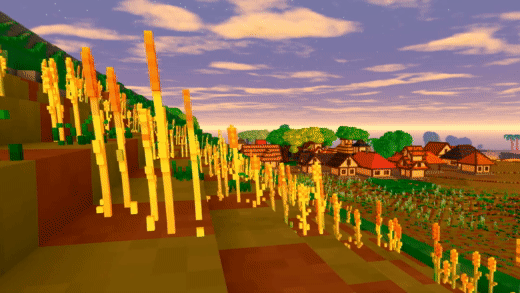

+++
title = "This Month in Rust GameDev #10 - May 2020"
date = 2020-06-01
transparent = true
draft = true
+++

<!-- markdownlint-disable no-trailing-punctuation -->
<!-- markdownlint-enable line-length -->

Welcome to the tenth issue of the Rust GameDev Workgroup’s
monthly newsletter.
[Rust] is a systems language pursuing the trifecta:
safety, concurrency, and speed.
These goals are well-aligned with game development.
We hope to build an inviting ecosystem for anyone wishing
to use Rust in their development process!
Want to get involved? [Join the Rust GameDev working group!][join]

You can follow the newsletter creation process
by watching [the coordination issues][coordination].
Want something mentioned in the next newsletter?
[Send us a pull request][pr].
Feel free to send PRs about your own projects!

[Rust]: https://rust-lang.org
[join]: https://github.com/rust-gamedev/wg#join-the-fun
[pr]: https://github.com/rust-gamedev/rust-gamedev.github.io
[coordination]: https://github.com/rust-gamedev/rust-gamedev.github.io/issues?q=label%3Acoordination

<!--
Ideal section structure is:

```
### [Title]


A paragraph or two with a summary and [useful links].

_Discussions:
[/r/rust](https://reddit.com/r/rust/todo),
[twitter](https://twitter.com/todo/status/123456)_

[Title]: https://first.link
[useful links]: https://other.link
```

Discussion links are added only if they contain
some actual interesting discussions.

If needed, a section can be split into subsections with a "------" delimiter.
-->

## Game Updates

### [Veloren][veloren]


^ _The new repo banner_

[Veloren][veloren] is an open world, open-source voxel RPG inspired by Dwarf
Fortress and Cube World.

In May, Veloren 0.6 was launched! Check out the launch trailer below for an
overview of the changes. The launch party was a massive success with nearly 50
people online at the peak. In May, character persistence was added. This allows
players to save their level after leaving the server. Dungeons were merged right
before the release, and include bosses. Many small bugs were fixed for the
release as well. Veloren also now has an [Open Collective
account][veloren-opencollective], and you can donate towards our infrastructure
costs. GamingOnLinux [wrote an article][gamingonlinux] on Veloren's development.

[](https://www.youtube.com/watch?v=kjDFVgWYMd4)

^ _0.6 release trailer. Click for the full video!_

Here is the May changelog:

```text
- Added server-side character saving
- Player now starts with a lantern.
- Added tab completion in chat for player names and chat commands
- Added server persistence for character stats
- Added a popup when setting your character's waypoint
- Added dungeon arenas
- Added dungeon bosses and rare boss loot
- Added 2 sets of armour. One Steel and one Leather.
- Added context-sensitive crosshair
```

A 0.7 intro meeting was held, in which we looked at what we wanted to achieve
with this version. 0.7 will be released August 1st. We came up with a definition
of 0.7, and what we wanted to achieve:

> As a player, I want to get quests from NPCs in settlements. I want to be sent
> to kill enemies, collect objects, or complete dungeons. I want to be sent from
> village to village and become familiar with the region.

> I want to be able to open the map and get information where I need to go for a
> quest. I want to be able to easily find where dungeons, villages, and other
> points of interest are. I want to be able to open a trade window with NPCs in
> villages, and buy and sell items. I want to be able to craft items with
> ingredients that I have.

> I want to be able to see and hear more while in combat. I want to feel good
> while doing combat. I want to see particle effects from magic, and hear swords
> clashing together. I want to be able to add people to my combat party and
> interact with the game UI to do this.


^ _Welcome to Veloren! From the 0.6 release party_

You can read more about some specific topics from May:

- [Move to WGPU](https://veloren.net/devblog-67#move-to-wgpu-by-sharp)
- [0.6 Release](https://veloren.net/devblog-68#0-6-release)
- [Network Analysis](https://veloren.net/devblog-68#network-analysis-by-angelonfira)
- [0.7 Intro Meeting](https://veloren.net/devblog-69#0-7-intro-meeting)
- [Work on iced](https://veloren.net/devblog-69#work-on-iced-with-imbris)
- [Chunk Generation](https://veloren.net/devblog-69#chunk-generation-by-zesterer)

May's full weekly devlogs: "This Week In Veloren...":
[#66](https://veloren.net/devblog-66),
[#67](https://veloren.net/devblog-67),
[#68](https://veloren.net/devblog-68),
[#69](https://veloren.net/devblog-69).

[veloren]: https://veloren.net
[veloren-opencollective]: https://opencollective.com/veloren
[gamingonlinux]: https://www.gamingonlinux.com/2020/05/veloren-an-open-source-rpg-inspired-by-cube-world-has-a-new-release

## Learning Material Updates

## Library & Tooling Updates

### [Goods]

Asset management library that aims to be easy to use, flexible, extensible
and support virtually any use-case:

* Need to load compund asset that pulls subassets without boilerplate on
  call-site? All heavy-lifting for loading subassets can be done in `Format`
  implementation for the asset type.
* Asset is made of GPU resources and access to graphics device is required to
  create asset instance? `Asset::build` receives reference to `Asset::Context`.
* Targeting browser? `goods` support building for wasm
  and even bundle Fetch API based asset data source.
* Target doesn't have `std`? Core types and traits are `no_std` compatible.
  But `alloc` is required.
* Looking to keep things tidy and fast to build? Clean build of the crate
  with no features takes about ~3s on modern CPU.
* Integration with `serde` ecosystem? Special `Format` implementations can load
  assets whose representation implement `serde::de::DeserializeOwned`.
  Crate includes `Format`s for loading assets from JSON, YAML and RON docuemts.

Crate's repo has few examples with nearly each line of the code explained.

[Goods]: https://crates.io/crates/goods

## Popular Workgroup Issues in Github

<!-- Up to 10 links to interesting issues -->

## Meeting Minutes

<!-- Up to 10 most important notes + a link to the full details -->

[See all meeting issues][label-meeting] including full text notes
or [join the next meeting][join].

[label-meeting]: https://github.com/rust-gamedev/wg/issues?q=label%3Ameeting

## Requests for Contribution

<!-- Links to "good first issue"-labels or direct links to specific tasks -->

- [Embark's open issues][embark-open-issues] ([embark.rs]);
- [winit's "Good first issue" and “help wanted” issues][winit-issues];
- [gfx-rs's "contributor-friendly" issues][gfx-issues];
- [wgpu's "help wanted" issues][wgpu-help-wanted];
- [luminance's "low hanging fruit" issues][luminance-fruits];
- [ggez's "good first issue" issues][ggez-issues];
- [Veloren's "beginner" issues][veloren-beginner];
- [Amethyst's "good first issue" issues][amethyst-issues];
- [A/B Street's "good first issue" issues][abstreet-issues];
- [Mun's "good first issue" issues][mun-issues];

[embark.rs]: https://embark.rs
[embark-open-issues]: https://github.com/search?q=user:EmbarkStudios+state:open
[winit-issues]: https://github.com/rust-windowing/winit/issues?utf8=✓&q=is%3Aissue+is%3Aopen+label%3A%22status%3A+help+wanted%22+label%3A%22Good+first+issue%22
[gfx-issues]: https://github.com/gfx-rs/gfx/issues?q=is%3Aissue+is%3Aopen+label%3Acontributor-friendly
[wgpu-help-wanted]: https://github.com/gfx-rs/wgpu-rs/issues?q=is%3Aissue+is%3Aopen+label%3A%22help+wanted%22
[luminance-fruits]: https://github.com/phaazon/luminance-rs/issues?q=is%3Aissue+is%3Aopen+label%3A%22low+hanging+fruit%22
[ggez-issues]: https://github.com/ggez/ggez/labels/%2AGOOD%20FIRST%20ISSUE%2A
[veloren-beginner]: https://gitlab.com/veloren/veloren/issues?label_name=beginner
[amethyst-issues]: https://github.com/amethyst/amethyst/issues?q=is%3Aissue+is%3Aopen+label%3A%22good+first+issue%22
[abstreet-issues]: https://github.com/dabreegster/abstreet/issues?q=is%3Aissue+is%3Aopen+label%3A%22good+first+issue%22
[mun-issues]: https://github.com/mun-lang/mun/labels/good%20first%20issue

## Bonus

<!-- Bonus section to make the newsletter more interesting
and highlight events from the past. -->

Just an interesting Rust gamedev link from the past. :)

------

That's all news for today, thanks for reading!

Subscribe to [@rust_gamedev on Twitter][@rust_gamedev]
or [/r/rust_gamedev subreddit][/r/rust_gamedev] if you want to receive fresh news!

<!--
TODO: Add real links and un-comment once this post is published
**Discussions of this post**:
[/r/rust](TODO),
[twitter](TODO).
-->

[/r/rust_gamedev]: https://reddit.com/r/rust_gamedev
[@rust_gamedev]: https://twitter.com/rust_gamedev
