+++
title = "This Month in Rust GameDev #10 - May 2020"
date = 2020-06-08
transparent = true
+++

<!-- markdownlint-disable no-trailing-punctuation -->
<!-- markdownlint-enable line-length -->

Welcome to the tenth issue of the Rust GameDev Workgroup’s
monthly newsletter.
[Rust] is a systems language pursuing the trifecta:
safety, concurrency, and speed.
These goals are well-aligned with game development.
We hope to build an inviting ecosystem for anyone wishing
to use Rust in their development process!
Want to get involved? [Join the Rust GameDev working group!][join]

You can follow the newsletter creation process
by watching [the coordination issues][coordination].
Want something mentioned in the next newsletter?
[Send us a pull request][pr].
Feel free to send PRs about your own projects!

[Rust]: https://rust-lang.org
[join]: https://github.com/rust-gamedev/wg#join-the-fun
[pr]: https://github.com/rust-gamedev/rust-gamedev.github.io
[coordination]: https://github.com/rust-gamedev/rust-gamedev.github.io/issues?q=label%3Acoordination

Table of contents:

- [Game Updates](#game-updates)
- [Learning Material Updates](#learning-material-updates)
- [Library & Tooling Updates](#library-tooling-updates)
- [Popular Workgroup Issues in Github](#popular-workgroup-issues-in-github)
- [Meeting Minutes](#meeting-minutes)
- [Requests for Contribution](#requests-for-contribution)
- [Jobs](#jobs)
- [Bonus](#bonus)

<!--
Ideal section structure is:

```
### [Title]


A paragraph or two with a summary and [useful links].

_Discussions:
[/r/rust](https://reddit.com/r/rust/todo),
[twitter](https://twitter.com/todo/status/123456)_

[Title]: https://first.link
[useful links]: https://other.link
```

Discussion links are added only if they contain
some actual interesting discussions.

If needed, a section can be split into subsections with a "------" delimiter.
-->

## Game Updates

### [Veloren][veloren]


^ _The new repo banner_

[Veloren][veloren] is an open world, open-source voxel RPG inspired by Dwarf
Fortress and Cube World.

In May, Veloren 0.6 was launched! Check out the launch trailer below for an
overview of the changes. The launch party was a massive success with nearly 50
people online at the peak. In May, character persistence was added. This allows
players to save their level after leaving the server. Dungeons were merged right
before the release, and include bosses. Many small bugs were fixed for the
release as well. Veloren also now has an [Open Collective
account][veloren-opencollective], and you can donate towards our infrastructure
costs. GamingOnLinux [wrote an article][gamingonlinux] on Veloren's development.

[](https://www.youtube.com/watch?v=kjDFVgWYMd4)

^ _0.6 release trailer. Click for the full video!_

Here is the May changelog:

- Added server-side character saving
- Player now starts with a lantern.
- Added tab completion in chat for player names and chat commands
- Added server persistence for character stats
- Added a popup when setting your character's waypoint
- Added dungeon arenas
- Added dungeon bosses and rare boss loot
- Added 2 sets of armour. One Steel and one Leather.
- Added context-sensitive crosshair

A 0.7 intro meeting was held, in which the devs looked at what they wanted to achieve
with this version. 0.7 will be released August 1st. They came up with a definition
of 0.7, and what they wanted to achieve:

> As a player, I want to get quests from NPCs in settlements. I want to be sent
> to kill enemies, collect objects, or complete dungeons. I want to be sent from
> village to village and become familiar with the region.
>
> I want to be able to open the map and get information where I need to go for a
> quest. I want to be able to easily find where dungeons, villages, and other
> points of interest are. I want to be able to open a trade window with NPCs in
> villages, and buy and sell items. I want to be able to craft items with
> ingredients that I have.
>
> I want to be able to see and hear more while in combat. I want to feel good
> while doing combat. I want to see particle effects from magic, and hear swords
> clashing together. I want to be able to add people to my combat party and
> interact with the game UI to do this.


^ _Welcome to Veloren! From the 0.6 release party_

You can read more about some specific topics from May:

- [Move to WGPU](https://veloren.net/devblog-67#move-to-wgpu-by-sharp)
- [0.6 Release](https://veloren.net/devblog-68#0-6-release)
- [Network Analysis](https://veloren.net/devblog-68#network-analysis-by-angelonfira)
- [0.7 Intro Meeting](https://veloren.net/devblog-69#0-7-intro-meeting)
- [Work on iced](https://veloren.net/devblog-69#work-on-iced-with-imbris)
- [Chunk Generation](https://veloren.net/devblog-69#chunk-generation-by-zesterer)

May's full weekly devlogs: "This Week In Veloren...":
[#66](https://veloren.net/devblog-66),
[#67](https://veloren.net/devblog-67),
[#68](https://veloren.net/devblog-68),
[#69](https://veloren.net/devblog-69).

[veloren]: https://veloren.net
[veloren-opencollective]: https://opencollective.com/veloren
[gamingonlinux]: https://www.gamingonlinux.com/2020/05/veloren-an-open-source-rpg-inspired-by-cube-world-has-a-new-release

### [Paddlers][paddlers-website]


Paddlers is a multiplayer strategy game with a [live prototype][paddlers-demo]
available online to demonstrate its current status.
It is a learning-by-doing hobby project to explore the possibilities with
Rust on the web, developed by a single person so far but open to contributors.

May was a busy month for Paddlers and brought many fundamental changes and new
features, including the ability to observe other player's villages.
A summary of changes is available on the [Paddlers news page][paddlers-news].

Besides programming, the developer of Paddlers also wrote a blog post called
[Benefits of full-stack Rust][paddlers-blog] where the details some of his
experiences when implementing a server-client model using Rust on both ends.
Furthermore, he published a first [video teaser][paddlers-teaser].

_Discussions:
[/r/rust](https://reddit.com/r/rust/comments/gjilkn/benefits_of_fullstack_rust_my_experience_from)_

[paddlers-blog]: https://www.jakobmeier.ch/blogging/Paddlers_4.html
[paddlers-demo]: https://demo.paddlers.ch/
[paddlers-news]: https://paddlers.ch/news.html
[paddlers-repo]: https://github.com/jakmeier/paddlers-browser-game
[paddlers-teaser]: https://www.youtube.com/watch?v=3Syw7hxQ-z0
[paddlers-website]: https://paddlers.ch

### Sailing Simulator Prototype


This unnamed game is still in the prototype stage and
it's the new project of Kunos Simulazioni
(creators of the [Assetto Corsa] racing simulation franchise)
co-founder and former Lead Programmer [Stefano Casillo] who started
a new studio (Jaxx Vane Studio) in April 2020 in the search of new challenges.

It's going to be a modern Foiling/Sailing Simulator aiming to bring the depth,
rigor and attention to detail found in racing simulations to the sailing genre
on PC/Windows.
The game features a fully custom scratch made 3D engine written in Rust
with minimal dependencies using DirectX 11 via winapi-rs, ODE
and OpenAL with custom bindings.

The project should leave the prototype stage later next month.
The development is streamed live 3 times a week on [Twitch][sailing-twitch]
with highlights also published on [YouTube][sailing-youtube].

[Stefano Casillo]: https://twitter.com/KunosStefano
[Assetto Corsa]: https://www.assettocorsa.net
[sailing-twitch]: https://twitch.tv/kunosstefano
[sailing-youtube]: https://youtube.com/channel/UC7n_g2xDySrmKRaf41rSwlg

### [Garden]: May Devlog


[Garden][garden] is an upcoming game centered around growing realistic plants.

[May][garden-devlog] devlog was posted.
Some of the updates:

- The core logic of the plant simulation was rewritten,
  allowing for a broader variety of (more adaptable) plants,
  with a broader difference in tree growth behavior across different species.
- A WIP [point-cloud drawing tool]([garden-kaleidoscope]) (currently named Kaleidoscope)
  for creating some parts of the game world.
- Optimizations: such as reducing the number of objects to be drawn by 90%
  (mostly via frustum culling).
- Anti-aliasing, new leaves, and textures.

[garden]: https://epcc.itch.io/garden
[garden-devlog]: https://cyberplant.xyz/posts/may
[garden-kaleidoscope]: https://twitter.com/logicsoup/status/1259953969427873799

### [Sandbox]

[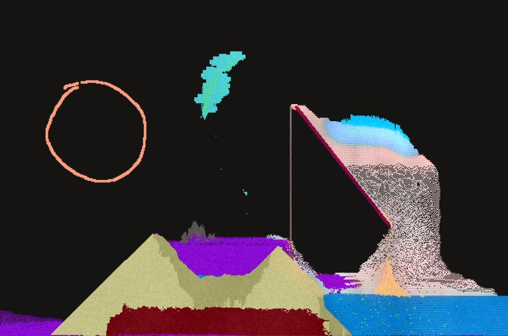](https://streamable.com/0bhbol#)

^ _click to see a gameplay demo_

[Sandbox] is a falling sand game by JMS55 that provides a variety of fun
particle types to place, and then you get to watch the resulting interactions!

The main focus so far has been experimenting with different particle types, including:

- Sand
- Acid - Dissolves material.
- Water
- Replicator - Creates infinite copies of other particles.
- Plant - Grows over time once placed on wet Sand, or on top of an existing
  plant.
- Cyrotheum - A cold particle that melts over time, and releases a wave of
  cold to its surroundings.
- Unstable - Heats up over time, vaporizing a large radius at too high
  of a temperature, and releases Smoke.
- Electricity - Can only exist when falling, or in Water.
  Flows through Water. Very hot.
- Glass - Created by heating up Sand. Acts like a liquid at
  high enough temperatures, and a solid otherwise. Immune to Acid.
- Life - A semi-intelligent particle that stacks itself up, and moves
  as a group. Likes to breed upon eating Plants. Will jump down short drops.
  Dies if too hot or cold, or upon falling a large distance.
- Blood - Created by pressurizing dead Life particles, by stacking
  enough of other particles on top.

Got any ideas? Leave an [issue on github][Sandbox], or add it yourself!

[Sandbox]: https://github.com/JMS55/sandbox

### [orb.farm]

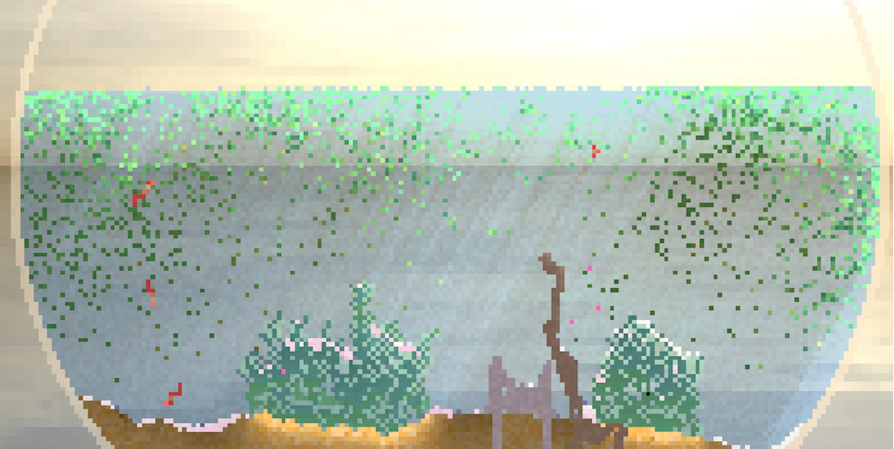

[orb.farm] is a virtual ecosystem where different species of creature can live,
grow and die as part of a self-contained food chain.
Made by [Max Bittker] ([sandspiel's author][about-sandspiel]).

Element types:

- Inert: Clear, Water, Glass, Sand, Stone, Wood
- Autotrophs
  - Algae: Photosynthesizes sunlight & carbon dioxide to produce nutrients and oxygen.
    Life of the party!
  - Grass: Grows into eel grass, which is a source of food and oxygen.
    Needs to pull nitrogen from sand in order to grow.
- Daphnia (herbivore): Also know as water fleas, these freshwater zooplankton
  are a key species in the ecosystem.
  They feed on algae, and lay eggs which can lay dormant for a long time!
  More active at night.
- Carnivores
  - Fish: They feed mostly on daphnia but will also eat on the biofilm
    that grows on plants. I can't tell what they're thinking.
    - Goldfish: Loyal but simple minded. Breathes oxygen
  - Decomposers
    - Bacteria: Aerobically breaks down waste into nitrogen.
      Decomposers are very important parts to a functioning ecosystem.
      Blows bubbles when happy.

[The source code is available here.][orb-farm-src]

_Discussions:
[/r/rust](https://reddit.com/r/rust/comments/gm4whz/orbfarm_a_virtual_aquatic_ecosystem_implemented)_

[orb.farm]: https://orb.farm
[orb-farm-src]: https://github.com/MaxBittker/orb.farm
[Max Bittker]: https://maxbittker.com
[about-sandspiel]: https://maxbittker.com/making-sandspiel

### For The Quest


For The Quest is the working title for a game in early development by
[@seratonik]. Written entirely in Rust and compiled to WebAssembly,
For The Quest is destined to become a MMORPG set in a post-apocalyptic
Earth where your goal is to band together into like-minded factions to
not only survive in this new world, but to unearth the cause of humanity's
downfall.

For The Quest is currently undergoing engine development with a focus on
running smoothly in modern browsers using WebGL 2.0 before moving onto
native desktop ports.

New developments in May:

- All game assets are now defined server-side in a database and are streamed
  to the client on demand as areas are requested
- New desert / sand assets added to test the new asset loading system
- Translucent water surfaces with primitive refraction effect added
- New "picking" system implemented that is aware of the 3D coordinates at
  location of selection in addition to being aware of which object selected
- A basic world editing UI has been built in React / Javascript and interfaced
  to the game engine via WASM bindings, features include: displaying info about
  currently selected object, deleting objects, adding any object type, creating
  new maps and teleporting to any existing map
- Map changes are persisted on the server and location of player is now
  restored when closing the client and coming back later

Follow [@seratonik] on Twitter for updates.

[@seratonik]: https://twitter.com/seratonik

### [Crate Before Attack][cratebeforeattack-site]

[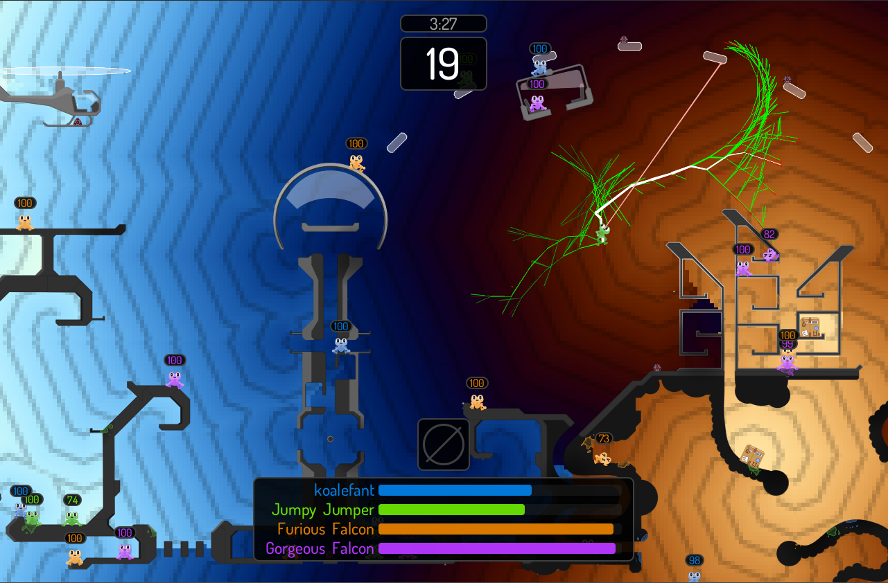][cratebeforeattack-site]

^ _Decision tree and goal distance map in the background_

[Crate Before Attack][cratebeforeattack-site] by [koalefant (@CrateAttack)][@CrateAttack]
is a realtime/turn-based multiplayer game where frogs combat their friends
while navigating the landscape with their sticky tongues.

May development was focused on implementing AI of opponents and adding race mode:

- [Video of AI racing against itself with visualized decision tree][cratebeforeattack-youtube-ai];
- [Playable build][cratebeforeattack-play] (works in the browser on PC or Mac).

More details in the [DevLog][cratebeforeattack-devlog]
and [YouTube channel][cratebeforeattack-youtube].

Also, check out a fun [physics demo][cratebeforeattack-physics-demo]
of the game's physics engine.

[cratebeforeattack-devlog]: https://cratebeforeattack.com/posts
[cratebeforeattack-play]: https://cratebeforeattack.com/play
[cratebeforeattack-site]: https://cratebeforeattack.com
[cratebeforeattack-youtube]: https://youtube.com/channel/UC_xMilPTLuuE5iLs1Ml9zow
[cratebeforeattack-youtube-ai]: https://www.youtube.com/watch?v=PcJOayy5gP4
[cratebeforeattack-physics-demo]: https://github.com/koalefant/circle2d
[@CrateAttack]: https://twitter.com/CrateAttack
[tokio]: https://tokio.rs
[miniquad]: https://github.com/not-fl3/miniquad/

### [Stellary][stellary]


[Stellary][stellary] by [Coffé Junk Studio][coffe] is a fast-paced multiplayer
artillery game that promises exciting battles and real-time gravity physics.

> Your goal is to "defend" your planet by destroying the enemy’s planet.
> Be careful, though, your missiles don't always fly straight.
> Be sure to take into account the gravity of planets, the sun,
> and other celestial bodies!
> Try out different tactics, e.g. sling shooting missiles around the sun,
> spamming them, or lining up sniper shots!

The game is made using the studio's "Sphere Engine"
that is being implemented using Rust and Vulkan.

[stellary]: https://coffejunkstudio.itch.io/stellary
[stellary-trailer]: https://youtube.com/watch?v=1eVU4Pelp4g
[coffe]: https://twitter.com/CoffeJunkStudio

### Dig Escape

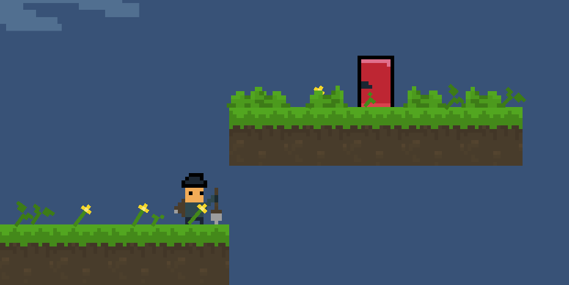

Dig Escape is a simple puzzle game written in Rust. You can play it in the
browser [here][digescape-game]. The developer has released [some
videos][digescape-progress-video] about the development of the game. They also
[did a review][digescape-rust-review] on what it was like working with Rust for
the first time. Be sure to check out the [Github repo][digescape-github].

[digescape-game]: https://tantandev.itch.io/digescape
[digescape-progress-video]: https://www.youtube.com/watch?v=q6-f63vZW8Y
[digescape-rust-review]: https://www.youtube.com/watch?v=6fKt6bmnAKo
[digescape-github]: https://github.com/TanTanDev/DigEscape

### [Akigi][akigi]


^ _Completed cat model with rigging_

> [Akigi][akigi] is a magical multiplayer online world where humans aren't the
> only intelligent animals. Akigi is a solo project, and the developer hopes to
> share their excitement and challenges through their dev blogs.

In May, progress was made on the game models. Test have been created in order
to formalize what a testing suite should look like in Akigi. The interactive
sequences system was restructured to allow for a node system that could guide the
player better. A data extraction system was put in place to view metrics from
the game server.

Some of this month's updates:

- [Learning to Think](https://devjournal.akigi.com/may-2020/065-2020-05-03.html#learning-to-think)
- [Integration Testing](https://devjournal.akigi.com/may-2020/066-2020-05-10.html#integration-testing)
- [Testing Quests](https://devjournal.akigi.com/may-2020/066-2020-05-10.html#testing-quests)
- [Interactive Sequences](https://devjournal.akigi.com/may-2020/067-2020-05-17.html#interactive-sequences)
- [Logging](https://devjournal.akigi.com/may-2020/068-2020-05-24.html#logging)
- [User Interface Iteration](https://devjournal.akigi.com/may-2020/069-2020-05-31.html#user-interface-iteration)
- [Inventory](https://devjournal.akigi.com/may-2020/069-2020-05-31.html#inventory)

Full devlogs:
[#065](https://devjournal.akigi.com/may-2020/065-2020-05-03.html),
[#066](https://devjournal.akigi.com/may-2020/066-2020-05-10.html),
[#067](https://devjournal.akigi.com/may-2020/067-2020-05-17.html),
[#068](https://devjournal.akigi.com/may-2020/069-2020-05-31.html),
[#069](https://devjournal.akigi.com/may-2020/069-2020-05-31.html).

[akigi]: https://akigi.com

### Nox Futura: Rust Edition

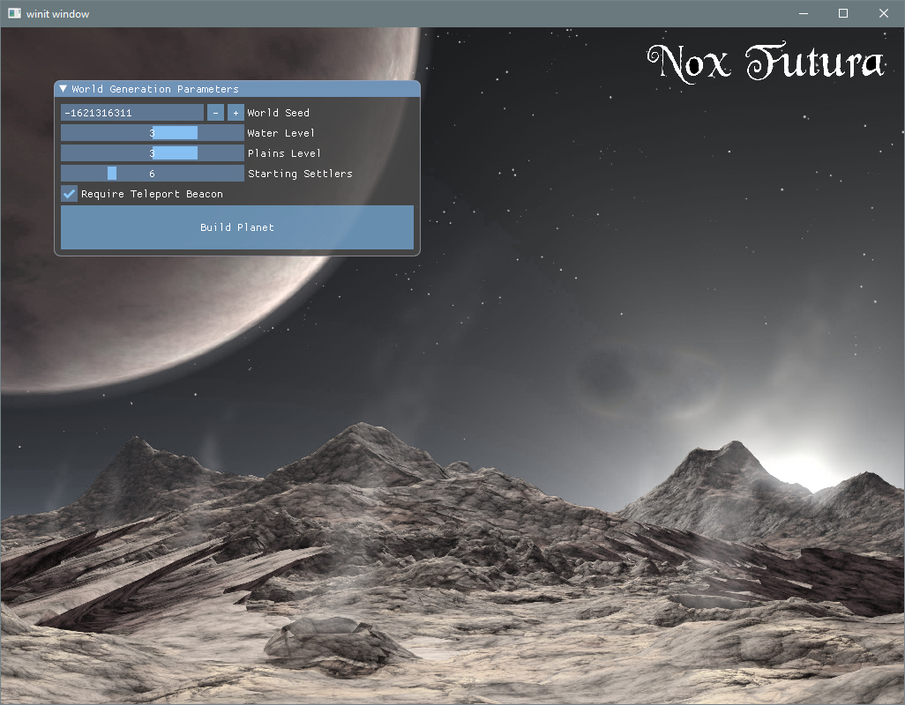

^ _Worldgen menu_

[Herbert Wolverson][thebracket]
(the author of [bracket-lib] and [the Rust Roguelike Tutorial][rl-book])
started experimenting with porting [Nox Futura][nox-f-itch] to Rust.

At the moment, a wgpu-rs backend, basic planet and region generation are ready.
Check out Sharing Saturday devlogs for more detailed reports:
[\#1][nox-f-1], [\#2][nox-f-2], [\#3][nox-f-3].

[thebracket]: https://bracketproductions.com
[bracket-lib]: https://github.com/thebracket/bracket-lib
[rl-book]: http://bfnightly.bracketproductions.com/rustbook/
[nox-f-itch]: https://thebracket.itch.io/nox-futura
[nox-f-1]: https://reddit.com/r/roguelikedev/comments/gg4qx4/sharing_saturday_310/fq0cvrm
[nox-f-2]: https://reddit.com/r/roguelikedev/comments/gout79/sharing_saturday_312/frjozbb
[nox-f-3]: https://reddit.com/r/roguelikedev/comments/gxg69q/sharing_saturday_314/ft4akml

### [On FPS Game Progress \#1][on-fps-game-1]

[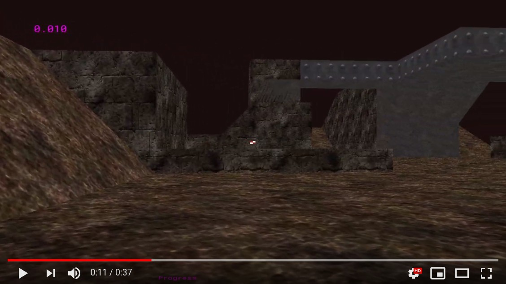][on-fps-game-video]

[Atil Kockar posted the first devlog about their experience][on-fps-game-1]
of writing an FPS game using Rust, SDL, and OpenGL.
At the moment, the game features loading .obj files, drawing simple UI,
and Q3-style character controller logic.

[on-fps-game-1]: http://atilkockar.com/on-fps-game-progress-1
[on-fps-game-video]: https://youtube.com/watch?v=TvgWOEnlXw4

### [Life][life]

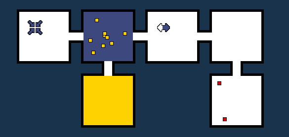

["Life"][life] by [@datoh]
is a WIP puzzle game written using Tetra.
Though still a prototype, the game has a bunch of playable levels
and a [level editor][life-level-editor].
The development process is streamed at [twitch.tv/datoh].

[life-level-editor]: https://twitter.com/datoh/status/1264574784769318915
[twitch.tv/datoh]: https://twitch.tv/datoh
[life]: https://datoh.itch.io/life
[@datoh]: https://twitter.com/datoh

### [Mind's Eye][minds-eye]

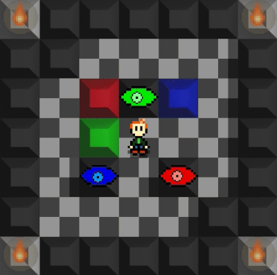

[Mind's Eye][minds-eye] by Michael Stott is a WIP experimental
Sokoban-esque puzzle game developed using Rust and SDL2.
The objective is to move the colored blocks into the line of sight
of a matching eye.

[minds-eye]: https://github.com/MichaelStott/Minds-Eye

### [vkeyes-demo-rs]

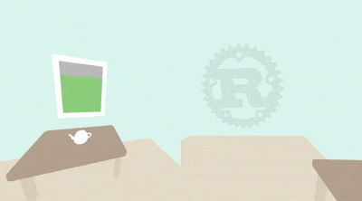

[vkeyes-demo-rs] by [Fun Maker] is a simple OpenVR+Vulkano demo with a twist:
you can rotate your eyes separately with analog sticks.

Also, the demo features asynchronous model/texture loading from .obj,
.png, and OpenVR and uses a dedicated queue for data transfer if available.

[vkeyes-demo-rs]: https://github.com/funmaker/vkeyes-demo-rs
[Fun Maker]: https://twitter.com/FunMaker39

## Learning Material Updates

### Rust Sokoban Tutorial

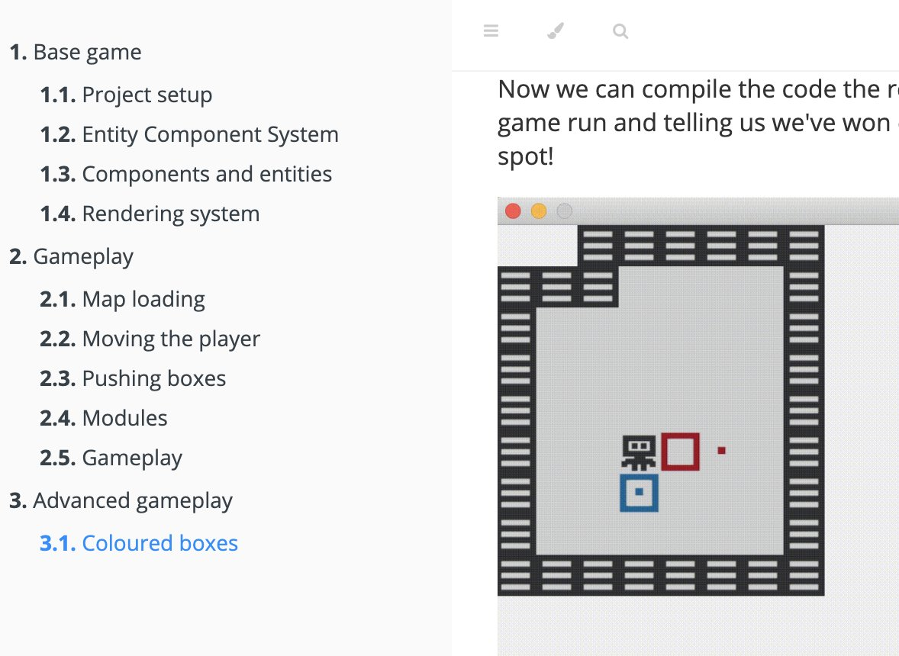

The Rust Sokoban tutorial is an online book aimed at Rust gamedev beginners
which walks through making a simple Sokoban game using ECS, ggez and specs.
It tries to teach the basics of architecting in ECS and basic Rust concepts
through a hands-on approach.

This month:

- the project received 10+ contributions from beta testers
- work was started on chapter 3 which features advanced gameplay

You can follow along for updates and release progress [here][updates].

[updates]: https://twitter.com/oliviff/status/1264301381042782209

### Adding WASM Support to a Native App

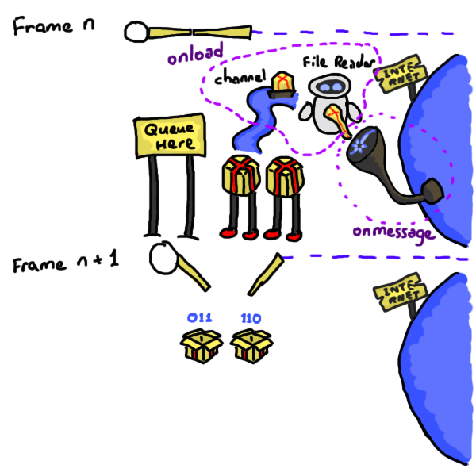

Porting an existing native application to run in the browser as a [WASM]
application comes with many challenges, including adapting to the browser's
control flow, threading model, and security restrictions.

This month [Azriel] presented the challenges of adding WASM support to the
Amethyst game engine. The recording is on [youtube][wasm_yt] and the
presentation material is available [online][wasm_it].

[wasm_yt]: https://www.youtube.com/watch?v=7YQGwb4_AvA
[wasm_it]: https://azriel.im/wasm_it/
[Azriel]: https://github.com/azriel91/
[WASM]: https://webassembly.org/

### [Disassembling Rust: Part 1][rust_asm]

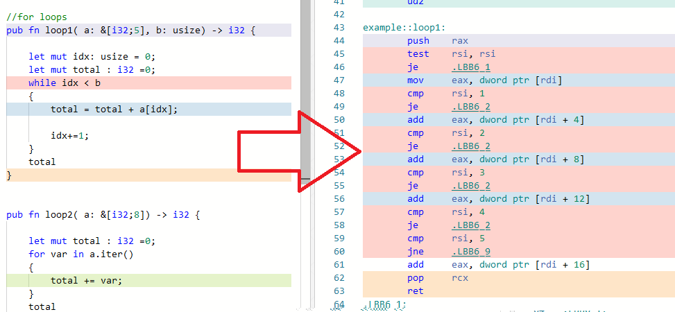

Rust comes with many new constructs and features not commonly found in other
languages. Programmers coming from different backgrounds, notably C++ and
game-dev might wonder how such a construct translate to machine code.

In the first [part][rust_asm] in a series, [Marco Giordano (@MGDev91)][@MGDev91]
investigates some common Rust construct to see what instructions they translate to,
highlighting a few interesting findings in how Rust guarantees safety
and ensures speed.

[rust_asm]: https://giordi91.github.io/post/disassemlbyrust1
[@MGDev91]: https://twitter.com/MGDev91

### [Pong tutorial with GGEZ][pong-tut-1]

[Mikail Khan][mkhan45] shared a three-part tutorial
about building a simple version of Pong using GGEZ:

> I saw a post on reddit asking for a simple game dev tutorial with Rust.
> Generally people encourage using ECS with any Rust game,
> so I guess there’s no tutorials for anything without it.
> However, for simple games like Pong or Flappy Bird,
> it really is easier to forgo the ECS.
>
> While Amethyst, the biggest Rust game engine,
> is completely built on ECS and you can’t make a game without it,
> there’s still plenty of small game engines that don’t make any assumptions.
> My favorite of these is ggez.

[The source code for all stages could be found here.][pong-tut-src]

[mkhan45]: https://mkhan45.github.io
[pong-tut-1]: https://mkhan45.github.io/2020/05/19/Pong-tutorial-with-ggez.html
[pong-tut-src]: https://github.com/mkhan45/ggez-pong-tutorial

### gfx-hal & vulkan basics


[Subroto Biswas][willofindie] started
a ["`gfx-hal` & `vulkan` basics" tutorial series][gfx-hal-tut].

> I have found that learning new things every often, leads to chaos,
> and people (specifically ME) tend to forget many things
> they have already learnt before.
> These notes will help me to keep reference notes for myself,
> as well as for anybody who is willing to learn Vulkan API using gfx-hal.

For now it includes two posts:

- ["Adapters & Physical/Logical Devices & Device Queues"][gfx-hal-tut-1]
- ["Setup & Display Blank Window"][gfx-hal-tut-2]

[willofindie]: https://willofindie.com
[gfx-hal-tut]: https://willofindie.com/gfx-hal-initials
[gfx-hal-tut-1]: https://willofindie.com/gfx-hal-initials/physical-logical-devices
[gfx-hal-tut-2]: https://willofindie.com/gfx-hal-initials/display-window

## Library & Tooling Updates

### [safe_arch]

[safe_arch] is a crate by [@lokathor] that safely exposes arch intrinsics via `#[cfg()]`.

> safe_arch lets you safely use CPU intrinsics - those things in the
> [core::arch] modules.
> It works purely via `#[cfg()]` and compile time CPU feature declaration.
> If you want to check for a feature at runtime and then call an intrinsic
> or use a fallback path based on that then this crate is sadly not for you.
>
> SIMD register types are "newtype'd" so that better trait impls
> can be given to them, but the inner value is a pub field so feel
> to just grab it out if you need to.
> Trait impls of the newtypes include: Default (zeroed), From/Into of appropriate
> data types, and appropriate operator overloading.

See [the docs][safe_arch_docs] for more details.
[Feedback and contributions are welcome][safe-arch-issues].

_Discussions:
[/r/rust](https://reddit.com/r/rust/comments/gjvyz8/safe_arch03)_

[safe_arch]: https://github.com/Lokathor/safe_arch
[safe_arch_docs]: https://docs.rs/safe_arch
[@lokathor]: https://twitter.com/lokathor
[core::arch]: https://doc.rust-lang.org/nightly/core/core_arch/arch/index.html

### [Point of WebGPU on Native][wgpu-post]


This month, [@kvark] shared their vision of
[why WebGPU on native platforms is important][wgpu-post].

> I can see WebGPU on native being a go-to choice for amateur developers,
> students, indie professionals, mobile game studios, and many other groups.
> It could be the default GPU API, if it can deliver on its promises of safety,
> performance, and portability. We have a lot of interest and early adopters,
> as well as big forces in motion to make this real.

_Discussions:
[/r/rust](https://reddit.com/r/rust/comments/gdbgoc/point_of_webgpu_on_native),
[hackernews](https://news.ycombinator.com/item?id=23079200)_

[wgpu-post]: https://kvark.github.io/web/gpu/native/2020/05/03/point-of-webgpu-native.html
[@kvark]: https://kvark.github.io

### NodeFX

[][NodeFXTweet]

^ _Click the image to see the animated version_

Project "NodeFX" by [Christian Vallentin (@MrVallentin)][@MrVallentin]
is an unnamed node-based tool for creating GLSL shaders in real-time,
entirely written in Rust.

Some highlighted features and plans are:

- The majority of nodes have real-time previews
- Extensive library of nodes, from math and logic to gradients, transitions,
  and animations
- Support is currently limited to exporting GLSL shaders, but more languages
  and formats are planned
- The tool will be released for free, as soon as it's ready

The project is currently closed source and early in development.
More information can be found on [Twitter][@MrVallentin].

[@MrVallentin]: https://twitter.com/MrVallentin
[NodeFXTweet]: https://twitter.com/MrVallentin/status/1256805858022998016

### [Goods]

Asset management library that aims to be easy to use, flexible, extensible
and support virtually any use-case:

- Need to load compund asset that pulls subassets without boilerplate on
  call-site? All heavy-lifting for loading subassets can be done in `Format`
  implementation for the asset type.
- Asset is made of GPU resources and access to graphics device is required to
  create asset instance? `Asset::build` receives reference to `Asset::Context`.
- Targeting browser? `goods` support building for wasm
  and even bundle Fetch API based asset data source.
- Target doesn't have `std`? Core types and traits are `no_std` compatible.
  But `alloc` is required.
- Looking to keep things tidy and fast to build? Clean build of the crate
  with no features takes about ~3s on modern CPU.
- Integration with `serde` ecosystem? Special `Format` implementations can load
  assets whose representation implement `serde::de::DeserializeOwned`.
  Crate includes `Format`s for loading assets from JSON, YAML and RON documents.

Crate's repo has few examples with nearly each line of the code explained.

[Goods]: https://crates.io/crates/goods

### [cute-c2]

[cute-c2] is a Rust wrapper, created by [yeahross0], for Randy Gaul's
[single-header C library of the same name][cute-c2-c]. It implements 2D
collision detection between circles, AABBs, capsules and up to eight-sided
convex polygons.

The API exposed is safe and Rust-y, and various examples are provided in the
repository. The library is not yet published to Crates.io, but looks promising!

[cute-c2]: https://github.com/yeahross0/cute-c2
[cute-c2-c]: https://github.com/RandyGaul/cute_headers/blob/master/cute_c2.h
[yeahross0]: https://github.com/yeahross0

### [KAS v0.4][kas-040]


[KAS] (toolKit Abstraction System) is a general purpose GUI toolkit, developed
by [dhardy].

This month, [version 0.4][kas-040] was released - some highlights from the
changelog are:

- An overhaul of the `Widget` API
- Support for pop-up widgets
- More robust input handling
- Limited support for stable versions of the Rust compiler

_Discussions: [/r/rust](https://www.reddit.com/r/rust/comments/gf42ip/kas_gui_04_release/)_

[kas]: https://github.com/kas-gui/kas
[kas-040]: https://github.com/kas-gui/kas/blob/master/CHANGELOG.md
[dhardy]: https://github.com/dhardy

### [Iced]

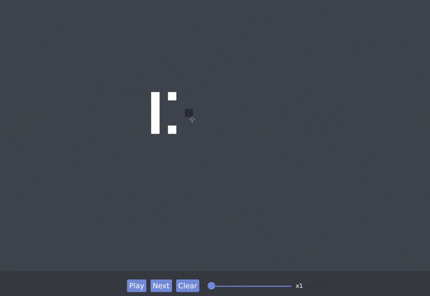

[Iced] is experimental, cross-platform GUI crate
focused on simplicity and type safety.
Iced can be used natively, in a web browser, or can use wgpu,

This month, Iced [got interactivity support for the Canvas widget][iced-pr].
Also, check out a new "Game of Life" demo [here][iced-life].

[iced]: https://github.com/hecrj/iced/
[iced-pr]: https://github.com/hecrj/iced/pull/325
[iced-life]: https://github.com/hecrj/iced/tree/e7e8e76c2/examples/game_of_life

### [beehive]

```text
       yz +Y
       __
   yx /  \ xz +X
-X zx \__/ xy
    -Y zy
```

[beehive] by [@toast_dev] is a library that provides utilities and collections
for working with 3D hexagonal maps.
It's based on [Red Blob Games's guide][rbg-guide].

[beehive]: https://github.com/toasteater/beehive
[@toast_dev]: https://twitter.com/toast_dev
[rbg-guide]: https://redblobgames.com/grids/hexagons

### [RustSim Survey][rustsim-survey]


> Hi! This survey has been created by sebcrozet from [rustsim.org] and [nphysics.org].
>
> With this survey, I would like to understand better
> what the community needs from a physics engine.
> This will help prioritize future developments in Rust.
> Most questions of this first part of the survey are mandatory
> and allow multiple answers which you can complete with custom answers.

_Discussions:
[/r/rust](https://reddit.com/r/rust/comments/gpwsk1/survey_what_do_you_need_from_a_physics_engine)_

[rustsim-survey]: https://docs.google.com/forms/d/e/1FAIpQLSes3qjVxpksw6ntendfadQW7x4MCSw6Vd2Kdg4sDFj46zs5ew/viewform
[rustsim.org]: https://rustsim.org
[nphysics.org]: https://nphysics.org

### [svg_face]

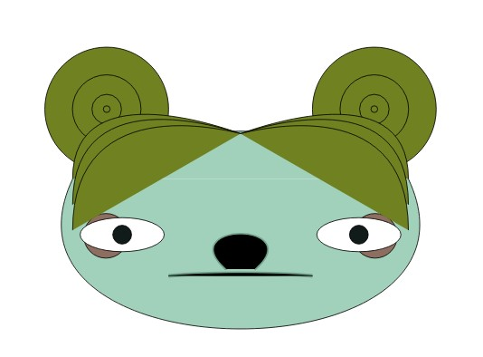

[svg_face] is a crate for generating random SVG faces.
It's a port of [anokhee/visual-synthesizer] to Rust.

[svg_face]: https://github.com/dabreegster/svg_face
[anokhee/visual-synthesizer]: https://github.com/anokhee/visual-synthesizer

### [This Month in Mun][mun-may]

[][Mun]

[Mun] is a scripting language for gamedev focused on quick iteration times
that is written in Rust.

After half a year of hard work by the Mun Community and Core Team,
[Mun v0.2.0 was released][mun-release].
With the addition of hot reloadable structs, this
forms a big step forward in terms of hot reloadability for the language.

Their additional [May updates][mun-may] include:

- number type inferencing;
- removing generic `float`, `int`, and `uint` types;
- updating the Mun book;
- an official VSCode plugin for Mun syntax highlighting;
- documentation fixes and improvements.

[Mun]: https://mun-lang.org
[mun-release]: https://mun-lang.org/blog/2020/05/16/release-mun-v0-2-0
[mun-may]: https://mun-lang.org/blog/2020/05/31/this-month-may

### [Tetra 0.3.6][tetra-036]

[Tetra] is a simple 2D game framework, inspired by XNA and Raylib. This month,
[version 0.3.6 was released][tetra-036], featuring:

- A new suite of functions for querying information
  about the player's connected monitors
- Tweaks to the startup code, to ensure slow asset loading
  doesn't cause the window to hang
- Several under the hood bug fixes

Additionally, planning for 0.4 has begun, which will
[bring some changes to the `Font`/`Text` API][tetra-040].

[Tetra]: https://github.com/17cupsofcoffee/tetra
[tetra-036]: https://twitter.com/17cupsofcoffee/status/1261381601524621312
[tetra-040]: https://twitter.com/17cupsofcoffee/status/1256599606697308164

### [rg3d Engine][rg3d]

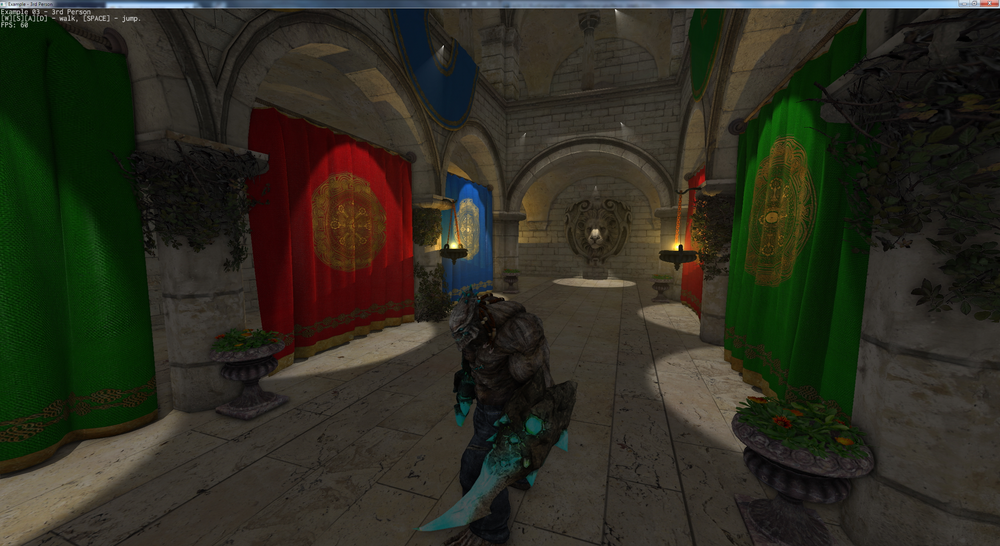

[rg3d][rg3d] is a 3d game engine. It has gained a lot of new features:

- Volumetric lights - lights now have configurable amount of light scattering
  in volume which significantly improves light quality.
- Multi-camera rendering - can be used to make split-screen games, add
  picture-in-picture features and so on.
- Asynchronous resource loading
- [Four new examples](https://github.com/mrDIMAS/rg3d/tree/master/examples)
- Screen-space ambient occlusion (SSAO)
- Directional lights for outdoor scenes, it still has no shadows yet.
- Documentation improvements - still far from completion, but covers some basic
  use cases.
- Serialization improvements.
- [rg3d-ui crate](https://github.com/mrDIMAS/rg3d-ui) improvements: added
  docking manager, menu, file browser, tree view.
- Editor - more about that below.

[rg3d]: https://github.com/mrDIMAS/rg3d

#### [rusty editor]

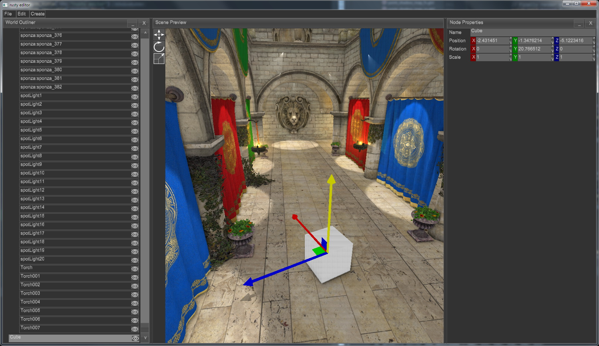

[rusty editor] is a scene editor for rg3d engine, the goal is to make robust
and easy-to-use editor which is able to load, modify, and save scenes in
native engine format. The editor is based on rg3d engine, user interface
is based on rg3d-ui crate which developing in parallel with editor. It is
still in very early development phase, but it already has some basic
features:

- Undo/redo
- Saving and loading of scenes.
- Interaction modes (move, scale, rotate).
- Node properties editor
- World outliner (scene hierarchy editor).
- And many other small stuff.

[rusty editor]: https://github.com/mrDIMAS/rusty-editor

### [Oxygengine]


The main goal of this month changes was to fix most problematic bugs and finally
add a feature to support custom fonts assets. While not all bugs could be fixed
on time, here are two interesting things that shows at least the small amount of
progress that was made:

- Added support for loading and using custom TFF fonts assets:

  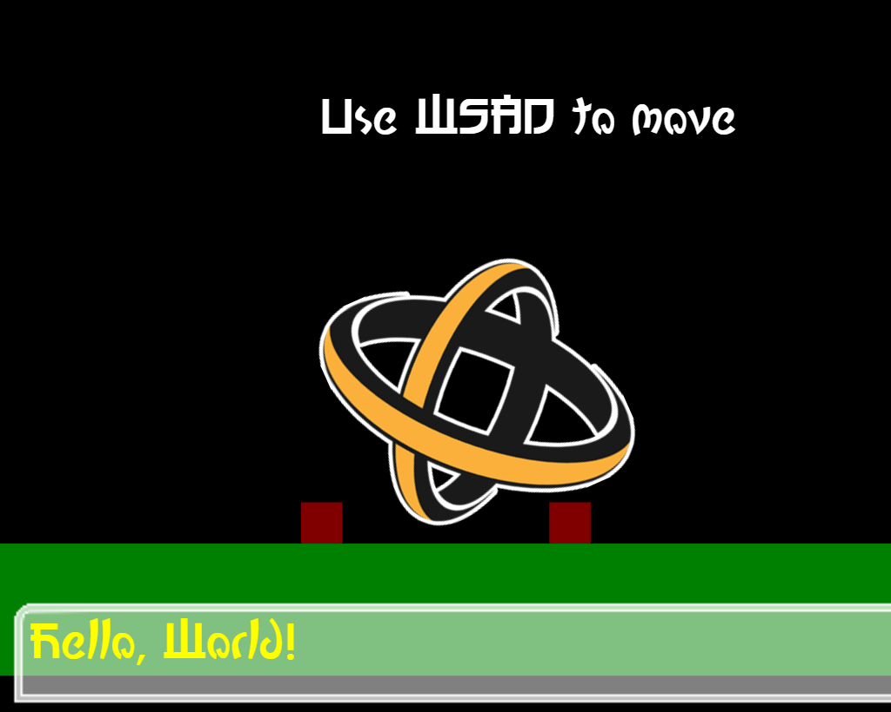

- Additionally [@PsichiX] has created a small example of a project that shows
  how to make a pokemon-like game basis - it covers topics such as: using Tiled
  Editor maps to render the world and applying player movement in it, as well as
  using spritesheet-based frame animations. Example sources can be found here:
  [Oxygengine pokemon-like basic mechanics](https://github.com/PsichiX/Oxygengine/tree/master/demos/pokemon)

  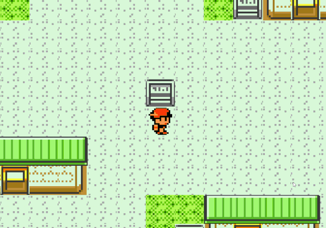

If you want to be up to date with Oxygengine ecosystem progress, make sure to
follow project on GitHub and see [Oxygengine Project board](oxygengine-project).

[@PsichiX]: https://github.com/PsichiX
[Oxygengine]: https://github.com/PsichiX/Oxygengine
[oxygengine-project]: https://github.com/PsichiX/Oxygengine/projects/1

### [Amethyst][amethyst]

[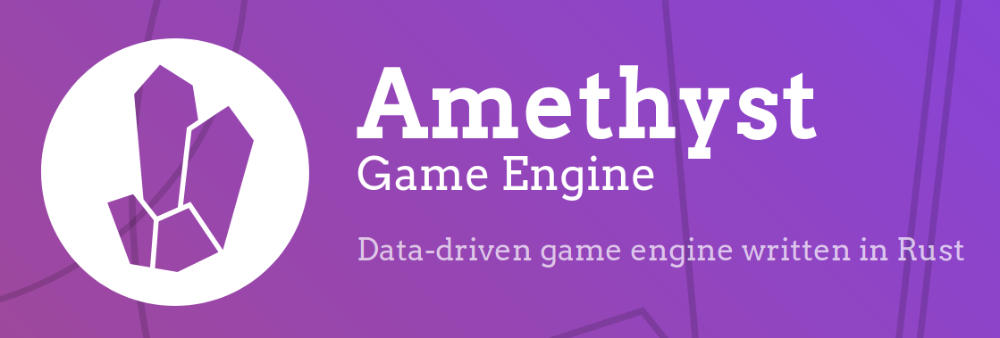][amethyst]

- [`rlua`] is now part of the Amethyst organization.

    `rlua` is a library that provides high level bindings between Rust and
    [Lua]. Through [discussion][rlua_discussion], a number of people will be
    sharing maintenance of the library.

- [`legion-task`]: A multi-tasking library for the [Legion] ECS.

    This library by [bonsairobo] provides multi-tasking support on the Legion
    ECS, allowing tasks to be executed in dependency graph order.
    Check out the announcement post in the [forum][legion_task_forum].

    This is a port of the [`specs-task`] library, which provides the same
    functionality for [SPECS].

[`legion-task`]: https://github.com/bonsairobo/legion-task
[`rlua`]: https://github.com/amethyst/rlua
[`specs-task`]: https://github.com/bonsairobo/specs-task
[amethyst]: https://amethyst.rs
[bonsairobo]: https://github.com/bonsairobo
[Legion]: https://github.com/TomGillen/legion
[legion_task_forum]: https://community.amethyst.rs/t/announcing-a-new-multi-tasking-library-for-legion-ecs/1495
[Lua]: https://www.lua.org/
[rlua_discussion]: https://github.com/amethyst/rlua/issues/174
[SPECS]: https://github.com/amethyst/specs

### Robo Instructus: [Font Rendering Saga][otf-font-rendering]

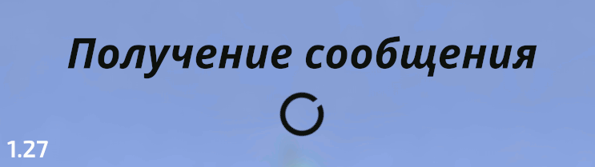

This month, the developer behind Robo Instructus spent lots of time working on
font rendering. They were looking to expand translations to languages that had
different characters, such as Cyrillic or Chinese. This would require support
for cubic bezier curves, not just quadratic curves. You can [read their
blog][otf-font-rendering] for an in-depth explanation. This lead to the release
of [ab_glyph 0.1][otf-saga-ab-glyph] that supports otf fonts, which then lead to
[glyph_brush 0.7][otf-saga-glyph-brush] based on this, and finally [otf fonts in
Robo Instructus][otf-font-robo].

[otf-font-rendering]: https://blog.roboinstruct.us/2020/05/24/the-otf-journey.html
[otf-saga-ab-glyph]: https://twitter.com/bigabgames/status/1258866371024293890
[otf-saga-glyph-brush]: https://twitter.com/bigabgames/status/1264235900462075906
[otf-font-robo]: https://twitter.com/bigabgames/status/1264557215693918209

### [Godot] Ecosystem

- Paytonrules has started a multi-part guide on [porting Godot games to
  Rust][godot-porting-games-to-rust]. This first part covers what you'll need to
  get started, and some workflow behind linking Rust code.
- [@schr3da] has continued their video series about using Rust in Godot.
  - Creating a Simple Platformer -
    [Part 3](https://youtube.com/watch?v=0CUu111YJIk)
- [@toast_dev] has [just released][gdnative-release] the [gdnative crate][gdnative-crate]
  0.8.1. This crate gives you Rust bindings to GDNative.
  This version contains a few important bugfixes. The developers have also
  rounded a few rough edges overall.

[godot-porting-games-to-rust]: https://paytonrules.com/post/games-in-rust-with-godot-part-one/
[godot-platformer-video]: https://www.youtube.com/watch?v=0CUu111YJIk
[Godot]: https://godotengine.org
[@schr3da]: https://www.youtube.com/channel/UC4jYW3lJKrEvOqCQ2ElryGw
[gdnative-crate]: https://crates.io/crates/gdnative
[gdnative-release]: https://twitter.com/toast_dev/status/1267071886040555520
[@toast_dev]: https://twitter.com/toast_dev

## Popular Workgroup Issues in Github

<!-- Up to 10 links to interesting issues -->

- [rust-gamedev/wg](https://github.com/rust-gamedev/wg):
  - [#77 "Can we contribute to OpenXR to get Keyboard/Mouse support to be official?"](https://github.com/rust-gamedev/wg/issues/77)
- [rust-gamedev/rust-gamedev.github.io](https://github.com/rust-gamedev/rust-gamedev.github.io):
  - [#150 "Jobs Section"](https://github.com/rust-gamedev/rust-gamedev.github.io/issues/150)
- [rust-gamedev/arewegameyet](https://github.com/rust-gamedev/arewegameyet):
  - [#320 "A different section for gamejam games?"](https://github.com/rust-gamedev/arewegameyet/issues/320)

## Meeting Minutes

<!-- Up to 10 most important notes + a link to the full details -->

[See all meeting issues][label-meeting] including full text notes
or [join the next meeting][join].

[label-meeting]: https://github.com/rust-gamedev/wg/issues?q=label%3Ameeting

## Requests for Contribution

<!-- Links to "good first issue"-labels or direct links to specific tasks -->

- [Embark's open issues][embark-open-issues] ([embark.rs]);
- [winit's "Good first issue" and “help wanted” issues][winit-issues];
- [gfx-rs's "contributor-friendly" issues][gfx-issues];
- [wgpu's "help wanted" issues][wgpu-help-wanted];
- [luminance's "low hanging fruit" issues][luminance-fruits];
- [ggez's "good first issue" issues][ggez-issues];
- [Veloren's "beginner" issues][veloren-beginner];
- [Amethyst's "good first issue" issues][amethyst-issues];
- [A/B Street's "good first issue" issues][abstreet-issues];
- [Mun's "good first issue" issues][mun-issues];
- [safe_arch's "Good First Issue" issues][safe-arch-issues];

[embark.rs]: https://embark.rs
[embark-open-issues]: https://github.com/search?q=user:EmbarkStudios+state:open
[winit-issues]: https://github.com/rust-windowing/winit/issues?utf8=✓&q=is%3Aissue+is%3Aopen+label%3A%22status%3A+help+wanted%22+label%3A%22Good+first+issue%22
[gfx-issues]: https://github.com/gfx-rs/gfx/issues?q=is%3Aissue+is%3Aopen+label%3Acontributor-friendly
[wgpu-help-wanted]: https://github.com/gfx-rs/wgpu-rs/issues?q=is%3Aissue+is%3Aopen+label%3A%22help+wanted%22
[luminance-fruits]: https://github.com/phaazon/luminance-rs/issues?q=is%3Aissue+is%3Aopen+label%3A%22low+hanging+fruit%22
[ggez-issues]: https://github.com/ggez/ggez/labels/%2AGOOD%20FIRST%20ISSUE%2A
[veloren-beginner]: https://gitlab.com/veloren/veloren/issues?label_name=beginner
[amethyst-issues]: https://github.com/amethyst/amethyst/issues?q=is%3Aissue+is%3Aopen+label%3A%22good+first+issue%22
[abstreet-issues]: https://github.com/dabreegster/abstreet/issues?q=is%3Aissue+is%3Aopen+label%3A%22good+first+issue%22
[mun-issues]: https://github.com/mun-lang/mun/labels/good%20first%20issue
[safe-arch-issues]: https://github.com/Lokathor/safe_arch/issues?q=is%3Aissue+is%3Aopen+label%3A%22Good+First+Issue%22

## Jobs

<!-- An optinal section for new jobs related to Rust gamedev -->

- [Elektron][elektron] (synth manufacturer) looking to hire Rust Graphics Engineer
  (Gothenburg, Sweden):

  > Elektron is looking for a highly skilled graphics engineer to join our team
  > working on a cutting-edge software platform which will drive
  > the next generation of our instruments.
  > In this role, you will carefully assess, build and take ownership
  > of the graphics stack.
  > The task reaches from low-level aspects concerning performance
  > up to forming APIs used for high-level UI design.
  > As part of this, you will work closely with the design team
  > in order to realize solutions with superb aesthetics.

  You can find all of the details on their [job offer page][elektron-job].

  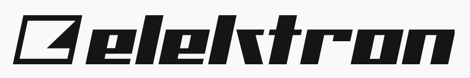

[elektron]: https://elektron.se
[elektron-job]: https://elektron.se/rust-graphics-engineer

## Bonus

<!-- Bonus section to make the newsletter more interesting
and highlight events from the past. -->

Just an interesting Rust gamedev link from the past. :)

[Citybound][cb] is a WIP city building game that uses microscopic models
to vividly simulate the organism of a city arising
from the interactions of millions of individuals.

[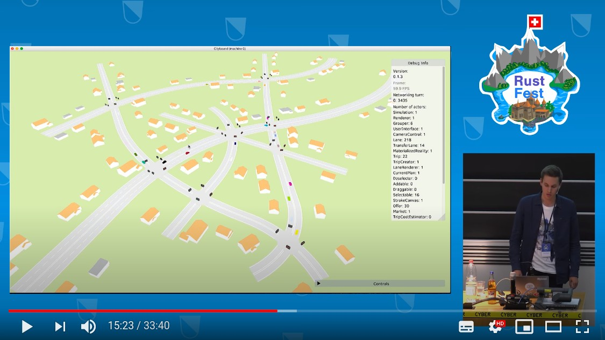][cb-video]

During RustFest Zurich 2017, [Anselm Eickhoff] gave an interesting talk
"Type-safe & high-perf distributed actor systems with Rust":
brief history of Citybound, why Rust was chosen, actors in a networked setting,
a few live demos, and lessons learned.

You can [watch the recording here][cb-video] ([slides][cb-slides]).

_Discussions:
[/r/Citybound](https://reddit.com/r/Citybound/comments/77dc7m/my_full_rustfest_talk),
[/r/rust](https://reddit.com/r/rust/comments/77ddu6/typesafe_highperf_distributed_actor_systems)_

[Anselm Eickhoff]: https://aeplay.org
[cb]: https://aeplay.org/citybound
[cb-video]: https://youtube.com/watch?v=qr9GTTST_Dk
[cb-slides]: https://www.dropbox.com/s/z9ddkhz2pbidt8c/rustfest.pdf?dl=0

------

That's all news for today, thanks for reading!

Subscribe to [@rust_gamedev on Twitter][@rust_gamedev]
or [/r/rust_gamedev subreddit][/r/rust_gamedev] if you want to receive fresh news!

**Discussions of this post**:
[/r/rust](https://reddit.com/r/rust/comments/gz59mk/this_month_in_rust_gamedev_10_may_2020),
[twitter](https://twitter.com/rust_gamedev/status/1270064889432866818).

[/r/rust_gamedev]: https://reddit.com/r/rust_gamedev
[@rust_gamedev]: https://twitter.com/rust_gamedev
