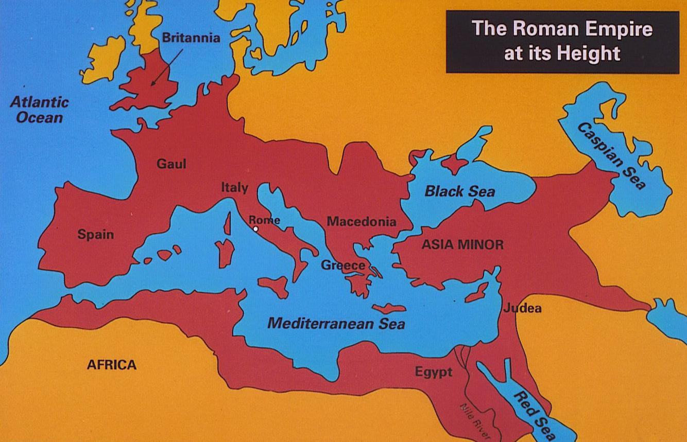
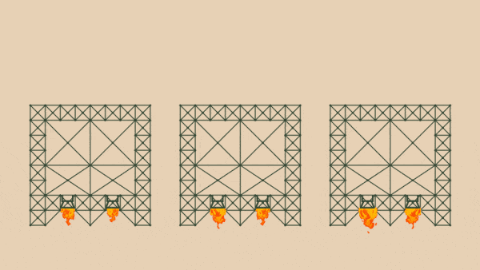
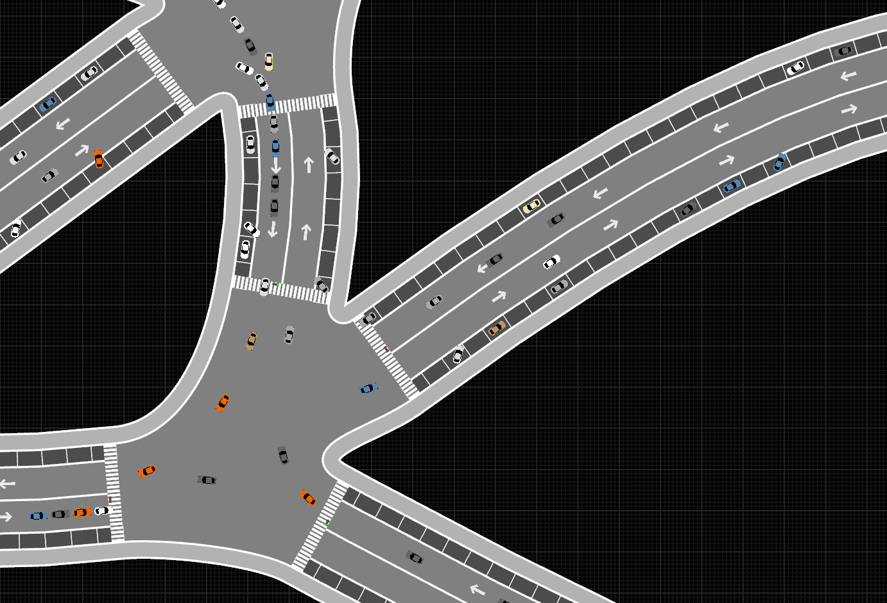
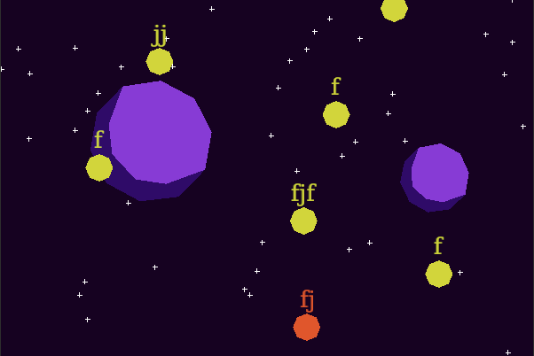
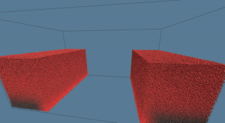
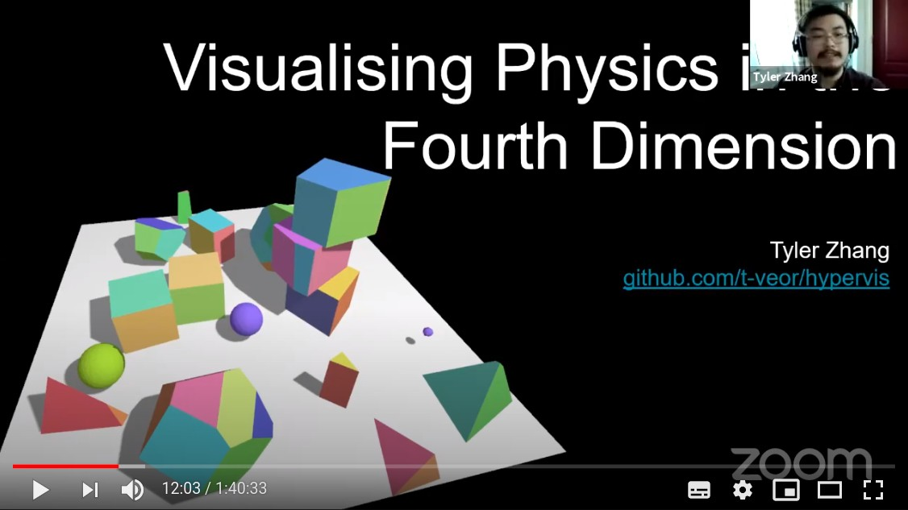
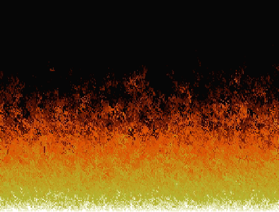
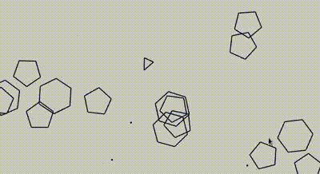

+++
title = "This Month in Rust GameDev #11 - June 2020"
date = 2020-07-01
transparent = true
draft = true
+++

Welcome to the eleventh issue of the Rust GameDev Workgroup’s
monthly newsletter.
[Rust] is a systems language pursuing the trifecta:
safety, concurrency, and speed.
These goals are well-aligned with game development.
We hope to build an inviting ecosystem for anyone wishing
to use Rust in their development process!
Want to get involved? [Join the Rust GameDev working group!][join]

You can follow the newsletter creation process
by watching [the coordination issues][coordination].
Want something mentioned in the next newsletter?
[Send us a pull request][pr].
Feel free to send PRs about your own projects!

[Rust]: https://rust-lang.org
[join]: https://github.com/rust-gamedev/wg#join-the-fun
[pr]: https://github.com/rust-gamedev/rust-gamedev.github.io
[coordination]: https://github.com/rust-gamedev/rust-gamedev.github.io/issues?q=label%3Acoordination

Table of contents:

- [Legion Game Jam](#legion-game-jam)
- [Game Updates](#game-updates)
- [Learning Material Updates](#learning-material-updates)
- [Library & Tooling Updates](#library-tooling-updates)
- [Popular Workgroup Issues in Github](#popular-workgroup-issues-in-github)
- [Meeting Minutes](#meeting-minutes)
- [Requests for Contribution](#requests-for-contribution)
- [Jobs](#jobs)
- [Bonus](#bonus)

<!--
Ideal section structure is:

```
### [Title]


A paragraph or two with a summary and [useful links].

_Discussions:
[/r/rust](https://reddit.com/r/rust/todo),
[twitter](https://twitter.com/todo/status/123456)_

[Title]: https://first.link
[useful links]: https://other.link
```

Discussion links are added only if they contain
some actual interesting discussions.

If needed, a section can be split into subsections with a "------" delimiter.
-->

## [Legion Game Jam][legion-jam]

[][roman-empire-wiki]

The "Legion" game jam by [Laticoda] is about
[the Roman Empire][roman-empire-wiki] for the background theme
and ECS paradigm for the technical side.
The conditions are:

- Open-source & Rust only.
- Projects should use some ECS library
  (you can choose [Legion][legion] if you don't have one).
- Team working and recycling old assets are allowed.

> Submissions open to August 1st 2020.
>
> It can be RPG, strategic, arcade or else; multi or solo. What you want.
> Just try to include a little bit history and culture taste.
> Dont be afraid, it is not ranked.

Also, participants are encouraged to
[document the development process at the event's forum][legion-jam-forum].

[legion-jam]: https://itch.io/jam/legion-jam-rustlang
[Laticoda]: https://itch.io/profile/laticoda
[roman-empire-wiki]: https://wikipedia.org/wiki/Roman_Empire
[legion]: https://github.com/TomGillen/legion
[legion-jam-forum]: https://itch.io/jam/legion-jam-rustlang/community

## Game Updates

### [Way of Rhea][rhea-site]

[][rhea-trailer]

^ _Click to see the latest version of the game's trailer_

[Way of Rhea][rhea-site] ([steam][rhea-steam])
is an upcoming puzzle platformer that takes place in a world
where you can only interact with objects that match your current color.
It's being build in a custom engine, and custom scripting language both written
in Rust by [Mason Remaley][@masonremaley]. This month's updates:

- A demo was released as part of the
  [Steam Game Festival](https://store.steampowered.com/sale/gamefestival)!
  The festival has since ended, so the demo is no longer available.
- [@masonremaley] ran An AMA [at /r/rust_gamedev][rhea-ama-1]
  and [/r/IndieDev][rhea-ama-2] about the development of the game.
- The studio hosted a [speedrun competition][rhea-speedrun] as part
  of the Steam festival, [here's the winning run](https://youtu.be/AmYU0TXc4Ls).
- A colorblind friendly mode was added to the game,
  and [a couple other changes][rhea-fest-update] were made in response
  to feedback from the festival.

Follow development updates on [the game's Twitter][rhea-twitter]
or [subscribe to its newsletter][rhea-newsletter].

[rhea-site]: https://www.anthropicstudios.com/way-of-rhea
[rhea-steam]: https://store.steampowered.com/app/1110620/Way_of_Rhea
[rhea-twitter]: https://twitter.com/anthropicst
[rhea-trailer]: https://youtube.com/watch?v=eVrbZss_B3g
[rhea-speedrun]: https://steamcommunity.com/app/1110620/discussions/0/2569815696856844856
[rhea-fest-update]: https://store.steampowered.com/newshub/app/1110620/view/2445966074565244552
[@masonremaley]: https://twitter.com/masonremaley
[rhea-ama-1]: https://reddit.com/r/rust_gamedev/comments/hc7vex/i_just_released_a_demo
[rhea-ama-2]: https://reddit.com/r/IndieDev/comments/hc7mf2/i_just_released_a_demo
[rhea-newsletter]: https://www.anthropicstudios.com/newsletter/signup/tech

### [A/B Street][abstreet] - Adjust Traffic Patterns in Real Cities


^ _Measuring the effects of some changes_

[A/B Street][abstreet] is a traffic simulation game exploring how
small changes to roads affect cyclists, transit users, pedestrians, and drivers.

June highlights:

- Alpha release with a [trailer][abstreet-trailer], an excited reaction from
  [r/seattle][abstreet-reddit], and some
  [local press coverage][abstreet-stranger]
- Support for parking lots, automatically inferring the number and position of
  individual slots from OpenStreetMap geometry
- Names of roads shown in-game, in a way that doesn't cause clutter with agents
  moving nearby
- Work starting on light rail and restricting through-traffic to zones

A/B Street uses a [custom GUI library][ezgui], leveraging `glium`, `usvg`, and
`lyon`. Help with Rust and visual/game design is always welcome! Check out the
[roadmap][abstreet-roadmap] and [good first issues][abstreet-issues].

[abstreet]: https://abstreet.org
[ezgui]: https://github.com/dabreegster/abstreet/tree/master/ezgui/
[abstreet-roadmap]: https://github.com/dabreegster/abstreet/blob/master/docs/roadmap.md
[abstreet-issues]: https://github.com/dabreegster/abstreet/issues?q=is%3Aopen+is%3Aissue+label%3A%22good+first+issue%22
[abstreet-trailer]: https://www.youtube.com/watch?v=LxPD4n_1-LU
[abstreet-reddit]: https://old.reddit.com/r/Seattle/comments/hdtucd/ab_street_think_you_can_fix_seattles_traffic/
[abstreet-stranger]: https://www.thestranger.com/slog/2020/06/29/43999454/ab-streets-game-lets-you-create-the-seattle-street-grid-of-your-dreams

### [Crate Before Attack][cba-site]

[][cba-youtube-scripting]

^ _In-game visual scripting prototype_

[Crate Before Attack][cba-site] by [koalefant (@CrateAttack)][@CrateAttack]
is a skill-based grappling hook multiplayer game where frogs combat their friends
while navigating the landscape with their sticky tongues.

A summary of recent changes:

- Visuals: added two new artist-painted levels:
  [Space][cba-youtube-space]
  and [Dinosaurs][cba-youtube-dinosaurs].
- Gameplay: [AI can now play all game modes][cba-youtube-ai],
  added Quick Game option,
- In-game [visual scripting prototype][cba-youtube-scripting].
- Physics tweaks and [improved terrain normal sampling][cba-youtube-normals]
- Multiplayer: added in-game chat, private matches with secret links,
  improved game setup UI. Numerous bugfixes and tweaks
- [Playable Browser build][cba-play].

More details in [June Update DevLog-entry][cba-june-update]
and on [the YouTube channel][cba-youtube].

[cba-site]: https://cratebeforeattack.com
[cba-june-update]: https://cratebeforeattack.com/posts/20200630-june-update/
[cba-play]: https://cratebeforeattack.com/play
[cba-youtube]: https://youtube.com/channel/UC_xMilPTLuuE5iLs1Ml9zow
[cba-youtube-ai]: https://youtu.be/IUBZgusI7aI
[cba-youtube-space]: https://youtu.be/IOmD1LRJ6NA
[cba-youtube-dinosaurs]: https://youtu.be/UgIBNolI7Wo
[cba-youtube-scripting]: https://youtu.be/LLAc9_cOR9o
[cba-youtube-normals]: https://youtu.be/r5BAe03MRZo
[@CrateAttack]: https://twitter.com/CrateAttack

### [Garden]: June Devlog


[Garden][garden] is an upcoming game centered around growing realistic plants.
Some of the updates from [the June devlog][garden-devlog]:

- Soil collision detection & changes to the soil column generation.
- Plant sim & terrain updates happen at different times & separately.
- Proper Global Illumination research.
- Automatic in-game texture reloading.

[garden]: https://epcc.itch.io/garden
[garden-devlog]: https://cyberplant.xyz/posts/june

### [Veloren][veloren]


^ _Animation improvements_

[Veloren][veloren] is an open world, open-source voxel RPG inspired by Dwarf
Fortress and Cube World.

In June, Veloren did a big interview with GamingOnLinux, be sure to [check it
out][gamingonlinux-interview]! Veloren's lead artist also started a weekly blog
about his work on Veloren, which you can see [here][pfau-blog]. Veloren recently
reached the [first page][gitlab-stars] of most starred projects on Gitlab! The
[Veloren Youtube channel][veloren-youtube-channel] also reached 1000
subscribers.

A lot has been done over the last month towards 0.7, which is slated to release
at the beginning of August. Lots of work has been done improving UI and
animations. These will help towards the goal of 0.7 being the "progression"
update. Many improvements have been made to the continuous integration system to
make it more reliable and faster. Mac support was added to Airshipper, the
Veloren launcher. Significant work was done on the world simulation front. This
includes economic simulations that will represent trade and resource pricing in
settlements and cities. Castle generation is also now in the works.


Test coverage and documentation has started to improve, and a workflow around it
is being developed. The project is now hosting a [proper documentation
site][veloren-docs] that is updated with each merge. A #ux working group was
created to facilitate discussions on improvements to player interactions in
Veloren. Lots of translations were merged, including Swedish, Polish, and
Brazilian Portugese. The skill system is moving on to implementation, being a
coordinated effort between the game design, art, and combat working groups.

You can read more about some specific topics from June:

- [Mod Analysis](https://veloren.net/devblog-70#mod-analysis-by-bottledbyte)
- [Improving CI](https://veloren.net/devblog-70#improving-ci-by-xmac94x)
- [Economic Research](https://veloren.net/devblog-72#economic-research-by-zesterer)
- [Compilation Improvements](https://veloren.net/devblog-72#compilation-improvements-by-xmac94x)
- [Improving Test Coverage](https://veloren.net/devblog-73#improving-test-coverage-by-angelonfira)
- [Skill System Work](https://veloren.net/devblog-74#skill-system-work-by-xvar)
- [Animation updates](https://veloren.net/devblog-74#animation-updates)

June's full weekly devlogs: "This Week In Veloren...":
[#70](https://veloren.net/devblog-70),
[#71](https://veloren.net/devblog-71),
[#72](https://veloren.net/devblog-72),
[#73](https://veloren.net/devblog-73),
[#74](https://veloren.net/devblog-74).

In July, work will be done to complete the progression systems. There will be
financial meetings held to discuss how funds from the project's Open Collective
will be distributed.

------

Also, check out [a talk about open source and Veloren][veloren-talk]:

[][veloren-talk]

[veloren]: https://veloren.net
[veloren-opencollective]: https://opencollective.com/veloren
[gamingonlinux-interview]: https://www.gamingonlinux.com/2020/06/interviewed-veloren-an-upcoming-foss-multiplayer-voxel-rpg
[pfau-blog]: https://www.patreon.com/posts/weekly-blog-no-1-37819335
[gitlab-stars]: https://gitlab.com/explore/projects/starred
[veloren-youtube-channel]: https://www.youtube.com/channel/UCmRjlnKnSRRihWPPNasl_Qw
[veloren-docs]: https://docs.veloren.net/veloren_voxygen/index.html
[veloren-talk]: https://youtube.com/watch?v=aS26sqT09Pw

### [Zero to Game][zerotoga.me]



^ _The initial destruction prototype applied across different thrust levels_

[Zero to Game][zerotoga.me] is a project that documents
the creation of an independent space game from zero.

> My plan for this website is to narrate my independent development
> of a computer game in the Rust programming language.
> I've never done this before, and so I hope to be able to show you
> the progression right from zero all the way up to a game.
>
> - Zero game programming experience.
> - Zero experience in the Rust programming language.
> - Zero experience making assets, images, sounds, models, etcetera.

Currently published posts:

- [\#1 "Finding Zero"](https://zerotoga.me/dev/findingzero)
  \- where the game development journey is beginning.
- [\#2 "Inspiring Design"](https://zerotoga.me/dev/inspiringdesign)
  \- how Factorio, Screeps, and Space Station 13 are inspiring the game's design.
- [\#3 "Picking Technology"](https://zerotoga.me/dev/pickingtechnology)
  \- researching a technology path for the game project to start out on.
- [\#4 "Leading Design Challenges"](https://zerotoga.me/dev/leadingdesignchallenges)
  \- the spacetime issues with combining gameplay inside and outside of spaceships.
- [\#5 "Fast Spaceship Physics"](https://zerotoga.me/dev/fastspaceshipphysics)
  \- prototyping a spaceship physics simulation aimed at speed.
- [\#6 "Physical Destruction"](https://zerotoga.me/dev/physicaldestruction)
  \- the structure and implementation of a spaceship destruction prototype.
- [\#7 "Rendering in Rust"](https://zerotoga.me/dev/renderinginrust)
  \- working through from tutorial code to meet the needs
  of the game's first Rust scene render.

[zerotoga.me]: https://zerotoga.me

### [Pont][pont-online]


Pont is a multiplayer online board game based on
[Qwirkle][qwirkle], implemented by [Matt Keeter][matt-keeter].
Both the client and server are written in Rust,
using WebAssembly to run the client in the browser
without any Javascript (besides a small shim).

It can be played online [here][pont-online]!

The system architecture is described in a [blog post][pont-blog]
and the source is available [on Github][pont-source]

_Discussions:
[/r/rust](https://www.reddit.com/r/rust/comments/gu1bq5/pont_a_board_game_in_rust_webassembly/),
[Hacker News](https://news.ycombinator.com/item?id=23649369)_

[matt-keeter]: https://twitter.com/impraxical
[pont-online]: https://pont.mattkeeter.com
[pont-blog]: https://mattkeeter.com/projects/pont
[pont-source]: https://github.com/mkeeter/pont
[qwirkle]: https://en.wikipedia.org/wiki/Qwirkle

### [Scale]



[Scale]'s objective is to become a granular society simulation,
filled with fully autonomous agents interacting with their world in real time.  

The 4th [devlog][scale-blog-post] was published, talking about
the new renderer based on [wgpu-rs], pathfinding, parking,
curved roads and a new crate extracted from the project called [flat_spatial].  

_Discussions:
[/r/rust_gamedev](https://www.reddit.com/r/rust_gamedev/comments/henx2n/scale_devblog_4/)_

[flat_spatial]: https://crates.io/crates/flat_spatial
[Scale]: https://github.com/Uriopass/Scale
[scale-blog-post]: http://douady.paris/blog/scale_4.html
[wgpu-rs]: https://github.com/gfx-rs/wgpu-rs

### [runner]

[](https://vimeo.com/428851779)

[runner] is a simple side-scrolling endless runner game that takes place in
a bright world that only has our fearless adventurer & a few pesky beings
that are bent on keeping her from running! It uses [specs] for [ECS]
and has multiple frontends: [sdl2] & [quicksilver].
Between the two frontends it can target the majority of the platforms:
Web, Mac, Linux, Windows (untested) & possible even iOS & Android.

[runner]: https://github.com/jayrave/runner
[specs]: https://github.com/amethyst/specs
[ECS]: https://en.wikipedia.org/wiki/Entity_component_system
[sdl2]: https://github.com/Rust-SDL2/rust-sdl2
[quicksilver]: https://github.com/ryanisaacg/quicksilver

### [Animal Chess][AnimalChess]


^ _Part of the game map_

[Animal Fight Chess][AnimalChess] (斗兽棋, "Doe Show Chee") by [@netcan]
is a Rust implementation of a popular Chinese game.

To win the game, one player must successfully move any animal into
the Den(兽穴) of the opponent or eat all animals of the opponent.
The basic move is just one space either forward, backward, left, or right.
The pieces never move diagonally.
Each player has eight pieces,
[different animals with different degrees of power][animal-chess-pieces],
a larger power piece can eat a little power piece, but rat can eat elephant.
Here's a picture of the pieces, their English names,
and relative powers indicated by a number.
See full rules at [ancientchess.com][animal-chess-rules]
or [Wikipedia][animal-chess-wiki].

The project uses alpha beta pruning algorithm for AI and provides
a python module to use AlphaZero algorithm for training.

[AnimalChess]: https://github.com/netcan/AnimalChess
[@netcan]: https://github.com/netcan
[animal-chess-rules]: http://ancientchess.com/page/play-doushouqi.htm
[animal-chess-wiki]: https://en.wikipedia.org/wiki/Jungle_(board_game)
[animal-chess-pieces]: http://ancientchess.com/graphics-rules/dou_shou_qi_jungle_game-pieces-values.jpg

### [rs-type]



[rs-type] is a WIP typing game
inspired by [zty.pe](https://zty.pe/).
It can load [KTouch courses](https://github.com/KDE/ktouch/tree/master/data/courses)
and also has a built-in basic vector drawing tool for painting backgrounds.

[rs-type]: https://github.com/akiross/rs-type

### [Guacamole Runner][guacamole]


[Guacamole Runner][guacamole] is a small game made with
[Tetra][tetra] and [Shipyard][shipyard] in approximately 2 days
by [@EllenNyan][ellen_twitter].
The game's concept is that the player is constantly falling
and must jump off planes to stay in the air.
When they go over the top of the dirt tiles
they plant flowers which gives them points.

[guacamole]: https://github.com/EllenNyan/guacamole-runner
[ellen_twitter]: https://twitter.com/EllenNyan0214
[tetra]: https://github.com/17cupsofcoffee/Tetra
[shipyard]: https://github.com/leudz/shipyard

### [Wooting Snake][wooting_snake-git]


[Wooting Snake][wooting_snake-git] is a snake game where the visuals
are represented on your keyboard lights, instead of a computer screen.

[TanTan] released a [video][wooting_snake-video]
documenting the process making this project.

[wooting_snake-git]: https://github.com/TanTanDev/wooting_snake
[wooting_snake-video]: https://youtu.be/OhhscXz-60g
[TanTan]: https://twitter.com/Tantan22430802

### [boundless]


[Anthony Brigante][abrigante] started working on a 2D sandbox game.
Two devlogs were released this month:

- ["Hello, Rust"](https://abrigante.com/post/2020/06/04/Hello-Rust.html)
- ["From Sandbox to Production - Rendering"](https://abrigante.com/post/2020/06/08/From-Sandbox-To-Production-Rendering.html)

[boundless]: https://github.com/abrigante1/boundless/tree/production
[abrigante]: https://abrigante.com/

### [Weegames][weegames-itch]

[][weegames-video]

^ _Click to see [a demo video][weegames-video]_

[Weegames][weegames-itch] is a fast-paced minigame collection.
There are 23 odd games all made using free images and sounds.
The more minigames you beat the faster they get.

[The source code is available here][weegames-repository].

[weegames-itch]: https://yeahross.itch.io/weegames
[weegames-repository]: https://github.com/yeahross0/weegames
[weegames-video]: https://youtube.com/watch?v=A_GqhZ_7EIw

### [blub]



[blub] is a WIP 3D fluid simulation playground build with wgpu-rs and imgui-rs.
It focuses primarily on hybrid approaches lagrangian/eularian approaches
(PIC/FLIP/APIC..). Check the project's README for more details.

[blub]: https://github.com/wumpf/blub

## Learning Material Updates

### [Hypervis: 4D Physics Visualization][ldn-talk]

[][ldn-talk]

This month, [Tyler Zhang gave a talk][ldn-talk] at
London Virtual Talks about the theory and implementation
of 4D physics visualization.
The demo's source code [could be found here][hypervis].

[hypervis]: https://github.com/t-veor/hypervis
[ldn-talk]: https://youtube.com/watch?v=_22oxXEX_xc?t=709

### [Boids in Rust][rboids-post-1]

[][rboids-video]

^ _Click to watch [the video demo][rboids-video]_

[@twitu] has published a three-part blog series
about simulating a group of virtual agents (boids)
that will swim around an enclosed space behaving like a school of fish.

> This is a beautiful application of procedural graphics generation,
> where simple rules create complex patterns.
> It's almost entirely inspired by Sebastian Lague's
> [Coding Adventure with boids][Sebastian-boids].

1) [A fistful of boids][rboids-post-1]
  \- Setting up the scene and basic animation
2) [For a few boids more][rboids-post-2]
  \- Generating boids and obstacle avoidance
3) [The school, the boid and the Rusty][rboids-post-3]
  \- Simulating a flock, parallelism and benchmarking performance

[The source code with tagged stages is available here][rboids].

_Discussions:
[/r/rust](https://reddit.com/r/rust/comments/gsldbi/3d_boids)_

[rboids]: https://github.com/twitu/rboids
[@twitu]: https://github.com/twitu
[rboids-video]: https://drive.google.com/file/d/1ri4x-jCX8SA9oX8OqDIKtXhYIrEKlGjO/view
[rboids-post-1]: https://blog.bitsacm.in/a-fistful-of-boids
[rboids-post-2]: https://blog.bitsacm.in/for-a-few-boids-more
[rboids-post-3]: https://blog.bitsacm.in/the-school-the-boid-and-the-rusty
[Sebastian-boids]: https://youtube.com/watch?v=bqtqltqcQhw

### [DOOM Fire][doomfire]



[doomfire] by [@r-marques] is Rust implementations of the DOOM fire effect
(based on [Fabien Sanglard's blog post][fabien-fire])
using different 2d graphics libraries:
[minifb](https://github.com/emoon/rust_minifb),
[pixels](https://github.com/parasyte/pixels),
[sdl2](https://github.com/Rust-SDL2/rust-sdl2),
[wasm-bindgen](https://github.com/rustwasm/wasm-bindgen)
\+ [Canvas API](https://developer.mozilla.org/en-US/docs/Web/API/Canvas_API).

> This could be helpful for someone new to rust and trying
> to get into game development and looking for the right libraries to use.

_Discussions:
[/r/rust](https://reddit.com/r/rust/comments/gvcj6d/doom_fire_implemented_in_rust)_

[doomfire]: https://github.com/r-marques/doomfire
[@r-marques]: https://github.com/r-marques
[fabien-fire]: https://fabiensanglard.net/doom_fire_psx

## Library & Tooling Updates

### [rust-psp]


Just what everyone's always wanted, [Rust on the Sony PSP][rust-psp]! 😆

This project is a port and improvement of the unofficial C/C++ PSPSDK from
2005 It does not require a custom GCC toolchain to be installed. Only Rust
nightly and a cargo subcommand.

The psp crate provides a `psp::sys` submodule that houses the entire Sony PSP
API. We are working to have theseinterfaces merged into the libc crate.
The PSP unfortunately uses non-standard dynamic linking,
(and some libraries are statically linked!), so function definitions
marked extern are not enough. Eventually we will wrap this sys lib with a more
rust-friendly library.

Rather than patching LLVM or rustc, the rust-psp team has also merged a
`mipsel-sony-psp` target upstream, and published cargo-psp. This is a subcommand
that works exactly like cargo build, except it also builds the crate into a
PSP-specific executable format called `PRX` and packages that into an
`EBOOT.PBP`, the standard format for a PSP Homebrew.

The crate has reached full user-mode parity with the unofficial C/C++ SDK.
Kernel-mode support still needs to be worked on. Aside from library
imports, there is also support for PSP-specific custom assembly instructions
via the `vfpu_asm!` macro, with no need for a custom compiler toolchain.
There is also optional `embedded-graphics` support and a function to benchmark
or time your code.

The next major milestone for rust-psp is std support.
If you are interested in helping out, please feel free to join the rust-psp
channel in the [PSP Homebrew discord server](https://discord.gg/WY8XhDG).

[rust-psp]: https://github.com/overdrivenpotato/rust-psp

### [glam]

[glam] is a simple and fast linear algebra crate for games and graphics.

This month [glam 0.9] was published to crates.io. This update is a breaking
change from 0.8.

In 0.9 the `Vec3` type was changed from being a 128 byte SIMD vector type to a
tuple of three floats. This changes the size of `Vec3` from 16 bytes to 12 bytes
and the alignment from 16 bytes to 4 bytes. This might not effect all users but
if `Vec3` was used in a context where the size or alignment mattered, such as in
FFI or as input to shaders, this could cause breakage.

The SIMD parts of `Vec3` were moved to a new type, `Vec3A` (`A` for Aligned)
which is 16 byte aligned and thus 16 bytes in size.  The `Vec3A` type is still
there for users who want the performance benefits of the SIMD implementation.

The motivation for this change was that it is potentially surprising and
confusing for new users that the `Vec3` type was not 12 bytes. Also it's common
that users needed a `Vec3` that was just 12 bytes.

While glam is reasonably stable it has not yet reached a 1.0 release so it
seemed like now is the time to address such issues in the API.

[glam]: https://github.com/bitshifter/glam-rs
[glam 0.9]: https://github.com/bitshifter/glam-rs/blob/master/CHANGELOG.md#090---2020-06-28

### [This Month in Mun][mun-june]


^ _Mun language server diagnostics in action_

[Mun] is a scripting language for gamedev focused on quick iteration times
that is written in Rust.

After the dust of the [Mun v0.2 release][mun-release] settled, this month focus
has been on fixing several issues found by community members, improving the
overall quality of the code base and working towards the next release: Mun v0.3.

Their [June updates][mun-june] include:

- [*Make It or Break It* contest](https://github.com/mun-lang/mun/issues/220);
- several fixes for issues that arose thanks to the contest;
- the foundation for Mun projects;
- an initial language server setup;

[Mun]: https://mun-lang.org
[mun-release]: https://mun-lang.org/blog/2020/05/16/release-mun-v0-2-0
[mun-june]: https://mun-lang.org/blog/2020/06/30/this-month-june

### [GameLisp]


[GameLisp] (glisp) is a scripting language built for and in Rust and utilizes
syntax from the LISP family of programming langauges. It provides a fast and
efficient garbage collector that runs every frame instead of freezing a thread.

GameLisp also provides [a playground][glisp-playground] to experiment with
different projects. A reference guide is also [available][glisp-reference] as
well as [API documentation][glisp-docsrs] for integration into Rust.

The crate has had its [initial release][glisp-cratesio], a roadmap and ways
to contribute are available on GameLisp's [Github Respository][glisp-github].

[gamelisp]: https://gamelisp.rs/
[glisp-playground]: https://gamelisp.rs/playground/
[glisp-reference]: https://gamelisp.rs/reference/
[glisp-docsrs]: https://docs.rs/glsp/0.1.0/glsp/
[glisp-cratesio]: https://crates.io/crates/glsp/
[glisp-github]: https://github.com/fleabitdev/glsp/

### [safe_arch] v0.5

[safe_arch] is a crate by [@lokathor] that safely exposes
CPU arch intrinsics via `#[cfg()]`.
This month v0.4 and v0.5 versions were released.
The main improvements are:

- 256 bit supports
- Almost all the API was reworked for better naming consistency

[safe_arch]: https://github.com/Lokathor/safe_arch

### [yaks]

[yaks] is a minimalistic framework for automatic multithreading
of [`hecs`] ECS library using [Rayon] data-parallelism library.

While the project itself started earlier this year, with this month's release
`yaks` gained an overhauled API, further leaning into the promise of
simplicity:

- systems are any functions or closures of a specific signature,
- `Executor` is a container for one or more systems,
- system execution order can be defined when building an `Executor`
  to create concurrent chains of systems,
- resources used by systems (any data that is not associated with an entity)
  are now borrowed for the duration of execution, instead of being owned
  by the framework.

All items in the library are exhaustively documented, and the repository
contains a fully annotated example.

Enabled-by-default `parallel` cargo feature can be disabled to force
everything in `yaks` to become single-threaded, which allows using code
written with the framework on platforms without threading - notably, web.

[yaks]: https://crates.io/crates/yaks
[`hecs`]: https://crates.io/crates/hecs
[Rayon]: https://crates.io/crates/rayon

### [nanoserde]

[nanoserde] by [@fedor_games] is a fork of makepad-tinyserde
with syn/quote/proc_macro2 dependencies removed.

It attempts to solve a serde's problems of long clean compilation time,
increased incremental build time, and build artifacts size.
nanoserde may be useful when the whole game has less than a minute
clean build time and spending ~40s on serde is unreasonable.

```text
> cargo tree
nanoserde v0.1.0 (/../nanoserde)
└── nanoserde-derive v0.1.0 (/../nanoserde/derive)
```

Some benchmarks and tiled map deserializing example
[could be fould here][nanoserde-bench].

[nanoserde]: https://github.com/not-fl3/nanoserde/
[@fedor_games]: https://twitter.com/fedor_games
[nanoserde-bench]: https://github.com/not-fl3/nanoserde-bench

### [macroquad]

[macroquad] by [@fedor_games] is cross-platform
(Windows/Linux/macOS/Android/WASM) game framework
build on top of [miniquad].

The project now has [a Discord community server](https://discord.gg/WfEp6ut)
([Matrix bridge](https://matrix.to/#/#quad-general:matrix.org))
with channels for all the quad-family projects:
miniquad, macroquad, good-web-game, and nanoserde.

megaui is macroquad's imgui-like UI system.
Recently, megaui got decent input widgets: input fields, editboxes, and sliders.
All of them support copy-pasting back and forth from the browser.
Check out [the web demo](https://not-fl3.github.io/miniquad-samples/ui.html)
([source](https://github.com/not-fl3/macroquad/blob/master/examples/ui.rs)):


Also, two new examples came from the awesome macroquad community:

- "snake" - try it [in the browser][mq-snake-web] ([source][mq-snake])

  [][mq-snake-web]

- "asteroids" - try it [in the browser][mq-asteroids-web] ([source][mq-asteroids])
  
  [][mq-asteroids-web]

[macroquad]: https://github.com/not-fl3/macroquad
[miniquad]: https://github.com/not-fl3/miniquad
[mq-snake]: https://github.com/not-fl3/macroquad/blob/master/examples/snake.rs
[mq-asteroids]: https://github.com/not-fl3/macroquad/blob/master/examples/asteroids.rs
[mq-snake-web]: https://not-fl3.github.io/miniquad-samples/snake.html
[mq-asteroids-web]: https://not-fl3.github.io/miniquad-samples/asteroids.html

### [Tetra 0.4][tetra-040]

[Tetra] is a simple 2D game framework, inspired by XNA and Raylib. This month,
[version 0.4][tetra-040] was released, featuring:

- A rework of the text rendering API, which improves performance and fixes a
  number of long-standing bugs
- Functions for capturing the player's mouse
- Various tweaks and bug fixes under the hood

Also, [a new guide has been added to Tetra's website][tetra-dist], listing some
things to consider when distributing your game to the public. This guide is
still a work in progress, so contributions are welcomed!

[tetra]: https://github.com/17cupsofcoffee/tetra
[tetra-040]: https://twitter.com/17cupsofcoffee/status/1275778769077317637
[tetra-dist]: https://tetra.seventeencups.net/distributing/

### [NodeFX][@MrVallentin]

[][nodefx-sdf2]

Project "NodeFX" by [Christian Vallentin (@MrVallentin)][@MrVallentin]
is an unnamed node-based tool for creating GLSL shaders in real-time,
entirely written in Rust.

This month added support for both 2D and 3D SDF nodes. The above screenshot is
a meta example of creating a node using some of the 2D SDF primitives and
operations.
[An example of some 3D SDFs can be found on Twitter.][nodefx-sdf3]

Next month is all about adding more UI, to make the application more
user-friendly and fully-fledged. After UI has been added, there is a planned
release of the application.
More information can be found on [Twitter][@MrVallentin].

[@MrVallentin]: https://twitter.com/MrVallentin
[nodefx-sdf2]: https://twitter.com/MrVallentin/status/1276609598699581442
[nodefx-sdf3]: https://twitter.com/MrVallentin/status/1276961197645008896

### [Göld][goeld]


[Göld][goeld] is a WIP game engine for hacking together 3D games using old tech.
It uses wgpu-rs and is based on the simple mental model of PyGame or Löve,
but for Goldsrc/Quake-era tech.

The ultimate goal of the project is to have a simple engine which can do
basically everything that many simplistic 3D games will need,
without making an attempt at being too general.

Current features:

- Quake 2 maps loading (although not Quake/Goldsrc maps yet)
  and rendering with proper BSP culling and frustrum culling.
- Loading and rendering of HL1 models.
- Simple dynamic lighting system.

[goeld]: https://github.com/Vurich/goeld

_Discussions:
[/r/rust_gamedev](https://reddit.com/r/rust_gamedev/comments/gwqbxl/been_working_on_a_webgpurust_reimplementation)_

### [Arsenal Game Engine][arsenal]

[Arsenal] is the concept for a 2D and 3D game engine that is fully integrated
with [Blender] and built on a Rust core. The engine will be built around an
entity component system ( probably [Shipyard] ) for its performance and game
design advantages. The vision of Arsenal is to build an Open Source game engine
that is suitable for games of any scale and that is easily approachable by a
wide audience of both complete beginners and seasoned experts.

Arsenal currently has a [POC][ars_poc] working, but there is no support for
adding custom game logic. The next major step for Arsenal is to get initial
[scripting support][ship_script_support] in Shipyard. The scripting plan for
Arsenal borrows heavily from the [Amethyst scripting RFC][amethyst_scrpt_rfc]
with the first target scripting language being Python. Other languages that are
candidates for being added later are be [Mun], Lua, and maybe other languages
written in Rust such as [Gluon].

More information on the Arsenal development direction can be found in the latest
Arsenal development [blog post][arsenal_update].

[Katharos Technology][ktech] has gone live on [GitHub Sponsors][ghs_ktech] as a
means to fund development of the development of the [Arsenal] game engine and
supporting Rust gamedev libraries and tools such as [GFX], and [WGPU].

[ktech]: https://katharostech.com
[ghs_ktech]: https://github.com/sponsors/katharostech/
[arsenal]: https://github.com/katharostech/arsenal
[gfx]: https://github.com/gfx-rs/gfx
[wgpu]: https://github.com/gfx-rs/wgpu
[arsenal_update]: https://katharostech.com/post/arsenal-development-now-on-github-sponsors
[blender]: https://blender.org
[shipyard]: https://github.com/leudz/shipyard
[ship_script_support]: https://github.com/leudz/shipyard/issues/96
[amethyst_scrpt_rfc]: https://github.com/amethyst/rfcs/blob/master/0001-scripting.md
[mun]: https://mun-lang.org/
[gluon]: https://github.com/gluon-lang/gluon
[ars_poc]: https://github.com/katharostech/arsenal/releases/tag/v0.1.0

### [Vimnail][vimnail-git] - a Mouseless Image Editor


[Vimnail][vimnail-git] is a WIP mode-based image editor inspired by Vim.
The goal of the project is to be able to compose images without using the mouse.

[TanTan] also released a [devlog video][vimnail-video] about the project.

[vimnail-git]: https://github.com/TanTanDev/vimnail
[vimnail-video]: https://youtu.be/2cSY43OcuZc

### [GC NES Emulator][gc-nes]

[![screenshot of the web version: main area, scaling settings and drag-n-drop area]](nes-emu.png)

This month [Garett Cooper][garettcooper.com] released [GC NES Emulator][gc-nes]
that allows you to play classic Nintendo Entertainment System games in the browser.

> The core of the GC NES Emulator is implemented in the Rust programming language,
> which supports Web Assembly as a compilation target.
> With a WASM version of the emulator, I've written a javascript wrapper
> that takes the frame rendered with the Rust code
> and displays it on an HTML 5 canvas.
> At present, this is done completely synchronously,
> though I would like to move it into a worker at some point in the future

[The source code is available here][gc-nes-src].

[gc-nes]: https://garettcooper.com/#/nes-emulator
[gc-nes-src]: https://github.com/GarettCooper/gc_nes_emulator
[garettcooper.com]: https://garettcooper.com/

## Popular Workgroup Issues in Github

<!-- Up to 10 links to interesting issues -->

## Meeting Minutes

<!-- Up to 10 most important notes + a link to the full details -->

[See all meeting issues][label-meeting] including full text notes
or [join the next meeting][join].

[label-meeting]: https://github.com/rust-gamedev/wg/issues?q=label%3Ameeting

## Requests for Contribution

<!-- Links to "good first issue"-labels or direct links to specific tasks -->

- [Embark's open issues][embark-open-issues] ([embark.rs]);
- [winit's "Good first issue" and “help wanted” issues][winit-issues];
- [gfx-rs's "contributor-friendly" issues][gfx-issues];
- [wgpu's "help wanted" issues][wgpu-help-wanted];
- [luminance's "low hanging fruit" issues][luminance-fruits];
- [ggez's "good first issue" issues][ggez-issues];
- [Veloren's "beginner" issues][veloren-beginner];
- [Amethyst's "good first issue" issues][amethyst-issues];
- [A/B Street's "good first issue" issues][abstreet-issues];
- [Mun's "good first issue" issues][mun-issues];

[embark.rs]: https://embark.rs
[embark-open-issues]: https://github.com/search?q=user:EmbarkStudios+state:open
[winit-issues]: https://github.com/rust-windowing/winit/issues?utf8=✓&q=is%3Aissue+is%3Aopen+label%3A%22status%3A+help+wanted%22+label%3A%22Good+first+issue%22
[gfx-issues]: https://github.com/gfx-rs/gfx/issues?q=is%3Aissue+is%3Aopen+label%3Acontributor-friendly
[wgpu-help-wanted]: https://github.com/gfx-rs/wgpu-rs/issues?q=is%3Aissue+is%3Aopen+label%3A%22help+wanted%22
[luminance-fruits]: https://github.com/phaazon/luminance-rs/issues?q=is%3Aissue+is%3Aopen+label%3A%22low+hanging+fruit%22
[ggez-issues]: https://github.com/ggez/ggez/labels/%2AGOOD%20FIRST%20ISSUE%2A
[veloren-beginner]: https://gitlab.com/veloren/veloren/issues?label_name=beginner
[amethyst-issues]: https://github.com/amethyst/amethyst/issues?q=is%3Aissue+is%3Aopen+label%3A%22good+first+issue%22
[abstreet-issues]: https://github.com/dabreegster/abstreet/issues?q=is%3Aissue+is%3Aopen+label%3A%22good+first+issue%22
[mun-issues]: https://github.com/mun-lang/mun/labels/good%20first%20issue

## Bonus

<!-- Bonus section to make the newsletter more interesting
and highlight events from the past. -->

Just an interesting Rust gamedev link from the past. :)

------

That's all news for today, thanks for reading!

Subscribe to [@rust_gamedev on Twitter][@rust_gamedev]
or [/r/rust_gamedev subreddit][/r/rust_gamedev] if you want to receive fresh news!

<!--
TODO: Add real links and un-comment once this post is published
**Discussions of this post**:
[/r/rust](TODO),
[twitter](TODO).
-->

[/r/rust_gamedev]: https://reddit.com/r/rust_gamedev
[@rust_gamedev]: https://twitter.com/rust_gamedev
