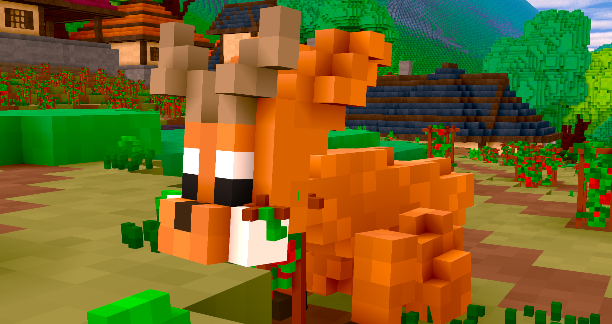
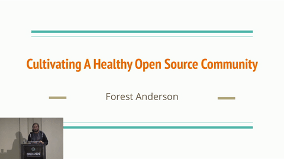
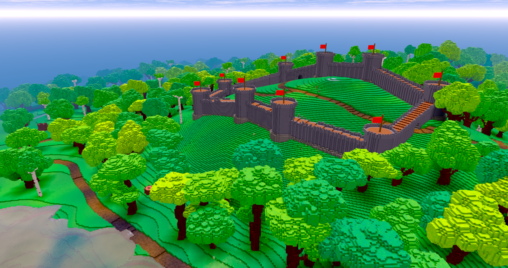

+++
title = "This Month in Rust GameDev #11 - June 2020"
date = 2020-07-01
transparent = true
draft = true
+++

<!-- markdownlint-disable no-trailing-punctuation -->
<!-- markdownlint-enable line-length -->

Welcome to the eleventh issue of the Rust GameDev Workgroup’s
monthly newsletter.
[Rust] is a systems language pursuing the trifecta:
safety, concurrency, and speed.
These goals are well-aligned with game development.
We hope to build an inviting ecosystem for anyone wishing
to use Rust in their development process!
Want to get involved? [Join the Rust GameDev working group!][join]

You can follow the newsletter creation process
by watching [the coordination issues][coordination].
Want something mentioned in the next newsletter?
[Send us a pull request][pr].
Feel free to send PRs about your own projects!

[Rust]: https://rust-lang.org
[join]: https://github.com/rust-gamedev/wg#join-the-fun
[pr]: https://github.com/rust-gamedev/rust-gamedev.github.io
[coordination]: https://github.com/rust-gamedev/rust-gamedev.github.io/issues?q=label%3Acoordination

Table of contents:

- [Game Updates](#game-updates)
- [Learning Material Updates](#learning-material-updates)
- [Library & Tooling Updates](#library-tooling-updates)
- [Popular Workgroup Issues in Github](#popular-workgroup-issues-in-github)
- [Meeting Minutes](#meeting-minutes)
- [Requests for Contribution](#requests-for-contribution)
- [Jobs](#jobs)
- [Bonus](#bonus)

<!--
Ideal section structure is:

```
### [Title]


A paragraph or two with a summary and [useful links].

_Discussions:
[/r/rust](https://reddit.com/r/rust/todo),
[twitter](https://twitter.com/todo/status/123456)_

[Title]: https://first.link
[useful links]: https://other.link
```

Discussion links are added only if they contain
some actual interesting discussions.

If needed, a section can be split into subsections with a "------" delimiter.
-->

## Game Updates

### [Veloren][veloren]



[Veloren][veloren] is an open world, open-source voxel RPG inspired by Dwarf
Fortress and Cube World.

In June, Veloren did a big interview with GamingOnLinux, be sure to [check it
out][gamingonlinux-interview]! Veloren's lead artist also started a weekly blog
about his work on Veloren, which you can see [here][pfau-blog]. Veloren recently
reached the [first page][gitlab-stars] of most starred projects on Gitlab! The
[Veloren Youtube channel][veloren-youtube-channel] also reached 1000
subscribers.

A lot has been done over the last month towards 0.7, which is slated to release
at the beginning of August. Lots of work has been done improving UI and
animations. These will help towards the goal of 0.7 being the "progression"
update. Many improvements have been made to the continuous integration system to
make it more reliable and faster. Mac support was added to Airshipper, the
Veloren launcher. Significant work was done on the world simulation front. This
includes economic simulations that will represent trade and resource pricing in
settlements and cities. Castle generation is also now in the works.


^ _Animation improvements_

Test coverage and documentation has started to improve, and a workflow around it
is being developed. The project is now hosting a [proper documentation
site][veloren-docs] that is updated with each merge. A #ux working group was
created to facilitate discussions on improvements to player interactions in
Veloren. Lots of translations were merged, including Swedish, Polish, and
Brazilian Portugese. The skill system is moving on to implementation, being a
coordinated effort between the game design, art, and combat working groups.

[](https://www.youtube.com/watch?v=aS26sqT09Pw)

^ _Click for the talk about open source and the Veloren project_

In July, work will be done to complete the progression systems. There will be
financial meetings held to discuss how funds from the project's Open Collective
will be distributed.



^ _Work on castle generation_

You can read more about some specific topics from June:

- [Mod Analysis](https://veloren.net/devblog-70#mod-analysis-by-bottledbyte)
- [Improving CI](https://veloren.net/devblog-70#improving-ci-by-xmac94x)
- [Economic Research](https://veloren.net/devblog-72#economic-research-by-zesterer)
- [Compilation Improvements](https://veloren.net/devblog-72#compilation-improvements-by-xmac94x)
- [Improving Test Coverage](https://veloren.net/devblog-73#improving-test-coverage-by-angelonfira)
- [Skill System Work](https://veloren.net/devblog-74#skill-system-work-by-xvar)
- [Animation updates](https://veloren.net/devblog-74#animation-updates)

June's full weekly devlogs: "This Week In Veloren...":
[#70](https://veloren.net/devblog-70),
[#71](https://veloren.net/devblog-71),
[#72](https://veloren.net/devblog-72),
[#73](https://veloren.net/devblog-73),
[#74](https://veloren.net/devblog-74),

[veloren]: https://veloren.net
[veloren-opencollective]: https://opencollective.com/veloren
[gamingonlinux-interview]:
https://www.gamingonlinux.com/2020/06/interviewed-veloren-an-upcoming-foss-multiplayer-voxel-rpg
[pfau-blog]: https://www.patreon.com/posts/weekly-blog-no-1-37819335
[gitlab-stars]: https://gitlab.com/explore/projects/starred
[veloren-youtube-channel]:
https://www.youtube.com/channel/UCmRjlnKnSRRihWPPNasl_Qw
[veloren-docs]: https://docs.veloren.net/veloren_voxygen/index.html

## Learning Material Updates

## Library & Tooling Updates

## Popular Workgroup Issues in Github

<!-- Up to 10 links to interesting issues -->

## Meeting Minutes

<!-- Up to 10 most important notes + a link to the full details -->

[See all meeting issues][label-meeting] including full text notes
or [join the next meeting][join].

[label-meeting]: https://github.com/rust-gamedev/wg/issues?q=label%3Ameeting

## Requests for Contribution

<!-- Links to "good first issue"-labels or direct links to specific tasks -->

- [Embark's open issues][embark-open-issues] ([embark.rs]);
- [winit's "Good first issue" and “help wanted” issues][winit-issues];
- [gfx-rs's "contributor-friendly" issues][gfx-issues];
- [wgpu's "help wanted" issues][wgpu-help-wanted];
- [luminance's "low hanging fruit" issues][luminance-fruits];
- [ggez's "good first issue" issues][ggez-issues];
- [Veloren's "beginner" issues][veloren-beginner];
- [Amethyst's "good first issue" issues][amethyst-issues];
- [A/B Street's "good first issue" issues][abstreet-issues];
- [Mun's "good first issue" issues][mun-issues];

[embark.rs]: https://embark.rs
[embark-open-issues]: https://github.com/search?q=user:EmbarkStudios+state:open
[winit-issues]: https://github.com/rust-windowing/winit/issues?utf8=✓&q=is%3Aissue+is%3Aopen+label%3A%22status%3A+help+wanted%22+label%3A%22Good+first+issue%22
[gfx-issues]: https://github.com/gfx-rs/gfx/issues?q=is%3Aissue+is%3Aopen+label%3Acontributor-friendly
[wgpu-help-wanted]: https://github.com/gfx-rs/wgpu-rs/issues?q=is%3Aissue+is%3Aopen+label%3A%22help+wanted%22
[luminance-fruits]: https://github.com/phaazon/luminance-rs/issues?q=is%3Aissue+is%3Aopen+label%3A%22low+hanging+fruit%22
[ggez-issues]: https://github.com/ggez/ggez/labels/%2AGOOD%20FIRST%20ISSUE%2A
[veloren-beginner]: https://gitlab.com/veloren/veloren/issues?label_name=beginner
[amethyst-issues]: https://github.com/amethyst/amethyst/issues?q=is%3Aissue+is%3Aopen+label%3A%22good+first+issue%22
[abstreet-issues]: https://github.com/dabreegster/abstreet/issues?q=is%3Aissue+is%3Aopen+label%3A%22good+first+issue%22
[mun-issues]: https://github.com/mun-lang/mun/labels/good%20first%20issue

## Jobs

<!-- An optional section for new jobs related to Rust gamedev -->

## Bonus

<!-- Bonus section to make the newsletter more interesting
and highlight events from the past. -->

Just an interesting Rust gamedev link from the past. :)

------

That's all news for today, thanks for reading!

Subscribe to [@rust_gamedev on Twitter][@rust_gamedev]
or [/r/rust_gamedev subreddit][/r/rust_gamedev] if you want to receive fresh news!

<!--
TODO: Add real links and un-comment once this post is published
**Discussions of this post**:
[/r/rust](TODO),
[twitter](TODO).
-->

[/r/rust_gamedev]: https://reddit.com/r/rust_gamedev
[@rust_gamedev]: https://twitter.com/rust_gamedev
