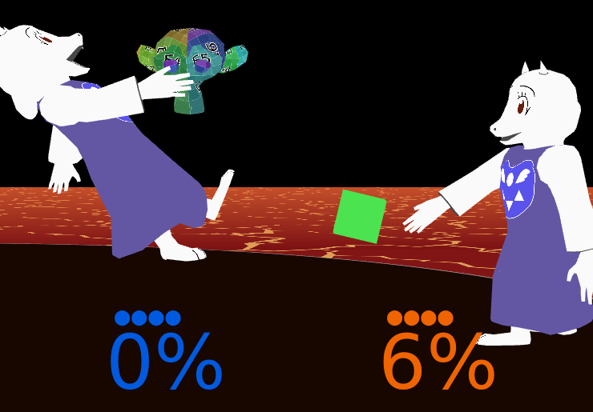
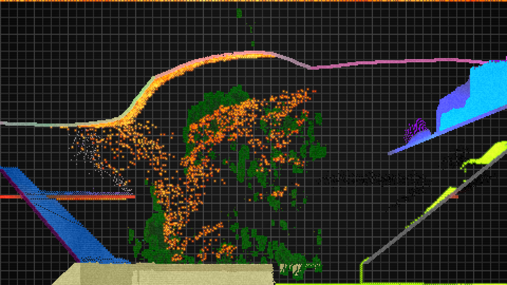
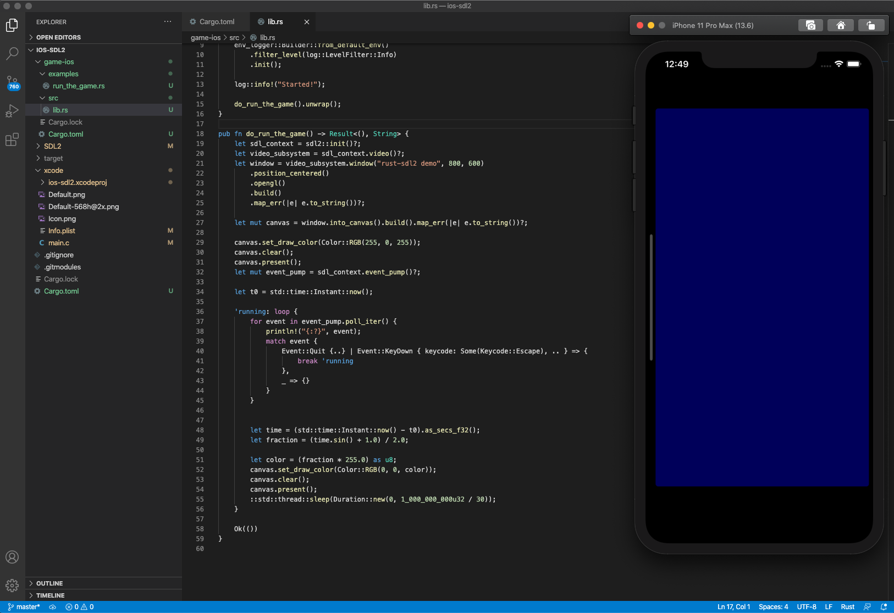
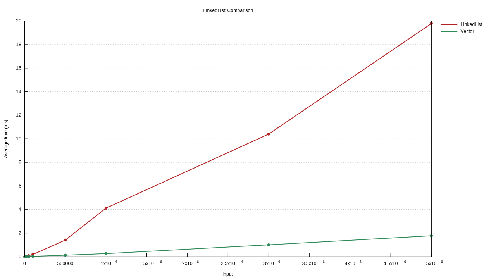
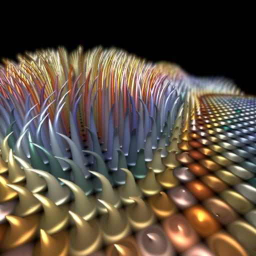
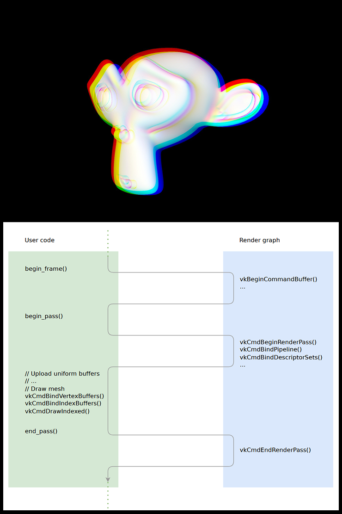
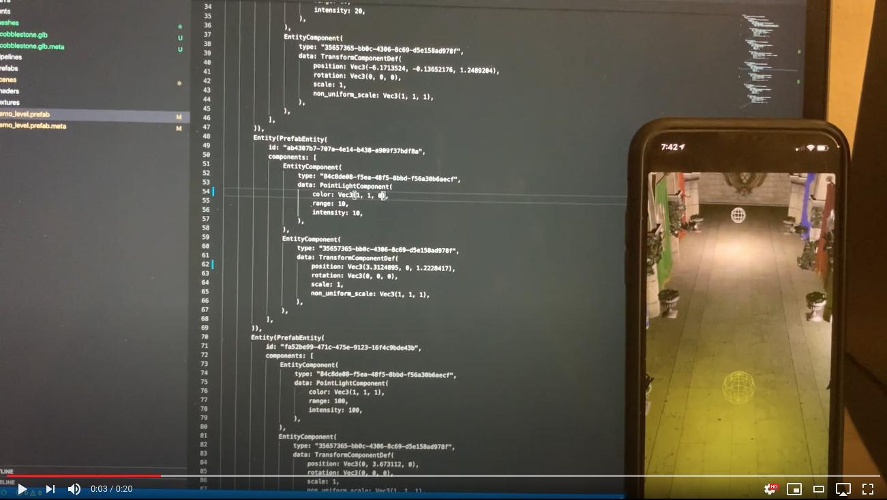
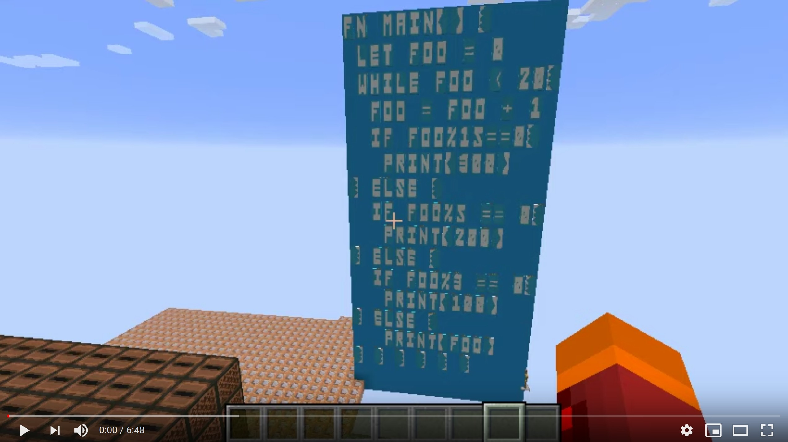

+++
title = "This Month in Rust GameDev #12 - July 2020"
date = 2020-08-03
transparent = true
draft = true
+++

Welcome to the twelfth issue of the Rust GameDev Workgroup’s
monthly newsletter.
[Rust] is a systems language pursuing the trifecta:
safety, concurrency, and speed.
These goals are well-aligned with game development.
We hope to build an inviting ecosystem for anyone wishing
to use Rust in their development process!
Want to get involved? [Join the Rust GameDev working group!][join]

You can follow the newsletter creation process
by watching [the coordination issues][coordination].
Want something mentioned in the next newsletter?
[Send us a pull request][pr].
Feel free to send PRs about your own projects!

[Rust]: https://rust-lang.org
[join]: https://github.com/rust-gamedev/wg#join-the-fun
[pr]: https://github.com/rust-gamedev/rust-gamedev.github.io
[coordination]: https://github.com/rust-gamedev/rust-gamedev.github.io/issues?q=label%3Acoordination

Table of contents:

- [Game Updates](#game-updates)
- [Learning Material Updates](#learning-material-updates)
- [Library & Tooling Updates](#library--tooling-updates)
- [Popular Workgroup Issues in Github](#popular-workgroup-issues-in-github)
- [Meeting Minutes](#meeting-minutes)
- [Requests for Contribution](#requests-for-contribution)
- [Jobs](#jobs)
- [Bonus](#bonus)

<!--
Ideal section structure is:

```
### [Title]


A paragraph or two with a summary and [useful links].

_Discussions:
[/r/rust](https://reddit.com/r/rust/todo),
[twitter](https://twitter.com/todo/status/123456)_

[Title]: https://first.link
[useful links]: https://other.link
```

Discussion links are added only if they contain
some actual interesting discussions.

If needed, a section can be split into subsections with a "------" delimiter.
-->

## Game Updates

### [Canon Collision][canon-collision]



[Canon Collision][canon-collision] by [@rukai] is an Undertale + Homestuck
fan-made platform fighter with powerful tools for modding.

This month, he started work on the project again after taking a break.
Notable changes:

- [basic projectiles](https://twitter.com/thisIsRukai/status/1287377878460456963),
- [WIP grab implementation (with some humorous results)](https://www.youtube.com/watch?v=sSrBGpT-Ebs),
- [New animations + attacks](https://www.youtube.com/watch?v=AaPkRSNhoSM)
- and [custom shaders](https://twitter.com/thisIsRukai/status/1279324105125163008).

[canon-collision]:https://canoncollision.com
[@rukai]: https://twitter.com/thisIsRukai

### [Sandbox]



[Sandbox] is a falling sand game by JMS55 that provides a variety of fun
particle types to place, and then you get to watch the resulting interactions!

As they didn't make it in time for last month's newsletter, this month's edition
covers the work they did in June and July:

- Released version 1.0 and 1.1, created a flatpak package and associated metadata,
  and published it to [Flathub].
- Several new particles such as Fire, Mirror, Glitch, and some hidden ones,
  and tweaked or overhalled almost every other particle!
- A fancy new glow post process effect for Acid/Fire/Electricity,
  created using wgpu-rs compute shaders.
  - As a precursor to this, they made a PR to the pixels crate that removes the
    old RenderPass approach in favor of giving the user direct access to wgpu.
- Made a slick new icon and background for the game.
- Added a video recording feature using gstreamer-rs and x264enc,
  and then later removed it (for now).
  - Moving from recording the raw texture generated for pixels
    to the post-processed texture from wgpu
    involved a major overhaul, and it proved too glitchy and slow.
    Hopefully it will be revived later, in the form of recording user inputs.
- Many structural improvements, such as less glitchy particle
  placement with Bresenham's line algorithm,
  better error handling, and ensuring particles
  are only ever stored on the heap.
- Performance improvements, including generating noise in a separate thread.
- Currently WIP: UI using imgui.


Got any ideas? Leave an [issue on github][Sandbox], or add it yourself!

[Sandbox]: https://github.com/JMS55/sandbox
[Flathub]: https://flathub.org/apps/details/com.github.jms55.Sandbox

## Learning Material Updates

### [Rust on iOS with SDL2][rust-ios-sdl2-post]

[][rust-ios-sdl2-post]

[@aclysma] published a [tutorial][rust-ios-sdl2-post] that describes setting up
Rust/SDL2 on iOS. The resulting app can run in the simulator as well as on
physical devices. [SDL2][sdl2-project] is a mature library providing basic rendering,
audio, and input support. It can also be used to set up an opengl or vulkan
surface. This demo is using [Rust-SDL2][rust-sdl2] for bindings.

[rust-ios-sdl2-post]: https://blog.aclysma.com/rust-on-ios-with-sdl2/
[@aclysma]: https://twitter.com/aclysma
[sdl2-project]: https://www.libsdl.org/download-2.0.php
[rust-sdl2]: https://crates.io/crates/sdl2

### [An Introduction to Data-Oriented Design in Rust][dod]



Data-Oriented Design is an approach to program optimisation focused on
considering the features and limitations of the target hardware, and
carefully controlling the memory layout of data to take advantage of
those.

In [this article][dod], [jamesmcm][jamesmcm] provides benchmarks and
code for four example scenarios:

- [Array of Structs vs. Struct of Arrays][wikisoa]
- Branching in a hot loop
- Iteration in a vector vs. a linked list
- Monomorphisation vs. [Dynamic Dispatch][traitobj]

The full article is available [here][dod].

[jamesmcm]: https://github.com/jamesmcm
[wikisoa]: https://en.wikipedia.org/wiki/AoS_and_SoA
[traitobj]: https://doc.rust-lang.org/book/ch17-02-trait-objects.html#trait-objects-perform-dynamic-dispatch
[dod]: http://jamesmcm.github.io/blog/2020/07/25/intro-dod/#en

## Library & Tooling Updates

### [wgpu][wgpu-site]



^ _[@MacTuitui]'s everyday [nannou] experiement #1274_

The work is ongoing to validate all the incoming commands and guarantee API safety.
Special thanks to [@GabrielMajeri] for helping to convert assertions
into errors at `wgpu` level.
The wgpu devs are also introspecting shader requirements
and matching them against the pipelines, but this will take more effort
before it will become universally available.

[@cwfitzgerald] has been busy adding a few handy native-only extensions,
such as descriptor indexing and push constants.
They have also converted the project's logging to [tracing](https://crates.io/crates/tracing),
setting up the infrastructure for CPU profiling.

In the past 2 months, the API for descriptor structures in `wgpu-rs`
have been undergoing a turbulent period.
First, non-exhaustive semantics led to introduction of constructors.
Then, efforts to reduce code duplication inside `wgpu` project has led to the
[bovine invasion](https://github.com/gfx-rs/wgpu-rs/pull/460) on wgpu-rs API side.
The devs are figuring out the plan to address that with a builder pattern now,
which will address both the `Cow`s and non-exhaustives,
hopefully putting the end to the turbulence.

In the meantime, `wgpu-rs` ecosystem is flourishing with applications and libraries.
The [showcase gallery](https://wgpu.rs/#showcase) was updated with a few shiny images.

------

Finally, [@kunalmohan] has been busy
[implementing WebGPU in Servo][webgpu-in-servo], based on `wgpu`.
Thanks to this work, Servo is currently ahead of Gecko
in terms of API being up-to-date and covered 🎉.
It's already capable of rendering most of the examples,
and the devs are looking forward to the day when the same Rust code
(rendering with `wgpu-rs`) will be deployable to the Web,
and viewable from Firefox, Servo, Chrome, and other browsers.

[@GabrielMajeri]: https://github.com/GabrielMajeri
[@cwfitzgerald]: https://github.com/cwfitzgerald
[@kunalmohan]: https://github.com/kunalmohan
[webgpu-in-servo]: https://github.com/servo/servo/projects/24
[@MacTuitui]: https://twitter.com/MacTuitui
[nannou]: https://nannou.cc
[wgpu-site]: https://wgpu.rs

### [Graphene][graphene] - Vulkan Render Graph



[Graphene][graphene] is a Vulkan render graph. Still heavily a work in progress,
it is built to be a simpler abstraction over Vulkan, with long-term ambitions to
serve as a graphics test-bench.

Currently, it implements a mesh render pass followed by a chromatic aberration
post-process in less than [250 lines of Rust code][graphene_example_code].
Current features include easy Vulkan initialization, automatic swapchain
resizing, glTF mesh loading, and shader hot-reloading.
Check out a ["Render graphs" blog post][graphene_blog]
for a more in-depth introduction to the project.


You can follow progress on [GitHub][graphene] or on [Twitter][apoorvaj].

[graphene]: https://github.com/ApoorvaJ/graphene
[graphene_blog]: https://apoorvaj.io/render-graphs-1/
[graphene_example_code]: https://github.com/ApoorvaJ/graphene/blob/a1ee574d92445f4cff195ca517af2912ebfce697/src/demos/00/main.rs
[apoorvaj]: https://twitter.com/ApoorvaJ

### Vulkan Renderer (Name TBD)

[][vulkan-renderer-prototype-video]

^ _Click to watch [the video demo][vulkan-renderer-prototype-video] running on iOS._

[@aclysma] published a [new vulkan-based renderer][renderer-prototype] that
uses [atelier-assets] to load 3D scenes exported from blender.

> The objective of this repo is to build a scalable, flexible, data driven
> renderer. Scalable in the sense of performance as well as suitability for
> use in large, real-world projects. This means streaming, LODs, visibility
> systems, and multi-threaded draw call submission need to be possible.
> Additionally it means thinking through how an asset pipeline would work for
> a team with dedicated artists and supporting workflow-friendly features
> like hot reloading assets, possibly on remote devices.

This video demonstrates the renderer running on iOS and receiving asset updates
via wifi. The scene is "sponza" exported from blender. Vulkan is supported on
windows and linux natively. Support for macOS and iOS is via the
well-established [MoltenVK][moltenvk] project.

The demo was ported from PC to iOS over a single weekend and out of
approximately 300 crate dependencies (including complex, OS-specific ones like
tokio), all but a few worked out-of-the-box!

[@aclysma]: https://twitter.com/aclysma
[renderer-prototype]: https://github.com/aclysma/renderer_prototype
[atelier-assets]: https://github.com/amethyst/atelier-assets
[vulkan-renderer-prototype-video]: https://www.youtube.com/watch?v=Ks_HQbejHE4
[moltenvk]: https://github.com/KhronosGroup/MoltenVK

### [Langcraft]

[Langcraft] is the Minecraft LLVM target you've never wanted.

Langcraft started as a dare to the `#lang-dev` channel of the Rust
Community Discord to be able to parse Rust code in Minecraft.
Naturally, it grew into a full code generator that can translate
most LLVM IR to
[Minecraft data packs](https://minecraft.gamepedia.com/Data_Pack),
the game's deliberately-limited in-game scripting language. Langcraft
is entirely language independent, so any language with an LLVM-based
compiler can (with the right API bindings) run in Minecraft. Currently
bindings to both C and Rust exist. While not as visually impressive as
a redstone computer, Langcraft does stretch the bounds of the game quite
a bit, using jukeboxes for memory, armor stands to represent pointers,
and rearranging compiled code to make it run in the bounds of the data
packs' fixed instruction limit.

This is all, naturally, entirely useless. The project is also still
heavily work-in-progress and does not pretend to be stable, but it is
usable. A handwritten interpreter for a Rust-like language has already
been demonstrated running, and even more complex projects like [CHIP-8
emulators](https://github.com/Dhole/chip8-rs.git) function (albeit at
extremely slow speed).

You can watch a [video of Rust interpreter running Fizzbuzz][langcraft-video]:

[][langcraft-video]

[Langcraft]: https://github.com/SuperTails/langcraft
[langcraft-video]: https://youtube.com/watch?v=Cx0w5Wn9pPU

## Popular Workgroup Issues in Github

<!-- Up to 10 links to interesting issues -->

## Meeting Minutes

<!-- Up to 10 most important notes + a link to the full details -->

[See all meeting issues][label-meeting] including full text notes
or [join the next meeting][join].

[label-meeting]: https://github.com/rust-gamedev/wg/issues?q=label%3Ameeting

## Requests for Contribution

<!-- Links to "good first issue"-labels or direct links to specific tasks -->

- [Embark's open issues][embark-open-issues] ([embark.rs]);
- [winit's "Good first issue" and “help wanted” issues][winit-issues];
- [gfx-rs's "contributor-friendly" issues][gfx-issues];
- [wgpu's "help wanted" issues][wgpu-help-wanted];
- [luminance's "low hanging fruit" issues][luminance-fruits];
- [ggez's "good first issue" issues][ggez-issues];
- [Veloren's "beginner" issues][veloren-beginner];
- [Amethyst's "good first issue" issues][amethyst-issues];
- [A/B Street's "good first issue" issues][abstreet-issues];
- [Mun's "good first issue" issues][mun-issues];

[embark.rs]: https://embark.rs
[embark-open-issues]: https://github.com/search?q=user:EmbarkStudios+state:open
[winit-issues]: https://github.com/rust-windowing/winit/issues?utf8=✓&q=is%3Aissue+is%3Aopen+label%3A%22status%3A+help+wanted%22+label%3A%22Good+first+issue%22
[gfx-issues]: https://github.com/gfx-rs/gfx/issues?q=is%3Aissue+is%3Aopen+label%3Acontributor-friendly
[wgpu-help-wanted]: https://github.com/gfx-rs/wgpu-rs/issues?q=is%3Aissue+is%3Aopen+label%3A%22help+wanted%22
[luminance-fruits]: https://github.com/phaazon/luminance-rs/issues?q=is%3Aissue+is%3Aopen+label%3A%22low+hanging+fruit%22
[ggez-issues]: https://github.com/ggez/ggez/labels/%2AGOOD%20FIRST%20ISSUE%2A
[veloren-beginner]: https://gitlab.com/veloren/veloren/issues?label_name=beginner
[amethyst-issues]: https://github.com/amethyst/amethyst/issues?q=is%3Aissue+is%3Aopen+label%3A%22good+first+issue%22
[abstreet-issues]: https://github.com/dabreegster/abstreet/issues?q=is%3Aissue+is%3Aopen+label%3A%22good+first+issue%22
[mun-issues]: https://github.com/mun-lang/mun/labels/good%20first%20issue

## Jobs

<!-- An optional section for new jobs related to Rust gamedev -->

## Bonus

<!-- Bonus section to make the newsletter more interesting
and highlight events from the past. -->

Just an interesting Rust gamedev link from the past. :)

------

That's all news for today, thanks for reading!

Subscribe to [@rust_gamedev on Twitter][@rust_gamedev]
or [/r/rust_gamedev subreddit][/r/rust_gamedev] if you want to receive fresh news!

<!--
TODO: Add real links and un-comment once this post is published
**Discussions of this post**:
[/r/rust](TODO),
[twitter](TODO).
-->

[/r/rust_gamedev]: https://reddit.com/r/rust_gamedev
[@rust_gamedev]: https://twitter.com/rust_gamedev
