+++
title = "This Month in Rust GameDev #12 - July 2020"
date = 2020-08-03
transparent = true
draft = true
+++

Welcome to the twelfth issue of the Rust GameDev Workgroup’s
monthly newsletter.
[Rust] is a systems language pursuing the trifecta:
safety, concurrency, and speed.
These goals are well-aligned with game development.
We hope to build an inviting ecosystem for anyone wishing
to use Rust in their development process!
Want to get involved? [Join the Rust GameDev working group!][join]

You can follow the newsletter creation process
by watching [the coordination issues][coordination].
Want something mentioned in the next newsletter?
[Send us a pull request][pr].
Feel free to send PRs about your own projects!

[Rust]: https://rust-lang.org
[join]: https://github.com/rust-gamedev/wg#join-the-fun
[pr]: https://github.com/rust-gamedev/rust-gamedev.github.io
[coordination]: https://github.com/rust-gamedev/rust-gamedev.github.io/issues?q=label%3Acoordination

Table of contents:

- [Game Updates](#game-updates)
- [Learning Material Updates](#learning-material-updates)
- [Library & Tooling Updates](#library--tooling-updates)
- [Popular Workgroup Issues in Github](#popular-workgroup-issues-in-github)
- [Meeting Minutes](#meeting-minutes)
- [Requests for Contribution](#requests-for-contribution)
- [Jobs](#jobs)
- [Bonus](#bonus)

<!--
Ideal section structure is:

```
### [Title]


A paragraph or two with a summary and [useful links].

_Discussions:
[/r/rust](https://reddit.com/r/rust/todo),
[twitter](https://twitter.com/todo/status/123456)_

[Title]: https://first.link
[useful links]: https://other.link
```

Discussion links are added only if they contain
some actual interesting discussions.

If needed, a section can be split into subsections with a "------" delimiter.
-->

## Game Updates

### [ochre][4k-post] - 4K Intro

[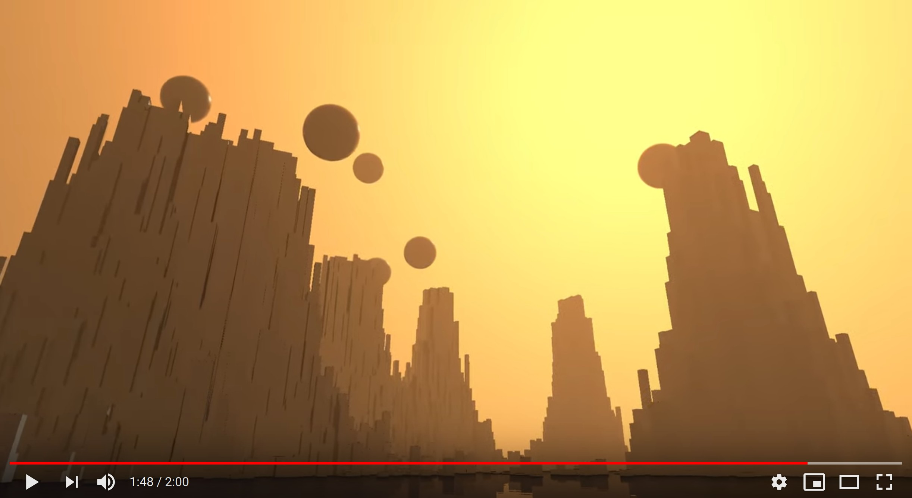][4k-video]

^ _Click to [watch the demo on Youtube][4k-video]._

Jani Peltonen has recently released a [4K intro][4k-src]
which is completely written in Rust and GLSL
and published an article ["Writing a winning 4K intro in Rust"][4k-post]:

> A 4K intro is a demo where the entire program (including any data)
> has to be 4096 bytes or less so it is important
> that the code is as space efficient as possible.
> Rust has a bit of a reputation for creating bloated executables so I wanted
> to find out if is possible to create very space efficient code with it.

_Discussions:
[/r/rust](https://reddit.com/r/rust/comments/enbbxu/writing_a_4k_intro_in_rust),
[hacker news](https://news.ycombinator.com/item?id=23742870)_

[4k-post]: https://www.codeslow.com/2020/07/writing-winning-4k-intro-in-rust.html
[4k-src]: https://github.com/janiorca/sphere_dance
[4k-video]: https://youtube.com/watch?v=SIkkYRQ07tU

### [Robo Instructus: 1 Year Later][robo-year]


One year ago [Alex Butler] released the "[Robo Instructus][robo-site]" puzzle game
on [Steam][robo-steam] & [itch.io][robo-itch].

This month Alex released a devlog post ["Robo Instructus: 1 Year Later"][robo-year]
about how well the game did after the release:
sales by platform/country/OS, player feedback & reviews, etc.

> People mostly don’t publish sales figures,
> I guess it makes more business sense to be vague.
> But maybe these will be helpful or interesting in some way.

Also, Alex continues to maintain and polish the game: [1.29 version][robo-1-29]
brings auto-scrolling improvements, better lang parsing,
bugfixes, and dependency updates.

_Discussions:
[/r/rust](https://reddit.com/r/rust_gamedev/comments/hsf2su/robo_instructus_1_year_later)_

[Alex Butler]: https://twitter.com/bigabgames
[robo-site]: https://www.roboinstruct.us
[robo-steam]: https://store.steampowered.com/app/1032170/Robo_Instructus
[robo-itch]: https://bigabgames.itch.io/robo-instructus
[robo-year]: https://blog.roboinstruct.us/2020/07/16/1-year-later.html
[robo-1-29]: https://store.steampowered.com/newshub/app/1032170/view/4355495589078346745

### [Crate Before Attack][cba-site]

[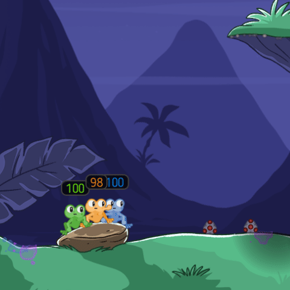][cba-site]

^ _A new weapon: the Golf Club_

[Crate Before Attack][cba-site] by [koalefant (@CrateAttack)][@CrateAttack]
is a skill-based grappling hook multiplayer game where frogs combat their friends
while navigating the landscape with their sticky tongues.

A summary of July changes:

- Gameplay: added a new melee weapon:
  [the Golf Club][cba-youtube-golf-club].
- Maps: added new map [Ruins][cba-youtube-observation]
  by [Kesha Astafyev][cba-spoon-tar]
- Animation: added eye tracking, frogs will track the closest danger
  with their eyes such as a projectile or a pet.
- Lobby: it is now possible to observe a match after it was started,
  added chat, user list with country flags, match details, and map previews.
- Localization: the game comes in three languages now: English, Spanish, Russian.
- Numerous bugfixes and tweaks.

Here is [a Playable Browser build][cba-play].
More details are on [the YouTube channel][cba-youtube]
and in [July Update DevLog-entry][cba-july-update].

[cba-site]: https://cratebeforeattack.com
[cba-july-update]: https://cratebeforeattack.com/posts/20200731-july-update/
[cba-play]: https://cratebeforeattack.com/play
[cba-youtube]: https://youtube.com/channel/UC_xMilPTLuuE5iLs1Ml9zow
[cba-youtube-golf-club]: https://youtu.be/UYxZQh68T6E
[cba-youtube-observation]: https://youtu.be/D63xy7sXStk
[cba-spoon-tar]: https://www.behance.net/spoon_tar
[@CrateAttack]: https://twitter.com/CrateAttack

### [Wonder]

[][Wonder]

[Wonder] ([source code][Wonder-source]) is a casual physics puzzle game by [@kettlecorn]
made for the web with WebAssembly, browser APIs, and no game framework.
The objective is to collect all the stars on each level
by drawing lines for the ball to roll along.

The game was made in 48 hours for the
[Ludum Dare game jam][ludum-dare] that occurred in April.
@kettlecorn recently published an article going into the technical and
creative challenges encountered making the game:
["Making a Game in 48 hours with Rust and WebAssembly"][48-hour-jam].

Wonder can be [played in the browser on itch.io][Wonder].

[Wonder]: https://kettlecorn.itch.io/wonder
[Wonder-source]: https://github.com/kettle11/LD46
[@kettlecorn]: https://twitter.com/kettlecorn
[ludum-dare]: https://ldjam.com
[48-hour-jam]: https://ianjk.com/rust-gamejam/

### Vlad Zhukov's [Online RTS Prototype][hex_strat]

[][hex_strat]

[Vlad Zhukov] shared a video of a WIP multiplayer online strategy game
where you fight with other players for territory.
Currently there are two types of resources and 5 types of buildings.
To build on the tile you need to occupy it with your warriors first.
The player who occupied all enemies' tiles win.

The game is written with [miniquad](https://github.com/not-fl3/miniquad)
and a custom GUI library.
Some parts of the game are promised to be open-sourced in future.
Read more about crates used in this project [here][hex-strat-crates].

_Discussions:
[twitter](https://twitter.com/VladZhukov0/status/1288091150339969024),
[/r/rust_gamedev](https://reddit.com/r/rust_gamedev/comments/hzdzqg/my_new_online_strategy_game)_

[hex_strat]: https://twitter.com/VladZhukov0/status/1288091150339969024
[Vlad Zhukov]: https://twitter.com/VladZhukov0
[hex-strat-crates]: https://reddit.com/r/rust_gamedev/comments/hzdzqg/my_new_online_strategy_game/fzk4l25

### [A/B Street][abstreet]


[A/B Street][abstreet] is a traffic simulation game exploring
how small changes to roads affect cyclists, transit users, pedestrians,
and drivers.

This month [versions v0.2.2..v0.2.5][abstreet-releases] were released.
Some of the updates:

- New random traffic scenario generator that makes people go between
  houses and workplaces.
- New commute pattern explorer tool.
- New character art to give cutscenes a bit more personality.
- Lots of pathfinding and user interface improvements.
- Bugfixes and improved performance (especially startup time on large maps).

[abstreet]: https://abstreet.org
[abstreet-releases]: https://github.com/dabreegster/abstreet/releases

### [Tennis Academy Dash][tennis-academy-dash]


[@oliviff] released [Tennis Academy Dash][tennis-academy-dash]
[v0.2][tennis-academy-update]:

This release features:

- a layering/scene management system
- transitioning between UI scenes and game scenes
- improving the level loading to work with string config files
- adding a 5th level

[@oliviff]: https://twitter.com/oliviff
[tennis-academy-dash]: https://iolivia.itch.io/tennis-academy-dash
[tennis-academy-update]: https://twitter.com/oliviff/status/1285298082033348609

### [protochess]

[][protochess]

[protochess] ([source][protochess-src]) is an online multiplayer chess website
that lets you build custom pieces/boards.

> Want a piece that can move like a knight + queen? Sure.
> Want to play on a 16x16 sized board? Impractical but you can do it!

The frontend is written in Svelte with routing from Routify
and styling with the Bulma CSS framework.
All the chess logic is written in Rust, and compiled to WebAssembly to run singleplayer.
The multiplayer websocket server uses Warp
and is modeled after [this project](https://www.mattkeeter.com/projects/pont/).

_Discussions:
[/r/rust](https://reddit.com/r/rust/comments/hki9fu/protochesscom_a_chess_website_that_lets_you_play)_

[protochess]: https://protochess.com/
[protochess-src]: https://github.com/raytran/protochess

### Nox Futura (Rust Edition)


[Herbert Wolverson][thebracket]
(the author of [bracket-lib] and [the Rust Roguelike Tutorial][rl-book])
continues porting their old ["Nox Futura" project][nox-f-old] to Rust.
The game uses wgpu, Legion, and Dear ImGui.

Some of this month's updates:

- [The project's repo is now public][noxfutura-src];
- Voxel-friendly SSAO;
- The render pipeline is now about 75% done;
- Jobs board, buildings creation, and lumberjacking;
- 3D cursor and mouse picking;
- Voxelized Vegetation and growing trees;
- Improved A* pathfinding and performance in general.

Check out Sharing Saturday devlogs for more detailed reports:
[\#1](https://reddit.com/r/roguelikedev/comments/hktr2y/sharing_saturday_318/fwutz7n),
[\#2](https://reddit.com/r/roguelikedev/comments/hp04g6/sharing_saturday_319/fxnsn8h),
[\#3](https://reddit.com/r/roguelikedev/comments/ht6wcc/sharing_saturday_320/fygjvkg),
[\#4](https://reddit.com/r/roguelikedev/comments/hxcvp8/sharing_saturday_321/fz5atmd).

[noxfutura-src]: https://github.com/thebracket/noxfutura
[thebracket]: https://bracketproductions.com
[bracket-lib]: https://github.com/thebracket/bracket-lib
[rl-book]: http://bfnightly.bracketproductions.com/rustbook/
[nox-f-old]: https://thebracket.itch.io/nox-futura

### [🏕 Textcamp!][textcamp]


[@peat] released a simple multiplayer demo of [Textcamp][textcamp-demo], a
text-based adventure game.

The goal of Textcamp is to build a modern [MUD] platform that can be played
by [_anyone, anywhere_][textcamp]. It's very early in development, so please
[say hello][textcamp-twitter] if you're interested in contributing code or
stories!

This demo features:

- Basic scene, mob, and item templating, with spawning and combat.
- Multiplayer authentication and support for hundreds of players.

[@peat]: https://twitter.com/peat
[textcamp]: https://text.camp/
[textcamp-repo]: https://github.com/textcamp/textcamp
[textcamp-twitter]: https://twitter.com/textdotcamp
[textcamp-demo]: http://play.text.camp:8080/
[MUD]: https://en.wikipedia.org/wiki/MUD

### [Canon Collision][canon-collision]


[Canon Collision][canon-collision] by [@rukai] is an Undertale + Homestuck
fan-made platform fighter with powerful tools for modding.

This month, he started work on the project again after taking a break.
Notable changes:

- [basic projectiles](https://twitter.com/thisIsRukai/status/1287377878460456963),
- [WIP grab implementation (with some humorous results)](https://www.youtube.com/watch?v=sSrBGpT-Ebs),
- [New animations + attacks](https://www.youtube.com/watch?v=AaPkRSNhoSM)
- and [custom shaders](https://twitter.com/thisIsRukai/status/1279324105125163008).

[canon-collision]:https://canoncollision.com
[@rukai]: https://twitter.com/thisIsRukai

### pGLOWrpg


The [@pGLOWrpg] (Procedurally Generated Living Open World RPG) is a long-term
project in development by [@Roal_Yr], which aims to be a text-based game with
maximum portability and accessibility and focus on interactions and emergent
narrative.

For the past month(s) the main focus of the development was on the river
generation system in the worldgen. Main features of the river generator are:

- High robustness with most edge cases covered;
- Single-pass with subsequent iterations generation, with numerous options to
  tweak the process for either precision of the pattern or speed of generation;
- Rivers are sorted upon intersections, their widths are adjusted, waterfalls
  are formed when necessary;
- Inflow and outflow directions are recorded for each cell, which allows to
  follow the river upstream or downstream;
- Simple yet effective erosion model implemented, which ensures no upwards flows
  are allowed;
- Each stream has its unique ID, which will later be linked to the stream data;
- Streams have 12 orders of magnitude from smallest brooks to major rivers;
- All the options are available to user under "General", "Advanced" and
  "Very advanced" sections for any level of fine-tuning;

Further development will involve re-factoring of the code and making it ready
to be published prior to implementing new features. For small dev reports follow
[@pGLOWrpg] on Twitter.

[@Roal_Yr]: https://twitter.com/Roal_Yr
[@pGLOWrpg]: https://twitter.com/pglowrpg

### [Sandbox]


[Sandbox] is a falling sand game by JMS55 that provides a variety of fun
particle types to place, and then you get to watch the resulting interactions!

As they didn't make it in time for last month's newsletter, this month's edition
covers the work they did in June and July:

- Released version 1.0 and 1.1, created a flatpak package and associated metadata,
  and published it to [Flathub].
- Several new particles such as Fire, Mirror, Glitch, and some hidden ones,
  and tweaked or overhalled almost every other particle!
- A fancy new glow post process effect for Acid/Fire/Electricity,
  created using wgpu-rs compute shaders.
  - As a precursor to this, they made a PR to the pixels crate that removes the
    old RenderPass approach in favor of giving the user direct access to wgpu.
- Made a slick new icon and background for the game.
- Added a video recording feature using gstreamer-rs and x264enc,
  and then later removed it (for now).
  - Moving from recording the raw texture generated for pixels
    to the post-processed texture from wgpu
    involved a major overhaul, and it proved too glitchy and slow.
    Hopefully it will be revived later, in the form of recording user inputs.
- Many structural improvements, such as less glitchy particle
  placement with Bresenham's line algorithm,
  better error handling, and ensuring particles
  are only ever stored on the heap.
- Performance improvements, including generating noise in a separate thread.
- Currently WIP: UI using imgui.


Got any ideas? Leave an [issue on github][Sandbox], or add it yourself!

[Sandbox]: https://github.com/JMS55/sandbox
[Flathub]: https://flathub.org/apps/details/com.github.jms55.Sandbox

### [Pushin' Boxes][pushin-homepage]

[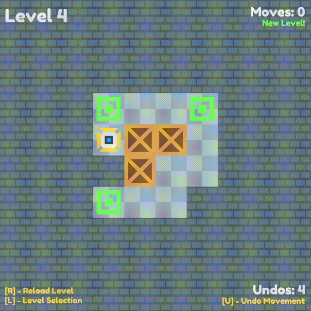][pushin-itch]

[Pushin' Boxes][pushin-homepage] ([itch][pushin-itch])
is a [Sokoban][pushin-sokoban] clone made with [ggez][pushin-ggez] by
[@septum][septum-twitter]. It features 16 levels of puzzling box-pushin' action
where the player controls a little robot (named プシン).
Check out a [blog post][pushin-post] about the game's release.

[The source code is available on GitLab][pushin-repository].

[pushin-homepage]: https://septum.io/games/pushin-boxes
[pushin-itch]: https://septum.itch.io/pushin-boxes
[pushin-sokoban]: https://en.wikipedia.org/wiki/Sokoban
[pushin-post]: https://septum.io/blog/my-first-game
[pushin-ggez]: https://github.com/ggez/ggez
[pushin-repository]: https://gitlab.com/septum___/pushin_boxes
[septum-twitter]: https://twitter.com/septum___

### [Don't Stop][dont-stop]

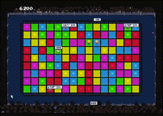

[Don't Stop][dont-stop] by @superahtoms is a rhythm game
written using Rust and SDL2 for the [GMTK 2020 jam][gmtk2020].

> Ever just wanted to keep dancing but the fuzz wants you to stop?
> Well now you can! Just keep on dancing, don't let the bouncers grab you
> while you're doing it or your fun stops!
> Keep being the life of the party because you are Party Pat!
>
> Be like wind, be fast, dance and don't get caught!

_Discussions:
[/r/rust_gamedev](https://reddit.com/r/rust_gamedev/comments/hq0ecp/gmtk_submission_dont_stop)_

[dont-stop]: https://superahtoms.itch.io/dont-stop
[gmtk2020]: https://itch.io/jam/gmtk-2020

### [shotcaller]

[shotcaller] is a WIP quick (~7mins) ASCII-rendered RTS/MOBA game.

> In the way "MOBA" games such as DOTA2 or LoL are usually played,
> the captain of the team is the default shotcaller.
>
> > The shotcaller needs to be unbiased and not have tunnel vision.
> > You need to be able to think in the future and tell
> > what would happen if you did this or that.
> > This becomes crucial when deciding to base-race or teleport back to defend.
> > ~reddit-user
>
> Everyone on the team can play the part of Shotcaller on occasion.
> The act of shotcalling is not typically the most prevalent activity of any player,
> even for a captain — after all, they also need to play their hero.
>
> But in this game, all you do is shotcalling and big-picture strategizing.
> The game plays as if you were controlling the 6th-person-in-the-booth “coach” player,
> and your team (of AI-played bots) actually follows
> your instructions to the letter, within their designed constraints.

The game is in an early stage of development,
[check out the design document][shotcaller-gdd] for details and plans.

[shotcaller]: https://github.com/amethyst/shotcaller
[shotcaller-gdd]: https://www.notion.so/Shotcaller-7374d2b2819c42ccb40f01dc7089d419

### [On FPS Game Progress \#2][on-fps-game-2]

[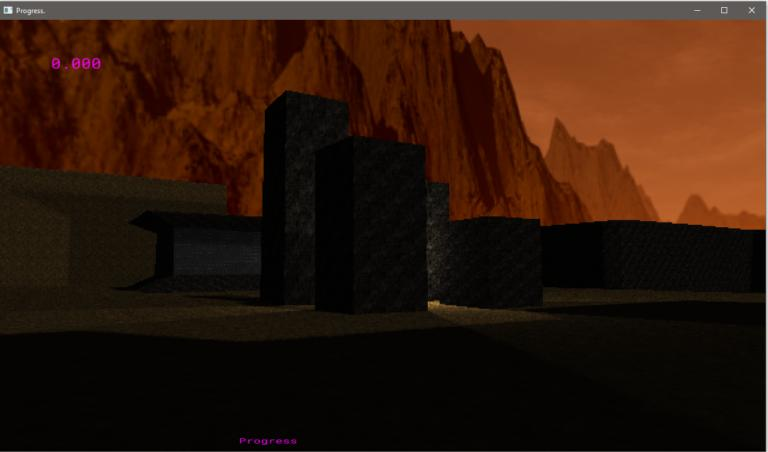][on-fps-game-2-youtube]

^ _Click to watch a [footage from the game's current state][on-fps-game-2-youtube]._

On this update, [@pingFromHeaven] talks about the lighting implementation that
sets the tone for the game, how Rust is good at shortening the debugging
times, which is especially valuable when working directly with OpenGL and why
he doesn't describe what the game is about.

The next update is going to be about establishing the mood further, which
includes a more elaborate environment with more details, basic SFX and
particles.

[on-fps-game-2-youtube]: https://youtu.be/NIJNgr9zeXk
[on-fps-game-2]: http://atilkockar.com/on-fps-game-progress-2/
[@pingFromHeaven]: https://twitter.com/pingFromHeaven

### [Zemeroth][zemeroth]

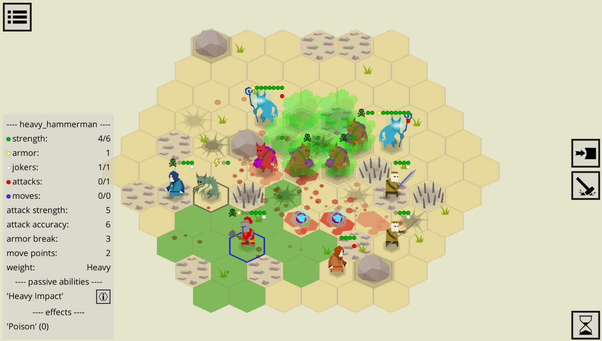

[Zemeroth][zemeroth] by [@ozkriff] is a minimalistic 2D turn-based tactical game.

Some of the recent updates:

- The game got a new development roadmap: ["Final Push"][zemeroth-final-push].
- UI updates: [widget stretching][zemeroth-stretch] and [more informative "dots"][zemeroth-dots].
- A few actions [got additional effects][zemeroth-flare].
- The work on adding sounds has begun.

[zemeroth]: https://github.com/ozkriff/zemeroth
[@ozkriff]: https://twitter.com/ozkriff
[zemeroth-final-push]: https://twitter.com/ozkriff/status/1280874966855176199
[zemeroth-stretch]: https://twitter.com/ozkriff/status/1284154997190594560
[zemeroth-dots]: https://twitter.com/ozkriff/status/1284418956296626176
[zemeroth-flare]: https://twitter.com/ozkriff/status/1282051985907298306

### [Veloren][veloren]


^ _Sunrise_

[Veloren][veloren] is an open world, open-source voxel RPG inspired by Dwarf
Fortress and Cube World.

In July, Veloren reached its 1000th merge! Lots of work has been done towards
the 0.7 release. The release date has been pushed from the beginning of August
to mid-August. A loot table system was added to item drops. Lots of work has
been done on animations and quadrupeds. Networking has switched to a new
system. Significant improvements have been made to pathfinding system to improve
fast quadruped movement. Particle systems are being implemented and optimized. A
crafting GUI has been added. Translations have stabalized significantly, and
there is a framework for translators to know what needs to be done.

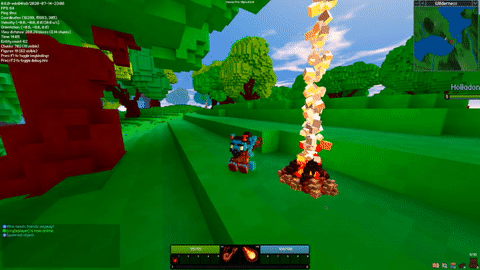

^ _Progress on the particle system_

You can read more about some specific topics from July:

- [Networking Milestone](https://veloren.net/devblog-75#networking-milestone-by-xmac94x)
- [The Case of the Disappearing Entities](https://veloren.net/devblog-75#the-case-of-the-disappearing-entities-by-imbris)
- [Pathfinding](https://veloren.net/devblog-75#pathfinding-with-zesterer)
- [GUID Insights](https://veloren.net/devblog-75#guid-insights-by-sharp)
- [Particle System](https://veloren.net/devblog-76#particle-system-by-lobster)
- [Translation Help](https://veloren.net/devblog-76#we-need-your-help-for-translations-this-is-how-it-s-done-by-xmac94x)
- [Particle Improvements](https://veloren.net/devblog-77#particle-improvements-by-lobster)
- [CPU Workloads](https://veloren.net/devblog-77#cpu-workloads-by-angelonfira)
- [Refactoring WORLD_SIZE](https://veloren.net/devblog-78#refactoring-world-size-by-sharp)

July's full weekly devlogs: "This Week In Veloren...":
[#75](https://veloren.net/devblog-75),
[#76](https://veloren.net/devblog-76),
[#77](https://veloren.net/devblog-77),
[#78](https://veloren.net/devblog-78).

In August, 0.7 will be released. Work will continue on castle and cave
geneartion. The inaugural episode of the Rust Game Dev podcast will be released,
which features an interview by Veloren developers.


^ _Quadruped overhaul_

[veloren]: https://veloren.net

## Learning Material Updates

### [Rust on iOS with SDL2][rust-ios-sdl2-post]

[][rust-ios-sdl2-post]

[@aclysma] published a [tutorial][rust-ios-sdl2-post] that describes setting up
Rust/SDL2 on iOS. The resulting app can run in the simulator as well as on
physical devices. [SDL2][sdl2-project] is a mature library providing basic rendering,
audio, and input support. It can also be used to set up an opengl or vulkan
surface. This demo is using [Rust-SDL2][rust-sdl2] for bindings.

[rust-ios-sdl2-post]: https://blog.aclysma.com/rust-on-ios-with-sdl2/
[@aclysma]: https://twitter.com/aclysma
[sdl2-project]: https://www.libsdl.org/download-2.0.php
[rust-sdl2]: https://crates.io/crates/sdl2

### [Rust Sokoban Tutorial][sokoban_book]

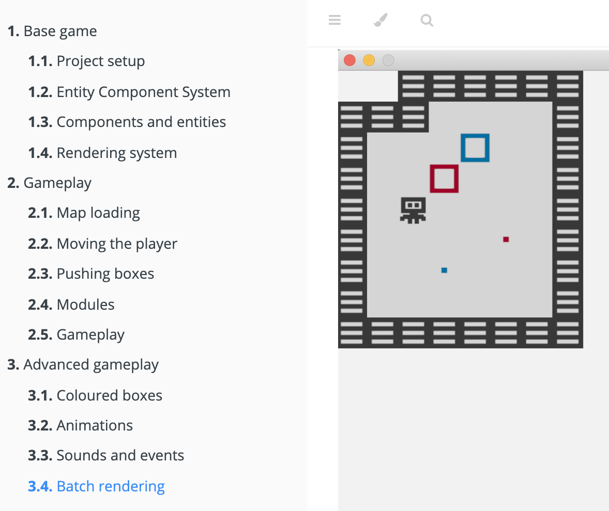

The Rust Sokoban tutorial is an online book aimed at Rust gamedev beginners
which walks through making a simple Sokoban game using ggez and ECS (with specs).
It tries to teach the basics of architecting in ECS and basic Rust concepts
through a hands-on approach.

This month:

- the book was officially released on July 10th;
- the project received 3 external contributions;
- a few text edits were done, including fixing an issue with code
  snippets not appearing correctly;
- work on translations has started (🇨🇳 translation coming soon 🤞).

You can follow
the release discussion [on Twitter][sokoban_release],
provide feedback [on github][sokoban_github] and
read the book at [sokoban.iolivia.me][sokoban_book].

[sokoban_release]: https://twitter.com/oliviff/status/1281641563257360384
[sokoban_book]: https://sokoban.iolivia.me
[sokoban_github]: https://github.com/iolivia/rust-sokoban

### [Make Pong with Rust][tantan-video]

[][tantan-video]

^ _Click to [watch the tutorial][tantan-video]._

[TanTan] released a [video tutorial][tantan-video]
that guides you through all the step of making a pong game in Rust
using the GGEZ framework.

The source code [can be found here][tantan-pong-src].

[TanTan]: https://twitter.com/Tantan22430802
[tantan-video]: https://youtube.com/watch?v=TUE_HSgQiG0
[tantan-pong-src]: https://github.com/TanTanDev/rusty_pong

### [An Introduction to Data-Oriented Design in Rust][dod]


Data-Oriented Design is an approach to program optimisation focused on
considering the features and limitations of the target hardware, and
carefully controlling the memory layout of data to take advantage of
those.

In [this article][dod], [jamesmcm][jamesmcm] provides benchmarks and
code for four example scenarios:

- [Array of Structs vs. Struct of Arrays][wikisoa]
- Branching in a hot loop
- Iteration in a vector vs. a linked list
- Monomorphisation vs. [Dynamic Dispatch][traitobj]

The full article is available [here][dod].

[jamesmcm]: https://github.com/jamesmcm
[wikisoa]: https://en.wikipedia.org/wiki/AoS_and_SoA
[traitobj]: https://doc.rust-lang.org/book/ch17-02-trait-objects.html#trait-objects-perform-dynamic-dispatch
[dod]: http://jamesmcm.github.io/blog/2020/07/25/intro-dod/#en

### ["Rust'N'Games" Talk][rust-n-games]

[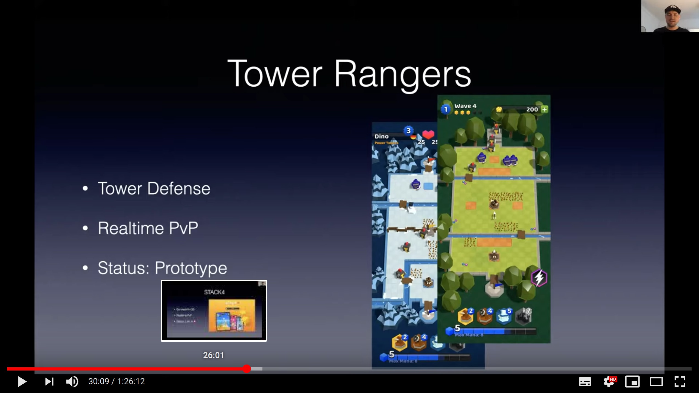][rust-n-games]

^ _Click to [watch the talk][rust-n-games]._

During the recent ["Rust and Tell"][rust-n-tell] online event
[Stephan @extrawurst Dilly][@extrawurst] gave a ["Rust'N'Games" talk][rust-n-games]
about their experience of using Rust in games at [Gameroasters].

[rust-n-games]: https://youtu.be/0Bj-5C2Zfqs?t=1404
[rust-n-tell]: https://berline.rs/2020/07/28/rust-and-tell.html
[@extrawurst]: https://twitter.com/extrawurst
[Gameroasters]: https://www.gameroasters.com/

## Library & Tooling Updates

### [A Servo Browser Plugin for Unity][servo-unity-post]

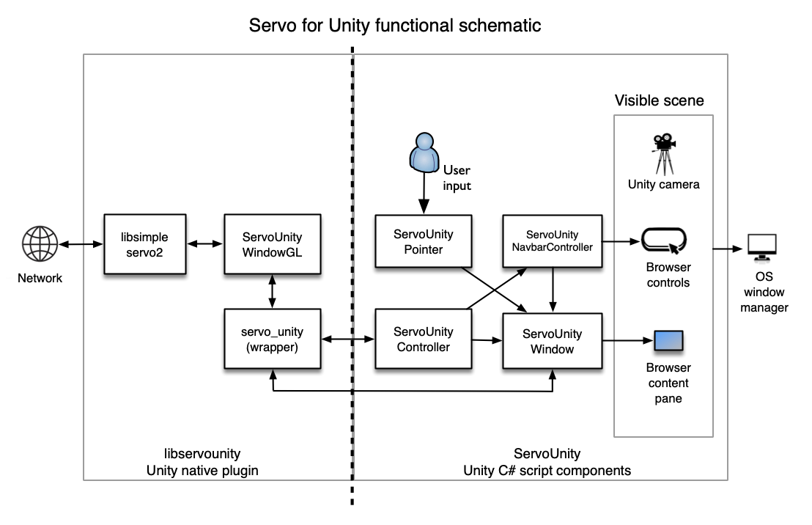

[Servo for Unity][servo-unity] is a Unity native plugin and a set
of Unity C# script components allow third parties to incorporate
Servo browser windows into Unity scenes.

[A blog post about the project][servo-unity-post] gives a good
overview of the project goals, capabilities, archtecture, challenges,
and future development plans.

[servo-unity]: https://github.com/MozillaReality/servo-unity
[servo-unity-post]: https://blog.mozvr.com/a-browser-plugin-for-unity

### [big-brain]

[big-brain] by [Kat Marchán] is an [utility AI] library for games,
built on the specs ECS.

> It lets you define complex, intricate AI behaviors for your entities
> based on their perception of the world.
> Definitions are almost entirely data-driven, using plain .ron files,
> and you only need to program considerations (entities that look at your game world),
> and actions (entities that perform actual behaviors upon the world).
> No other code is needed for actual AI behavior.

[big-brain]: https://github.com/zkat/big-brain
[Kat Marchán]: https://twitter.com/zkat__
[utility AI]: https://en.wikipedia.org/wiki/Utility_system

### [weasel] v0.8

[weasel] by [@Trisfald] is a customizable battle system for turn-based games.

This month [v0.8 was released][weasel-v0-8].
Highlights include:

- New event types
- Inanimate objects
- Status effects
- Many new examples

[weasel]: https://github.com/Trisfald/weasel
[weasel-v0-8]: https://github.com/Trisfald/weasel/releases/tag/v0.8.0
[@Trisfald]: https://github.com/Trisfald

### [naia]

[naia] (**n**etworking **a**rchitecture for **i**nteractive **a**pplications)
is a cross-platform (currently WebAssembly & Linux) networking engine that intends
to make multiplayer game development in Rust dead simple and lightning fast.

> At the highest level, you register Event and Entity implementations
> in a module shared by Client & Server.
> Then, naia will facilitate sending/receiving those Events between Client & Server,
> and also keep a pool of tracked Entities synced with each Client
> for whom they are "in-scope".
> Entities are "scoped" to Clients with whom they share the same Room,
> as well as being sufficiently customizable to, for example,
> only keep Entities persisted & synced while within a Client's viewport
> or according to some other criteria.

_Discussions:
[/r/rust](https://reddit.com/r/rust/comments/hj2eey/naia)_

[naia]: https://github.com/naia-rs/naia

### [voronator]


[voronator] by [Felipe Santos] is ...
a Rust port of the [d3-delaunay] and [delaunator] libraries
that provides delaunay triangulation and Voronoi diagram generation.

_Discussions:
[/r/rust](https://reddit.com/r/rust/comments/hjbl0y/introducing_voronator)_

[voronator]: https://github.com/fesoliveira014/voronator-rs
[Felipe Santos]: https://twitter.com/fesoliveira0
[d3-delaunay]: https://github.com/d3/d3-delaunay
[delaunator]: https://github.com/mapbox/delaunator

### [This Month in Mun][mun-july]

[][Mun]

[Mun] is a scripting language for gamedev focused on quick iteration times
that is written in Rust.

[Rustacean Station][rustacean] released [a podcast about Mun][rustacean-mun]
in which the Mun Core Team sat down with host Jeremy
to talk about why they chose Rust to develop Mun. If you are interested in
having an inside look into Mun's origins and evolution, we recommend you check
it out - or any of Rustacean Station's other podcasts for that matter!

Their additional [July updates][mun-july] include:

- initial support for the Language Server Protocol;
- a community entry for the [Make It or Break It content] of Spaceship
  recreated with Mun & Rust;
- CLI support for creating Mun projects;
- performance benchmarks and improvements;
- bugfixes and improved documentation.

[Mun]: https://mun-lang.org
[mun-july]: https://mun-lang.org/blog/2020/07/30/this-month-july
[rustacean]: https://rustacean-station.org
[rustacean-mun]: https://rustacean-station.org/episode/020-mun
[Make It or Break It content]: https://github.com/mun-lang/mun/issues/220

### ash(-window)

[`ash-window`], an interoperability library for [`ash`] and [`raw-window-handle`],
is now part of the `ash` repository and will be updated more closely
with new `ash` releases.

[`ash-window`]: https://crates.io/crates/ash-window
[`ash`]: https://crates.io/crates/ash
[`raw-window-handle`]: https://crates.io/crates/raw-window-handle

### grr 0.8

[`grr`](https://github.com/msiglreith/grr) is a modern OpenGL 4.5+ wrapper.
It provides a cleaned up API built around Vulkan's naming scheme.
The latest release further pushes the crate towards
full compatibility with the core features.

Most notable changes:

- Added support for a bunch of Formats
- Extended transfer operations (Attachment <-> Host <-> Buffer <-> Image)
- Raw context access
- Shader & Pipeline log control
- Device submission control

Special thanks to [@masonium](https://github.com/masonium)
for contributing a lot of these features and fixes!

### [miniquad]


[miniquad] is a safe and cross-platform rendering library
focused on portability and low-end platforms support.

This month opengl backend of miniquad was successefully ported to iOS.
With this update [macroquad], [good-web-game] and all the games
build directly with [miniquad] can be run on IOS, Android, WASM,
Linux, macOS and Windows!

[miniquad]: https://github.com/not-fl3/miniquad
[macroquad]: https://github.com/not-fl3/macroquad
[good-web-game]: https://github.com/not-fl3/good-web-game

### [wgpu][wgpu-site]


^ _[@MacTuitui]'s everyday [nannou] experiement #1274_

The work is ongoing to validate all the incoming commands and guarantee API safety.
Special thanks to [@GabrielMajeri] for helping to convert assertions
into errors at `wgpu` level.
The wgpu devs are also introspecting shader requirements
and matching them against the pipelines, but this will take more effort
before it will become universally available.

[@cwfitzgerald] has been busy adding a few handy native-only extensions,
such as descriptor indexing and push constants.
They have also converted the project's logging to [tracing](https://crates.io/crates/tracing),
setting up the infrastructure for CPU profiling.

In the past 2 months, the API for descriptor structures in `wgpu-rs`
have been undergoing a turbulent period.
First, non-exhaustive semantics led to introduction of constructors.
Then, efforts to reduce code duplication inside `wgpu` project has led to the
[bovine invasion](https://github.com/gfx-rs/wgpu-rs/pull/460) on wgpu-rs API side.
The devs are figuring out the plan to address that with a builder pattern now,
which will address both the `Cow`s and non-exhaustives,
hopefully putting the end to the turbulence.

In the meantime, `wgpu-rs` ecosystem is flourishing with applications and libraries.
The [showcase gallery](https://wgpu.rs/#showcase) was updated with a few shiny images.

------

Finally, [@kunalmohan] has been busy
[implementing WebGPU in Servo][webgpu-in-servo], based on `wgpu`.
Thanks to this work, Servo is currently ahead of Gecko
in terms of API being up-to-date and covered 🎉.
It's already capable of rendering most of the examples,
and the devs are looking forward to the day when the same Rust code
(rendering with `wgpu-rs`) will be deployable to the Web,
and viewable from Firefox, Servo, Chrome, and other browsers.

[@GabrielMajeri]: https://github.com/GabrielMajeri
[@cwfitzgerald]: https://github.com/cwfitzgerald
[@kunalmohan]: https://github.com/kunalmohan
[webgpu-in-servo]: https://github.com/servo/servo/projects/24
[@MacTuitui]: https://twitter.com/MacTuitui
[nannou]: https://nannou.cc
[wgpu-site]: https://wgpu.rs

### [luminance v0.40][luminance-v0-40]


[luminance] by [@phaazon] is a type-safe, type-level and stateless
graphics framework.

This month [luminance v0.40 got released][luminance-v0-40].
Some of the highlights:

- The complete backend/architecture redesign;
- A new platform crate has appeared:
  [luminance-sdl2], which adds support for the sdl2 crate.
- [luminance-webgl] and luminance-web-sys, to support the Web!
- A [luminance-examples-web] crate is available to test with `yarn` easily.
- [luminance-front], which is a front crate to ease working with luminance types.
- The type system experience has been greatly improved. Most of the time,
  you will not have to annotate types anymore — like Program or Tess.
- About `Tess`, a BIG update has landed, has it’s now heavily typed
  (vertex type, index type, vertex instance data type, memory interleaving type).
- More render states features, such as the possibility to enable or disable
  depth writes, separate RGB/alpha blending, etc. etc.
- Also, the [luminance book][luminance-book] got updated.

A complete changes list and a migration guide can be found
[in the CHANGELOG][luminance-v0-40-changelog].

luminance-0.41 got released a few days after to fix some type design problems with
the gates, and to enhance the error flow in graphics pipelines, revisited to be more
flexible and seamless.

Also, check out the
["The compile-time deinterleaving interface"][luminance-typesafe-deinterleaving]
blog post that delves deep into this new feature.

_Discussions:
[/r/rust](https://reddit.com/r/rust/comments/hsgfav/the_new_luminance_is_there)_

[@phaazon]: https://twitter.com/phaazon_
[luminance]: https://github.com/phaazon/luminance-rs
[luminance-v0-40-changelog]: https://github.com/phaazon/luminance-rs/blob/master/luminance/CHANGELOG.md#040
[luminance-v0-40]: https://phaazon.net/blog/luminance-0.40
[luminance-front]: https://crates.io/crates/luminance-front
[luminance-typesafe-deinterleaving]: https://phaazon.net/blog/typesafe-deinterleaving
[luminance-webgl]: https://crates.io/crates/luminance-webgl
[luminance-examples-web]: https://github.com/phaazon/luminance-rs/tree/master/luminance-examples-web
[luminance-sdl2]: https://crates.io/crates/luminance-sdl2
[luminance-book]: https://rust-tutorials.github.io/learn-luminance/

### [Graphene][graphene] - Vulkan Render Graph


[Graphene][graphene] is a Vulkan render graph. Still heavily a work in progress,
it is built to be a simpler abstraction over Vulkan, with long-term ambitions to
serve as a graphics test-bench.

Currently, it implements a mesh render pass followed by a chromatic aberration
post-process in less than [250 lines of Rust code][graphene_example_code].
Current features include easy Vulkan initialization, automatic swapchain
resizing, glTF mesh loading, and shader hot-reloading.
Check out a ["Render graphs" blog post][graphene_blog]
for a more in-depth introduction to the project.


You can follow progress on [GitHub][graphene] or on [Twitter][apoorvaj].

[graphene]: https://github.com/ApoorvaJ/graphene
[graphene_blog]: https://apoorvaj.io/render-graphs-1/
[graphene_example_code]: https://github.com/ApoorvaJ/graphene/blob/a1ee574d92445f4cff195ca517af2912ebfce697/src/demos/00/main.rs
[apoorvaj]: https://twitter.com/ApoorvaJ

### Vulkan Renderer (Name TBD)

[][vulkan-renderer-prototype-video]

^ _Click to watch [the video demo][vulkan-renderer-prototype-video] running on iOS._

[@aclysma] published a [new vulkan-based renderer][renderer-prototype] that
uses [atelier-assets] to load 3D scenes exported from blender.

> The objective of this repo is to build a scalable, flexible, data driven
> renderer. Scalable in the sense of performance as well as suitability for
> use in large, real-world projects. This means streaming, LODs, visibility
> systems, and multi-threaded draw call submission need to be possible.
> Additionally it means thinking through how an asset pipeline would work for
> a team with dedicated artists and supporting workflow-friendly features
> like hot reloading assets, possibly on remote devices.

This video demonstrates the renderer running on iOS and receiving asset updates
via wifi. The scene is "sponza" exported from blender. Vulkan is supported on
windows and linux natively. Support for macOS and iOS is via the
well-established [MoltenVK][moltenvk] project.

The demo was ported from PC to iOS over a single weekend and out of
approximately 300 crate dependencies (including complex, OS-specific ones like
tokio), all but a few worked out-of-the-box!

[@aclysma]: https://twitter.com/aclysma
[renderer-prototype]: https://github.com/aclysma/renderer_prototype
[atelier-assets]: https://github.com/amethyst/atelier-assets
[vulkan-renderer-prototype-video]: https://www.youtube.com/watch?v=Ks_HQbejHE4
[moltenvk]: https://github.com/KhronosGroup/MoltenVK

### [Ludusavi]

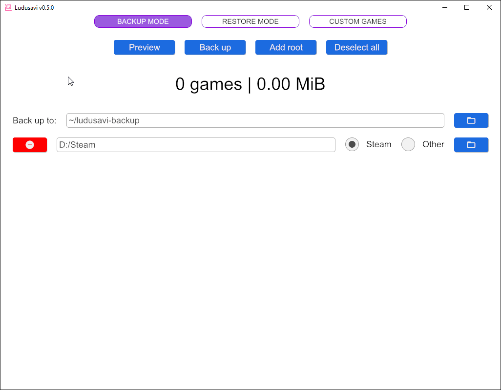

[Ludusavi] is a tool written in Rust by [@mtkennerly] for backing up PC game
save data. It has backup info for more than 7,000 games, is cross-platform for
Windows, Linux, and Mac, and has a GUI as well as a command line interface.
The GUI was created using the [Iced] crate.

The [backup info] is sourced from [PCGamingWiki] so that everyone can help to
expand the data, and it's stored in a documented format so that other backup
tools can share the same data set. A [plugin] for [Playnite] was also just
released.

[Ludusavi]: https://github.com/mtkennerly/ludusavi
[@mtkennerly]: https://twitter.com/mtkennerly
[Iced]: https://crates.io/crates/iced
[backup info]: https://github.com/mtkennerly/ludusavi-manifest
[PCGamingWiki]: https://www.pcgamingwiki.com/wiki/Home
[plugin]: https://github.com/mtkennerly/ludusavi-playnite
[Playnite]: https://playnite.link

### [Langcraft]

[Langcraft] is the Minecraft LLVM target you've never wanted.

Langcraft started as a dare to the `#lang-dev` channel of the Rust
Community Discord to be able to parse Rust code in Minecraft.
Naturally, it grew into a full code generator that can translate
most LLVM IR to
[Minecraft data packs](https://minecraft.gamepedia.com/Data_Pack),
the game's deliberately-limited in-game scripting language. Langcraft
is entirely language independent, so any language with an LLVM-based
compiler can (with the right API bindings) run in Minecraft. Currently
bindings to both C and Rust exist. While not as visually impressive as
a redstone computer, Langcraft does stretch the bounds of the game quite
a bit, using jukeboxes for memory, armor stands to represent pointers,
and rearranging compiled code to make it run in the bounds of the data
packs' fixed instruction limit.

This is all, naturally, entirely useless. The project is also still
heavily work-in-progress and does not pretend to be stable, but it is
usable. A handwritten interpreter for a Rust-like language has already
been demonstrated running, and even more complex projects like [CHIP-8
emulators](https://github.com/Dhole/chip8-rs.git) function (albeit at
extremely slow speed).

You can watch a [video of Rust interpreter running Fizzbuzz][langcraft-video]:

[][langcraft-video]

[Langcraft]: https://github.com/SuperTails/langcraft
[langcraft-video]: https://youtube.com/watch?v=Cx0w5Wn9pPU

<!-- ## Popular Workgroup Issues in Github -->

## Meeting Minutes

<!-- Up to 10 most important notes + a link to the full details -->

[See all meeting issues][label-meeting] including full text notes
or [join the next meeting][join].

[label-meeting]: https://github.com/rust-gamedev/wg/issues?q=label%3Ameeting

## Requests for Contribution

<!-- Links to "good first issue"-labels or direct links to specific tasks -->

- [Embark's open issues][embark-open-issues] ([embark.rs]);
- [winit's "Good first issue" and “help wanted” issues][winit-issues];
- [gfx-rs's "contributor-friendly" issues][gfx-issues];
- [wgpu's "help wanted" issues][wgpu-help-wanted];
- [luminance's "low hanging fruit" issues][luminance-fruits];
- [ggez's "good first issue" issues][ggez-issues];
- [Veloren's "beginner" issues][veloren-beginner];
- [Amethyst's "good first issue" issues][amethyst-issues];
- [A/B Street's "good first issue" issues][abstreet-issues];
- [Mun's "good first issue" issues][mun-issues];

[embark.rs]: https://embark.rs
[embark-open-issues]: https://github.com/search?q=user:EmbarkStudios+state:open
[winit-issues]: https://github.com/rust-windowing/winit/issues?utf8=✓&q=is%3Aissue+is%3Aopen+label%3A%22status%3A+help+wanted%22+label%3A%22Good+first+issue%22
[gfx-issues]: https://github.com/gfx-rs/gfx/issues?q=is%3Aissue+is%3Aopen+label%3Acontributor-friendly
[wgpu-help-wanted]: https://github.com/gfx-rs/wgpu-rs/issues?q=is%3Aissue+is%3Aopen+label%3A%22help+wanted%22
[luminance-fruits]: https://github.com/phaazon/luminance-rs/issues?q=is%3Aissue+is%3Aopen+label%3A%22low+hanging+fruit%22
[ggez-issues]: https://github.com/ggez/ggez/labels/%2AGOOD%20FIRST%20ISSUE%2A
[veloren-beginner]: https://gitlab.com/veloren/veloren/issues?label_name=beginner
[amethyst-issues]: https://github.com/amethyst/amethyst/issues?q=is%3Aissue+is%3Aopen+label%3A%22good+first+issue%22
[abstreet-issues]: https://github.com/dabreegster/abstreet/issues?q=is%3Aissue+is%3Aopen+label%3A%22good+first+issue%22
[mun-issues]: https://github.com/mun-lang/mun/labels/good%20first%20issue

## Jobs

<!-- An optional section for new jobs related to Rust gamedev -->

- [Embark] is looking to hire Open Source Engineer
  specifically to work on Rust projects (Remote or Stockholm, Sweden):

  > At Embark, we love the openness and collaborative nature
  > of the quickly growing ecosystem and community around Rust,
  > including its tens of thousands of open source crates.
  > We're committed to supporting a thriving open source ecosystem
  > for game development in Rust.
  >
  > As an Open Source Engineer at Embark, you will work with our community
  > and engineering teams on open source.
  > You'll help maintain and develop our open source presence,
  > and be a key link between Embark and the greater software ecosystem.

  You can find all of the details on their [job offer page][embark-job].

  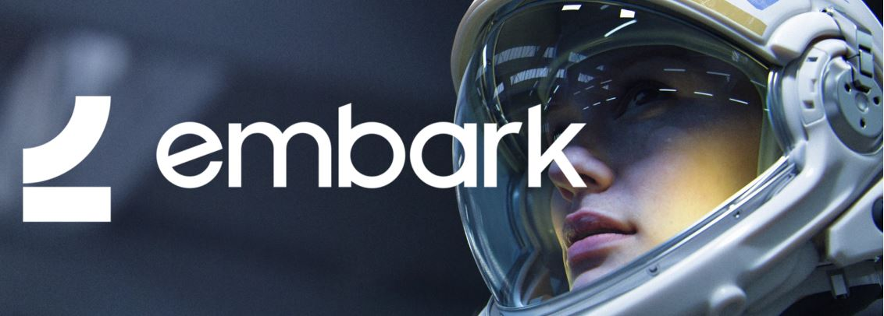

[Embark]: https://www.embark-studios.com
[embark-job]: https://www.embark-studios.com/jobs/910166-open-source-engineer

## Bonus

<!-- Bonus section to make the newsletter more interesting
and highlight events from the past. -->

Just an interesting Rust gamedev link from the past. :)

[][shar-trailer]

^ _Click to watch [SHAR's Greenlight trailer][shar-trailer]_

[SHAR][shar-itch] (Russian "Шар" - ball) by [@fedor_games] (author of [miniquad]/[macroquad])
is a 3rd-person online action game that aims to create unique experience
combining destructible world and team-based ball game.

> SHAR is an action combination of tactical and sports game in the destructible world.
> The rules are extremely simple: two teams, one ball.
> The team that carries the ball into the opponent's gates gets a score,
> the team with the most score at the end of the game is the winner.
> However, this is where things get interesting!
> Players have the variety of skills and tricks and destructible environment
> to fiddle around to slam the opponent and win the game.

Some of the game's features:

- bulletrs-powered network-synchronized physics engine;
- A bunch of physics-based player skills;
- Extensive build-in editors for game maps, skeletal animation,
  effects & particle systems;
- Modding support.

The game was build on top of a home grown game engine using:
winit, glium, imgui-rs, [tinyecs], [awesomium-rs], imgui-rs, [ears].

[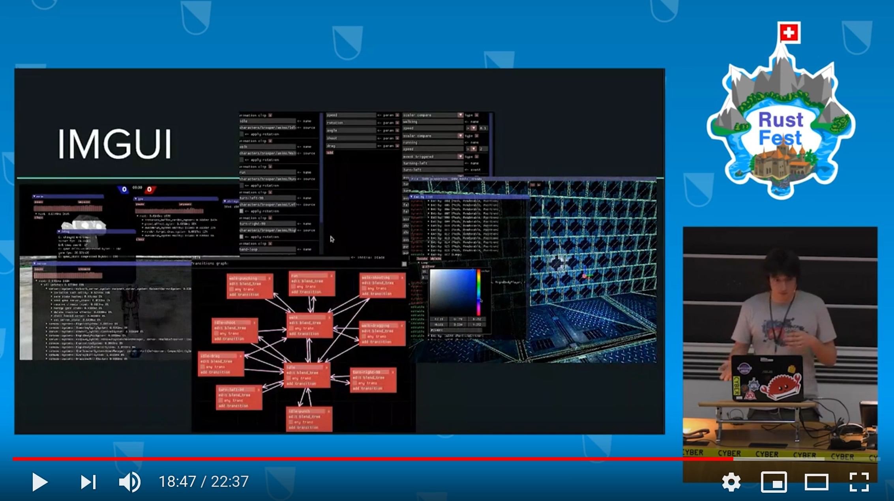][shar-talk]

During RustFest Zurich 2017, Fedor gave a self-descriptive talk
"SHAR: Rust's gamedev experience".
You can [watch the recording here][shar-talk].

The game was in active development around 2016-2017.
In 2017 the game [passed Steam Greenlight][shar-greenlight].
During 2018 [the project was suspended][shar-death].

[shar-itch]: https://fedorgames.itch.io/shar
[@fedor_games]: https://twitter.com/fedor_games
[shar-trailer]: https://youtube.com/watch?v=OVYQs3KY2EE
[shar-death]: https://fedorgames.itch.io/shar/devlog/52720/time-to-move-on
[shar-greenlight]: https://steamcommunity.com/sharedfiles/filedetails/?id=868228143
[shar-talk]: https://youtube.com/watch?v=nXR8f4r6ggM
[macroquad]: https://github.com/not-fl3/macroquad
[tinyecs]: https://github.com/not-fl3/tinyecs
[awesomium-rs]: https://github.com/not-fl3/awesomium-rs
[ears]: https://github.com/nickbrowne/ears

------

That's all news for today, thanks for reading!

Subscribe to [@rust_gamedev on Twitter][@rust_gamedev]
or [/r/rust_gamedev subreddit][/r/rust_gamedev] if you want to receive fresh news!

<!--
TODO: Add real links and un-comment once this post is published
**Discussions of this post**:
[/r/rust](TODO),
[twitter](TODO).
-->

[/r/rust_gamedev]: https://reddit.com/r/rust_gamedev
[@rust_gamedev]: https://twitter.com/rust_gamedev
