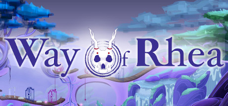
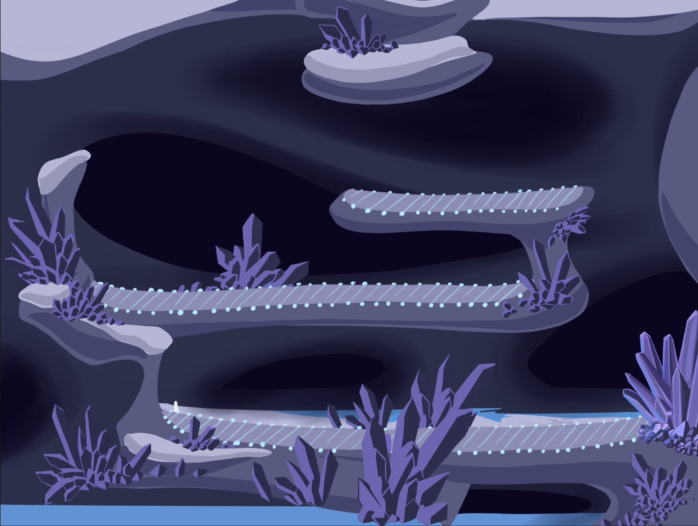
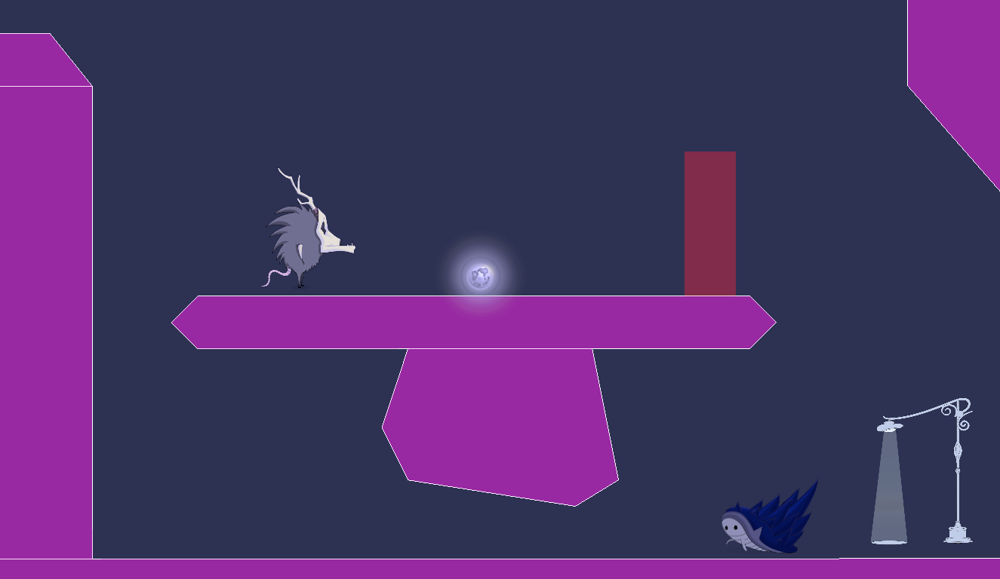
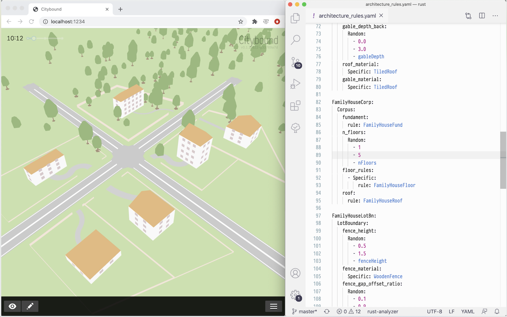
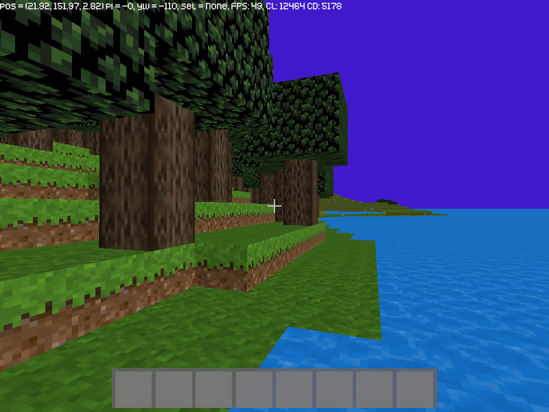
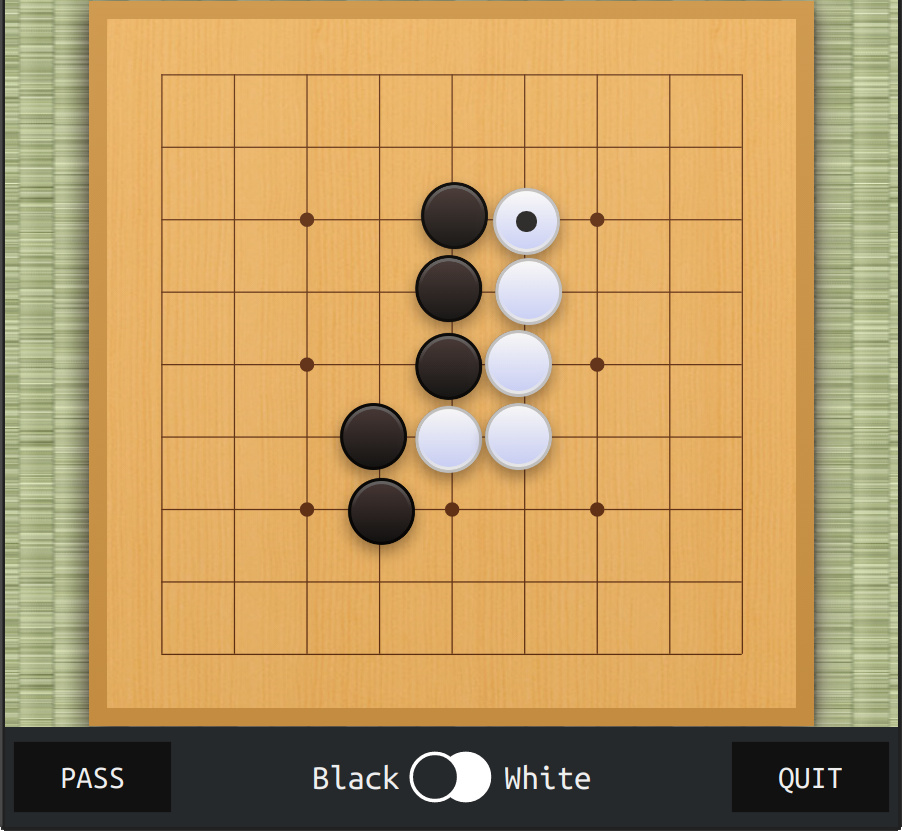
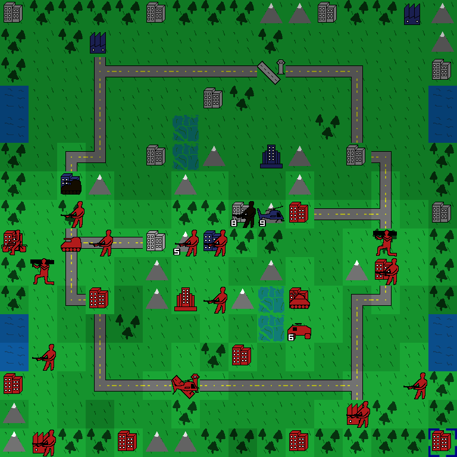
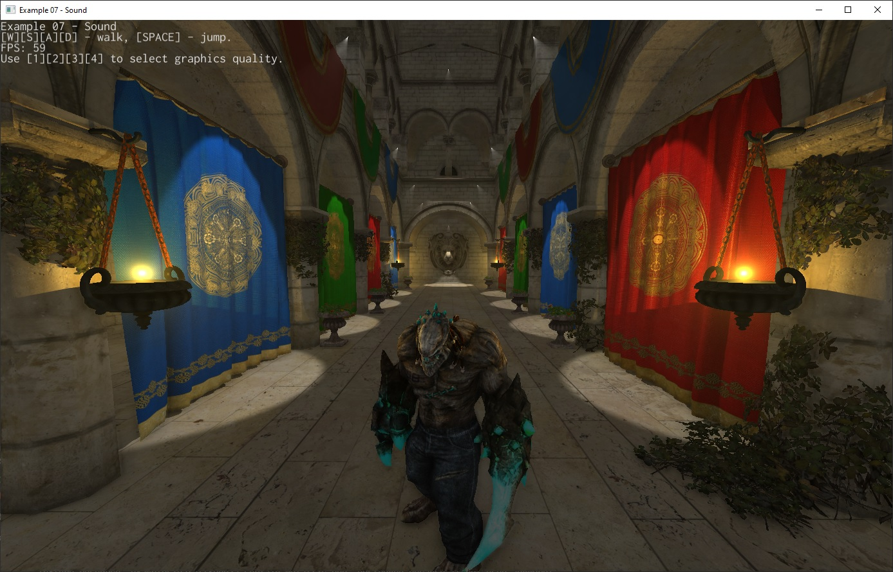
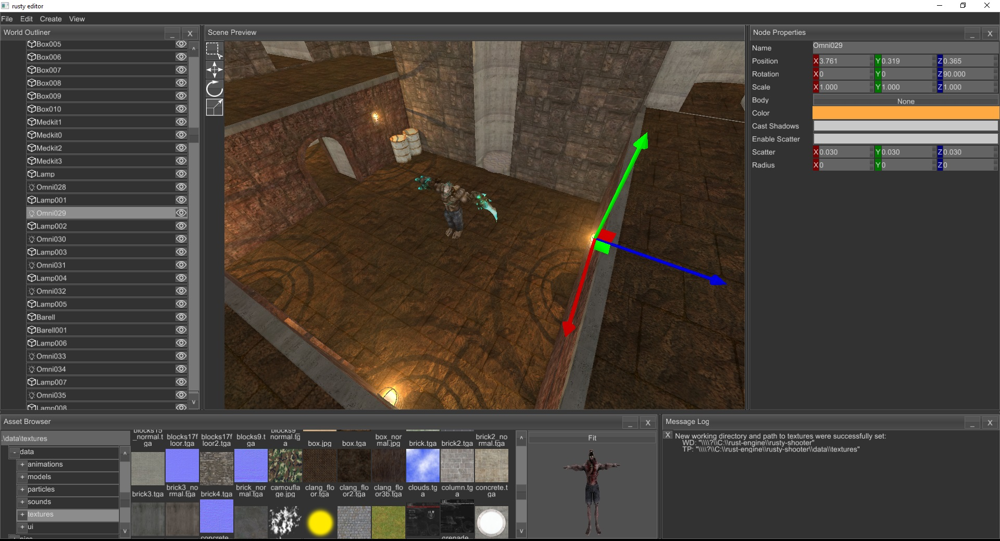

+++
title = "This Month in Rust GameDev #14 - September 2020"
date = 2020-10-05
transparent = true
draft = true
+++

Welcome to the 14th issue of the Rust GameDev Workgroup's
monthly newsletter.
[Rust] is a systems language pursuing the trifecta:
safety, concurrency, and speed.
These goals are well-aligned with game development.
We hope to build an inviting ecosystem for anyone wishing
to use Rust in their development process!
Want to get involved? [Join the Rust GameDev working group!][join]

You can follow the newsletter creation process
by watching [the coordination issues][coordination].
Want something mentioned in the next newsletter?
[Send us a pull request][pr].
Feel free to send PRs about your own projects!

[Rust]: https://rust-lang.org
[join]: https://github.com/rust-gamedev/wg#join-the-fun
[pr]: https://github.com/rust-gamedev/rust-gamedev.github.io
[coordination]: https://github.com/rust-gamedev/rust-gamedev.github.io/issues?q=label%3Acoordination

Table of contents:

- [Game Updates](#game-updates)
- [Learning Material Updates](#learning-material-updates)
- [Library & Tooling Updates](#library-tooling-updates)
- [Popular Workgroup Issues in Github](#popular-workgroup-issues-in-github)
- [Requests for Contribution](#requests-for-contribution)
- [Jobs](#jobs)
- [Bonus](#bonus)

<!--
Ideal section structure is:

```
### [Title]


_image caption_

A paragraph or two with a summary and [useful links].

_Discussions:
[/r/rust](https://reddit.com/r/rust/todo),
[twitter](https://twitter.com/todo/status/123456)_

[Title]: https://first.link
[useful links]: https://other.link
```

Discussion links are added only if they contain
some actual interesting discussions.

If needed, a section can be split into subsections with a "------" delimiter.
-->

## Game Updates

### [A/B Street][abstreet]


[A/B Street][abstreet] is a traffic simulation game exploring how small changes
to roads affect cyclists, transit users, pedestrians, and drivers. Any city
with OpenStreetMap coverage can be used!

Some of this month's updates:

- finished support for driving on the left side of the road;
- isometric buildings and support for textures by [Michael][mkirk];
- a flurry of major UI updates, thanks to the return of the project's UX
  designer;
- an option to disable parking simulation, to workaround missing data.
- alleyways imported from OSM;
- more realistic traffic signal timing constraints, thanks to
  [Sam][NoSuchThingAsRandom], a new contributor.

[abstreet]: https://abstreet.org
[mkirk]: https://github.com/michaelkirk
[NoSuchThingAsRandom]: https://github.com/NoSuchThingAsRandom/

### [Way of Rhea]

[][Way of Rhea]

[Way of Rhea] is a puzzle platformer that takes place in a world where you can
only interact with items that match your current color.
Changes since the last update:

- The circuit level has been reworked:
  it's now split into three different levels
  and the puzzles are better tutorialized, and there are more of them.
- A tiny amount of screen shake was added to the game.
- Work has begun on a couple of new levels for the ice biome:

  

  In this biome, you have to learn to predict the behavior of these little
  crabs to solve the puzzles:

  

Follow [@AnthropicSt] or [@masonremaley] on Twitter or
[sign up for the mailing list][anthropic-newsletter] for updates.

[Way of Rhea]: https://store.steampowered.com/app/1110620/Way_of_Rhea/
[@AnthropicSt]: https://twitter.com/anthropicst
[@masonremaley]: https://twitter.com/masonremaley
[anthropic-newsletter]: https://www.anthropicstudios.com/newsletter/signup/tech

### [Citybound]



[Citybound] is a city simulation and city building game. This month,
[Anselm Eickhoff] published [a small demo] of his domain specific language
for procedural architecture, which is interpreted by Rust and now supports
hot-code reload of building rules in the running game.

[Citybound]: https://aeplay.org/citybound
[Anselm Eickhoff]: https://twitter.com/ae_play
[a small demo]: https://reddit.com/r/Citybound/comments/j2xg2s/sneak_peek_custom_procedural_architecture

### [Mimas]



[Mimas] is a WIP voxel engine and game, inspired by Minetest and Minecraft.
It's been in development since almost 2 years, and has recently seen a public
prototype release 0.4.0.

Several of the features that have already been implemented as of Oct 1st:

- Procedural map generation with hilly landscape, trees, flowers, water and caves
- Map manipulation (removal/addition of blocks)
- Crafting
- Chests
- Textures (taken from the Minetest project, under CC-BY-SA license)
- Tools
- QUIC based network protocol with SRP based authentication
- Multiplayer: chat, (hardcoded) avatars
- Ability to add custom content (e.g. blocks) using a toml format

Imgur screenshot [gallery].

[Mimas]: https://github.com/est31/mimas
[gallery]: https://imgur.com/a/vvo7len

### pGLOWrpg


The [@pGLOWrpg] (Procedurally Generated Living Open World RPG) is a long-term
project in development by [@Roal_Yr], which aims to be a text-based game with
maximum portability and accessibility and focus on interactions and emergent
narrative.

The pGLOWrpg meets its first official anniversary on September the 15th
and goes public at [pGLOWrpg repo]!

For the past month the main focus of the development was on:

- Improving the UI.
- Major refactoring.
- Unification of I/O means.
- Making things ready for publication.

Main features of reported version are:

- Ability to generate one or many worlds from customizable presets.
- Ability to have output in both raw (b/w .png) and colorized images.
- Generated data is as follows: terrain, watermask, biomes, rivers, geological regions,
  rainfall and temperature.

For main feature reports and dev blogs follow [@pGLOWrpg] on Twitter.

[@Roal_Yr]: https://twitter.com/Roal_Yr
[@pGLOWrpg]: https://twitter.com/pglowrpg
[pGLOWrpg repo]: https://github.com/roalyr/pglowrpg

### Oh no, Lava!


"Oh no, Lava!" by [@captainfleppo] is the working title
of a platforming game which take inspiration
from an old iOS game created back in 2014. The game is running with [Bevy][bevy]
as its core. The gameplay isn't there yet, but you as a player need to jump on
furnitures, collect coins and fight lava/fire based enemies with your water gun.

[@captainfleppo]: https://twitter.com/captainfleppo
[bevy]: https://bevyengine.org

### [BUGOUT]


_Playing KataGo AI in 9x9_

[BUGOUT] is a web application which allows you to play Go/Baduk/Weiqi
against a leading AI ([KataGo]).
It provides a multiplayer mode so that you can play other humans,
either by joining a public queue or sharing a private URL to your friend.

The user interface is lifted from [Sabaki].

The initial installation's AI is powered by an energy-efficient
[dev board][nv-devboard].

BUGOUT is marching actively toward production, at which point the
team will publish the website address and invite users.
The author anticipates being finished with the production release
prior to Jan 1, 2021.

[BUGOUT]: https://github.com/Terkwood/BUGOUT
[KataGo]: https://github.com/lightvector/KataGo
[Sabaki]: https://github.com/SabakiHQ/Sabaki
[nv-devboard]: https://developer.nvidia.com/embedded/jetson-nano-developer-kit

### Project YAWC



Project YAWC is an in-progress Advance-Wars style strategy game being developed
by junkmail using [ggez] as a framework. The game is currently in a closed alpha
state with working netplay. September saw the release of version A2, including
revamped netcode and the full core set of units.

[ggez]: https://ggez.rs/

## Learning Material Updates

### [OpenGL Preprocessor for Rust]

With the full power of Cargo build scripts and [Tera], you can create an advanced
GLSL preprocessor which can generate code conditionally, in loops, and even
inherit code from other templates.


Writing plain GLSL code is uncomfortable, code is quite often is duplicated, libraries
aren't something natural for GLSL (means you can't out of the box do #include "library.glsl").
The last point is especially problematic if some constants actually originate in
your game logic (like the number of player types). Updating these values manually
in your shader code is repetitive and prone to both error and simple forgetfulness.
It's really helpful to build some kind of preprocessor for your GLSL code,
which can include other files, so you can organize your code into manageable chunks.
With the power of [Tera], it's now easy to accomplish.
Because Rust is also often used for web projects, which need a lot of templated
web-pages preprocessing, we can borrow such technology for our needs,
combine it with cargo build scripts and create a compile-time preprocessing tool.

[tera]: https://tera.netlify.app
[OpenGL Preprocessor for Rust]: https://codecrash.me/an-opengl-preprocessor-for-rust

### Rust, Gamedev, ECS, and Bevy


[@hugopeixoto] released a couple of blog posts on ECS and Bevy,
including a tutorial on how to get started.

- The [first part][hugopeixoto-p1] gives us an in depth overview of what ECS.
  It starts with pseudocode for an object oriented approach
  and goes through several iterations until we get to the ECS paradigm.

- The [second part][hugopeixoto-p2] is a tutorial on how to use [bevy],
  a data driven game engine built in Rust.
  It goes over the basic features of the engine,
  using the example presented in the first part.

[@hugopeixoto]: https://twitter.com/hugopeixoto
[hugopeixoto-p1]: https://hugopeixoto.net/articles/rust-gamedev-ecs-bevy.html
[hugopeixoto-p2]: https://hugopeixoto.net/articles/rust-gamedev-ecs-bevy-p2.html
[bevy]: https://bevyengine.org

## Library & Tooling Updates

### [Thunderdome]

[Thunderdome] is a ~~gladitorial~~ generational arena library inspired by
[generational-arena], [slotmap], and [slab]. It provides constant time
insertion, lookup, and removal via small (8 byte) keys that stay 8 bytes when
wrapped in `Option<T>`.

Data structures like Thunderdome's `Arena` store values and return keys that can
be later used to access those values. These keys are stable across removals and
have a generation counter to solve the [ABA Problem].

```rust
let mut arena = Arena::new();

let foo = arena.insert("Foo");
let bar = arena.insert("Bar");

assert_eq!(arena[foo], "Foo");
assert_eq!(arena[bar], "Bar");

arena[bar] = "Replaced";
assert_eq!(arena[bar], "Replaced");

let foo_value = arena.remove(foo);
assert_eq!(foo_value, Some("Foo"));

// The slot previously used by foo will be reused for baz.
let baz = arena.insert("Baz");
assert_eq!(arena[baz], "Baz");

// foo is no longer a valid key.
assert_eq!(arena.get(foo), None);
```

_Discussions:
[twitter](https://twitter.com/LPGhatguy/status/1303375906493276160)_

[Thunderdome]: https://github.com/LPGhatguy/thunderdome
[generational-arena]: https://crates.io/crates/generational-arena
[slotmap]: https://crates.io/crates/slotmap
[slab]: https://crates.io/crates/slab
[ABA Problem]: https://en.wikipedia.org/wiki/ABA_problem

### [This Month in Mun][mun-september]

[][Mun]

[Mun] is a scripting language for gamedev focused on quick iteration times
that is written in Rust.

[September updates][mun-september] include:

- on-going work for multi-file projects;
- build pipeline improvements;
- bug fixes in the Mun compiler and C++ bindings;
- a lot of refactors and quality of life improvements.

[Mun]: https://mun-lang.org
[mun-september]: https://mun-lang.org/blog/2020/10/01/this-month-september/

### [audir]

[audir] is a low level audio library supporting Windows (WASAPI), Linux (Pulse)
and Android (OpenSLES & AAudio).

It aims at provide a minimal and mostly unsafe but feature-rich API on top of
common audio backends with focus on gaming applications. The initial release
version 0.1.0 provides basic recording and playback support for all available
backends, including a small music player example!

Currently looking into coupling with [dasp] for dsp audio graphs to provide
a higher level entry point.

[audir]: https://github.com/norse-rs/audir
[dasp]: https://github.com/RustAudio/dasp

### [Crevice]

[Crevice] is a library that helps define GLSL-compatible (std140) structs for
use in uniform and storage buffers. It uses new `const fn` capabilities
stabilized in [Rust 1.46.0] to align types with explicitly zeroed padding.

Crevice depends heavily on [mint] to support almost any Rust math library. It
also contains helpers for safely sizing and writing buffers, making dynamic
buffer layout a breeze.

```rust
#[derive(AsStd140)]
struct MainUniform {
    orientation: mint::ColumnMatrix3<f32>,
    position: mint::Vector3<f32>,
    scale: f32,
}

let value = MainUniform {
    orientation: cgmath::Matrix3::identity().into(),
    position: [1.0, 2.0, 3.0].into(),
    scale: 4.0,
};

upload_data_to_gpu(value.as_std140().as_bytes());
```

_Discussions:
[twitter](https://twitter.com/LPGhatguy/status/1308499131212599296)_

[Crevice]: https://github.com/LPGhatguy/crevice
[Rust 1.46.0]: https://blog.rust-lang.org/2020/08/27/Rust-1.46.0.html
[mint]: https://github.com/kvark/mint

### [FemtoVG]


[FemtoVG] is a 2D canvas API in Rust, based on [nanovg].

Currently, FemtoVG uses OpenGL as a rendering backend. A Metal backend is 95%
done, and a wgpu backend is on the roadmap. The project is definitely looking
for contributors.

Unlike NanoVG, FemtoVG has full text-shaping support thanks to harfbuzz.

FemtoVG, just like the original NanoVG, is based on the _stencil-then-cover_
approach presented in [GPU-accelerated Path Rendering][gpupathrender.pdf].

Join the [Discord channel](https://discord.gg/V69VdVu)
or follow [FemtoVG on twitter](https://twitter.com/femtovg).

[FemtoVG]: https://github.com/femtovg/femtovg
[nanovg]: https://github.com/memononen/nanovg
[gpupathrender.pdf]: https://github.com/femtovg/femtovg/blob/master/assets/gpupathrender.pdf

### [gfx-rs] and [gfx-portability]


[gfx-portability] is a Vulkan portability implementation based on [gfx-rs].
It's basically a drop-in implementation of Vulkan on top of Metal and D3D12,
useful on platforms that don't have native Vulkan support, or buggy drivers.

It released version [0.8.1](https://github.com/gfx-rs/portability/releases/tag/0.8.1)
with official support for the new [KHR portability extension][khr-portability],
as well as a few other extensions, plus a number of correctness fixes.

gfx-rs team asks Rust users of Vulkano, Ash, and other Vulkan-only wrappers to try
out the gfx-portability as a solution on macOS and relevant Windows 10 platforms.

In [gfx-rs] itself, the DX12 backend, and the descriptor indexing feature support
got improved. There has been a push to get DX11 backend in a solid shape,
and it can now run [vange-rs] pretty well 🎉.

[gfx-rs]: https://github.com/gfx-rs/gfx
[gfx-portability]: https://github.com/gfx-rs/portability
[khr-portability]: https://www.khronos.org/registry/vulkan/specs/1.2-extensions/man/html/VK_KHR_portability_subset.html
[vange-rs]: https://github.com/kvark/vange-rs

### [Riddle]

[Riddle] is a Rust media library in the vein of SDL,
building as far as possible on the most active/standard Rust libraries
(winit, wgpu, image, etc). Riddle is deliberately not an engine, or a framework.
It is a library devoted to exposing media related features in a unified way while
avoiding prescribing program structure. It provides abstractions over windowing,
input, audio, image loading/manipulation and provides a basic wgpu based 2D
renderer.
The [docs][riddle-docs] contain runnable examples for most methods and types.

The goal is to provide a stable foundation, resillient to developments in the Rust
gamedev ecosystem, on which games, custom engines, and other media applications can
be built.

_Discussions:
[/r/rust_gamedev](https://reddit.com/r/rust_gamedev/comments/j0xa3s/riddle_010)_

[Riddle]: https://github.com/vickles/riddle
[riddle-docs]: https://vickles.github.io/riddle/0.1.0/riddle

### Tetra

[Tetra] is a simple 2D game framework, inspired by XNA and Raylib. This month,
version [0.5][tetra-05] was released, featuring:

- Cargo feature flags, allowing you to remove unused functionality and
  shrink your build
- Relative mouse events and infinite mouse movement (allowing for FPS-style
  control schemes)
- Extra methods for getting and setting the state of a playing sound

For full details and a list of breaking changes, see the [changelog][tetra-changelog].

Additionally, this month [puppetmaster] released [tetrapack], a set of useful
extensions for Tetra. This includes:

- Helpful timer types
- Looping background music
- Custom mouse cursors
- Input utility functions
- Tilemaps and tile animations

[tetra]: https://github.com/17cupsofcoffee/tetra
[tetra-05]: https://twitter.com/17cupsofcoffee/status/1301210538299609088
[tetra-changelog]: https://github.com/17cupsofcoffee/tetra/blob/main/CHANGELOG.md
[puppetmaster]: https://github.com/puppetmaster-
[tetrapack]: https://github.com/puppetmaster-/tetrapack

### [rg3d][rg3d]

[][rg3d_twitter]
_Click to watch a [video demo of one of the new examples][rg3d_twitter]._

[rg3d] is a game engine that aims to be easy to use and provide large set
of out-of-box features. Some of the recent updates:

- Render to texture - it is possible to render scenes into textures.
- Added support for scenes made in [rusty-editor].
- Added sprite graph node.
- Added simple lightmapper (still WIP).
- Added new UI widgets and features:
  - Message box - classic message box with different combinations of buttons.
  - Wrap panel - arranges its children by rows or columns with wrapping.
  - File browser - a browser for file system.
  - Color picker - classic HSV+RGB+Alpha color picker.
  - "Bring into view" for scroll panel.
  - Replaced font rasterizer by fontdue.
  - Improved hotkeys in text box.
- Improved performance and documentation.

[rg3d]: https://github.com/mrDIMAS/rg3d
[rg3d_twitter]: https://twitter.com/DmitryS36934349/status/1312836831390687232

### [rusty-editor]



[rusty-editor] is a scene editor for the [rg3d] engine.
Some of the recently added features:

- asset browser + asset previewer,
- multiselection,
- improved properties editor,
- lots of other small improvements and fixes.

[rusty-editor]: https://github.com/mrDIMAS/rusty-editor

## Popular Workgroup Issues in Github

## Requests for Contribution

<!-- Links to "good first issue"-labels or direct links to specific tasks -->

- [Embark's open issues][embark-open-issues] ([embark.rs]).
- [winit's "Good first issue" and “help wanted” issues][winit-issues].
- [gfx-rs's "contributor-friendly" issues][gfx-issues].
- [wgpu's "help wanted" issues][wgpu-help-wanted].
- [luminance's "low hanging fruit" issues][luminance-fruits].
- [ggez's "good first issue" issues][ggez-issues].
- [Veloren's "beginner" issues][veloren-beginner].
- [Amethyst's "good first issue" issues][amethyst-issues].
- [A/B Street's "good first issue" issues][abstreet-issues].
- [Mun's "good first issue" issues][mun-issues].
- [SIMple Mechanic's good first issues][simm-issues].
- [Bevy's "good first issue" issues][bevy-issues].

[embark.rs]: https://embark.rs
[embark-open-issues]: https://github.com/search?q=user:EmbarkStudios+state:open
[winit-issues]: https://github.com/rust-windowing/winit/issues?utf8=✓&q=is%3Aissue+is%3Aopen+label%3A%22status%3A+help+wanted%22+label%3A%22Good+first+issue%22
[gfx-issues]: https://github.com/gfx-rs/gfx/issues?q=is%3Aissue+is%3Aopen+label%3Acontributor-friendly
[wgpu-help-wanted]: https://github.com/gfx-rs/wgpu-rs/issues?q=is%3Aissue+is%3Aopen+label%3A%22help+wanted%22
[luminance-fruits]: https://github.com/phaazon/luminance-rs/issues?q=is%3Aissue+is%3Aopen+label%3A%22low+hanging+fruit%22
[ggez-issues]: https://github.com/ggez/ggez/labels/%2AGOOD%20FIRST%20ISSUE%2A
[veloren-beginner]: https://gitlab.com/veloren/veloren/issues?label_name=beginner
[amethyst-issues]: https://github.com/amethyst/amethyst/issues?q=is%3Aissue+is%3Aopen+label%3A%22good+first+issue%22
[abstreet-issues]: https://github.com/dabreegster/abstreet/issues?q=is%3Aissue+is%3Aopen+label%3A%22good+first+issue%22
[mun-issues]: https://github.com/mun-lang/mun/labels/good%20first%20issue
[simm-issues]: https://github.com/mkhan45/SIMple-Mechanics/labels/good%20first%20issue
[bevy-issues]: https://github.com/bevyengine/bevy/labels/good%20first%20issue

## Jobs

<!-- An optional section for new jobs related to Rust gamedev -->

## Bonus

<!-- Bonus section to make the newsletter more interesting
and highlight events from the past. -->

------

That's all news for today, thanks for reading!

Subscribe to [@rust_gamedev on Twitter][@rust_gamedev]
or [/r/rust_gamedev subreddit][/r/rust_gamedev] if you want to receive fresh news!

<!--
TODO: Add real links and un-comment once this post is published
**Discussions of this post**:
[/r/rust](TODO),
[twitter](TODO).
-->

[/r/rust_gamedev]: https://reddit.com/r/rust_gamedev
[@rust_gamedev]: https://twitter.com/rust_gamedev
