+++
title = "This Month in Rust GameDev #14 - September 2020"
date = 2020-10-07
transparent = true
+++

Welcome to the 14th issue of the Rust GameDev Workgroup's
monthly newsletter.
[Rust] is a systems language pursuing the trifecta:
safety, concurrency, and speed.
These goals are well-aligned with game development.
We hope to build an inviting ecosystem for anyone wishing
to use Rust in their development process!
Want to get involved? [Join the Rust GameDev working group!][join]

You can follow the newsletter creation process
by watching [the coordination issues][coordination].
Want something mentioned in the next newsletter?
[Send us a pull request][pr].
Feel free to send PRs about your own projects!

[Rust]: https://rust-lang.org
[join]: https://github.com/rust-gamedev/wg#join-the-fun
[pr]: https://github.com/rust-gamedev/rust-gamedev.github.io
[coordination]: https://github.com/rust-gamedev/rust-gamedev.github.io/issues?q=label%3Acoordination

Table of contents:

- [Game Updates](#game-updates)
- [Learning Material Updates](#learning-material-updates)
- [Library & Tooling Updates](#library-tooling-updates)
- [Popular Workgroup Issues in Github](#popular-workgroup-issues-in-github)
- [Requests for Contribution](#requests-for-contribution)

<!--
Ideal section structure is:

```
### [Title]


_image caption_

A paragraph or two with a summary and [useful links].

_Discussions:
[/r/rust](https://reddit.com/r/rust/todo),
[twitter](https://twitter.com/todo/status/123456)_

[Title]: https://first.link
[useful links]: https://other.link
```

Discussion links are added only if they contain
some actual interesting discussions.

If needed, a section can be split into subsections with a "------" delimiter.
-->

## Game Updates

### [Veloren][veloren]

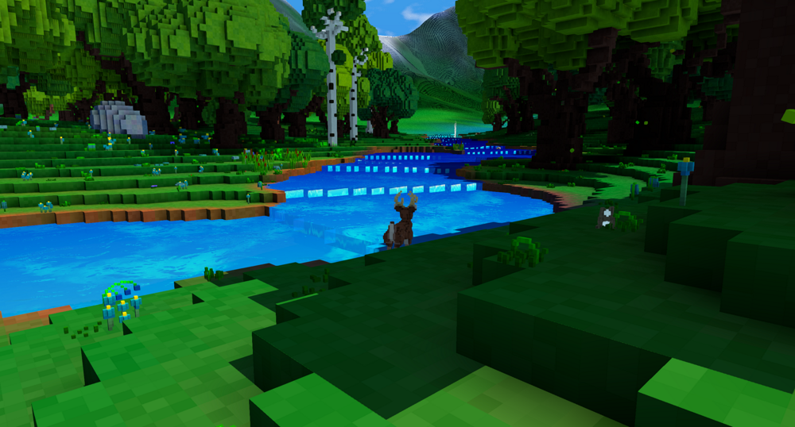
_Deer by the riverside_

[Veloren][veloren] is an open world, open-source voxel RPG inspired by Dwarf
Fortress and Cube World.

In September, Veloren hit 5000 commits to the main repo! A privilege escalation
bug was found in the game. It was quickly patched, and a PSA was sent out to
notify server owners of its presence. A Discord bot was created to help manage a
testing server. Airshipper, Veloren's launcher, saw the release of version
0.4.0. Lots of work is going on to improve the state of Veloren's server
infrastructure. A stress test was run with 15 players to see how smaller server
could handle running the game.

Improvements were made to the chunk compression which resulted in a ~7x memory
reduction in their storage. The settings menu has been overhauled, along with
many other elements of the UI. A stone golem boss was merged, adding a new boss
to dungeons. Work has been done on beam weapons and collisions, resulting in a
significantly improved healing sceptre.

You can read more about some specific topics from September:

- [Compilation Breakdown](https://veloren.net/devblog-84#compilation-breakdown-by-angelonfira)
- [Improved Server Metrics](https://veloren.net/devblog-85#improved-server-metrics-to-improve-server-performance-by-xmac94x)
- [PSA: Privilege Escalation bug](https://veloren.net/devblog-86#psa-privilege-escalation-bug)
- [Animation Changes](https://veloren.net/devblog-86#animation-changes-by-slipped)
- [Attack Updates](https://veloren.net/devblog-86#attack-updates-by-sam)
- [Beam Collisions](https://veloren.net/devblog-86#beam-collisions-by-sam)
- [Sceptre Rework](https://veloren.net/devblog-87#sceptre-rework-by-sam)
- [Memory Optimizations](https://veloren.net/devblog-87#memory-optimizations-by-sharp)
- [Art Blog #7](https://www.patreon.com/posts/art-blog-no-7-41635011)

September's full weekly devlogs: "This Week In Veloren...":
[#84](https://veloren.net/devblog-84),
[#85](https://veloren.net/devblog-85),
[#86](https://veloren.net/devblog-86),
[#87](https://veloren.net/devblog-87).

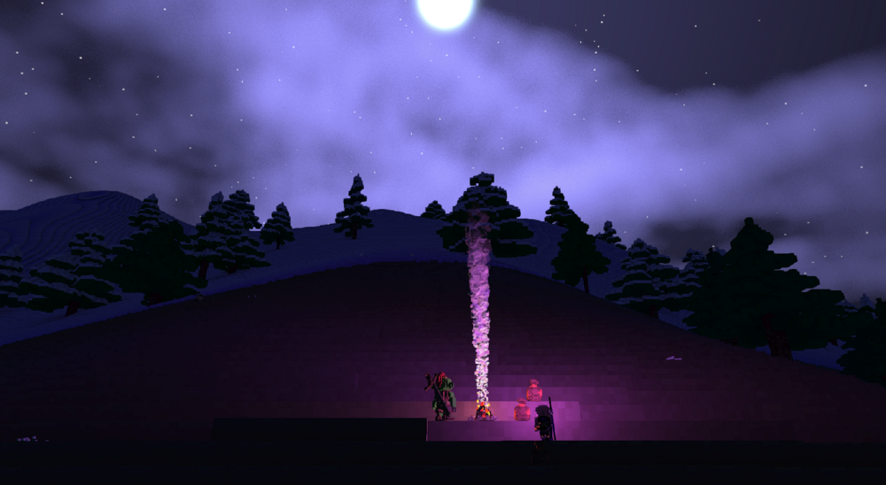
_A reprise from hunting at night_

In October, Veloren will keep pushing towards more scalable infrastructure.
Tests are happening to move towards a Kubernetes cluster to manage more
infrastructure from code. Optimizations will keep coming in as we find places to
improve. 0.8 may release sometime this month, however, the exact date is yet to
be set.

[veloren]: https://veloren.net
[veloren-interview]: https://rustgamedev.com/episodes/interview-with-team-veloren

### [A/B Street][abstreet]


[A/B Street][abstreet] is a traffic simulation game exploring how small changes
to roads affect cyclists, transit users, pedestrians, and drivers. Any city
with OpenStreetMap coverage can be used!

Some of this month's updates:

- finished support for driving on the left side of the road;
- isometric buildings and support for textures by [Michael][mkirk];
- a flurry of major UI updates, thanks to the return of the project's UX
  designer;
- an option to disable parking simulation, to workaround missing data;
- alleyways imported from OSM;
- more realistic traffic signal timing constraints, thanks to
  [Sam][NoSuchThingAsRandom], a new contributor.

[abstreet]: https://abstreet.org
[mkirk]: https://github.com/michaelkirk
[NoSuchThingAsRandom]: https://github.com/NoSuchThingAsRandom/

### [Garden][garden]

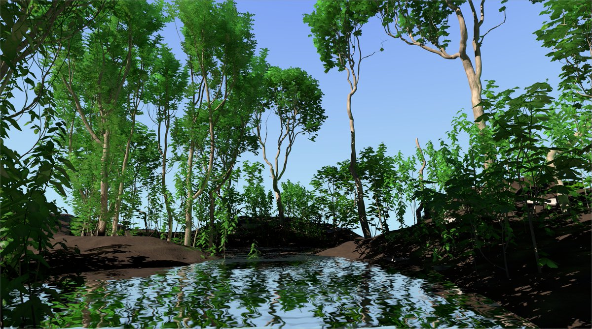

[Garden][garden] is an upcoming game centered around growing realistic plants.
Some of the updates from [the September devlog][garden-devlog]:

- The project switched to Nvidia’s PhysX from a custom physics engine.
- More accurate plant clone placement.
- Significant rendering performance improvements.
- Work on saving and loading system has begun.

[garden]: https://epcc.itch.io/garden
[garden-devlog]: https://cyberplant.xyz/posts/september/

### [galangua]

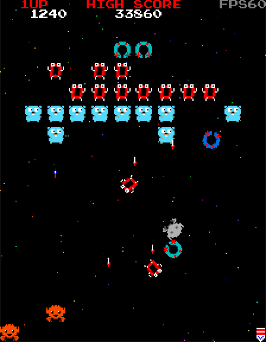

[galangua] by [@tyfkda] is a dynamic 2D shoot 'em up game,
written in Rust using SDL2.
It works on the desktop as well as in the browser.

[The source code is available here.][tetris-bane-src]

[galangua]: https://tyfkda.github.io/galangua/
[galangua-src]: https://github.com/tyfkda/galangua
[@tyfkda]: https://twitter.com/tyfkda

### [Way of Rhea]

[][Way of Rhea]

[Way of Rhea] is a puzzle platformer that takes place in a world where you can
only interact with items that match your current color.
Changes since the last update:

- The circuit level has been reworked:
  it's now split into three different levels
  and the puzzles are better tutorialized, and there are more of them.
- A tiny amount of screen shake was added to the game.
- Work has begun on a couple of new levels for the ice biome
  In this biome, you have to learn to predict the behavior of the
  crabs to solve the puzzles.

  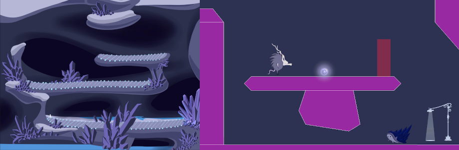

Follow [@AnthropicSt] or [@masonremaley] on Twitter or
[sign up for the mailing list][anthropic-newsletter] for updates.

[Way of Rhea]: https://store.steampowered.com/app/1110620/Way_of_Rhea/
[@AnthropicSt]: https://twitter.com/anthropicst
[@masonremaley]: https://twitter.com/masonremaley
[anthropic-newsletter]: https://www.anthropicstudios.com/newsletter/signup/tech

### [Citybound]


[Citybound] is a city simulation and city building game. This month,
[Anselm Eickhoff] published [a small demo] of his domain specific language
for procedural architecture, which is interpreted by Rust and now supports
hot-code reload of building rules in the running game.

[Citybound]: https://aeplay.org/citybound
[Anselm Eickhoff]: https://twitter.com/ae_play
[a small demo]: https://reddit.com/r/Citybound/comments/j2xg2s/sneak_peek_custom_procedural_architecture

### Recall Singularity

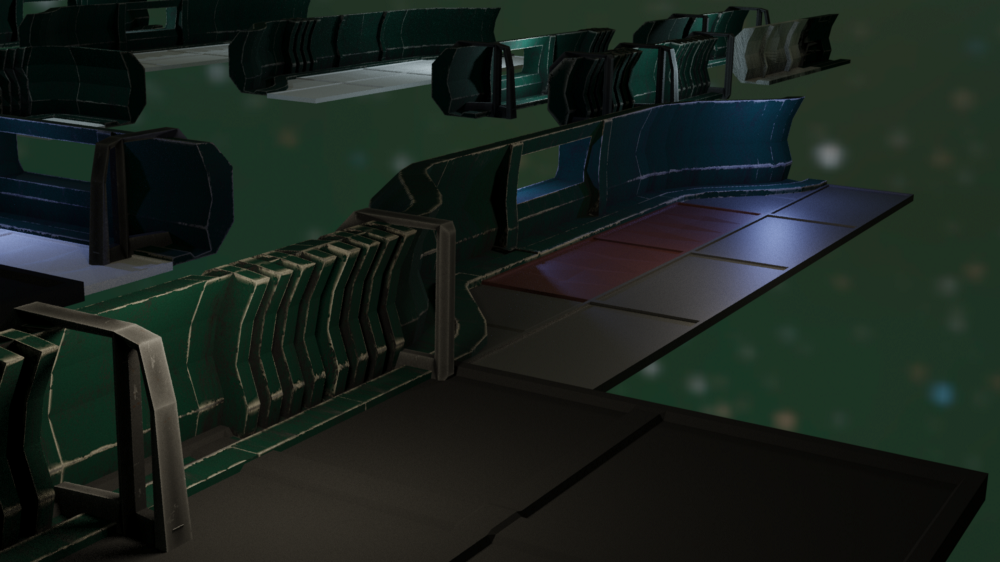
_A ray-traced selection of modules_

The Recall Singularity is a game about designing autonomous factory ships and
stations created by [Tom Leys].

This month a new devlog was posted:
["Recall Singularity in Sep 2020"][recall-s-sept-text].
You can also check out a [status update and progress video here][recall-s-sept-video].

Updates include:

- Improving the robustness of the game core and networking.
- Ship sections and standalone ships.
- Different synchronization algorithms for different game modes.

[Tom Leys]: https://twitter.com/RecallSingular1
[recall-s-sept-text]: https://medium.com/@recallsingularity/recall-singularity-in-sep-2020-e2f33a85fd7c
[recall-s-sept-video]: https://youtube.com/watch?v=kUIiU9LtOFY

### [Mimas]


[Mimas] is a WIP voxel engine and game, inspired by Minetest and Minecraft.
It's been in development for almost 2 years and has recently seen a public
prototype release 0.4.0.

Several of the urrent features:

- Procedural map generation with hilly landscape, trees, flowers, water, and caves
- Map manipulation (removal/addition of blocks)
- Crafting
- Chests
- Textures (taken from the Minetest project, under CC-BY-SA license)
- Tools
- QUIC based network protocol with SRP based authentication
- Multiplayer: chat, (hardcoded) avatars
- Ability to add custom content (e.g. blocks) using a toml format

Imgur screenshot [gallery].

[Mimas]: https://github.com/est31/mimas
[gallery]: https://imgur.com/a/vvo7len

### [Nox Futura (Rust Edition)][noxfutura]

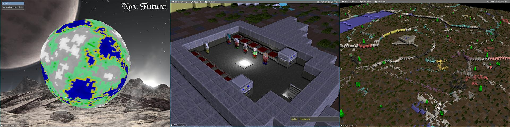

[Nox Futura][noxfutura] by [@blackfuture]
is an open-source long-term passion project,
a Dwarf-Fortress and RimWorld inspired base building game.

Some of the [recent updates][noxfutura-reddit]:

- The WGPU-based rendered is undergoing a major restructure.
- The game was updated to Legion 0.3 - it required rewriting a lot of code,
  but the new syntax sugar is a joy to use, and the backend is even faster now.
- The Greedy Voxel algorithm was significantly improved.
- OBJ models are now supported - useful for things like tree/vegetation geometry,
  which can now use a stylized low-poly graphic without the added weight
  of a bunch of cubes.
- Palette-based rendering - the output system is now constrained
  to a 256 color palette, mostly to play with stylized 3D rendering.
- New format for data files that combines multiple RON objects in one place.

[noxfutura]: https://github.com/thebracket/noxfutura
[thebracket]: https://bracketproductions.com
[noxfutura-reddit]: https://reddit.com/r/roguelikedev/comments/ivgdnj/sharing_saturday_329/g5t5lo0

### pGLOWrpg


The [@pGLOWrpg] (Procedurally Generated Living Open World RPG) is a long-term
project in development by [@Roal_Yr], which aims to be a text-based game with
maximum portability and accessibility and focus on interactions and emergent
narrative.

The pGLOWrpg meets its first official anniversary on September the 15th
and goes public at [pGLOWrpg repo]!

For the past month the main focus of the development was on:

- Improving the UI.
- Major refactoring.
- Unification of I/O means.
- Making things ready for publication.

Main features of the reported version are:

- Ability to generate one or many worlds from customizable presets.
- Ability to have output in both raw (b/w .png) and colorized images.
- Generated data is as follows: terrain, watermask, biomes, rivers, geological regions,
  rainfall, and temperature.

For main feature reports and dev blogs follow [@pGLOWrpg] on Twitter.

[@Roal_Yr]: https://twitter.com/Roal_Yr
[@pGLOWrpg]: https://twitter.com/pglowrpg
[pGLOWrpg repo]: https://github.com/roalyr/pglowrpg

### Oh no, Lava!


"Oh no, Lava!" by [@captainfleppo] is the working title
of a platforming game which take inspiration
from an old iOS game created back in 2014. The game is running with [Bevy][bevy]
as its core. The gameplay isn't there yet, but you as a player need to jump on
furnitures, collect coins, and fight lava/fire based enemies with your water gun.

[@captainfleppo]: https://twitter.com/captainfleppo
[bevy]: https://bevyengine.org

### [Zemeroth][zemeroth]

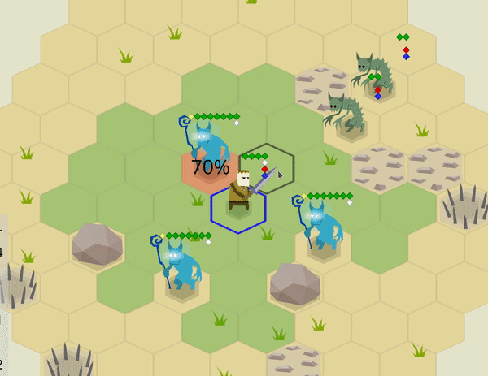
_Be careful with chained reaction attacks!_

[Zemeroth][zemeroth] by [@ozkriff] is a minimalistic 2D turn-based tactical game.
Some of the recent updates:

- The game now [stores simulated text lifetimes][zemeroth-text] for each tile
  during the event processing to reduce popup text overlapping.
- Push bombs are more useful now: they still don't cause direct damage,
  but [now they can push away other bombs too][zemeroth-bombs].
- [All the assets sources are merged into the main repository][zemeroth-assets]
  and the project now uses [resvg] instead of console Inkscape
  for svg->png rendering.
- Abilities [don't have parameters now][zemeroth-abilities].
- Dynamic depth-sorting [was implemented][zemeroth-zsort].
- The work on adding sounds continues:
  check out the [video of the first results][zemeroth-audio] 🔊.
- Smaller UI improvements and bugfixes.

[zemeroth]: https://github.com/ozkriff/zemeroth
[@ozkriff]: https://twitter.com/ozkriff
[zemeroth-bombs]: https://twitter.com/ozkriff/status/1304458740758970368
[zemeroth-abilities]: https://twitter.com/ozkriff/status/1300817277714075648
[zemeroth-assets]: https://twitter.com/ozkriff/status/1297239743269412864
[zemeroth-zsort]: https://twitter.com/ozkriff/status/1310603877507620865
[zemeroth-text]: https://twitter.com/ozkriff/status/1306651821314891776
[zemeroth-audio]: https://twitter.com/ozkriff/status/1303736184045174785
[resvg]: https://lib.rs/resvg

### [Akigi][akigi]

[Akigi][akigi] is a WIP online multiplayer game.
In September, lots of work was done on terrain sculpting systems. Another tool
was added, allowing material painting onto the terrain. Along with the scenery
placement tool, there are now three separate tools in the editor's arsenal.

Full devlogs:
[#083](https://devjournal.akigi.com/september-2020/083-2020-09-06.html),
[#084](https://devjournal.akigi.com/september-2020/084-2020-09-13.html),
[#085](https://devjournal.akigi.com/september-2020/085-2020-09-20.html),
[#086](https://devjournal.akigi.com/september-2020/086-2020-09-27.html).

[akigi]: https://akigi.com

### [BUGOUT]


_Playing KataGo AI in 9x9_

[BUGOUT] is a web application which allows you to play Go/Baduk/Weiqi
against a leading AI ([KataGo]).
It provides a multiplayer mode so that you can play other humans,
either by joining a public queue or sharing a private URL to your friend.

The user interface is lifted from [Sabaki].

The initial installation's AI is powered by an energy-efficient
[dev board][nv-devboard].

BUGOUT is marching actively toward production, at which point the
team will publish the website address and invite users.
The author anticipates being finished with the production release
prior to Jan 1, 2021.

[BUGOUT]: https://github.com/Terkwood/BUGOUT
[KataGo]: https://github.com/lightvector/KataGo
[Sabaki]: https://github.com/SabakiHQ/Sabaki
[nv-devboard]: https://developer.nvidia.com/embedded/jetson-nano-developer-kit

### [Tetris Bane][tetris-bane]

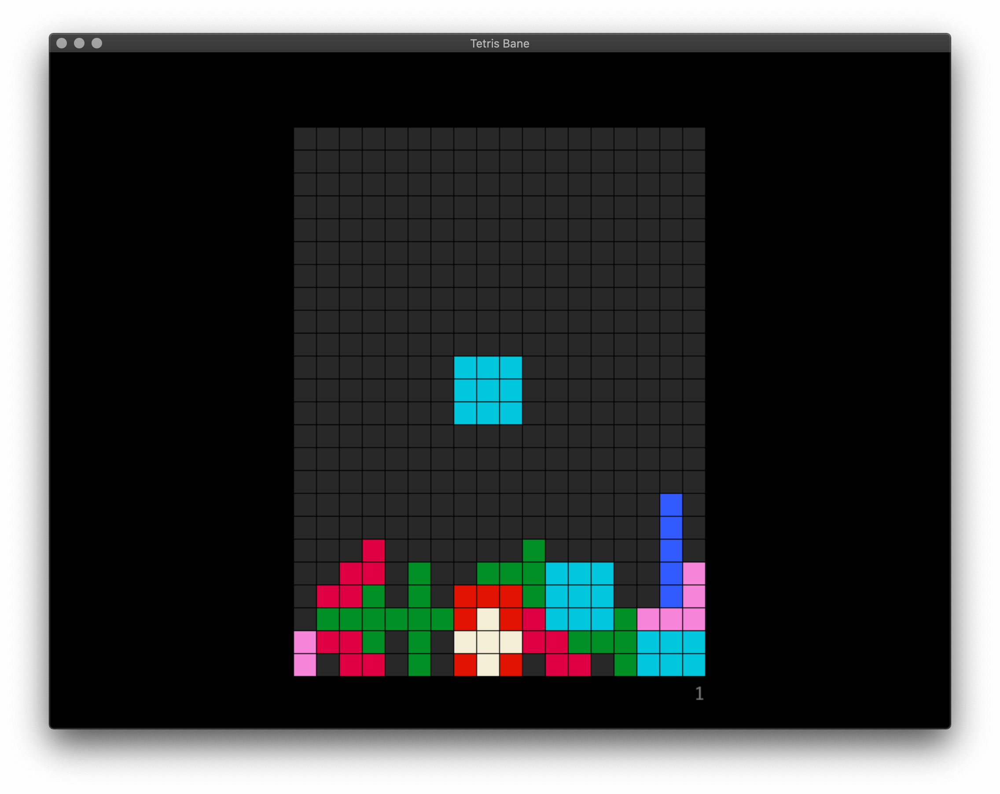

[Tetris Bane][tetris-bane] is an open-source Tetris clone
that mixes things up with multiple game modes.
There's a hard bane mode, classic mode for the purists,
ultra hard metal mode, and a chill mode.
Tetris Bane challenges you to get more then 2 lines in metal mode.

You can [download][tetris-bane] the game for Windows, macOS and Linux.

The game is written using [rust-sdl2].
[The source code is available here.][tetris-bane-src]

[tetris-bane]: https://andrew-jones.itch.io/tetris-bane
[tetris-bane-src]: https://github.com/andii1701/tetris-bane
[rust-sdl2]: https://github.com/Rust-SDL2/rust-sdl2

### Project YAWC


Project YAWC is an in-progress Advance-Wars style strategy game being developed
by junkmail using [ggez] as a framework. The game is currently in a closed alpha
state with working netplay. September saw the release of version A2, including
revamped netcode and the full core set of units.

[ggez]: https://ggez.rs/

### [space_shooter_rs]

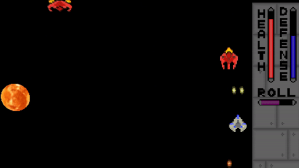

[space_shooter_rs] is a 2D shooter game made with the [Amethyst] game engine.
It is inspired by games like Raiden and the Binding of Isaac.

In September, [Micah Tigley] joined the project and has been collaborating with
[Carlo Supina] to refactor a significant chunk of the codebase. Lots of work has
been on collision detection, combat, and movement. This will allow for easier
future development.

Both developers wrote about the work and their experiences developing space_shooter_rs:

- [How to Revive a Dead Project][carlo-blog-post]
- [Collaborating on Amethyst showcase project: space_shooter_rs][micah-blog-post]

[space_shooter_rs]: https://github.com/amethyst/space_shooter_rs
[Amethyst]: https://amethyst.rs
[Carlo Supina]: https://twitter.com/carlosupina
[Micah Tigley]: https://twitter.com/micah_tigley
[carlo-blog-post]: https://micronote.tech/2020/10/How-to-Revive-a-Dead-Project
[micah-blog-post]: https://mtigley.dev/posts/contributing_to_spaceshooter_rs

## Learning Material Updates

### [So You Want to Live-Reload Rust][fasterthanlime-post]


_Cool bear_

[@fasterthanlime] published a giant blog post
["So you want to live-reload Rust"][fasterthanlime-post]
\- a very deep technical dive into reloading a dylib
and a bunch of related issues.
Lots of interesting insights for folks who want
to better understand nuances of hot reloading.

_Discussions:
[/r/rust](https://reddit.com/r/rust/comments/j0ajdy/so_you_want_to_livereload_rust)_

[fasterthanlime-post]: https://fasterthanli.me/articles/so-you-want-to-live-reload-rust
[@fasterthanlime]: https://fasterthanli.me/

### [rust-wasm-hotreload]

[rust-wasm-hotreload] by [@ShekoHex] is a PoC of using WebAssemply
as a hot-reloadable code logic at runtime without restarting the host process.
[Check out a video demo here][rust-wasm-hotreload-video].

[@ShekoHex]: https://twitter.com/ShekoHex
[rust-wasm-hotreload]: https://github.com/shekohex/rust-wasm-hotreload
[rust-wasm-hotreload-video]: https://twitter.com/ShekoHex/status/1302973994417651714

### [Learn WGPU][learn-wgpu]

This month [@sothr] released another chapter
of the ["Learn WGPU"][learn-wgpu] tutorial:
["Threading WGPU Resource Loading with Rayon"][learn-wgpu-threading].

Also, the whole tutorial [was upgraded to WGPU v0.6][learn-wgpu-upgrade].

[@sothr]: https://github.com/sothr
[learn-wgpu]: https://sotrh.github.io/learn-wgpu
[learn-wgpu-threading]: https://sotrh.github.io/learn-wgpu/intermediate/tutorial13-threading
[learn-wgpu-upgrade]: https://sotrh.github.io/learn-wgpu/news/#_0-6

### [Is It Easy to Draw a Line?][Lines]

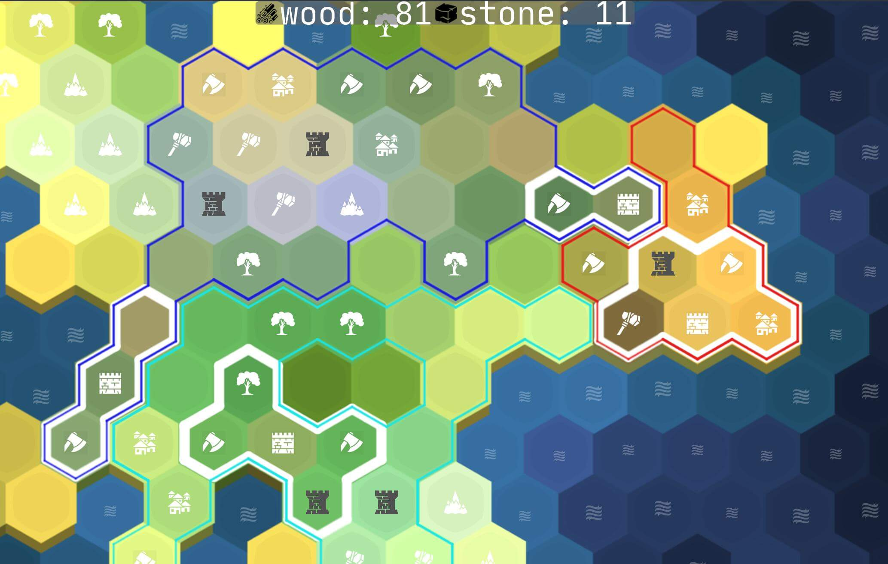
_Example of result chains._

A small note by [@VladZhukov0] about drawing lines and chains
with signed distance fields.
The resulted lines are nice looking on edges and have rounded corners.
Chains for this article are assumed to be opaque.

Check out the [online demo](https://pum-purum-pum-pum.github.io/lines/)
and its [source code](https://github.com/pum-purum-pum-pum/Lines).

[Lines]: https://vladjuckov.github.io/hqlines/
[@VladZhukov0]: https://twitter.com/VladZhukov0

### [OpenGL Preprocessor for Rust]

With the full power of Cargo build scripts and [Tera], you can create an advanced
GLSL preprocessor which can generate code conditionally, in loops, and even
inherit code from other templates.


Writing plain GLSL code is uncomfortable, code is quite often is duplicated, libraries
aren't something natural for GLSL (means you can't out of the box do #include "library.glsl").
The last point is especially problematic if some constants actually originate in
your game logic (like the number of player types). Updating these values manually
in your shader code is repetitive and prone to both error and simple forgetfulness.
It's really helpful to build some kind of preprocessor for your GLSL code,
which can include other files, so you can organize your code into manageable chunks.
With the power of [Tera], it's now easy to accomplish.
Because Rust is also often used for web projects, which need a lot of templated
web-pages preprocessing, we can borrow such technology for our needs,
combine it with cargo build scripts and create a compile-time preprocessing tool.

[tera]: https://tera.netlify.app
[OpenGL Preprocessor for Rust]: https://codecrash.me/an-opengl-preprocessor-for-rust

### Rust, Gamedev, ECS, and Bevy


[@hugopeixoto] released a couple of blog posts on ECS and Bevy,
including a tutorial on how to get started.

- The [first part][hugopeixoto-p1] gives us an in depth overview of what ECS.
  It starts with pseudocode for an object oriented approach
  and goes through several iterations until we get to the ECS paradigm.

- The [second part][hugopeixoto-p2] is a tutorial on how to use [bevy],
  a data driven game engine built in Rust.
  It goes over the basic features of the engine,
  using the example presented in the first part.

[@hugopeixoto]: https://twitter.com/hugopeixoto
[hugopeixoto-p1]: https://hugopeixoto.net/articles/rust-gamedev-ecs-bevy.html
[hugopeixoto-p2]: https://hugopeixoto.net/articles/rust-gamedev-ecs-bevy-p2.html
[bevy]: https://bevyengine.org

### [Flappy Bird in Bevy][bevy-flappy-video]

[][bevy-flappy-video]

[@TantanDev] is back with [another video][bevy-flappy-video]!
In this one, they made a Flappy Bird clone using Bevy
and shared their experience programming with it.

The source code [can be found here][bevy-flappy-src].

[@TantanDev]: https://twitter.com/TantanDev
[bevy-flappy-video]: https://youtube.com/watch?v=Qjc0V58lB7A
[bevy-flappy-src]: https://github.com/TanTanDev/flappy_bevy

### [Real-Time Global Illumination in WGPU][gi-post]

[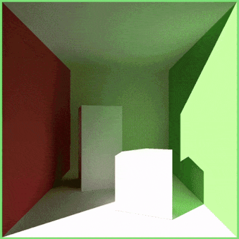][gi-post]
_Infinite light bounces in Cornell Box_

[DI2edd] shared his [real-time diffuse global illumination demo on /r/rust_gamedev][gi-post].
It's written in 100% Rust and uses WGPU for graphics, proving that the API
is an excellent choice even for advanced computer graphics applications.

The technique provides real time global illumination for static lambertian
geometry, and is the implementation of the 2017 paper ["Real-time Global
Illumination by Precomputed Local Reconstruction
from Sparse Radiance Probes"](https://arisilvennoinen.github.io/Projects/RTGI/index.html),
which proposes a spherical harmonics-based approach to solve the rendering equation
in real time.

In practice, this means that the expensive light transport calculations are performed
in a precomputation step, which relies on - among others - [embree-rs],
and [nalgebra] to produce a compressed
representation of the scene that is then used for lighting reconstruction at runtime.

[gi-post]: https://reddit.com/r/rust_gamedev/comments/ixocl2/real_time_diffuse_global_illumination
[DI2edd]: https://reddit.com/u/DI2edd
[embree-rs]: https://github.com/Twinklebear/embree-rs
[nalgebra]: https://github.com/dimforge/nalgebra

## Library & Tooling Updates

### [legion v0.3][legion-0-3]

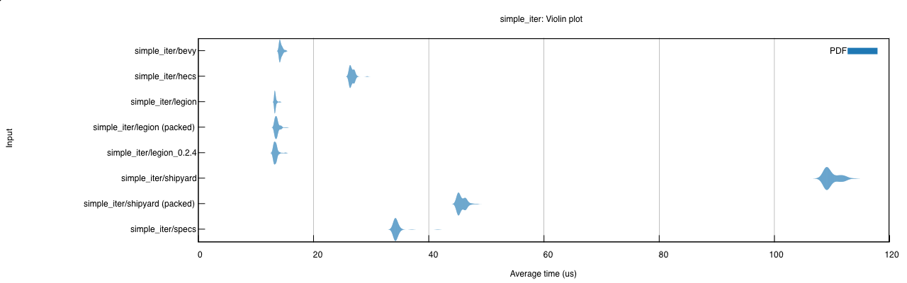

[Legion][legion] is among Rust's fastest and most powerful ECS libraries.
After months in development, v0.3 has finally been released to crates.io.
This is a huge release amounting to a near total rewrite of the library
and a major step towards a stable 1.0 release.

[Check out the v0.3 announcement post][legion-0-3]
for an overview of the new API and all the updates.

The project's repo has also been moved to the Amethyst org
to reflect its close collaboration with the Amethyst community.

_Discussions:
[/r/rust](https://reddit.com/r/rust/comments/io6evk/legion_v03)_

[legion]: https://github.com/amethyst/legion
[legion-0-3]: https://amethyst.rs/posts/legion-ecs-v0.3

### [Thunderdome]

[Thunderdome] is a ~~gladitorial~~ generational arena library inspired by
[generational-arena], [slotmap], and [slab]. It provides constant time
insertion, lookup, and removal via small (8 byte) keys that stay 8 bytes when
wrapped in `Option<T>`.

Data structures like Thunderdome's `Arena` store values and return keys that can
be later used to access those values. These keys are stable across removals and
have a generation counter to solve the [ABA Problem].

```rust
let mut arena = Arena::new();

let foo = arena.insert("Foo");
let bar = arena.insert("Bar");

assert_eq!(arena[foo], "Foo");
assert_eq!(arena[bar], "Bar");

arena[bar] = "Replaced";
assert_eq!(arena[bar], "Replaced");

let foo_value = arena.remove(foo);
assert_eq!(foo_value, Some("Foo"));

// The slot previously used by foo will be reused for baz.
let baz = arena.insert("Baz");
assert_eq!(arena[baz], "Baz");

// foo is no longer a valid key.
assert_eq!(arena.get(foo), None);
```

_Discussions:
[twitter](https://twitter.com/LPGhatguy/status/1303375906493276160)_

[Thunderdome]: https://github.com/LPGhatguy/thunderdome
[generational-arena]: https://crates.io/crates/generational-arena
[slotmap]: https://crates.io/crates/slotmap
[slab]: https://crates.io/crates/slab
[ABA Problem]: https://en.wikipedia.org/wiki/ABA_problem

### [Fontdue]

[Fontdue] is a simple, no_std, pure Rust, TrueType & OpenType
font rasterizer and layout tool.
It strives to make interacting with fonts as fast as possible,
and currently has the lowest end to end latency for a font rasterizer.

Fontdue depends on [ttf-parser] for parsing fonts,
which supports a wide range of TrueType and OpenType features.

A non-goal of this library is to be allocation free and have a fast,
"zero cost" initial load.
Fontdue does make allocations and depends on the alloc crate.
Fonts are fully parsed on creation and relevant information is stored
in a more convenient to access format.
Unlike other font libraries, the font structures have no lifetime dependencies
since it allocates its own space.

Project's roadmap:

- v1.0: fontdue is designed to be a replacement for
  rusttype, ab_glyph, parts of glyph_brush, and glyph_brush_layout.
  This is a class of font libraries that don't tackle shaping.
- v2.0: Shaping - the complex layout of text such as Arabic and Devanagari
  \- will be added.
  There are two potential pure Rust libraries (allsorts or rustybuzz)
  that are candidates for providing a shaping backend to Fontdue,
  but are relatively immature right now.

_Discussions: [/r/rust](https://reddit.com/r/rust/comments/ilnd41/fontdue)_

[Fontdue]: https://github.com/mooman219/fontdue
[ttf-parser]: https://github.com/RazrFalcon/ttf-parser

### [ultraviolet v0.6][ultraviolet-v0-6]

[ultraviolet] by [@fu5ha] is a crate for computer-graphics
and games-related linear algebra, but _fast_,
both in terms of productivity and in terms of runtime performance.

This month [ultraviolet v0.6][ultraviolet-v0-6] was released.
Updates include:

- Support for 256-bit wide AVX vectors and instructions
  as well as 128-bit wide SSE instructions which were already supported.
- Support for f64/double precision floats under the f64 feature,
  including f64x2 and f64x4 SIMD-accelerated types.
- Support for [mint] for most scalar types.
- Lots of smaller API and performance improvements.

_Discussions:
[/r/rust](https://reddit.com/r/rust/comments/ir24mp/announcing_ultraviolet_06)_

[ultraviolet]: https://crates.io/crates/ultraviolet
[ultraviolet-v0-6]: https://fusha.moe/blog/posts/ultraviolet-0.6
[@fu5ha]: https://twitter.com/fu5ha
[mint]: https://github.com/kvark/mint

### [This Month in Mun][mun-september]

[][Mun]

[Mun] is a scripting language for gamedev focused on quick iteration times
that is written in Rust.

[September updates][mun-september] include:

- on-going work for multi-file projects;
- build pipeline improvements;
- bug fixes in the Mun compiler and C++ bindings;
- a lot of refactors and quality of life improvements.

[Mun]: https://mun-lang.org
[mun-september]: https://mun-lang.org/blog/2020/10/01/this-month-september/

### [audir]

[audir] is a low level audio library supporting Windows (WASAPI), Linux (Pulse)
and Android (OpenSLES & AAudio).

It aims at providing a minimal and mostly unsafe but feature-rich API on top of
common audio backends with focus on gaming applications. The initial release
version 0.1.0 provides basic recording and playback support for all available
backends, including a small music player example!

Currently looking into coupling with [dasp] for dsp audio graphs to provide
a higher level entry point.

[audir]: https://github.com/norse-rs/audir
[dasp]: https://github.com/RustAudio/dasp

### [Crevice]

[Crevice] is a library that helps define GLSL-compatible (std140) structs for
use in uniform and storage buffers. It uses new `const fn` capabilities
stabilized in [Rust 1.46.0] to align types with explicitly zeroed padding.

Crevice depends heavily on [mint] to support almost any Rust math library. It
also contains helpers for safely sizing and writing buffers, making dynamic
buffer layout a breeze.

```rust
#[derive(AsStd140)]
struct MainUniform {
    orientation: mint::ColumnMatrix3<f32>,
    position: mint::Vector3<f32>,
    scale: f32,
}

let value = MainUniform {
    orientation: cgmath::Matrix3::identity().into(),
    position: [1.0, 2.0, 3.0].into(),
    scale: 4.0,
};

upload_data_to_gpu(value.as_std140().as_bytes());
```

_Discussions:
[twitter](https://twitter.com/LPGhatguy/status/1308499131212599296)_

[Crevice]: https://github.com/LPGhatguy/crevice
[Rust 1.46.0]: https://blog.rust-lang.org/2020/08/27/Rust-1.46.0.html
[mint]: https://github.com/kvark/mint

### [FemtoVG]


[FemtoVG] is a 2D canvas API in Rust, based on [nanovg].

Currently, FemtoVG uses OpenGL as a rendering backend. A Metal backend is 95%
done, and a wgpu backend is on the roadmap. The project is definitely looking
for contributors.

Unlike NanoVG, FemtoVG has full text-shaping support thanks to harfbuzz.

FemtoVG, just like the original NanoVG, is based on the _stencil-then-cover_
approach presented in [GPU-accelerated Path Rendering][gpupathrender.pdf].

Join the [Discord channel](https://discord.gg/V69VdVu)
or follow [FemtoVG on twitter](https://twitter.com/femtovg).

[FemtoVG]: https://github.com/femtovg/femtovg
[nanovg]: https://github.com/memononen/nanovg
[gpupathrender.pdf]: https://github.com/femtovg/femtovg/blob/master/assets/gpupathrender.pdf

### [gfx-rs] and [gfx-portability]


[gfx-portability] is a Vulkan portability implementation based on [gfx-rs].
It's basically a drop-in implementation of Vulkan on top of Metal and D3D12,
useful on platforms that don't have native Vulkan support, or have buggy drivers.

It released version [0.8.1](https://github.com/gfx-rs/portability/releases/tag/0.8.1)
with official support for the new [KHR portability extension][khr-portability],
as well as a few other extensions, plus a number of correctness fixes.

gfx-rs team asks Rust users of Vulkano, Ash, and other Vulkan-only wrappers to try
out the gfx-portability as a solution on macOS and relevant Windows 10 platforms.

In [gfx-rs] itself, the DX12 backend, and the descriptor indexing feature support
got improved. There has been a push to get DX11 backend in a solid shape,
and it can now run [vange-rs] pretty well 🎉.

[gfx-rs]: https://github.com/gfx-rs/gfx
[gfx-portability]: https://github.com/gfx-rs/portability
[khr-portability]: https://www.khronos.org/registry/vulkan/specs/1.2-extensions/man/html/VK_KHR_portability_subset.html
[vange-rs]: https://github.com/kvark/vange-rs

### [Riddle]

[Riddle] is a Rust media library in the vein of SDL,
building as far as possible on the most active/standard Rust libraries
(winit, wgpu, image, etc). Riddle is deliberately not an engine, or a framework.
It is a library devoted to exposing media related features in a unified way while
avoiding prescribing program structure. It provides abstractions over windowing,
input, audio, image loading/manipulation and provides a basic wgpu based 2D
renderer.
The [docs][riddle-docs] contain runnable examples for most methods and types.

The goal is to provide a stable foundation, resilient to developments in the Rust
gamedev ecosystem, on which games, custom engines, and other media applications can
be built.

_Discussions:
[/r/rust_gamedev](https://reddit.com/r/rust_gamedev/comments/j0xa3s/riddle_010)_

[Riddle]: https://github.com/vickles/riddle
[riddle-docs]: https://vickles.github.io/riddle/0.1.0/riddle

### [Bracket-Lib]

[bracket-lib] (previously `rltk_rs`) by [@blackfuture]
is a Rust implementation of [C++ Roguelike Toolkit][rltk-cpp].

Bracket-lib is going through a stability pass, focusing on freezing the API.
It will be featured in the author's upcoming book:
*Hands-on Rust: Effective Learning through 2D Game Development and Play*.
The book should be going into early access/beta in time for the next newsletter.

[bracket-lib]: https://github.com/thebracket/bracket-lib
[@blackfuture]: https://patreon.com/blackfuture
[rltk-cpp]: https://github.com/thebracket/rltk

### [macroquad]

[][sponsors]
_Games built with miniquad/macroquad._

[macroquad] by [@fedor_games] is a cross-platform
(Windows/Linux/macOS/Android/iOS/WASM)
game framework build on top of [miniquad].

This month 0.3 preview was released, featuring:

- Improved [documentation][macroquad-doc] on docs.rs.
- Screen reading shaders and a [tutorial about them][article-screen-reading].
- Updated "shadertoy" - small interactive GLSL playground - example.
  Check out the [web demo][shadertoy-web] and its [source code][shadertoy-src].

  [][shadertoy-web]

Also, [@not-fl3] (the main developer of all current \*quad projects)
has been added to the GitHub Sponsors.
Check out the project's story, vision, and roadmap
on the new [sponsors page][sponsors]!

[macroquad]: https://github.com/not-fl3/macroquad
[miniquad]: https://github.com/not-fl3/miniquad
[article-screen-reading]: https://not-fl3.github.io/platformer-book/screen-reading.html
[shadertoy-web]: https://not-fl3.github.io/miniquad-samples/shadertoy.html
[shadertoy-src]: https://github.com/not-fl3/macroquad/blob/master/examples/shadertoy.rs
[macroquad-doc]: https://docs.rs/macroquad/0.3.0-alpha.0/macroquad/index.html
[@fedor_games]: https://twitter.com/fedor_games
[@not-fl3]: https://github.com/not-fl3
[sponsors]: https://github.com/sponsors/not-fl3

### [Tetra]

[Tetra] is a simple 2D game framework, inspired by XNA and Raylib. This month,
version [0.5][tetra-05] was released, featuring:

- Cargo feature flags, allowing you to remove unused functionality and
  shrink your build
- Relative mouse events and infinite mouse movement (allowing for FPS-style
  control schemes)
- Extra methods for getting and setting the state of a playing sound

For full details and a list of breaking changes, see the [changelog][tetra-changelog].

Additionally, this month [puppetmaster] released [tetrapack], a set of useful
extensions for Tetra. This includes:

- Helpful timer types
- Looping background music
- Custom mouse cursors
- Input utility functions
- Tilemaps and tile animations

[tetra]: https://github.com/17cupsofcoffee/tetra
[tetra-05]: https://twitter.com/17cupsofcoffee/status/1301210538299609088
[tetra-changelog]: https://github.com/17cupsofcoffee/tetra/blob/main/CHANGELOG.md
[puppetmaster]: https://github.com/puppetmaster-
[tetrapack]: https://github.com/puppetmaster-/tetrapack

### [Bevy Engine v0.2][bevy-0-2]

[][bevy]

[Bevy][bevy] is a refreshingly simple data-driven game engine built in Rust.
It is [free and open source][bevy-repo] forever!

This month, thanks to 87 contributors, 174 pull requests, and their
[generous sponsors][bevy-sponsors], Bevy 0.2 was released. You can view the
[full Bevy 0.2 announcement here][bevy-0-2]. Here are some highlights:

- Async Task System: Bevy now has a brand new async-friendly task system,
  which enables the creation of context-specific task pools. For example, you might
  have separate pools for compute, IO, networking, etc. This also provides the
  flexibility to load balance work appropriately according to work type and/or priority.
  This new task system completely replaces Rayon and the cpu usage wins were huge!
- Initial Web Platform Support: (A subset of) Bevy now runs on the web using
  WebAssembly/WASM! Specifically, Bevy apps can run Bevy ECS schedules, react to
  input events, create an empty canvas (using winit), and a few other things. This
  is a huge first step, but it is important to call out that there are still a
  number of missing pieces, such as 2D/3D rendering, multi-threading, and sound.
- Parallel Queries: Systems that use queries already run in parallel,
  but before this change the queries themselves could not be iterated in parallel.
  Bevy 0.2 adds the ability to easily iterate queries in parallel, which builds on
  top of the new Async Task System.
- Transform System Rewrite: Bevy's old transform system used separate
  `Translation`, `Rotation`, and `Scale` components as the "source of truth",
  which were then synced to a `LocalTransform` component after each update. There
  are Good Reasons™ to use this approach, but it created a "lag" between the
  calculated LocalTransform and the source components and dataflow between components
  is hard to reason about. This problem was resolved by making a newer, simpler
  transform system that uses a consolidated `Transform` type.  
- Joystick/Gamepad Input: The Bevy Input plugin now has cross-platform support
  for most controllers thanks to the gilrs library!
- Bevy ECS Performance Improvements: generational entity IDs,
  read-only queries, lock-free world APIs, direct component lookup.

Community plugin updates:

- [bevy_rapier](https://github.com/dimforge/bevy_rapier):
  Rapier Physics' official Bevy plugin was updated to support Bevy 0.2.
- [bevy_ninepatch](https://crates.io/crates/bevy_ninepatch):
  Display 9-Patch UI elements, where you can specify how
  different parts of a PNG should grow.
- [bevy_mod_picking](https://github.com/aevyrie/bevy_mod_picking): 3d cursor
  picking and highlighting.
- [bevy_contrib_colors](https://crates.io/crates/bevy_contrib_colors):
  A simple color library.
- [bevy_input_map](https://crates.io/crates/bevy_prototype_input_map):
  Converts user inputs from different input hardware into game specific actions.
  Ex: keyboard "Space" or joystick "A" can be mapped to a "Jump" Action.
- [bevy_prototype_lyon](https://github.com/Nilirad/bevy_prototype_lyon):
  Draw 2D shapes, like triangles, circles, and beziers.
- [bevy_contrib_inspector](https://github.com/jakobhellermann/bevy-contrib-inspector):
  Visually edit fields of your bevy resources in a browser or native view.

_Discussions:
[/r/rust](https://reddit.com/r/rust/comments/iw1yyp/bevy_02),
[hacker news](https://news.ycombinator.com/item?id=24530698),
[twitter](https://twitter.com/cart_cart/status/1307445918535315456)_

[bevy]: https://bevyengine.org
[bevy-repo]: https://github.com/bevyengine/bevy
[bevy-0-2]: https://bevyengine.org/news/bevy-0-2
[bevy-sponsors]: https://github.com/sponsors/cart

### [rg3d][rg3d]

[][rg3d_twitter]
_Click to watch a [video demo of one of the new examples][rg3d_twit]._

[rg3d] is a game engine that aims to be easy to use and provide large set
of out-of-box features. Some of the recent updates:

- Render to texture - it is possible to render scenes into textures.
- Added support for scenes made in [rusty-editor].
- Added sprite graph node.
- Added simple lightmapper (still WIP).
- Added new UI widgets and features:
  - Message box - classic message box with different combinations of buttons.
  - Wrap panel - arranges its children by rows or columns with wrapping.
  - File browser - a browser for file system.
  - Color picker - classic HSV+RGB+Alpha color picker.
  - "Bring into view" for scroll panel.
  - Replaced font rasterizer by fontdue.
  - Improved hotkeys in text box.
- Improved performance and documentation.

Join the [rg3d's Discord channel][rg3d_discord]
or follow [Dmitry Stepanov on twitter][rg3d_twitter].

[rg3d]: https://github.com/mrDIMAS/rg3d
[rg3d_twit]: https://twitter.com/DmitryS36934349/status/1312836831390687232
[rg3d_discord]: https://discord.gg/xENF5Uh
[rg3d_twitter]: https://twitter.com/DmitryS36934349

### [rusty-editor]


[rusty-editor] is a scene editor for the [rg3d] engine.
Some of the recently added features:

- asset browser + asset previewer,
- multiselection,
- improved properties editor,
- lots of other small improvements and fixes.

[rusty-editor]: https://github.com/mrDIMAS/rusty-editor

### [godot-rust][godot-rust-site] v0.9


[godot-rust][godot-rust-site] provides high-level Rust bindings
to the [Godot game engine][godot].

This month [v0.9 was released][godot-rust-v0-9].
Besides lots of quality-of-life improvements, this update brings a massive
redesign of the API in order to solve long-standing soundness problems.
As there're numerous breaking changes,
a [chapter about migration from 0.8][godot-rust-migration] was added
to the user guide.

[godot]: http://godotengine.org
[godot-rust-site]: https://godot-rust.github.io/
[godot-rust-v0-9]: https://godot-rust.github.io/release-notes/0-9-0/
[godot-rust-migration]: https://godot-rust.github.io/book/migrating-0-8.html

## Popular Workgroup Issues in Github

- [rust-gamedev/wg](https://github.com/rust-gamedev/wg):
  - [#21 "Planning a survey for Rust game developers"](https://github.com/rust-gamedev/wg/issues/21);
  - [#93 "Consider creating a game math library benchmark for the working group"](https://github.com/rust-gamedev/wg/issues/93);
- [rust-gamedev/ecs_bench_suite](https://github.com/rust-gamedev/ecs_bench_suite):
  - [#13 "How results will be updated?"](https://github.com/rust-gamedev/ecs_bench_suite/issues/13);

## Requests for Contribution

<!-- Links to "good first issue"-labels or direct links to specific tasks -->

- [Embark's open issues][embark-open-issues] ([embark.rs]).
- [winit's "Good first issue" and “help wanted” issues][winit-issues].
- [gfx-rs's "contributor-friendly" issues][gfx-issues].
- [wgpu's "help wanted" issues][wgpu-help-wanted].
- [luminance's "low hanging fruit" issues][luminance-fruits].
- [ggez's "good first issue" issues][ggez-issues].
- [Veloren's "beginner" issues][veloren-beginner].
- [Amethyst's "good first issue" issues][amethyst-issues].
- [A/B Street's "good first issue" issues][abstreet-issues].
- [Mun's "good first issue" issues][mun-issues].
- [SIMple Mechanic's good first issues][simm-issues].
- [Bevy's "good first issue" issues][bevy-issues].

[embark.rs]: https://embark.rs
[embark-open-issues]: https://github.com/search?q=user:EmbarkStudios+state:open
[winit-issues]: https://github.com/rust-windowing/winit/issues?utf8=✓&q=is%3Aissue+is%3Aopen+label%3A%22status%3A+help+wanted%22+label%3A%22Good+first+issue%22
[gfx-issues]: https://github.com/gfx-rs/gfx/issues?q=is%3Aissue+is%3Aopen+label%3Acontributor-friendly
[wgpu-help-wanted]: https://github.com/gfx-rs/wgpu-rs/issues?q=is%3Aissue+is%3Aopen+label%3A%22help+wanted%22
[luminance-fruits]: https://github.com/phaazon/luminance-rs/issues?q=is%3Aissue+is%3Aopen+label%3A%22low+hanging+fruit%22
[ggez-issues]: https://github.com/ggez/ggez/labels/%2AGOOD%20FIRST%20ISSUE%2A
[veloren-beginner]: https://gitlab.com/veloren/veloren/issues?label_name=beginner
[amethyst-issues]: https://github.com/amethyst/amethyst/issues?q=is%3Aissue+is%3Aopen+label%3A%22good+first+issue%22
[abstreet-issues]: https://github.com/dabreegster/abstreet/issues?q=is%3Aissue+is%3Aopen+label%3A%22good+first+issue%22
[mun-issues]: https://github.com/mun-lang/mun/labels/good%20first%20issue
[simm-issues]: https://github.com/mkhan45/SIMple-Mechanics/labels/good%20first%20issue
[bevy-issues]: https://github.com/bevyengine/bevy/labels/good%20first%20issue

------

That's all news for today, thanks for reading!

Subscribe to [@rust_gamedev on Twitter][@rust_gamedev]
or [/r/rust_gamedev subreddit][/r/rust_gamedev] if you want to receive fresh news!

<!--
TODO: Add real links and un-comment once this post is published
**Discussions of this post**:
[/r/rust](TODO),
[twitter](TODO).
-->

[/r/rust_gamedev]: https://reddit.com/r/rust_gamedev
[@rust_gamedev]: https://twitter.com/rust_gamedev
