+++
title = "This Month in Rust GameDev #15 - October 2020"
date = 2020-11-03
transparent = true
draft = true
+++

<!-- Check the post with markdownlint-->

Welcome to the 15th issue of the Rust GameDev Workgroup's
monthly newsletter.
[Rust] is a systems language pursuing the trifecta:
safety, concurrency, and speed.
These goals are well-aligned with game development.
We hope to build an inviting ecosystem for anyone wishing
to use Rust in their development process!
Want to get involved? [Join the Rust GameDev working group!][join]

You can follow the newsletter creation process
by watching [the coordination issues][coordination].
Want something mentioned in the next newsletter?
[Send us a pull request][pr].
Feel free to send PRs about your own projects!

[Rust]: https://rust-lang.org
[join]: https://github.com/rust-gamedev/wg#join-the-fun
[pr]: https://github.com/rust-gamedev/rust-gamedev.github.io
[coordination]: https://github.com/rust-gamedev/rust-gamedev.github.io/issues?q=label%3Acoordination

- [Game Updates](#game-updates)
- [Learning Material Updates](#learning-material-updates)
- [Library & Tooling Updates](#library-tooling-updates)
- [Popular Workgroup Issues in Github](#popular-workgroup-issues-in-github)
- [Meeting Minutes](#meeting-minutes)
- [Requests for Contribution](#requests-for-contribution)
- [Jobs](#jobs)
- [Bonus](#bonus)

<!--
Ideal section structure is:

```
### [Title]


_image caption_

A paragraph or two with a summary and [useful links].

_Discussions:
[/r/rust](https://reddit.com/r/rust/todo),
[twitter](https://twitter.com/todo/status/123456)_

[Title]: https://first.link
[useful links]: https://other.link
```

If needed, a section can be split into subsections with a "------" delimiter.
-->

## Game Updates

### [Veloren][veloren]


_Endless mountains to explore_

[Veloren][veloren] is an open world, open-source voxel RPG inspired by Dwarf
Fortress and Cube World.

In October, lots of work was done on the UI, and a buff system. There was an
overhaul done to the staff item that gives it new primary and secondary attacks.
There has also been work done on the axe and bow. The cloud system was
overhauled and brought a cheaper way to compute the 3D noise that the system uses.
The skill bar was overhauled to implement a new design that could handle the new
buff system. This was also the first overhaul in over a year. A SFX system is in
the works to allow effects to be mapped to blocks, for sounds like crickets or
birds.

You can read more about some specific topics from October:

- [Modelling Process](https://veloren.net/devblog-88#gemu)
- [Staff Overhaul](https://veloren.net/devblog-89#staff-overhaul-by-sam)
- [New Skillbar and Buffs Visuals](https://veloren.net/devblog-89#new-skillbar-and-buffs-visuals-pfau)
- [Cloud Improvements](https://veloren.net/devblog-90#cloud-improvements-by-zesterer)
- [Buffs](https://veloren.net/devblog-91#buffs-by-sam)
- [Alignment and Hostility](https://veloren.net/devblog-91#alignment-and-hostility-by-adam)
- [Fixing CI](https://veloren.net/devblog-91#fixing-ci-by-xmac94x)

October's full weekly devlogs: "This Week In Veloren...":
[#88](https://veloren.net/devblog-88),
[#89](https://veloren.net/devblog-89),
[#90](https://veloren.net/devblog-90),
[#91](https://veloren.net/devblog-91).

In November, Veloren will release 0.8. Veloren will also be speaking at
MiniDebConf on November 22nd.


_Team hunt_

[veloren]: https://veloren.net

### [Egregoria]

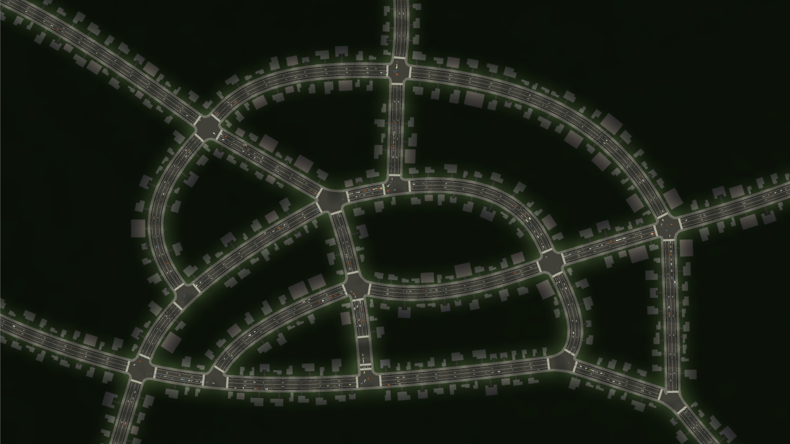

[Egregoria]'s objective is to become a granular society simulation,
filled with fully autonomous agents interacting with their world in real time.

The [6th devlog][egregoria-blog-post] was published. Updates include:

- Island generation.
- Day/night cycle.
- Human AI via utilitary systems.
- Specs to [legion 0.3][legion-github] port.

See also [the recent video][egregoria-video] showcasing very basic AI.

Join [Egregoria's Discord server][egregoria-discord].

_Discussions:
[/r/rust_gamedev](https://reddit.com/r/rust_gamedev/comments/jkcllc/egregoria_devblog_6)_

[Egregoria]: https://github.com/Uriopass/Egregoria
[egregoria-blog-post]: http://douady.paris/blog/egregoria_6.html
[legion-github]: https://github.com/amethyst/legion
[egregoria-video]: https://www.youtube.com/watch?v=mfvAuvC-XLg
[egregoria-discord]: https://discord.gg/CAaZhUJ

### [A/B Street][abstreet]


[A/B Street][abstreet] is a traffic simulation game exploring how small changes
to roads affect cyclists, transit users, pedestrians, and drivers. Any city
with OpenStreetMap coverage can be used!

Some of this month's updates:

- [web version][abstreet-web] launched, powered by `winit`, `glow`, and other
  dependencies having support for WebAssembly;
- an [OpenStreetMap viewer][abstreet-osm] with 100 cities imported;
- "thought bubbles" for cars looking for parking, by [Michael][mkirk];
- slow portions of a trip highlighted in the info panel, by [Sam][NoSuchThingAsRandom];

[abstreet]: https://abstreet.org
[abstreet-web]: http://abstreet.s3-website.us-east-2.amazonaws.com/dev/
[abstreet-osm]: http://abstreet.s3-website.us-east-2.amazonaws.com/osm_demo/
[mkirk]: https://github.com/michaelkirk
[NoSuchThingAsRandom]: https://github.com/NoSuchThingAsRandom/

### Worship The Sun

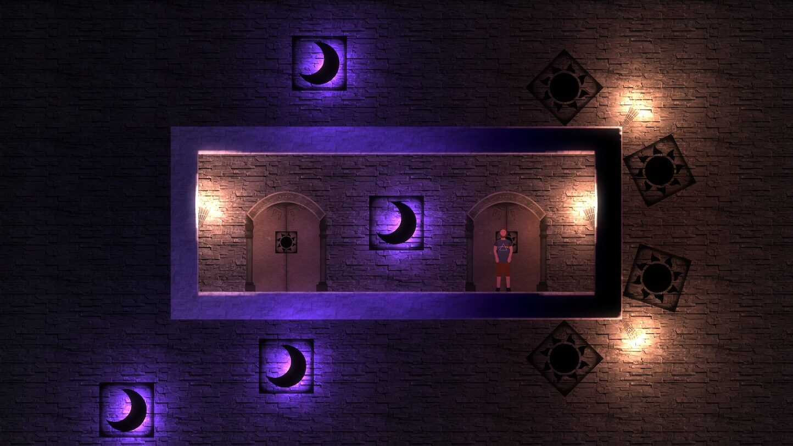
_One of the many unique and confounding puzzles in the game_

Worship The Sun is a dark, mysterious 2D puzzle-platform game with computer
science themes. It introduces the player to a rich language of puzzle elements
and challenges them to solve difficult puzzles that require experimentation,
comprehension and internalisation of the game's mechanics.

The game is built using a custom engine that sits on top of [legion][legion],
[wgpu][wgpu] and a handful of other crates. It features dynamic lighting, a
flexible particle system, bespoke collision behaviour and a Vim-inspired level
editor. The majority of game assets are hand drawn in [Procreate][procreate]
and painstakingly animated.

The game is a few months into development with a release target of late 2021.
You can read about how swimming was added to the game in [GameDev Note 1:
Taking the Plunge][plunge] which contains a sneak peek at some of the levels.
For updates and possible playtesting opportunities, follow
[@chrispatuzzo][chrispatuzzo] and a [/r/WorshipTheSunGame] subreddit.

[legion]: https://github.com/amethyst/legion
[wgpu]: https://github.com/gfx-rs/wgpu
[procreate]: https://procreate.art/
[plunge]: https://tuzz.tech/blog/taking-the-plunge
[chrispatuzzo]: https://twitter.com/chrispatuzzo
[/r/WorshipTheSunGame]: https://reddit.com/r/WorshipTheSunGame

### [Akigi][akigi]

[Akigi][akigi] is a WIP online multiplayer game.

In October, more progress was made on the editor tool for placing entity spawn
points. Work was started on prototyping the hunting skill. Functionality was
added to allow focusing for TextAreas in the user interface. Improvements were
made to the engine's asset management code to make it more generalized.

Full devlogs:
[#087](https://devjournal.akigi.com/october-2020/087-2020-10-04.html),
[#088](https://devjournal.akigi.com/october-2020/088-2020-10-11.html),
[#089](https://devjournal.akigi.com/october-2020/089-2020-10-18.html),
[#090](https://devjournal.akigi.com/october-2020/090-2020-10-25.html).

[akigi]: https://akigi.com

### [Sun Prison][sun_prison]

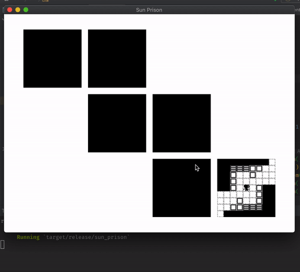

[Sun Prison][sun_prison] by [Dima Lazarev][@dmitrywithouti] is a WIP turn-based
meditation on Rubik's cube, [Sokoban][bevy_sokoban], and roguelikes, being
implemented with [Bevy engine][bevy].
The game is in the very early stages of development,
but it is already possible to [get lost in the dark][sun_prison_twit_1]
or to be [eaten by zombies][sun_prison_twit_2].

Follow [@dmitrywithouti] on Twitter for updates.

[sun_prison]: https://github.com/ropewalker/sun_prison
[bevy_sokoban]: https://github.com/ropewalker/bevy_sokoban
[bevy]: https://bevyengine.org
[@dmitrywithouti]: https://twitter.com/dmitrywithouti
[sun_prison_twit_1]: https://twitter.com/dmitrywithouti/status/1309025584039768064
[sun_prison_twit_2]: https://twitter.com/dmitrywithouti/status/1309982656260648960

### [Camp Misty]


[Camp Misty] is an asymmetric
multiplayer game played on the command line. The game is played with two
people. One of the players is a helpless victim searching for car parts. If
they find all of the parts, they can repair their car and escape the camp. The
other player is a ruthless killer who is trying to hunt down the victim.

The game was created as a learning exercise in about two weeks by
[@ReeCocho], with contributions from the many helpful members of [/r/rust].

[Camp Misty]: https://github.com/ReeCocho/camp-misty
[@ReeCocho]: https://github.com/ReeCocho
[/r/rust]: https://reddit.com/r/rust

### [Antorum Online]


Antorum Online is a micro-multiplayer online role-playing game by [@dooskington].
The game server is written in Rust, and the current "official" client is being
developed in Unity. The server can be self-hosted, and the network protocol is
open, so even custom clients that adhere to the protocol can connect and play.

Two more devlogs were published this month, regarding work done to implement
shops, character creation, and a few other features:

- [21: Belmart, Shops, And Bartering](https://ratwizard.dev/dev-log/antorum/21)
- [22: Character Creation And Customization](https://ratwizard.dev/dev-log/antorum/22)

[Antorum Online]: https://ratwizard.dev/dev-log/antorum
[@dooskington]: https://twitter.com/dooskington

### [Power Kick]

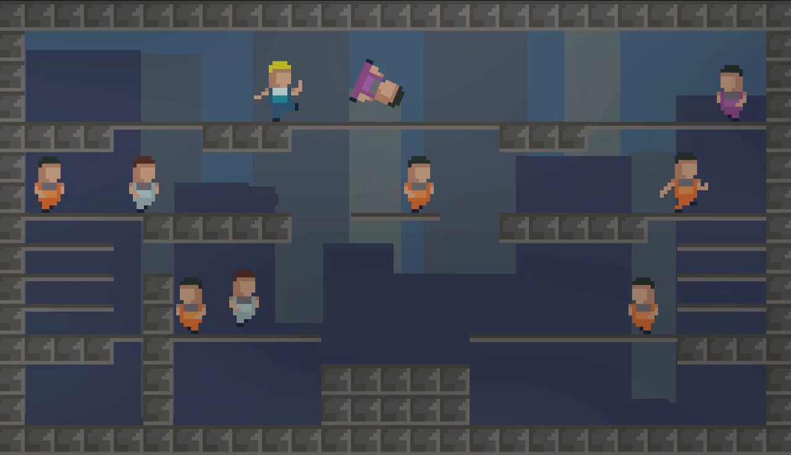

[Power Kick] is an one screen platform game inspired by similar old arcade games
like Bubble Bobble and SnowBros.
Your task is to hit the enemies till they get dizzy and then kick them out of
their misery to proceed to the next stage. The kicked enemies will hit the
colliding enemies with a possibility to create a chain reaction
(similar to the pushed snowball in SnowBros).

The game have 20 stages and in stage 10 and 20 you will face a helicopter boss.

Can be played solo on the web through WebAssembly or up to two players
in the downloadable version:
first player with the keyboard and the second one with a joypad.

The development took around two weeks thanks to [macroquad] and [hecs].

[Power Kick]: https://kakoeimon.itch.io/power-kick
[macroquad]: https://github.com/not-fl3/macroquad
[hecs]: https://crates.io/crates/hecs

### [pGLOWrpg]

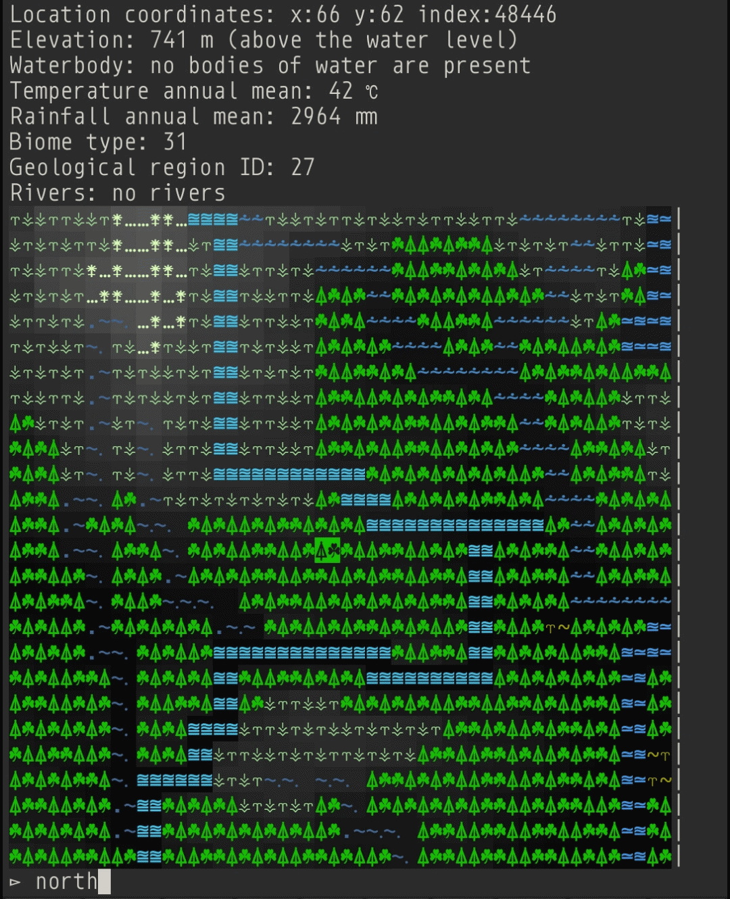

The [@pGLOWrpg] (Procedurally Generated Living Open World RPG) is a long-term
project in development by [@Roal_Yr], which aims to be a text-based game with
maximum portability and [accessibility](https://youtu.be/_jgzAddgEPU)
and focus on replayability, interactions, and emergent narrative.

For the past month the main focus of the development was on:

- Improving the UI.
- Implementing the input autocomplete system.
- Implementing save data import and parsing.
- Implementing world navigation system.
- Implementing rudimentary CLI graphics (for debugging and some future use).

Main features of reported (pre-alpha) version are:

- Ability to generate and explore one or many worlds (see previous news).

For main feature reports and dev blogs follow [@pGLOWrpg] on Twitter.

[@Roal_Yr]: https://twitter.com/Roal_Yr
[@pGLOWrpg]: https://twitter.com/pglowrpg
[pGLOWrpg]: https://github.com/roalyr/pglowrpg

### [Space Shooter]

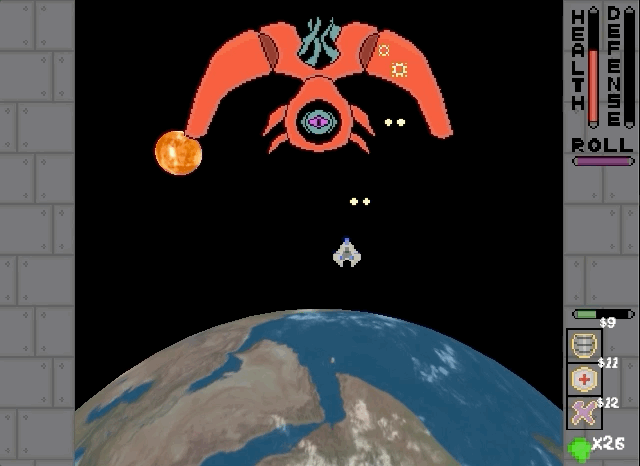

The [Space Shooter] project is a game in development by [Carlo Supina] and
[Micah Tigley]. It is a 2D "shoot-em-up" game that takes place in space and is
inspired by games like [Raiden] and [Binding of Isaac].

Recent development has been focused on creating an online book for documentation
for the game. While still a work in progress, the following content is now
available:

- [Gameplay]
- [Contributing Code]
- [Adding Items]

If you're interested in hearing about planning
an effective code refactor for a project using ECS, make sure to check out
[How to Revive a Dead Rust Project] at [RustFest Global 2020].

[Space Shooter]: https://github.com/amethyst/space_shooter_rs
[Carlo Supina]: https://twitter.com/carlosupina
[Micah Tigley]: https://twitter.com/micah_tigley
[Raiden]: https://wikipedia.org/wiki/Raiden_(video_game)
[Binding of Isaac]: https://wikipedia.org/wiki/The_Binding_of_Isaac_(video_game)
[Gameplay]: https://amethyst.github.io/space_shooter_rs/gameplay.html
[Contributing Code]: https://amethyst.github.io/space_shooter_rs/contributing.html
[Adding Items]: https://amethyst.github.io/space_shooter_rs/add_item.html
[RustFest Global 2020]: https://rustfest.global/
[How to Revive a Dead Rust Project]: https://rustfest.global/session/22-project-necromancy-how-to-revive-a-dead-rust-project/

### [Weegames][weegames-itch]

[][weegames-video]
_Click to see [a demo video][weegames-video]_

[Weegames][weegames-itch] ([source code][weegames-repository])
is a fast-paced minigame collection.

There are now 40 minigames in the collection.
New features in the latest release include boss games and high scores.

[weegames-itch]: https://yeahross.itch.io/weegames
[weegames-repository]: https://github.com/yeahross0/weegames
[weegames-video]: https://youtu.be/sstqGppo7L4

### [Canon Collision][canon-collision]

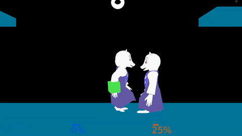

[Canon Collision][canon-collision] by [@rukai] is an Undertale + Homestuck
fan-made platform fighter with powerful tools for modding.

This month, he completed the abstractions needed for character specific logic.
Notable changes:

- [toriel's fireball](https://twitter.com/thisIsRukai/status/1302250049972314112)
- [wobbly fireball shaders](https://twitter.com/thisIsRukai/status/1299311125285142529)
- [items that can be picked up and thrown](https://twitter.com/thisIsRukai/status/1297507398693736448)
- [character specific logic](https://twitter.com/thisIsRukai/status/1314872752642297856)

[canon-collision]:https://canoncollision.com
[@rukai]: https://twitter.com/thisIsRukai

## Learning Material Updates

### How to: WGPU + Winit + ECS + Pixels

[@nyxtom] published several articles on game
development for Entity-Component-Systems, Windowing and Event Loops, and WGPU.

- [ECS in Rust](https://nyxtom.dev/2020/10/06/ecs-in-rust/) -
  written as a high level introduction to entity component systems and
  using the [hecs] crate.
- [Winit and Pixels](https://nyxtom.dev/2020/10/07/winit-rust/) -
  introduces cross platform window management/event loops and provides a
  tutorial for writing simple pixel graphics and 2d game development using
  the [pixels] crate (based on WGPU).
- [Framebuffers, WGPU and Rust](https://nyxtom.dev/2020/10/08/framebuffers/) -
  an in depth analysis of high level graphics terminology and a full length
  tutorial for setting up the api and clearing the screen with WGPU.

[@nyxtom]: https://twitter.com/nyxtom
[hecs]: https://github.com/Ralith/hecs
[pixels]: https://github.com/parasyte/pixels

### [Creating a Snake Clone in Bevy]

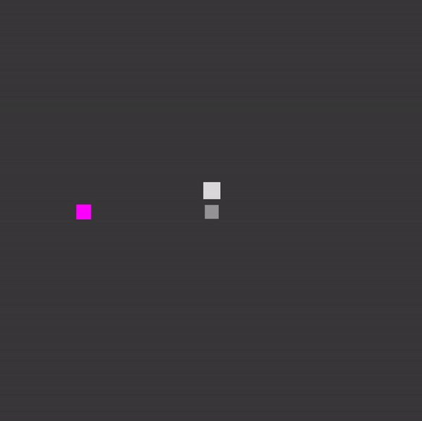
_Gameplay of snake clone_

Bevy is a rapidly growing game engine written in Rust. This tutorial walks
through creating a snake clone, introducing Bevy concepts on the way. The
tutorial covers resources, systems, timers, entities, components, materials,
creating a grid system, and spawning/despawning entities.

[Creating a Snake Clone in Bevy]: https://mbuffett.com/posts/bevy-snake-tutorial/

### [How to: Rust + SDL2 + OpenGL on the web][how-to-rust-sdl2-opengl-post]

[@Therocode] published an [article][how-to-rust-sdl2-opengl-post] that
explains how to port games to the web using Emscripten.
It is not only useful if you have an existing game to port, but
also if you are looking for a starting point for a new application.

_Discussions:
[/r/rust](https://reddit.com/r/rust/comments/jmeqan/how_to_rust_sdl2_opengl_on_the_web)_

[how-to-rust-sdl2-opengl-post]: https://blog.therocode.net/2020/10/a-guide-to-rust-sdl2-emscripten
[@Therocode]: https://twitter.com/therocode

## Library & Tooling Updates

### [rust-psp]


Move over Tetris Effect and Tetris 99, the first game has been created with
[rust-psp], and it's [Tetris]! This was a big step because it proves that
rust-psp is ready for game development, even though it's still `#![no_std]`.
`std` support is a work in progress, and the project is always open to new
contributors to the library, the tooling, or people who want to make PSP games
in Rust.

Another development for rust-psp this month is [reverse engineering]
of the Sony library for the hardware vector floating point unit of the PSP.
All the vector and matrix operations provided by the Sony library have been
PR'ed to rust-psp's main repo, and there are still more functions to come.

To stay up to date on [rust-psp] development, you can join the project's [Discord]
or follow [@sajattack] on Twitter.

[rust-psp]: https://github.com/overdrivenpotato/rust-psp
[Tetris]: https://github.com/sajattack/rust-psp/tree/tetris/examples/tetris
[reverse engineering]: https://psp.re
[Discord]: https://discord.gg/tvGzD4GqvF
[@sajattack]: https://twitter.com/sajattack

### [glam] v0.10.0

[glam] is a simple and fast linear algebra crate for games and graphics.

This month v0.10.0 was released.
There were a lot of additions in this update and a small breaking change.

- The return type of `Vec4::truncate()` was changed from `Vec3A` to `Vec3` which
  is a breaking change and thus the version jumped from 0.9 to 0.10.
- Vector swizzle functions similar to those found in [GLSL] were added. Swizzle
  functions allow a vectors elements to be reordered. The result can be a vector
  of a different size to the input. Swizzles are implemented with SIMD
  instructions where possible, e.g. for the `Vec4` type.

  ```rust
  let v = vec4(1.0, 2.0, 3.0, 4.0);
  
  // Reverse elements of `v`.
  // If SIMD is supported this will use a vector shuffle.
  let wzyx = v.wzyx();
  
  let yzw = v.yzw(); // Swizzle the yzw elements of `v` into a `Vec3`
  let xy = v.xy(); // You can swizzle from a `Vec4` to a `Vec2`
  let yyxx = xy.yyxx(); // And back again
  ```

- [no_std] support was added, using [libm] for math functions that are not
  implemented in `core`.
- Optional support for the [bytemuck] crate was added, this allows appropriate
  glam types to be cast into `&[u8]`.

For a full list of changes see the [glam changelog].

[glam]: https://github.com/bitshifter/glam-rs
[GLSL]: https://www.khronos.org/opengl/wiki/Data_Type_(GLSL)#Swizzling
[no_std]: https://rust-embedded.github.io/book/intro/no-std.html
[libm]: https://github.com/rust-lang/libm
[bytemuck]: https://docs.rs/bytemuck
[glam changelog]: https://github.com/bitshifter/glam-rs/blob/master/CHANGELOG.md

### [This Month in Mun][mun-october]

[][Mun]

[Mun] is a scripting language for gamedev focused on quick iteration times
that is written in Rust.

[October updates][mun-october] include:

- a plugin for mdbook to test Mun code;
- support for modules and visibility;
- the ability to generate enum ABI types;
- bug fixes and other improvements.

[Mun]: https://mun-lang.org
[mun-october]: https://mun-lang.org/blog/2020/10/31/this-month-october

### [gfx-rs]

gfx-rs support for D3D has been improved. [@kvark] landed a few critical fixes
in the DX12 backend, including the proper handle freeing, compressed textures
support, blend factors, and debug markers.

[@cwfitzerald] brought DX11 backend practically to the 1st tier with titanic
work spread over a dozen of pull requests.
It is now able to run [bve-reborn] correctly:

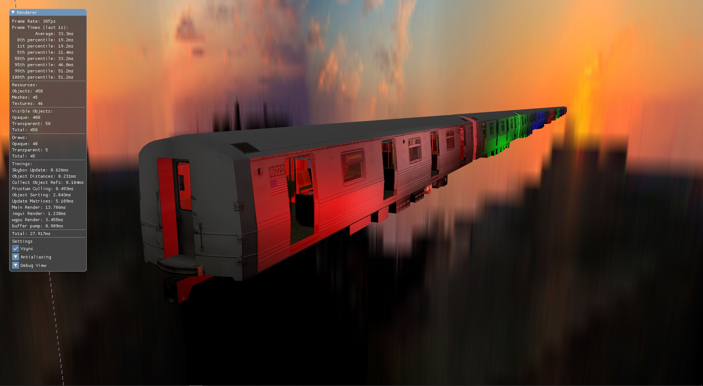

[gfx-rs]: https://github.com/gfx-rs/gfx
[@kvark]: https://github.com/kvark
[@cwfitzerald]: https://github.com/cwfitzgerald
[bve-reborn]: https://github.com/BVE-Reborn/bve-reborn

### [rg3d]

[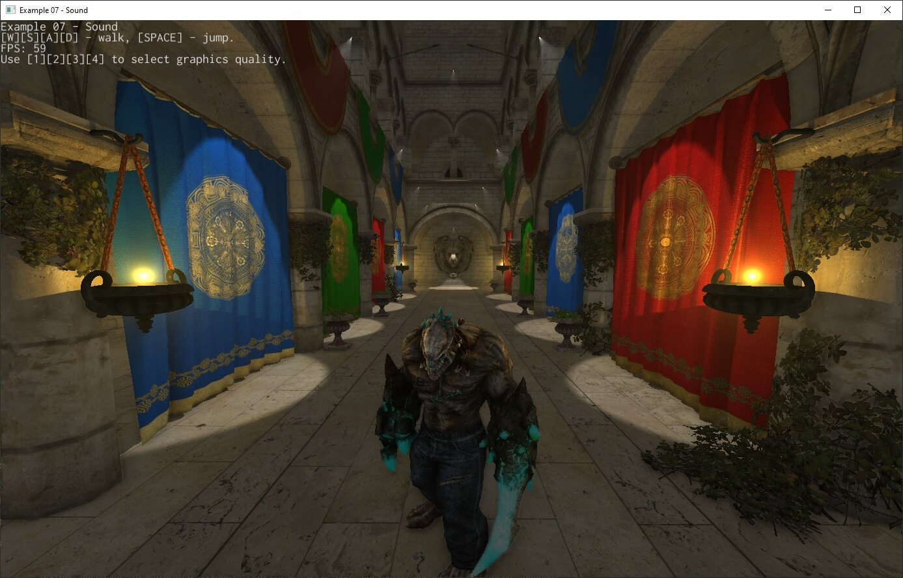][rg3d_twit]

[rg3d] is a game engine that aims to be easy to use and provide large set
of out-of-box features. Some of the recent updates:

- Implemented fully asynchronous resource loading.
- Added compressed textures support (DXT1, DTX3, DTX5).
- Added filtering and wrapping options for textures.
- Added sky box.
- Added texture import options for resource manager.
- All dependencies were moved to rg3d workspace, so there is no need to
  manually download them when working with the latest version of the engine.
- Extracted HRTF code in the separate [crate][hrtf], so it could be used
  without rg3d.
- Lots of other bugfixes and improvements.

Join the [rg3d's Discord channel][rg3d_discord]
or follow [Dmitry Stepanov on twitter][rg3d_twitter].

[rg3d]: https://github.com/mrDIMAS/rg3d
[hrtf]: https://github.com/mrDIMAS/hrtf
[rg3d_twit]: https://twitter.com/DmitryS36934349/status/1312836831390687232
[rg3d_discord]: https://discord.gg/xENF5Uh
[rg3d_twitter]: https://twitter.com/DmitryS36934349

### [Tetra]

[Tetra] is a simple 2D game framework, inspired by XNA and Raylib. This month,
versions 0.5.1 and 0.5.2 were released, fulfilling some long-standing feature
requests:

- Custom error types can now be used in your game loop
- Custom shaders gained support for multiple texture samplers and color uniforms
- Methods were added to `Texture` and `Canvas` for writing pixel data at runtime
- Various helpful `std` traits were implemented for `Color`

For full details and a list of breaking changes, see the [changelog][tetra-changelog].

[tetra]: https://github.com/17cupsofcoffee/tetra
[tetra-changelog]: https://github.com/17cupsofcoffee/tetra/blob/main/CHANGELOG.md

### [ogmo3]

[ogmo3] is a Rust crate for parsing projects and levels created with
[Ogmo Editor 3]. It is loosely modeled after `ogmo-3-lib`, the Haxe reference
implementation of an Ogmo level parser.

This month, it was released onto crates.io for the first time, and a
[full example][ogmo3-sample] was added, showing how a simple project can be
loadedinto a game engine.

[ogmo3]: https://github.com/17cupsofcoffee/ogmo3
[Ogmo Editor 3]: https://ogmo-editor-3.github.io/
[ogmo3-sample]: https://github.com/17cupsofcoffee/ogmo3/blob/main/examples/sample.rs

### [Wilds]


[Wilds] is very early in development game engine.

It features a renderer that uses Vulkan [ray-tracing extension] supported
by NVidia RTX cards and future AMD cards.

Screenshot above is rendered using [DDGI] technique implemented exclusively
with Rust and GLSL for shaders.
In the whole scene there is only one directional light source - "sun" -
and no "ambient" light.
All geometry in viewport is shadowed from "sun" and is lit with diffuse
illumination.

To keep things as simple as possible the engine uses [Hecs] - minimalistic
ECS library.
Assets are loaded asynchronously using [Goods] asset manager.

Traditional rasteriazation rendering pipeline and support [wgpu] backend are planned
to support wider range of platforms/hardware.

Implementing GUI system and basic editor is also a priority goal.

Follow progress [on Twitter](https://twitter.com/zakarum4).
Contributions and feedback are always welcome.

[Wilds]: https://github.com/zakarumych/wilds
[ray-tracing extension]: https://www.khronos.org/registry/vulkan/specs/1.2-extensions/man/html/VK_KHR_ray_tracing.html
[DDGI]: https://morgan3d.github.io/articles/2019-04-01-ddgi/
[Hecs]: https://lib.rs/crates/hecs
[Goods]: https://github.com/zakarumych/goods
[~~Shave more yaks~~]: https://github.com/zakarumych/gpu-alloc
[Rapier]: https://rapier.rs
[Wgpu]: https://wgpu.rs

### [Arsenal]

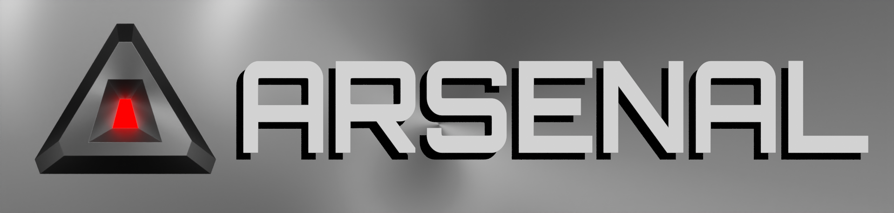

[Arsenal] is a [Blender] game engine built on Rust and the [Bevy] game engine.
Arsenal's goal is to bring the ability to makes games of any scale to game
developers and artists of any experience level.

In the last month Arsenal has gotten back into full steam development with the
goal to produce an Arsenal 0.2 release that you can make simple games with.
Development has focused thus far on the all-important scripting interface
necessary to be able to make games without re-compiling the engine. Great
progress has been made on a Bevy [pull request][bevy_dynamic_pr] to facilitate
dynamic components and systems, and the first efforts have been started to
leverage that functionality to enable scripting with Python.

Weekly Arsenal development updates are made in the [Arsenal channel] on
[Katharostech.com], including the updates for this month:

- [Arsenal Development: Week 1 of Full Time Dev][arsenal_dev_week_1]
- [Arsenal Development: Week 2 - Bevy Benchmarks][arsenal_dev_week_2]
- [Arsenal Development: Week 3 - Nailing Down Dynamic ECS][arsenal_dev_week_3]
- [Arsenal Development: Week 4 - Lock Free Dynamic Queries][arsenal_dev_week_4]

You can check the [project's workboard][arsenal-workboard],
provide feedback [on the issues][arsenal-issues],
and support the authors at [Github Sponsors page][arsenal-sponsors].

[arsenal]: https://github.com/katharostech/arsenal
[blender]: https://blender.org
[bevy]: https://bevyengine.org
[bevy_dynamic_pr]: https://github.com/bevyengine/bevy/pull/623
[katharostech.com]: https://katharostech.com
[arsenal channel]: https://katharostech.com/tag/arsenal
[arsenal_dev_week_1]: https://katharostech.com/post/arsenal-development-week-1-of-full-time-dev
[arsenal_dev_week_2]: https://katharostech.com/post/arsenal-development-week-2-bevy-benchmarks
[arsenal_dev_week_3]: https://katharostech.com/post/arsenal-development-week-3-nailing-down-dynamic
[arsenal_dev_week_4]: https://katharostech.com/post/arsenal-development-week-4-lock-free-dynamic-queries
[arsenal-workboard]: https://github.com/katharostech/arsenal/projects/1
[arsenal-issues]: https://github.com/katharostech/arsenal/issues
[arsenal-sponsors]: https://github.com/sponsors/katharostech

### Ajour - World of Warcraft Addon Manager

[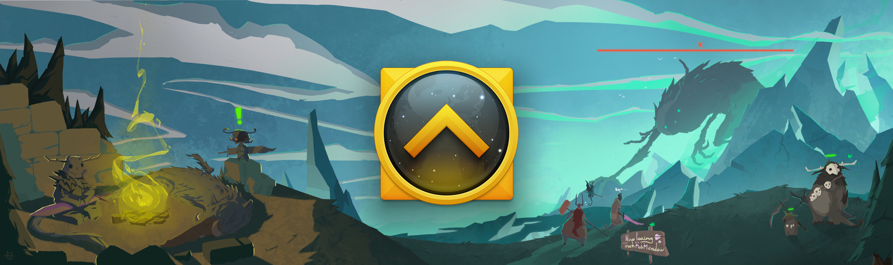][Ajour]

[Ajour] is a World of Warcraft addon manager written in Rust using [Iced] as GUI
library. The project is completely advertisement free, privacy respecting and
open source.

October updates include:

- Catalog support for installing addons.
- Beta, PTR support.
- Release channels on addons.
- CLI options to run Ajour headless.
- Community driven API.

Join the [Discord server](https://discord.com/invite/ajour) and say hi.

[][Ajour]

[Ajour]: https://getajour.com
[Iced]: https://github.com/hecrj/iced

### [Proton][Proton-Github] 5.13-1

In addition to adding Linux Support for more Windows-exclusive games,
Valve Software's wine-based translation layer for Linux: Proton now
includes Rust as part of its build system.
[Media Converter][Proton-Media-Converter-Github], is a Proton module
written in Rust as a gstreamer plugin to convert certain media encodings
from one format to another.

Doucmentation for building Proton is available on [Github][Proton-Github].
Further documentation on Media Converter and its source code is available
on the module's [repository][Proton-Media-Converter-Github]

[Proton-Github]: https://github.com/ValveSoftware/Proton
[Proton-Media-Converter-Github]: https://github.com/ValveSoftware/Proton/tree/proton_5.13/media-converter

## Popular Workgroup Issues in Github

<!-- Up to 10 links to interesting issues -->

## Meeting Minutes

<!-- Up to 10 most important notes + a link to the full details -->

[See all meeting issues][label_meeting] including full text notes
or [join the next meeting][join].

[label_meeting]: https://github.com/rust-gamedev/wg/issues?q=label%3Ameeting

## Requests for Contribution

<!-- Links to "good first issue"-labels or direct links to specific tasks -->

## Jobs

<!-- An optional section for new jobs related to Rust gamedev -->

## Bonus

<!-- Bonus section to make the newsletter more interesting
and highlight events from the past. -->

------

That's all news for today, thanks for reading!

Want something mentioned in the next newsletter?
[Send us a pull request][pr].

Also, subscribe to [@rust_gamedev on Twitter][@rust_gamedev]
or [/r/rust_gamedev subreddit][/r/rust_gamedev] if you want to receive fresh news!

<!--
TODO: Add real links and un-comment once this post is published
**Discussions of this post**:
[/r/rust](TODO),
[twitter](TODO).
-->

[/r/rust_gamedev]: https://reddit.com/r/rust_gamedev
[@rust_gamedev]: https://twitter.com/rust_gamedev
[pr]: https://github.com/rust-gamedev/rust-gamedev.github.io
