+++
title = "This Month in Rust GameDev #16 - November 2020"
date = 2020-12-02
transparent = true
draft = true
+++

<!-- Check the post with markdownlint-->

Welcome to the 16th issue of the Rust GameDev Workgroup's
monthly newsletter.
[Rust] is a systems language pursuing the trifecta:
safety, concurrency, and speed.
These goals are well-aligned with game development.
We hope to build an inviting ecosystem for anyone wishing
to use Rust in their development process!
Want to get involved? [Join the Rust GameDev working group!][join]

You can follow the newsletter creation process
by watching [the coordination issues][coordination].
Want something mentioned in the next newsletter?
[Send us a pull request][pr].
Feel free to send PRs about your own projects!

[Rust]: https://rust-lang.org
[join]: https://github.com/rust-gamedev/wg#join-the-fun
[pr]: https://github.com/rust-gamedev/rust-gamedev.github.io
[coordination]: https://github.com/rust-gamedev/rust-gamedev.github.io/issues?q=label%3Acoordination

[Rust]: https://rust-lang.org
[join]: https://github.com/rust-gamedev/wg#join-the-fun

Table of contents:

- [Last Call for Rust GameDev Survey](#last-call-for-rust-gamedev-survey)
- [Game Updates](#game-updates)
- [Learning Material Updates](#learning-material-updates)
- [Library & Tooling Updates](#library-tooling-updates)
- [Popular Workgroup Issues in Github](#popular-workgroup-issues-in-github)
- [Requests for Contribution](#requests-for-contribution)
- [Jobs](#jobs)

<!--
Ideal section structure is:

```
### [Title]


_image caption_

A paragraph or two with a summary and [useful links].

_Discussions:
[/r/rust](https://reddit.com/r/rust/todo),
[twitter](https://twitter.com/todo/status/123456)_

[Title]: https://first.link
[useful links]: https://other.link
```

If needed, a section can be split into subsections with a "------" delimiter.
-->

## Last Call for [Rust GameDev Survey][survey]

Our annual [Rust Game Development Ecosystem Survey][survey] will be closed
on Sunday at the end of this week, 6. December 2020.
It'll only take 10 minutes, and your responses help us
better understand the state of our ecosystem and where we
should try to focus our collective efforts.

[survey]: https://surveymonkey.com/r/F2JYRFF

## Game Updates

### [A/B Street][abstreet]


[A/B Street][abstreet] is a traffic simulation game exploring how small changes
to roads affect cyclists, transit users, pedestrians, and drivers. Any city
with OpenStreetMap coverage can be used!

Some of this month's updates:

- started a new tool to explore 15-minute neighborhoods;
- simpler process for [importing new cities][abstreet-new-cities];
- large internal refactoring for the GUI and initializing the simulation;

[abstreet]: https://abstreet.org
[abstreet-new-cities]: https://dabreegster.github.io/abstreet/howto/new_city.html

### [Veloren][veloren]


_Endless mountains to explore_

[Veloren][veloren] is an open world, open-source voxel RPG inspired by Dwarf
Fortress and Cube World.

In November, Veloren released 0.8! This is the largest version yet, with over
50k lines of code added. GamingOnLinux wrote [an
article][veloren-gamingonlinux-article] about the release. You can see the [full
changelog here][veloren-0.8-changelog]. Veloren also spoke at MiniDebConf #2,
you can watch [the recording here][veloren-minidebconf-talk]. In November, many
improvements were made to the UI, with map and buff updates. During the 0.8 code
freeze, many networking and combat bugs were fixed. The Veloren 0.8 release
party took place on the 28th and saw a peak of 112 players online, doubling the
previous record.

[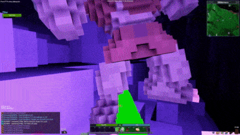][veloren-0.8-gameplay]
_0.8 gameplay video_

You can read more about specific topics from November:

- [First Time Contributing](https://veloren.net/devblog-92#first-time-contributing-by-ubruntu)
- [Community Spotlight](https://veloren.net/devblog-92#community-spotlight-kalculate)
- [Performance Analysis](https://veloren.net/devblog-93#performance-analysis-with-xmac94x)
- [0.8 Release Schedule](https://veloren.net/devblog-94#0-8-release-schedule)
- [Veloren Trailer Competition](https://veloren.net/devblog-94#veloren-screenshot-trailer-competition)
- [Chest of Goodies](https://veloren.net/devblog-94#chest-of-goodies-by-zesterer)
- [Iced Transition](https://veloren.net/devblog-94#iced-transition-by-imbris)
- [Particle Improvements](https://veloren.net/devblog-95#particle-improvements-by-timo)
- [Animal Attacks and AI](https://veloren.net/devblog-95#animal-attacks-and-ai-by-slipped-and-james)
- [Veloren 0.8 Launch](https://veloren.net/devblog-96#veloren-0-8-launch)
- [What People Are Saying About The Launch](https://veloren.net/devblog-96#what-people-are-saying-about-the-launch)
- [Idea Drop](https://veloren.net/devblog-96#idea-drop-by-u-o11c)

November's full weekly devlogs: "This Week In Veloren...":
[#92](https://veloren.net/devblog-92/),
[#93](https://veloren.net/devblog-93/),
[#94](https://veloren.net/devblog-94/),
[#95](https://veloren.net/devblog-95/),
[#96](https://veloren.net/devblog-96/),

In December, work will begin on 0.9. There are some discussions about larger
refactors in the codebase. Many new developers have joined and are getting up to
speed on contributing. Veloren will also reach its 100th blog post!


_The start of an adventure_

[veloren]: https://veloren.net
[veloren-0.8-changelog]: https://gitlab.com/veloren/veloren/-/blob/master/CHANGELOG.md#080-2020-11-28
[veloren-minidebconf-talk]: https://www.youtube.com/watch?v=76FPpOnshNw
[veloren-gamingonlinux-article]: https://www.gamingonlinux.com/2020/11/inspired-by-the-likes-of-cube-world-open-source-rpg-veloren-has-the-biggest-update-yet
[veloren-0.8-gameplay]: https://www.youtube.com/watch?v=TMYfrdiEJw4

### FBSim

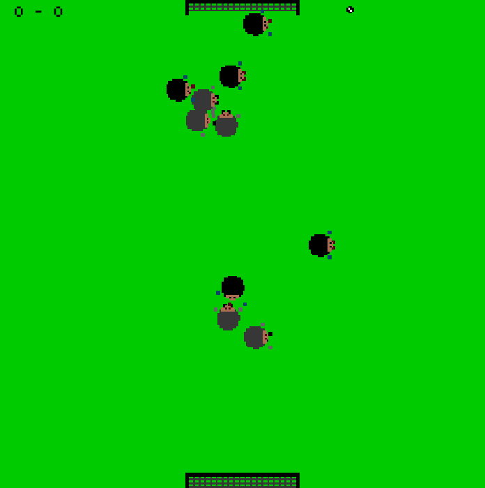
_FBSim running with default agents._

[FBSim] by [Ian Tayler] is a football/soccer game where you program the
players using Rust and try to beat a team controlled by another AI.

You can follow the [tutorial] for implementing your own simple AI for FBSim,
or you can look at the code directly, which can be found on the
[github repo]. FBSim is at an early stage of development so issues and
comments are welcome!

_Discussions:
[/r/rust_gamedev](https://reddit.com/r/rust_gamedev/comments/jz4x1f/fbsim/)_

[FBSim]: https://github.com/IanTayler/fbsim
[github repo]: https://github.com/IanTayler/fbsim
[Ian Tayler]: https://iantayler.com
[tutorial]: https://iantayler.com/2020/11/22/fbsim-football-playing-ai-agents-in-rust/

### [Antorum Online]

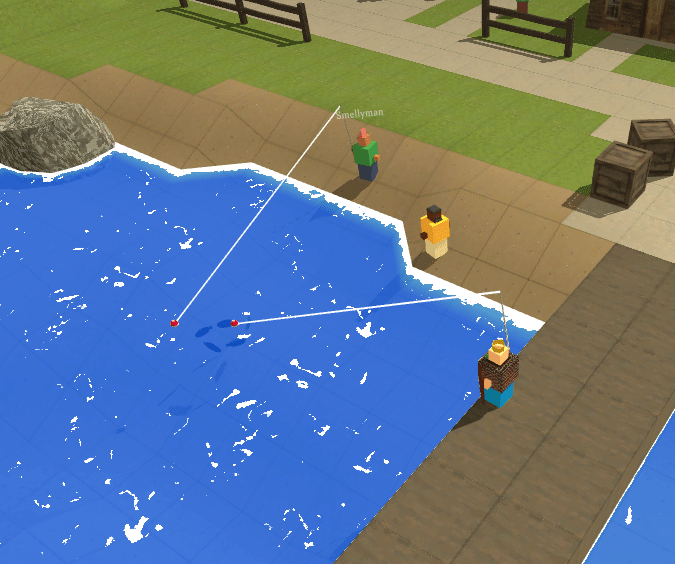

Antorum Online is a micro-multiplayer online role-playing game by [@dooskington].
The game server is written in Rust, and the official client is being developed in
Unity.

Many important changes and new features were implemented this month. Players can
now harvest plants and go fishing! There were also some tweaks to the world
engine to support named zones on the map.

- [23: Herbology](https://ratwizard.dev/dev-log/antorum/23)
- [24: Fishing](https://ratwizard.dev/dev-log/antorum/24)
- [25: Zones](https://ratwizard.dev/dev-log/antorum/25)

[Antorum Online]: https://ratwizard.dev/antorum
[@dooskington]: https://twitter.com/dooskington

### [rymd]

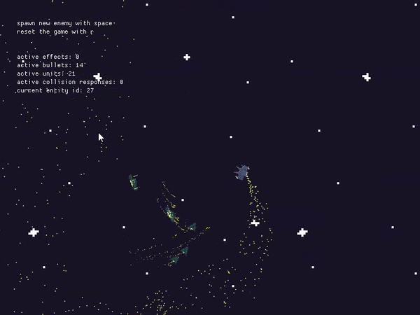

[rymd] by [@_profan] is a space shooter prototype made with [macroquad].

Intended as a test platform for trying out rust for prototyping games and
particularly for game AI programming purposes.

Development started at the end of October, recent additions include:

- Dynamic ship debris based on slicing source sprites into chunks.
- New hostile ship type, (ranger), which fires seeking missiles.
- New support ship type, (tech), which repairs friendly ships.
- Toggleable hitbox visualization.
- Still far too many particles.

[macroquad]: https://github.com/not-fl3/macroquad
[@_profan]: https://twitter.com/_profan
[rymd]: https://profan.itch.io/rymd

### [Shotcaller]

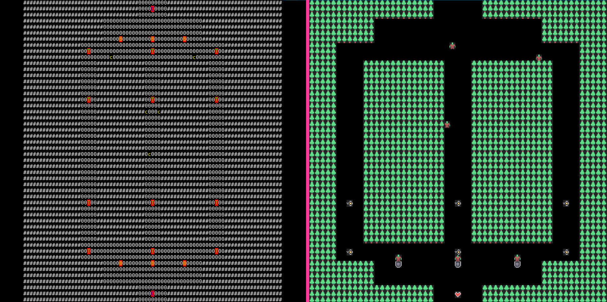
_ASCII and sprites versions of Shotcaller interface._

[Shotcaller] is a moddable RTS/MOBA game made with bracket-lib and specs.

This month [v0.3.1][shotcaller-v0-3-1] version was released.
Some of the updates:

- Kenney's micro-roguelike tileset was added.
- Leaders now have an item inventory.
- A handling system of stats effectors for items.
- New tutorials about creating leaders and items.
- A [fully functional web version][shotcaller-web], including tileset.

Contributions welcome: [try add a new Leader][shotcaller-issue-leader].

[Shotcaller]: https://github.com/amethyst/shotcaller
[shotcaller-v0-3-1]: https://github.com/amethyst/shotcaller/releases/tag/0.3.1
[shotcaller-web]: https://shotcaller.jojolepro.com/
[shotcaller-issue-leader]: https://github.com/amethyst/shotcaller/issues/6

### [Space Shooter]

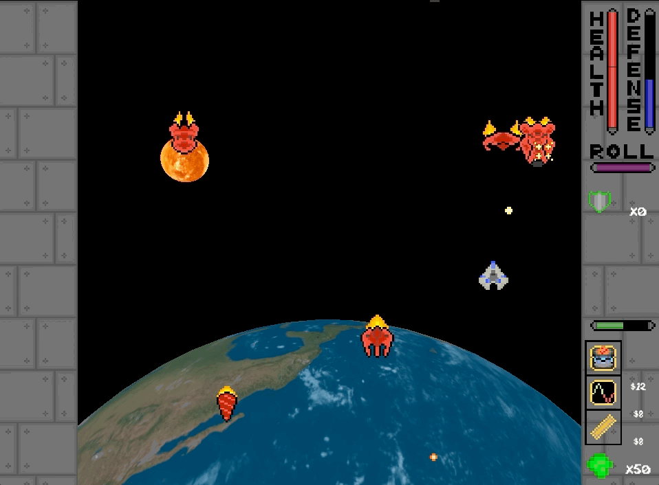

The [Space Shooter] project is a game in development by [Carlo Supina] and
[Micah Tigley]. It is a 2D "shoot-em-up" game that takes place in space and is
inspired by games like [Raiden] and [Binding of Isaac].

Exciting new additions have been made in November!

- Micah added a ["paused" text overlay] to provide visual indication for when
  the game is paused.
- Carlo added a [new armor system] that gives a chance for destroyed enemies to
  drop armor consumables that can block a single hit from any damage source.
- Work on a new [Missile Launcher enemy] has begun!

[Space Shooter]: https://github.com/amethyst/space_shooter_rs
[Carlo Supina]: https://twitter.com/carlosupina
[Micah Tigley]: https://twitter.com/micah_tigley
[Raiden]: https://wikipedia.org/wiki/Raiden_(video_game)
[Binding of Isaac]: https://wikipedia.org/wiki/The_Binding_of_Isaac_(video_game)
["paused" text overlay]: https://snipboard.io/ql60oz.jpg
[new armor system]: https://twitter.com/carlosupina/status/1331680041453953025
[Missile Launcher enemy]: https://github.com/amethyst/space_shooter_rs/pull/93

### [Game Off 2020][go-2020]

[Game Off][go-2020] is an annual game jam, where participants spend the month
of November creating games based on a secret theme.

Game Off 2020 theme was "MOONSHOT".
Here are some of the games made with Rust:

- ["War of the Moons"][go-wotm] by [@FrancoisMockers]
  ([source code][go-wotm-src]).

  > Your goal is to conquer the planet, but it's not possible until you
  > control all the moons. The end result is not completly what I wanted,
  > but it was a nice occasion to try [rapier] for physics and [lyon] to draw
  > shapes from [bevy].

  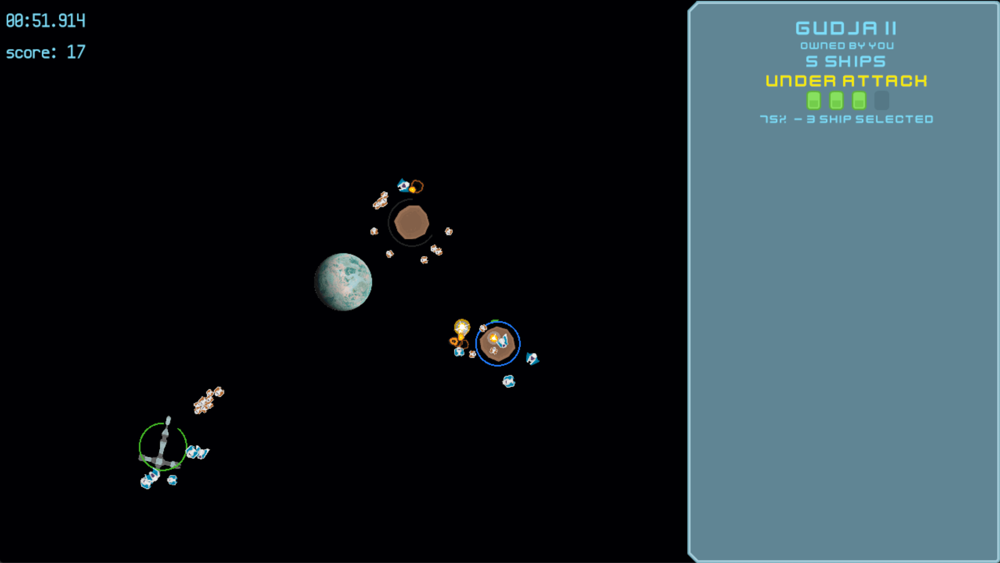

[go-2020]: https://itch.io/jam/game-off-2020
[go-wotm]: https://vleue.itch.io/wotm
[go-wotm-src]: https://github.com/mockersf/wotm
[@FrancoisMockers]: https://twitter.com/FrancoisMockers
[rapier]: https://rapier.rs
[lyon]: https://github.com/nical/lyon
[bevy]: https://bevyengine.org

## Learning Material Updates

### [Hands-on Rust][hands-on-rust]

[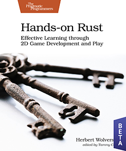][hands-on-rust]

["Hands-on Rust: Effective Learning through 2D Game Development and Play"][hands-on-rust]
by Herbert Wolverson is now in beta. The book teaches Rust through game development
examples, and is targeted at readers who have some experience with writing code
in other languages. It teaches beginner to intermediate-level Rust. It also teaches
high-level gamedev concepts, notably Entity-Component System (ECS) theory.

After walking you through installing Rust, a few simple examples teach the language
basics. Then you put these together to make "Flappy Dragon" - a simple Flappy Bird
clone. The book then changes gear and begins to build a dungeon crawler (roguelike)
with tile graphics. The first beta walks you through the basics, "Flappy Dragon"
and making an ECS-based dungeon crawler skeleton - focused on teaching basic Rust,
ECS composition and control flow. Beta 2 added health, a heads-up display, combat
and win/lose conditions - focused on making the user comfortable with Rust's
amazing iterator system. Beta 3 will add fields-of-view, more dungeon designs and
map theming - focused on teaching trait use and creation.

Beta 1 launched November 11th, Beta 2 launched November 25th. The next beta is
expected December 8th.

[hands-on-rust]: https://pragprog.com/titles/hwrust/hands-on-rust/

### [ECS scheduler thoughts, part 1]

[@Ratys] wrote an article about system schedulers in [ECS]. It contains
an overview of the scheduling problem itself, covers the constraints a solution
to it should consider, and dissects schedulers of [Bevy] engine and [`yaks`] as
examples.

[ECS scheduler thoughts, part 1]: https://ratysz.github.io/article/scheduling-1/
[@Ratys]: https://twitter.com/ratysz
[ECS]: https://en.wikipedia.org/wiki/Entity_component_system
[Bevy]: https://bevyengine.org/
[`yaks`]: https://crates.io/crates/yaks

### [Chess game in Rust using Bevy]


_Chess gameplay_

[@guimcaballero] published a tutorial on using Bevy 0.3 to make a Chess clone in
3d. Most of the concepts are explained along the way, from how to load meshes to
how to select pieces and board squares, using [bevy_mod_picking].

[Chess game in Rust using Bevy]: https://caballerocoll.com/blog/bevy-chess-tutorial/
[@guimcaballero]: https://twitter.com/guimcaballero
[bevy_mod_picking]: https://github.com/aevyrie/bevy_mod_picking/

### [Learn Wgpu][learn-wgpu]

Development of new tutorial content has slowed down due to wgpu still being in
development. [@sotrh] has committed to continue maintaining the project through
the comming version changes, and plans to add more new content when the API
solidifies. He with the help of other contributors such as GitHub user
[@kanerogers] worked through a series of issues to polish the repository before
the content freeze.
In addition to that he added a [compute pipeline showcase][learn-wgpu-compute]
and an [imgui showcase][learn-wgpu-imgui].

In other news @sotrh has started a [Patreon][@sotrh] to help fund research
and development on the Learn Wgpu site as well as other wgpu related projects.

You can learn more [on the Learn Wgpu news page][learn-wgpu-news].

[learn-wgpu]: https://sotrh.github.io/learn-wgpu
[learn-wgpu-compute]: https://sotrh.github.io/learn-wgpu/showcase/compute
[learn-wgpu-imgui]: https://sotrh.github.io/learn-wgpu/showcase/imgui-demo
[learn-wgpu-news]: https://sotrh.github.io/learn-wgpu/news
[@sotrh]: https://patreon.com/sotrh
[@kanerogers]: https://github.com/kanerogers

## Library & Tooling Updates

### [cargo-mobile]

[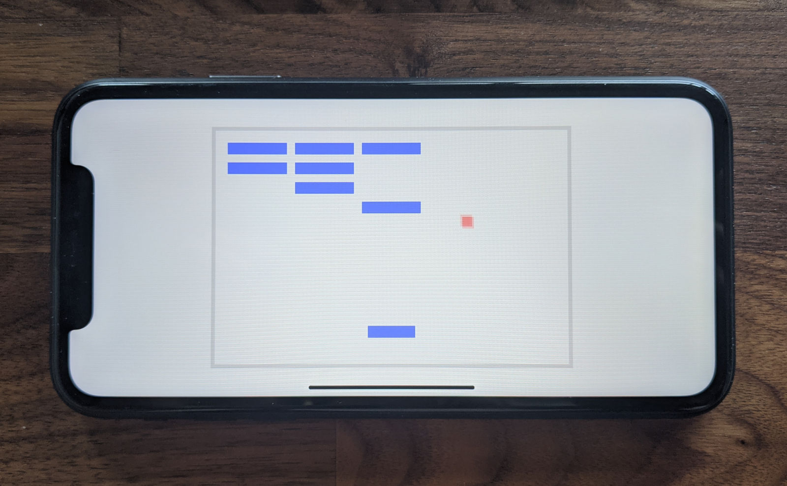][cargo-mobile]
_Bevy's Breakout example running on an iPhone XR_

[cargo-mobile] is a tool created by [Brainium Studios] to simplify Rust mobile
development. It generates Xcode and Android Studio projects, and provides handy
commands for building and deploying apps to iOS and Android devices.

[cargo-mobile]: https://dev.brainiumstudios.com/2020/11/24/cargo-mobile.html
[Brainium Studios]: http://www.brainiumstudios.com/site/index.html

### [profiling]

This month, [profiling] was released on crates.io. This crate provides a very
thin abstraction over instrumented profiling crates like `puffin`, `optick`,
`tracy`, and `superluminal-perf`.

Mark up your code like this:

```rust
#[profiling::function]
fn some_function() {
    burn_time(5);

    for i in 0..5 {
        profiling::scope!("Looped Operation");
        burn_time(1);
    }
}
```

And get visualizations like this (`optick` and `puffin` shown):

[](optick.jpeg)

[profiling]: https://crates.io/crates/profiling

### [rkyv]

[rkyv] is a zero-copy deserialization framework for Rust. It's similar to
FlatBuffers and Cap'n Proto and can be used for data storage and messaging.

It has a handful of features that make it stand out:

- No schema restrictions
- HashMap support out of the box
- Trait object support through the [`rkyv_dyn`] crate
- Validation through the [`bytecheck`] crate, suitable for untrusted and
potentially malicious data
- Safe mutable archives with pinning

Reddit user [vlmutolo] also made a [toy benchmark] comparing rkyv against serde
and bincode and found that rkyv had promising initial numbers:

```text
serialize (bincode):    89 ns/iter
serialize (rkyv):       86 ns/iter

deserialize (bincode):  118 ns/iter
deserialize (rkyv):     16 ns/iter
```

A write-up on the [architecture and internals of rkyv] is also available.

_Discussions:
[/r/rust (v0.1)](https://www.reddit.com/r/rust/comments/jss6h4/rkyv_a_zerocopy_deserialization_framework_for_rust/),
[/r/rust (v0.2)](https://www.reddit.com/r/rust/comments/jx32e8/rkyv_02_and_bytecheck_validation_mutable_archives/)_

[rkyv]: https://github.com/djkoloski/rkyv
[`rkyv_dyn`]: https://docs.rs/rkyv_dyn
[`bytecheck`]: https://github.com/djkoloski/bytecheck
[vlmutolo]: https://www.reddit.com/r/rust/comments/jx32e8/rkyv_02_and_bytecheck_validation_mutable_archives/gcyfoqc
[toy benchmark]: https://git.sr.ht/~vlmutolo/rkyv-bench/tree/master/src/main.rs
[architecture and internals of rkyv]: https://davidkoloski.me/blog/rkyv-architecture/

### [assets_manager] v0.4

[assets_manager] provides an convenient way to work with external files, making
ressources caching and hot-reloading easy and straightforward.

This month was released version 0.4.0, bringing loads of improvements.

- A `Source` trait, to load assets from anywhere. It makes the crate usable in
  WebAssembly.
- Assets that can load other assets, with a transparent integration with
  hot-reloading. Using a manifest file has never been so easy !
- Improved perfomances
- See the [full changelog][assets_manager_log] for more informations.

[assets_manager]: https://github.com/a1phyr/assets_manager
[assets_manager_log]: https://github.com/a1phyr/assets_manager/releases/tag/v0.4.0

### [rib]


Parsing a 3D model file and understanding the different links between bone
matrices, keyframes and vertices is a task that can take a lot of time and
motivation of the developer. On top of that, combining the different bone
transform matrices for the current frame is often error prone.

[rib] is an attempt to tackle these problems and might help you save time.
Current features of [rib] include:

- Support of collada files coming from the latest Blender version.
- Precomputation of the bone matrices expressed in the world space so that you
  just have to pass it to your shader for traditional GPU skinning.
- Interpolation between keyframes
- (De)/serialization in binary thanks to [bincode]

[rib] can be greatly extended, for example with the support of other format
handling skeleton data, such as the [glTF] format.
Contributions are more than welcome.

[rib]: https://github.com/bmatthieu3/rib
[bincode]: https://github.com/servo/bincode
[glTF]: https://github.com/KhronosGroup/glTF/blob/master/README.md

### [Kira]

[Kira] by [@tesselode] is an audio library designed to help create expressive
audio for games. It aims to fill the holes in many game engines' built-in audio
APIs with features for creating seamless music loops and scripting audio events.

v0.2.0 is coming out soon with an Arrangements feature for creating complex pieces
out of individual sounds, tween easing, panning support, and workflow improvements.

[Kira]: https://github.com/tesselode/kira
[@tesselode]: https://twitter.com/tesselode

_Discussions:
[/r/rust](https://reddit.com/r/rust/comments/jxd9zz/announcing_kira_dynamic_audio_library_for_games/),
[twitter](https://twitter.com/tesselode/status/1329559760111357954)_

### [gfx-rs] and [wgpu]


The gfx-rs team has published a post ["The Big Picture"][gfx-post] providing
the overview of all projects in the works, and how they are connected to each other.

[wgpu] has moved from [gfx-extras] to the new [gpu-alloc] and [gpu-descriptor]
libraries by [@zakarumych]. These are backend-agnostic, which allows `wgpu`
to now depend on `gfx-hal` directly without intermediates. Patching [gfx-rs]
will now be easier, without the need to release every little change.

Finally, all the latest [wgpu] code has landed into Gecko, and new
features and fixes are implemented in Firefox. That allows it to run
most of the updated [WebGPU samples][wgpu-samples].

[gfx-rs]: https://github.com/gfx-rs/gfx
[wgpu]: https://github.com/gfx-rs/wgpu
[gfx-post]: https://gfx-rs.github.io/2020/11/16/big-picture.html
[gfx-extras]: https://github.com/gfx-rs/gfx-extras
[@zakarumych]: https://github.com/zakarumych
[gpu-alloc]: https://github.com/zakarumych/gpu-alloc
[gpu-descriptor]: https://github.com/zakarumych/gpu-descriptor
[wgpu-samples]: https://austineng.github.io/webgpu-samples

### [KAS] v0.6 and [KAS-text] v0.2

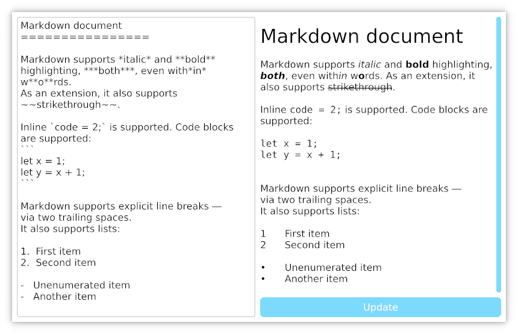
_Markdown parsing demo_

[KAS] by [@dhardy] is a general purpose UI toolkit; its
initial aim is "old school" desktop apps with good keyboard and touchscreen
support. Unlike many modern immediate-mode UIs, KAS's widgets retain state,
allowing minimal per-frame updates. KAS supports embedded WebGPU graphics now,
and plans to support embedded usage and additional rendering systems.

[KAS-text] v0.2 saw a significant revision to its API, including support for
rich text (bold, italic, underline, size and some layout improvements).
[KAS] v0.6 pulls in those changes and adds a few fixes and QoL improvements.

[KAS]: https://github.com/kas-gui/kas
[KAS-text]: https://github.com/kas-gui/kas-text
[@dhardy]: https://github.com/dhardy

### [Dotrix]

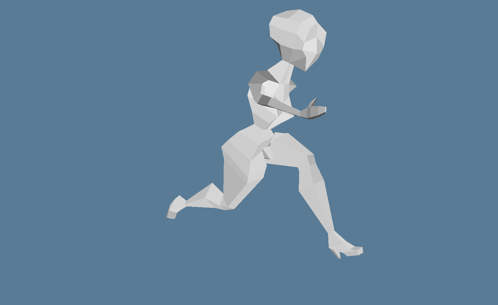
_A screenshot of running low-poly female model_

The goal of [Dotrix] is to become a 3D engine for the new RPG project. The
engine is free and open source, delivering a set of common high-level features
like skeletal animation, skybox, terrain, camera controlling, input mapping and
many others. It is built on top of the
[wgpu](https://github.com/gfx-rs/wgpu-rs/) with an ECS core which is a part of
the engine.

Currently supported features:

- Linear ECS with systems as simple functions, that can have optional context
- Import of textures from PNG files
- Import of multiple assets from GLTF files (textures, meshes, skins and
animations)
- FPS and delta time counters
- Rendering of meshes and simple scenes with light and camera controls
- Rendering of skeletal animations
- 3 showcase demo applications

Next in sprint:

- Input management and mapping
- Full camera control with mouse
- Skybox renderer

[Dotrix]: https://github.com/lowenware/dotrix
[Developer's Twitter]: https://twitter.com/lowenware
[Developer's Discrod]: https://discord.gg/DrzwBysNRd

### [Tetra]

[Tetra] is a simple 2D game framework, inspired by XNA and Raylib. This month,
versions 0.5.3 and 0.5.4 were released, with some frequently requested features:

- A `Mesh` API, allowing users to create arbitary 2D geometry
- Experimental support for high-DPI rendering

There has also been numerous bug fixes and documentation improvements. For full
details and a list of breaking changes, see the [changelog][tetra-changelog].

[tetra]: https://github.com/17cupsofcoffee/tetra
[tetra-changelog]: https://github.com/17cupsofcoffee/tetra/blob/main/CHANGELOG.md

### [ogmo3]

[ogmo3] is a Rust crate for parsing projects and levels created with
[Ogmo Editor 3]. This month, version 0.1 was released, adding serialization
support, and helper methods for unpacking layer data. The [sample code][ogmo3-sample]
has also been updated to show the new helpers in action.

[ogmo3]: https://github.com/17cupsofcoffee/ogmo3
[Ogmo Editor 3]: https://ogmo-editor-3.github.io/
[ogmo3-sample]: https://github.com/17cupsofcoffee/ogmo3/blob/main/examples/sample.rs

### [ggez]

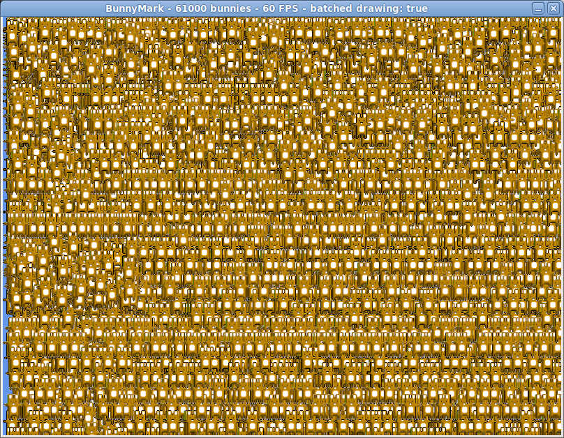
_ggez bunnymark - 60,000 buns at 60 FPS_

[ggez] is a 2D game framework inspired by Love2D. The project is chugging
along getting everything prepared for a 0.6 release at the end of 2020,
and a lot of work has been done in the last month:

- All major dependencies have been updated, including a long-overdue
  update to `winit` 0.23.
- Over a dozen pull requests have been merged, large and small.
- A bunch of old issues have been cleaned up.

Major features to look forward to include far better math performance, a
`MeshBatch` type, better ergonomics on Linux Wayland, and more. There's
lots of work still to be done though. A bunch of issues are out of date
and need triage, docs need to be proofread, and especially examples need
be updated and tested on every platform imaginable. Try out the `devel`
branch and give it a go!

[ggez]: https://github.com/ggez/ggez/

### [rg3d]

[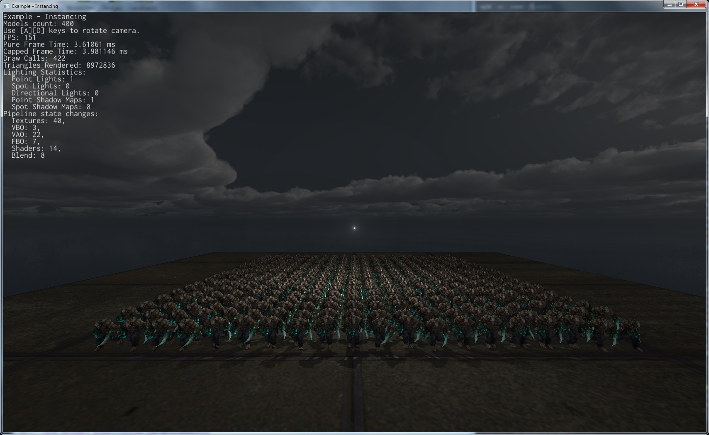][rg3d_twit]

[rg3d] is a game engine that aims to be easy to use and provide large set
of out-of-box features. Some of the recent updates:

- Migrated to nalgebra from custom linear algebra.
- Replaced custom physics engine with Rapier.
- Implemented sound backend for macOS.
- Environment mapping - now objects can have reflections.
- Implemented geometry instancing - now you can render tons of objects with
low overhead.
- Performance improvements.
- Added [gobo] for spot lights.
- Added CPU lightmapper - it is possible now to "bake" static lighting
into a texture to improve performance.
- Lots of other bugfixes and improvements.

Join the [rg3d's Discord channel][rg3d_discord]
or follow [Dmitry Stepanov on twitter][rg3d_twitter].

[rg3d]: https://github.com/mrDIMAS/rg3d
[rg3d_twit]: https://twitter.com/DmitryS36934349/status/1328797761874046977
[rg3d_discord]: https://discord.gg/xENF5Uh
[rg3d_twitter]: https://twitter.com/DmitryS36934349
[gobo]: https://en.wikipedia.org/wiki/Gobo_(lighting)

### [F1 Telemetry TUI]

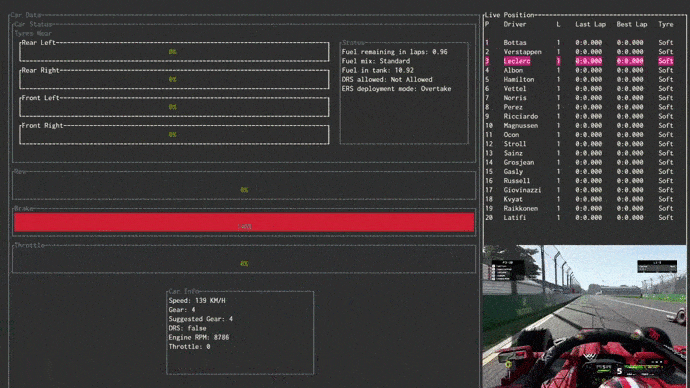

[F1 Telemetry TUI] by [@aldidana] is a terminal telemetry tool for F1 video games.

_Discussions:
[Twitter](https://twitter.com/aldidana/status/1323185465319596032)_

[F1 Telemetry TUI]: https://github.com/aldidana/f1-telemetry-tui
[@aldidana]: https://github.com/aldidana

### [bevmnist][bevmnist-itch.io]

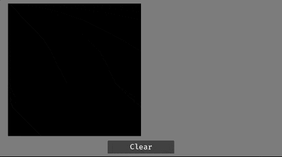
_Running through all digits_

[bevmnist][bevmnist-itch.io] by [@FrancoisMockers] is a PoC for running
inferences from a neural network in a game made with [bevy], that can run in
WASM (source code on [github][bevmnist-github]).

Using [tract], the goal was to test running neural network inferences from a
game. [MNIST handwritten digits classification][MNIST] is the "hello world" of
neural networks, and has small enough networks available in [onnx] format that
can run in real time in WASM. This project also has github actions that will
build and release a [bevy] game to itch.io for Linux, macOS, Windows and WASM.

[bevmnist-github]: https://github.com/vleue/bevmnist
[bevmnist-itch.io]: https://vleue.itch.io/bevmnist-poc
[@FrancoisMockers]: https://twitter.com/FrancoisMockers
[MNIST]: http://yann.lecun.com/exdb/mnist/
[onnx]: https://onnx.ai
[bevy]: https://bevyengine.org
[tract]: https://github.com/sonos/tract

## Popular Workgroup Issues in Github

<!-- Up to 10 links to interesting issues -->

## Requests for Contribution

<!-- Links to "good first issue"-labels or direct links to specific tasks -->

## Jobs

<!-- An optional section for new jobs related to Rust gamedev -->

------

That's all news for today, thanks for reading!

Want something mentioned in the next newsletter?
[Send us a pull request][pr].

Also, subscribe to [@rust_gamedev on Twitter][@rust_gamedev]
or [/r/rust_gamedev subreddit][/r/rust_gamedev] if you want to receive fresh news!

<!--
TODO: Add real links and un-comment once this post is published
**Discussions of this post**:
[/r/rust](TODO),
[twitter](TODO).
-->

[/r/rust_gamedev]: https://reddit.com/r/rust_gamedev
[@rust_gamedev]: https://twitter.com/rust_gamedev
[pr]: https://github.com/rust-gamedev/rust-gamedev.github.io
