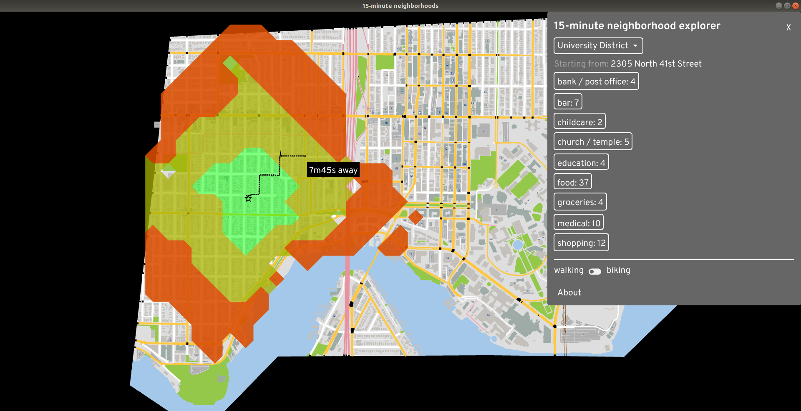
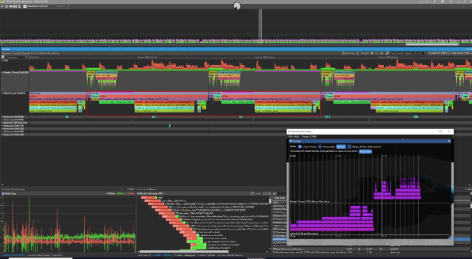
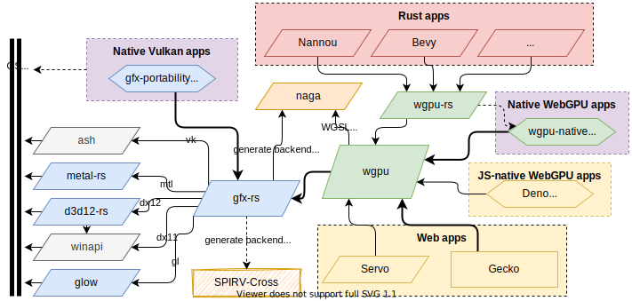

+++
title = "This Month in Rust GameDev #16 - November 2020"
date = 2020-12-02
transparent = true
draft = true
+++

<!-- Check the post with markdownlint-->

Welcome to the 16th issue of the Rust GameDev Workgroup's
monthly newsletter.
[Rust] is a systems language pursuing the trifecta:
safety, concurrency, and speed.
These goals are well-aligned with game development.
We hope to build an inviting ecosystem for anyone wishing
to use Rust in their development process!
Want to get involved? [Join the Rust GameDev working group!][join]

You can follow the newsletter creation process
by watching [the coordination issues][coordination].
Want something mentioned in the next newsletter?
[Send us a pull request][pr].
Feel free to send PRs about your own projects!

[Rust]: https://rust-lang.org
[join]: https://github.com/rust-gamedev/wg#join-the-fun
[pr]: https://github.com/rust-gamedev/rust-gamedev.github.io
[coordination]: https://github.com/rust-gamedev/rust-gamedev.github.io/issues?q=label%3Acoordination

[Rust]: https://rust-lang.org
[join]: https://github.com/rust-gamedev/wg#join-the-fun

Table of contents:

- [Game Updates](#game-updates)
- [Learning Material Updates](#learning-material-updates)
- [Library & Tooling Updates](#library-tooling-updates)
- [Popular Workgroup Issues in Github](#popular-workgroup-issues-in-github)
- [Requests for Contribution](#requests-for-contribution)
- [Jobs](#jobs)

<!--
Ideal section structure is:

```
### [Title]


_image caption_

A paragraph or two with a summary and [useful links].

_Discussions:
[/r/rust](https://reddit.com/r/rust/todo),
[twitter](https://twitter.com/todo/status/123456)_

[Title]: https://first.link
[useful links]: https://other.link
```

If needed, a section can be split into subsections with a "------" delimiter.
-->

## Game Updates

### [A/B Street][abstreet]



[A/B Street][abstreet] is a traffic simulation game exploring how small changes
to roads affect cyclists, transit users, pedestrians, and drivers. Any city
with OpenStreetMap coverage can be used!

Some of this month's updates:

- started a new tool to explore 15-minute neighborhoods;
- simpler process for [importing new cities][abstreet-new-cities];
- large internal refactoring for the GUI and initializing the simulation;

[abstreet]: https://abstreet.org
[abstreet-new-cities]: https://dabreegster.github.io/abstreet/howto/new_city.html

## Learning Material Updates

### [Learn Wgpu][learn-wgpu]

Development of new tutorial content has slowed down due to wgpu still being in
development. [@sotrh] has committed to continue maintaining the project through
the comming version changes, and plans to add more new content when the API
solidifies. He with the help of other contributors such as GitHub user
[@kanerogers] worked through a series of issues to polish the repository before
the content freeze.
In addition to that he added a [compute pipeline showcase][learn-wgpu-compute]
and an [imgui showcase][learn-wgpu-imgui].

In other news @sotrh has started a [Patreon][@sotrh] to help fund research
and development on the Learn Wgpu site as well as other wgpu related projects.

You can learn more [on the Learn Wgpu news page][learn-wgpu-news].

[learn-wgpu]: https://sotrh.github.io/learn-wgpu
[learn-wgpu-compute]: https://sotrh.github.io/learn-wgpu/showcase/compute
[learn-wgpu-imgui]: https://sotrh.github.io/learn-wgpu/showcase/imgui-demo
[learn-wgpu-news]: https://sotrh.github.io/learn-wgpu/news
[@sotrh]: https://patreon.com/sotrh
[@kanerogers]: https://github.com/kanerogers

## Library & Tooling Updates

### [profiling]

This month, [profiling] was released on crates.io. This crate provides a very
thin abstraction over instrumented profiling crates like `puffin`, `optick`,
`tracy`, and `superluminal-perf`.

Mark up your code like this:

```rust
#[profiling::function]
fn some_function() {
    burn_time(5);

    for i in 0..5 {
        profiling::scope!("Looped Operation");
        burn_time(1);
    }
}
```

And get visualizations like this (`optick` and `puffin` shown):

[](optick.jpeg)

[profiling]: https://crates.io/crates/profiling

### [rkyv]

[rkyv] is a zero-copy deserialization framework for Rust. It's similar to
FlatBuffers and Cap'n Proto and can be used for data storage and messaging.

It has a handful of features that make it stand out:

- No schema restrictions
- HashMap support out of the box
- Trait object support through the [`rkyv_dyn`] crate
- Validation through the [`bytecheck`] crate, suitable for untrusted and
potentially malicious data
- Safe mutable archives with pinning

Reddit user [vlmutolo] also made a [toy benchmark] comparing rkyv against serde
and bincode and found that rkyv had promising initial numbers:

```text
serialize (bincode):    89 ns/iter
serialize (rkyv):       86 ns/iter

deserialize (bincode):  118 ns/iter
deserialize (rkyv):     16 ns/iter
```

A write-up on the [architecture and internals of rkyv] is also available.

_Discussions:
[/r/rust (v0.1)](https://www.reddit.com/r/rust/comments/jss6h4/rkyv_a_zerocopy_deserialization_framework_for_rust/),
[/r/rust (v0.2)](https://www.reddit.com/r/rust/comments/jx32e8/rkyv_02_and_bytecheck_validation_mutable_archives/)_

[rkyv]: https://github.com/djkoloski/rkyv
[`rkyv_dyn`]: https://docs.rs/rkyv_dyn
[`bytecheck`]: https://github.com/djkoloski/bytecheck
[vlmutolo]: https://www.reddit.com/r/rust/comments/jx32e8/rkyv_02_and_bytecheck_validation_mutable_archives/gcyfoqc
[toy benchmark]: https://git.sr.ht/~vlmutolo/rkyv-bench/tree/master/src/main.rs
[architecture and internals of rkyv]: https://davidkoloski.me/blog/rkyv-architecture/

### [gfx-rs] and [wgpu]



The gfx-rs team has published a post ["The Big Picture"][gfx-post] providing
the overview of all projects in the works, and how they are connected to each other.

[wgpu] has moved from [gfx-extras] to the new [gpu-alloc] and [gpu-descriptor]
libraries by [@zakarumych]. These are backend-agnostic, which allows `wgpu`
to now depend on `gfx-hal` directly without intermediates. Patching [gfx-rs]
will now be easier, without the need to release every little change.

Finally, all the latest [wgpu] code has landed into Gecko, and new
features and fixes are implemented in Firefox. That allows it to run
most of the updated [WebGPU samples][wgpu-samples].

[gfx-rs]: https://github.com/gfx-rs/gfx
[wgpu]: https://github.com/gfx-rs/wgpu
[gfx-post]: https://gfx-rs.github.io/2020/11/16/big-picture.html
[gfx-extras]: https://github.com/gfx-rs/gfx-extras
[@zakarumych]: https://github.com/zakarumych
[gpu-alloc]: https://github.com/zakarumych/gpu-alloc
[gpu-descriptor]: https://github.com/zakarumych/gpu-descriptor
[wgpu-samples]: https://austineng.github.io/webgpu-samples

### [Tetra]

[Tetra] is a simple 2D game framework, inspired by XNA and Raylib. This month,
versions 0.5.3 and 0.5.4 were released, with some frequently requested features:

- A `Mesh` API, allowing users to create arbitary 2D geometry
- Experimental support for high-DPI rendering

There has also been numerous bug fixes and documentation improvements. For full
details and a list of breaking changes, see the [changelog][tetra-changelog].

[tetra]: https://github.com/17cupsofcoffee/tetra
[tetra-changelog]: https://github.com/17cupsofcoffee/tetra/blob/main/CHANGELOG.md

### [ogmo3]

[ogmo3] is a Rust crate for parsing projects and levels created with
[Ogmo Editor 3]. This month, version 0.1 was released, adding serialization
support, and helper methods for unpacking layer data. The [sample code][ogmo3-sample]
has also been updated to show the new helpers in action.

[ogmo3]: https://github.com/17cupsofcoffee/ogmo3
[Ogmo Editor 3]: https://ogmo-editor-3.github.io/
[ogmo3-sample]: https://github.com/17cupsofcoffee/ogmo3/blob/main/examples/sample.rs

## Popular Workgroup Issues in Github

<!-- Up to 10 links to interesting issues -->

## Requests for Contribution

<!-- Links to "good first issue"-labels or direct links to specific tasks -->

## Jobs

<!-- An optional section for new jobs related to Rust gamedev -->

------

That's all news for today, thanks for reading!

Want something mentioned in the next newsletter?
[Send us a pull request][pr].

Also, subscribe to [@rust_gamedev on Twitter][@rust_gamedev]
or [/r/rust_gamedev subreddit][/r/rust_gamedev] if you want to receive fresh news!

<!--
TODO: Add real links and un-comment once this post is published
**Discussions of this post**:
[/r/rust](TODO),
[twitter](TODO).
-->

[/r/rust_gamedev]: https://reddit.com/r/rust_gamedev
[@rust_gamedev]: https://twitter.com/rust_gamedev
[pr]: https://github.com/rust-gamedev/rust-gamedev.github.io
