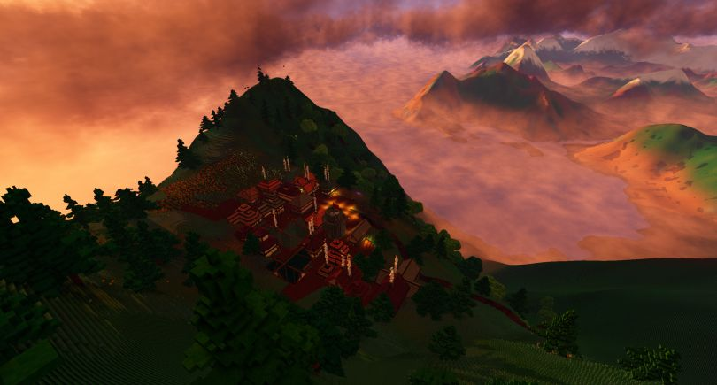

+++
title = "This Month in Rust GameDev #17 - December 2020"
date = 2021-01-04
transparent = true
draft = false
+++

<!-- Check the post with markdownlint-->

Welcome to the 17th issue of the Rust GameDev Workgroup's
monthly newsletter.
[Rust] is a systems language pursuing the trifecta:
safety, concurrency, and speed.
These goals are well-aligned with game development.
We hope to build an inviting ecosystem for anyone wishing
to use Rust in their development process!
Want to get involved? [Join the Rust GameDev working group!][join]

You can follow the newsletter creation process
by watching [the coordination issues][coordination].
Want something mentioned in the next newsletter?
[Send us a pull request][pr].
Feel free to send PRs about your own projects!

[rust]: https://rust-lang.org
[join]: https://github.com/rust-gamedev/wg#join-the-fun
[pr]: https://github.com/rust-gamedev/rust-gamedev.github.io
[coordination]: https://github.com/rust-gamedev/rust-gamedev.github.io/issues?q=label%3Acoordination
[rust]: https://rust-lang.org
[join]: https://github.com/rust-gamedev/wg#join-the-fun

Table of contents:

- [Game Updates](#game-updates)
- [Learning Material Updates](#learning-material-updates)
- [Library & Tooling Updates](#library-tooling-updates)
- [Popular Workgroup Issues in Github](#popular-workgroup-issues-in-github)
- [Requests for Contribution](#requests-for-contribution)
- [Jobs](#jobs)

<!--
Ideal section structure is:

```
### [Title]


_image caption_

A paragraph or two with a summary and [useful links].

_Discussions:
[/r/rust](https://reddit.com/r/rust/todo),
[twitter](https://twitter.com/todo/status/123456)_

[Title]: https://first.link
[useful links]: https://other.link
```

If needed, a section can be split into subsections with a "------" delimiter.
-->

## Game Updates

### [Way of Rhea has a Discord!][wor-discord]


_Updated visuals for interactive items._

[Way of Rhea][wor-website] is a puzzle platformer that takes place in a world
where you can only interact with objects that match your current color. The game
is being developed in a custom built Rust game engine and hot swappable
scripting language.

This month's updates:

- More progress has been made on the hub world! The game is no longer fully
  linear.
- All interactive elements are getting a visual update, pictured above.
- The devs have created [a Discord server][wor-discord] where you can hang out,
  stay up to date on the latest developments, and if you're interested, chat
  about the implementation (see the `#tech` channel.)

[wor-discord]: https://discord.gg/JGeVt5XwPP
[wor-website]: https://anthropicstudios.com/way-of-rhea

### [Veloren][veloren]


_A village over the river_

[Veloren][veloren] is an open world, open-source voxel RPG inspired by Dwarf
Fortress and Cube World.

In December, Veloren released its 100th devblog! This edition included sections
from 20 contributors, making it by far the longest devblog yet. Lots of work was
done on the economic simulation. Gliders physics were overhauled, and new models
were created for it. Reflective water was added to the level of detail system,
making far-off lakes look much better. A plugin system is in the prototyping
phase. This will eventually allow mods to be added to the game. Skill trees are
making progress as well, and a crafting overhaul is in the works. Trees are
moving towards becoming procedurally generated. An aura system was added for
radial buffs around entities, for example, being near a fireplace now allows you
to heal.

[][veloren-0.8-gameplay]
_New glider physics video_

You can read more about specific topics from December:

[Worldgen Meeting](https://veloren.net/devblog-97#worldgen-meeting-by-zesterer) |
[Economic Simulation Pt.1](https://veloren.net/devblog-98#economic-simulation-update-by-christof) |
[Economic Simulation Pt.1](https://veloren.net/devblog-99#economic-simulation-by-christof) |
[Blog Preface](https://veloren.net/devblog-100#preface-by-angelonfira) |
[A Veloren Short Story](https://veloren.net/devblog-100#a-veloren-short-story-by-zesterer) |
[UI Progress](https://veloren.net/devblog-100#ui-progress-by-pfau) |
[Glider Physics](https://veloren.net/devblog-100#glider-physics-by-slipped) |
[Controller Support](https://veloren.net/devblog-100#mckol-s-veloren-journey) |
[Modeling Pt. 1](https://veloren.net/devblog-100#modeling-with-gemu) |
[Modeling Pt. 2](https://veloren.net/devblog-100#modeling-with-snowram) |
[Persistence and Inventory](https://veloren.net/devblog-100#work-by-xvar) |
[Combat Improvements](https://veloren.net/devblog-100#combat-improvements-by-james) |
[Starting With Audio](https://veloren.net/devblog-100#starting-with-audio-by-badbbad) |
[Network Analysis](https://veloren.net/devblog-100#network-analysis-by-xmac94x) |
[The State of Graphics and UI](https://veloren.net/devblog-100#the-state-of-graphics-and-ui-by-imbris) |
[Skill Trees](https://veloren.net/devblog-100#skill-trees-by-sam) |
[Procedural Trees](https://veloren.net/devblog-100#procedural-trees-by-ccgauche) |
[New Website Design](https://veloren.net/devblog-100#new-website-design-by-songtronix) |
[Why Veloren is Special to Me](https://veloren.net/devblog-100#why-veloren-is-special-to-me-by-christof) |
[Getting Into RTSim](https://veloren.net/devblog-100#getting-into-rtsim-by-ubruntu) |
[Finding Veloren](https://veloren.net/devblog-100#finding-veloren-by-yusdacra) |
[New Developer Experience](https://veloren.net/devblog-100#new-developer-experience-by-entropy) |
[Looking to the Graphical Future](https://veloren.net/devblog-100#looking-to-the-graphical-future-by-sharp) |
[Combat System Design](https://veloren.net/devblog-100#combat-system-design-by-silentium)

December's full weekly devlogs: "This Week In Veloren...":
[#97](https://veloren.net/devblog-97/),
[#98](https://veloren.net/devblog-98/),
[#99](https://veloren.net/devblog-99/),
[#100](https://veloren.net/devblog-100/),

In January, work will continue on 0.9. Work will be done on economic simulation,
world simulation, and combat systems. New developers are joining the project
every month, and development is moving forward quickly.


_The village of Mast overlooking the cove_

[veloren]: https://veloren.net
[veloren-0.8-changelog]: https://gitlab.com/veloren/veloren/-/blob/master/CHANGELOG.md#080-2020-11-28
[veloren-minidebconf-talk]: https://www.youtube.com/watch?v=76FPpOnshNw
[veloren-gamingonlinux-article]: https://www.gamingonlinux.com/2020/11/inspired-by-the-likes-of-cube-world-open-source-rpg-veloren-has-the-biggest-update-yet
[veloren-0.8-gameplay]: https://www.youtube.com/watch?v=8WWVe1cIu7I

## Learning Material Updates

## Library & Tooling Updates

### [Tetra]

[Tetra] is a simple 2D game framework, inspired by XNA and Raylib. This month,
versions 0.5.5 and 0.5.6 were released, with various improvements:

- Customizable `Mesh` colors and winding orders
- Enabling/disabling the user's screen saver
- Improved CPU usage on some devices

For full details and a list of breaking changes, see the
[changelog][tetra-changelog].

[tetra]: https://github.com/17cupsofcoffee/tetra
[tetra-changelog]: https://github.com/17cupsofcoffee/tetra/blob/main/CHANGELOG.md

## Popular Workgroup Issues in Github

<!-- Up to 10 links to interesting issues -->

## Requests for Contribution

<!-- Links to "good first issue"-labels or direct links to specific tasks -->

## Jobs

<!-- An optional section for new jobs related to Rust gamedev -->

---

That's all news for today, thanks for reading!

Want something mentioned in the next newsletter?
[Send us a pull request][pr].

Also, subscribe to [@rust_gamedev on Twitter][@rust_gamedev]
or [/r/rust_gamedev subreddit][/r/rust_gamedev] if you want to receive fresh news!

<!--
TODO: Add real links and un-comment once this post is published
**Discussions of this post**:
[/r/rust](TODO),
[twitter](TODO).
-->

[/r/rust_gamedev]: https://reddit.com/r/rust_gamedev
[@rust_gamedev]: https://twitter.com/rust_gamedev
[pr]: https://github.com/rust-gamedev/rust-gamedev.github.io
