+++
title = "This Month in Rust GameDev #17 - December 2020"
date = 2021-01-04
transparent = true
draft = true
+++

<!-- Check the post with markdownlint-->

Welcome to the 17th issue of the Rust GameDev Workgroup's
monthly newsletter.
[Rust] is a systems language pursuing the trifecta:
safety, concurrency, and speed.
These goals are well-aligned with game development.
We hope to build an inviting ecosystem for anyone wishing
to use Rust in their development process!
Want to get involved? [Join the Rust GameDev working group!][join]

You can follow the newsletter creation process
by watching [the coordination issues][coordination].
Want something mentioned in the next newsletter?
[Send us a pull request][pr].
Feel free to send PRs about your own projects!

[Rust]: https://rust-lang.org
[join]: https://github.com/rust-gamedev/wg#join-the-fun
[pr]: https://github.com/rust-gamedev/rust-gamedev.github.io
[coordination]: https://github.com/rust-gamedev/rust-gamedev.github.io/issues?q=label%3Acoordination

[Rust]: https://rust-lang.org
[join]: https://github.com/rust-gamedev/wg#join-the-fun

Table of contents:

- [Game Updates](#game-updates)
- [Learning Material Updates](#learning-material-updates)
- [Library & Tooling Updates](#library-tooling-updates)
- [Popular Workgroup Issues in Github](#popular-workgroup-issues-in-github)
- [Requests for Contribution](#requests-for-contribution)
- [Jobs](#jobs)

<!--
Ideal section structure is:

```
### [Title]


_image caption_

A paragraph or two with a summary and [useful links].

_Discussions:
[/r/rust](https://reddit.com/r/rust/todo),
[twitter](https://twitter.com/todo/status/123456)_

[Title]: https://first.link
[useful links]: https://other.link
```

If needed, a section can be split into subsections with a "------" delimiter.
-->

## Game Updates

### [Way of Rhea has a Discord!][wor-discord]


_Updated visuals for interactive items._

[Way of Rhea][wor-website] is a puzzle platformer that takes place in a world
where you can only interact with objects that match your current color. The game
is being developed in a custom built Rust game engine and hot swappable
scripting language.

This month's updates:

- More progress has been made on the hub world! The game is no longer fully
  linear.
- All interactive elements are getting a visual update, pictured above.
- The devs have created [a Discord server][wor-discord] where you can hang out,
  stay up to date on the latest developments, and if you're interested, chat
  about the implementation (see the `#tech` channel.)

[wor-discord]: https://discord.gg/JGeVt5XwPP
[wor-website]: https://anthropicstudios.com/way-of-rhea

### [Veloren][veloren]


_A village over the river_

[Veloren][veloren] is an open world, open-source voxel RPG inspired by Dwarf
Fortress and Cube World.

In December, Veloren [released its 100th devblog][veloren-blog-100]!
This edition included sections about all aspects of the project
from 20 contributors, making it by far the longest Veloren devblog yet:

- [A journey to implement a controller support with gilrs][veloren-gilrs].
- Two sections about modelling: [by @Gemu][veloren-modelling-1]
  and [by @Snowram][veloren-modelling-2].
- [Veloren's database persistence and inventory improvements][veloren-persistence].
- [Combat improvements: new weapon skills, better AI, and a poise system][veloren-combat].
- [Network analysis and an overview of new Network Backend][veloren-net].
- Overviews of [the state of graphics and UI][veloren-graphics],
  [the graphical future of the game][veloren-graphic-future],
  and [UI progress][veloren-ui].
- [Procedural generation of unique, good looking, and fun to climb trees][veloren-trees].
- [New website design prototypes][veloren-site].
- And lots of other interesting sections with updates
  and personal contributors' stories.

Other December updates include:

- Lots of work on the economic simulation:
  [part 1][veloren-econ-1], [part 2][veloren-econ-2].
- [Reflective water was added to the level of detail system][veloren-98-contributors],
  making far-off lakes look much better.
- A plugin system is in the prototyping phase.
  This will eventually allow mods to be added to the game.
- An aura system was added for radial buffs around entities, for example,
  being near a fireplace now allows you to heal.

December's full weekly devlogs: "This Week In Veloren...":
[#97](https://veloren.net/devblog-97),
[#98](https://veloren.net/devblog-98),
[#99](https://veloren.net/devblog-99),
[#100](https://veloren.net/devblog-100).

[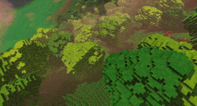][veloren-0.8-gameplay]
_[New glider physics][veloren-glider] video_

In January, work will continue on 0.9. Work will be done on economic simulation,
world simulation, and combat systems. New developers are joining the project
every month, and development is moving forward quickly.

[veloren]: https://veloren.net
[veloren-blog-100]: https://veloren.net/devblog-100
[veloren-98-contributors]: https://veloren.net/devblog-98/#contributor-work
[veloren-econ-1]: https://veloren.net/devblog-98#economic-simulation-update-by-christof
[veloren-econ-2]: https://veloren.net/devblog-99#economic-simulation-by-christof
[veloren-ui]: https://veloren.net/devblog-100#ui-progress-by-pfau
[veloren-glider]: https://veloren.net/devblog-100#glider-physics-by-slipped
[veloren-gilrs]: https://veloren.net/devblog-100#mckol-s-veloren-journey
[veloren-modelling-1]: https://veloren.net/devblog-100#modeling-with-gemu
[veloren-modelling-2]: https://veloren.net/devblog-100#modeling-with-snowram
[veloren-persistence]: https://veloren.net/devblog-100#work-by-xvar
[veloren-combat]: https://veloren.net/devblog-100#combat-improvements-by-james
[veloren-net]: https://veloren.net/devblog-100#network-analysis-by-xmac94x
[veloren-graphics]: https://veloren.net/devblog-100#the-state-of-graphics-and-ui-by-imbris
[veloren-trees]: https://veloren.net/devblog-100#procedural-trees-by-ccgauche
[veloren-site]: https://veloren.net/devblog-100#new-website-design-by-songtronix
[veloren-graphic-future]: https://veloren.net/devblog-100#looking-to-the-graphical-future-by-sharp
[veloren-0.8-changelog]: https://gitlab.com/veloren/veloren/-/blob/master/CHANGELOG.md#080-2020-11-28
[veloren-minidebconf-talk]: https://youtube.com/watch?v=76FPpOnshNw
[veloren-0.8-gameplay]: https://youtube.com/watch?v=8WWVe1cIu7I

### [15-minute Santa][15m-santa]

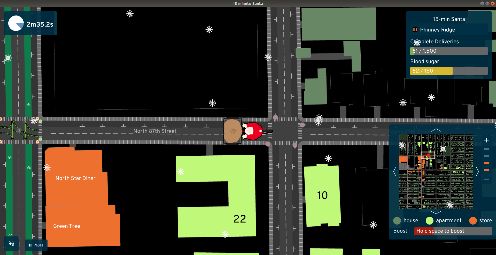

In [15-minute Santa][15m-santa], you deliver presents around a city,
occasionally stopping at a restaurant to refuel -- biking uphill in the snow
isn't easy! The game uses real data from OpenStreetMap and local GIS sources to
know where shops, single-family homes, and apartments are located. In places
where zoning rules keep people separated from food, Santa will have a hard
time.

15-minute Santa was created by the [A/B Street](abstreet) team as an experiment
to see how quickly we could build a simple arcade game that gets people
thinking about how their city is designed. [The code](santa-code) doesn't make
use of an entity-component system or an existing engine, and animation and
particle effects don't use a custom shader. The game runs natively on Linux,
Mac, and Windows, and on web browsers. There are instructions for modding the
game and adding your own city!

A/B Street updates will return next month. In the meantime, please comment on
the [2021 roadmap](abstreet-roadmap).

[15m-santa]: http://santa.abstreet.org
[abstreet]: https://abstreet.org
[santa-code]: https://github.com/dabreegster/abstreet/tree/master/santa/src/
[abstreet-roadmap]: https://docs.google.com/document/d/1oV4mdtb0ve-wf0HqbEvR9IwXLIkTeDu8a3UnJxnr2F0/edit?usp=sharing

### [Egregoria]

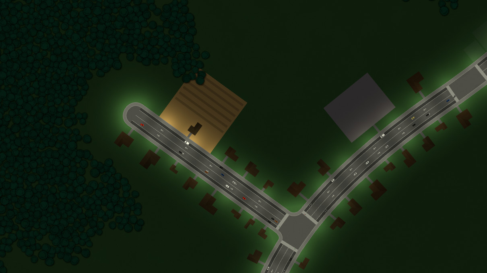

[Egregoria]'s objective is to become a granular society simulation,
filled with fully autonomous agents interacting with their world in real time.
The city should evolve by itself and form interesting patterns.

The [7th devlog][egregoria-blog-post] was published. Celebrating the first
anniversary of the project! Updates include:

- A summary of Egregoria's progress and ambition.
- Music and sounds.
- Basic economy design.
- A specialized gridlock detection algorithm.

Join [Egregoria's Discord server][egregoria-discord].

[Egregoria]: https://github.com/Uriopass/Egregoria
[egregoria-blog-post]: http://douady.paris/blog/egregoria_7.html
[egregoria-discord]: https://discord.gg/CAaZhUJ

### [doukutsu-rs][drs-repo]

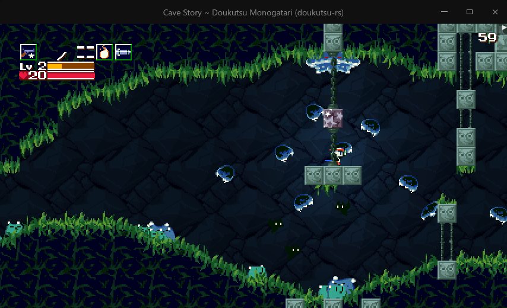

[doukutsu-rs][drs-repo] is a remake of [Cave Story][cave-story] engine,
meant to be a drop-in replacement for the original game executable
(both freeware and commercial version), focused on being a portable modding
tool (most Cave Story mods patch the executable directly, including machine
code editing/assembly hacks) and adding various visual and gameplay-related
enhancements.

Built mainly using modified [ggez] crate, runs on desktop and Android.

Changes done during the last month:

- [An Android port with full touchscreen controls][drs-android].
- Work has been started on Lua API, meant for building custom stuff
  on top of the engine.
- Work started on pushing the project's changes upstream and moving back
  to mainline versions of crates.
- Improvements to the Organya player (a simple synthetiser that plays the
  in-game music using a set of 100 waves and 6 drum samples).
- A bunch of missing NPCs, bosses and other stuff were added.
- The way how game loop works was redesigned, in preparation
  for adding networked multiplayer support.
- Countless bug fixes.

[drs-discord]: https://discord.gg/fbRsNNB
[drs-repo]: https://github.com/doukutsu-rs/doukutsu-rs
[cave-story]: https://en.wikipedia.org/wiki/Cave_Story
[ggez]: https://ggez.rs
[drs-android]: https://reddit.com/r/rust/comments/kh79r1/made_my_rust_remake_of_cave_story

### [Antorum]

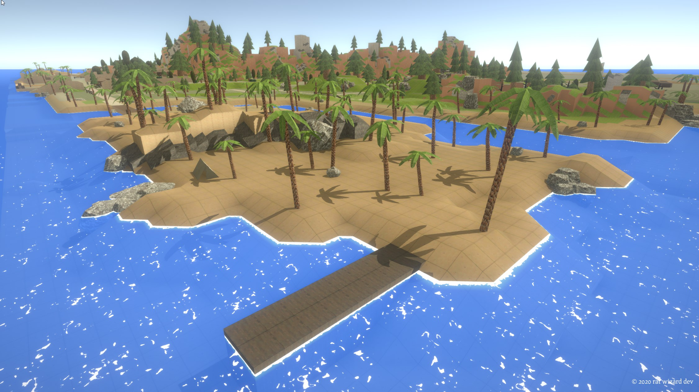

[Antorum] is a micro-multiplayer online role-playing game by [@dooskington].
The game server is written in Rust, and the official client is being developed
in Unity.

December was an important month for the game. Along with tons of little fixes
and changes, major features such as NPC Dialog were finally implemented! Check
out the dev logs for more info.

- [26: Various Improvements](https://ratwizard.dev/dev-log/antorum/26)
- [27: The Big 2020 End-Of-Year Update](https://ratwizard.dev/dev-log/antorum/27)

[Antorum]: https://ratwizard.dev/dev-log/antorum
[@dooskington]: https://twitter.com/dooskington

### Harvest Hero


_Harvest crops and whack those pesky Groobles!_

Harvest Hero by [@bombfuse_dev] is an arcade/roguelike game.
This month in development:

- A new level type called "Harvest Defense" was added.
- Some quality of life features like background music and sfx volume control
  were added.
- The devs began working with some artists to provide a music
  and pixelart makeover.

[@bombfuse_dev]: https://twitter.com/bombfuse_dev

### [FreeNukum][fn]

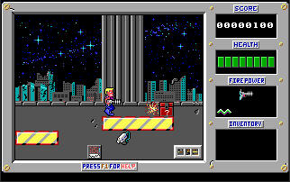

[FreeNukum][fn] is a free software clone of the 1991 DOS game *Duke Nukem
1* jump'n run by [@silwol]. Development of the game started in 2007, back
then it was written in C using SDL1. In 2020, the codebase was gradually
migrated to Rust, after that it got updated to SDL2. The first version
fully implemented in Rust was [released to crates.io][fn-crates-io] and
[announced on Reddit][fn-reddit-announce] in December 2020.

Some of [this month's changes][fn-changelog]:

- Controller support was added.
- Some of the actors found in the original game were added.
- The hero can do somersaults when jumping with boots.
- The project's wiki now has a ["FreeNukum Screenshots" page][fn-screenshots].
- A [Matrix chat room][fn-matrix-chat] is now available.

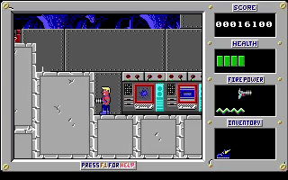
_Somersaults!_

[fn]: https://gitlab.com/silwol/freenukum
[fn-reddit-announce]: https://reddit.com/r/rust_gamedev/comments/k9dw50/freenukum
[fn-crates-io]: https://crates.io/crates/freenukum
[fn-screenshots]: https://gitlab.com/silwol/freenukum/-/wikis/FreeNukum-Screenshots
[fn-matrix-chat]: https://matrix.to/#/#freenukum:matrix.org
[fn-changelog]: https://gitlab.com/silwol/freenukum/-/blob/main/CHANGELOG.md
[@silwol]: https://chaos.social/@silwol

### [Weegames][weegames-itch]


[Weegames][weegames-itch] is a fast-paced minigame collection.

The game now has a [web demo][weegames-itch] ([source][weegames-demo-source])
made with macroquad.
Sound was recently added to the demo using the quad-snd library.

[weegames-itch]: https://yeahross.itch.io/weegames
[weegames-demo-source]: https://github.com/yeahross0/Weegames-Demo

### [Cheese]

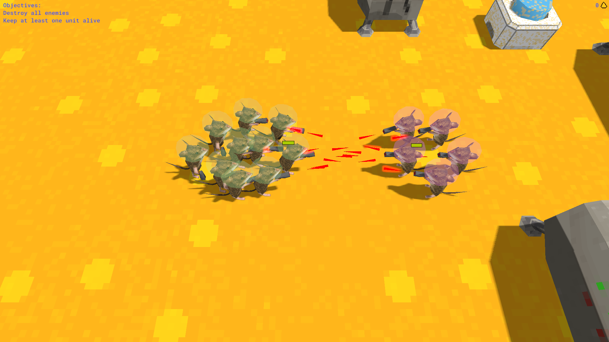
_Pew pew!_

[Cheese] is a small Real Time Strategy game created for the
[GitHub Game Off 2020]. It was written using a 'low-level gamedev stack'
consisting of:

- [wgpu-rs] for rendering,
- [gltf] models,
- [wgpu_glyph] for text rendering
- [legion] for ECS
- and [lyon_tessellation] for rendering 2D UI elements.

The game is in a finished state, but it would be relatively easy to add new
features such as unit types and buildings.

Check out the source code at [github.com/expenses/cheese].

[Cheese]: https://expenses.itch.io/cheese
[GitHub Game Off 2020]: https://itch.io/jam/game-off-2020
[wgpu-rs]: https://github.com/gfx-rs/wgpu-rs
[gltf]: https://crates.io/crates/gltf
[wgpu_glyph]: https://crates.io/crates/wgpu_glyph
[legion]: https://crates.io/crates/legion
[lyon_tessellation]: https://crates.io/crates/lyon_tessellation
[github.com/expenses/cheese]: https://github.com/expenses/cheese

## Learning Material Updates

### [How to Revive a Dead Rust Project][rustfest-talk]

[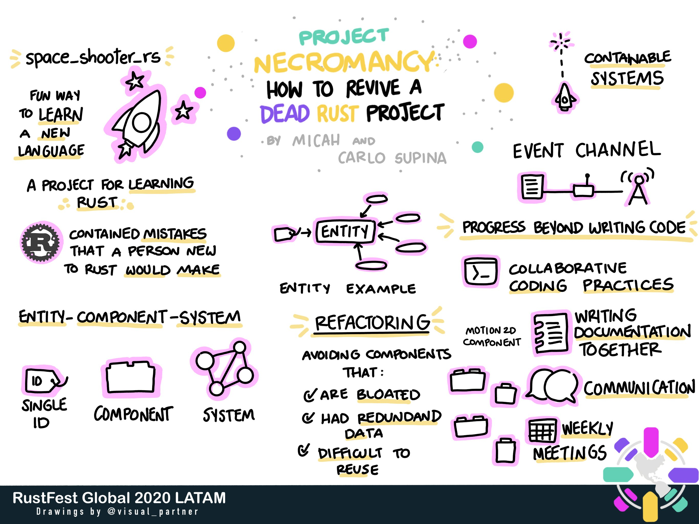][rustfest-talk]
_Drawing by [Carlo Gilmar][visual_partner]. Click to [watch the talk.][rustfest-talk]_

At [RustFest Global 2020], [@micah_tigley] and [@carlosupina] talked about their
experiences collaborating together to revive the [space_shooter_rs] project through
effective planning, refactoring, and documentation. The video was recently
[released on YouTube][talk-tweet] in December!

Since then, both developers have been working away on improving the
game. Some updates include:

- [Adding debug lines for hitboxes][debug-lines]
- [Creating configurations files to store player variables][player-config]

[@micah_tigley]: https://twitter.com/micah_tigley
[@carlosupina]: https://twitter.com/carlosupina
[RustFest Global 2020]: https://rustfest.global/
[rustfest-talk]: https://www.youtube.com/watch?v=qoCryIy4bFE
[visual_partner]: https://twitter.com/visual_partner
[talk-tweet]: https://twitter.com/carlosupina/status/1341763006716407808
[space_shooter_rs]: https://github.com/amethyst/space_shooter_rs
[debug-lines]: https://twitter.com/carlosupina/status/1335289462738259974
[player-config]: https://github.com/amethyst/space_shooter_rs/pull/101

### [Building Pikachu Volleyball][pikachu-video]

[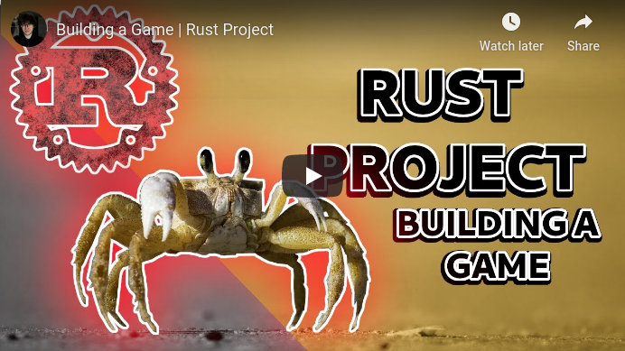][pikachu-video]
_Click to [watch the video on YouTube][pikachu-video]_

[Building Pikachu Volleyball][pikachu-video] by [@danlogs] is the latest episode
of a video series inspired by Shing Lyu's book [Practical Rust Projects][amazon-book].
Here, [@danlogs] re-creates the Pikachu spin-off game from 1997
by Satoshi Takenouchi - Pikachu Volleyball.

Apart from being a good way for aspiring game developers to start
understanding the gist of game dev with Rust, this video also displays some of
the language's hardest topics (i.e. ownership, lifetimes, modules, etc.)
in a real-world application.

[The source code is available here.][pikachu-src]

Join the [danlogs's Discord channel][danlogs-discord]
or follow [@danologue on Twitter][@danologue].

[pikachu-src]: https://github.com/danbugs/danlogs/tree/master/rust/projects/pikachu_volleyball
[pikachu-video]: https://youtube.com/watch?v=Z1sxCC0CDts
[@danlogs]: http://youtube.com/c/danlogs
[amazon-book]: https://amazon.com/Practical-Rust-Projects-Computing-Applications/dp/1484255984
[danlogs-discord]: https://discord.com/invite/fSWE49H
[@danologue]: https://twitter.com/danologue

### [Creative Coding in Rust: Re-creating Retro Screensaver][timclicks-session]

[][timclicks-session]
_You can [watch the recording here][timclicks-session]._

[@timClicks] live streamed a coding session featuring
[Nannou][timclicks-nannou], an open-source creative-coding framework,
which is used to recreate the Mystify screensaver that appeared in Windows 3.1.

_Discussions:
[/r/rust](https://reddit.com/r/rust/comments/jxhozr/creative_coding_in_rust),
[Twitter](https://twitter.com/timClicks/status/1327789155930128387)_

[@timClicks]: https://twitter.com/timClicks
[timclicks-session]: https://youtube.com/watch?v=d9lsT4kJo44
[timclicks-nannou]: https://nannou.cc

### [Nannou: Creative Coding with Rust][mactuitui-talk]

[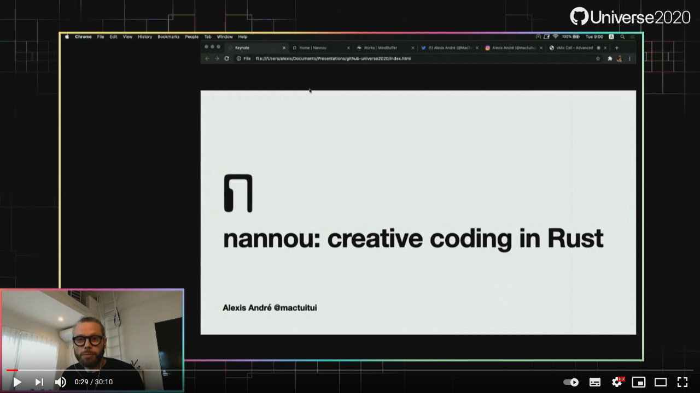][mactuitui-talk]
_You can [watch the recording here][mactuitui-talk]._

[Alexis André][@mactuitui] gave a [talk][mactuitui-talk] at
[GitHub Universe][mactuitui-github-universe] about working with Rust
and [Nannou][mactuitui-nannou-website], an open-source creative-coding
framework.

> Alexis André is an artist, researcher and designer aiming at redefining
> entertainment. In this golden age of computation and data overflow,
> why is our entertainment still designed to be consumed in a passive
> way? A few media are offering interactive experiences, but none of
> them are designed specifically for you. In this live demo, Alexis
> will create a sketch from scratch for participants to experience
> what it's like working with Nannou and Rust.

The code is available at [GitHub][mactuitui-repository].

_Discussions:
[Twitter][mactuitui-discussion]_

[@mactuitui]: https://twitter.com/mactuitui
[mactuitui-talk]: https://www.youtube.com/watch?v=Ml6tpyTyXhM
[mactuitui-repository]: https://github.com/MacTuitui/nannou-universe
[mactuitui-discussion]: https://twitter.com/MacTuitui/status/1339863034991276035
[mactuitui-nannou-website]: https://nannou.cc
[mactuitui-github-universe]: https://githubuniverse.com/Nannou-creative-coding-with-Rust/

### [Undergrad Thesis on Game Scripting for Legion][legion-script]

In December 2020, [@pablodiegoss] and [@rodrigocam] presented their undergrad
thesis where they created a proof-of-concept scripting system for the Legion ECS,
called [Legion Script][legion-script].
Legion is being currently integrated into the [Amethyst game engine][amethyst],
and this contribution might be included in future releases.

With [Legion Script][legion-script], it is possible to declare, write and read
components into Legion using Python scripts.
However, this project exports an API which can be evolved
for other languages and interpreters.

Since then, both developers have been sharing their work and receiving feedbacks
for the project while planning the next steps for the code, which is available
at [GitHub][legion-script].

The PDF version of the thesis could be found
in [this Amethyst forum thread][thesis-thread].

[legion-script]: https://github.com/redcodestudios/legion_script
[@pablodiegoss]: https://github.com/pablodiegoss
[@rodrigocam]: https://github.com/rodrigocam
[amethyst]: https://github.com/amethyst/amethyst
[thesis-thread]: https://community.amethyst.rs/t/undergrad-thesis-on-game-scripting-for-legion/1753

## Library & Tooling Updates

### [This Month in Mun][mun-december]

[][Mun]

[Mun] is a scripting language for gamedev focused on quick iteration times
that is written in Rust.

November went by without the usual monthly update from the Mun team, as they
were unable to make much headway. Instead they posted a slightly different
[blog][mun-november], expressing their desire to add a third developer to the
Mun Core Team, whom they are willing to fund themselves - albeit a token
amount.

The team was able to start ramping back up during the holiday; those
[December updates][mun-december] include:

- language support for `use` statements;
- Rust version updates and bugfixes.

[Mun]: https://mun-lang.org
[mun-november]: https://mun-lang.org/blog/2020/12/07/this-month-november
[mun-december]: https://mun-lang.org/blog/2021/01/05/this-month-december

### [Kira]

[Kira] by [@tesselode] is an audio library designed to help create expressive
audio for games. It aims to fill the holes in many game engines' built-in audio
APIs with features for creating seamless music loops and scripting audio events.

Kira v0.2.0 and v0.3.0 were released recently with quite a few improvements:

- Arrangements for stitching together multiple sounds and better seamless looping
- Per-sequence custom event types
- Groups for controlling multiple instances at a time
- Audio streams for sending arbitrary audio data to the mixer
- Lots of smaller features and workflow improvements

Kira v0.4.0 is in the works with an API refactor, serde support for config
structs, and WASM support.

[Kira]: https://github.com/tesselode/kira
[@tesselode]: https://twitter.com/tesselode

_Discussions:
[/r/rust](https://www.reddit.com/r/rust/comments/kkf1jz/kira_game_audio_library_v030_persequence_custom/),
[Twitter](https://twitter.com/tesselode/status/1342878087990685700)_

### [SPIR-Q] v0.4.10

[SPIR-Q] is a light-weight SPIR-V query library which supports one-pass shader
parsing and reflection. The latest release, version 0.4.10, introduced customized
shader auditing by allowing the users to hook and to inspect the instructions
SPIR-Q has worked on, while with all access to its reflection intermediates.

For more information, please refer to [the original post][spirq-reddit].

[SPIR-Q]: https://github.com/penguinliong/spirq-rs
[spirq-reddit]: https://reddit.com/r/rust_gamedev/comments/kgv4gh/spirq_0410

### [rust-gpu]


_Various shaders from shadertoy.com ported to Rust and built with rust-gpu._

[rust-gpu] is a new codegen backend by Embark Studios for Rust, aimed at making
Rust a first class language for writing GPU shaders! This past month was the
release of rust-gpu 0.2, including a tonne of new features and capabilities.

Some of the highlights include:

- [You can build and test your shaders on the web.][rust-gpu-web] Thanks to SHADERed.
- [Support for accessing and sampling textures][rust-gpu-textures].
- [Initial support for compute shaders][rust-gpu-compute].
- [Rust's new `asm!` macro now supports writing SPIR-V][rust-gpu-asm].

[rust-gpu]: https://github.com/EmbarkStudios/rust-gpu
[rust-gpu-web]: https://shadered.org/blog?id=4
[rust-gpu-textures]: https://github.com/EmbarkStudios/rust-gpu/pull/276
[rust-gpu-compute]: https://github.com/EmbarkStudios/rust-gpu/pull/195
[rust-gpu-asm]: https://github.com/EmbarkStudios/rust-gpu/pull/254

### [Egui]

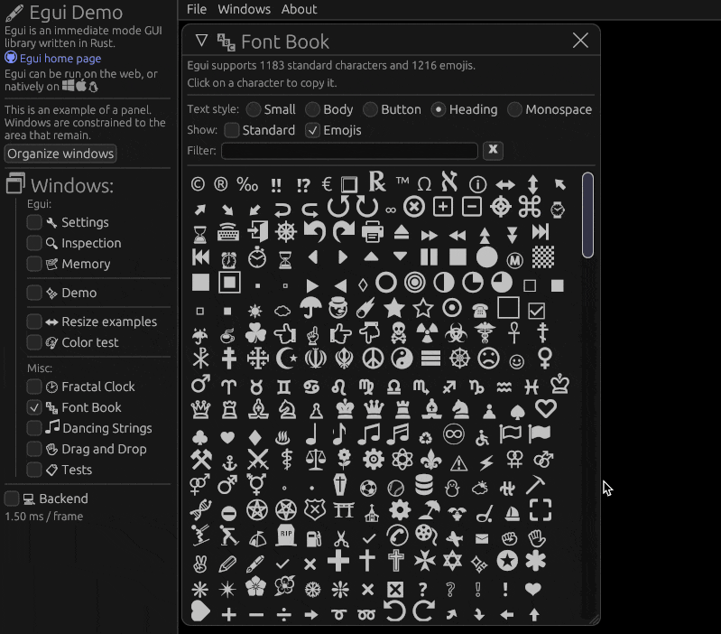
_Some of the supported emojis in the [online demo][demo]._

[Egui] is an easy-to-use GUI in pure Rust.
Egui can be integrated into a game engine, or used standalone with the help of [eframe].
This month versions 0.5, 0.6 and 0.7 were released with many improvements,
including custom fonts, emojis and improved layout engine ([full changelog][changelog]).

[Egui]: https://github.com/emilk/egui
[demo]: https://emilk.github.io/egui
[eframe]: https://lib.rs/eframe
[egui_template]: https://github.com/emilk/egui_template
[changelog]: https://github.com/emilk/egui/blob/master/CHANGELOG.md

### [Tetra]

[Tetra] is a simple 2D game framework, inspired by XNA and Raylib. This month,
versions 0.5.5 and 0.5.6 were released, with various improvements:

- Customizable `Mesh` colors and winding orders
- Enabling/disabling the user's screen saver
- Improved CPU usage on some devices

For full details and a list of breaking changes, see the
[changelog][tetra-changelog].

[tetra]: https://github.com/17cupsofcoffee/tetra
[tetra-changelog]: https://github.com/17cupsofcoffee/tetra/blob/main/CHANGELOG.md

### [macroquad]


_Macroquad-profiler footage._

[macroquad] is a cross-platform (Windows/Linux/macOS/Android/iOS/WASM)
game framework built on top of [miniquad].
This month's updates:

- The source code of the previously announced [particles editor][particles-web]
  got [released][particles-source].

- A new `telemetry` module was introduced exposing
  the frame timing data to any third-party visualisation tool.
  For in-game profiling data visualisation the `macroquad-profiler` crate
  is available.

  [A new book chapter "Profiling" was released][profiling-blog]
  with more information on the subject.

- `physics-platformer` is a new optional crate based on Maddy Thorson's
  ["Celeste and TowerFall Physics" blogpost][celeste-physics] on platformers physics:
  [web demo][platformer-web], [source code][platformer-source].

- Also, macroquad was featured in the episode
  of the [Rust GameDev Podcast][macroquad-interview].

[macroquad-interview]: https://rustgamedev.com/episodes/interview-with-fedor-logachev
[platformer-source]: https://github.com/not-fl3/macroquad/blob/master/examples/platformer.rs
[platformer-web]: https://not-fl3.github.io/miniquad-samples/platformer.html
[celeste-physics]: https://maddythorson.medium.com/celeste-and-towerfall-physics-d24bd2ae0fc5
[miniquad]: https://github.com/not-fl3/miniquad
[macroquad]: https://github.com/not-fl3/macroquad
[particles-web]: https://fedorgames.itch.io/macroquad-particles
[particles-source]: https://github.com/not-fl3/particles-editor
[profiling-blog]: https://not-fl3.github.io/platformer-book/profiling.html

### [starframe]

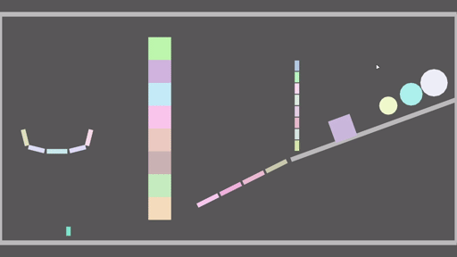

[starframe] by [@moletrooper] is a work-in-progress game engine
for physics-y sidescrolling 2D games. This month, a new, more versatile
constraint solver was used to add friction and basic joints. Collision
detection accuracy and overall stability were also improved.

_Discussions:
[twitter](https://twitter.com/moletrooper/status/1338066680724008960)_

[starframe]: https://github.com/moletrooper/starframe
[@moletrooper]: https://twitter.com/moletrooper

### [rpt]: Rust Path Tracer


_Sample images rendered by path tracing._

[rpt] by [@ekzhang] and [@scanhex] is a physically based, CPU-only rendering
engine written in Rust. It uses path tracing to generate realistic images of 3D
scenes.

There's a lot of features, including kd-tree mesh acceleration, physical
material properties (microfacet BSDF with multiple importance sampling), HDRI
environment maps, OBJ/MTL/STL files, depth of field, and particle physics
simulation.

It's also parallelized with [rayon] and available as a library on [crates.io].
The entire source code, including code for the above examples and more, is very
short (~3K SLOC). Future directions include extending the renderer with
bidirectional path tracing and other features.

_Discussions:
[/r/rust](https://reddit.com/r/rust/comments/k81wwi/rpt_v01)_

[rpt]: https://github.com/ekzhang/rpt
[@ekzhang]: https://www.ekzhang.com/
[@scanhex]: https://github.com/scanhex
[rayon]: https://github.com/rayon-rs/rayon
[crates.io]: https://crates.io/

### [Rust Graphics Playground][rust-graphics-playground]


The [Rust Graphics Playground][rust-graphics-playground] is a small tool that
allows you to create and share miniature graphics demos in Rust that will run
in the browser. Here are a few examples of what you can make:

- [3D Spinning Triangle][spinning-triangle]
- [3D Spinning Cube][spinning-cube]
- [Serpinski Triangle][serpinski-triangle]
- [Serpinski Carpet][serpinski-carpet]

The [source code][graphics-playground-source] is available online.

_Discussions:
[/r/rust](https://www.reddit.com/r/rust/comments/kk6i38/write_mini_graphics_demos_in_rust_in_the_browser/)_

[rust-graphics-playground]: http://playground.meteorlinker.com
[spinning-triangle]: http://playground.meteorlinker.com/?share=1
[spinning-cube]: http://playground.meteorlinker.com/?share=864
[serpinski-triangle]: http://playground.meteorlinker.com/?share=682
[serpinski-carpet]: http://playground.meteorlinker.com/?share=1054
[graphics-playground-source]: https://gitlab.com/DixieDev/rust-graphics-playground

## Popular Workgroup Issues in Github

<!-- Up to 10 links to interesting issues -->

## Requests for Contribution

<!-- Links to "good first issue"-labels or direct links to specific tasks -->

## Jobs

<!-- An optional section for new jobs related to Rust gamedev -->

------

That's all news for today, thanks for reading!

Want something mentioned in the next newsletter?
[Send us a pull request][pr].

Also, subscribe to [@rust_gamedev on Twitter][@rust_gamedev]
or [/r/rust_gamedev subreddit][/r/rust_gamedev] if you want to receive fresh news!

<!--
TODO: Add real links and un-comment once this post is published
**Discussions of this post**:
[/r/rust](TODO),
[twitter](TODO).
-->

[/r/rust_gamedev]: https://reddit.com/r/rust_gamedev
[@rust_gamedev]: https://twitter.com/rust_gamedev
[pr]: https://github.com/rust-gamedev/rust-gamedev.github.io
