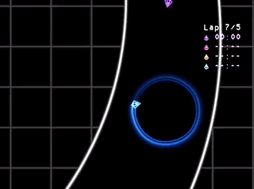

+++
title = "This Month in Rust GameDev #17 - December 2020"
date = 2021-01-04
transparent = true
draft = true
+++

<!-- Check the post with markdownlint-->

Welcome to the 17th issue of the Rust GameDev Workgroup's
monthly newsletter.
[Rust] is a systems language pursuing the trifecta:
safety, concurrency, and speed.
These goals are well-aligned with game development.
We hope to build an inviting ecosystem for anyone wishing
to use Rust in their development process!
Want to get involved? [Join the Rust GameDev working group!][join]

You can follow the newsletter creation process
by watching [the coordination issues][coordination].
Want something mentioned in the next newsletter?
[Send us a pull request][pr].
Feel free to send PRs about your own projects!

[Rust]: https://rust-lang.org
[join]: https://github.com/rust-gamedev/wg#join-the-fun
[pr]: https://github.com/rust-gamedev/rust-gamedev.github.io
[coordination]: https://github.com/rust-gamedev/rust-gamedev.github.io/issues?q=label%3Acoordination

[Rust]: https://rust-lang.org
[join]: https://github.com/rust-gamedev/wg#join-the-fun

Table of contents:

- [Game Updates](#game-updates)
- [Learning Material Updates](#learning-material-updates)
- [Library & Tooling Updates](#library-tooling-updates)
- [Popular Workgroup Issues in Github](#popular-workgroup-issues-in-github)
- [Requests for Contribution](#requests-for-contribution)
- [Jobs](#jobs)

<!--
Ideal section structure is:

```
### [Title]


_image caption_

A paragraph or two with a summary and [useful links].

_Discussions:
[/r/rust](https://reddit.com/r/rust/todo),
[twitter](https://twitter.com/todo/status/123456)_

[Title]: https://first.link
[useful links]: https://other.link
```

If needed, a section can be split into subsections with a "------" delimiter.
-->

## Game Updates

### [Way of Rhea has a Discord!][wor-discord]


_Updated visuals for interactive items._

[Way of Rhea][wor-website] is a puzzle platformer that takes place in a world
where you can only interact with objects that match your current color. The game
is being developed in a custom built Rust game engine and hot swappable
scripting language.

This month's updates:

- More progress has been made on the hub world! The game is no longer fully
  linear.
- All interactive elements are getting a visual update, pictured above.
- The devs have created [a Discord server][wor-discord] where you can hang out,
  stay up to date on the latest developments, and if you're interested, chat
  about the implementation (see the `#tech` channel.)

[wor-discord]: https://discord.gg/JGeVt5XwPP
[wor-website]: https://anthropicstudios.com/way-of-rhea

### Swoop


_Getting lapped by purple? - don't worry, it happens to everyone_

They say it takes about 10 years for a developer to go from first
wanting to create a game to actually releasing one. I first started
making games in about 2010 and and [Swoop][swoop-itch] is the only
hobby game that I've finished outside of game jams. Part of that is
because it's simple, and I refused to accept any "wouldn't it be nice
to also do XYZ" ideas after the initial concept was solidified.

Every time you use a game engine it brings with it a lot of cognitive
overhead: how does resource management work, how do I force the physics
to not glitch out, and why oh why don't the UI elements line up
properly... I've tried to make games in a variety of engines, but
invariably got frustrated. So I decided to throw out the engine and
find out what makes game-making so complex. It turns out that the stuff
below the game engine is only slightly less friendly than the stuff above
it. It's all just maths, logic, state handling and a bunch of new
terminology. If you've got a small game project and are feeling adventurous,
I highly suggest trying to make an engineless game. Just don't get carried
away and try make it generic. You have to realize you are making a single
specific game.

This game is both [open source][swoop-source] and I [wrote about the
process of making it][swoop-building]. You can also play the prototype
version done in [shadertoy][swoop-shadertoy]. All up this game was a
large experiment: I'm not all that familiar with rust, it was my first
go at targetting WASM, I've never used webGL before, and my linear
algebra is worse than I thought. I think in future games I'll use at
least a math library to make my life easier..... What's next for me?
Well, I'm taking a look at 3D and [raymarching giant
caves][swoop-next].

[swoop-itch]: https://sdfgeoff.itch.io/swoop
[swoop-source]: https://github.com/sdfgeoff/wasm_minigames
[swoop-shadertoy]: https://www.shadertoy.com/view/WlScWd
[swoop-building]: https://sdfgeoff.github.io/wasm_minigames/a_first_game_swoop.html
[swoop-next]: https://www.shadertoy.com/view/tltyRB

## Learning Material Updates

## Library & Tooling Updates

### [Tetra]

[Tetra] is a simple 2D game framework, inspired by XNA and Raylib. This month,
versions 0.5.5 and 0.5.6 were released, with various improvements:

- Customizable `Mesh` colors and winding orders
- Enabling/disabling the user's screen saver
- Improved CPU usage on some devices

For full details and a list of breaking changes, see the
[changelog][tetra-changelog].

[tetra]: https://github.com/17cupsofcoffee/tetra
[tetra-changelog]: https://github.com/17cupsofcoffee/tetra/blob/main/CHANGELOG.md

## Popular Workgroup Issues in Github

<!-- Up to 10 links to interesting issues -->

## Requests for Contribution

<!-- Links to "good first issue"-labels or direct links to specific tasks -->

## Jobs

<!-- An optional section for new jobs related to Rust gamedev -->

------

That's all news for today, thanks for reading!

Want something mentioned in the next newsletter?
[Send us a pull request][pr].

Also, subscribe to [@rust_gamedev on Twitter][@rust_gamedev]
or [/r/rust_gamedev subreddit][/r/rust_gamedev] if you want to receive fresh news!

<!--
TODO: Add real links and un-comment once this post is published
**Discussions of this post**:
[/r/rust](TODO),
[twitter](TODO).
-->

[/r/rust_gamedev]: https://reddit.com/r/rust_gamedev
[@rust_gamedev]: https://twitter.com/rust_gamedev
[pr]: https://github.com/rust-gamedev/rust-gamedev.github.io
