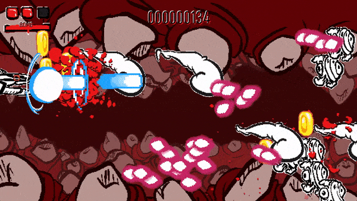
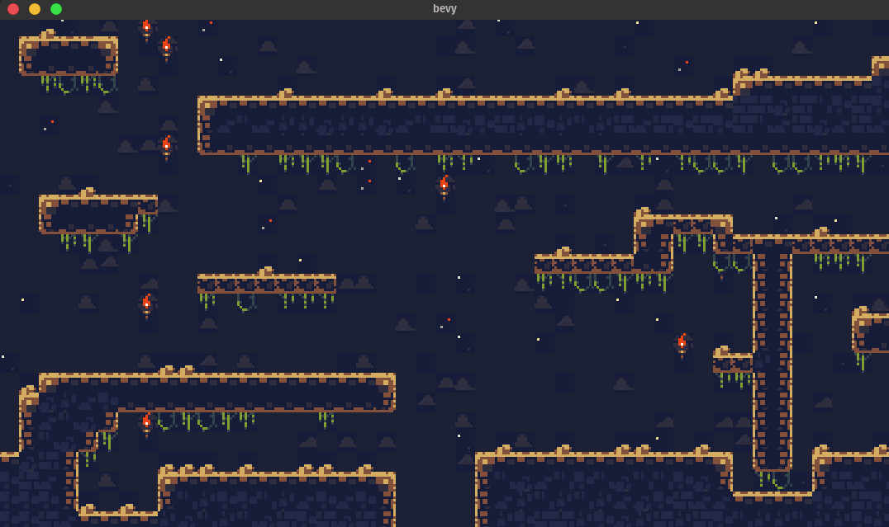
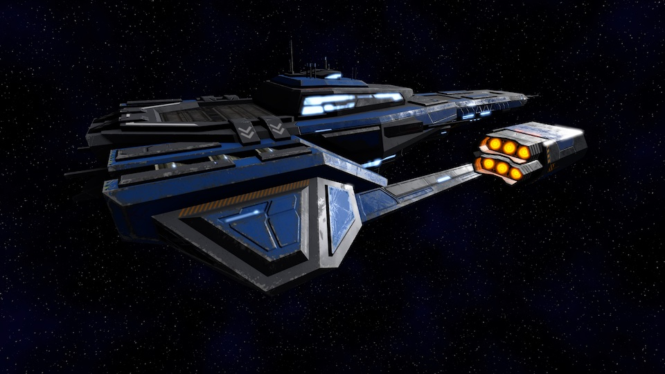

+++
title = "This Month in Rust GameDev #18 - January 2021"
date = 2021-02-08
transparent = true
draft = true
+++

Welcome to the 18th issue of the Rust GameDev Workgroup's
monthly newsletter.
[Rust] is a systems language pursuing the trifecta:
safety, concurrency, and speed.
These goals are well-aligned with game development.
We hope to build an inviting ecosystem for anyone wishing
to use Rust in their development process!
Want to get involved? [Join the Rust GameDev working group!][join]

You can follow the newsletter creation process
by watching [the coordination issues][coordination].
Want something mentioned in the next newsletter?
[Send us a pull request][pr].
Feel free to send PRs about your own projects!

[Rust]: https://rust-lang.org
[join]: https://github.com/rust-gamedev/wg#join-the-fun
[pr]: https://github.com/rust-gamedev/rust-gamedev.github.io
[coordination]: https://github.com/rust-gamedev/rust-gamedev.github.io/issues?q=label%3Acoordination
[Rust]: https://rust-lang.org
[join]: https://github.com/rust-gamedev/wg#join-the-fun

Table of contents:

- [Rust GameDev Podcast](#rust-gamedev-podcast)
- [Game Updates](#game-updates)
- [Learning Material Updates](#learning-material-updates)
- [Engine Updates](#engine-updates)
- [Library & Tooling Updates](#library-tooling-updates)
- [Popular Workgroup Issues in Github](#popular-workgroup-issues-in-github)
- [Requests for Contribution](#requests-for-contribution)

<!--
Ideal section structure is:

```
### [Title]


_image caption_

A paragraph or two with a summary and [useful links].

_Discussions:
[/r/rust](https://reddit.com/r/rust/todo),
[twitter](https://twitter.com/todo/status/123456)_

[Title]: https://first.link
[useful links]: https://other.link
```

If needed, a section can be split into subsections with a "------" delimiter.
-->

## [Rust GameDev Podcast][podcast-5]


[The 5th podcast episode][podcast-5] is an interview with
[Alex Ene][@_AlexEne_] creator of an upcoming dwarven simulation
game, [Dwarf World][dwarf-world].

> In this weeks episode, Richard and Forest chat to Alex Ene,
> creator of the dwarven simulation game, Dwarf World.
> We cover writing custom engines, unit testing, build
> systems and picking the right frameworks for your game.

Listen and subscribe from the following platforms:
[Rust GameDev Podcast (simplecast)](https://rustgamedev.com/),
[Apple Podcasts](https://podcasts.apple.com/gb/podcast/rust-game-dev/id1526304768),
[Spotify](https://open.spotify.com/show/7HRfGnTcXkLkQd9fxJbDGj),
[RSS Feed](https://feeds.simplecast.com/C6NQglnL),
[Google Podcasts](https://podcasts.google.com/feed/aHR0cHM6Ly9mZWVkcy5zaW1wbGVjYXN0LmNvbS9DNk5RZ2xuTA).

[podcast-5]: https://rustgamedev.com/episodes/interview-with-alex-ene
[@_AlexEne_]: https://twitter.com/_Alex_Ene_
[dwarf-world]: https://dwarf.world

## Game Updates

### [Teki (敵)][teki]


[Teki][teki] is a free and open-source fangame of the [Tōhō] series
using [SDL2] and [Legion] for ECS. Thanks to WebAssembly - via [wasm-pack]
\-, teki can be played [online][teki-online].

It is aimed to be a shoot ’em up game with "lots of bullets"
a.k.a danmaku 弾幕 - literally "barrage" or "bullet curtain" in japanese.

The project is still at a “very” early stage of development (Dec. 2020).

[teki]: https://github.com/o2sh/teki
[teki-online]: https://o2sh.github.io/teki
[Tōhō]: https://en.wikipedia.org/wiki/Touhou_Project
[SDL2]: https://github.com/Rust-SDL2/rust-sdl2
[Legion]: https://crates.io/crates/legion
[wasm-pack]: https://rustwasm.github.io/wasm-pack

### [A/B Street]


[A/B Street] by [@dabreegster] is a traffic simulation game exploring how small
changes to roads affect cyclists, transit users, pedestrians, and drivers, with
suppot for any city with OpenStreetMap coverage.

In January, [Bruce] implemented variable traffic signal timing, dedicated
cycle-paths and pedestrian plazas were imported, [Michael] and [Yuwen]
overhauled the UI buttons, and we finished day/night toggling. Loading on the
[web][abst-web] and starting scenarios is also much faster!

[A/B Street]: https://github.com/a-b-street/abstreet
[@dabreegster]: https://twitter.com/CarlinoDustin
[Bruce]: https://github.com/BruceBrown
[Michael]: https://github.com/michaelkirk
[Yuwen]: https://www.yuwen-li.com/
[abst-web]: http://abstreet.s3-website.us-east-2.amazonaws.com/dev/game/?--dev&cambridge/maps/great_kneighton.bin

### Paddlers


[Paddlers] ([GitHub][paddlers-gh], [Online Demo][paddlers-demo]) by [@jakmeier]
is an MMORTS for the browser, developed as an experimental hobby project.

This month, version 0.2.0 has been released, which removes all dependencies to
[Stdweb] and [Quicksilver] while keeping the game itself virtually unchanged.
In the process, a part of the code of Paddlers moved to [Paddle], a new
framework for 2D browser games running on desktop and mobile phones.
More details on that are available [here][paddlers-article].

Many new features for Paddle and Paddlers are already in the pipeline, so stay
tuned for more exciting updates in the next monthly newsletter!

[Paddlers]: https://paddlers.ch
[paddlers-gh]: https://github.com/jakmeier/paddlers-browser-game
[paddlers-demo]: https://demo.paddlers.ch
[@jakmeier]: https://github.com/jakmeier
[stdweb]: https://github.com/koute/stdweb
[Quicksilver]: https://github.com/ryanisaacg/quicksilver
[paddle]: https://github.com/jakmeier/paddle
[paddlers-article]: https://www.jakobmeier.ch/blogging/Paddlers_5.html

### [Antorum]


_Hanging out by the vault_

[Antorum] is a micro-multiplayer online role-playing game by [@dooskington].
The game server is written in Rust, and the official client is being developed
in Unity.

Banking was implemented this month! Players can now store their items and wealth
in a safe place. Additionally, the concept of "item combinations" was implemented,
bringing more interesting crafting scenarios into the game.

- [#28: Banking](https://ratwizard.dev/dev-log/antorum/28);
- [#29: Item Combinations](https://ratwizard.dev/dev-log/antorum/29);

[Antorum]: https://ratwizard.dev/dev-log/antorum
[@dooskington]: https://twitter.com/dooskington

### [SeniorSKY]


_Over the mountains in Slovakia_

[SeniorSKY]
is a flight simulator which uses Vulkan API, developed by [@pmathia0].

As an aerospace engineering student, Peter has always been interested how
a flight simulator works under the hood.

The development of SeniorSKY started as a hobby project during university
studies.

SeniorSKY uses real-world elevation data with 1 arc
second precision and can render the whole globe in real dimensions.
During the flight, the terrain tiles are loaded dynamically based
on real GPS coordinates of airplane, with a decreasing level of detail
further from the camera. This is achieved using a combination
of a terrain-quad-tree and GPU tessellation.

SeniorSKY also implements basic rendering of sky, atmosphere and fog.

To be able to simulate a flight, the application temporarily integrates 3rd party
flight dynamics engine called JSBSim. Meanwhile, development of own, custom
flight dynamics is already in progress.

[SeniorSKY]: https://youtube.com/playlist?list=PLMmaJuk-D7iaObZyhyvc83tNwpx3ghzkY
[@pmathia0]: https://twitter.com/pmathia0

### Flesh


_Inside flesh_

Flesh by [@im_oab] is a 2d-horizontal shmup game with hand-drawn animation
and implement using tetra. It still in the development stage but have
a release date set in October 2021.

This game takes place inside the flesh of mysterious organisms that players will
fight through multiple levels to get out.

[@im_oab]: https://twitter.com/im_oab

## Learning Material Updates

## Engine Updates

### [Tetra]

[Tetra] is a simple 2D game framework, inspired by XNA and Raylib. This month,
versions 0.5.7 and 0.5.8 were released, with various changes:

- Basic multisampled anti-aliasing support (with further improvements to come).
- Functions for generating primitive shape meshes.
- A more flexible `Rectangle` type.
- Lots of bug fixes and docs improvements.

For full details, see the [changelog][tetra-changelog].

Additionally, work on [version 0.6][tetra-06-changelog] has begun, with a release
planned for some time in February!

[tetra]: https://github.com/17cupsofcoffee/tetra
[tetra-changelog]: https://github.com/17cupsofcoffee/tetra/blob/main/CHANGELOG.md
[tetra-06-changelog]: https://github.com/17cupsofcoffee/tetra/blob/0.6/CHANGELOG.md

## Library & Tooling Updates

### [`LDtk-rs`]

[`LDtk-rs`] is a Rust crate for reading the [LDtk] map file format. The bindings
to the LDtk format are 100% automatically generated from the LDtk JSON Schema,
with the option to download the latest JSON Schema at build time for automatic
updates.

[`LDtk-rs`]: https://github.com/katharostech/ldtk-rs
[LDtk]: https://ldtk.io

### [`bevy_ldtk`]


_( Tileset from ["Cavernas"] by Adam Saltsman )_

[`bevy_ldtk`] is a Bevy plugin for loading [LDtk] tilemaps.

It features:

- An efficient renderer that only uses 4 vertices per map layer
- Hot reloading through the Bevy asset server integration
- Heavily commented code to help others who want to see how to make their own
  tilemap renderers

[`bevy_ldtk`]: https://github.com/katharostech/bevy_ldtk
[ldtk]: https://ldtk.io
["cavernas"]: https://adamatomic.itch.io/cavernas

### [rkyv]

[rkyv] is a zero-copy deserialization framework for Rust. It's similar to
FlatBuffers and Cap'n Proto and can be used for data storage and messaging.

Version 0.3 was released this month and brought some highly-requested features:

- A new hashmap implementation using perfect hashing to decrease memory usage
  and fix portability issues.
- The `Unarchive` trait to enable more traditional data deserialization for
  archived types.
- Improved validation performance.
- Better error messages and API ergonomics.
- A [book][rkyv-book] with more narrative documentation on architecture and
  internals.
- More tests and realistic benchmarks against other popular serialization
  frameworks.

The next update will be [v0.4][rkyv-v0.4] and is on the way soon with a release
date around mid-February.

[rkyv]: https://github.com/djkoloski/rkyv
[rkyv-book]: https://djkoloski.github.io/rkyv
[rkyv-v0.4]: https://github.com/djkoloski/rkyv/milestone/5

### [kira]

[kira] by [@tesselode] is a game audio library tailored to composers and other
people who need expressive audio.

v0.4.0 was released with a new wasm32 support, a new handle-based API, improved
error handling, and serde support for sequences, arrangements, and most config structs.

_Discussions: [/r/rust](https://www.reddit.com/r/rust/comments/l3ma3d/kira_game_audio_library_v040_wasm_support_serde/),
[Twitter](https://twitter.com/tesselode/status/1353111739433410560)_

[Kira]: https://github.com/tesselode/kira
[@tesselode]: https://twitter.com/tesselode

### [gfx-rs] and [wgpu-rs]



The community managed to squeeze the v0.7 releases out
at the end of the month. See the detailed notes on [gfx blog post].

The highlight of the show is about shaders. Most of wgpu-rs shaders are
now written in [WGSL],
and gfx-rs community is inviting Rust game/graphics developers to evaluate if
[naga] could fulfill their shader translation needs in the future.

[gfx-rs]: https://github.com/gfx-rs/gfx
[wgpu-rs]: https://github.com/gfx-rs/wgpu-rs
[gfx blog post]: https://gfx-rs.github.io/2021/02/02/release-0.7.html
[WGSL]: https://gpuweb.github.io/gpuweb/wgsl.html
[naga]: https://github.com/gfx-rs/naga

## Popular Workgroup Issues in Github

<!-- Up to 10 links to interesting issues -->

## Requests for Contribution

<!-- Links to "good first issue"-labels or direct links to specific tasks -->

- [Embark's open issues][embark-open-issues] ([embark.rs]).
- [gfx-rs's "contributor-friendly" issues][gfx-issues].
- [wgpu's "help wanted" issues][wgpu-help-wanted].
- [luminance's "low hanging fruit" issues][luminance-fruits].
- [ggez's "good first issue" issues][ggez-issues].
- [Veloren's "beginner" issues][veloren-beginner].
- [Amethyst's "good first issue" issues][amethyst-issues].
- [A/B Street's "good first issue" issues][abstreet-issues].
- [Mun's "good first issue" issues][mun-issues].
- [SIMple Mechanic's good first issues][simm-issues].
- [Bevy's "good first issue" issues][bevy-issues].

[embark.rs]: https://embark.rs
[embark-open-issues]: https://github.com/search?q=user:EmbarkStudios+state:open
[gfx-issues]: https://github.com/gfx-rs/gfx/issues?q=is%3Aissue+is%3Aopen+label%3Acontributor-friendly
[wgpu-help-wanted]: https://github.com/gfx-rs/wgpu-rs/issues?q=is%3Aissue+is%3Aopen+label%3A%22help+wanted%22
[luminance-fruits]: https://github.com/phaazon/luminance-rs/issues?q=is%3Aissue+is%3Aopen+label%3A%22low+hanging+fruit%22
[ggez-issues]: https://github.com/ggez/ggez/labels/%2AGOOD%20FIRST%20ISSUE%2A
[veloren-beginner]: https://gitlab.com/veloren/veloren/issues?label_name=beginner
[amethyst-issues]: https://github.com/amethyst/amethyst/issues?q=is%3Aissue+is%3Aopen+label%3A%22good+first+issue%22
[abstreet-issues]: https://github.com/a-b-street/abstreet/issues?q=is%3Aissue+is%3Aopen+label%3A%22good+first+issue%22
[mun-issues]: https://github.com/mun-lang/mun/labels/good%20first%20issue
[simm-issues]: https://github.com/mkhan45/SIMple-Mechanics/labels/good%20first%20issue
[bevy-issues]: https://github.com/bevyengine/bevy/labels/good%20first%20issue

------

That's all news for today, thanks for reading!

Want something mentioned in the next newsletter?
[Send us a pull request][pr].

Also, subscribe to [@rust_gamedev on Twitter][@rust_gamedev]
or [/r/rust_gamedev subreddit][/r/rust_gamedev] if you want to receive fresh news!

<!--
TODO: Add real links and un-comment once this post is published
**Discussions of this post**:
[/r/rust](TODO),
[twitter](TODO).
-->

[/r/rust_gamedev]: https://reddit.com/r/rust_gamedev
[@rust_gamedev]: https://twitter.com/rust_gamedev
[pr]: https://github.com/rust-gamedev/rust-gamedev.github.io
