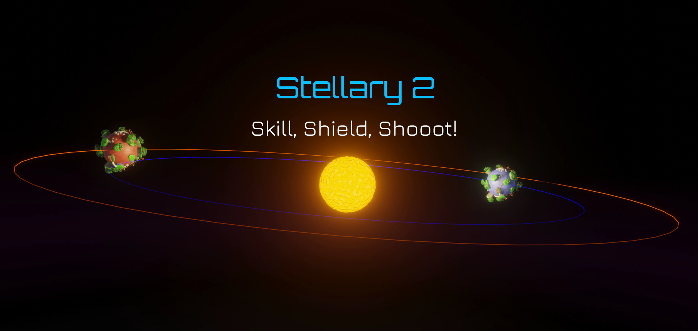
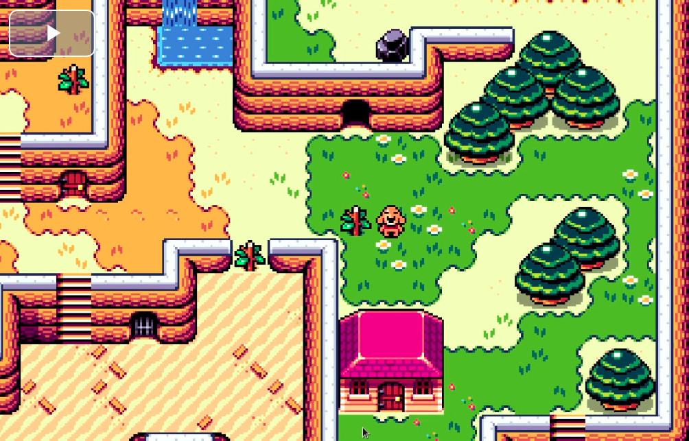
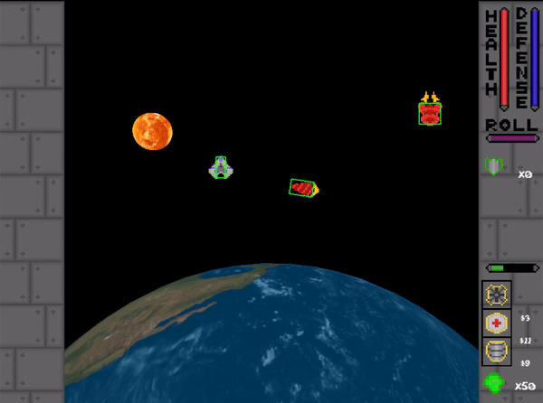
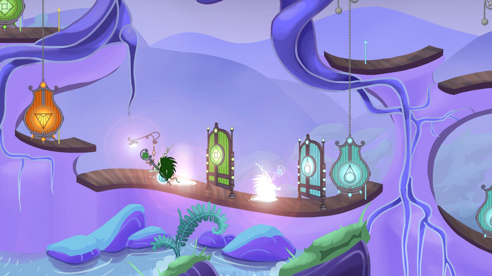
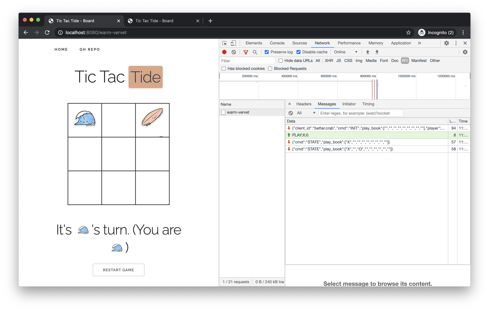
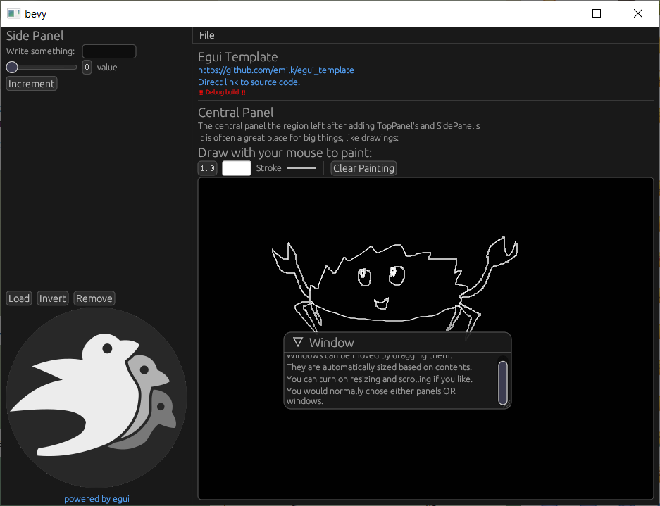
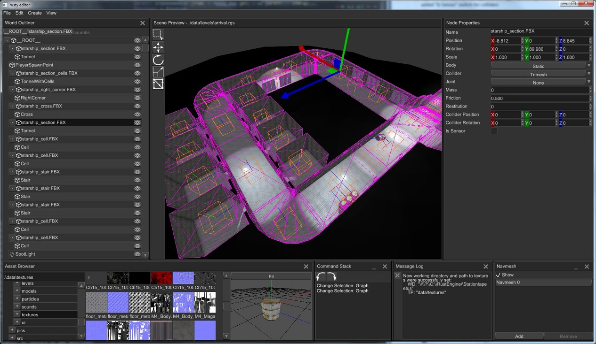
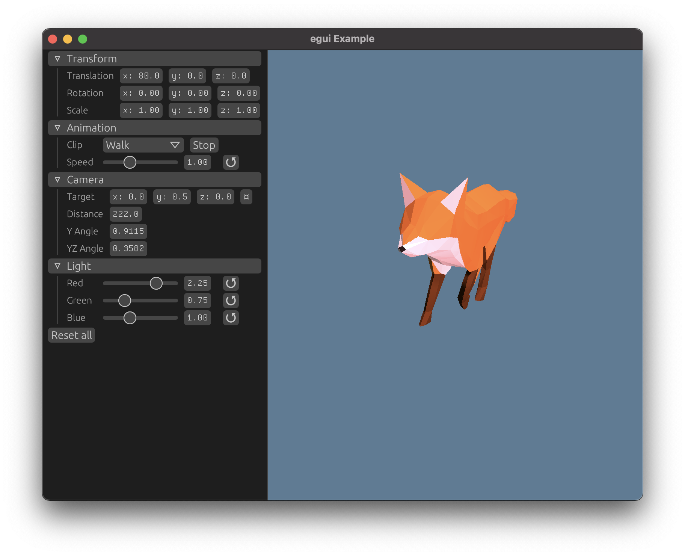

+++
title = "This Month in Rust GameDev #18 - January 2021"
date = 2021-02-08
transparent = true
draft = true
+++

Welcome to the 18th issue of the Rust GameDev Workgroup's
monthly newsletter.
[Rust] is a systems language pursuing the trifecta:
safety, concurrency, and speed.
These goals are well-aligned with game development.
We hope to build an inviting ecosystem for anyone wishing
to use Rust in their development process!
Want to get involved? [Join the Rust GameDev working group!][join]

You can follow the newsletter creation process
by watching [the coordination issues][coordination].
Want something mentioned in the next newsletter?
[Send us a pull request][pr].
Feel free to send PRs about your own projects!

[Rust]: https://rust-lang.org
[join]: https://github.com/rust-gamedev/wg#join-the-fun
[pr]: https://github.com/rust-gamedev/rust-gamedev.github.io
[coordination]: https://github.com/rust-gamedev/rust-gamedev.github.io/issues?q=label%3Acoordination
[Rust]: https://rust-lang.org
[join]: https://github.com/rust-gamedev/wg#join-the-fun

Table of contents:

- [Rust GameDev Podcast](#rust-gamedev-podcast)
- [Game Updates](#game-updates)
- [Learning Material Updates](#learning-material-updates)
- [Engine Updates](#engine-updates)
- [Library & Tooling Updates](#library-tooling-updates)
- [Popular Workgroup Issues in Github](#popular-workgroup-issues-in-github)
- [Requests for Contribution](#requests-for-contribution)

<!--
Ideal section structure is:

```
### [Title]


_image caption_

A paragraph or two with a summary and [useful links].

_Discussions:
[/r/rust](https://reddit.com/r/rust/todo),
[twitter](https://twitter.com/todo/status/123456)_

[Title]: https://first.link
[useful links]: https://other.link
```

If needed, a section can be split into subsections with a "------" delimiter.
-->

## [Rust GameDev Podcast][podcast-5]


[The 5th podcast episode][podcast-5] is an interview with
[Alex Ene][@_AlexEne_] creator of an upcoming dwarven simulation
game, [Dwarf World][dwarf-world].

> In this weeks episode, Richard and Forest chat to Alex Ene,
> creator of the dwarven simulation game, Dwarf World.
> We cover writing custom engines, unit testing, build
> systems and picking the right frameworks for your game.

Listen and subscribe from the following platforms:
[Rust GameDev Podcast (simplecast)](https://rustgamedev.com/),
[Apple Podcasts](https://podcasts.apple.com/gb/podcast/rust-game-dev/id1526304768),
[Spotify](https://open.spotify.com/show/7HRfGnTcXkLkQd9fxJbDGj),
[RSS Feed](https://feeds.simplecast.com/C6NQglnL),
[Google Podcasts](https://podcasts.google.com/feed/aHR0cHM6Ly9mZWVkcy5zaW1wbGVjYXN0LmNvbS9DNk5RZ2xuTA).

[podcast-5]: https://rustgamedev.com/episodes/interview-with-alex-ene
[@_AlexEne_]: https://twitter.com/_Alex_Ene_
[dwarf-world]: https://dwarf.world

## Game Updates

### [Teki (敵)][teki]


[Teki][teki] is a free and open-source fangame of the [Tōhō] series
using [SDL2] and [Legion] for ECS. Thanks to WebAssembly - via [wasm-pack]
\-, teki can be played [online][teki-online].

It is aimed to be a shoot ’em up game with "lots of bullets"
a.k.a danmaku 弾幕 - literally "barrage" or "bullet curtain" in japanese.

The project is still at a “very” early stage of development (Dec. 2020).

[teki]: https://github.com/o2sh/teki
[teki-online]: https://o2sh.github.io/teki
[Tōhō]: https://en.wikipedia.org/wiki/Touhou_Project
[SDL2]: https://github.com/Rust-SDL2/rust-sdl2
[Legion]: https://crates.io/crates/legion
[wasm-pack]: https://rustwasm.github.io/wasm-pack

### [Fishgame][fishgame]


_Fish game gameplay footage._

[Fishgame][fishgame] is an online multiplayer game, created in a
collaboration between [Nakama][nakama], an open-source scalable game
server, and the [Macroquad](https://github.com/not-fl3/macroquad/) game engine.

The game is going to showcase nakama multiplayer capabilities for the rust
language world.

This month the game got a public, multiplayer HTML5 build. [Play it online!][fishgame-itch]

[fishgame]: https://github.com/heroiclabs/fishgame-macroquad
[fishgame-itch]: https://fedorgames.itch.io/fish-game?secret=UAVcggHn332a
[nakama]: https://heroiclabs.com/
[macroquad]: https://github.com/not-fl3/macroquad

### [Oicana][oicana]


_Solving puzzles to build towers_

[Oicana][oicana] is a tower defense game with puzzle aspects submitted to Mini
jam 71 [on itch][oicana-itch] by [M1nd0fRafa3l][rafael-itch] and
[@nikl_me][nikl-twitter]. The game was written using the Rust game engine
[Bevy][bevy].

Colorless puzzle pieces try to reach your base. Your towers have to shoot at
the pieces to uncover their color. After defeating a piece, it will try to run
away and you should catch it to upgrade your towers or build new ones.

Following the game jam the tower upgrades where improved and game audio was
changed to use [Kira][kira-sound] via an
[experimental bevy plugin][kira-plugin].

[oicana]: https://github.com/NiklasEi/oicana
[oicana-itch]: https://niklme.itch.io/oicana
[bevy]: https://bevyengine.org/
[kira-sound]: https://github.com/tesselode/kira
[kira-plugin]: https://github.com/NiklasEi/bevy_kira_audio
[rafael-itch]: https://itch.io/profile/m1nd0frafa3l
[nikl-twitter]: https://twitter.com/nikl_me

### [A/B Street]


[A/B Street] by [@dabreegster] is a traffic simulation game exploring how small
changes to roads affect cyclists, transit users, pedestrians, and drivers, with
suppot for any city with OpenStreetMap coverage.

In January, [Bruce] implemented variable traffic signal timing, dedicated
cycle-paths and pedestrian plazas were imported, [Michael] and [Yuwen]
overhauled the UI buttons, and we finished day/night toggling. Loading on the
[web][abst-web] and starting scenarios is also much faster!

[A/B Street]: https://github.com/a-b-street/abstreet
[@dabreegster]: https://twitter.com/CarlinoDustin
[Bruce]: https://github.com/BruceBrown
[Michael]: https://github.com/michaelkirk
[Yuwen]: https://www.yuwen-li.com/
[abst-web]: http://abstreet.s3-website.us-east-2.amazonaws.com/dev/game/?--dev&cambridge/maps/great_kneighton.bin

### Paddlers


[Paddlers] ([GitHub][paddlers-gh], [Online Demo][paddlers-demo]) by [@jakmeier]
is an MMORTS for the browser, developed as an experimental hobby project.

This month, version 0.2.0 has been released, which removes all dependencies to
[Stdweb] and [Quicksilver] while keeping the game itself virtually unchanged.
In the process, a part of the code of Paddlers moved to [Paddle], a new
framework for 2D browser games running on desktop and mobile phones.
More details on that are available [here][paddlers-article].

Many new features for Paddle and Paddlers are already in the pipeline, so stay
tuned for more exciting updates in the next monthly newsletter!

[Paddlers]: https://paddlers.ch
[paddlers-gh]: https://github.com/jakmeier/paddlers-browser-game
[paddlers-demo]: https://demo.paddlers.ch
[@jakmeier]: https://github.com/jakmeier
[stdweb]: https://github.com/koute/stdweb
[Quicksilver]: https://github.com/ryanisaacg/quicksilver
[paddle]: https://github.com/jakmeier/paddle
[paddlers-article]: https://www.jakobmeier.ch/blogging/Paddlers_5.html

### [Antorum]


_Hanging out by the vault_

[Antorum] is a micro-multiplayer online role-playing game by [@dooskington].
The game server is written in Rust, and the official client is being developed
in Unity.

Banking was implemented this month! Players can now store their items and wealth
in a safe place. Additionally, the concept of "item combinations" was implemented,
bringing more interesting crafting scenarios into the game.

- [#28: Banking](https://ratwizard.dev/dev-log/antorum/28);
- [#29: Item Combinations](https://ratwizard.dev/dev-log/antorum/29);

[Antorum]: https://ratwizard.dev/dev-log/antorum
[@dooskington]: https://twitter.com/dooskington

### [SeniorSKY]


_Over the mountains in Slovakia_

[SeniorSKY]
is a flight simulator which uses Vulkan API, developed by [@pmathia0].

As an aerospace engineering student, Peter has always been interested how
a flight simulator works under the hood.

The development of SeniorSKY started as a hobby project during university
studies.

SeniorSKY uses real-world elevation data with 1 arc
second precision and can render the whole globe in real dimensions.
During the flight, the terrain tiles are loaded dynamically based
on real GPS coordinates of airplane, with a decreasing level of detail
further from the camera. This is achieved using a combination
of a terrain-quad-tree and GPU tessellation.

SeniorSKY also implements basic rendering of sky, atmosphere and fog.

To be able to simulate a flight, the application temporarily integrates 3rd party
flight dynamics engine called JSBSim. Meanwhile, development of own, custom
flight dynamics is already in progress.

[SeniorSKY]: https://youtube.com/playlist?list=PLMmaJuk-D7iaObZyhyvc83tNwpx3ghzkY
[@pmathia0]: https://twitter.com/pmathia0

### Flesh


_Inside flesh_

Flesh by [@im_oab] is a 2d-horizontal shmup game with hand-drawn animation
and implement using tetra. It still in the development stage but have
a release date set in October 2021.

This game takes place inside the flesh of mysterious organisms that players will
fight through multiple levels to get out.

[@im_oab]: https://twitter.com/im_oab

### [Station Iapetus]

[][si-youtube]
_Check [gameplay video][si-youtube] on YouTube_

[Station Iapetus][Station Iapetus] by [@mrDIMAS]
is a 3rd person shooter on the space prison Iapetus near the Saturn.

The game based on [rg3d] game engine and is meant to be the proof that
rg3d is ready for commercial production. The game is a commercial project
which will be released in the Steam.

[@mrDIMAS]: https://github.com/mrDIMAS
[rg3d]: https://github.com/mrDIMAS/rg3d
[Station Iapetus]: https://github.com/mrDIMAS/StationIapetus
[si-youtube]: https://www.youtube.com/watch?v=JCH2U5JOMlU

### Harvest Hero


Harvest Hero ([Discord][harvest-hero-discord]) by [@bombfuse_dev]
is an arcade/roguelike game built on top of [Emerald].
This month's updates include:

- Art update thanks to [@ddooby].
- Map templates for better designed maps.
- A shop system for buying abilities/enchantments.
- SFX were added to bring some more life to the game.

[harvest-hero-discord]: https://discord.gg/3NU5tYwRxJ
[@bombfuse_dev]: https://twitter.com/bombfuse_dev
[Emerald]: https://github.com/Bombfuse/emerald
[@ddooby]: https://twitter.com/ddoobysnax

### [Dwarf World][dwarf-world]


[Dwarf World][dwarf-world] by [Alex Ene][@_AlexEne_] has added a couple
of updates and improvements:

- Dynamic lights and light propagation so deeper caves are darker.
- An in-game feedback button that people can use to report bugs or
just give general feedback.
- All random numbers are from seeded generators so it makes bugs easier
to reproduce.
- A big chunk of a replay system is finished.
This should help a lot with reproducing issues. Plus, it's really fun to watch.
- Bug fixes and performance improvements, mostly related to
rendering and culling systems.

If you're interested in keeping a closer eye on the project and monitor
it's progress,
you can join the game's [discord channel][dwarf-world-discord].
That's where the pre-alpha builds will drop there once they are
ready to be seen by a wider audience.

[dwarf-world-discord]: https://discord.gg/vsRCxnY

### Stellary 2



Stellary 2 by [@CoffeJunkStudio][coffe-junk-studio] is a 3D
real-time artillery game in which the player has to destroy all enemy planets in
order to defend his own from extinction.

Based on the [SimJam 2020][simjam-2020] game
"[Stellary][stellary]", the studio is now
working on this sequel with their self-developed "Sphere Engine". It will
feature an underlying physically based gravity simulation, powering the space
battles in different solar systems. You can find regular updates on
[Twitter][coffe-junk-studio].

By the way: "Stellary 2" is just a working title, feel free to drop them a PM on
Twitter if you have a flash of inspiration!

[coffe-junk-studio]: https://twitter.com/CoffeJunkStudio
[simjam-2020]: https://itch.io/jam/dogpit-sim-jam
[stellary]: https://coffejunkstudio.itch.io/stellary

### [Bounty Bros.]

[][bounty_bros_video]
_First pass character controller video_

[Bounty Bros.] is a prototype dungeon crawler game in the spirit of _Legend of
Zelda: Link to the Past_. The game is being developed by [Katharos Technology]
as a playground for a future commercial game, along with a custom 2D engine
built on top of [Bevy].

The engine, which is unnamed so far, will be Open Sourced soon and will be
designed to make it very easy to make games with a similar gameplay and style,
primarily by simply writing YAML configuration files and integrating with
[LDtk].

[katharos technology]: https://katharostech.com
[bounty bros.]: https://katharostech.com/post/bounty-bros-prototype-game
[bounty_bros_video]: https://katharostech.com/post/bounty-bros-prototype-game#video
[bevy]: https://bevyengine.org
[ldtk]: https://ldtk.io

### [Theta Wave]

[][Theta Wave]
_Homing missiles pursue the closest player entity_

 A real name was finally chosen for space_shooter_rs! [Theta Wave] is a space
 shooter game by developers [@micah_tigley] and [@carlosupina]. It is one of
 the showcase games for the [Amethyst Engine]. In the past month, they have
 been focused on improving the motion system for the game. The improvements
 allowed them to begin adding more interesting behavior for moving entities.
 Missiles were changed to home to the player.

[Theta Wave]: https://github.com/amethyst/theta-wave
[@micah_tigley]: https://twitter.com/micah_tigley
[@carlosupina]: https://twitter.com/carlosupina
[Amethyst Engine]: https://amethyst.rs/

### [Way of Rhea][wor-site]



Way of Rhea is a picturesque puzzle game that lets you correct your mistakes.
Change your color, teleport past the colored gates, master the color powered
circuits, and befriend the color changing crabs—but don't let them out!

This month's major updates include:

- Autosave support
- Steam cloud support
- A free demo was released as part of Boston FIG (no longer available)
- In game audio options
- A new level featuring a new puzzle mechanic
- An [updated trailer][wor-trailer]

[wor-site]: https://www.anthropicstudios.com/way-of-rhea
[wor-trailer]: https://www.youtube.com/watch?v=PRifdHcaswc

### [Shotcaller]


_An art mockup of some Shotcaller action._

[Shotcaller] ([Discord][shotcaller-Discord]) is a minimalistic MOBA
that focuses strictly on macro-play with few actions-per-minute,
leaving only room for grand strategy decisions.
The game is made with [bracket-lib], a [custom game engine][jojolepro/minigene]
and [Plank ECS][planks_ecs].

Recent updates include:

- [Version v0.4.0 was released][shotcaller-v0.4.0].
- First batch of custom art assets completed; will be implemented
  in the month to come.
- New leaders:
  [Alchemist](https://github.com/amethyst/shotcaller/pull/29),
  [Axe](https://github.com/amethyst/shotcaller/pull/30),
  [Rubick](https://github.com/amethyst/shotcaller/pull/34),
  [Centaur](https://github.com/amethyst/shotcaller/pull/36),
  [Bristleback](https://github.com/amethyst/shotcaller/pull/40),
  [Shadow Fiend](https://github.com/amethyst/shotcaller/pull/35).
- [Gold system](https://github.com/amethyst/shotcaller/pull/31).
- [Headless option](https://github.com/amethyst/shotcaller/pull/44)
  (in preparation for AI/ML experimenting).
- [Fog of War](https://github.com/amethyst/shotcaller/pull/41).
- [Mouse support](https://github.com/amethyst/shotcaller/pull/46).

[Shotcaller]: https://github.com/amethyst/shotcaller
[shotcaller-Discord]: https://discord.gg/qvJyTYM
[bracket-lib]: https://github.com/thebracket/bracket-lib
[jojolepro/minigene]: https://github.com/jojolepro/minigene
[planks_ecs]: https://www.jojolepro.com/blog/2021-01-13_planks_ecs
[shotcaller-v0.4.0]: https://reddit.com/r/rust_gamedev/comments/kveih9/shotcaller_mobagame_v040

## Learning Material Updates

### [Hands-on Rust][hands-on-rust]

[][hands-on-rust]

["Hands-on Rust: Effective Learning through 2D Game Development and Play"][hands-on-rust]
is a book by [Herbert Wolverson][thebracket]
(the author of [bracket-lib] and [the Rust Roguelike Tutorial][rl-book]):
make fun games as you learn Rust through a series of hands-on gamedev tutorials
and real-world use of core language skills.

Recent [beta releases][beta-books] added the following chapters:

- \#10: Fields of View;
- \#11: More Interesting Dungeons;
- \#12: Map Themes;
- \#13: Inventory and Power Ups;
- \#14: Deeper Dungeons;
- \#15: Combat Systems and Loot;
- \#16: Final Steps and Finishing Touches.

[hands-on-rust]: https://pragprog.com/titles/hwrust/hands-on-rust
[thebracket]: https://bracketproductions.com
[beta-books]: https://pragprog.com/support/#beta-books
[bracket-lib]: https://github.com/thebracket/bracket-lib
[rl-book]: https://bfnightly.bracketproductions.com/rustbook

### [Triangle from Scratch][tri-scratch]

[Triangle from Scratch][tri-scratch] ([source code][tri-scratch-src])
is a WIP tutorial series by [@Lokathor] about drawing a triangle
without using any outside crates.
Two extensive chapters were added this month:

- ["Loading OpenGL with Win32 API"][tri-scratch-gl-win];
- ["WebGL with bare WASM"][tri-scratch-gl-wasm].

[tri-scratch]: https://rust-tutorials.github.io/triangle-from-scratch
[tri-scratch-src]: https://github.com/rust-tutorials/triangle-from-scratch
[@Lokathor]: https://twitter.com/Lokathor
[tri-scratch-gl-win]: https://rust-tutorials.github.io/triangle-from-scratch/loading_opengl/win32.html
[tri-scratch-gl-wasm]: https://rust-tutorials.github.io/triangle-from-scratch/web_stuff/web_gl_with_bare_wasm.html

### [Setting a Rust Executable's Icon in Windows][win-icon]


_[Way of Rhea][wor-site]'s icon in the taskbar_

[Anthropic Studios][anthropic] has [shared an article][win-icon] about
manually using `rc.exe` and embedding the resulting `.res` into your app
to set your game's system icon on Windows.

_Discussions:
[/r/rust_gamedev](https://reddit.com/r/rust_gamedev/comments/kraink/setting_a_rust_executables_icon_in_win)_

[win-icon]: https://anthropicstudios.com/2021/01/05/setting-a-rust-windows-exe-icon
[anthropic]: https://anthropicstudios.com

### [Exploring WebSocket with Rust and Tide]



An exploration post on how to use WebSockets with [Tide] framework by creating
a simple tic-tac-toc game. It's focused on how to implement `ws` to enable all
time of real time apps (and games) with Rust and Tide.
You can also play [tic-tac-tide] online.

[Exploring WebSocket with Rust and Tide]: https://javierviola.com/post/exploring-websocket-with-rust-and-tide/
[Tide]: https://github.com/http-rs/tide
[tic-tac-tide]: https://tic-tac-tide.labs.javierviola.com/

## Engine Updates

### [`ggez`](ggez)


`ggez` is a lightweight cross-platform game framework for making 2D
games with minimum friction.

The zero'th release candidate for version 0.6.0 has been released and
there has been no particularly horrific outcry of people's games
exploding.  A first release candidate with a pile of medium-sized bug
fixes should be coming in early February, hopefully soon followed by a
full release.  Special thanks to the contributors who helped hunt bugs
and organize PR's to get this version out the door:

- PSteinhaus
- Manghi
- AaronM04
- Systemcluster
- Andy-Python-Programmer

_Discussions: [Issue tracker](ggez-github)_

[ggez]: https://crates.io/crates/ggez
[ggez-github]: https://github.com/ggez/ggez/milestone/6

### [Tetra]

[Tetra] is a simple 2D game framework, inspired by XNA and Raylib. This month,
versions 0.5.7 and 0.5.8 were released, with various changes:

- Basic multisampled anti-aliasing support (with further improvements to come).
- Functions for generating primitive shape meshes.
- A more flexible `Rectangle` type.
- Lots of bug fixes and docs improvements.

For full details, see the [changelog][tetra-changelog].

Additionally, work on [version 0.6][tetra-06-changelog] has begun, with a release
planned for some time in February!

[tetra]: https://github.com/17cupsofcoffee/tetra
[tetra-changelog]: https://github.com/17cupsofcoffee/tetra/blob/main/CHANGELOG.md
[tetra-06-changelog]: https://github.com/17cupsofcoffee/tetra/blob/0.6/CHANGELOG.md

## Library & Tooling Updates

### [`LDtk-rs`]

[`LDtk-rs`] is a Rust crate for reading the [LDtk] map file format. The bindings
to the LDtk format are 100% automatically generated from the LDtk JSON Schema,
with the option to download the latest JSON Schema at build time for automatic
updates.

[`LDtk-rs`]: https://github.com/katharostech/ldtk-rs
[LDtk]: https://ldtk.io

### [`bevy_ldtk`]


_( Tileset from ["Cavernas"] by Adam Saltsman )_

[`bevy_ldtk`] is a Bevy plugin for loading [LDtk] tilemaps.

It features:

- An efficient renderer that only uses 4 vertices per map layer
- Hot reloading through the Bevy asset server integration
- Heavily commented code to help others who want to see how to make their own
  tilemap renderers

[`bevy_ldtk`]: https://github.com/katharostech/bevy_ldtk
[ldtk]: https://ldtk.io
["cavernas"]: https://adamatomic.itch.io/cavernas

### [imgui-rs]


_Drag and Drop and the new Drawing Api at Work in 0.7.0_

[imgui-rs] is the Rust bindings for the ubiquitous immediate mode GUI library,
Dear ImGui.
Under new maintainence, [version 0.7] has been released, which features a new
API for raw draw calls, support for ergonomic Drag and Drop, and tons of improvements.
Notably, many functions were made `inline` and/or `const`, including the `im_str!`
macro.

[imgui-rs]: https://github.com/imgui-rs/imgui-rs
[version 0.7]: https://github.com/imgui-rs/imgui-rs/releases/tag/v0.7.0

### [egui]


_Some of the supported widgets in the new grid layout._

[egui] is a simple, fast, and highly portable immediate mode GUI library.
This month [version 0.8] of egui was released with a new grid layout,
new look, and many smaller fixes and improvements.
You can try out egui in the [online demo].

[egui]: https://github.com/emilk/egui
[online demo]: https://emilk.github.io/egui
[version 0.8]: https://github.com/emilk/egui/blob/master/CHANGELOG.md#080---2021-01-17---grid-layout--new-visual-style

### [`bevy_egui`]



[`bevy_egui`] provides a [Egui](https://github.com/emilk/egui) integration
for the [Bevy](https://github.com/bevyengine/bevy) game engine.
It supports [`bevy_webgl2`] and implements the full set of Egui features
(such as clipboard and opening URLs).

Try out the [online demo](https://mvlabat.github.io/bevy_egui_web_showcase/index.html).

[`bevy_egui`]: https://github.com/mvlabat/bevy_egui
[`bevy_webgl2`]: https://github.com/mrk-its/bevy_webgl2

### [rkyv]

[rkyv] is a zero-copy deserialization framework for Rust. It's similar to
FlatBuffers and Cap'n Proto and can be used for data storage and messaging.

Version 0.3 was released this month and brought some highly-requested features:

- A new hashmap implementation using perfect hashing to decrease memory usage
  and fix portability issues.
- The `Unarchive` trait to enable more traditional data deserialization for
  archived types.
- Improved validation performance.
- Better error messages and API ergonomics.
- A [book][rkyv-book] with more narrative documentation on architecture and
  internals.
- More tests and realistic benchmarks against other popular serialization
  frameworks.

The next update will be [v0.4][rkyv-v0.4] and is on the way soon with a release
date around mid-February.

[rkyv]: https://github.com/djkoloski/rkyv
[rkyv-book]: https://djkoloski.github.io/rkyv
[rkyv-v0.4]: https://github.com/djkoloski/rkyv/milestone/5

### [kira]

[kira] by [@tesselode] is a game audio library tailored to composers and other
people who need expressive audio.

v0.4.0 was released with a new wasm32 support, a new handle-based API, improved
error handling, and serde support for sequences, arrangements, and most config structs.

_Discussions: [/r/rust](https://www.reddit.com/r/rust/comments/l3ma3d/kira_game_audio_library_v040_wasm_support_serde/),
[Twitter](https://twitter.com/tesselode/status/1353111739433410560)_

[Kira]: https://github.com/tesselode/kira
[@tesselode]: https://twitter.com/tesselode

### [gfx-rs] and [wgpu-rs]


The community managed to squeeze the v0.7 releases out
at the end of the month. See the detailed notes on [gfx blog post].

The highlight of the show is about shaders. Most of wgpu-rs shaders are
now written in [WGSL],
and gfx-rs community is inviting Rust game/graphics developers to evaluate if
[naga] could fulfill their shader translation needs in the future.

[gfx-rs]: https://github.com/gfx-rs/gfx
[wgpu-rs]: https://github.com/gfx-rs/wgpu-rs
[gfx blog post]: https://gfx-rs.github.io/2021/02/02/release-0.7.html
[WGSL]: https://gpuweb.github.io/gpuweb/wgsl.html
[naga]: https://github.com/gfx-rs/naga

### [rg3d]


_A level made in [rusty-editor][rusty_editor] which is a native scene editor
for the rg3d game engine._

[rg3d] is a game engine that aims to be easy to use and provide large set
of out-of-box features. Some of the recent updates:

- Improved animation blending state machines.
- Added ability to copy nodes in-place.
- Fixed clipping issues in the UI.
- Reduced number of draw calls for UI by 70%.
- Fixed text measurement in the UI.
- Added opacity for UI widgets.
- Fixed layout of Scroll- and Wrap- panels.
- Fixed light scatter issues for spot lights.
- Added support for transparent meshes.
- Migrated to rapier 0.5.
- Fixed animation signal handling when animation playing in reverse.
- Animation tracks now are able to filter position/scale/rotation.
- Fixed sprite rendering.
- Improved copy/paste in rusty-editor.
- Lots of other small fixes and improvements.

Join the [rg3d's Discord channel][rg3d_discord]
or follow [Dmitry Stepanov on Twitter][rg3d_twitter].

[rg3d]: https://github.com/mrDIMAS/rg3d
[rg3d_discord]: https://discord.gg/xENF5Uh
[rg3d_twitter]: https://twitter.com/DmitryNStepanov
[rusty_editor]: https://github.com/mrDIMAS/rusty-editor

### [This Month in Mun][mun-january]

[][Mun]

[Mun] is a scripting language for gamedev focused on quick iteration times
that is written in Rust.

Revitalized from the holiday break, the Mun core team got cracking; those
[January updates][mun-january] include:

- a ton of new language server features;
- the ability to emit IR;
- better documentation;
- bug fixes and other improvements.

[Mun]: https://mun-lang.org
[mun-january]: https://mun-lang.org/blog/2021/02/05/this-month-january

### [Dotrix]



[Dotrix] ([Discord][lowenware-discord], [Twitter][@lowenware]) got an official
[egui] support and a new example demonstrating various
engine features and controls. The next big milestone for [Dotrix] developers is
a terrain engine and editor, also made with [egui]. Some progress you can
already find on [YouTube][lowenware-youtube].

[Dotrix]: https://dotrix.rs
[lowenware-discord]: https://discord.com/invite/DrzwBysNRd
[lowenware-youtube]: https://youtube.com/channel/UCdriNXRizbBFQhqZefaw44A
[@lowenware]: https://twitter.com/lowenware

## Popular Workgroup Issues in Github

<!-- Up to 10 links to interesting issues -->

## Requests for Contribution

<!-- Links to "good first issue"-labels or direct links to specific tasks -->

- [Embark's open issues][embark-open-issues] ([embark.rs]).
- [gfx-rs's "contributor-friendly" issues][gfx-issues].
- [wgpu's "help wanted" issues][wgpu-help-wanted].
- [luminance's "low hanging fruit" issues][luminance-fruits].
- [ggez's "good first issue" issues][ggez-issues].
- [Veloren's "beginner" issues][veloren-beginner].
- [Amethyst's "good first issue" issues][amethyst-issues].
- [A/B Street's "good first issue" issues][abstreet-issues].
- [Mun's "good first issue" issues][mun-issues].
- [SIMple Mechanic's good first issues][simm-issues].
- [Bevy's "good first issue" issues][bevy-issues].

[embark.rs]: https://embark.rs
[embark-open-issues]: https://github.com/search?q=user:EmbarkStudios+state:open
[gfx-issues]: https://github.com/gfx-rs/gfx/issues?q=is%3Aissue+is%3Aopen+label%3Acontributor-friendly
[wgpu-help-wanted]: https://github.com/gfx-rs/wgpu-rs/issues?q=is%3Aissue+is%3Aopen+label%3A%22help+wanted%22
[luminance-fruits]: https://github.com/phaazon/luminance-rs/issues?q=is%3Aissue+is%3Aopen+label%3A%22low+hanging+fruit%22
[ggez-issues]: https://github.com/ggez/ggez/labels/%2AGOOD%20FIRST%20ISSUE%2A
[veloren-beginner]: https://gitlab.com/veloren/veloren/issues?label_name=beginner
[amethyst-issues]: https://github.com/amethyst/amethyst/issues?q=is%3Aissue+is%3Aopen+label%3A%22good+first+issue%22
[abstreet-issues]: https://github.com/a-b-street/abstreet/issues?q=is%3Aissue+is%3Aopen+label%3A%22good+first+issue%22
[mun-issues]: https://github.com/mun-lang/mun/labels/good%20first%20issue
[simm-issues]: https://github.com/mkhan45/SIMple-Mechanics/labels/good%20first%20issue
[bevy-issues]: https://github.com/bevyengine/bevy/labels/good%20first%20issue

------

That's all news for today, thanks for reading!

Want something mentioned in the next newsletter?
[Send us a pull request][pr].

Also, subscribe to [@rust_gamedev on Twitter][@rust_gamedev]
or [/r/rust_gamedev subreddit][/r/rust_gamedev] if you want to receive fresh news!

<!--
TODO: Add real links and un-comment once this post is published
**Discussions of this post**:
[/r/rust](TODO),
[twitter](TODO).
-->

[/r/rust_gamedev]: https://reddit.com/r/rust_gamedev
[@rust_gamedev]: https://twitter.com/rust_gamedev
[pr]: https://github.com/rust-gamedev/rust-gamedev.github.io
