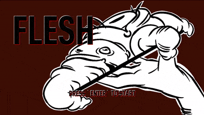
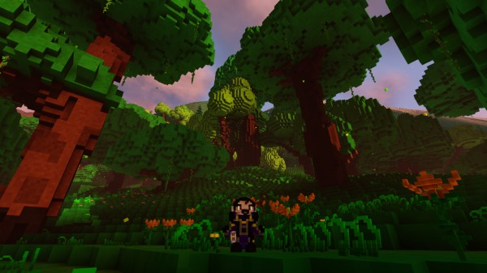

+++
title = "This Month in Rust GameDev #19 - February 2021"
date = 2021-03-03
transparent = true
draft = true
+++

Welcome to the 19th issue of the Rust GameDev Workgroup's
monthly newsletter.
[Rust] is a systems language pursuing the trifecta:
safety, concurrency, and speed.
These goals are well-aligned with game development.
We hope to build an inviting ecosystem for anyone wishing
to use Rust in their development process!
Want to get involved? [Join the Rust GameDev working group!][join]

You can follow the newsletter creation process
by watching [the coordination issues][coordination].
Want something mentioned in the next newsletter?
[Send us a pull request][pr].
Feel free to send PRs about your own projects!

[Rust]: https://rust-lang.org
[join]: https://github.com/rust-gamedev/wg#join-the-fun
[pr]: https://github.com/rust-gamedev/rust-gamedev.github.io
[coordination]: https://github.com/rust-gamedev/rust-gamedev.github.io/issues?q=label%3Acoordination
[Rust]: https://rust-lang.org
[join]: https://github.com/rust-gamedev/wg#join-the-fun

Table of contents:

- [Game Updates](#game-updates)
- [Learning Material Updates](#learning-material-updates)
- [Engine Updates](#engine-updates)
- [Library & Tooling Updates](#library-tooling-updates)
- [Popular Workgroup Issues in Github](#popular-workgroup-issues-in-github)
- [Requests for Contribution](#requests-for-contribution)

<!--
Ideal section structure is:

```
### [Title]


_image caption_

A paragraph or two with a summary and [useful links].

_Discussions:
[/r/rust](https://reddit.com/r/rust/todo),
[twitter](https://twitter.com/todo/status/123456)_

[Title]: https://first.link
[useful links]: https://other.link
```

If needed, a section can be split into subsections with a "------" delimiter.
-->

## Game Updates

### Flesh


_Title screen + gameplay_

Flesh by [@im_oab] is a 2D-horizontal shmup game with hand-drawn animation and
organic/fleshy theme. It is implemented using [tetra]. This month update include:

- Add title screen.
- Support gamepad.
- Add new enemy types for first level include mid-boss.

[@im_oab]: https://twitter.com/im_oab
[tetra]: https://github.com/17cupsofcoffee/tetra

### [Teki (敵)][teki]


[Teki][teki] is a free and open-source fangame of the [Tōhō] series
using [SDL2] and [Legion] for ECS. It is aimed to be a shoot ’em up game with
"lots of bullets" a.k.a danmaku 弾幕 - literally "barrage" or "bullet curtain" in
Japanese.

The project is still at a “very” early stage of development (Dec. 2020).

This month's updates include:

- New enemy type: big fairy
- New special card: Stellar Vortex
- Add yin yang orbs

[teki]: https://github.com/o2sh/teki
[Tōhō]: https://en.wikipedia.org/wiki/Touhou_Project
[SDL2]: https://github.com/Rust-SDL2/rust-sdl2
[Legion]: https://crates.io/crates/legion

### [Theta Wave]

[][Theta Wave]
_Homing missiles periodically spawn from missile launcher enemies_

[Theta Wave] is a space shooter game by developers [@micah_tigley] and
[@carlosupina]. It is one of the showcase games for the [Amethyst Engine].
In the past month, they have been focusing on refactoring the motion system
to make the code more approachable to other contributors.

Notable changes:

- Missiles now spawn from missile launcher enemies
- Cursed background slowly fades in over the course of the level

[Theta Wave]: https://github.com/amethyst/theta-wave
[@micah_tigley]: https://twitter.com/micah_tigley
[@carlosupina]: https://twitter.com/carlosupina
[Amethyst Engine]: https://amethyst.rs/

### [Veloren][veloren]


_A lush forest to explore_

[Veloren][veloren] is an open world, open-source voxel RPG inspired by Dwarf
Fortress and Cube World.

In February, lots of work has been done on worldsim, with travelling merchants
being worked on. Some experiments have been happening on procedurally generating
giant trees. Lots is being done on the combat end, with dual wielding and
modular weapons being a big focus. Player trading was also implemented, which
allows items to be shared on the server. A large internal shift is being made
from diesel to rusqlite.

A rework of attacks was done to allow their effects to be more dynamic. Lots of
work has been done on the art team, with new weapon models, new mobs like fish.
Some quality of life improvements were added, like humanoids automatically
deploying gliders while falling to avoid fall damage. CI changes were made to
finally have the Github mirror update periodically without error from LFS
storage. In March, Veloren will release 0.9.

February's full weekly devlogs: "This Week In Veloren...":
[#105](https://veloren.net/devblog-105),
[#106](https://veloren.net/devblog-106),
[#107](https://veloren.net/devblog-107),
[#108](https://veloren.net/devblog-108).

[veloren]: https://veloren.net

## Learning Material Updates

## Engine Updates

### [Tetra]


_Tetra's demo game_

[Tetra] is a simple 2D game framework, inspired by XNA, Love2D and Raylib.
This month, version 0.6 was released, with some big changes and features:

- A simpler drawing API
- Less global state for mesh drawing
- Multisampled canvases
- Better font rendering

For more details, see the [changelog][tetra-changelog], or
[17cupsofcoffee's twitter thread][tetra-twitter] about the release.

[tetra]: https://github.com/17cupsofcoffee/tetra
[tetra-changelog]: https://github.com/17cupsofcoffee/tetra/blob/main/CHANGELOG.md
[tetra-twitter]: https://twitter.com/17cupsofcoffee/status/1357750836370284544

### [A/B Street]


[A/B Street] by [@dabreegster] is a traffic simulation game exploring how small
changes to roads affect cyclists, transit users, pedestrians, and drivers, with
suppot for any city with OpenStreetMap coverage.

In February, [Bruce] implemented lagging green traffic signals, [Michael] and
[Yuwen] released the new day UI theme, more cyclepaths and service roads were
imported for all maps, and we added loads of maps, a new per-country picker UI,
and dynamic font loading. Try out [Taipei] in the web browser to see all of
this in action!

[A/B Street]: https://github.com/a-b-street/abstreet
[@dabreegster]: https://twitter.com/CarlinoDustin
[Bruce]: https://github.com/BruceBrown
[Michael]: https://github.com/michaelkirk
[Yuwen]: https://www.yuwen-li.com/
[Taipei]: http://abstreet.s3-website.us-east-2.amazonaws.com/dev/game/?--dev&tw/taipei/maps/center.bin

## Library & Tooling Updates

### [rkyv]

[rkyv] is a zero-copy deserialization framework for Rust. It's similar to
FlatBuffers and Cap'n Proto and can be used for data storage and messaging.

[Version 0.4][rkyv-v0.4] was released this month and brought some big changes
and improvements:

- Major traits have been refactored and renamed to clarify their roles
- Shared pointers (`Rc`, `Arc`, `Weak`) can now be serialized, deserialized,
  and validated with correct ownership semantics
- Serialization, deserialization, and validation all now support custom contexts
- Greatly improved support for 32- and 64-bit archives by implementing Archive
  for `usize` and `isize`
- More comprehensive documentation in the [book][rkyv-book]

This release completes the project's initial feature set, and a
[request for feedback][rkyv-request-for-feedback] has been opened to help with
future project planning.

[rkyv]: https://github.com/djkoloski/rkyv
[rkyv-v0.4]: https://github.com/djkoloski/rkyv/releases/tag/v0.4.0
[rkyv-book]: https://djkoloski.github.io/rkyv
[rkyv-request-for-feedback]: https://github.com/djkoloski/rkyv/issues/67

## Popular Workgroup Issues in Github

<!-- Up to 10 links to interesting issues -->

## Requests for Contribution

<!-- Links to "good first issue"-labels or direct links to specific tasks -->

- [Embark's open issues][embark-open-issues] ([embark.rs]).
- [gfx-rs's "contributor-friendly" issues][gfx-issues].
- [wgpu's "help wanted" issues][wgpu-help-wanted].
- [luminance's "low hanging fruit" issues][luminance-fruits].
- [ggez's "good first issue" issues][ggez-issues].
- [Veloren's "beginner" issues][veloren-beginner].
- [Amethyst's "good first issue" issues][amethyst-issues].
- [A/B Street's "good first issue" issues][abstreet-issues].
- [Mun's "good first issue" issues][mun-issues].
- [SIMple Mechanic's good first issues][simm-issues].
- [Bevy's "good first issue" issues][bevy-issues].

[embark.rs]: https://embark.rs
[embark-open-issues]: https://github.com/search?q=user:EmbarkStudios+state:open
[gfx-issues]: https://github.com/gfx-rs/gfx/issues?q=is%3Aissue+is%3Aopen+label%3Acontributor-friendly
[wgpu-help-wanted]: https://github.com/gfx-rs/wgpu-rs/issues?q=is%3Aissue+is%3Aopen+label%3A%22help+wanted%22
[luminance-fruits]: https://github.com/phaazon/luminance-rs/issues?q=is%3Aissue+is%3Aopen+label%3A%22low+hanging+fruit%22
[ggez-issues]: https://github.com/ggez/ggez/labels/%2AGOOD%20FIRST%20ISSUE%2A
[veloren-beginner]: https://gitlab.com/veloren/veloren/issues?label_name=beginner
[amethyst-issues]: https://github.com/amethyst/amethyst/issues?q=is%3Aissue+is%3Aopen+label%3A%22good+first+issue%22
[abstreet-issues]: https://github.com/a-b-street/abstreet/issues?q=is%3Aissue+is%3Aopen+label%3A%22good+first+issue%22
[mun-issues]: https://github.com/mun-lang/mun/labels/good%20first%20issue
[simm-issues]: https://github.com/mkhan45/SIMple-Mechanics/labels/good%20first%20issue
[bevy-issues]: https://github.com/bevyengine/bevy/labels/good%20first%20issue

------

That's all news for today, thanks for reading!

Want something mentioned in the next newsletter?
[Send us a pull request][pr].

Also, subscribe to [@rust_gamedev on Twitter][@rust_gamedev]
or [/r/rust_gamedev subreddit][/r/rust_gamedev] if you want to receive fresh news!

<!--
TODO: Add real links and un-comment once this post is published
**Discussions of this post**:
[/r/rust](TODO),
[twitter](TODO).
-->

[/r/rust_gamedev]: https://reddit.com/r/rust_gamedev
[@rust_gamedev]: https://twitter.com/rust_gamedev
[pr]: https://github.com/rust-gamedev/rust-gamedev.github.io
