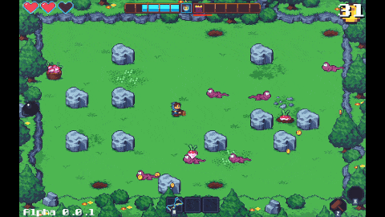
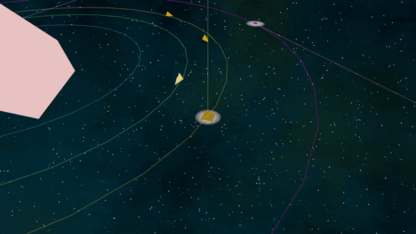
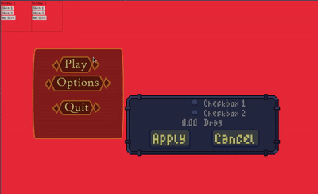

+++
title = "This Month in Rust GameDev #19 - February 2021"
date = 2021-03-03
transparent = true
draft = true
+++

Welcome to the 19th issue of the Rust GameDev Workgroup's
monthly newsletter.
[Rust] is a systems language pursuing the trifecta:
safety, concurrency, and speed.
These goals are well-aligned with game development.
We hope to build an inviting ecosystem for anyone wishing
to use Rust in their development process!
Want to get involved? [Join the Rust GameDev working group!][join]

You can follow the newsletter creation process
by watching [the coordination issues][coordination].
Want something mentioned in the next newsletter?
[Send us a pull request][pr].
Feel free to send PRs about your own projects!

[Rust]: https://rust-lang.org
[join]: https://github.com/rust-gamedev/wg#join-the-fun
[pr]: https://github.com/rust-gamedev/rust-gamedev.github.io
[coordination]: https://github.com/rust-gamedev/rust-gamedev.github.io/issues?q=label%3Acoordination
[Rust]: https://rust-lang.org
[join]: https://github.com/rust-gamedev/wg#join-the-fun

Table of contents:

- [Game Updates](#game-updates)
- [Learning Material Updates](#learning-material-updates)
- [Engine Updates](#engine-updates)
- [Library & Tooling Updates](#library-tooling-updates)
- [Popular Workgroup Issues in Github](#popular-workgroup-issues-in-github)
- [Requests for Contribution](#requests-for-contribution)

<!--
Ideal section structure is:

```
### [Title]


_image caption_

A paragraph or two with a summary and [useful links].

_Discussions:
[/r/rust](https://reddit.com/r/rust/todo),
[twitter](https://twitter.com/todo/status/123456)_

[Title]: https://first.link
[useful links]: https://other.link
```

If needed, a section can be split into subsections with a "------" delimiter.
-->

## Game Updates

### Flesh


_Title screen + gameplay_

Flesh by [@im_oab] is a 2D-horizontal shmup game with hand-drawn animation and
organic/fleshy theme. It is implemented using [tetra]. This month update include:

- Add title screen.
- Support gamepad.
- Add new enemy types for first level include mid-boss.

[@im_oab]: https://twitter.com/im_oab
[tetra]: https://github.com/17cupsofcoffee/tetra

### [Fishgame][fishgame]


_Fish game UI._

[Fishgame][fishgame] [(web build)][fishgame-itch] is an online multiplayer game,
created in a collaboration between [Nakama][nakama], an open-source scalable
game server, and the [Macroquad](https://github.com/not-fl3/macroquad/) game
engine.

This month fishgame utilized new macroquad's UI system and got the title screen
and better login screen.

[fishgame]: https://github.com/heroiclabs/fishgame-macroquad
[fishgame-itch]: https://fedorgames.itch.io/fish-game?secret=UAVcggHn332a
[nakama]: https://heroiclabs.com/
[macroquad]: https://github.com/not-fl3/macroquad

### [Teki (敵)][teki]


[Teki][teki] is a free and open-source fangame of the [Tōhō] series
using [SDL2] and [Legion] for ECS. It is aimed to be a shoot ’em up game with
"lots of bullets" a.k.a danmaku 弾幕 - literally "barrage" or "bullet curtain" in
Japanese.

The project is still at a “very” early stage of development (Dec. 2020).

This month's updates include:

- New enemy type: big fairy
- New special card: Stellar Vortex
- Add yin yang orbs

[teki]: https://github.com/o2sh/teki
[Tōhō]: https://en.wikipedia.org/wiki/Touhou_Project
[SDL2]: https://github.com/Rust-SDL2/rust-sdl2
[Legion]: https://crates.io/crates/legion

### [Harvest Hero][discord]



[Harvest Hero][discord] is undergoing a shop system rework. But,
we are still implementing new abilities!
Use Zhebnog's Hourglass to stop time and get weird.

Built on top of [Emerald][emerald] by [Bombfuse][twitter].

This month's updates include:

- Added "Flame Guard" enchantment
- Added "Zhebnog's Hourglass" ability
- Began work on a new main menu
- Implemented a functional shop system

[discord]: https://discord.gg/CJRbxQn3d9
[twitter]: https://twitter.com/bombfuse_dev
[emerald]: https://github.com/Bombfuse/emerald

### [A/B Street]


[A/B Street] by [@dabreegster] is a traffic simulation game exploring how small
changes to roads affect cyclists, transit users, pedestrians, and drivers, with
suppot for any city with OpenStreetMap coverage.

In February, [Bruce] implemented lagging green traffic signals, [Michael] and
[Yuwen] released the new day UI theme, more cyclepaths and service roads were
imported for all maps, and we added loads of maps, a new per-country picker UI,
and dynamic font loading. Try out [Taipei] in the web browser to see all of
this in action!

[A/B Street]: https://github.com/a-b-street/abstreet
[@dabreegster]: https://twitter.com/CarlinoDustin
[Bruce]: https://github.com/BruceBrown
[Michael]: https://github.com/michaelkirk
[Yuwen]: https://www.yuwen-li.com/
[Taipei]: http://abstreet.s3-website.us-east-2.amazonaws.com/dev/game/?--dev&tw/taipei/maps/center.bin

### [Paddlers]


[Paddlers] ([GitHub][paddlers-gh], [Online Demo][paddlers-demo]) by [@jakmeier]
is an experimental MMORTS with the backend and the web client all written in
Rust.

February gave birth to Paddlers release 0.2.1 and a ton of new game mechanics.
It features a skill map, quests, and a refreshed take on the tower defense
aspect of the game. On top of that, the rendering engine (part of the
[Paddle][paddle] framework) has been reworked and now allows for custom
shaders. Read all about this month's changes in this
[article][paddlers-article] released on the developer's private website.

[Paddlers]: https://paddlers.ch
[paddlers-gh]: https://github.com/jakmeier/paddlers-browser-game
[paddlers-demo]: https://demo.paddlers.ch
[@jakmeier]: https://github.com/jakmeier
[paddle]: https://github.com/jakmeier/paddle
[paddlers-article]: https://www.jakobmeier.ch/blogging/Paddlers_6.html

### Stellary 2

[][stellary2-aml-tweet]
_▶️ Click to [watch the full video][stellary2-aml-tweet]_

Stellary 2 by [@CoffeJunkStudio][coffe-junk-studio] is a 3D
real-time space shooter in which the player has to prevail against enemy space
ships.

The latest updates include:

- Players’ space ships
- Prediction of the rocket trajectory
- [Energy budget][stellary2-aml-tweet]
- Weapon enhancements ([trident laser][stellary2-trident-laser-tweet] &
[missile splitting][stellary2-missile-splitting-tweet])

[coffe-junk-studio]: https://twitter.com/CoffeJunkStudio
[stellary2-aml-tweet]: https://twitter.com/CoffeJunkStudio/status/1360637714660548618
[stellary2-trident-laser-tweet]: https://twitter.com/CoffeJunkStudio/status/1358437135230119936
[stellary2-missile-splitting-tweet]: https://twitter.com/CoffeJunkStudio/status/1365666841838952450

### [Theta Wave]

[][Theta Wave]
_Homing missiles periodically spawn from missile launcher enemies_

[Theta Wave] is a space shooter game by developers [@micah_tigley] and
[@carlosupina]. It is one of the showcase games for the [Amethyst Engine].
In the past month, they have been focusing on refactoring the motion system
to make the code more approachable to other contributors.

Notable changes:

- Missiles now spawn from missile launcher enemies
- Cursed background slowly fades in over the course of the level

[Theta Wave]: https://github.com/amethyst/theta-wave
[@micah_tigley]: https://twitter.com/micah_tigley
[@carlosupina]: https://twitter.com/carlosupina
[Amethyst Engine]: https://amethyst.rs/

### [SeniorSKY]


_Rising sun_

[SeniorSKY]
is a flight simulator which uses Vulkan API, developed by [@pmathia0].
As an aerospace engineering student, Peter has always been interested how
a flight simulator works under the hood.
The development of SeniorSKY started as a hobby project during university
studies.

SeniorSKY uses real-world elevation data with 1 arc
second precision and can render the whole globe in real dimensions.
During the flight, the terrain tiles are loaded dynamically based
on real GPS coordinates of airplane, with a decreasing level of detail
further from the camera. This is achieved using a combination
of a terrain-quad-tree and GPU tessellation.

Notable changes since last month:

- atmoshperic scattering
- improved fog
- FXAA + HDR tonemapping
- terrain data preprocessing using compute shaders
- performance optimizations

Short-term plans:

- replace imgui-rs by egui
- implement sun position based on datetime
- add terrain bump-maps to visualize gravel

[SeniorSKY]: https://youtube.com/playlist?list=PLMmaJuk-D7iaObZyhyvc83tNwpx3ghzkY
[@pmathia0]: https://twitter.com/pmathia0

### [Way of Rhea][wor-site]


Way of Rhea is a picturesque puzzle game that lets you correct your mistakes.
Change your color, teleport past the colored gates, master the color powered
circuits, and befriend the crabs-but don't let them out!

This month's major updates include:

- New puzzles
- Support for standard video settings (see [here][wor-fs-exclusive-blog])
- The new promotional art shown above

[wor-site]: https://store.steampowered.com/app/1110620/Way_of_Rhea/
[wor-fs-exclusive-blog]: https://www.anthropicstudios.com/2021/02/20/fullscreen-exclusive-is-a-lie/

### [Station Iapetus]

[][si-youtube]
_Check [gameplay video][si-youtube] on YouTube_

[Station Iapetus][Station Iapetus] by [@mrDIMAS]
is a 3rd person shooter on the space prison Iapetus near the Saturn.

- New inventory (check the video)
- Ability to throw grenades
- Splash damage
- More textures and materials
- Hit boxes for bots and player
- Better bots navigation
- Laser sight improvements
- Weapon display now shows bullet and grenades count
- Lots of other small fixes and improvements

[@mrDIMAS]: https://github.com/mrDIMAS
[rg3d]: https://github.com/mrDIMAS/rg3d
[Station Iapetus]: https://github.com/mrDIMAS/StationIapetus
[si-youtube]: https://www.youtube.com/watch?v=cagT0GbiLxY

### [Veloren][veloren]


_A lush forest to explore_

[Veloren][veloren] is an open world, open-source voxel RPG inspired by Dwarf
Fortress and Cube World.

In February, lots of work has been done on worldsim, with travelling merchants
being worked on. Some experiments have been happening on procedurally generating
giant trees. Lots is being done on the combat end, with dual wielding and
modular weapons being a big focus. Player trading was also implemented, which
allows items to be shared on the server. A large internal shift is being made
from diesel to rusqlite.

A rework of attacks was done to allow their effects to be more dynamic. Lots of
work has been done on the art team, with new weapon models, new mobs like fish.
Some quality of life improvements were added, like humanoids automatically
deploying gliders while falling to avoid fall damage. CI changes were made to
finally have the Github mirror update periodically without error from LFS
storage. In March, Veloren will release 0.9.

February's full weekly devlogs: "This Week In Veloren...":
[#105](https://veloren.net/devblog-105),
[#106](https://veloren.net/devblog-106),
[#107](https://veloren.net/devblog-107),
[#108](https://veloren.net/devblog-108).

[veloren]: https://veloren.net

### [Project YAWC][yawc-twitter]


[Project YAWC][yawc-twitter] is a turn-based strategy game in development by junkmail.
February saw the release of Alpha 4, bringing special units and auctions to determine
ownership of special units, as well as changes to netcode, balance, and UI.

Those interested in participating in the alpha test should fill out this
[form][yawc-form].
To learn more, you can follow the new [@projectyawc][yawc-twitter] Twitter
or send an e-mail to projectyawc@gmail.com.

[yawc-form]: https://forms.gle/tzP6oRaJmApgMyrj7
[yawc-twitter]: https://twitter.com/projectyawc

## Learning Material Updates

### [Fullscreen Exclusive Is A Lie (...sort of)][fs-exclusive]


_[Way of Rhea][wor-site]'s video settings_

[Anthropic Studios][anthropic] has [shared an article][fs-exclusive] walking
through what they learned from implementing fullscreen exclusivity in their Rust
game engine and testing the fullscreen exclusive implementation of existing
games on a variety of hardware.

_Discussions:
[/r/rust_gamedev](https://www.reddit.com/r/rust_gamedev/comments/lokeml/fullscreen_exclusive_is_a_lie_sort_of)_

[fs-exclusive]: https://www.anthropicstudios.com/2021/02/20/fullscreen-exclusive-is-a-lie/
[anthropic]: https://anthropicstudios.com
[wor-site]: https://store.steampowered.com/app/1110620/Way_of_Rhea/

### [Rhythm game in Rust using Bevy]


_Rhythm game demo_

[Rhythm game in Rust using Bevy] is an introductory tutorial for Bevy made
by [@guimcaballero]. It guides through how to use Bevy to develop a Rhythm
game, including how to play audio, use GLSL shaders, and make a simple menu
screen.

[Rhythm game in Rust using Bevy]: https://caballerocoll.com/blog/bevy-rhythm-game/
[@guimcaballero]: https://twitter.com/GuimCaballero

## Engine Updates

### [macroquad]


_Macroquad-UI runtime GUI skins configuration._

[macroquad] is a cross-platform (Windows/Linux/macOS/Android/iOS/WASM)
game framework built on top of [miniquad].  

This month biggest update: Macroquad got its own fully skinnable and
customizable immediate mode UI system 🎉.  
The new system took origins from heavily refactored [megaui] and support
custom font sizes, fonts and skins for each UI element.  
While work is still in progress, all important decisions were made and
implementation [PR][macroquad-ui-pr] got merged.

Minor updates:

- [Textures support][macroquad-textures-pr] for macroquad materials
- Experimental 2D pan/zoom camera [implementation][macroquad-camera-pr]

[megaui]: https://github.com/not-fl3/megaui
[miniquad]: https://github.com/not-fl3/miniquad
[macroquad]: https://github.com/not-fl3/macroquad
[macroquad-ui-pr]: https://github.com/not-fl3/macroquad/pull/156
[macroquad-textures-pr]: https://github.com/not-fl3/macroquad/pull/152
[macroquad-camera-pr]: https://github.com/not-fl3/macroquad/pull/146

### [Tetra]


_Tetra's demo game_

[Tetra] is a simple 2D game framework, inspired by XNA, Love2D and Raylib.
This month, version 0.6 was released, with some big changes and features:

- A simpler drawing API
- Less global state for mesh drawing
- Multisampled canvases
- Better font rendering

For more details, see the [changelog][tetra-changelog], or
[17cupsofcoffee's twitter thread][tetra-twitter] about the release.

[tetra]: https://github.com/17cupsofcoffee/tetra
[tetra-changelog]: https://github.com/17cupsofcoffee/tetra/blob/main/CHANGELOG.md
[tetra-twitter]: https://twitter.com/17cupsofcoffee/status/1357750836370284544

### [rg3d]

[][rg3d-youtube]
_Check [navmesh agent navigation][rg3d-youtube] on YouTube_

[rg3d] ([Discord][rg3d_discord], [Twitter][rg3d_twitter])
is a game engine that aims to be easy to use and provide large set
of out-of-box features. Some of the recent updates:

- Ability to render UI instances in a texture
- FBX name validator
- Fast Approximate Anti-Aliasing (FXAA)
- Integrity checks for resource inheritance
- Nodes now can be tagged
- Animation blending machine now has BlendAnimationsByIndex node
- Multi-directional binding between physics and graph
- SceneDrawingContext improvements: draw_capsule, draw_capsule segment
- Performance statistics for scenes
- ColorGradient improvements
- [Path smoothing for navmesh agent][navmesh]
- Lots of other small fixes and improvements.

[rg3d]: https://github.com/mrDIMAS/rg3d
[rg3d_discord]: https://discord.gg/xENF5Uh
[rg3d_twitter]: https://twitter.com/DmitryNStepanov
[navmesh]: https://www.youtube.com/watch?v=tqFdQ5OPB1I
[rg3d-youtube]: https://www.youtube.com/watch?v=tqFdQ5OPB1I

## Library & Tooling Updates

### [wgpu-rs]

wgpu-rs is a WebGPU implementation and API in Rust.

- "wgpu-core"-0.7.1 was published with fixes
- API updated for blending states, cull faces, vertex formats.
- zero-initialization of buffers upon use.
- validation of texture bindings, index formats for strip topologies.
- binding tracker was rewritten with test-ability in mind, bugs fixed.
- the player learned to resize the window properly. API traces can now
  be replayed on Linux even when swapchain recreation events are present.
- SPIRV-Cross was made optional, which was useful for Deno in order to
  work around the linking conflict with "rusty_v8".

[wgpu-rs]: https://github.com/gfx-rs/wgpu-rs

### [gfx-rs]

gfx-rs is a portable low-level graphics abstraction layer.

- API got `PhysicalDeviceProperties` containing limits and properties of
  physical devices that are not opt-in.
- SPIRV-Cross dependency was made optional, while Naga is required.
- Vulkan backend learned to target Vulkan 1.1 and 1.2 internally.
- DX12 understood more limits.
- GL backend fixed WebGL initialization and EGL library discovery.

[gfx-rs]: https://github.com/gfx-rs/gfx

### [naga]

naga is the shader translation library/tool.

- versions 0.3.1 and 0.3.2 were published with fixes
- API: function calls turned into statements, image queries and stores,
  understanding of push constants.
- validation: type validation was re-written and improved, new control flow
  analysis was added to check for uniformity requirements. In addition,
  this step now collects the image-sampler pairs used by the module.
- backends: lots of fixes and filling of the gaps
- infrastructure: `convert` example was removed in favor of the default
  binary target. The native shaders (produced by the snapshot tests)
  got validated on CI using platform tools.

[naga]: https://github.com/gfx-rs/naga

### [Distill][distill-github]

Distill is an asset pipeline for games, reading artist-friendly formats
from disk, processing them into your engine-ready formats,
and delivering them to your game runtime.
Distill handles dependencies between assets, import & build caching,
cross-device hot reloading during development, packing assets for a
shippable game build, and more.

Distill's design is inspired by Unity's asset system and
[Frostbite's Scaling the Pipeline][distill-scaling-the-pipeline].
Distill leverages purity in the functional-programming sense to deliver a
robust and scalable experience for the asset processing pipeline.
With [LMDB][distill-lmdb] backing storage of metadata, Distill is able to
avoid blocking asset loading while assets are being imported which eliminates
the most common frustration with existing commercial offerings. Additionally,
Distill is able to provide fully consistent snapshots of asset metadata to
readers over [capnp-rpc][distill-capnp-rpc].

[distill-capnp-rpc]: https://github.com/capnproto/capnproto-rust
[distill-lmdb]: https://symas.com/lmdb/
[distill-scaling-the-pipeline]: https://media.contentapi.ea.com/content/dam/eacom/frostbite/files/scaling-the-pipeline.pptx
[distill-github]: https://github.com/amethyst/distill

### [Rafx][rafx-github]


Rafx is a multi-backend renderer that optionally integrates with the
[distill][rafx-distill] asset pipeline. Rafx is divided into three tiers of
functionality:

`rafx-api` provides a custom GPU API abstraction layer that currently supports
vulkan and metal. ([API in rust psuedocode][rafx-api-design])

`rafx-framework` builds on the API layer using ideas found in modern shipping
AAA titles. Rendering is pipelined in a separate thread in three phases, using
jobs to extract data from the main thread, process the data on the render
thread, and write the draw calls to command buffers.
[[Tatarchuk 2015][rafx-gdc-2015]] A render graph ensures correct
synchronization. [[O'Donnell 2017][rafx-gdc-2017]] The framework also provides
a material abstraction and shader pipeline.

`rafx-assets` adds integration with the [distill][rafx-distill] asset pipeline.
This ensures that when an asset like a mesh is loaded, other related assets
like textures/material/vertex data are loaded. By integrating with distill,
rafx provides advanced features like streaming live asset updates to remote
devices.

More information about rafx:

- [Github][rafx-github]
- [Documentation][rafx-documentation]
- [Why Rafx?][why-rafx] (includes similarities/differences with other rust
  and non-rust alternatives)

[rafx-github]: https://github.com/aclysma/rafx
[rafx-documentation]: https://github.com/aclysma/rafx/blob/master/docs/index.md
[why-rafx]: https://github.com/aclysma/rafx/blob/master/docs/why_rafx.md
[rafx-api-design]: https://github.com/aclysma/rafx/blob/master/docs/api/api_design_in_rust_psuedocode.rs
[rafx-api-triangle-example]: https://github.com/aclysma/rafx/blob/master/rafx/examples/api_triangle/api_triangle.rs
[rafx-gdc-2015]: http://advances.realtimerendering.com/destiny/gdc_2015/Tatarchuk_GDC_2015__Destiny_Renderer_web.pdf
[rafx-gdc-2017]: https://www.gdcvault.com/play/1024612/FrameGraph-Extensible-Rendering-Architecture-in
[rafx-distill]: https://github.com/amethyst/distill

### [basis-universal-rs]

`basis-universal` provides bindings for [Binomial LLC][binomial-llc]'s
[Basis Universal texture codec][basis-universal-upstream].

Basis Universal is a state-of-the art
[supercompressed][basis-universal-supercompression] texture codec that
was recently [open-sourced][basis-universal-open-sourced] by Binomial in
partnership with Google. It was
[contributed][basis-universal-contributed-kronos] to the Khronos glTF
3D Transmission Open Standard.

The library has two primary uses:

- Compresses and encode textures "offline" to a custom format
- Transcoding: Unpack the custom format directly to GPU-friendly compressed
  formats. The final format can be chosen at game runtime to be compatible
  with available GPU hardware.

Basis universal format can also store mipmapped textures and cubemaps,
neither of which is possible with "normal" file formats. Mipmaps can be
generated by the library during compression.

Compression is very slow (around 7-10s for a 2k texture) but transcoding is
relatively fast (around 5-40ms for a 2k texture depending on quality). Memory
savings at runtime are generally >= 75% (depending on the transcode format
and quality)

[binomial-llc]: http://www.binomial.info
[basis-universal-rs]: https://github.com/aclysma/basis-universal-rs
[basis-universal-upstream]: https://github.com/BinomialLLC/basis_universal
[basis-universal-supercompression]: http://gamma.cs.unc.edu/GST/gst.pdf
[basis-universal-open-sourced]: https://opensource.googleblog.com/2019/05/google-and-binomial-partner-to-open.html
[basis-universal-contributed-kronos]: https://www.khronos.org/blog/google-and-binomial-contribute-basis-universal-texture-format-to-khronos-gltf-3d-transmission-open-standard

### [egui]


[egui] by [@emilk] is an easy-to-use immediate mode GUI library in pure Rust.

This month [versions 0.9 and 0.10] of egui were released with many
improvements big and small, including a 2D plot, more text styles,
disabling widgets and improved documentation.

You can try out egui in the [online demo].

[egui]: https://github.com/emilk/egui
[online demo]: https://emilk.github.io/egui
[versions 0.9 and 0.10]: https://github.com/emilk/egui/blob/master/CHANGELOG.md
[@emilk]: https://twitter.com/ernerfeldt

### [rkyv]

[rkyv] is a zero-copy deserialization framework for Rust. It's similar to
FlatBuffers and Cap'n Proto and can be used for data storage and messaging.

[Version 0.4][rkyv-v0.4] was released this month and brought some big changes
and improvements:

- Major traits have been refactored and renamed to clarify their roles
- Shared pointers (`Rc`, `Arc`, `Weak`) can now be serialized, deserialized,
  and validated with correct ownership semantics
- Serialization, deserialization, and validation all now support custom contexts
- Greatly improved support for 32- and 64-bit archives by implementing Archive
  for `usize` and `isize`
- More comprehensive documentation in the [book][rkyv-book]

This release completes the project's initial feature set, and a
[request for feedback][rkyv-request-for-feedback] has been opened to help with
future project planning.

[rkyv]: https://github.com/djkoloski/rkyv
[rkyv-v0.4]: https://github.com/djkoloski/rkyv/releases/tag/v0.4.0
[rkyv-book]: https://djkoloski.github.io/rkyv
[rkyv-request-for-feedback]: https://github.com/djkoloski/rkyv/issues/67

### [This Month in Mun][mun-february]

[][Mun]

[Mun] is a scripting language for gamedev focused on quick iteration times
that is written in Rust.

It's been a long time coming, but the Mun Core Team is closing in on the finish
line for Mun v0.3. They are only a couple of pull requests away from locking
the build for bug fixes and documentation. The [February updates][mun-february]
include:

- `use` statements language support;
- incremental file updates for the language server;
- LLVM 11 support;
- bug fixes and other improvements.

[Mun]: https://mun-lang.org
[mun-february]: https://mun-lang.org/blog/2021/03/04/this-month-february

## Popular Workgroup Issues in Github

<!-- Up to 10 links to interesting issues -->

## Requests for Contribution

<!-- Links to "good first issue"-labels or direct links to specific tasks -->

- [Embark's open issues][embark-open-issues] ([embark.rs]).
- [gfx-rs's "contributor-friendly" issues][gfx-issues].
- [wgpu's "help wanted" issues][wgpu-help-wanted].
- [luminance's "low hanging fruit" issues][luminance-fruits].
- [ggez's "good first issue" issues][ggez-issues].
- [Veloren's "beginner" issues][veloren-beginner].
- [Amethyst's "good first issue" issues][amethyst-issues].
- [A/B Street's "good first issue" issues][abstreet-issues].
- [Mun's "good first issue" issues][mun-issues].
- [SIMple Mechanic's good first issues][simm-issues].
- [Bevy's "good first issue" issues][bevy-issues].

[embark.rs]: https://embark.rs
[embark-open-issues]: https://github.com/search?q=user:EmbarkStudios+state:open
[gfx-issues]: https://github.com/gfx-rs/gfx/issues?q=is%3Aissue+is%3Aopen+label%3Acontributor-friendly
[wgpu-help-wanted]: https://github.com/gfx-rs/wgpu-rs/issues?q=is%3Aissue+is%3Aopen+label%3A%22help+wanted%22
[luminance-fruits]: https://github.com/phaazon/luminance-rs/issues?q=is%3Aissue+is%3Aopen+label%3A%22low+hanging+fruit%22
[ggez-issues]: https://github.com/ggez/ggez/labels/%2AGOOD%20FIRST%20ISSUE%2A
[veloren-beginner]: https://gitlab.com/veloren/veloren/issues?label_name=beginner
[amethyst-issues]: https://github.com/amethyst/amethyst/issues?q=is%3Aissue+is%3Aopen+label%3A%22good+first+issue%22
[abstreet-issues]: https://github.com/a-b-street/abstreet/issues?q=is%3Aissue+is%3Aopen+label%3A%22good+first+issue%22
[mun-issues]: https://github.com/mun-lang/mun/labels/good%20first%20issue
[simm-issues]: https://github.com/mkhan45/SIMple-Mechanics/labels/good%20first%20issue
[bevy-issues]: https://github.com/bevyengine/bevy/labels/good%20first%20issue

------

That's all news for today, thanks for reading!

Want something mentioned in the next newsletter?
[Send us a pull request][pr].

Also, subscribe to [@rust_gamedev on Twitter][@rust_gamedev]
or [/r/rust_gamedev subreddit][/r/rust_gamedev] if you want to receive fresh news!

<!--
TODO: Add real links and un-comment once this post is published
**Discussions of this post**:
[/r/rust](TODO),
[twitter](TODO).
-->

[/r/rust_gamedev]: https://reddit.com/r/rust_gamedev
[@rust_gamedev]: https://twitter.com/rust_gamedev
[pr]: https://github.com/rust-gamedev/rust-gamedev.github.io
