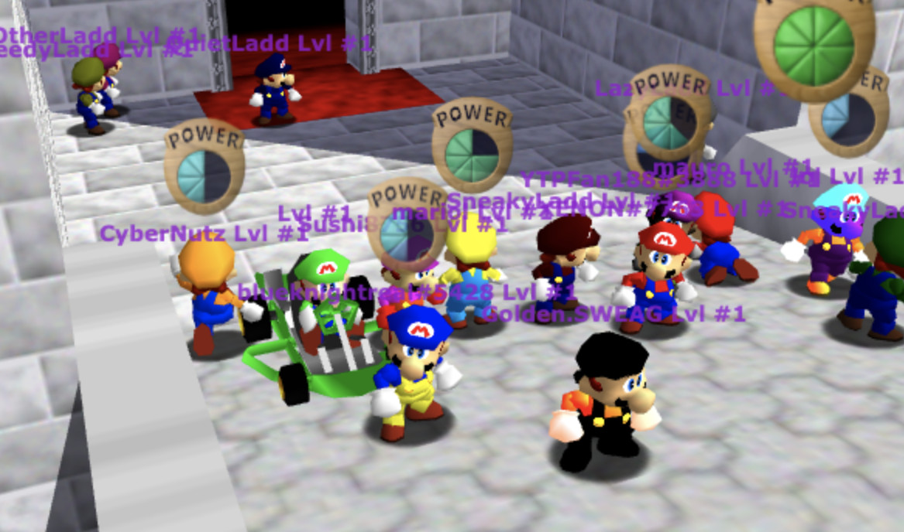
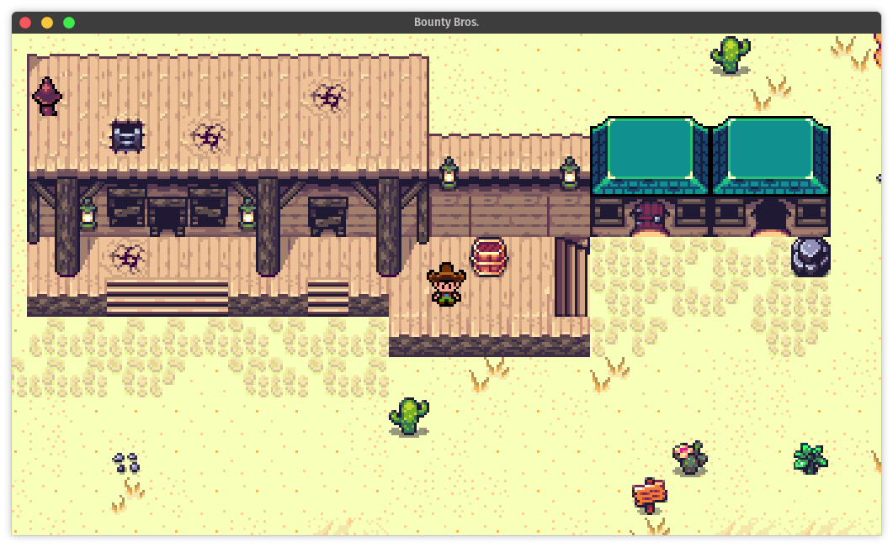
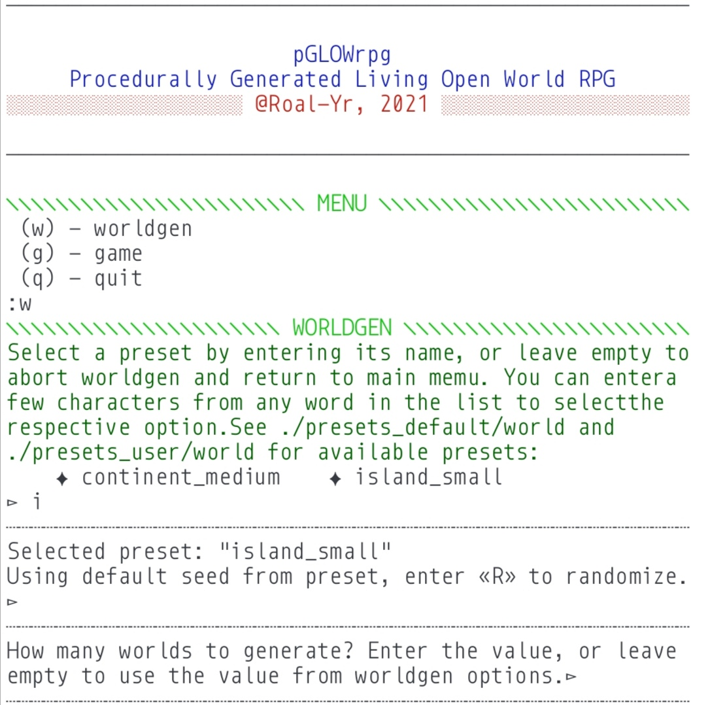
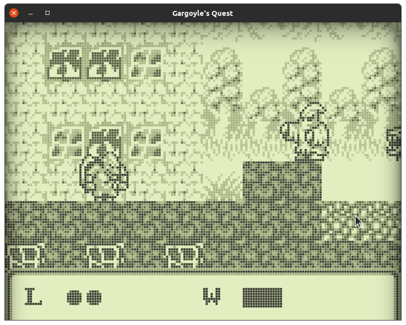
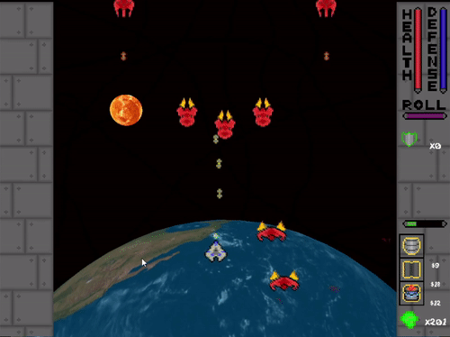
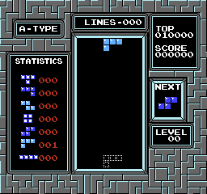
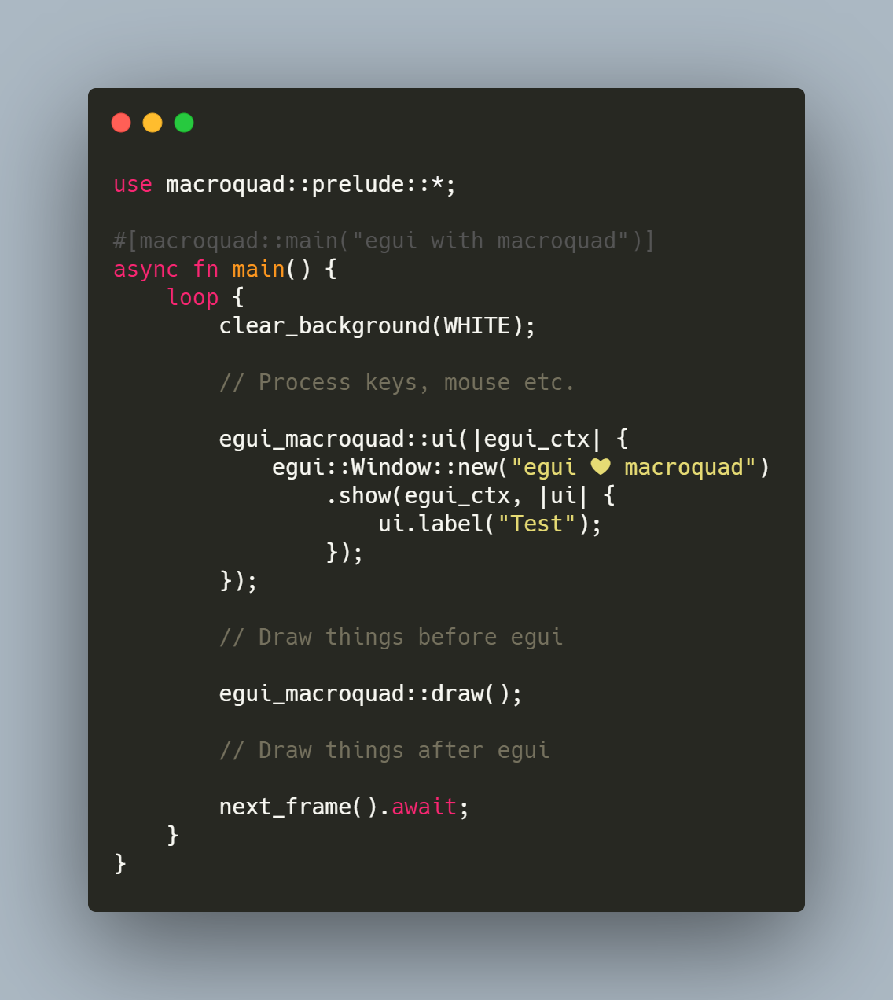

+++
title = "This Month in Rust GameDev #20 - March 2021"
date = 2021-04-06
transparent = true
draft = true
+++

<!-- Check the post with markdownlint-->

Welcome to the 20th issue of the Rust GameDev Workgroup's
monthly newsletter.
[Rust] is a systems language pursuing the trifecta:
safety, concurrency, and speed.
These goals are well-aligned with game development.
We hope to build an inviting ecosystem for anyone wishing
to use Rust in their development process!
Want to get involved? [Join the Rust GameDev working group!][join]

You can follow the newsletter creation process
by watching [the coordination issues][coordination].
Want something mentioned in the next newsletter?
[Send us a pull request][pr].
Feel free to send PRs about your own projects!

[Rust]: https://rust-lang.org
[join]: https://github.com/rust-gamedev/wg#join-the-fun
[pr]: https://github.com/rust-gamedev/rust-gamedev.github.io
[coordination]: https://github.com/rust-gamedev/rust-gamedev.github.io/issues?q=label%3Acoordination

[Rust]: https://rust-lang.org
[join]: https://github.com/rust-gamedev/wg#join-the-fun

- [Game Updates](#game-updates)
- [Learning Material Updates](#learning-material-updates)
- [Engine Updates](#engine-updates)
- [Library & Tooling Updates](#library-tooling-updates)
- [Popular Workgroup Issues in Github](#popular-workgroup-issues-in-github)
- [Meeting Minutes](#meeting-minutes)
- [Requests for Contribution](#requests-for-contribution)
- [Jobs](#jobs)
- [Bonus](#bonus)

<!--
Ideal section structure is:

```
### [Title]


_image caption_

A paragraph or two with a summary and [useful links].

_Discussions:
[/r/rust](https://reddit.com/r/rust/todo),
[twitter](https://twitter.com/todo/status/123456)_

[Title]: https://first.link
[useful links]: https://other.link
```

If needed, a section can be split into subsections with a "------" delimiter.
-->

## Rust GameDev Meetup


The second Rust Gamedev Meetup happened in February. It was an opportunity for
developers to show off what Rust projects they've been working on in the game
ecosystem. Developers showed off game engine demos, in-game playthroughs,
tooling, and more. You can watch the recording of the meetup [here on
Youtube][gamedev-meetup-video].

The next meetup will take place on the 10th of April at 16:00 GMT on the [Rust
Gamedev Discord server][rust-gamedev-discord], and can also be [streamed on
Twitch][rust-gamedev-twitch]. If you would like to show off what you've been
working on, fill out [this form][gamedev-meetup-form].

[gamedev-meetup-form]: https://forms.gle/BS1zCyZaiUFSUHxe6
[gamedev-meetup-video]: https://www.youtube.com/watch?v=gqCxt8XL92o
[rust-gamedev-discord]: https://discord.gg/yNtPTb2
[rust-gamedev-twitch]: https://www.twitch.tv/rustgamedevmeetup

## Game Updates

### [MineWars][minewars]


[MineWars][minewars] ([Twitter][minewars-twitter], [Reddit][minewars-reddit])
by @jamadazi is Minesweeper reimagined as a Multiplayer Real Time Strategy!

Capture mines. Move them around. Cause explosion chains. Take out enemy mines.
Defend your Cities. Fight for territory. Eliminate other players. Play on a
procedurally-generated map.

The game has been privately in development for many months and was just
announced publicly. The project is currently working towards an alpha release
for public playtesting. Read the announcement on the [website][minewars] for
more information.

Made in the [Bevy Game Engine][bevy].

[minewars]: https://minewars.cc
[minewars-twitter]: https://twitter.com/MineWarsGame
[minewars-reddit]: https://reddit.com/r/minewars
[bevy]: https://bevyengine.org

### [SM64JS][sm64js]



[SM64JS][sm64js] ([GitHub][sm64js-github], [Discord][sm64js-discord]) is a rewrite
of the decompilation project of Super Mario 64 in JavaScript with a strong focus
on massive multiplayer online.
The [backend][sm64js-server] recently has been rewritten in Rust by [@marior]
and is now live.

You can find more information about it in [this recent blog post][net64-blog],
where the developers of a similar mod called Net64 are talking
about several decompilation projects.

Some of the most recent additions are:

- Carts and gliders
- Health bars
- More visuals with butterflies and fishes

A stress test is scheduled for 2021-04-17 17:30 UTC and everyone is invited to join.

[@marior]: https://twitter.com/marior_dev
[sm64js]: https://sm64js.com
[sm64js-github]: https://github.com/sm64js/sm64js
[sm64js-discord]: https://discord.gg/7UaDnJt
[sm64js-server]: https://github.com/sm64js/sm64js-mmo-server
[net64-blog]: https://net64-mod.github.io/blog/sm64js/

### [Bounty Bros.][bounty_bros]

[][bounty_bros_webgame]
_Click the image to play the game in your browser!_

[Bounty Bros.][bounty_bros] is a prototype game similar to the old Legend of
Zelda® games developed by [Katharos Technology][katharostech] as a testing
ground for a future commercial game.

In the last 2 months Bounty Bros. has gotten a lot of updates. Now you can [play
the game][bounty_bros_webgame] right inside of your browser on desktop or mobile
devices!

- You can no longer walk through walls or objects
- You can now walk into buildings
- The camera follows the player without passing beyond the map borders
- Rendering is now scaled pixel-perfect
- Mobile touch controls were added
- There is a new [retro mode][bounty_bros_retro_mode] that tries to make it it
  look like the game is running on an old CRT television.

All of the source code, excluding assets and artwork, was also made available
and split into two independent projects.

These projects were released under the
[Katharos License][katharos_license]. This license has moral and ethical
implications that you may or may not agree with, so please read it before making
use of these projects:

- [Bevy Retro][bevy_retro]: A Bevy plugin for pixel-perfect games
- [Skip'n Go][skipngo]: A simple game engine for making top-down pixel games

You can read the full update in the [Blog Post][bounty_bros_blog_post].

_Discussions: [Skip'n Go on GitHub][skipngo_discussions], [Bevy Retro on GitHub][bevy_retro_discussions]_

[bevy_retro]: https://github.com/katharostech/bevy_retro
[bevy_retro_discussions]: https://github.com/katharostech/bevy_retro/discussions
[katharostech]: https://katharostech.com
[skipngo]: https://github.com/katharostech/skipngo
[skipngo_discussions]: https://github.com/katharostech/skipngo/discussions
[bounty_bros]: https://katharostech.com/post/bounty-bros-on-web
[bounty_bros_webgame]: https://skipngo.katharostech.com/?asset_url=https://bounty-bros.skipngo.katharostech.com/
[bounty_bros_blog_post]: https://katharostech.com/post/bounty-bros-on-web
[bounty_bros_retro_mode]: https://skipngo.katharostech.com/?asset_url=https://bounty-bros.skipngo.katharostech.com/&enable_crt=true&pixel_aspect_ratio=1.3
[katharos_license]: https://github.com/katharostech/katharos-license

### [pGLOWrpg][pglowrpg-github]



[pGLOWrpg][pglowrpg-github] by [@Roal_Yr]
is a Procedurally Generated Living Open World RPG,
a long-term project in development, which aims to be a narrative text-based game
with maximum portability and accessibility.

Recent updates include:

- Reformatting a print interface, making it very easy to link text UI and code.
- Switching to .ron file format for storing configs and strings.
- Implementing individual strings coloring for better visual perception.

_Discussions: [Twitter][pglowrpg-twitter]_

[@Roal_Yr]: https://twitter.com/Roal_Yr
[pglowrpg-twitter]: https://twitter.com/pglowrpg
[pglowrpg-github]: https://github.com/roalyr/pglowrpg

### [Orbital Decay][orbital-decay]


_Orbital Decay gameplay_

[Orbital Decay][orbital-decay] by [@stevebob] is an
[open-source][orbital-decay-source] turn-based tactical roguelike with a focus
on ranged combat.  Deal enough damage to enemies to get through their armour
without breaching the hull of the station, or risk being pulled into the void.
It was made for the [7 Day Roguelike 2021][7drl-2021] game jam.

Traverse a procedurally-generated space station to reach the fuel bay on the
5th floor. Choose your weapons and upgrades wisely to make it past the
station's former crew - now a horde of ravenous undead.

Read more about Orbital Decay on its [development blog][orbital-decay-blog].

[orbital-decay]: https://gridbugs.itch.io/orbital-decay
[orbital-decay-source]: https://github.com/stevebob/orbital-decay
[@stevebob]: https://github.com/stevebob
[7drl-2021]: https://itch.io/jam/7drl-challenge-2021
[orbital-decay-blog]: https://www.gridbugs.org/7drl2021-day7/

### Stellary 2

[][stellary2-ppcv-tweet]
_▶️ Click to [watch the full video][stellary2-ppcv-tweet]_

Stellary 2 by [@CoffeJunkStudio][coffe-junk-studio] is a 3D real-time space
shooter in which the player has to control his spaceship to colonize each planet
in the solar system.

In the last month, the game concept has been overhauled. Most importantly:

- Planets become inhabitable over time, starting with the outermost one in order
  to bring head-to-head matches to an end eventually.
- Full focus on multiplayer, including AIs
- Players can’t die mid-game anymore. When defeated, they re-spawn and lose a
  colony for it (if they have one) instead of dying. This prevents long waiting
  times when playing against friends.

You can follow the development of Stellary 2 on [Twitter][coffe-junk-studio].

[coffe-junk-studio]: https://twitter.com/CoffeJunkStudio
[stellary2-ppcv-tweet]: https://twitter.com/CoffeJunkStudio/status/1378719827347509249

### [A/B Street]


[A/B Street] by [@dabreegster] is a traffic simulation game exploring how small
changes to roads affect cyclists, transit users, pedestrians, and drivers, with
support for any city with OpenStreetMap coverage.

In March, elevation data courtesy of [Eldan] was imported, letting cycling
speeds uphill be adjusted. Importing any area from OpenStreetMap can now be
done from the UI with no command-line experience, and custom travel demand
models based on UK-wide census data can now be generated. Some important
simulation fixes for roundabouts improve gridlock, and [Michael] and [Yuwen]
helped adjust the UI panel layout for smaller screens.

[A/B Street]: https://github.com/a-b-street/abstreet
[@dabreegster]: https://twitter.com/CarlinoDustin
[Eldan]: https://github.com/eldang/
[Michael]: https://github.com/michaelkirk
[Yuwen]: https://www.yuwen-li.com/

### [Egregoria]


[Egregoria] ([GitHub][Egregoria], [Discord][egregoria-discord])
by [@Uriopass]
is a simulation oriented city builder that tries
to replicate modern society as well as possible.

The [8th devlog][egregoria-blog-post] was published.
Updates include:

- Multiplayer based on deterministic lockstep
- Economy revamp inspired by Anno 1800
- Infinite world using procedural generation
- Many more QoL features

See also the [YouTube summary video][egregoria-youtube]
of the past 6 months of development.

[Egregoria]: https://github.com/Uriopass/Egregoria
[@Uriopass]: https://github.com/Uriopass
[egregoria-blog-post]: https://douady.paris/blog/egregoria_8.html
[egregoria-discord]: https://discord.gg/CAaZhUJ
[egregoria-youtube]: https://youtu.be/qH2SKWbRV5I

### [Fishgame][fishgame]


_Game footage with the new weapon._

[Fishgame][fishgame] [(web build)][fishgame-itch] is an online multiplayer game,
created in a collaboration between [Nakama][nakama], an open-source scalable
game server, and the [Macroquad](https://github.com/not-fl3/macroquad/) game
engine.

This month fishgame migrated to [nakama-rs] (featured in this newsletter as
well).

Also a second weapon, the sword, was added to the game.

[fishgame]: https://github.com/heroiclabs/fishgame-macroquad
[fishgame-itch]: https://fedorgames.itch.io/fish-game?secret=UAVcggHn332a
[nakama]: https://heroiclabs.com/
[macroquad]: https://github.com/not-fl3/macroquad
[nakama-rs]: https://github.com/not-fl3/nakama-rs

### [Gargoyle's Quest]



[Gargoyle's Quest] by [@ShamylZakariya] is an implementation of level one
of the 1990 [Gameboy platformer][gargoyle-wiki] built using [wgpu].

[Gargoyle's Quest]: https://github.com/ShamylZakariya/Platformer
[@ShamylZakariya]: https://github.com/ShamylZakariya
[gargoyle-wiki]: https://en.wikipedia.org/wiki/Gargoyle%27s_Quest
[wgpu]: https://github.com/gfx-rs/wgpu-rs

### [Veloren][veloren]


_Waiting for the airship to land_

[Veloren][veloren] is an open world, open-source voxel RPG inspired by Dwarf
Fortress and Cube World.

In March, Veloren released 0.9. Lots of work throughout the month was put
towards preparing for this. NPC merchants and trading was merged. Many changes
were made to combat, including buffs and combat. Player-to-player trading was
also implemented. Lots of work was done in optimizing Veloren. This included
significantly improving how long physics was talking, and network improvements.
Metrics tracking was also overhauled to better track the different systems in
Veloren. Pathfinding is also working through an overhaul. A large feature
implemented in March was Airships being merged into the game. This prompted a
redo of how physics in the game is handled.

A survey was sent out in preparation for the release. A lot of information was
gathered about how players experience Veloren, and the items they like or don't
like. These can all be ready in [devblog #112](https://veloren.net/devblog-112).
This was followed up by the 0.9 release, which turned out to be the largest yet.
At peak, 133 players joined the main server. There were problems throughout the
release party relating to networking, as well as our tick performance.

March's full weekly devlogs: "This Week In Veloren...":
[#109](https://veloren.net/devblog-109),
[#110](https://veloren.net/devblog-110),
[#111](https://veloren.net/devblog-111),
[#112](https://veloren.net/devblog-112).
[#113](https://veloren.net/devblog-113).

[veloren]: https://veloren.net

### [Theta Wave]

[][Theta Wave]
_Enemies can now be easily spawned in formations_

[Theta Wave] is an open-source space shooter game by developers [@micah_tigley] and
[@carlosupina]. It is one of the showcase games for the [Amethyst Engine]. In
the past month, the ["Foundations"] update was released which included numerous
refactors that improved the accessibility of contributing to the game.

They are now working on the ["Formations"] update which will organize how
waves of enemies are spawned into the game.

Notable changes:

- Formations can be defined in a data file
- New `InvasionFormation` phase where formations of enemies are spawned from
a pool of formations

[Theta Wave]: https://github.com/amethyst/theta-wave
[@micah_tigley]: https://twitter.com/micah_tigley
[@carlosupina]: https://twitter.com/carlosupina
[Amethyst Engine]: https://amethyst.rs/
["Foundations"]: https://github.com/amethyst/theta-wave/releases/tag/v0.1.4
["Formations"]: https://github.com/amethyst/theta-wave/projects/2

### [Harvest Hero][hh_disc]


[Harvest Hero][hh_disc] by [@bombfuse][bmb_twitter]
is an arcade/roguelite where you whack Groobles.

Harvest Hero has undergone a large change, migrating
from semi-randomly generated levels to handcrafted levels
that are randomly selected throughout your playthrough.

This means using [Ogmo][ogmo] to design levels,
and using [nano-ogmo][nano-ogmo] to import them.

Built on top of [Emerald](#Emerald).

Updates:

- General UI update
- Importing ogmo levels via nano-ogmo
- [April Fools demo][gag_demo]

_Discussions: [Discord][hh_disc], [Twitter][bmb_twitter]_

[hh_disc]: https://discord.gg/CJRbxQn3d9
[bmb_twitter]: https://twitter.com/bombfuse_dev
[ogmo]: https://ogmo-editor-3.github.io/
[nano-ogmo]: https://github.com/Bombfuse/nano-ogmo
[gag_demo]: https://bombfuse.itch.io/him-character-demo-harvest-hero

### [Station Iapetus]

[][si-youtube]
_Check [gameplay video][si-youtube] on YouTube_

[Station Iapetus][Station Iapetus] by [@mrDIMAS] is a 3rd person shooter on the
prison Iapetus near the Saturn.

- Inventory fixes and improvements
- Splash damage for grenades
- Weapon recoil
- More items
- Bots now hear player
- More assets
- First level improvements
- Procedural animation of impact for bots
- More sounds
- Separate scene for menu with music
- Pause game when in menu
- More switches in options menu
- Turrets

[@mrDIMAS]: https://github.com/mrDIMAS
[rg3d]: https://github.com/mrDIMAS/rg3d
[Station Iapetus]: https://github.com/mrDIMAS/StationIapetus
[si-youtube]: https://www.youtube.com/watch?v=O_ETjSkVBME

### [Aladin Lite]


_Mars heightmap with a RdBu colormap rendered with Aladin Lite v3_

[Aladin Lite] is a spatial image survey visualizer developed by the [Astronomical
Observatory of Strasbourg] in France. Since its first release in 2013,
[Aladin Lite] has been used by astronomers as well as amateurs that
are curious about exploring the sky.

Originally developed using 2D Javascript canvas, its core has been fully
rewritten in Rust and WebGL2 using [wasm-bindgen].
New features include:

- The support of multiple allsky projections (mercator, aitoff, ...)
- The blending of multiple surveys
- The support of FITS file images

For more information, see a [talk][adass-talk] done at the ADASS 2020
conference. A web page is also available [here][al-test-url] for you to test.
You are also very welcolme to contribute to the project by e.g. posting issues
on our github.

[Astronomical Observatory of Strasbourg]: https://cds.u-strasbg.fr/index-fr.gml
[Aladin Lite]: https://github.com/cds-astro/aladin-lite/tree/develop
[wasm-bindgen]: https://github.com/rustwasm/wasm-bindgen
[adass-talk]: https://www.youtube.com/watch?v=TILtJOiiRoc
[al-test-url]: https://bmatthieu3.github.io/hips_webgl_renderer/index.html

### [Portal Explorer][portal-explorer]


_"Portal in portal" scene_

[Portal Explorer][portal-explorer] by [@optozorax][optozorax-twitter] is a web
visualizator of mind-blowing portals.

In Portal Explorer you can view how interesting portals are constructed, and
visually explore their properties by moving and rotating them. This program
doesn't work well on mobile, better opened from PC. The most interesting
scene is [portal in portal][portal-in-portal].

Created using ray-tracing in shaders, engine is [macroquad][macroquad-git],
interface is [egui][egui-git].

[portal-explorer]: https://github.com/optozorax/portal
[optozorax-twitter]: https://twitter.com/optozorax
[portal-in-portal]: https://optozorax.github.io/portal/?scene=portal_in_portal
[macroquad-git]: https://github.com/not-fl3/macroquad
[egui-git]: https://github.com/emilk/egui

### [Name Needed][name-needed]


_Agents wandering around, hauling items and digging blocks_

[Name Needed][name-needed] by [@DomWilliams0][domwilliams-github] is a one man
effort to produce an open source, intuitive and high performance Dwarf
Fortress-esque game.

The engine is custom, built with SDL2 and OpenGL. It's still early days, but
steady progress has been made over the last 18 months. The developer aims to
release occasional technical devlogs about interesting parts of the engine,
which so far include:

- [Long term vision and goals][name-needed-devlog0]
- [High level engine architecture][name-needed-devlog1]
- [Intelligent entity behaviors][name-needed-devlog2]

[name-needed]: https://github.com/DomWilliams0/name-needed
[domwilliams-github]: https://github.com/DomWilliams0
[name-needed-devlog0]: https://domwillia.ms/devlog0/
[name-needed-devlog1]: https://domwillia.ms/devlog2/
[name-needed-devlog2]: https://domwillia.ms/devlog4/

## Engine Updates

### [Tetra]

[Tetra] is a simple 2D game framework, inspired by XNA, Love2D, and Raylib. This
month, versions 0.6.1 and 0.6.2 were released, featuring:

- Support for blend modes and premultiplied alpha
- Scissor rectangles (useful for UI rendering)
- Word wrapping for text
- More events and methods for tracking/controlling the window's state
- Bugfixes and docs improvements

For more details, see the [changelog][tetra-changelog].

Additionally, a [template repository][tetra-template] has been created,
demonstrating some useful patterns for structuring a Tetra project.

[Tetra]: https://github.com/17cupsofcoffee/tetra
[tetra-changelog]: https://github.com/17cupsofcoffee/tetra/blob/main/CHANGELOG.md
[tetra-template]: https://twitter.com/17cupsofcoffee/status/1357750836370284544

### [Starframe]


[Starframe] by [@moletrooper] is a work-in-progress game engine for physics-y
sidescrolling 2D games.

This month, its physics engine was revamped once more (for the last time,
hopefully), implementing a modern solver method called Extended Position-Based
Dynamics. Also, [a blog post][sf-blog-post] was published, covering the
development of the physics engine so far in a great deal of mathematical
detail.

_Discussions:
[twitter (physics update)][sf-update-tweet],
[twitter (blog post)][sf-blog-tweet]_

[starframe]: https://github.com/moletrooper/starframe
[@moletrooper]: https://twitter.com/moletrooper
[sf-blog-post]: https://moletrooper.github.io/blog/2021/03/starframe-devlog-constraints/
[sf-blog-tweet]: https://twitter.com/moletrooper/status/1377273607450136576
[sf-update-tweet]: https://twitter.com/moletrooper/status/1360723470414450688

### Emerald


[Emerald][emerald_github] by [@bombfuse][bombfuse_twitter]
is a 2D game engine focused on being as portable as possible.

The ultimate goal of Emerald is to be a fully
featured engine that you can slap onto any
device with relative ease.
It's currently able to run on WASM,
Raspberry Pi, Mac, Windows, and Linux
thanks to [miniquad][miniquad_git].

Features:

- Physics via [rapier2d][rapier_2d]
- ECS via [hecs][hecs_git]
- Font rendering via [fontdue][fontdue_git]

New Updates:

- Rendering to textures
- [WASM game sample][em_wasm_example]

[bombfuse_twitter]: https://twitter.com/bombfuse_dev
[emerald_github]: https://github.com/Bombfuse/emerald
[rapier_2d]: https://github.com/dimforge/rapier
[miniquad_git]: https://github.com/not-fl3/miniquad
[em_wasm_example]: https://bombfuse.itch.io/him-character-demo-harvest-hero
[hecs_git]: https://github.com/Ralith/hecs
[fontdue_git]: https://github.com/mooman219/fontdue

### [rg3d]


[rg3d] ([Discord][rg3d_discord], [Twitter][rg3d_twitter]) is a game engine that
aims to be easy to use and provide a large set of out-of-box features. Some of
the recent updates:

- Context menus and tooltips (huge thanks to [MinusGix])
- Performance improvements for UI
- Parallax Mapping
- Ability to enable/disable scenes
- Expansion strategies for TreeView
- LOD system fixes
- Graphical fixes
- First version of engine's architecture overview
- Various bug fixes and small improvements

[Editor][rusty-editor] updates:

- Ability to edit collision groups and mask for colliders
- Ability to clear command stack
- Ability to change render path for meshes
- LOD editor
- "Collapse All", "Expand All", "Locate Selection" buttons for world outliner
- "Fit Collider" feature fixes
- Picking fixes
- Change selection when paste from clipboard
- "Slow" and "Fast" camera movement modifiers
- Navmesh selection fixes
- Simple TBN visualizer
- Parallax mapping switch in settings

[rg3d]: https://github.com/mrDIMAS/rg3d
[rg3d_discord]: https://discord.gg/xENF5Uh
[rg3d_twitter]: https://twitter.com/DmitryNStepanov
[rusty-editor]: https://github.com/mrDIMAS/rusty-editor
[MinusGix]: https://github.com/MinusGix

## Learning Material Updates

### [Bevy Cheatbook: Major Overhaul for Bevy 0.5][bevy_cheatbook]

The Unofficial Bevy Cheatbook by @jamadazi is a practical reference book for
the [Bevy Game Engine][bevy]. It teaches programming patterns, features, and
solutions to common problems. Written to be concise and easy to learn from.

The book recently got a major overhaul for the big new Bevy 0.5 release. Many
pages were expanded or rewritten, new content added, and community feedback
addressed.

If you are interested in Bevy, this book is now one of the most detailed
learning resources. Have fun making cool things with Bevy!

[bevy_cheatbook]: https://bevy-cheatbook.github.io
[bevy]: https://bevyengine.org

### [Reverse-Engineering NES Tetris to add Hard Drop][tetris-hard-drop]

 _NES Tetris
with Hard Drop and Ghost Piece_

A [blog post][tetris-hard-drop] describing the process of reverse-engineering
the rendering and input-handling logic in the NES version of Tetris, and using
a [rust embedded domain-specific language][tetris-hard-drop-dsl-example] to
make a [patching tool][tetris-hard-drop-patch-tool] that generates code (6502
machine code) to add hard drop (instantly dropping the current piece) and to
render a ghost piece (the dotted outline showing where the current piece will
land).

The patching tool uses the crate
[mos6502_assembler][tetris-hard-drop-assembler] to specify 6502 assembly in
rust and generate machine code. Many of the reverse-engineering experiments
were done using [this rust NES emulator][tetris-hard-drop-nes-emulator].  The
result is available as an [IPS Patch][tetris-hard-drop-ips-patch].

_Discussions: [Hacker News](https://news.ycombinator.com/item?id=26530604),
[/r/rust](https://reddit.com/r/rust/comments/ma6jqz/using_a_rust_dsl_to_add_hard_drop_to_nes_tetris/)_

[tetris-hard-drop]:
https://www.gridbugs.org/reverse-engineering-nes-tetris-to-add-hard-drop/
[tetris-hard-drop-nes-emulator]:
https://github.com/stevebob/mos6502/tree/master/nes-emulator
[tetris-hard-drop-assembler]:
https://github.com/stevebob/mos6502/tree/master/assembler
[tetris-hard-drop-ips-patch]:
https://github.com/stevebob/mos6502/raw/master/tetris-hard-drop-patcher/tetris-hard-drop.ips
[tetris-hard-drop-patch-tool]:
https://github.com/stevebob/mos6502/tree/master/tetris-hard-drop-patcher
[tetris-hard-drop-dsl-example]:
https://github.com/stevebob/mos6502/blob/master/tetris-hard-drop-patcher/src/main.rs#L23

### [Bevy game template][bevy-game-template]

[Bevy game template][bevy-game-template] by [@nikl_me][nikl_twitter]
is a template repository for a Bevy game.

The goal is to present a possible structure for Bevy games and at the
same time reduce the amount of copy paste when starting a new project.
The repository includes a GitHub workflow for Linux, MacOS, and Windows builds
(WASM will be supported soon) and comes with a small, opinionated example game.

[bevy-game-template]:https://github.com/NiklasEi/bevy_game_template
[nikl_twitter]: https://twitter.com/nikl_me

### [Tutorial: Writing a tiny Entity Component System in Rust][ecs-in-rust]

[@kettlecorn][kettlecorn_twitter] wrote
a beginner-friendly [tutorial][ecs-in-rust] that dives into the
inner workings of the Entity-Component-System pattern.
The tutorial walks through a minimalist ECS
implementatation to illustrate how the pattern works, and
why it's useful.

*Discussion: [/r/rust](https://www.reddit.com/r/rust/comments/m88ywa/tutorial_writing_a_tiny_entity_component_system/)*

[kettlecorn_twitter]: https://twitter.com/kettlecorn
[ecs-in-rust]:https://ianjk.com/ecs-in-rust/

## Library & Tooling Updates

### [kira]

[kira] by [@tesselode] is a game audio library tailored to composers and other
people who need expressive audio.

v0.5.0 was released with mixer send tracks, new effects, and playback position tracking
for instances, as well as a variety of smaller improvements.

_Discussions: [/r/rust](https://www.reddit.com/r/rust/comments/m0llxm/kira_game_audio_library_v050_playback_position/),
[Twitter](https://twitter.com/tesselode/status/1368984205947006976)_

[Kira]: https://github.com/tesselode/kira
[@tesselode]: https://twitter.com/tesselode

### [Bevy Retro][bevy_retro]


_Pixel-perfect collision [example][bevy_retro_collision_example]_

[Bevy Retro][bevy_retro] is a new [Bevy] plugin designed for making pixel-perfect
games.

This project was released under the [Katharos License][katharos_license]. This
license has moral and ethical implications that you may or may not agree with,
so please read it before making use of this project.

Bevy Retro features:

- Web and desktop support out of the box
  - It even runs in Safari on iOS!
- Integer pixel coordinates
  - No need to round floats to keep pixels aligned!
- Support for sprites, sprite sheets and animations
- A super simple hierarchy system
- A custom, scaled, pixel-perfect renderer with three camera modes: fixed width,
  fixed height, and letter-boxed
- An [LDtk](https://ldtk.io) map loading plugin
- Pixel-perfect collision detection
- Support for post-processing effects using custom shaders or the built-in CRT filter
- Support for custom pixel aspect ratios

_Discussions: [GitHub](https://github.com/katharostech/bevy_retro/discussions)_

[bevy_retro]: https://github.com/katharostech/bevy_retro
[Bevy]: https://bevyengine.org
[katharos_license]: https://github.com/katharostech/katharos-license
[bevy_retro_collision_example]: https://github.com/katharostech/bevy_retro/tree/master/examples#collisions

### [Planck ECS]


[Planck ECS] ([GitHub][Planck ECS], [Blog][planck_blog],
[Patreon][planck_patreon]) by [@jojolepro]
is a brand new minimalist and safe ECS library.

The 1.0 release happened in the past month, featuring: various fixes,
quality of life improvements, removal of unsafe code and completion of tests and
documentation.

The library is currently considered completed, which means that all planned
features are implemented, tested and benchmarked. Future updates will focus on
performance improvements and usability improvements.

[Planck ECS] is also used in [Shotcaller][planck_shotcaller] which is featured in
this newsletter too.

You can read more about the library on the [Blog][planck_blog] and on
[GitHub][Planck ECS].

_Discussions: [/r/rust][planck_reddit], Discord: jojolepro#8057_

[@jojolepro]: https://github.com/jojolepro
[Planck ECS]: https://github.com/jojolepro/planck_ecs
[planck_shotcaller]: https://github.com/amethyst/shotcaller
[planck_blog]: https://jojolepro.com/blog/2021-01-13_planck_ecs/
[planck_patreon]: https://patreon.com/jojolepro
[planck_reddit]: https://www.reddit.com/r/rust/comments/m73ema/yet_another_ecs_library_except_much_safer/

### [hecs]

[hecs] is a fast, lightweight, and unopinionated archetypal ECS library.

Version 0.5 introduces a column-major serialization mode. This imitates the
in-memory data layout, enabling higher performance than the already-fast
row-major serialization mode. Because columnar layout places similar data
nearby, it also improves the effectiveness of compression.

Other changes include major optimizations to spawning entities and
adding/removing components, inspired by the archetype graph model recently
adopted by bevy.

[hecs]: https://github.com/Ralith/hecs

### [Quinn]

[Quinn] is an async-friendly implementation of the state-of-the-art QUIC
transport protocol soon to be standardized by the IETF.

QUIC is a uniquely versatile foundation for building application protocols. Its
support for low-latency communication, multiplexing, fine-grained reliability,
and security make an excellent basis for real-time game networking, providing an
array of powerful primitives unavailable on UDP or TCP.

[Quinn 0.7][quinn_release] introduces support for Tokio 1.0 and many
optimizations and bug fixes, and updates to [draft 32][quic_32] of the proposed
standard. With last call underway in the IETF, we expect to release an
implementation of the final standard soon with no major changes.

[Quinn]: https://github.com/quinn-rs/quinn
[quinn_release]: https://github.com/quinn-rs/quinn/releases/tag/0.7.0
[quic_32]: https://tools.ietf.org/html/draft-ietf-quic-transport-32

### [nakama-rs]

[nakama-rs] is a pure Rust implementation of the [Nakama] protocol.

[Nakama] is an open-source server designed to power modern games and apps.
Features include user accounts, chat, social, matchmaker, realtime multiplayer,
and much [more][heroiclabs].

Being pure Rust, [nakama-rs] brings the full API and socket options to any
platform Rust works on.

[nakama]: https://github.com/heroiclabs/nakama
[heroiclabs]: https://heroiclabs.com
[nakama-rs]: https://github.com/not-fl3/nakama-rs

### [wgpu]


Voxel Bunny rendering with conservative rasterization

[wgpu] is a [WebGPU] implementation in Rust. It is safe, efficient,
and portable: can target both native (Vulkan/D3D/Metal) and the Web.

Most progress in April was focused around [WGSL] shaders and validation.
[naga] has seen a lot of improvements in the SPIR-V and WGSL parsing, as well
as backend code generation. Most importantly, it now fully validates both
statements and expressions. No more accidental foot shots from adding vec2
and vec3 in the shaders!

The last and the biggest (in terms of shader complexity) example - "water"
has been successfully ported to WGSL 🎉.

A small addition to our native-only features - conservative rasterization
feature - was added by [@wumpf] and demonstrated on a voxel bunny 🐇

Finally, there is a blog post on Mozilla [graphics team blog] about the
progress using [wgpu] in Gecko.

_Discussions: [/r/rust_gamedev](https://www.reddit.com/r/rust_gamedev/comments/mgvd8d/last_big_wgpurs_example_shaders_are_fully_ported/)_

[naga]: https://github.com/gfx-rs/naga
[wgpu]: https://github.com/gfx-rs/wgpu
[WebGPU]: https://gpuweb.github.io/gpuweb/
[WGSL]: https://gpuweb.github.io/gpuweb/wgsl/
[@wumpf]: https://github.com/Wumpf
[graphics team blog]: https://mozillagfx.wordpress.com/2021/03/10/webgpu-progress/

### [smaa-rs]

The [smaa-rs] library provides fast and high quality post-process
anti-aliaising using the [SMAA algorithm]. It is designed to be
easy to integrate into other [wgpu] applications with only a few
added lines of code.

The 0.2 series released this month includes a steamlined API
which makes it easier to enable/disable anti-aliasing via a
configuration setting. Currently SMAA 1x is supported with
SMAA S2x likely to be added depending on interest.

[smaa-rs]: https://github.com/fintelia/smaa-rs
[SMAA algorithm]: http://www.iryoku.com/smaa/

### [rafx]


_Rafx rendering an example tilemap from [LDTK level editor][rafx-ldtk]_

Rafx is a multi-backend renderer that optionally integrates with the
[distill][rafx-distill] asset pipeline. This month, we introduced a fourth
layer to the library, `rafx-renderer`. It provides a plugin system, simplifying
framework setup in a project.

The demo now includes a tilemap renderer that integrates with the [LDTK level
editor][rafx-ldtk]. The `distill` integration processes the level files offline
for very efficient loading/rendering at runtime.

Sprite rendering in general is also much faster now. Scenes with 40k-100k
sprites can render at 60fps (measured on M1 mini) depending on
transparency/distinct Z values in the scene. New examples demonstrate tilemap
and sprite rendering.

Early work was also done to reuse descriptor sets across frames and reduce
dynamic memory allocation when working with descriptor sets. Rafx also
includes more options for HDR tonemapping.

[rafx]: https://github.com/aclysma/rafx
[rafx-distill]: https://github.com/amethyst/distill
[rafx-ldtk]: https://ldtk.io

### [rkyv]

[rkyv] is a zero-copy deserialization framework for Rust. It's similar to FlatBuffers
and Cap'n Proto and can be used for data storage and messaging.

A [benchmark][rust-serialization-benchmark] was put together to compare rkyv
against other leading serialization solutions and gather feedback and use
cases for development. A [summary and analysis][rkyv-is-faster-than] of the
results is also available.

Version 0.5 is hot off the presses and rolls up features from the 0.4
development cycle:

- Derive macros can now implement `PartialEq` and `PartialOrd` between
  archived and unarchived types
- Custom type bounds for serialization and deserialization can be added
  with derive attributes
- Helper types like [AlignedVec][rkyv-AlignedVec] and
  [Infallible][rkyv-Infallible] were introduced to improve ergonomics
- `const_generics` are now enabled by default
- Helper functions have been added to make getting root objects easier
- Several bugfixes and performance improvements

A [feedback issue][rkyv-feedback] is still open for providing feedback on
further development.

[rkyv]: https://github.com/djkoloski/rkyv
[rust-serialization-benchmark]: https://github.com/djkoloski/rust_serialization_benchmark
[rkyv-is-faster-than]: https://davidkoloski.me/blog/rkyv-is-faster-than
[rkyv-AlignedVec]: https://docs.rs/rkyv/0.5.0/rkyv/struct.AlignedVec.html
[rkyv-Infallible]: https://docs.rs/rkyv/0.5.0/rkyv/struct.Infallible.html
[rkyv-feedback]: https://github.com/djkoloski/rkyv/issues/67

### [WhatTheFrame]


[WhatTheFrame] by [@JMS55]
is a frame-based cpu profiler crate along with a [GTK] ([gtk4-rs]) based GUI.

This project aims to answer the question: Which frames of my game are slow, and why?

It aims to be simple to use, consisting of only 3 functions: Call `let _r = Profiler::new_frame()`
at the start of each frame, `let _r = Profiler::new_task("task_name")` whenever you
want to profile a task, and finally `Profiler::end_profiling()` once at the end.

You can then open the resulting `.wtf` profile in the GUI and analyze the results.

This month was spent designing and implementing both the GUI and profiler crate.
The core functionality of both programs are complete, and all that remains is
cleanup, tweaks, optimization, and finally packaging the GUI up.

[WhatTheFrame]: https://github.com/JMS55/whattheframe
[@JMS55]: https://github.com/JMS55
[GTK]: https://gtk.org/
[gtk4-rs]: https://github.com/gtk-rs/gtk4-rs#gtk4-rs-

### [Bitmapflow]


_Bitmapflow interpolating a walking mech animation_

Bitmapflow ([GitHub][Bitmapflow-GitHub]) by [@bauxitedev] is a tool to help you
generate [inbetweens] for animated sprites. In other words, it makes your
animations smoother. It uses [optical flow] to try to guess how the pixels move
between frames, and blends them accordingly. The results are far from perfect,
and probably require some editing by hand afterwards, but it can produce decent
results.

It supports loading and saving animated gifs, spritesheets and individual
frames.

The tool is written using godot-rust and executables are available for Windows,
although Linux support will be coming soon. (If you compile the program from
source, it already works on Linux.)

A full demonstration and walkthrough of the program is available on
[YouTube][Bitmapflow-Youtube].

You can try it out yourself on [itch.io][Bitmapflow-Itch].

_Discussions: [/r/rust_gamedev][Bitmapflow-Reddit]_

[Bitmapflow]: https://github.com/Bauxitedev/bitmapflow
[Bitmapflow-GitHub]: https://github.com/Bauxitedev/bitmapflow
[Bitmapflow-Youtube]: https://www.youtube.com/watch?v=rC359dDAMiI
[Bitmapflow-Reddit]: https://www.reddit.com/r/rust_gamedev/comments/mjw90q/introducing_bitmapflow_a_tool_to_generate/
[Bitmapflow-Itch]: https://bauxite.itch.io/bitmapflow
[@bauxitedev]: https://twitter.com/bauxitedev
[inbetweens]: https://en.wikipedia.org/wiki/Inbetweening
[optical flow]: https://en.wikipedia.org/wiki/Optical_flow

### [FemtoVG]


FemtoVG is a 2D canvas like vector graphics library based on nanovg that has
been previously featured in this newsletter.

This month, the FemtoVG team has implemented a new rendering backend based on
the `wgpu` framework. This work is being done in this [fork][femtovg-fork] of
FemtoVG and will be merged into the main repo soon. The team is currently
looking for users to try out the new backend and provide feedback.

Join the [FemtoVG Discord channel](https://discord.gg/V69VdVu).

[FemtoVG]: https://github.com/femtovg/femtovg
[femtovg-fork]: https://github.com/adamnemecek/femtovg

### [egui-macroquad]


_Code example of usage of this library._

[egui-macroquad] is a small library to use [egui][egui-git] inside of
[macroquad][macroquad-git]. It consists only of two functions.

[egui-macroquad]: https://github.com/optozorax/egui-macroquad
[macroquad-git]: https://github.com/not-fl3/macroquad
[egui-git]: https://github.com/emilk/egui

### Kajiya


Kajiya by [@h3r2tic]
is a real-time global illumination renderer.

It utilizes Vulkan Ray Tracing via [ash][ash] and [hassle-rs][hassle-rs] to
implement multi-bounce light transport in fully dynamic scenes. By shooting
only two rays per pixel on average, it keeps performance high; thanks to a
voxel-based light cache and extensive spatio-temporal filtering, it keeps
noise low. It supports physically-based rendering of [GLTF][gltf-rs] scenes,
and achieves a close match to reference path-tracing.

Kajiya is still in its infancy, and not yet available to the public, but you
can get glimpses of its development by following the author on [Twitter][h3r2tic-twitter].

[ash]: https://github.com/MaikKlein/ash
[hassle-rs]: https://github.com/Traverse-Research/hassle-rs
[gltf-rs]: https://github.com/gltf-rs/gltf
[@h3r2tic]: https://github.com/h3r2tic
[h3r2tic-twitter]: https://twitter.com/h3r2tic

### [building-blocks] v0.6.0


In v0.6.0, the [building-blocks] voxel library brings a couple important features
for scaling up to large maps:

- pyramids for level of detail
- multichannel arrays

There is still much work to be done to optimize the voxel mesh LOD at large
scales and improve the cosmetics of LOD transitions, but the preliminary work
has allowed us to demonstrate the feasibility of this approach with a new demo
that you can view [here](https://youtube.com/watch?v=fCP8xZYJiSI).

Full release notes are available on [here][blocks-notes].

_Discussions:
[/r/rust](https://reddit.com/r/rust_gamedev/comments/ma76je/buildingblocks_v060)_

[blocks-notes]: https://github.com/bonsairobo/building-blocks/releases/tag/v0.6.0
[building-blocks]: https://github.com/bonsairobo/building-blocks

## Popular Workgroup Issues in Github

<!-- Up to 10 links to interesting issues -->

## Meeting Minutes

<!-- Up to 10 most important notes + a link to the full details -->

[See all meeting issues][label_meeting] including full text notes
or [join the next meeting][join].

[label_meeting]: https://github.com/rust-gamedev/wg/issues?q=label%3Ameeting

## Requests for Contribution

<!-- Links to "good first issue"-labels or direct links to specific tasks -->

## Jobs

<!-- An optional section for new jobs related to Rust gamedev -->

## Bonus

<!-- Bonus section to make the newsletter more interesting
and highlight events from the past. -->

------

That's all news for today, thanks for reading!

Want something mentioned in the next newsletter?
[Send us a pull request][pr].

Also, subscribe to [@rust_gamedev on Twitter][@rust_gamedev]
or [/r/rust_gamedev subreddit][/r/rust_gamedev] if you want to receive fresh news!

<!--
TODO: Add real links and un-comment once this post is published
**Discussions of this post**:
[/r/rust](TODO),
[twitter](TODO).
-->

[/r/rust_gamedev]: https://reddit.com/r/rust_gamedev
[@rust_gamedev]: https://twitter.com/rust_gamedev
[pr]: https://github.com/rust-gamedev/rust-gamedev.github.io
