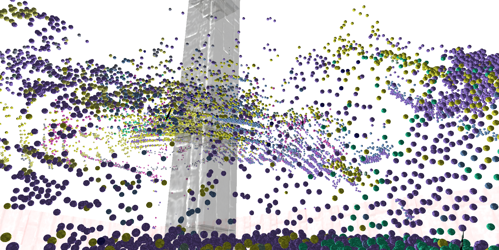

### [CyberGate]

_over a thousand balls were rained on us, but were handled smoothly by server/clients_

[CyberGate] ([https://discord.gg/R7DkHqw7zJ] [https://www.youtube.com/channel/UClrsOso3Xk2vBWqcsHC3Z4Q]) by [@CyberSoul#1991K]
is... {a new project that aims to be a procedurally generated Multiplayer RPG. CyberGate is the name of the main world where quantum portals can be created and used to access a new universe.  }.

Major Features:
- Bandwidth became 16 times smaller by implementing entity prioritization + other techniques 
- Interpolation and Jitter prediction makes entities way smoother
- Automatic and Reliable Spawn and Despawn of entities 

- Many other features and optimizations to do with rapier 3d physics, wgpu renderer and quinn (quic) protocol.

_Discussions: [/r/rust_gamedev](https://www.reddit.com/r/rust_gamedev/comments/vy7vms/multiplayer_stress_test_1_million_balls/)_

[CyberGate]: https://discord.gg/R7DkHqw7zJ (Join to participate in tests)
